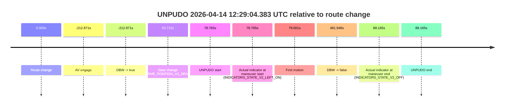
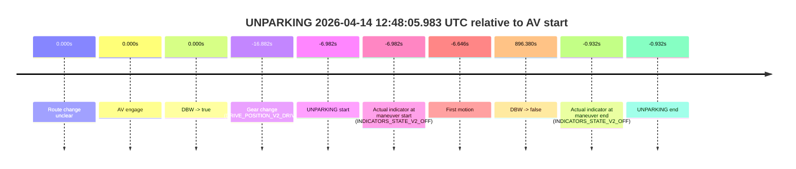
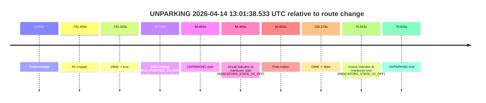
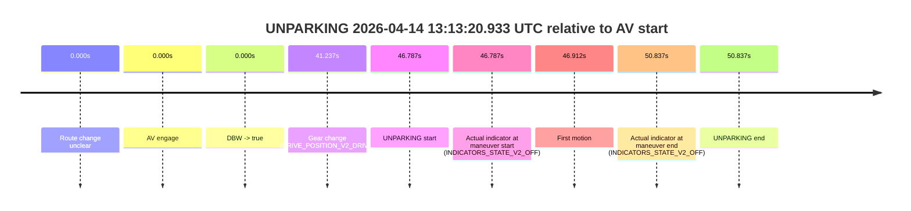

# Run Report: fme20040/2026-04-14--11-58-50--gen2-av-90560185-3296-43ba-9ec3-6a1693f1514a

| Field | Value |
|---|---|
| Run ID | `fme20040/2026-04-14--11-58-50--gen2-av-90560185-3296-43ba-9ec3-6a1693f1514a` |
| Date | `2026-04-14` |
| Model(s) | `harlequin-excited-greyhound` |
| Author | `boris.indelman` |
| Event count | `17` |

## unpudo 2026-04-14 12:21:47.383 UTC

| Field | Value |
|---|---|
| Model | `harlequin-excited-greyhound` |
| Author | `boris.indelman` |
| Run ID | `fme20040/2026-04-14--11-58-50--gen2-av-90560185-3296-43ba-9ec3-6a1693f1514a` |
| Date | `2026-04-14` |
| Time (UTC) | `12:21:47.383` |
| Event type | `unpudo` |
| Disengagement type | `none observed` |
| Route change | `found` |
| Console | [run](https://console.sso.wayve.ai/run/fme20040/2026-04-14--11-58-50--gen2-av-90560185-3296-43ba-9ec3-6a1693f1514a?id=&time-unixus=1776169307383305) |
| Foxglove | [segment](https://app.foxglove.dev/wayve-on-prem/p/prj_0dX18KZdVHg1fmmI/view?ds=foxglove-stream&ds.deviceName=fme20040&ds.start=2026-04-14T12%3A20%3A44.568238Z&ds.end=2026-04-14T12%3A24%3A16.165508Z&layoutId=lay_0e7VD4WIKDQGU73Y&time=2026-04-14T12%3A21%3A47.383305Z) |

### Event card: pass

- Pass: AV owns the credited unpudo through the official event window, the gear state is aligned at the anchor, and the vehicle moves without driver accelerator help in AV.

| Event | Time (UTC) | Delta from route change |
|---|---:|---:|
| Route change | 2026-04-14 12:20:54.568 | `0.000s` |
| AV engage | 2026-04-14 12:20:54.576 | `0.009s` |
| DBW -> true | 2026-04-14 12:20:54.576 | `0.009s` |
| Gear change (DRIVE_POSITION_V2_DRIVE) | 2026-04-14 12:21:22.233 | `27.665s` |
| UNPUDO start | 2026-04-14 12:21:47.383 | `52.815s` |
| Actual indicator at maneuver start (INDICATORS_STATE_V2_OFF) | 2026-04-14 12:21:47.383 | `52.815s` |
| First motion | 2026-04-14 12:21:47.419 | `52.851s` |
| DBW -> false | 2026-04-14 12:24:06.165 | `191.597s` |
| Actual indicator at maneuver end (INDICATORS_STATE_V2_OFF) | 2026-04-14 12:21:51.883 | `57.315s` |
| UNPUDO end | 2026-04-14 12:21:51.883 | `57.315s` |

| Metric | Value |
|---|---|
| Outcome | `pass` |
| Effective failure type | `none` |
| Route change status | `found` |
| DBW at event start | `true` |
| DBW at event end | `true` |
| Predicted gear at AV start | `DRIVE_POSITION_V2_DRIVE` |
| Actual gear at AV start | `DRIVE_POSITION_V2_DRIVE` |
| Predicted gear at event start | `DRIVE_POSITION_V2_DRIVE` |
| Actual gear at event start | `DRIVE_POSITION_V2_DRIVE` |
| Planned indicator direction | `INDICATORS_STATE_V2_RIGHT_ON` |
| Controller indicator direction | `INDICATORS_STATE_V2_RIGHT_ON` |
| Actual indicator direction | `INDICATORS_STATE_V2_OFF` |
| Actual indicator at maneuver end | `INDICATORS_STATE_V2_OFF` |
| Driver accel help in AV | `false` |
| Driver accel help timestamp | `n/a` |
| Max accel pedal pct in AV | `0.0%` |
| Max brake pedal pct in AV | `0.0%` |
| Max speed mps in AV | `4.458` |
| Route -> AV | `0.009s` |
| AV -> event start | `52.807s` |
| AV -> first motion | `52.842s` |
| AV duration before disengagement | `191.589s` |
| Trajectory waypoint count | `36` |
| Driving-plan step count | `11` |

The scored portion starts from the AV-owned window, not from the pre-AV setup. Route-change search in the stopped pre-event segment was `found`, with the baseline therefore set to route change. At the event anchor the model predicts `DRIVE_POSITION_V2_DRIVE` and the actual gear is `DRIVE_POSITION_V2_DRIVE`. The effective model outcome is `pass` because `the credited maneuver stays AV-owned through the official event end`.

### Resolution

| Field | Value |
|---|---|
| Final outcome | `pass` |
| Do we agree with this label? | `yes` |
| Source disengagement type | `none observed` |
| Resolved effective failure type | `none` |
| Confidence | `high` |

## unpudo 2026-04-14 12:24:05.283 UTC

| Field | Value |
|---|---|
| Model | `harlequin-excited-greyhound` |
| Author | `boris.indelman` |
| Run ID | `fme20040/2026-04-14--11-58-50--gen2-av-90560185-3296-43ba-9ec3-6a1693f1514a` |
| Date | `2026-04-14` |
| Time (UTC) | `12:24:05.283` |
| Event type | `unpudo` |
| Disengagement type | `parking` |
| Route change | `found` |
| Console | [run](https://console.sso.wayve.ai/run/fme20040/2026-04-14--11-58-50--gen2-av-90560185-3296-43ba-9ec3-6a1693f1514a?id=&time-unixus=1776169445283308) |
| Foxglove | [segment](https://app.foxglove.dev/wayve-on-prem/p/prj_0dX18KZdVHg1fmmI/view?ds=foxglove-stream&ds.deviceName=fme20040&ds.start=2026-04-14T12%3A22%3A29.468722Z&ds.end=2026-04-14T12%3A24%3A21.383309Z&layoutId=lay_0e7VD4WIKDQGU73Y&time=2026-04-14T12%3A24%3A05.283308Z) |

### Event card: accidental

- Accidental: AV ownership is present for less than `2s`, so this is treated as an accidental brush with the maneuver rather than a meaningful model attempt.

| Event | Time (UTC) | Delta from route change |
|---|---:|---:|
| Route change | 2026-04-14 12:22:39.468 | `0.000s` |
| AV engage | 2026-04-14 12:22:39.475 | `0.007s` |
| DBW -> true | 2026-04-14 12:22:39.475 | `0.007s` |
| Gear change (DRIVE_POSITION_V2_DRIVE) | 2026-04-14 12:23:58.233 | `78.765s` |
| UNPUDO start | 2026-04-14 12:24:05.283 | `85.815s` |
| Actual indicator at maneuver start (INDICATORS_STATE_V2_RIGHT_ON) | 2026-04-14 12:24:05.283 | `85.815s` |
| First motion | 2026-04-14 12:24:05.359 | `85.890s` |
| DBW -> false | 2026-04-14 12:24:06.165 | `86.697s` |
| Actual indicator at maneuver end (INDICATORS_STATE_V2_OFF) | 2026-04-14 12:24:11.383 | `91.915s` |
| UNPUDO end | 2026-04-14 12:24:11.383 | `91.915s` |

| Metric | Value |
|---|---|
| Outcome | `accidental` |
| Effective failure type | `none` |
| Route change status | `found` |
| DBW at event start | `true` |
| DBW at event end | `false` |
| Predicted gear at AV start | `DRIVE_POSITION_V2_DRIVE` |
| Actual gear at AV start | `DRIVE_POSITION_V2_DRIVE` |
| Predicted gear at event start | `DRIVE_POSITION_V2_DRIVE` |
| Actual gear at event start | `DRIVE_POSITION_V2_DRIVE` |
| Planned indicator direction | `INDICATORS_STATE_V2_LEFT_ON` |
| Controller indicator direction | `INDICATORS_STATE_V2_LEFT_ON` |
| Actual indicator direction | `INDICATORS_STATE_V2_RIGHT_ON` |
| Actual indicator at maneuver end | `INDICATORS_STATE_V2_OFF` |
| Driver accel help in AV | `false` |
| Driver accel help timestamp | `n/a` |
| Max accel pedal pct in AV | `0.0%` |
| Max brake pedal pct in AV | `0.0%` |
| Max speed mps in AV | `0.231` |
| Route -> AV | `0.007s` |
| AV -> event start | `85.807s` |
| AV -> first motion | `85.883s` |
| AV duration before disengagement | `86.690s` |
| Trajectory waypoint count | `36` |
| Driving-plan step count | `11` |

The scored portion starts from the AV-owned window, not from the pre-AV setup. Route-change search in the stopped pre-event segment was `found`, with the baseline therefore set to route change. At the event anchor the model predicts `DRIVE_POSITION_V2_DRIVE` and the actual gear is `DRIVE_POSITION_V2_DRIVE`. The effective model outcome is `accidental` because `the AV-owned portion is shorter than 2s`.

### Resolution

| Field | Value |
|---|---|
| Final outcome | `accidental` |
| Do we agree with this label? | `yes` |
| Source disengagement type | `parking` |
| Resolved effective failure type | `none` |
| Confidence | `high` |

## unpudo 2026-04-14 12:29:04.383 UTC

| Field | Value |
|---|---|
| Model | `harlequin-excited-greyhound` |
| Author | `boris.indelman` |
| Run ID | `fme20040/2026-04-14--11-58-50--gen2-av-90560185-3296-43ba-9ec3-6a1693f1514a` |
| Date | `2026-04-14` |
| Time (UTC) | `12:29:04.383` |
| Event type | `unpudo` |
| Disengagement type | `none observed` |
| Route change | `found` |
| Console | [run](https://console.sso.wayve.ai/run/fme20040/2026-04-14--11-58-50--gen2-av-90560185-3296-43ba-9ec3-6a1693f1514a?id=&time-unixus=1776169744383301) |
| Foxglove | [segment](https://app.foxglove.dev/wayve-on-prem/p/prj_0dX18KZdVHg1fmmI/view?ds=foxglove-stream&ds.deviceName=fme20040&ds.start=2026-04-14T12%3A24%3A02.746772Z&ds.end=2026-04-14T12%3A35%3A57.565809Z&layoutId=lay_0e7VD4WIKDQGU73Y&time=2026-04-14T12%3A29%3A04.383301Z) |

### Event card: pass

- Pass: AV owns the credited unpudo through the official event window, the gear state is aligned at the anchor, and the vehicle moves without driver accelerator help in AV.

| Event | Time (UTC) | Delta from route change |
|---|---:|---:|
| Route change | 2026-04-14 12:27:45.618 | `0.000s` |
| AV engage | 2026-04-14 12:24:12.746 | `-212.871s` |
| DBW -> true | 2026-04-14 12:24:12.746 | `-212.871s` |
| Gear change (DRIVE_POSITION_V2_DRIVE) | 2026-04-14 12:28:49.333 | `63.715s` |
| UNPUDO start | 2026-04-14 12:29:04.383 | `78.765s` |
| Actual indicator at maneuver start (INDICATORS_STATE_V2_LEFT_ON) | 2026-04-14 12:29:04.383 | `78.765s` |
| First motion | 2026-04-14 12:29:04.619 | `79.001s` |
| DBW -> false | 2026-04-14 12:35:47.565 | `481.948s` |
| Actual indicator at maneuver end (INDICATORS_STATE_V2_OFF) | 2026-04-14 12:29:13.783 | `88.165s` |
| UNPUDO end | 2026-04-14 12:29:13.783 | `88.165s` |

| Metric | Value |
|---|---|
| Outcome | `pass` |
| Effective failure type | `none` |
| Route change status | `found` |
| DBW at event start | `true` |
| DBW at event end | `true` |
| Predicted gear at AV start | `DRIVE_POSITION_V2_DRIVE` |
| Actual gear at AV start | `DRIVE_POSITION_V2_DRIVE` |
| Predicted gear at event start | `DRIVE_POSITION_V2_DRIVE` |
| Actual gear at event start | `DRIVE_POSITION_V2_DRIVE` |
| Planned indicator direction | `INDICATORS_STATE_V2_RIGHT_ON` |
| Controller indicator direction | `INDICATORS_STATE_V2_RIGHT_ON` |
| Actual indicator direction | `INDICATORS_STATE_V2_LEFT_ON` |
| Actual indicator at maneuver end | `INDICATORS_STATE_V2_OFF` |
| Driver accel help in AV | `false` |
| Driver accel help timestamp | `n/a` |
| Max accel pedal pct in AV | `0.0%` |
| Max brake pedal pct in AV | `0.0%` |
| Max speed mps in AV | `5.094` |
| Route -> AV | `-212.871s` |
| AV -> event start | `291.637s` |
| AV -> first motion | `291.873s` |
| AV duration before disengagement | `694.819s` |
| Trajectory waypoint count | `36` |
| Driving-plan step count | `11` |

The scored portion starts from the AV-owned window, not from the pre-AV setup. Route-change search in the stopped pre-event segment was `found`, with the baseline therefore set to route change. At the event anchor the model predicts `DRIVE_POSITION_V2_DRIVE` and the actual gear is `DRIVE_POSITION_V2_DRIVE`. The effective model outcome is `pass` because `the credited maneuver stays AV-owned through the official event end`.

### Resolution

| Field | Value |
|---|---|
| Final outcome | `pass` |
| Do we agree with this label? | `yes` |
| Source disengagement type | `none observed` |
| Resolved effective failure type | `none` |
| Confidence | `high` |

## unpudo 2026-04-14 12:35:47.383 UTC

| Field | Value |
|---|---|
| Model | `harlequin-excited-greyhound` |
| Author | `boris.indelman` |
| Run ID | `fme20040/2026-04-14--11-58-50--gen2-av-90560185-3296-43ba-9ec3-6a1693f1514a` |
| Date | `2026-04-14` |
| Time (UTC) | `12:35:47.383` |
| Event type | `unpudo` |
| Disengagement type | `parking` |
| Route change | `found` |
| Console | [run](https://console.sso.wayve.ai/run/fme20040/2026-04-14--11-58-50--gen2-av-90560185-3296-43ba-9ec3-6a1693f1514a?id=&time-unixus=1776170147383303) |
| Foxglove | [segment](https://app.foxglove.dev/wayve-on-prem/p/prj_0dX18KZdVHg1fmmI/view?ds=foxglove-stream&ds.deviceName=fme20040&ds.start=2026-04-14T12%3A24%3A02.746772Z&ds.end=2026-04-14T12%3A36%3A04.633320Z&layoutId=lay_0e7VD4WIKDQGU73Y&time=2026-04-14T12%3A35%3A47.383303Z) |

### Event card: accidental

- Accidental: AV ownership is present for less than `2s`, so this is treated as an accidental brush with the maneuver rather than a meaningful model attempt.

| Event | Time (UTC) | Delta from route change |
|---|---:|---:|
| Route change | 2026-04-14 12:34:15.418 | `0.000s` |
| AV engage | 2026-04-14 12:24:12.746 | `-602.671s` |
| DBW -> true | 2026-04-14 12:24:12.746 | `-602.671s` |
| Gear change (DRIVE_POSITION_V2_DRIVE) | 2026-04-14 12:35:34.333 | `78.915s` |
| UNPUDO start | 2026-04-14 12:35:47.383 | `91.965s` |
| Actual indicator at maneuver start (INDICATORS_STATE_V2_OFF) | 2026-04-14 12:35:47.383 | `91.965s` |
| First motion | 2026-04-14 12:35:47.619 | `92.201s` |
| DBW -> false | 2026-04-14 12:35:47.565 | `92.148s` |
| Actual indicator at maneuver end (INDICATORS_STATE_V2_OFF) | 2026-04-14 12:35:54.633 | `99.215s` |
| UNPUDO end | 2026-04-14 12:35:54.633 | `99.215s` |

| Metric | Value |
|---|---|
| Outcome | `accidental` |
| Effective failure type | `none` |
| Route change status | `found` |
| DBW at event start | `true` |
| DBW at event end | `false` |
| Predicted gear at AV start | `DRIVE_POSITION_V2_DRIVE` |
| Actual gear at AV start | `DRIVE_POSITION_V2_DRIVE` |
| Predicted gear at event start | `DRIVE_POSITION_V2_DRIVE` |
| Actual gear at event start | `DRIVE_POSITION_V2_DRIVE` |
| Planned indicator direction | `INDICATORS_STATE_V2_RIGHT_ON` |
| Controller indicator direction | `INDICATORS_STATE_V2_RIGHT_ON` |
| Actual indicator direction | `INDICATORS_STATE_V2_OFF` |
| Actual indicator at maneuver end | `INDICATORS_STATE_V2_OFF` |
| Driver accel help in AV | `false` |
| Driver accel help timestamp | `n/a` |
| Max accel pedal pct in AV | `0.0%` |
| Max brake pedal pct in AV | `0.2%` |
| Max speed mps in AV | `0.086` |
| Route -> AV | `-602.671s` |
| AV -> event start | `694.637s` |
| AV -> first motion | `694.872s` |
| AV duration before disengagement | `694.819s` |
| Trajectory waypoint count | `36` |
| Driving-plan step count | `11` |

The scored portion starts from the AV-owned window, not from the pre-AV setup. Route-change search in the stopped pre-event segment was `found`, with the baseline therefore set to route change. At the event anchor the model predicts `DRIVE_POSITION_V2_DRIVE` and the actual gear is `DRIVE_POSITION_V2_DRIVE`. The effective model outcome is `accidental` because `the AV-owned portion is shorter than 2s`.

### Resolution

| Field | Value |
|---|---|
| Final outcome | `accidental` |
| Do we agree with this label? | `yes` |
| Source disengagement type | `parking` |
| Resolved effective failure type | `none` |
| Confidence | `high` |

## unpudo 2026-04-14 12:37:44.483 UTC

| Field | Value |
|---|---|
| Model | `harlequin-excited-greyhound` |
| Author | `boris.indelman` |
| Run ID | `fme20040/2026-04-14--11-58-50--gen2-av-90560185-3296-43ba-9ec3-6a1693f1514a` |
| Date | `2026-04-14` |
| Time (UTC) | `12:37:44.483` |
| Event type | `unpudo` |
| Disengagement type | `none observed` |
| Route change | `found` |
| Console | [run](https://console.sso.wayve.ai/run/fme20040/2026-04-14--11-58-50--gen2-av-90560185-3296-43ba-9ec3-6a1693f1514a?id=&time-unixus=1776170264483296) |
| Foxglove | [segment](https://app.foxglove.dev/wayve-on-prem/p/prj_0dX18KZdVHg1fmmI/view?ds=foxglove-stream&ds.deviceName=fme20040&ds.start=2026-04-14T12%3A35%3A57.205452Z&ds.end=2026-04-14T12%3A38%3A18.585696Z&layoutId=lay_0e7VD4WIKDQGU73Y&time=2026-04-14T12%3A37%3A44.483296Z) |

### Event card: non-av

- Non-AV: there is no AV-owned portion anywhere inside the detected unpudo timeline, so it is kept for coverage but excluded from model success / failure scoring.

| Event | Time (UTC) | Delta from route change |
|---|---:|---:|
| Route change | 2026-04-14 12:36:16.268 | `0.000s` |
| AV engage | 2026-04-14 12:36:07.205 | `-9.063s` |
| DBW -> true | 2026-04-14 12:36:07.205 | `-9.063s` |
| Gear change (DRIVE_POSITION_V2_REVERSE) | 2026-04-14 12:37:09.083 | `52.815s` |
| UNPUDO start | 2026-04-14 12:37:44.483 | `88.215s` |
| Actual indicator at maneuver start (INDICATORS_STATE_V2_OFF) | 2026-04-14 12:37:44.483 | `88.215s` |
| First motion | 2026-04-14 12:38:13.039 | `116.771s` |
| DBW -> false | 2026-04-14 12:38:08.585 | `112.317s` |
| Actual indicator at maneuver end (INDICATORS_STATE_V2_OFF) | 2026-04-14 12:37:44.483 | `88.215s` |
| UNPUDO end | 2026-04-14 12:37:44.483 | `88.215s` |

| Metric | Value |
|---|---|
| Outcome | `non-av` |
| Effective failure type | `none` |
| Route change status | `found` |
| DBW at event start | `true` |
| DBW at event end | `true` |
| Predicted gear at AV start | `DRIVE_POSITION_V2_DRIVE` |
| Actual gear at AV start | `DRIVE_POSITION_V2_DRIVE` |
| Predicted gear at event start | `DRIVE_POSITION_V2_REVERSE` |
| Actual gear at event start | `DRIVE_POSITION_V2_REVERSE` |
| Planned indicator direction | `INDICATORS_STATE_V2_LEFT_ON` |
| Controller indicator direction | `INDICATORS_STATE_V2_LEFT_ON` |
| Actual indicator direction | `INDICATORS_STATE_V2_OFF` |
| Actual indicator at maneuver end | `INDICATORS_STATE_V2_OFF` |
| Driver accel help in AV | `false` |
| Driver accel help timestamp | `n/a` |
| Max accel pedal pct in AV | `0.0%` |
| Max brake pedal pct in AV | `0.0%` |
| Max speed mps in AV | `0.000` |
| Route -> AV | `-9.063s` |
| AV -> event start | `97.278s` |
| AV -> first motion | `125.834s` |
| AV duration before disengagement | `121.380s` |
| Trajectory waypoint count | `36` |
| Driving-plan step count | `11` |

The scored portion starts from the AV-owned window, not from the pre-AV setup. Route-change search in the stopped pre-event segment was `found`, with the baseline therefore set to route change. At the event anchor the model predicts `DRIVE_POSITION_V2_REVERSE` and the actual gear is `DRIVE_POSITION_V2_REVERSE`. The effective model outcome is `non-av` because `there is no AV-owned overlap inside the event timeline`.

### Resolution

| Field | Value |
|---|---|
| Final outcome | `non-av` |
| Do we agree with this label? | `yes` |
| Source disengagement type | `none observed` |
| Resolved effective failure type | `none` |
| Confidence | `high` |

## unparking 2026-04-14 12:40:39.683 UTC

| Field | Value |
|---|---|
| Model | `harlequin-excited-greyhound` |
| Author | `boris.indelman` |
| Run ID | `fme20040/2026-04-14--11-58-50--gen2-av-90560185-3296-43ba-9ec3-6a1693f1514a` |
| Date | `2026-04-14` |
| Time (UTC) | `12:40:39.683` |
| Event type | `unparking` |
| Disengagement type | `none observed` |
| Route change | `found` |
| Console | [run](https://console.sso.wayve.ai/run/fme20040/2026-04-14--11-58-50--gen2-av-90560185-3296-43ba-9ec3-6a1693f1514a?id=&time-unixus=1776170439683316) |
| Foxglove | [segment](https://app.foxglove.dev/wayve-on-prem/p/prj_0dX18KZdVHg1fmmI/view?ds=foxglove-stream&ds.deviceName=fme20040&ds.start=2026-04-14T12%3A38%3A29.385681Z&ds.end=2026-04-14T12%3A48%3A15.946245Z&layoutId=lay_0e7VD4WIKDQGU73Y&time=2026-04-14T12%3A40%3A39.683316Z) |

### Event card: pass

- Pass: AV owns the credited unparking through the official event window, the gear state is aligned at the anchor, and the vehicle moves without driver accelerator help in AV.

| Event | Time (UTC) | Delta from route change |
|---|---:|---:|
| Route change | 2026-04-14 12:39:42.368 | `0.000s` |
| AV engage | 2026-04-14 12:38:39.385 | `-62.983s` |
| DBW -> true | 2026-04-14 12:38:39.385 | `-62.983s` |
| Gear change (DRIVE_POSITION_V2_DRIVE) | 2026-04-14 12:40:19.783 | `37.415s` |
| UNPARKING start | 2026-04-14 12:40:39.683 | `57.315s` |
| Actual indicator at maneuver start (INDICATORS_STATE_V2_RIGHT_ON) | 2026-04-14 12:40:39.683 | `57.315s` |
| First motion | 2026-04-14 12:40:39.898 | `57.531s` |
| DBW -> false | 2026-04-14 12:48:05.946 | `503.578s` |
| Actual indicator at maneuver end (INDICATORS_STATE_V2_OFF) | 2026-04-14 12:40:53.983 | `71.615s` |
| UNPARKING end | 2026-04-14 12:40:53.983 | `71.615s` |

| Metric | Value |
|---|---|
| Outcome | `pass` |
| Effective failure type | `none` |
| Route change status | `found` |
| DBW at event start | `true` |
| DBW at event end | `true` |
| Predicted gear at AV start | `DRIVE_POSITION_V2_REVERSE` |
| Actual gear at AV start | `DRIVE_POSITION_V2_REVERSE` |
| Predicted gear at event start | `DRIVE_POSITION_V2_DRIVE` |
| Actual gear at event start | `DRIVE_POSITION_V2_DRIVE` |
| Planned indicator direction | `INDICATORS_STATE_V2_LEFT_ON` |
| Controller indicator direction | `INDICATORS_STATE_V2_LEFT_ON` |
| Actual indicator direction | `INDICATORS_STATE_V2_RIGHT_ON` |
| Actual indicator at maneuver end | `INDICATORS_STATE_V2_OFF` |
| Driver accel help in AV | `false` |
| Driver accel help timestamp | `n/a` |
| Max accel pedal pct in AV | `0.0%` |
| Max brake pedal pct in AV | `0.0%` |
| Max speed mps in AV | `2.578` |
| Route -> AV | `-62.983s` |
| AV -> event start | `120.298s` |
| AV -> first motion | `120.513s` |
| AV duration before disengagement | `566.561s` |
| Trajectory waypoint count | `36` |
| Driving-plan step count | `11` |

The scored portion starts from the AV-owned window, not from the pre-AV setup. Route-change search in the stopped pre-event segment was `found`, with the baseline therefore set to route change. At the event anchor the model predicts `DRIVE_POSITION_V2_DRIVE` and the actual gear is `DRIVE_POSITION_V2_DRIVE`. The effective model outcome is `pass` because `the credited maneuver stays AV-owned through the official event end`.

### Resolution

| Field | Value |
|---|---|
| Final outcome | `pass` |
| Do we agree with this label? | `yes` |
| Source disengagement type | `none observed` |
| Resolved effective failure type | `none` |
| Confidence | `high` |

## unparking 2026-04-14 12:42:34.583 UTC

| Field | Value |
|---|---|
| Model | `harlequin-excited-greyhound` |
| Author | `boris.indelman` |
| Run ID | `fme20040/2026-04-14--11-58-50--gen2-av-90560185-3296-43ba-9ec3-6a1693f1514a` |
| Date | `2026-04-14` |
| Time (UTC) | `12:42:34.583` |
| Event type | `unparking` |
| Disengagement type | `none observed` |
| Route change | `found` |
| Console | [run](https://console.sso.wayve.ai/run/fme20040/2026-04-14--11-58-50--gen2-av-90560185-3296-43ba-9ec3-6a1693f1514a?id=&time-unixus=1776170554583321) |
| Foxglove | [segment](https://app.foxglove.dev/wayve-on-prem/p/prj_0dX18KZdVHg1fmmI/view?ds=foxglove-stream&ds.deviceName=fme20040&ds.start=2026-04-14T12%3A38%3A29.385681Z&ds.end=2026-04-14T12%3A48%3A15.946245Z&layoutId=lay_0e7VD4WIKDQGU73Y&time=2026-04-14T12%3A42%3A34.583321Z) |

### Event card: pass

- Pass: AV owns the credited unparking through the official event window, the gear state is aligned at the anchor, and the vehicle moves without driver accelerator help in AV.

| Event | Time (UTC) | Delta from route change |
|---|---:|---:|
| Route change | 2026-04-14 12:41:17.218 | `0.000s` |
| AV engage | 2026-04-14 12:38:39.385 | `-157.833s` |
| DBW -> true | 2026-04-14 12:38:39.385 | `-157.833s` |
| Gear change (DRIVE_POSITION_V2_DRIVE) | 2026-04-14 12:42:12.133 | `54.915s` |
| UNPARKING start | 2026-04-14 12:42:34.583 | `77.365s` |
| Actual indicator at maneuver start (INDICATORS_STATE_V2_OFF) | 2026-04-14 12:42:34.583 | `77.365s` |
| First motion | 2026-04-14 12:42:34.919 | `77.701s` |
| DBW -> false | 2026-04-14 12:48:05.946 | `408.728s` |
| Actual indicator at maneuver end (INDICATORS_STATE_V2_OFF) | 2026-04-14 12:42:42.583 | `85.365s` |
| UNPARKING end | 2026-04-14 12:42:42.583 | `85.365s` |

| Metric | Value |
|---|---|
| Outcome | `pass` |
| Effective failure type | `none` |
| Route change status | `found` |
| DBW at event start | `true` |
| DBW at event end | `true` |
| Predicted gear at AV start | `DRIVE_POSITION_V2_REVERSE` |
| Actual gear at AV start | `DRIVE_POSITION_V2_REVERSE` |
| Predicted gear at event start | `DRIVE_POSITION_V2_DRIVE` |
| Actual gear at event start | `DRIVE_POSITION_V2_DRIVE` |
| Planned indicator direction | `INDICATORS_STATE_V2_OFF` |
| Controller indicator direction | `INDICATORS_STATE_V2_OFF` |
| Actual indicator direction | `INDICATORS_STATE_V2_OFF` |
| Actual indicator at maneuver end | `INDICATORS_STATE_V2_OFF` |
| Driver accel help in AV | `false` |
| Driver accel help timestamp | `n/a` |
| Max accel pedal pct in AV | `0.0%` |
| Max brake pedal pct in AV | `0.0%` |
| Max speed mps in AV | `3.550` |
| Route -> AV | `-157.833s` |
| AV -> event start | `235.198s` |
| AV -> first motion | `235.534s` |
| AV duration before disengagement | `566.561s` |
| Trajectory waypoint count | `36` |
| Driving-plan step count | `11` |

The scored portion starts from the AV-owned window, not from the pre-AV setup. Route-change search in the stopped pre-event segment was `found`, with the baseline therefore set to route change. At the event anchor the model predicts `DRIVE_POSITION_V2_DRIVE` and the actual gear is `DRIVE_POSITION_V2_DRIVE`. The effective model outcome is `pass` because `the credited maneuver stays AV-owned through the official event end`.

### Resolution

| Field | Value |
|---|---|
| Final outcome | `pass` |
| Do we agree with this label? | `yes` |
| Source disengagement type | `none observed` |
| Resolved effective failure type | `none` |
| Confidence | `high` |

## unparking 2026-04-14 12:44:36.433 UTC

| Field | Value |
|---|---|
| Model | `harlequin-excited-greyhound` |
| Author | `boris.indelman` |
| Run ID | `fme20040/2026-04-14--11-58-50--gen2-av-90560185-3296-43ba-9ec3-6a1693f1514a` |
| Date | `2026-04-14` |
| Time (UTC) | `12:44:36.433` |
| Event type | `unparking` |
| Disengagement type | `none observed` |
| Route change | `unclear` |
| Console | [run](https://console.sso.wayve.ai/run/fme20040/2026-04-14--11-58-50--gen2-av-90560185-3296-43ba-9ec3-6a1693f1514a?id=&time-unixus=1776170676433301) |
| Foxglove | [segment](https://app.foxglove.dev/wayve-on-prem/p/prj_0dX18KZdVHg1fmmI/view?ds=foxglove-stream&ds.deviceName=fme20040&ds.start=2026-04-14T12%3A38%3A29.385681Z&ds.end=2026-04-14T12%3A48%3A15.946245Z&layoutId=lay_0e7VD4WIKDQGU73Y&time=2026-04-14T12%3A44%3A36.433301Z) |

### Event card: pass

- Pass: AV owns the credited unparking through the official event window, the gear state is aligned at the anchor, and the vehicle moves without driver accelerator help in AV.

| Event | Time (UTC) | Delta from AV start |
|---|---:|---:|
| Route change unclear | 2026-04-14 12:38:39.385 | `0.000s` |
| AV engage | 2026-04-14 12:38:39.385 | `0.000s` |
| DBW -> true | 2026-04-14 12:38:39.385 | `0.000s` |
| Gear change (DRIVE_POSITION_V2_DRIVE) | 2026-04-14 12:44:15.483 | `336.098s` |
| UNPARKING start | 2026-04-14 12:44:36.433 | `357.048s` |
| Actual indicator at maneuver start (INDICATORS_STATE_V2_OFF) | 2026-04-14 12:44:36.433 | `357.048s` |
| First motion | 2026-04-14 12:44:36.659 | `357.274s` |
| DBW -> false | 2026-04-14 12:48:05.946 | `566.561s` |
| Actual indicator at maneuver end (INDICATORS_STATE_V2_OFF) | 2026-04-14 12:44:54.833 | `375.448s` |
| UNPARKING end | 2026-04-14 12:44:54.833 | `375.448s` |

| Metric | Value |
|---|---|
| Outcome | `pass` |
| Effective failure type | `none` |
| Route change status | `unclear` |
| DBW at event start | `true` |
| DBW at event end | `true` |
| Predicted gear at AV start | `DRIVE_POSITION_V2_REVERSE` |
| Actual gear at AV start | `DRIVE_POSITION_V2_REVERSE` |
| Predicted gear at event start | `DRIVE_POSITION_V2_DRIVE` |
| Actual gear at event start | `DRIVE_POSITION_V2_DRIVE` |
| Planned indicator direction | `INDICATORS_STATE_V2_OFF` |
| Controller indicator direction | `INDICATORS_STATE_V2_OFF` |
| Actual indicator direction | `INDICATORS_STATE_V2_OFF` |
| Actual indicator at maneuver end | `INDICATORS_STATE_V2_OFF` |
| Driver accel help in AV | `false` |
| Driver accel help timestamp | `n/a` |
| Max accel pedal pct in AV | `0.0%` |
| Max brake pedal pct in AV | `0.0%` |
| Max speed mps in AV | `2.250` |
| Route -> AV | `n/a` |
| AV -> event start | `357.048s` |
| AV -> first motion | `357.274s` |
| AV duration before disengagement | `566.561s` |
| Trajectory waypoint count | `35` |
| Driving-plan step count | `11` |

The scored portion starts from the AV-owned window, not from the pre-AV setup. Route-change search in the stopped pre-event segment was `unclear`, with the baseline therefore set to AV start. At the event anchor the model predicts `DRIVE_POSITION_V2_DRIVE` and the actual gear is `DRIVE_POSITION_V2_DRIVE`. The effective model outcome is `pass` because `the credited maneuver stays AV-owned through the official event end`.

### Resolution

| Field | Value |
|---|---|
| Final outcome | `pass` |
| Do we agree with this label? | `yes` |
| Source disengagement type | `none observed` |
| Resolved effective failure type | `none` |
| Confidence | `medium` |

## unparking 2026-04-14 12:45:50.983 UTC

| Field | Value |
|---|---|
| Model | `harlequin-excited-greyhound` |
| Author | `boris.indelman` |
| Run ID | `fme20040/2026-04-14--11-58-50--gen2-av-90560185-3296-43ba-9ec3-6a1693f1514a` |
| Date | `2026-04-14` |
| Time (UTC) | `12:45:50.983` |
| Event type | `unparking` |
| Disengagement type | `none observed` |
| Route change | `unclear` |
| Console | [run](https://console.sso.wayve.ai/run/fme20040/2026-04-14--11-58-50--gen2-av-90560185-3296-43ba-9ec3-6a1693f1514a?id=&time-unixus=1776170750983321) |
| Foxglove | [segment](https://app.foxglove.dev/wayve-on-prem/p/prj_0dX18KZdVHg1fmmI/view?ds=foxglove-stream&ds.deviceName=fme20040&ds.start=2026-04-14T12%3A38%3A29.385681Z&ds.end=2026-04-14T12%3A48%3A15.946245Z&layoutId=lay_0e7VD4WIKDQGU73Y&time=2026-04-14T12%3A45%3A50.983321Z) |

### Event card: pass

- Pass: AV owns the credited unparking through the official event window, the gear state is aligned at the anchor, and the vehicle moves without driver accelerator help in AV.

| Event | Time (UTC) | Delta from AV start |
|---|---:|---:|
| Route change unclear | 2026-04-14 12:38:39.385 | `0.000s` |
| AV engage | 2026-04-14 12:38:39.385 | `0.000s` |
| DBW -> true | 2026-04-14 12:38:39.385 | `0.000s` |
| Gear change (DRIVE_POSITION_V2_DRIVE) | 2026-04-14 12:45:40.083 | `420.698s` |
| UNPARKING start | 2026-04-14 12:45:50.983 | `431.598s` |
| Actual indicator at maneuver start (INDICATORS_STATE_V2_OFF) | 2026-04-14 12:45:50.983 | `431.598s` |
| First motion | 2026-04-14 12:45:51.239 | `431.854s` |
| DBW -> false | 2026-04-14 12:48:05.946 | `566.561s` |
| Actual indicator at maneuver end (INDICATORS_STATE_V2_OFF) | 2026-04-14 12:45:58.983 | `439.598s` |
| UNPARKING end | 2026-04-14 12:45:58.983 | `439.598s` |

| Metric | Value |
|---|---|
| Outcome | `pass` |
| Effective failure type | `none` |
| Route change status | `unclear` |
| DBW at event start | `true` |
| DBW at event end | `true` |
| Predicted gear at AV start | `DRIVE_POSITION_V2_REVERSE` |
| Actual gear at AV start | `DRIVE_POSITION_V2_REVERSE` |
| Predicted gear at event start | `DRIVE_POSITION_V2_DRIVE` |
| Actual gear at event start | `DRIVE_POSITION_V2_DRIVE` |
| Planned indicator direction | `INDICATORS_STATE_V2_OFF` |
| Controller indicator direction | `INDICATORS_STATE_V2_OFF` |
| Actual indicator direction | `INDICATORS_STATE_V2_OFF` |
| Actual indicator at maneuver end | `INDICATORS_STATE_V2_OFF` |
| Driver accel help in AV | `false` |
| Driver accel help timestamp | `n/a` |
| Max accel pedal pct in AV | `0.0%` |
| Max brake pedal pct in AV | `0.0%` |
| Max speed mps in AV | `2.644` |
| Route -> AV | `n/a` |
| AV -> event start | `431.598s` |
| AV -> first motion | `431.854s` |
| AV duration before disengagement | `566.561s` |
| Trajectory waypoint count | `36` |
| Driving-plan step count | `11` |

The scored portion starts from the AV-owned window, not from the pre-AV setup. Route-change search in the stopped pre-event segment was `unclear`, with the baseline therefore set to AV start. At the event anchor the model predicts `DRIVE_POSITION_V2_DRIVE` and the actual gear is `DRIVE_POSITION_V2_DRIVE`. The effective model outcome is `pass` because `the credited maneuver stays AV-owned through the official event end`.

### Resolution

| Field | Value |
|---|---|
| Final outcome | `pass` |
| Do we agree with this label? | `yes` |
| Source disengagement type | `none observed` |
| Resolved effective failure type | `none` |
| Confidence | `medium` |

## unparking 2026-04-14 12:47:03.183 UTC

| Field | Value |
|---|---|
| Model | `harlequin-excited-greyhound` |
| Author | `boris.indelman` |
| Run ID | `fme20040/2026-04-14--11-58-50--gen2-av-90560185-3296-43ba-9ec3-6a1693f1514a` |
| Date | `2026-04-14` |
| Time (UTC) | `12:47:03.183` |
| Event type | `unparking` |
| Disengagement type | `none observed` |
| Route change | `unclear` |
| Console | [run](https://console.sso.wayve.ai/run/fme20040/2026-04-14--11-58-50--gen2-av-90560185-3296-43ba-9ec3-6a1693f1514a?id=&time-unixus=1776170823183299) |
| Foxglove | [segment](https://app.foxglove.dev/wayve-on-prem/p/prj_0dX18KZdVHg1fmmI/view?ds=foxglove-stream&ds.deviceName=fme20040&ds.start=2026-04-14T12%3A38%3A29.385681Z&ds.end=2026-04-14T12%3A48%3A15.946245Z&layoutId=lay_0e7VD4WIKDQGU73Y&time=2026-04-14T12%3A47%3A03.183299Z) |

### Event card: pass

- Pass: AV owns the credited unparking through the official event window, the gear state is aligned at the anchor, and the vehicle moves without driver accelerator help in AV.

| Event | Time (UTC) | Delta from AV start |
|---|---:|---:|
| Route change unclear | 2026-04-14 12:38:39.385 | `0.000s` |
| AV engage | 2026-04-14 12:38:39.385 | `0.000s` |
| DBW -> true | 2026-04-14 12:38:39.385 | `0.000s` |
| Gear change (DRIVE_POSITION_V2_DRIVE) | 2026-04-14 12:46:52.483 | `493.098s` |
| UNPARKING start | 2026-04-14 12:47:03.183 | `503.798s` |
| Actual indicator at maneuver start (INDICATORS_STATE_V2_OFF) | 2026-04-14 12:47:03.183 | `503.798s` |
| First motion | 2026-04-14 12:47:03.339 | `503.954s` |
| DBW -> false | 2026-04-14 12:48:05.946 | `566.561s` |
| Actual indicator at maneuver end (INDICATORS_STATE_V2_OFF) | 2026-04-14 12:47:08.483 | `509.098s` |
| UNPARKING end | 2026-04-14 12:47:08.483 | `509.098s` |

| Metric | Value |
|---|---|
| Outcome | `pass` |
| Effective failure type | `none` |
| Route change status | `unclear` |
| DBW at event start | `true` |
| DBW at event end | `true` |
| Predicted gear at AV start | `DRIVE_POSITION_V2_REVERSE` |
| Actual gear at AV start | `DRIVE_POSITION_V2_REVERSE` |
| Predicted gear at event start | `DRIVE_POSITION_V2_DRIVE` |
| Actual gear at event start | `DRIVE_POSITION_V2_DRIVE` |
| Planned indicator direction | `INDICATORS_STATE_V2_LEFT_ON` |
| Controller indicator direction | `INDICATORS_STATE_V2_LEFT_ON` |
| Actual indicator direction | `INDICATORS_STATE_V2_OFF` |
| Actual indicator at maneuver end | `INDICATORS_STATE_V2_OFF` |
| Driver accel help in AV | `false` |
| Driver accel help timestamp | `n/a` |
| Max accel pedal pct in AV | `0.0%` |
| Max brake pedal pct in AV | `0.0%` |
| Max speed mps in AV | `3.883` |
| Route -> AV | `n/a` |
| AV -> event start | `503.798s` |
| AV -> first motion | `503.954s` |
| AV duration before disengagement | `566.561s` |
| Trajectory waypoint count | `36` |
| Driving-plan step count | `11` |

The scored portion starts from the AV-owned window, not from the pre-AV setup. Route-change search in the stopped pre-event segment was `unclear`, with the baseline therefore set to AV start. At the event anchor the model predicts `DRIVE_POSITION_V2_DRIVE` and the actual gear is `DRIVE_POSITION_V2_DRIVE`. The effective model outcome is `pass` because `the credited maneuver stays AV-owned through the official event end`.

### Resolution

| Field | Value |
|---|---|
| Final outcome | `pass` |
| Do we agree with this label? | `yes` |
| Source disengagement type | `none observed` |
| Resolved effective failure type | `none` |
| Confidence | `medium` |

## unparking 2026-04-14 12:48:05.983 UTC

| Field | Value |
|---|---|
| Model | `harlequin-excited-greyhound` |
| Author | `boris.indelman` |
| Run ID | `fme20040/2026-04-14--11-58-50--gen2-av-90560185-3296-43ba-9ec3-6a1693f1514a` |
| Date | `2026-04-14` |
| Time (UTC) | `12:48:05.983` |
| Event type | `unparking` |
| Disengagement type | `parking` |
| Route change | `unclear` |
| Console | [run](https://console.sso.wayve.ai/run/fme20040/2026-04-14--11-58-50--gen2-av-90560185-3296-43ba-9ec3-6a1693f1514a?id=&time-unixus=1776170885983303) |
| Foxglove | [segment](https://app.foxglove.dev/wayve-on-prem/p/prj_0dX18KZdVHg1fmmI/view?ds=foxglove-stream&ds.deviceName=fme20040&ds.start=2026-04-14T12%3A47%3A46.083290Z&ds.end=2026-04-14T13%3A03%3A19.345968Z&layoutId=lay_0e7VD4WIKDQGU73Y&time=2026-04-14T12%3A48%3A05.983303Z) |

### Event card: non-av

- Non-AV: there is no AV-owned portion anywhere inside the detected unparking timeline, so it is kept for coverage but excluded from model success / failure scoring.

| Event | Time (UTC) | Delta from AV start |
|---|---:|---:|
| Route change unclear | 2026-04-14 12:48:12.965 | `0.000s` |
| AV engage | 2026-04-14 12:48:12.965 | `0.000s` |
| DBW -> true | 2026-04-14 12:48:12.965 | `0.000s` |
| Gear change (DRIVE_POSITION_V2_DRIVE) | 2026-04-14 12:47:56.083 | `-16.882s` |
| UNPARKING start | 2026-04-14 12:48:05.983 | `-6.982s` |
| Actual indicator at maneuver start (INDICATORS_STATE_V2_OFF) | 2026-04-14 12:48:05.983 | `-6.982s` |
| First motion | 2026-04-14 12:48:06.319 | `-6.646s` |
| DBW -> false | 2026-04-14 13:03:09.345 | `896.380s` |
| Actual indicator at maneuver end (INDICATORS_STATE_V2_OFF) | 2026-04-14 12:48:12.033 | `-0.932s` |
| UNPARKING end | 2026-04-14 12:48:12.033 | `-0.932s` |

| Metric | Value |
|---|---|
| Outcome | `non-av` |
| Effective failure type | `none` |
| Route change status | `unclear` |
| DBW at event start | `false` |
| DBW at event end | `false` |
| Predicted gear at AV start | `DRIVE_POSITION_V2_DRIVE` |
| Actual gear at AV start | `DRIVE_POSITION_V2_DRIVE` |
| Predicted gear at event start | `DRIVE_POSITION_V2_DRIVE` |
| Actual gear at event start | `DRIVE_POSITION_V2_DRIVE` |
| Planned indicator direction | `INDICATORS_STATE_V2_RIGHT_ON` |
| Controller indicator direction | `INDICATORS_STATE_V2_RIGHT_ON` |
| Actual indicator direction | `INDICATORS_STATE_V2_OFF` |
| Actual indicator at maneuver end | `INDICATORS_STATE_V2_OFF` |
| Driver accel help in AV | `false` |
| Driver accel help timestamp | `n/a` |
| Max accel pedal pct in AV | `0.0%` |
| Max brake pedal pct in AV | `0.0%` |
| Max speed mps in AV | `0.000` |
| Route -> AV | `n/a` |
| AV -> event start | `-6.982s` |
| AV -> first motion | `-6.646s` |
| AV duration before disengagement | `896.380s` |
| Trajectory waypoint count | `36` |
| Driving-plan step count | `11` |

The scored portion starts from the AV-owned window, not from the pre-AV setup. Route-change search in the stopped pre-event segment was `unclear`, with the baseline therefore set to AV start. At the event anchor the model predicts `DRIVE_POSITION_V2_DRIVE` and the actual gear is `DRIVE_POSITION_V2_DRIVE`. The effective model outcome is `non-av` because `there is no AV-owned overlap inside the event timeline`.

### Resolution

| Field | Value |
|---|---|
| Final outcome | `non-av` |
| Do we agree with this label? | `yes` |
| Source disengagement type | `parking` |
| Resolved effective failure type | `none` |
| Confidence | `medium` |

## unparking 2026-04-14 13:01:38.533 UTC

| Field | Value |
|---|---|
| Model | `harlequin-excited-greyhound` |
| Author | `boris.indelman` |
| Run ID | `fme20040/2026-04-14--11-58-50--gen2-av-90560185-3296-43ba-9ec3-6a1693f1514a` |
| Date | `2026-04-14` |
| Time (UTC) | `13:01:38.533` |
| Event type | `unparking` |
| Disengagement type | `none observed` |
| Route change | `found` |
| Console | [run](https://console.sso.wayve.ai/run/fme20040/2026-04-14--11-58-50--gen2-av-90560185-3296-43ba-9ec3-6a1693f1514a?id=&time-unixus=1776171698533295) |
| Foxglove | [segment](https://app.foxglove.dev/wayve-on-prem/p/prj_0dX18KZdVHg1fmmI/view?ds=foxglove-stream&ds.deviceName=fme20040&ds.start=2026-04-14T12%3A48%3A02.965518Z&ds.end=2026-04-14T13%3A03%3A19.345968Z&layoutId=lay_0e7VD4WIKDQGU73Y&time=2026-04-14T13%3A01%3A38.533295Z) |

### Event card: pass

- Pass: AV owns the credited unparking through the official event window, the gear state is aligned at the anchor, and the vehicle moves without driver accelerator help in AV.

| Event | Time (UTC) | Delta from route change |
|---|---:|---:|
| Route change | 2026-04-14 13:00:34.068 | `0.000s` |
| AV engage | 2026-04-14 12:48:12.965 | `-741.103s` |
| DBW -> true | 2026-04-14 12:48:12.965 | `-741.103s` |
| Gear change (DRIVE_POSITION_V2_DRIVE) | 2026-04-14 13:01:28.783 | `54.715s` |
| UNPARKING start | 2026-04-14 13:01:38.533 | `64.465s` |
| Actual indicator at maneuver start (INDICATORS_STATE_V2_OFF) | 2026-04-14 13:01:38.533 | `64.465s` |
| First motion | 2026-04-14 13:01:38.919 | `64.851s` |
| DBW -> false | 2026-04-14 13:03:09.345 | `155.278s` |
| Actual indicator at maneuver end (INDICATORS_STATE_V2_OFF) | 2026-04-14 13:01:44.983 | `70.915s` |
| UNPARKING end | 2026-04-14 13:01:44.983 | `70.915s` |

| Metric | Value |
|---|---|
| Outcome | `pass` |
| Effective failure type | `none` |
| Route change status | `found` |
| DBW at event start | `true` |
| DBW at event end | `true` |
| Predicted gear at AV start | `DRIVE_POSITION_V2_DRIVE` |
| Actual gear at AV start | `DRIVE_POSITION_V2_DRIVE` |
| Predicted gear at event start | `DRIVE_POSITION_V2_DRIVE` |
| Actual gear at event start | `DRIVE_POSITION_V2_DRIVE` |
| Planned indicator direction | `INDICATORS_STATE_V2_LEFT_ON` |
| Controller indicator direction | `INDICATORS_STATE_V2_LEFT_ON` |
| Actual indicator direction | `INDICATORS_STATE_V2_OFF` |
| Actual indicator at maneuver end | `INDICATORS_STATE_V2_OFF` |
| Driver accel help in AV | `false` |
| Driver accel help timestamp | `n/a` |
| Max accel pedal pct in AV | `0.0%` |
| Max brake pedal pct in AV | `0.0%` |
| Max speed mps in AV | `3.622` |
| Route -> AV | `-741.103s` |
| AV -> event start | `805.568s` |
| AV -> first motion | `805.954s` |
| AV duration before disengagement | `896.380s` |
| Trajectory waypoint count | `35` |
| Driving-plan step count | `11` |

The scored portion starts from the AV-owned window, not from the pre-AV setup. Route-change search in the stopped pre-event segment was `found`, with the baseline therefore set to route change. At the event anchor the model predicts `DRIVE_POSITION_V2_DRIVE` and the actual gear is `DRIVE_POSITION_V2_DRIVE`. The effective model outcome is `pass` because `the credited maneuver stays AV-owned through the official event end`.

### Resolution

| Field | Value |
|---|---|
| Final outcome | `pass` |
| Do we agree with this label? | `yes` |
| Source disengagement type | `none observed` |
| Resolved effective failure type | `none` |
| Confidence | `high` |

## unparking 2026-04-14 13:08:50.583 UTC

| Field | Value |
|---|---|
| Model | `harlequin-excited-greyhound` |
| Author | `boris.indelman` |
| Run ID | `fme20040/2026-04-14--11-58-50--gen2-av-90560185-3296-43ba-9ec3-6a1693f1514a` |
| Date | `2026-04-14` |
| Time (UTC) | `13:08:50.583` |
| Event type | `unparking` |
| Disengagement type | `parking` |
| Route change | `unclear` |
| Console | [run](https://console.sso.wayve.ai/run/fme20040/2026-04-14--11-58-50--gen2-av-90560185-3296-43ba-9ec3-6a1693f1514a?id=&time-unixus=1776172130583296) |
| Foxglove | [segment](https://app.foxglove.dev/wayve-on-prem/p/prj_0dX18KZdVHg1fmmI/view?ds=foxglove-stream&ds.deviceName=fme20040&ds.start=2026-04-14T13%3A08%3A31.885681Z&ds.end=2026-04-14T13%3A09%3A50.483296Z&layoutId=lay_0e7VD4WIKDQGU73Y&time=2026-04-14T13%3A08%3A50.583296Z) |

### Event card: fail

- Fail: AV owns part of the segment, but the event still resolves as a model-performance failure under the AV-only scoring rule.

| Event | Time (UTC) | Delta from AV start |
|---|---:|---:|
| Route change unclear | 2026-04-14 13:08:41.885 | `0.000s` |
| AV engage | 2026-04-14 13:08:41.885 | `0.000s` |
| DBW -> true | 2026-04-14 13:08:41.885 | `0.000s` |
| Gear change (DRIVE_POSITION_V2_DRIVE) | 2026-04-14 13:08:43.683 | `1.798s` |
| UNPARKING start | 2026-04-14 13:08:50.583 | `8.698s` |
| Actual indicator at maneuver start (INDICATORS_STATE_V2_OFF) | 2026-04-14 13:08:50.583 | `8.698s` |
| First motion | 2026-04-14 13:09:35.939 | `54.053s` |
| DBW -> false | 2026-04-14 13:09:13.345 | `31.460s` |
| Actual indicator at maneuver end (INDICATORS_STATE_V2_OFF) | 2026-04-14 13:09:40.483 | `58.598s` |
| UNPARKING end | 2026-04-14 13:09:40.483 | `58.598s` |

| Metric | Value |
|---|---|
| Outcome | `fail` |
| Effective failure type | `parking` |
| Route change status | `unclear` |
| DBW at event start | `true` |
| DBW at event end | `false` |
| Predicted gear at AV start | `DRIVE_POSITION_V2_PARK` |
| Actual gear at AV start | `DRIVE_POSITION_V2_REVERSE` |
| Predicted gear at event start | `DRIVE_POSITION_V2_REVERSE` |
| Actual gear at event start | `DRIVE_POSITION_V2_DRIVE` |
| Planned indicator direction | `INDICATORS_STATE_V2_OFF` |
| Controller indicator direction | `INDICATORS_STATE_V2_OFF` |
| Actual indicator direction | `INDICATORS_STATE_V2_OFF` |
| Actual indicator at maneuver end | `INDICATORS_STATE_V2_OFF` |
| Driver accel help in AV | `false` |
| Driver accel help timestamp | `n/a` |
| Max accel pedal pct in AV | `0.0%` |
| Max brake pedal pct in AV | `11.2%` |
| Max speed mps in AV | `0.067` |
| Route -> AV | `n/a` |
| AV -> event start | `8.698s` |
| AV -> first motion | `54.053s` |
| AV duration before disengagement | `31.460s` |
| Trajectory waypoint count | `36` |
| Driving-plan step count | `11` |

The scored portion starts from the AV-owned window, not from the pre-AV setup. Route-change search in the stopped pre-event segment was `unclear`, with the baseline therefore set to AV start. At the event anchor the model predicts `DRIVE_POSITION_V2_REVERSE` and the actual gear is `DRIVE_POSITION_V2_DRIVE`. The effective model outcome is `fail` because `parking`.

### Resolution

| Field | Value |
|---|---|
| Final outcome | `fail` |
| Do we agree with this label? | `yes` |
| Source disengagement type | `parking` |
| Resolved effective failure type | `parking` |
| Confidence | `medium` |

## unparking 2026-04-14 13:11:36.183 UTC

| Field | Value |
|---|---|
| Model | `harlequin-excited-greyhound` |
| Author | `boris.indelman` |
| Run ID | `fme20040/2026-04-14--11-58-50--gen2-av-90560185-3296-43ba-9ec3-6a1693f1514a` |
| Date | `2026-04-14` |
| Time (UTC) | `13:11:36.183` |
| Event type | `unparking` |
| Disengagement type | `failed_to_accelerate` |
| Route change | `unclear` |
| Console | [run](https://console.sso.wayve.ai/run/fme20040/2026-04-14--11-58-50--gen2-av-90560185-3296-43ba-9ec3-6a1693f1514a?id=&time-unixus=1776172296183301) |
| Foxglove | [segment](https://app.foxglove.dev/wayve-on-prem/p/prj_0dX18KZdVHg1fmmI/view?ds=foxglove-stream&ds.deviceName=fme20040&ds.start=2026-04-14T13%3A09%3A32.186716Z&ds.end=2026-04-14T13%3A12%3A42.083292Z&layoutId=lay_0e7VD4WIKDQGU73Y&time=2026-04-14T13%3A11%3A36.183301Z) |

### Event card: fail

- Fail: AV owns part of the segment, but the event still resolves as a model-performance failure under the AV-only scoring rule.

| Event | Time (UTC) | Delta from AV start |
|---|---:|---:|
| Route change unclear | 2026-04-14 13:09:42.186 | `0.000s` |
| AV engage | 2026-04-14 13:09:42.186 | `0.000s` |
| DBW -> true | 2026-04-14 13:09:42.186 | `0.000s` |
| Gear change (DRIVE_POSITION_V2_REVERSE) | 2026-04-14 13:11:24.683 | `102.497s` |
| UNPARKING start | 2026-04-14 13:11:36.183 | `113.997s` |
| Actual indicator at maneuver start (INDICATORS_STATE_V2_OFF) | 2026-04-14 13:11:36.183 | `113.997s` |
| First motion | 2026-04-14 13:12:02.599 | `140.412s` |
| DBW -> false | 2026-04-14 13:12:18.665 | `156.479s` |
| Actual indicator at maneuver end (INDICATORS_STATE_V2_OFF) | 2026-04-14 13:12:32.083 | `169.897s` |
| UNPARKING end | 2026-04-14 13:12:32.083 | `169.897s` |

| Metric | Value |
|---|---|
| Outcome | `fail` |
| Effective failure type | `failed_to_accelerate` |
| Route change status | `unclear` |
| DBW at event start | `true` |
| DBW at event end | `false` |
| Predicted gear at AV start | `DRIVE_POSITION_V2_DRIVE` |
| Actual gear at AV start | `DRIVE_POSITION_V2_DRIVE` |
| Predicted gear at event start | `DRIVE_POSITION_V2_REVERSE` |
| Actual gear at event start | `DRIVE_POSITION_V2_REVERSE` |
| Planned indicator direction | `INDICATORS_STATE_V2_LEFT_ON` |
| Controller indicator direction | `INDICATORS_STATE_V2_LEFT_ON` |
| Actual indicator direction | `INDICATORS_STATE_V2_OFF` |
| Actual indicator at maneuver end | `INDICATORS_STATE_V2_OFF` |
| Driver accel help in AV | `false` |
| Driver accel help timestamp | `n/a` |
| Max accel pedal pct in AV | `0.0%` |
| Max brake pedal pct in AV | `11.2%` |
| Max speed mps in AV | `2.222` |
| Route -> AV | `n/a` |
| AV -> event start | `113.997s` |
| AV -> first motion | `140.412s` |
| AV duration before disengagement | `156.479s` |
| Trajectory waypoint count | `36` |
| Driving-plan step count | `11` |

The scored portion starts from the AV-owned window, not from the pre-AV setup. Route-change search in the stopped pre-event segment was `unclear`, with the baseline therefore set to AV start. At the event anchor the model predicts `DRIVE_POSITION_V2_REVERSE` and the actual gear is `DRIVE_POSITION_V2_REVERSE`. The effective model outcome is `fail` because `failed_to_accelerate`.

### Resolution

| Field | Value |
|---|---|
| Final outcome | `fail` |
| Do we agree with this label? | `yes` |
| Source disengagement type | `failed_to_accelerate` |
| Resolved effective failure type | `failed_to_accelerate` |
| Confidence | `medium` |

## unparking 2026-04-14 13:13:20.933 UTC

| Field | Value |
|---|---|
| Model | `harlequin-excited-greyhound` |
| Author | `boris.indelman` |
| Run ID | `fme20040/2026-04-14--11-58-50--gen2-av-90560185-3296-43ba-9ec3-6a1693f1514a` |
| Date | `2026-04-14` |
| Time (UTC) | `13:13:20.933` |
| Event type | `unparking` |
| Disengagement type | `none observed` |
| Route change | `unclear` |
| Console | [run](https://console.sso.wayve.ai/run/fme20040/2026-04-14--11-58-50--gen2-av-90560185-3296-43ba-9ec3-6a1693f1514a?id=&time-unixus=1776172400933300) |
| Foxglove | [segment](https://app.foxglove.dev/wayve-on-prem/p/prj_0dX18KZdVHg1fmmI/view?ds=foxglove-stream&ds.deviceName=fme20040&ds.start=2026-04-14T13%3A12%3A24.146722Z&ds.end=2026-04-14T13%3A13%3A34.983319Z&layoutId=lay_0e7VD4WIKDQGU73Y&time=2026-04-14T13%3A13%3A20.933300Z) |

### Event card: pass

- Pass: AV owns the credited unparking through the official event window, the gear state is aligned at the anchor, and the vehicle moves without driver accelerator help in AV.

| Event | Time (UTC) | Delta from AV start |
|---|---:|---:|
| Route change unclear | 2026-04-14 13:12:34.146 | `0.000s` |
| AV engage | 2026-04-14 13:12:34.146 | `0.000s` |
| DBW -> true | 2026-04-14 13:12:34.146 | `0.000s` |
| Gear change (DRIVE_POSITION_V2_DRIVE) | 2026-04-14 13:13:15.383 | `41.237s` |
| UNPARKING start | 2026-04-14 13:13:20.933 | `46.787s` |
| Actual indicator at maneuver start (INDICATORS_STATE_V2_OFF) | 2026-04-14 13:13:20.933 | `46.787s` |
| First motion | 2026-04-14 13:13:21.059 | `46.912s` |
| Actual indicator at maneuver end (INDICATORS_STATE_V2_OFF) | 2026-04-14 13:13:24.983 | `50.837s` |
| UNPARKING end | 2026-04-14 13:13:24.983 | `50.837s` |

| Metric | Value |
|---|---|
| Outcome | `pass` |
| Effective failure type | `none` |
| Route change status | `unclear` |
| DBW at event start | `true` |
| DBW at event end | `true` |
| Predicted gear at AV start | `DRIVE_POSITION_V2_DRIVE` |
| Actual gear at AV start | `DRIVE_POSITION_V2_DRIVE` |
| Predicted gear at event start | `DRIVE_POSITION_V2_DRIVE` |
| Actual gear at event start | `DRIVE_POSITION_V2_DRIVE` |
| Planned indicator direction | `INDICATORS_STATE_V2_LEFT_ON` |
| Controller indicator direction | `INDICATORS_STATE_V2_LEFT_ON` |
| Actual indicator direction | `INDICATORS_STATE_V2_OFF` |
| Actual indicator at maneuver end | `INDICATORS_STATE_V2_OFF` |
| Driver accel help in AV | `false` |
| Driver accel help timestamp | `n/a` |
| Max accel pedal pct in AV | `0.0%` |
| Max brake pedal pct in AV | `0.0%` |
| Max speed mps in AV | `5.053` |
| Route -> AV | `n/a` |
| AV -> event start | `46.787s` |
| AV -> first motion | `46.912s` |
| AV duration before disengagement | `n/a` |
| Trajectory waypoint count | `35` |
| Driving-plan step count | `11` |

The scored portion starts from the AV-owned window, not from the pre-AV setup. Route-change search in the stopped pre-event segment was `unclear`, with the baseline therefore set to AV start. At the event anchor the model predicts `DRIVE_POSITION_V2_DRIVE` and the actual gear is `DRIVE_POSITION_V2_DRIVE`. The effective model outcome is `pass` because `the credited maneuver stays AV-owned through the official event end`.

### Resolution

| Field | Value |
|---|---|
| Final outcome | `pass` |
| Do we agree with this label? | `yes` |
| Source disengagement type | `none observed` |
| Resolved effective failure type | `none` |
| Confidence | `medium` |

## unparking 2026-04-14 13:14:19.683 UTC

| Field | Value |
|---|---|
| Model | `harlequin-excited-greyhound` |
| Author | `boris.indelman` |
| Run ID | `fme20040/2026-04-14--11-58-50--gen2-av-90560185-3296-43ba-9ec3-6a1693f1514a` |
| Date | `2026-04-14` |
| Time (UTC) | `13:14:19.683` |
| Event type | `unparking` |
| Disengagement type | `none observed` |
| Route change | `unclear` |
| Console | [run](https://console.sso.wayve.ai/run/fme20040/2026-04-14--11-58-50--gen2-av-90560185-3296-43ba-9ec3-6a1693f1514a?id=&time-unixus=1776172459683315) |
| Foxglove | [segment](https://app.foxglove.dev/wayve-on-prem/p/prj_0dX18KZdVHg1fmmI/view?ds=foxglove-stream&ds.deviceName=fme20040&ds.start=2026-04-14T13%3A12%3A24.146722Z&ds.end=2026-04-14T13%3A14%3A38.083297Z&layoutId=lay_0e7VD4WIKDQGU73Y&time=2026-04-14T13%3A14%3A19.683315Z) |

### Event card: pass

- Pass: AV owns the credited unparking through the official event window, the gear state is aligned at the anchor, and the vehicle moves without driver accelerator help in AV.

| Event | Time (UTC) | Delta from AV start |
|---|---:|---:|
| Route change unclear | 2026-04-14 13:12:34.146 | `0.000s` |
| AV engage | 2026-04-14 13:12:34.146 | `0.000s` |
| DBW -> true | 2026-04-14 13:12:34.146 | `0.000s` |
| Gear change (DRIVE_POSITION_V2_DRIVE) | 2026-04-14 13:14:11.683 | `97.537s` |
| UNPARKING start | 2026-04-14 13:14:19.683 | `105.537s` |
| Actual indicator at maneuver start (INDICATORS_STATE_V2_OFF) | 2026-04-14 13:14:19.683 | `105.537s` |
| First motion | 2026-04-14 13:14:19.799 | `105.652s` |
| Actual indicator at maneuver end (INDICATORS_STATE_V2_OFF) | 2026-04-14 13:14:28.083 | `113.937s` |
| UNPARKING end | 2026-04-14 13:14:28.083 | `113.937s` |

| Metric | Value |
|---|---|
| Outcome | `pass` |
| Effective failure type | `none` |
| Route change status | `unclear` |
| DBW at event start | `true` |
| DBW at event end | `true` |
| Predicted gear at AV start | `DRIVE_POSITION_V2_DRIVE` |
| Actual gear at AV start | `DRIVE_POSITION_V2_DRIVE` |
| Predicted gear at event start | `DRIVE_POSITION_V2_DRIVE` |
| Actual gear at event start | `DRIVE_POSITION_V2_DRIVE` |
| Planned indicator direction | `INDICATORS_STATE_V2_RIGHT_ON` |
| Controller indicator direction | `INDICATORS_STATE_V2_RIGHT_ON` |
| Actual indicator direction | `INDICATORS_STATE_V2_OFF` |
| Actual indicator at maneuver end | `INDICATORS_STATE_V2_OFF` |
| Driver accel help in AV | `false` |
| Driver accel help timestamp | `n/a` |
| Max accel pedal pct in AV | `0.0%` |
| Max brake pedal pct in AV | `0.0%` |
| Max speed mps in AV | `3.111` |
| Route -> AV | `n/a` |
| AV -> event start | `105.537s` |
| AV -> first motion | `105.652s` |
| AV duration before disengagement | `n/a` |
| Trajectory waypoint count | `36` |
| Driving-plan step count | `11` |

The scored portion starts from the AV-owned window, not from the pre-AV setup. Route-change search in the stopped pre-event segment was `unclear`, with the baseline therefore set to AV start. At the event anchor the model predicts `DRIVE_POSITION_V2_DRIVE` and the actual gear is `DRIVE_POSITION_V2_DRIVE`. The effective model outcome is `pass` because `the credited maneuver stays AV-owned through the official event end`.

### Resolution

| Field | Value |
|---|---|
| Final outcome | `pass` |
| Do we agree with this label? | `yes` |
| Source disengagement type | `none observed` |
| Resolved effective failure type | `none` |
| Confidence | `medium` |

## unparking 2026-04-14 13:15:12.033 UTC

| Field | Value |
|---|---|
| Model | `harlequin-excited-greyhound` |
| Author | `boris.indelman` |
| Run ID | `fme20040/2026-04-14--11-58-50--gen2-av-90560185-3296-43ba-9ec3-6a1693f1514a` |
| Date | `2026-04-14` |
| Time (UTC) | `13:15:12.033` |
| Event type | `unparking` |
| Disengagement type | `none observed` |
| Route change | `unclear` |
| Console | [run](https://console.sso.wayve.ai/run/fme20040/2026-04-14--11-58-50--gen2-av-90560185-3296-43ba-9ec3-6a1693f1514a?id=&time-unixus=1776172512033301) |
| Foxglove | [segment](https://app.foxglove.dev/wayve-on-prem/p/prj_0dX18KZdVHg1fmmI/view?ds=foxglove-stream&ds.deviceName=fme20040&ds.start=2026-04-14T13%3A12%3A24.146722Z&ds.end=2026-04-14T13%3A15%3A27.383313Z&layoutId=lay_0e7VD4WIKDQGU73Y&time=2026-04-14T13%3A15%3A12.033301Z) |

### Event card: pass

- Pass: AV owns the credited unparking through the official event window, the gear state is aligned at the anchor, and the vehicle moves without driver accelerator help in AV.

| Event | Time (UTC) | Delta from AV start |
|---|---:|---:|
| Route change unclear | 2026-04-14 13:12:34.146 | `0.000s` |
| AV engage | 2026-04-14 13:12:34.146 | `0.000s` |
| DBW -> true | 2026-04-14 13:12:34.146 | `0.000s` |
| Gear change (DRIVE_POSITION_V2_DRIVE) | 2026-04-14 13:15:03.183 | `149.037s` |
| UNPARKING start | 2026-04-14 13:15:12.033 | `157.887s` |
| Actual indicator at maneuver start (INDICATORS_STATE_V2_OFF) | 2026-04-14 13:15:12.033 | `157.887s` |
| First motion | 2026-04-14 13:15:12.099 | `157.952s` |
| Actual indicator at maneuver end (INDICATORS_STATE_V2_OFF) | 2026-04-14 13:15:17.383 | `163.237s` |
| UNPARKING end | 2026-04-14 13:15:17.383 | `163.237s` |

| Metric | Value |
|---|---|
| Outcome | `pass` |
| Effective failure type | `none` |
| Route change status | `unclear` |
| DBW at event start | `true` |
| DBW at event end | `true` |
| Predicted gear at AV start | `DRIVE_POSITION_V2_DRIVE` |
| Actual gear at AV start | `DRIVE_POSITION_V2_DRIVE` |
| Predicted gear at event start | `DRIVE_POSITION_V2_DRIVE` |
| Actual gear at event start | `DRIVE_POSITION_V2_DRIVE` |
| Planned indicator direction | `INDICATORS_STATE_V2_LEFT_ON` |
| Controller indicator direction | `INDICATORS_STATE_V2_LEFT_ON` |
| Actual indicator direction | `INDICATORS_STATE_V2_OFF` |
| Actual indicator at maneuver end | `INDICATORS_STATE_V2_OFF` |
| Driver accel help in AV | `false` |
| Driver accel help timestamp | `n/a` |
| Max accel pedal pct in AV | `0.0%` |
| Max brake pedal pct in AV | `0.0%` |
| Max speed mps in AV | `4.139` |
| Route -> AV | `n/a` |
| AV -> event start | `157.887s` |
| AV -> first motion | `157.952s` |
| AV duration before disengagement | `n/a` |
| Trajectory waypoint count | `35` |
| Driving-plan step count | `11` |

The scored portion starts from the AV-owned window, not from the pre-AV setup. Route-change search in the stopped pre-event segment was `unclear`, with the baseline therefore set to AV start. At the event anchor the model predicts `DRIVE_POSITION_V2_DRIVE` and the actual gear is `DRIVE_POSITION_V2_DRIVE`. The effective model outcome is `pass` because `the credited maneuver stays AV-owned through the official event end`.

### Resolution

| Field | Value |
|---|---|
| Final outcome | `pass` |
| Do we agree with this label? | `yes` |
| Source disengagement type | `none observed` |
| Resolved effective failure type | `none` |
| Confidence | `medium` |
