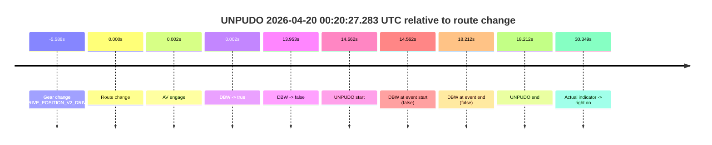
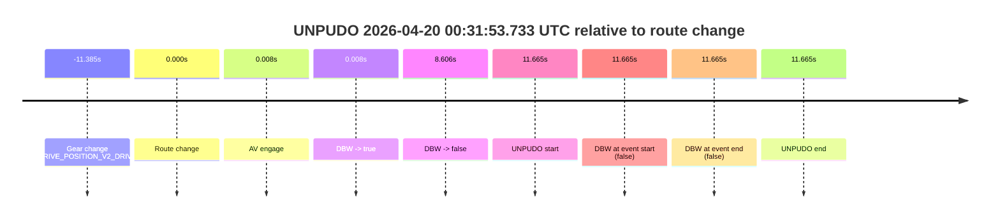
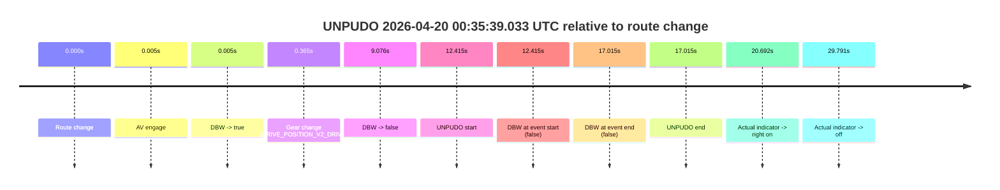
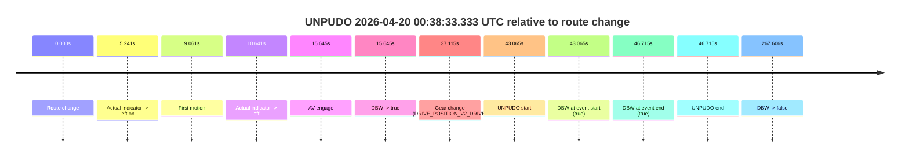
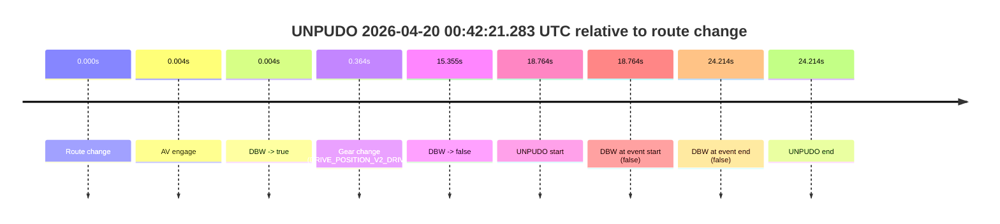

# Run Report: fme10003/2026-04-20--00-17-49--gen2-av-81084107-eb92-4ac2-bd9a-21ddf7cc8172

| Field | Value |
|---|---|
| Run ID | `fme10003/2026-04-20--00-17-49--gen2-av-81084107-eb92-4ac2-bd9a-21ddf7cc8172` |
| Date | `2026-04-20` |
| Model(s) | `pink-manta-ray-smooth` |
| Author | `guy.geva` |
| Event count | `5` |

## unpudo 2026-04-20 00:20:27.283 UTC

| Field | Value |
|---|---|
| Model | `pink-manta-ray-smooth` |
| Author | `guy.geva` |
| Run ID | `fme10003/2026-04-20--00-17-49--gen2-av-81084107-eb92-4ac2-bd9a-21ddf7cc8172` |
| Date | `2026-04-20` |
| Time (UTC) | `00:20:27.283` |
| Event type | `unpudo` |
| Disengagement type | `failed_to_unpudo` |
| Route change | `found` |
| Console | [run](https://console.sso.wayve.ai/run/fme10003/2026-04-20--00-17-49--gen2-av-81084107-eb92-4ac2-bd9a-21ddf7cc8172?id=&time-unixus=1776644427283317) |
| Foxglove | [segment](https://app.foxglove.dev/wayve-on-prem/p/prj_0dX18KZdVHg1fmmI/view?ds=foxglove-stream&ds.deviceName=fme10003&ds.start=2026-04-20T00%3A19%3A57.133299Z&ds.end=2026-04-20T00%3A20%3A40.933311Z&layoutId=lay_0e7VD4WIKDQGU73Y&time=2026-04-20T00%3A20%3A27.283317Z) |

### Event card: fail

- Fail: AV owns part of the segment, but the event still resolves as a model-performance failure under the AV-only scoring rule.

| Event | Time (UTC) | Delta from route change |
|---|---:|---:|
| Gear change (DRIVE_POSITION_V2_DRIVE) | 2026-04-20 00:20:07.133 | `-5.588s` |
| Route change | 2026-04-20 00:20:12.720 | `0.000s` |
| AV engage | 2026-04-20 00:20:12.723 | `0.002s` |
| DBW -> true | 2026-04-20 00:20:12.723 | `0.002s` |
| DBW -> false | 2026-04-20 00:20:26.673 | `13.953s` |
| UNPUDO start | 2026-04-20 00:20:27.283 | `14.562s` |
| DBW at event start (false) | 2026-04-20 00:20:27.283 | `14.562s` |
| DBW at event end (false) | 2026-04-20 00:20:30.933 | `18.212s` |
| UNPUDO end | 2026-04-20 00:20:30.933 | `18.212s` |
| Actual indicator -> right on | 2026-04-20 00:20:43.070 | `30.349s` |

| Metric | Value |
|---|---|
| Outcome | `fail` |
| Effective failure type | `failed_to_unpudo` |
| Route change status | `found` |
| DBW at event start | `false` |
| DBW at event end | `false` |
| Predicted gear at AV start | `DRIVE_POSITION_V2_DRIVE` |
| Actual gear at AV start | `DRIVE_POSITION_V2_DRIVE` |
| Predicted gear at event start | `DRIVE_POSITION_V2_DRIVE` |
| Actual gear at event start | `DRIVE_POSITION_V2_DRIVE` |
| Planned indicator direction | `INDICATORS_STATE_V2_RIGHT_ON` |
| Controller indicator direction | `INDICATORS_STATE_V2_RIGHT_ON` |
| Actual indicator direction | `INDICATORS_STATE_V2_OFF` |
| Actual indicator at maneuver end | `INDICATORS_STATE_V2_OFF` |
| Driver accel help in AV | `false` |
| Driver accel help timestamp | `n/a` |
| Max accel pedal pct in AV | `0.0%` |
| Max brake pedal pct in AV | `27.8%` |
| Max speed mps in AV | `0.000` |
| Success timing baseline | `route change` |
| Route -> AV | `0.002s` |
| AV -> event start | `14.560s` |
| AV -> first motion | `n/a` |
| Success baseline -> event start | `14.562s` |
| Success baseline -> first motion | `n/a` |
| AV duration before disengagement | `13.951s` |
| Trajectory waypoint count | `37` |
| Driving-plan step count | `11` |

The scored portion starts from the AV-owned window, not from the pre-AV setup. Route-change search in the stopped pre-event segment was `found`, with the baseline therefore set to route change. At the event anchor the model predicts `DRIVE_POSITION_V2_DRIVE` and the actual gear is `DRIVE_POSITION_V2_DRIVE`. The effective model outcome is `fail` because `failed_to_unpudo.`

### Resolution

| Field | Value |
|---|---|
| Final outcome | `fail` |
| Do we agree with this label? | `yes` |
| Source disengagement type | `failed_to_unpudo` |
| Resolved effective failure type | `failed_to_unpudo` |
| Confidence | `high` |

## unpudo 2026-04-20 00:31:53.733 UTC

| Field | Value |
|---|---|
| Model | `pink-manta-ray-smooth` |
| Author | `guy.geva` |
| Run ID | `fme10003/2026-04-20--00-17-49--gen2-av-81084107-eb92-4ac2-bd9a-21ddf7cc8172` |
| Date | `2026-04-20` |
| Time (UTC) | `00:31:53.733` |
| Event type | `unpudo` |
| Disengagement type | `failed_to_unpudo` |
| Route change | `found` |
| Console | [run](https://console.sso.wayve.ai/run/fme10003/2026-04-20--00-17-49--gen2-av-81084107-eb92-4ac2-bd9a-21ddf7cc8172?id=&time-unixus=1776645113733298) |
| Foxglove | [segment](https://app.foxglove.dev/wayve-on-prem/p/prj_0dX18KZdVHg1fmmI/view?ds=foxglove-stream&ds.deviceName=fme10003&ds.start=2026-04-20T00%3A31%3A20.683293Z&ds.end=2026-04-20T00%3A32%3A03.733298Z&layoutId=lay_0e7VD4WIKDQGU73Y&time=2026-04-20T00%3A31%3A53.733298Z) |

### Event card: fail

- Fail: AV owns part of the segment, but the event still resolves as a model-performance failure under the AV-only scoring rule.

| Event | Time (UTC) | Delta from route change |
|---|---:|---:|
| Gear change (DRIVE_POSITION_V2_DRIVE) | 2026-04-20 00:31:30.683 | `-11.385s` |
| Route change | 2026-04-20 00:31:42.068 | `0.000s` |
| AV engage | 2026-04-20 00:31:42.075 | `0.008s` |
| DBW -> true | 2026-04-20 00:31:42.075 | `0.008s` |
| DBW -> false | 2026-04-20 00:31:50.674 | `8.606s` |
| UNPUDO start | 2026-04-20 00:31:53.733 | `11.665s` |
| DBW at event start (false) | 2026-04-20 00:31:53.733 | `11.665s` |
| DBW at event end (false) | 2026-04-20 00:31:53.733 | `11.665s` |
| UNPUDO end | 2026-04-20 00:31:53.733 | `11.665s` |

| Metric | Value |
|---|---|
| Outcome | `fail` |
| Effective failure type | `failed_to_unpudo` |
| Route change status | `found` |
| DBW at event start | `false` |
| DBW at event end | `false` |
| Predicted gear at AV start | `DRIVE_POSITION_V2_DRIVE` |
| Actual gear at AV start | `DRIVE_POSITION_V2_DRIVE` |
| Predicted gear at event start | `DRIVE_POSITION_V2_DRIVE` |
| Actual gear at event start | `DRIVE_POSITION_V2_DRIVE` |
| Planned indicator direction | `INDICATORS_STATE_V2_OFF` |
| Controller indicator direction | `INDICATORS_STATE_V2_OFF` |
| Actual indicator direction | `INDICATORS_STATE_V2_OFF` |
| Actual indicator at maneuver end | `INDICATORS_STATE_V2_OFF` |
| Driver accel help in AV | `false` |
| Driver accel help timestamp | `n/a` |
| Max accel pedal pct in AV | `0.0%` |
| Max brake pedal pct in AV | `16.6%` |
| Max speed mps in AV | `0.000` |
| Success timing baseline | `route change` |
| Route -> AV | `0.008s` |
| AV -> event start | `11.657s` |
| AV -> first motion | `n/a` |
| Success baseline -> event start | `11.665s` |
| Success baseline -> first motion | `n/a` |
| AV duration before disengagement | `8.598s` |
| Trajectory waypoint count | `36` |
| Driving-plan step count | `11` |

The scored portion starts from the AV-owned window, not from the pre-AV setup. Route-change search in the stopped pre-event segment was `found`, with the baseline therefore set to route change. At the event anchor the model predicts `DRIVE_POSITION_V2_DRIVE` and the actual gear is `DRIVE_POSITION_V2_DRIVE`. The effective model outcome is `fail` because `failed_to_unpudo.`

### Resolution

| Field | Value |
|---|---|
| Final outcome | `fail` |
| Do we agree with this label? | `yes` |
| Source disengagement type | `failed_to_unpudo` |
| Resolved effective failure type | `failed_to_unpudo` |
| Confidence | `high` |

## unpudo 2026-04-20 00:35:39.033 UTC

| Field | Value |
|---|---|
| Model | `pink-manta-ray-smooth` |
| Author | `guy.geva` |
| Run ID | `fme10003/2026-04-20--00-17-49--gen2-av-81084107-eb92-4ac2-bd9a-21ddf7cc8172` |
| Date | `2026-04-20` |
| Time (UTC) | `00:35:39.033` |
| Event type | `unpudo` |
| Disengagement type | `failed_to_unpudo` |
| Route change | `found` |
| Console | [run](https://console.sso.wayve.ai/run/fme10003/2026-04-20--00-17-49--gen2-av-81084107-eb92-4ac2-bd9a-21ddf7cc8172?id=&time-unixus=1776645339033322) |
| Foxglove | [segment](https://app.foxglove.dev/wayve-on-prem/p/prj_0dX18KZdVHg1fmmI/view?ds=foxglove-stream&ds.deviceName=fme10003&ds.start=2026-04-20T00%3A35%3A16.618279Z&ds.end=2026-04-20T00%3A35%3A53.633303Z&layoutId=lay_0e7VD4WIKDQGU73Y&time=2026-04-20T00%3A35%3A39.033322Z) |

### Event card: fail

- Fail: AV owns part of the segment, but the event still resolves as a model-performance failure under the AV-only scoring rule.

| Event | Time (UTC) | Delta from route change |
|---|---:|---:|
| Route change | 2026-04-20 00:35:26.618 | `0.000s` |
| AV engage | 2026-04-20 00:35:26.623 | `0.005s` |
| DBW -> true | 2026-04-20 00:35:26.623 | `0.005s` |
| Gear change (DRIVE_POSITION_V2_DRIVE) | 2026-04-20 00:35:26.983 | `0.365s` |
| DBW -> false | 2026-04-20 00:35:35.694 | `9.076s` |
| UNPUDO start | 2026-04-20 00:35:39.033 | `12.415s` |
| DBW at event start (false) | 2026-04-20 00:35:39.033 | `12.415s` |
| DBW at event end (false) | 2026-04-20 00:35:43.633 | `17.015s` |
| UNPUDO end | 2026-04-20 00:35:43.633 | `17.015s` |
| Actual indicator -> right on | 2026-04-20 00:35:47.309 | `20.692s` |
| Actual indicator -> off | 2026-04-20 00:35:56.409 | `29.791s` |

| Metric | Value |
|---|---|
| Outcome | `fail` |
| Effective failure type | `failed_to_unpudo` |
| Route change status | `found` |
| DBW at event start | `false` |
| DBW at event end | `false` |
| Predicted gear at AV start | `DRIVE_POSITION_V2_PARK` |
| Actual gear at AV start | `DRIVE_POSITION_V2_PARK` |
| Predicted gear at event start | `DRIVE_POSITION_V2_DRIVE` |
| Actual gear at event start | `DRIVE_POSITION_V2_DRIVE` |
| Planned indicator direction | `INDICATORS_STATE_V2_OFF` |
| Controller indicator direction | `INDICATORS_STATE_V2_OFF` |
| Actual indicator direction | `INDICATORS_STATE_V2_OFF` |
| Actual indicator at maneuver end | `INDICATORS_STATE_V2_OFF` |
| Driver accel help in AV | `false` |
| Driver accel help timestamp | `n/a` |
| Max accel pedal pct in AV | `0.0%` |
| Max brake pedal pct in AV | `30.0%` |
| Max speed mps in AV | `0.000` |
| Success timing baseline | `route change` |
| Route -> AV | `0.005s` |
| AV -> event start | `12.410s` |
| AV -> first motion | `n/a` |
| Success baseline -> event start | `12.415s` |
| Success baseline -> first motion | `n/a` |
| AV duration before disengagement | `9.071s` |
| Trajectory waypoint count | `36` |
| Driving-plan step count | `11` |

The scored portion starts from the AV-owned window, not from the pre-AV setup. Route-change search in the stopped pre-event segment was `found`, with the baseline therefore set to route change. At the event anchor the model predicts `DRIVE_POSITION_V2_DRIVE` and the actual gear is `DRIVE_POSITION_V2_DRIVE`. The effective model outcome is `fail` because `failed_to_unpudo.`

### Resolution

| Field | Value |
|---|---|
| Final outcome | `fail` |
| Do we agree with this label? | `yes` |
| Source disengagement type | `failed_to_unpudo` |
| Resolved effective failure type | `failed_to_unpudo` |
| Confidence | `high` |

## unpudo 2026-04-20 00:38:33.333 UTC

| Field | Value |
|---|---|
| Model | `pink-manta-ray-smooth` |
| Author | `guy.geva` |
| Run ID | `fme10003/2026-04-20--00-17-49--gen2-av-81084107-eb92-4ac2-bd9a-21ddf7cc8172` |
| Date | `2026-04-20` |
| Time (UTC) | `00:38:33.333` |
| Event type | `unpudo` |
| Disengagement type | `none observed` |
| Route change | `found` |
| Console | [run](https://console.sso.wayve.ai/run/fme10003/2026-04-20--00-17-49--gen2-av-81084107-eb92-4ac2-bd9a-21ddf7cc8172?id=&time-unixus=1776645513333300) |
| Foxglove | [segment](https://app.foxglove.dev/wayve-on-prem/p/prj_0dX18KZdVHg1fmmI/view?ds=foxglove-stream&ds.deviceName=fme10003&ds.start=2026-04-20T00%3A37%3A40.268234Z&ds.end=2026-04-20T00%3A42%3A27.873984Z&layoutId=lay_0e7VD4WIKDQGU73Y&time=2026-04-20T00%3A38%3A33.333300Z) |

### Event card: pass

- Pass: AV owns the credited unpudo from route change through the official unpudo window, the gear state is aligned at the anchor, and the vehicle moves without driver accelerator help in AV.

| Event | Time (UTC) | Delta from route change |
|---|---:|---:|
| Route change | 2026-04-20 00:37:50.268 | `0.000s` |
| Actual indicator -> left on | 2026-04-20 00:37:55.509 | `5.241s` |
| First motion | 2026-04-20 00:37:59.329 | `9.061s` |
| Actual indicator -> off | 2026-04-20 00:38:00.909 | `10.641s` |
| AV engage | 2026-04-20 00:38:05.913 | `15.645s` |
| DBW -> true | 2026-04-20 00:38:05.913 | `15.645s` |
| Gear change (DRIVE_POSITION_V2_DRIVE) | 2026-04-20 00:38:27.383 | `37.115s` |
| UNPUDO start | 2026-04-20 00:38:33.333 | `43.065s` |
| DBW at event start (true) | 2026-04-20 00:38:33.333 | `43.065s` |
| DBW at event end (true) | 2026-04-20 00:38:36.983 | `46.715s` |
| UNPUDO end | 2026-04-20 00:38:36.983 | `46.715s` |
| DBW -> false | 2026-04-20 00:42:17.873 | `267.606s` |

| Metric | Value |
|---|---|
| Outcome | `pass` |
| Effective failure type | `none` |
| Route change status | `found` |
| DBW at event start | `true` |
| DBW at event end | `true` |
| Predicted gear at AV start | `DRIVE_POSITION_V2_DRIVE` |
| Actual gear at AV start | `DRIVE_POSITION_V2_DRIVE` |
| Predicted gear at event start | `DRIVE_POSITION_V2_DRIVE` |
| Actual gear at event start | `DRIVE_POSITION_V2_DRIVE` |
| Planned indicator direction | `INDICATORS_STATE_V2_LEFT_ON` |
| Controller indicator direction | `INDICATORS_STATE_V2_LEFT_ON` |
| Actual indicator direction | `INDICATORS_STATE_V2_OFF` |
| Actual indicator at maneuver end | `INDICATORS_STATE_V2_OFF` |
| Driver accel help in AV | `false` |
| Driver accel help timestamp | `n/a` |
| Max accel pedal pct in AV | `0.0%` |
| Max brake pedal pct in AV | `14.0%` |
| Max speed mps in AV | `4.714` |
| Success timing baseline | `route change` |
| Route -> AV | `15.645s` |
| AV -> event start | `27.420s` |
| AV -> first motion | `-6.584s` |
| Success baseline -> event start | `43.065s` |
| Success baseline -> first motion | `9.061s` |
| AV duration before disengagement | `251.961s` |
| Trajectory waypoint count | `36` |
| Driving-plan step count | `11` |

The scored portion starts from the AV-owned window, not from the pre-AV setup. Route-change search in the stopped pre-event segment was `found`, with the baseline therefore set to route change. At the event anchor the model predicts `DRIVE_POSITION_V2_DRIVE` and the actual gear is `DRIVE_POSITION_V2_DRIVE`. The effective model outcome is `pass` because `the credited unpudo stays AV-owned through the official unpudo window.`

### Resolution

| Field | Value |
|---|---|
| Final outcome | `pass` |
| Do we agree with this label? | `yes` |
| Source disengagement type | `none observed` |
| Resolved effective failure type | `none` |
| Confidence | `high` |

## unpudo 2026-04-20 00:42:21.283 UTC

| Field | Value |
|---|---|
| Model | `pink-manta-ray-smooth` |
| Author | `guy.geva` |
| Run ID | `fme10003/2026-04-20--00-17-49--gen2-av-81084107-eb92-4ac2-bd9a-21ddf7cc8172` |
| Date | `2026-04-20` |
| Time (UTC) | `00:42:21.283` |
| Event type | `unpudo` |
| Disengagement type | `failed_to_unpudo` |
| Route change | `found` |
| Console | [run](https://console.sso.wayve.ai/run/fme10003/2026-04-20--00-17-49--gen2-av-81084107-eb92-4ac2-bd9a-21ddf7cc8172?id=&time-unixus=1776645741283314) |
| Foxglove | [segment](https://app.foxglove.dev/wayve-on-prem/p/prj_0dX18KZdVHg1fmmI/view?ds=foxglove-stream&ds.deviceName=fme10003&ds.start=2026-04-20T00%3A41%3A52.519178Z&ds.end=2026-04-20T00%3A42%3A36.733311Z&layoutId=lay_0e7VD4WIKDQGU73Y&time=2026-04-20T00%3A42%3A21.283314Z) |

### Event card: fail

- Fail: AV owns part of the segment, but the event still resolves as a model-performance failure under the AV-only scoring rule.

| Event | Time (UTC) | Delta from route change |
|---|---:|---:|
| Route change | 2026-04-20 00:42:02.519 | `0.000s` |
| AV engage | 2026-04-20 00:42:02.523 | `0.004s` |
| DBW -> true | 2026-04-20 00:42:02.523 | `0.004s` |
| Gear change (DRIVE_POSITION_V2_DRIVE) | 2026-04-20 00:42:02.883 | `0.364s` |
| DBW -> false | 2026-04-20 00:42:17.873 | `15.355s` |
| UNPUDO start | 2026-04-20 00:42:21.283 | `18.764s` |
| DBW at event start (false) | 2026-04-20 00:42:21.283 | `18.764s` |
| DBW at event end (false) | 2026-04-20 00:42:26.733 | `24.214s` |
| UNPUDO end | 2026-04-20 00:42:26.733 | `24.214s` |

| Metric | Value |
|---|---|
| Outcome | `fail` |
| Effective failure type | `failed_to_unpudo` |
| Route change status | `found` |
| DBW at event start | `false` |
| DBW at event end | `false` |
| Predicted gear at AV start | `DRIVE_POSITION_V2_PARK` |
| Actual gear at AV start | `DRIVE_POSITION_V2_PARK` |
| Predicted gear at event start | `DRIVE_POSITION_V2_DRIVE` |
| Actual gear at event start | `DRIVE_POSITION_V2_DRIVE` |
| Planned indicator direction | `INDICATORS_STATE_V2_LEFT_ON` |
| Controller indicator direction | `INDICATORS_STATE_V2_LEFT_ON` |
| Actual indicator direction | `INDICATORS_STATE_V2_OFF` |
| Actual indicator at maneuver end | `INDICATORS_STATE_V2_OFF` |
| Driver accel help in AV | `false` |
| Driver accel help timestamp | `n/a` |
| Max accel pedal pct in AV | `0.0%` |
| Max brake pedal pct in AV | `12.9%` |
| Max speed mps in AV | `0.000` |
| Success timing baseline | `route change` |
| Route -> AV | `0.004s` |
| AV -> event start | `18.760s` |
| AV -> first motion | `n/a` |
| Success baseline -> event start | `18.764s` |
| Success baseline -> first motion | `n/a` |
| AV duration before disengagement | `15.350s` |
| Trajectory waypoint count | `37` |
| Driving-plan step count | `11` |

The scored portion starts from the AV-owned window, not from the pre-AV setup. Route-change search in the stopped pre-event segment was `found`, with the baseline therefore set to route change. At the event anchor the model predicts `DRIVE_POSITION_V2_DRIVE` and the actual gear is `DRIVE_POSITION_V2_DRIVE`. The effective model outcome is `fail` because `failed_to_unpudo.`

### Resolution

| Field | Value |
|---|---|
| Final outcome | `fail` |
| Do we agree with this label? | `yes` |
| Source disengagement type | `failed_to_unpudo` |
| Resolved effective failure type | `failed_to_unpudo` |
| Confidence | `high` |
