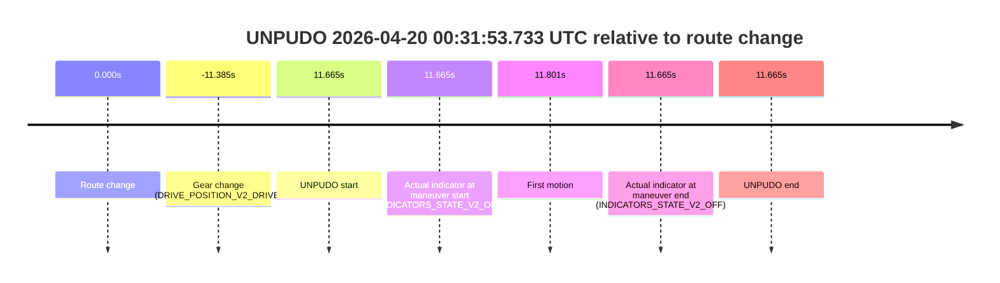
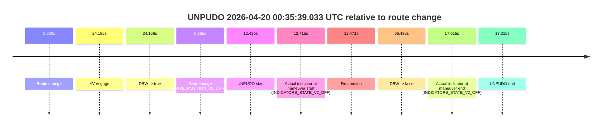
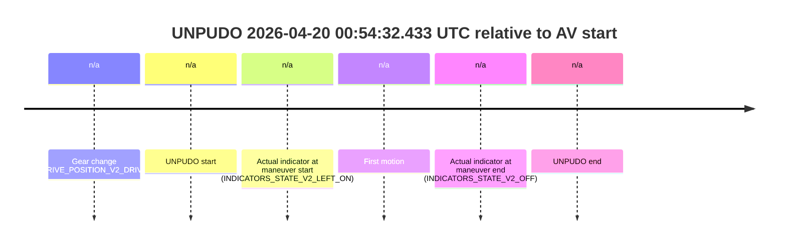

# Run Report: fme10003/2026-04-20--00-17-49--gen2-av-81084107-eb92-4ac2-bd9a-21ddf7cc8172

| Field | Value |
|---|---|
| Run ID | `fme10003/2026-04-20--00-17-49--gen2-av-81084107-eb92-4ac2-bd9a-21ddf7cc8172` |
| Date | `2026-04-20` |
| Model(s) | `pink-manta-ray-smooth` |
| Author | `guy.geva` |
| Event count | `6` |

## unpudo 2026-04-20 00:20:27.283 UTC

| Field | Value |
|---|---|
| Model | `pink-manta-ray-smooth` |
| Author | `guy.geva` |
| Run ID | `fme10003/2026-04-20--00-17-49--gen2-av-81084107-eb92-4ac2-bd9a-21ddf7cc8172` |
| Date | `2026-04-20` |
| Time (UTC) | `00:20:27.283` |
| Event type | `unpudo` |
| Disengagement type | `failed_to_unpudo` |
| Route change | `found` |
| Console | [run](https://console.sso.wayve.ai/run/fme10003/2026-04-20--00-17-49--gen2-av-81084107-eb92-4ac2-bd9a-21ddf7cc8172?id=&time-unixus=1776644427283317) |
| Foxglove | [segment](https://app.foxglove.dev/wayve-on-prem/p/prj_0dX18KZdVHg1fmmI/view?ds=foxglove-stream&ds.deviceName=fme10003&ds.start=2026-04-20T00%3A19%3A57.133299Z&ds.end=2026-04-20T00%3A21%3A13.713338Z&layoutId=lay_0e7VD4WIKDQGU73Y&time=2026-04-20T00%3A20%3A27.283317Z) |

### Event card: non-av

- Non-AV: there is no AV-owned portion anywhere inside the detected unpudo timeline, so it is kept for coverage but excluded from model success / failure scoring.

| Event | Time (UTC) | Delta from route change |
|---|---:|---:|
| Route change | 2026-04-20 00:20:12.720 | `0.000s` |
| AV engage | 2026-04-20 00:20:41.252 | `28.532s` |
| DBW -> true | 2026-04-20 00:20:41.252 | `28.532s` |
| Gear change (DRIVE_POSITION_V2_DRIVE) | 2026-04-20 00:20:07.133 | `-5.588s` |
| UNPUDO start | 2026-04-20 00:20:27.283 | `14.562s` |
| Actual indicator at maneuver start (INDICATORS_STATE_V2_OFF) | 2026-04-20 00:20:27.283 | `14.562s` |
| First motion | 2026-04-20 00:20:27.329 | `14.608s` |
| DBW -> false | 2026-04-20 00:21:03.713 | `50.992s` |
| Actual indicator at maneuver end (INDICATORS_STATE_V2_OFF) | 2026-04-20 00:20:30.933 | `18.212s` |
| UNPUDO end | 2026-04-20 00:20:30.933 | `18.212s` |

| Metric | Value |
|---|---|
| Outcome | `non-av` |
| Effective failure type | `none` |
| Route change status | `found` |
| DBW at event start | `false` |
| DBW at event end | `false` |
| Predicted gear at AV start | `DRIVE_POSITION_V2_DRIVE` |
| Actual gear at AV start | `DRIVE_POSITION_V2_DRIVE` |
| Predicted gear at event start | `DRIVE_POSITION_V2_DRIVE` |
| Actual gear at event start | `DRIVE_POSITION_V2_DRIVE` |
| Planned indicator direction | `INDICATORS_STATE_V2_RIGHT_ON` |
| Controller indicator direction | `INDICATORS_STATE_V2_RIGHT_ON` |
| Actual indicator direction | `INDICATORS_STATE_V2_OFF` |
| Actual indicator at maneuver end | `INDICATORS_STATE_V2_OFF` |
| Driver accel help in AV | `false` |
| Driver accel help timestamp | `n/a` |
| Max accel pedal pct in AV | `0.0%` |
| Max brake pedal pct in AV | `0.0%` |
| Max speed mps in AV | `0.000` |
| Route -> AV | `28.532s` |
| AV -> event start | `-13.969s` |
| AV -> first motion | `-13.923s` |
| AV duration before disengagement | `22.461s` |
| Trajectory waypoint count | `37` |
| Driving-plan step count | `11` |

The scored portion starts from the AV-owned window, not from the pre-AV setup. Route-change search in the stopped pre-event segment was `found`, with the baseline therefore set to route change. At the event anchor the model predicts `DRIVE_POSITION_V2_DRIVE` and the actual gear is `DRIVE_POSITION_V2_DRIVE`. The effective model outcome is `non-av` because `there is no AV-owned overlap inside the event timeline`.

### Resolution

| Field | Value |
|---|---|
| Final outcome | `non-av` |
| Do we agree with this label? | `yes` |
| Source disengagement type | `failed_to_unpudo` |
| Resolved effective failure type | `none` |
| Confidence | `high` |

## unpudo 2026-04-20 00:31:53.733 UTC

| Field | Value |
|---|---|
| Model | `pink-manta-ray-smooth` |
| Author | `guy.geva` |
| Run ID | `fme10003/2026-04-20--00-17-49--gen2-av-81084107-eb92-4ac2-bd9a-21ddf7cc8172` |
| Date | `2026-04-20` |
| Time (UTC) | `00:31:53.733` |
| Event type | `unpudo` |
| Disengagement type | `failed_to_unpudo` |
| Route change | `found` |
| Console | [run](https://console.sso.wayve.ai/run/fme10003/2026-04-20--00-17-49--gen2-av-81084107-eb92-4ac2-bd9a-21ddf7cc8172?id=&time-unixus=1776645113733298) |
| Foxglove | [segment](https://app.foxglove.dev/wayve-on-prem/p/prj_0dX18KZdVHg1fmmI/view?ds=foxglove-stream&ds.deviceName=fme10003&ds.start=2026-04-20T00%3A31%3A20.683293Z&ds.end=2026-04-20T00%3A32%3A03.733298Z&layoutId=lay_0e7VD4WIKDQGU73Y&time=2026-04-20T00%3A31%3A53.733298Z) |

### Event card: non-av

- Non-AV: there is no AV-owned portion anywhere inside the detected unpudo timeline, so it is kept for coverage but excluded from model success / failure scoring.

| Event | Time (UTC) | Delta from route change |
|---|---:|---:|
| Route change | 2026-04-20 00:31:42.068 | `0.000s` |
| Gear change (DRIVE_POSITION_V2_DRIVE) | 2026-04-20 00:31:30.683 | `-11.385s` |
| UNPUDO start | 2026-04-20 00:31:53.733 | `11.665s` |
| Actual indicator at maneuver start (INDICATORS_STATE_V2_OFF) | 2026-04-20 00:31:53.733 | `11.665s` |
| First motion | 2026-04-20 00:31:53.869 | `11.801s` |
| Actual indicator at maneuver end (INDICATORS_STATE_V2_OFF) | 2026-04-20 00:31:53.733 | `11.665s` |
| UNPUDO end | 2026-04-20 00:31:53.733 | `11.665s` |

| Metric | Value |
|---|---|
| Outcome | `non-av` |
| Effective failure type | `none` |
| Route change status | `found` |
| DBW at event start | `false` |
| DBW at event end | `false` |
| Predicted gear at AV start | `n/a` |
| Actual gear at AV start | `n/a` |
| Predicted gear at event start | `DRIVE_POSITION_V2_DRIVE` |
| Actual gear at event start | `DRIVE_POSITION_V2_DRIVE` |
| Planned indicator direction | `INDICATORS_STATE_V2_OFF` |
| Controller indicator direction | `INDICATORS_STATE_V2_OFF` |
| Actual indicator direction | `INDICATORS_STATE_V2_OFF` |
| Actual indicator at maneuver end | `INDICATORS_STATE_V2_OFF` |
| Driver accel help in AV | `false` |
| Driver accel help timestamp | `n/a` |
| Max accel pedal pct in AV | `0.0%` |
| Max brake pedal pct in AV | `0.0%` |
| Max speed mps in AV | `0.000` |
| Route -> AV | `n/a` |
| AV -> event start | `n/a` |
| AV -> first motion | `n/a` |
| AV duration before disengagement | `n/a` |
| Trajectory waypoint count | `36` |
| Driving-plan step count | `11` |

The scored portion starts from the AV-owned window, not from the pre-AV setup. Route-change search in the stopped pre-event segment was `found`, with the baseline therefore set to route change. At the event anchor the model predicts `DRIVE_POSITION_V2_DRIVE` and the actual gear is `DRIVE_POSITION_V2_DRIVE`. The effective model outcome is `non-av` because `there is no AV-owned overlap inside the event timeline`.

### Resolution

| Field | Value |
|---|---|
| Final outcome | `non-av` |
| Do we agree with this label? | `yes` |
| Source disengagement type | `failed_to_unpudo` |
| Resolved effective failure type | `none` |
| Confidence | `high` |

## unpudo 2026-04-20 00:35:39.033 UTC

| Field | Value |
|---|---|
| Model | `pink-manta-ray-smooth` |
| Author | `guy.geva` |
| Run ID | `fme10003/2026-04-20--00-17-49--gen2-av-81084107-eb92-4ac2-bd9a-21ddf7cc8172` |
| Date | `2026-04-20` |
| Time (UTC) | `00:35:39.033` |
| Event type | `unpudo` |
| Disengagement type | `failed_to_unpudo` |
| Route change | `found` |
| Console | [run](https://console.sso.wayve.ai/run/fme10003/2026-04-20--00-17-49--gen2-av-81084107-eb92-4ac2-bd9a-21ddf7cc8172?id=&time-unixus=1776645339033322) |
| Foxglove | [segment](https://app.foxglove.dev/wayve-on-prem/p/prj_0dX18KZdVHg1fmmI/view?ds=foxglove-stream&ds.deviceName=fme10003&ds.start=2026-04-20T00%3A35%3A16.618279Z&ds.end=2026-04-20T00%3A37%3A13.053490Z&layoutId=lay_0e7VD4WIKDQGU73Y&time=2026-04-20T00%3A35%3A39.033322Z) |

### Event card: non-av

- Non-AV: there is no AV-owned portion anywhere inside the detected unpudo timeline, so it is kept for coverage but excluded from model success / failure scoring.

| Event | Time (UTC) | Delta from route change |
|---|---:|---:|
| Route change | 2026-04-20 00:35:26.618 | `0.000s` |
| AV engage | 2026-04-20 00:35:50.773 | `24.156s` |
| DBW -> true | 2026-04-20 00:35:50.773 | `24.156s` |
| Gear change (DRIVE_POSITION_V2_DRIVE) | 2026-04-20 00:35:26.983 | `0.365s` |
| UNPUDO start | 2026-04-20 00:35:39.033 | `12.415s` |
| Actual indicator at maneuver start (INDICATORS_STATE_V2_OFF) | 2026-04-20 00:35:39.033 | `12.415s` |
| First motion | 2026-04-20 00:35:39.089 | `12.471s` |
| DBW -> false | 2026-04-20 00:37:03.053 | `96.435s` |
| Actual indicator at maneuver end (INDICATORS_STATE_V2_OFF) | 2026-04-20 00:35:43.633 | `17.015s` |
| UNPUDO end | 2026-04-20 00:35:43.633 | `17.015s` |

| Metric | Value |
|---|---|
| Outcome | `non-av` |
| Effective failure type | `none` |
| Route change status | `found` |
| DBW at event start | `false` |
| DBW at event end | `false` |
| Predicted gear at AV start | `DRIVE_POSITION_V2_DRIVE` |
| Actual gear at AV start | `DRIVE_POSITION_V2_DRIVE` |
| Predicted gear at event start | `DRIVE_POSITION_V2_DRIVE` |
| Actual gear at event start | `DRIVE_POSITION_V2_DRIVE` |
| Planned indicator direction | `INDICATORS_STATE_V2_OFF` |
| Controller indicator direction | `INDICATORS_STATE_V2_OFF` |
| Actual indicator direction | `INDICATORS_STATE_V2_OFF` |
| Actual indicator at maneuver end | `INDICATORS_STATE_V2_OFF` |
| Driver accel help in AV | `false` |
| Driver accel help timestamp | `n/a` |
| Max accel pedal pct in AV | `0.0%` |
| Max brake pedal pct in AV | `0.0%` |
| Max speed mps in AV | `0.000` |
| Route -> AV | `24.156s` |
| AV -> event start | `-11.741s` |
| AV -> first motion | `-11.684s` |
| AV duration before disengagement | `72.280s` |
| Trajectory waypoint count | `36` |
| Driving-plan step count | `11` |

The scored portion starts from the AV-owned window, not from the pre-AV setup. Route-change search in the stopped pre-event segment was `found`, with the baseline therefore set to route change. At the event anchor the model predicts `DRIVE_POSITION_V2_DRIVE` and the actual gear is `DRIVE_POSITION_V2_DRIVE`. The effective model outcome is `non-av` because `there is no AV-owned overlap inside the event timeline`.

### Resolution

| Field | Value |
|---|---|
| Final outcome | `non-av` |
| Do we agree with this label? | `yes` |
| Source disengagement type | `failed_to_unpudo` |
| Resolved effective failure type | `none` |
| Confidence | `high` |

## unpudo 2026-04-20 00:38:33.333 UTC

| Field | Value |
|---|---|
| Model | `pink-manta-ray-smooth` |
| Author | `guy.geva` |
| Run ID | `fme10003/2026-04-20--00-17-49--gen2-av-81084107-eb92-4ac2-bd9a-21ddf7cc8172` |
| Date | `2026-04-20` |
| Time (UTC) | `00:38:33.333` |
| Event type | `unpudo` |
| Disengagement type | `none observed` |
| Route change | `found` |
| Console | [run](https://console.sso.wayve.ai/run/fme10003/2026-04-20--00-17-49--gen2-av-81084107-eb92-4ac2-bd9a-21ddf7cc8172?id=&time-unixus=1776645513333300) |
| Foxglove | [segment](https://app.foxglove.dev/wayve-on-prem/p/prj_0dX18KZdVHg1fmmI/view?ds=foxglove-stream&ds.deviceName=fme10003&ds.start=2026-04-20T00%3A37%3A40.268234Z&ds.end=2026-04-20T00%3A42%3A27.873984Z&layoutId=lay_0e7VD4WIKDQGU73Y&time=2026-04-20T00%3A38%3A33.333300Z) |

### Event card: pass

- Pass: AV owns the credited unpudo through the official event window, the gear state is aligned at the anchor, and the vehicle moves without driver accelerator help in AV.

| Event | Time (UTC) | Delta from route change |
|---|---:|---:|
| Route change | 2026-04-20 00:37:50.268 | `0.000s` |
| AV engage | 2026-04-20 00:38:05.913 | `15.645s` |
| DBW -> true | 2026-04-20 00:38:05.913 | `15.645s` |
| Gear change (DRIVE_POSITION_V2_DRIVE) | 2026-04-20 00:38:27.383 | `37.115s` |
| UNPUDO start | 2026-04-20 00:38:33.333 | `43.065s` |
| Actual indicator at maneuver start (INDICATORS_STATE_V2_OFF) | 2026-04-20 00:38:33.333 | `43.065s` |
| First motion | 2026-04-20 00:38:33.389 | `43.121s` |
| DBW -> false | 2026-04-20 00:42:17.873 | `267.606s` |
| Actual indicator at maneuver end (INDICATORS_STATE_V2_OFF) | 2026-04-20 00:38:36.983 | `46.715s` |
| UNPUDO end | 2026-04-20 00:38:36.983 | `46.715s` |

| Metric | Value |
|---|---|
| Outcome | `pass` |
| Effective failure type | `none` |
| Route change status | `found` |
| DBW at event start | `true` |
| DBW at event end | `true` |
| Predicted gear at AV start | `DRIVE_POSITION_V2_DRIVE` |
| Actual gear at AV start | `DRIVE_POSITION_V2_DRIVE` |
| Predicted gear at event start | `DRIVE_POSITION_V2_DRIVE` |
| Actual gear at event start | `DRIVE_POSITION_V2_DRIVE` |
| Planned indicator direction | `INDICATORS_STATE_V2_LEFT_ON` |
| Controller indicator direction | `INDICATORS_STATE_V2_LEFT_ON` |
| Actual indicator direction | `INDICATORS_STATE_V2_OFF` |
| Actual indicator at maneuver end | `INDICATORS_STATE_V2_OFF` |
| Driver accel help in AV | `false` |
| Driver accel help timestamp | `n/a` |
| Max accel pedal pct in AV | `0.0%` |
| Max brake pedal pct in AV | `0.0%` |
| Max speed mps in AV | `4.650` |
| Route -> AV | `15.645s` |
| AV -> event start | `27.420s` |
| AV -> first motion | `27.476s` |
| AV duration before disengagement | `251.961s` |
| Trajectory waypoint count | `36` |
| Driving-plan step count | `11` |

The scored portion starts from the AV-owned window, not from the pre-AV setup. Route-change search in the stopped pre-event segment was `found`, with the baseline therefore set to route change. At the event anchor the model predicts `DRIVE_POSITION_V2_DRIVE` and the actual gear is `DRIVE_POSITION_V2_DRIVE`. The effective model outcome is `pass` because `the credited maneuver stays AV-owned through the official event end`.

### Resolution

| Field | Value |
|---|---|
| Final outcome | `pass` |
| Do we agree with this label? | `yes` |
| Source disengagement type | `none observed` |
| Resolved effective failure type | `none` |
| Confidence | `high` |

## unpudo 2026-04-20 00:42:21.283 UTC

| Field | Value |
|---|---|
| Model | `pink-manta-ray-smooth` |
| Author | `guy.geva` |
| Run ID | `fme10003/2026-04-20--00-17-49--gen2-av-81084107-eb92-4ac2-bd9a-21ddf7cc8172` |
| Date | `2026-04-20` |
| Time (UTC) | `00:42:21.283` |
| Event type | `unpudo` |
| Disengagement type | `failed_to_unpudo` |
| Route change | `found` |
| Console | [run](https://console.sso.wayve.ai/run/fme10003/2026-04-20--00-17-49--gen2-av-81084107-eb92-4ac2-bd9a-21ddf7cc8172?id=&time-unixus=1776645741283314) |
| Foxglove | [segment](https://app.foxglove.dev/wayve-on-prem/p/prj_0dX18KZdVHg1fmmI/view?ds=foxglove-stream&ds.deviceName=fme10003&ds.start=2026-04-20T00%3A41%3A52.519178Z&ds.end=2026-04-20T00%3A43%3A40.934610Z&layoutId=lay_0e7VD4WIKDQGU73Y&time=2026-04-20T00%3A42%3A21.283314Z) |

### Event card: non-av

- Non-AV: there is no AV-owned portion anywhere inside the detected unpudo timeline, so it is kept for coverage but excluded from model success / failure scoring.

| Event | Time (UTC) | Delta from route change |
|---|---:|---:|
| Route change | 2026-04-20 00:42:02.519 | `0.000s` |
| AV engage | 2026-04-20 00:42:29.574 | `27.055s` |
| DBW -> true | 2026-04-20 00:42:29.574 | `27.055s` |
| Gear change (DRIVE_POSITION_V2_DRIVE) | 2026-04-20 00:42:02.883 | `0.364s` |
| UNPUDO start | 2026-04-20 00:42:21.283 | `18.764s` |
| Actual indicator at maneuver start (INDICATORS_STATE_V2_OFF) | 2026-04-20 00:42:21.283 | `18.764s` |
| First motion | 2026-04-20 00:42:21.329 | `18.810s` |
| DBW -> false | 2026-04-20 00:43:30.934 | `88.415s` |
| Actual indicator at maneuver end (INDICATORS_STATE_V2_OFF) | 2026-04-20 00:42:26.733 | `24.214s` |
| UNPUDO end | 2026-04-20 00:42:26.733 | `24.214s` |

| Metric | Value |
|---|---|
| Outcome | `non-av` |
| Effective failure type | `none` |
| Route change status | `found` |
| DBW at event start | `false` |
| DBW at event end | `false` |
| Predicted gear at AV start | `DRIVE_POSITION_V2_DRIVE` |
| Actual gear at AV start | `DRIVE_POSITION_V2_DRIVE` |
| Predicted gear at event start | `DRIVE_POSITION_V2_DRIVE` |
| Actual gear at event start | `DRIVE_POSITION_V2_DRIVE` |
| Planned indicator direction | `INDICATORS_STATE_V2_LEFT_ON` |
| Controller indicator direction | `INDICATORS_STATE_V2_LEFT_ON` |
| Actual indicator direction | `INDICATORS_STATE_V2_OFF` |
| Actual indicator at maneuver end | `INDICATORS_STATE_V2_OFF` |
| Driver accel help in AV | `false` |
| Driver accel help timestamp | `n/a` |
| Max accel pedal pct in AV | `0.0%` |
| Max brake pedal pct in AV | `0.0%` |
| Max speed mps in AV | `0.000` |
| Route -> AV | `27.055s` |
| AV -> event start | `-8.291s` |
| AV -> first motion | `-8.245s` |
| AV duration before disengagement | `61.360s` |
| Trajectory waypoint count | `37` |
| Driving-plan step count | `11` |

The scored portion starts from the AV-owned window, not from the pre-AV setup. Route-change search in the stopped pre-event segment was `found`, with the baseline therefore set to route change. At the event anchor the model predicts `DRIVE_POSITION_V2_DRIVE` and the actual gear is `DRIVE_POSITION_V2_DRIVE`. The effective model outcome is `non-av` because `there is no AV-owned overlap inside the event timeline`.

### Resolution

| Field | Value |
|---|---|
| Final outcome | `non-av` |
| Do we agree with this label? | `yes` |
| Source disengagement type | `failed_to_unpudo` |
| Resolved effective failure type | `none` |
| Confidence | `high` |

## unpudo 2026-04-20 00:54:32.433 UTC

| Field | Value |
|---|---|
| Model | `pink-manta-ray-smooth` |
| Author | `guy.geva` |
| Run ID | `fme10003/2026-04-20--00-17-49--gen2-av-81084107-eb92-4ac2-bd9a-21ddf7cc8172` |
| Date | `2026-04-20` |
| Time (UTC) | `00:54:32.433` |
| Event type | `unpudo` |
| Disengagement type | `none observed` |
| Route change | `not found` |
| Console | [run](https://console.sso.wayve.ai/run/fme10003/2026-04-20--00-17-49--gen2-av-81084107-eb92-4ac2-bd9a-21ddf7cc8172?id=&time-unixus=1776646472433294) |
| Foxglove | [segment](https://app.foxglove.dev/wayve-on-prem/p/prj_0dX18KZdVHg1fmmI/view?ds=foxglove-stream&ds.deviceName=fme10003&ds.start=2026-04-20T00%3A54%3A13.683308Z&ds.end=2026-04-20T00%3A54%3A46.383295Z&layoutId=lay_0e7VD4WIKDQGU73Y&time=2026-04-20T00%3A54%3A32.433294Z) |

### Event card: non-av

- Non-AV: there is no AV-owned portion anywhere inside the detected unpudo timeline, so it is kept for coverage but excluded from model success / failure scoring.

| Event | Time (UTC) | Delta from AV start |
|---|---:|---:|
| Gear change (DRIVE_POSITION_V2_DRIVE) | 2026-04-20 00:54:23.683 | `n/a` |
| UNPUDO start | 2026-04-20 00:54:32.433 | `n/a` |
| Actual indicator at maneuver start (INDICATORS_STATE_V2_LEFT_ON) | 2026-04-20 00:54:32.433 | `n/a` |
| First motion | 2026-04-20 00:54:32.449 | `n/a` |
| Actual indicator at maneuver end (INDICATORS_STATE_V2_OFF) | 2026-04-20 00:54:36.383 | `n/a` |
| UNPUDO end | 2026-04-20 00:54:36.383 | `n/a` |

| Metric | Value |
|---|---|
| Outcome | `non-av` |
| Effective failure type | `none` |
| Route change status | `not found` |
| DBW at event start | `false` |
| DBW at event end | `false` |
| Predicted gear at AV start | `n/a` |
| Actual gear at AV start | `n/a` |
| Predicted gear at event start | `DRIVE_POSITION_V2_DRIVE` |
| Actual gear at event start | `DRIVE_POSITION_V2_DRIVE` |
| Planned indicator direction | `INDICATORS_STATE_V2_LEFT_ON` |
| Controller indicator direction | `INDICATORS_STATE_V2_LEFT_ON` |
| Actual indicator direction | `INDICATORS_STATE_V2_LEFT_ON` |
| Actual indicator at maneuver end | `INDICATORS_STATE_V2_OFF` |
| Driver accel help in AV | `false` |
| Driver accel help timestamp | `n/a` |
| Max accel pedal pct in AV | `0.0%` |
| Max brake pedal pct in AV | `0.0%` |
| Max speed mps in AV | `0.000` |
| Route -> AV | `n/a` |
| AV -> event start | `n/a` |
| AV -> first motion | `n/a` |
| AV duration before disengagement | `n/a` |
| Trajectory waypoint count | `36` |
| Driving-plan step count | `11` |

The scored portion starts from the AV-owned window, not from the pre-AV setup. Route-change search in the stopped pre-event segment was `not found`, with the baseline therefore set to AV start. At the event anchor the model predicts `DRIVE_POSITION_V2_DRIVE` and the actual gear is `DRIVE_POSITION_V2_DRIVE`. The effective model outcome is `non-av` because `there is no AV-owned overlap inside the event timeline`.

### Resolution

| Field | Value |
|---|---|
| Final outcome | `non-av` |
| Do we agree with this label? | `yes` |
| Source disengagement type | `none observed` |
| Resolved effective failure type | `none` |
| Confidence | `high` |
