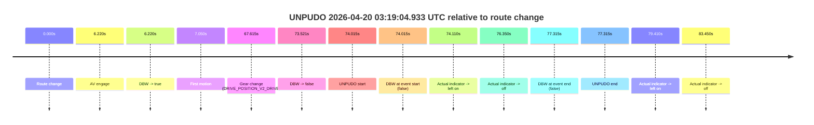
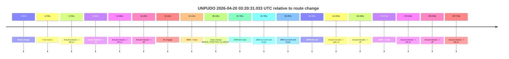

# Run Report: fme10003/2026-04-20--02-52-57--gen2-av-8ec013a5-9be3-4866-8651-a622647e7f8a

| Field | Value |
|---|---|
| Run ID | `fme10003/2026-04-20--02-52-57--gen2-av-8ec013a5-9be3-4866-8651-a622647e7f8a` |
| Date | `2026-04-20` |
| Model(s) | `pink-manta-ray-smooth` |
| Author | `guy.geva` |
| Event count | `2` |

## unpudo 2026-04-20 03:19:04.933 UTC

| Field | Value |
|---|---|
| Model | `pink-manta-ray-smooth` |
| Author | `guy.geva` |
| Run ID | `fme10003/2026-04-20--02-52-57--gen2-av-8ec013a5-9be3-4866-8651-a622647e7f8a` |
| Date | `2026-04-20` |
| Time (UTC) | `03:19:04.933` |
| Event type | `unpudo` |
| Disengagement type | `failed_to_unpudo` |
| Route change | `found` |
| Console | [run](https://console.sso.wayve.ai/run/fme10003/2026-04-20--02-52-57--gen2-av-8ec013a5-9be3-4866-8651-a622647e7f8a?id=&time-unixus=1776655144933301) |
| Foxglove | [segment](https://app.foxglove.dev/wayve-on-prem/p/prj_0dX18KZdVHg1fmmI/view?ds=foxglove-stream&ds.deviceName=fme10003&ds.start=2026-04-20T03%3A17%3A40.918248Z&ds.end=2026-04-20T03%3A19%3A18.233305Z&layoutId=lay_0e7VD4WIKDQGU73Y&time=2026-04-20T03%3A19%3A04.933301Z) |

### Event card: fail

- Fail: AV owns part of the segment, but the event still resolves as a model-performance failure under the AV-only scoring rule.

| Event | Time (UTC) | Delta from route change |
|---|---:|---:|
| Route change | 2026-04-20 03:17:50.918 | `0.000s` |
| AV engage | 2026-04-20 03:17:57.137 | `6.220s` |
| DBW -> true | 2026-04-20 03:17:57.137 | `6.220s` |
| First motion | 2026-04-20 03:17:57.968 | `7.050s` |
| Gear change (DRIVE_POSITION_V2_DRIVE) | 2026-04-20 03:18:58.533 | `67.615s` |
| DBW -> false | 2026-04-20 03:19:04.439 | `73.521s` |
| UNPUDO start | 2026-04-20 03:19:04.933 | `74.015s` |
| DBW at event start (false) | 2026-04-20 03:19:04.933 | `74.015s` |
| Actual indicator -> left on | 2026-04-20 03:19:05.028 | `74.110s` |
| Actual indicator -> off | 2026-04-20 03:19:07.268 | `76.350s` |
| DBW at event end (false) | 2026-04-20 03:19:08.233 | `77.315s` |
| UNPUDO end | 2026-04-20 03:19:08.233 | `77.315s` |
| Actual indicator -> left on | 2026-04-20 03:19:10.328 | `79.410s` |
| Actual indicator -> off | 2026-04-20 03:19:14.368 | `83.450s` |

| Metric | Value |
|---|---|
| Outcome | `fail` |
| Effective failure type | `failed_to_unpudo` |
| Route change status | `found` |
| DBW at event start | `false` |
| DBW at event end | `false` |
| Predicted gear at AV start | `DRIVE_POSITION_V2_DRIVE` |
| Actual gear at AV start | `DRIVE_POSITION_V2_DRIVE` |
| Predicted gear at event start | `DRIVE_POSITION_V2_DRIVE` |
| Actual gear at event start | `DRIVE_POSITION_V2_DRIVE` |
| Planned indicator direction | `INDICATORS_STATE_V2_LEFT_ON` |
| Controller indicator direction | `INDICATORS_STATE_V2_LEFT_ON` |
| Actual indicator direction | `INDICATORS_STATE_V2_OFF` |
| Actual indicator at maneuver end | `INDICATORS_STATE_V2_OFF` |
| Driver accel help in AV | `false` |
| Driver accel help timestamp | `n/a` |
| Max accel pedal pct in AV | `0.0%` |
| Max brake pedal pct in AV | `8.0%` |
| Max speed mps in AV | `7.944` |
| Success timing baseline | `route change` |
| Route -> AV | `6.220s` |
| AV -> event start | `67.795s` |
| AV -> first motion | `0.830s` |
| Success baseline -> event start | `74.015s` |
| Success baseline -> first motion | `7.050s` |
| AV duration before disengagement | `67.302s` |
| Trajectory waypoint count | `35` |
| Driving-plan step count | `11` |

The scored portion starts from the AV-owned window, not from the pre-AV setup. Route-change search in the stopped pre-event segment was `found`, with the baseline therefore set to route change. At the event anchor the model predicts `DRIVE_POSITION_V2_DRIVE` and the actual gear is `DRIVE_POSITION_V2_DRIVE`. The effective model outcome is `fail` because `failed_to_unpudo.`

### Resolution

| Field | Value |
|---|---|
| Final outcome | `fail` |
| Do we agree with this label? | `yes` |
| Source disengagement type | `failed_to_unpudo` |
| Resolved effective failure type | `failed_to_unpudo` |
| Confidence | `high` |

## unpudo 2026-04-20 03:20:31.033 UTC

| Field | Value |
|---|---|
| Model | `pink-manta-ray-smooth` |
| Author | `guy.geva` |
| Run ID | `fme10003/2026-04-20--02-52-57--gen2-av-8ec013a5-9be3-4866-8651-a622647e7f8a` |
| Date | `2026-04-20` |
| Time (UTC) | `03:20:31.033` |
| Event type | `unpudo` |
| Disengagement type | `none observed` |
| Route change | `found` |
| Console | [run](https://console.sso.wayve.ai/run/fme10003/2026-04-20--02-52-57--gen2-av-8ec013a5-9be3-4866-8651-a622647e7f8a?id=&time-unixus=1776655231033316) |
| Foxglove | [segment](https://app.foxglove.dev/wayve-on-prem/p/prj_0dX18KZdVHg1fmmI/view?ds=foxglove-stream&ds.deviceName=fme10003&ds.start=2026-04-20T03%3A18%3A48.268264Z&ds.end=2026-04-20T03%3A23%3A47.178085Z&layoutId=lay_0e7VD4WIKDQGU73Y&time=2026-04-20T03%3A20%3A31.033316Z) |

### Event card: pass

- Pass: AV owns the credited unpudo from route change through the official unpudo window, the gear state is aligned at the anchor, and the vehicle moves without driver accelerator help in AV.

| Event | Time (UTC) | Delta from route change |
|---|---:|---:|
| Route change | 2026-04-20 03:18:58.268 | `0.000s` |
| First motion | 2026-04-20 03:19:04.968 | `6.700s` |
| Actual indicator -> left on | 2026-04-20 03:19:05.028 | `6.760s` |
| Actual indicator -> off | 2026-04-20 03:19:07.268 | `9.000s` |
| Actual indicator -> left on | 2026-04-20 03:19:10.328 | `12.060s` |
| Actual indicator -> off | 2026-04-20 03:19:14.368 | `16.100s` |
| AV engage | 2026-04-20 03:19:17.377 | `19.110s` |
| DBW -> true | 2026-04-20 03:19:17.377 | `19.110s` |
| Gear change (DRIVE_POSITION_V2_DRIVE) | 2026-04-20 03:20:27.433 | `89.165s` |
| UNPUDO start | 2026-04-20 03:20:31.033 | `92.765s` |
| DBW at event start (true) | 2026-04-20 03:20:31.033 | `92.765s` |
| DBW at event end (true) | 2026-04-20 03:20:34.533 | `96.265s` |
| UNPUDO end | 2026-04-20 03:20:34.533 | `96.265s` |
| Actual indicator -> right on | 2026-04-20 03:20:48.588 | `110.320s` |
| Actual indicator -> off | 2026-04-20 03:20:56.648 | `118.380s` |
| DBW -> false | 2026-04-20 03:23:37.178 | `278.910s` |
| Actual indicator -> left on | 2026-04-20 03:23:37.508 | `279.240s` |
| Actual indicator -> off | 2026-04-20 03:23:53.328 | `295.060s` |
| Actual indicator -> left on | 2026-04-20 03:23:55.988 | `297.720s` |

| Metric | Value |
|---|---|
| Outcome | `pass` |
| Effective failure type | `none` |
| Route change status | `found` |
| DBW at event start | `true` |
| DBW at event end | `true` |
| Predicted gear at AV start | `DRIVE_POSITION_V2_DRIVE` |
| Actual gear at AV start | `DRIVE_POSITION_V2_DRIVE` |
| Predicted gear at event start | `DRIVE_POSITION_V2_DRIVE` |
| Actual gear at event start | `DRIVE_POSITION_V2_DRIVE` |
| Planned indicator direction | `INDICATORS_STATE_V2_LEFT_ON` |
| Controller indicator direction | `INDICATORS_STATE_V2_LEFT_ON` |
| Actual indicator direction | `INDICATORS_STATE_V2_OFF` |
| Actual indicator at maneuver end | `INDICATORS_STATE_V2_OFF` |
| Driver accel help in AV | `false` |
| Driver accel help timestamp | `n/a` |
| Max accel pedal pct in AV | `0.0%` |
| Max brake pedal pct in AV | `14.7%` |
| Max speed mps in AV | `9.428` |
| Success timing baseline | `route change` |
| Route -> AV | `19.110s` |
| AV -> event start | `73.655s` |
| AV -> first motion | `-12.410s` |
| Success baseline -> event start | `92.765s` |
| Success baseline -> first motion | `6.700s` |
| AV duration before disengagement | `259.800s` |
| Trajectory waypoint count | `35` |
| Driving-plan step count | `11` |

The scored portion starts from the AV-owned window, not from the pre-AV setup. Route-change search in the stopped pre-event segment was `found`, with the baseline therefore set to route change. At the event anchor the model predicts `DRIVE_POSITION_V2_DRIVE` and the actual gear is `DRIVE_POSITION_V2_DRIVE`. The effective model outcome is `pass` because `the credited unpudo stays AV-owned through the official unpudo window.`

### Resolution

| Field | Value |
|---|---|
| Final outcome | `pass` |
| Do we agree with this label? | `yes` |
| Source disengagement type | `none observed` |
| Resolved effective failure type | `none` |
| Confidence | `high` |
