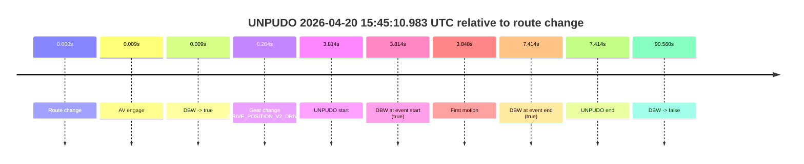
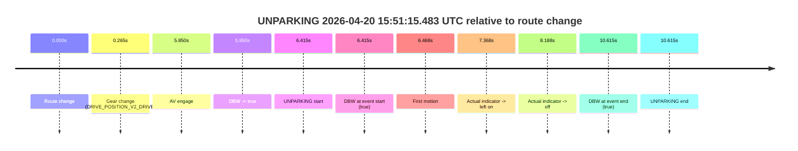

# Run Report: fme10003/2026-04-20--14-25-55--gen2-av-58444367-6576-4324-ae8c-42012679deac

| Field | Value |
|---|---|
| Run ID | `fme10003/2026-04-20--14-25-55--gen2-av-58444367-6576-4324-ae8c-42012679deac` |
| Date | `2026-04-20` |
| Model(s) | `eel-teal-outspoken` |
| Author | `zak` |
| Event count | `2` |

## unpudo 2026-04-20 15:45:10.983 UTC

| Field | Value |
|---|---|
| Model | `eel-teal-outspoken` |
| Author | `zak` |
| Run ID | `fme10003/2026-04-20--14-25-55--gen2-av-58444367-6576-4324-ae8c-42012679deac` |
| Date | `2026-04-20` |
| Time (UTC) | `15:45:10.983` |
| Event type | `unpudo` |
| Disengagement type | `none observed` |
| Route change | `found` |
| Console | [run](https://console.sso.wayve.ai/run/fme10003/2026-04-20--14-25-55--gen2-av-58444367-6576-4324-ae8c-42012679deac?id=&time-unixus=1776699910983320) |
| Foxglove | [segment](https://app.foxglove.dev/wayve-on-prem/p/prj_0dX18KZdVHg1fmmI/view?ds=foxglove-stream&ds.deviceName=fme10003&ds.start=2026-04-20T15%3A44%3A57.168874Z&ds.end=2026-04-20T15%3A46%3A47.728866Z&layoutId=lay_0e7VD4WIKDQGU73Y&time=2026-04-20T15%3A45%3A10.983320Z) |

### Event card: pass

- Pass: AV owns the credited unpudo from route change through the official unpudo window, the gear state is aligned at the anchor, and the vehicle moves without driver accelerator help in AV.

| Event | Time (UTC) | Delta from route change |
|---|---:|---:|
| Route change | 2026-04-20 15:45:07.168 | `0.000s` |
| AV engage | 2026-04-20 15:45:07.177 | `0.009s` |
| DBW -> true | 2026-04-20 15:45:07.177 | `0.009s` |
| Gear change (DRIVE_POSITION_V2_DRIVE) | 2026-04-20 15:45:07.433 | `0.264s` |
| UNPUDO start | 2026-04-20 15:45:10.983 | `3.814s` |
| DBW at event start (true) | 2026-04-20 15:45:10.983 | `3.814s` |
| First motion | 2026-04-20 15:45:11.016 | `3.848s` |
| DBW at event end (true) | 2026-04-20 15:45:14.583 | `7.414s` |
| UNPUDO end | 2026-04-20 15:45:14.583 | `7.414s` |
| DBW -> false | 2026-04-20 15:46:37.728 | `90.560s` |

| Metric | Value |
|---|---|
| Outcome | `pass` |
| Effective failure type | `none` |
| Route change status | `found` |
| DBW at event start | `true` |
| DBW at event end | `true` |
| Predicted gear at AV start | `DRIVE_POSITION_V2_PARK` |
| Actual gear at AV start | `DRIVE_POSITION_V2_PARK` |
| Predicted gear at event start | `DRIVE_POSITION_V2_DRIVE` |
| Actual gear at event start | `DRIVE_POSITION_V2_DRIVE` |
| Planned indicator direction | `INDICATORS_STATE_V2_OFF` |
| Controller indicator direction | `INDICATORS_STATE_V2_LEFT_ON` |
| Actual indicator direction | `INDICATORS_STATE_V2_OFF` |
| Actual indicator at maneuver end | `INDICATORS_STATE_V2_OFF` |
| Driver accel help in AV | `false` |
| Driver accel help timestamp | `n/a` |
| Max accel pedal pct in AV | `0.0%` |
| Max brake pedal pct in AV | `8.0%` |
| Max speed mps in AV | `4.347` |
| Success timing baseline | `route change` |
| Route -> AV | `0.009s` |
| AV -> event start | `3.805s` |
| AV -> first motion | `3.838s` |
| Success baseline -> event start | `3.814s` |
| Success baseline -> first motion | `3.848s` |
| AV duration before disengagement | `90.551s` |
| Trajectory waypoint count | `37` |
| Driving-plan step count | `11` |

The scored portion starts from the AV-owned window, not from the pre-AV setup. Route-change search in the stopped pre-event segment was `found`, with the baseline therefore set to route change. At the event anchor the model predicts `DRIVE_POSITION_V2_DRIVE` and the actual gear is `DRIVE_POSITION_V2_DRIVE`. The effective model outcome is `pass` because `the credited unpudo stays AV-owned through the official unpudo window.`

### Resolution

| Field | Value |
|---|---|
| Final outcome | `pass` |
| Do we agree with this label? | `yes` |
| Source disengagement type | `none observed` |
| Resolved effective failure type | `none` |
| Confidence | `high` |

## unparking 2026-04-20 15:51:15.483 UTC

| Field | Value |
|---|---|
| Model | `eel-teal-outspoken` |
| Author | `zak` |
| Run ID | `fme10003/2026-04-20--14-25-55--gen2-av-58444367-6576-4324-ae8c-42012679deac` |
| Date | `2026-04-20` |
| Time (UTC) | `15:51:15.483` |
| Event type | `unparking` |
| Disengagement type | `none observed` |
| Route change | `found` |
| Console | [run](https://console.sso.wayve.ai/run/fme10003/2026-04-20--14-25-55--gen2-av-58444367-6576-4324-ae8c-42012679deac?id=&time-unixus=1776700275483296) |
| Foxglove | [segment](https://app.foxglove.dev/wayve-on-prem/p/prj_0dX18KZdVHg1fmmI/view?ds=foxglove-stream&ds.deviceName=fme10003&ds.start=2026-04-20T15%3A50%3A59.068279Z&ds.end=2026-04-20T15%3A51%3A29.683301Z&layoutId=lay_0e7VD4WIKDQGU73Y&time=2026-04-20T15%3A51%3A15.483296Z) |

### Event card: pass

- Pass: AV owns the credited unparking through the official event window, the gear state is aligned at the anchor, and the vehicle moves without driver accelerator help in AV.

| Event | Time (UTC) | Delta from route change |
|---|---:|---:|
| Route change | 2026-04-20 15:51:09.068 | `0.000s` |
| Gear change (DRIVE_POSITION_V2_DRIVE) | 2026-04-20 15:51:09.333 | `0.265s` |
| AV engage | 2026-04-20 15:51:14.917 | `5.850s` |
| DBW -> true | 2026-04-20 15:51:14.917 | `5.850s` |
| UNPARKING start | 2026-04-20 15:51:15.483 | `6.415s` |
| DBW at event start (true) | 2026-04-20 15:51:15.483 | `6.415s` |
| First motion | 2026-04-20 15:51:15.536 | `6.468s` |
| Actual indicator -> left on | 2026-04-20 15:51:16.436 | `7.368s` |
| Actual indicator -> off | 2026-04-20 15:51:17.256 | `8.188s` |
| DBW at event end (true) | 2026-04-20 15:51:19.683 | `10.615s` |
| UNPARKING end | 2026-04-20 15:51:19.683 | `10.615s` |

| Metric | Value |
|---|---|
| Outcome | `pass` |
| Effective failure type | `none` |
| Route change status | `found` |
| DBW at event start | `true` |
| DBW at event end | `true` |
| Predicted gear at AV start | `DRIVE_POSITION_V2_DRIVE` |
| Actual gear at AV start | `DRIVE_POSITION_V2_DRIVE` |
| Predicted gear at event start | `DRIVE_POSITION_V2_DRIVE` |
| Actual gear at event start | `DRIVE_POSITION_V2_DRIVE` |
| Planned indicator direction | `INDICATORS_STATE_V2_LEFT_ON` |
| Controller indicator direction | `INDICATORS_STATE_V2_LEFT_ON` |
| Actual indicator direction | `INDICATORS_STATE_V2_OFF` |
| Actual indicator at maneuver end | `INDICATORS_STATE_V2_OFF` |
| Driver accel help in AV | `false` |
| Driver accel help timestamp | `n/a` |
| Max accel pedal pct in AV | `0.0%` |
| Max brake pedal pct in AV | `0.0%` |
| Max speed mps in AV | `3.822` |
| Success timing baseline | `route change` |
| Route -> AV | `5.850s` |
| AV -> event start | `0.566s` |
| AV -> first motion | `0.619s` |
| Success baseline -> event start | `6.415s` |
| Success baseline -> first motion | `6.468s` |
| AV duration before disengagement | `n/a` |
| Trajectory waypoint count | `37` |
| Driving-plan step count | `11` |

The scored portion starts from the AV-owned window, not from the pre-AV setup. Route-change search in the stopped pre-event segment was `found`, with the baseline therefore set to route change. At the event anchor the model predicts `DRIVE_POSITION_V2_DRIVE` and the actual gear is `DRIVE_POSITION_V2_DRIVE`. The effective model outcome is `pass` because `the credited maneuver stays AV-owned through the official event end.`

### Resolution

| Field | Value |
|---|---|
| Final outcome | `pass` |
| Do we agree with this label? | `yes` |
| Source disengagement type | `none observed` |
| Resolved effective failure type | `none` |
| Confidence | `high` |
