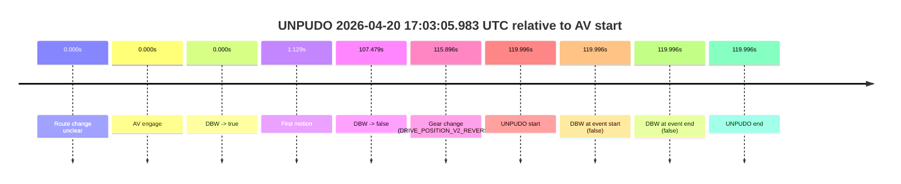
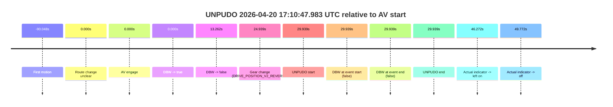
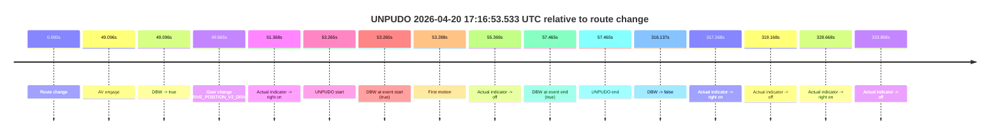
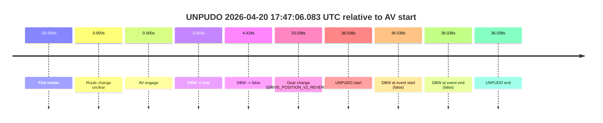

# Run Report: fme10003/2026-04-20--16-34-21--gen2-av-bfee6022-6cc5-4c76-b658-ee30a3f4ab6f

| Field | Value |
|---|---|
| Run ID | `fme10003/2026-04-20--16-34-21--gen2-av-bfee6022-6cc5-4c76-b658-ee30a3f4ab6f` |
| Date | `2026-04-20` |
| Model(s) | `eel-teal-outspoken` |
| Author | `zak` |
| Event count | `5` |

## unpudo 2026-04-20 17:03:05.983 UTC

| Field | Value |
|---|---|
| Model | `eel-teal-outspoken` |
| Author | `zak` |
| Run ID | `fme10003/2026-04-20--16-34-21--gen2-av-bfee6022-6cc5-4c76-b658-ee30a3f4ab6f` |
| Date | `2026-04-20` |
| Time (UTC) | `17:03:05.983` |
| Event type | `unpudo` |
| Disengagement type | `none observed` |
| Route change | `unclear` |
| Console | [run](https://console.sso.wayve.ai/run/fme10003/2026-04-20--16-34-21--gen2-av-bfee6022-6cc5-4c76-b658-ee30a3f4ab6f?id=&time-unixus=1776704585983309) |
| Foxglove | [segment](https://app.foxglove.dev/wayve-on-prem/p/prj_0dX18KZdVHg1fmmI/view?ds=foxglove-stream&ds.deviceName=fme10003&ds.start=2026-04-20T17%3A00%3A55.986812Z&ds.end=2026-04-20T17%3A03%3A15.983309Z&layoutId=lay_0e7VD4WIKDQGU73Y&time=2026-04-20T17%3A03%3A05.983309Z) |

### Event card: fail

- Fail: the credited unpudo does not stay AV-owned. The event window starts with DBW false, and the maneuver outcome lands outside a clean AV-owned segment.

| Event | Time (UTC) | Delta from AV start |
|---|---:|---:|
| Route change unclear | 2026-04-20 17:01:05.986 | `0.000s` |
| AV engage | 2026-04-20 17:01:05.986 | `0.000s` |
| DBW -> true | 2026-04-20 17:01:05.986 | `0.000s` |
| First motion | 2026-04-20 17:01:07.115 | `1.129s` |
| DBW -> false | 2026-04-20 17:02:53.465 | `107.479s` |
| Gear change (DRIVE_POSITION_V2_REVERSE) | 2026-04-20 17:03:01.883 | `115.896s` |
| UNPUDO start | 2026-04-20 17:03:05.983 | `119.996s` |
| DBW at event start (false) | 2026-04-20 17:03:05.983 | `119.996s` |
| DBW at event end (false) | 2026-04-20 17:03:05.983 | `119.996s` |
| UNPUDO end | 2026-04-20 17:03:05.983 | `119.996s` |

| Metric | Value |
|---|---|
| Outcome | `fail` |
| Effective failure type | `not_av_owned` |
| Route change status | `unclear` |
| DBW at event start | `false` |
| DBW at event end | `false` |
| Predicted gear at AV start | `DRIVE_POSITION_V2_DRIVE` |
| Actual gear at AV start | `DRIVE_POSITION_V2_DRIVE` |
| Predicted gear at event start | `DRIVE_POSITION_V2_REVERSE` |
| Actual gear at event start | `DRIVE_POSITION_V2_REVERSE` |
| Planned indicator direction | `INDICATORS_STATE_V2_OFF` |
| Controller indicator direction | `INDICATORS_STATE_V2_OFF` |
| Actual indicator direction | `INDICATORS_STATE_V2_OFF` |
| Actual indicator at maneuver end | `INDICATORS_STATE_V2_OFF` |
| Driver accel help in AV | `false` |
| Driver accel help timestamp | `n/a` |
| Max accel pedal pct in AV | `0.0%` |
| Max brake pedal pct in AV | `9.2%` |
| Max speed mps in AV | `6.600` |
| Success timing baseline | `AV start` |
| Route -> AV | `n/a` |
| AV -> event start | `119.996s` |
| AV -> first motion | `1.129s` |
| Success baseline -> event start | `119.996s` |
| Success baseline -> first motion | `1.129s` |
| AV duration before disengagement | `107.479s` |
| Trajectory waypoint count | `37` |
| Driving-plan step count | `11` |

The scored portion starts from the AV-owned window, not from the pre-AV setup. Route-change search in the stopped pre-event segment was `unclear`, with the baseline therefore set to AV start. At the event anchor the model predicts `DRIVE_POSITION_V2_REVERSE` and the actual gear is `DRIVE_POSITION_V2_REVERSE`. The effective model outcome is `fail` because `not_av_owned.`

### Resolution

| Field | Value |
|---|---|
| Final outcome | `fail` |
| Do we agree with this label? | `yes` |
| Source disengagement type | `none observed` |
| Resolved effective failure type | `not_av_owned` |
| Confidence | `medium` |

## unpudo 2026-04-20 17:10:01.183 UTC

| Field | Value |
|---|---|
| Model | `eel-teal-outspoken` |
| Author | `zak` |
| Run ID | `fme10003/2026-04-20--16-34-21--gen2-av-bfee6022-6cc5-4c76-b658-ee30a3f4ab6f` |
| Date | `2026-04-20` |
| Time (UTC) | `17:10:01.183` |
| Event type | `unpudo` |
| Disengagement type | `none observed` |
| Route change | `unclear` |
| Console | [run](https://console.sso.wayve.ai/run/fme10003/2026-04-20--16-34-21--gen2-av-bfee6022-6cc5-4c76-b658-ee30a3f4ab6f?id=&time-unixus=1776705001183313) |
| Foxglove | [segment](https://app.foxglove.dev/wayve-on-prem/p/prj_0dX18KZdVHg1fmmI/view?ds=foxglove-stream&ds.deviceName=fme10003&ds.start=2026-04-20T17%3A07%3A51.186077Z&ds.end=2026-04-20T17%3A10%3A26.783291Z&layoutId=lay_0e7VD4WIKDQGU73Y&time=2026-04-20T17%3A10%3A01.183313Z) |

### Event card: fail

- Fail: the credited unpudo does not stay AV-owned. The event window starts with DBW false, and the maneuver outcome lands outside a clean AV-owned segment.

| Event | Time (UTC) | Delta from AV start |
|---|---:|---:|
| Route change unclear | 2026-04-20 17:08:01.186 | `0.000s` |
| AV engage | 2026-04-20 17:08:01.186 | `0.000s` |
| DBW -> true | 2026-04-20 17:08:01.186 | `0.000s` |
| First motion | 2026-04-20 17:08:28.376 | `27.190s` |
| DBW -> false | 2026-04-20 17:09:45.945 | `104.759s` |
| Gear change (DRIVE_POSITION_V2_REVERSE) | 2026-04-20 17:09:55.283 | `114.097s` |
| UNPUDO start | 2026-04-20 17:10:01.183 | `119.997s` |
| DBW at event start (false) | 2026-04-20 17:10:01.183 | `119.997s` |
| DBW at event end (false) | 2026-04-20 17:10:16.783 | `135.597s` |
| UNPUDO end | 2026-04-20 17:10:16.783 | `135.597s` |

| Metric | Value |
|---|---|
| Outcome | `fail` |
| Effective failure type | `not_av_owned` |
| Route change status | `unclear` |
| DBW at event start | `false` |
| DBW at event end | `false` |
| Predicted gear at AV start | `DRIVE_POSITION_V2_DRIVE` |
| Actual gear at AV start | `DRIVE_POSITION_V2_DRIVE` |
| Predicted gear at event start | `DRIVE_POSITION_V2_REVERSE` |
| Actual gear at event start | `DRIVE_POSITION_V2_REVERSE` |
| Planned indicator direction | `INDICATORS_STATE_V2_OFF` |
| Controller indicator direction | `INDICATORS_STATE_V2_OFF` |
| Actual indicator direction | `INDICATORS_STATE_V2_OFF` |
| Actual indicator at maneuver end | `INDICATORS_STATE_V2_OFF` |
| Driver accel help in AV | `false` |
| Driver accel help timestamp | `n/a` |
| Max accel pedal pct in AV | `0.0%` |
| Max brake pedal pct in AV | `8.0%` |
| Max speed mps in AV | `8.728` |
| Success timing baseline | `AV start` |
| Route -> AV | `n/a` |
| AV -> event start | `119.997s` |
| AV -> first motion | `27.190s` |
| Success baseline -> event start | `119.997s` |
| Success baseline -> first motion | `27.190s` |
| AV duration before disengagement | `104.759s` |
| Trajectory waypoint count | `37` |
| Driving-plan step count | `11` |

The scored portion starts from the AV-owned window, not from the pre-AV setup. Route-change search in the stopped pre-event segment was `unclear`, with the baseline therefore set to AV start. At the event anchor the model predicts `DRIVE_POSITION_V2_REVERSE` and the actual gear is `DRIVE_POSITION_V2_REVERSE`. The effective model outcome is `fail` because `not_av_owned.`

### Resolution

| Field | Value |
|---|---|
| Final outcome | `fail` |
| Do we agree with this label? | `yes` |
| Source disengagement type | `none observed` |
| Resolved effective failure type | `not_av_owned` |
| Confidence | `medium` |

## unpudo 2026-04-20 17:10:47.983 UTC

| Field | Value |
|---|---|
| Model | `eel-teal-outspoken` |
| Author | `zak` |
| Run ID | `fme10003/2026-04-20--16-34-21--gen2-av-bfee6022-6cc5-4c76-b658-ee30a3f4ab6f` |
| Date | `2026-04-20` |
| Time (UTC) | `17:10:47.983` |
| Event type | `unpudo` |
| Disengagement type | `none observed` |
| Route change | `unclear` |
| Console | [run](https://console.sso.wayve.ai/run/fme10003/2026-04-20--16-34-21--gen2-av-bfee6022-6cc5-4c76-b658-ee30a3f4ab6f?id=&time-unixus=1776705047983303) |
| Foxglove | [segment](https://app.foxglove.dev/wayve-on-prem/p/prj_0dX18KZdVHg1fmmI/view?ds=foxglove-stream&ds.deviceName=fme10003&ds.start=2026-04-20T17%3A10%3A08.043845Z&ds.end=2026-04-20T17%3A10%3A57.983303Z&layoutId=lay_0e7VD4WIKDQGU73Y&time=2026-04-20T17%3A10%3A47.983303Z) |

### Event card: fail

- Fail: the credited unpudo does not stay AV-owned. The event window starts with DBW false, and the maneuver outcome lands outside a clean AV-owned segment.

| Event | Time (UTC) | Delta from AV start |
|---|---:|---:|
| First motion | 2026-04-20 17:08:47.995 | `-90.048s` |
| Route change unclear | 2026-04-20 17:10:18.043 | `0.000s` |
| AV engage | 2026-04-20 17:10:18.043 | `0.000s` |
| DBW -> true | 2026-04-20 17:10:18.043 | `0.000s` |
| DBW -> false | 2026-04-20 17:10:31.305 | `13.262s` |
| Gear change (DRIVE_POSITION_V2_REVERSE) | 2026-04-20 17:10:42.983 | `24.939s` |
| UNPUDO start | 2026-04-20 17:10:47.983 | `29.939s` |
| DBW at event start (false) | 2026-04-20 17:10:47.983 | `29.939s` |
| DBW at event end (false) | 2026-04-20 17:10:47.983 | `29.939s` |
| UNPUDO end | 2026-04-20 17:10:47.983 | `29.939s` |
| Actual indicator -> left on | 2026-04-20 17:11:04.315 | `46.272s` |
| Actual indicator -> off | 2026-04-20 17:11:07.816 | `49.772s` |

| Metric | Value |
|---|---|
| Outcome | `fail` |
| Effective failure type | `completed_outside_av` |
| Route change status | `unclear` |
| DBW at event start | `false` |
| DBW at event end | `false` |
| Predicted gear at AV start | `DRIVE_POSITION_V2_DRIVE` |
| Actual gear at AV start | `DRIVE_POSITION_V2_DRIVE` |
| Predicted gear at event start | `DRIVE_POSITION_V2_REVERSE` |
| Actual gear at event start | `DRIVE_POSITION_V2_REVERSE` |
| Planned indicator direction | `INDICATORS_STATE_V2_OFF` |
| Controller indicator direction | `INDICATORS_STATE_V2_OFF` |
| Actual indicator direction | `INDICATORS_STATE_V2_OFF` |
| Actual indicator at maneuver end | `INDICATORS_STATE_V2_OFF` |
| Driver accel help in AV | `false` |
| Driver accel help timestamp | `n/a` |
| Max accel pedal pct in AV | `0.0%` |
| Max brake pedal pct in AV | `0.0%` |
| Max speed mps in AV | `4.650` |
| Success timing baseline | `AV start` |
| Route -> AV | `n/a` |
| AV -> event start | `29.939s` |
| AV -> first motion | `-90.048s` |
| Success baseline -> event start | `29.939s` |
| Success baseline -> first motion | `-90.048s` |
| AV duration before disengagement | `13.262s` |
| Trajectory waypoint count | `37` |
| Driving-plan step count | `11` |

The scored portion starts from the AV-owned window, not from the pre-AV setup. Route-change search in the stopped pre-event segment was `unclear`, with the baseline therefore set to AV start. At the event anchor the model predicts `DRIVE_POSITION_V2_REVERSE` and the actual gear is `DRIVE_POSITION_V2_REVERSE`. The effective model outcome is `fail` because `completed_outside_av.`

### Resolution

| Field | Value |
|---|---|
| Final outcome | `fail` |
| Do we agree with this label? | `yes` |
| Source disengagement type | `none observed` |
| Resolved effective failure type | `completed_outside_av` |
| Confidence | `medium` |

## unpudo 2026-04-20 17:16:53.533 UTC

| Field | Value |
|---|---|
| Model | `eel-teal-outspoken` |
| Author | `zak` |
| Run ID | `fme10003/2026-04-20--16-34-21--gen2-av-bfee6022-6cc5-4c76-b658-ee30a3f4ab6f` |
| Date | `2026-04-20` |
| Time (UTC) | `17:16:53.533` |
| Event type | `unpudo` |
| Disengagement type | `none observed` |
| Route change | `found` |
| Console | [run](https://console.sso.wayve.ai/run/fme10003/2026-04-20--16-34-21--gen2-av-bfee6022-6cc5-4c76-b658-ee30a3f4ab6f?id=&time-unixus=1776705413533310) |
| Foxglove | [segment](https://app.foxglove.dev/wayve-on-prem/p/prj_0dX18KZdVHg1fmmI/view?ds=foxglove-stream&ds.deviceName=fme10003&ds.start=2026-04-20T17%3A15%3A50.268237Z&ds.end=2026-04-20T17%3A21%3A26.405733Z&layoutId=lay_0e7VD4WIKDQGU73Y&time=2026-04-20T17%3A16%3A53.533310Z) |

### Event card: pass

- Pass: AV owns the credited unpudo from route change through the official unpudo window, the gear state is aligned at the anchor, and the vehicle moves without driver accelerator help in AV.

| Event | Time (UTC) | Delta from route change |
|---|---:|---:|
| Route change | 2026-04-20 17:16:00.268 | `0.000s` |
| AV engage | 2026-04-20 17:16:49.364 | `49.096s` |
| DBW -> true | 2026-04-20 17:16:49.364 | `49.096s` |
| Gear change (DRIVE_POSITION_V2_DRIVE) | 2026-04-20 17:16:49.933 | `49.665s` |
| Actual indicator -> right on | 2026-04-20 17:16:51.635 | `51.368s` |
| UNPUDO start | 2026-04-20 17:16:53.533 | `53.265s` |
| DBW at event start (true) | 2026-04-20 17:16:53.533 | `53.265s` |
| First motion | 2026-04-20 17:16:53.556 | `53.288s` |
| Actual indicator -> off | 2026-04-20 17:16:55.636 | `55.369s` |
| DBW at event end (true) | 2026-04-20 17:16:57.733 | `57.465s` |
| UNPUDO end | 2026-04-20 17:16:57.733 | `57.465s` |
| DBW -> false | 2026-04-20 17:21:16.405 | `316.137s` |
| Actual indicator -> right on | 2026-04-20 17:21:17.535 | `317.268s` |
| Actual indicator -> off | 2026-04-20 17:21:19.435 | `319.168s` |
| Actual indicator -> right on | 2026-04-20 17:21:28.935 | `328.668s` |
| Actual indicator -> off | 2026-04-20 17:21:34.136 | `333.868s` |

| Metric | Value |
|---|---|
| Outcome | `pass` |
| Effective failure type | `none` |
| Route change status | `found` |
| DBW at event start | `true` |
| DBW at event end | `true` |
| Predicted gear at AV start | `DRIVE_POSITION_V2_DRIVE` |
| Actual gear at AV start | `DRIVE_POSITION_V2_PARK` |
| Predicted gear at event start | `DRIVE_POSITION_V2_DRIVE` |
| Actual gear at event start | `DRIVE_POSITION_V2_DRIVE` |
| Planned indicator direction | `INDICATORS_STATE_V2_RIGHT_ON` |
| Controller indicator direction | `INDICATORS_STATE_V2_RIGHT_ON` |
| Actual indicator direction | `INDICATORS_STATE_V2_RIGHT_ON` |
| Actual indicator at maneuver end | `INDICATORS_STATE_V2_OFF` |
| Driver accel help in AV | `false` |
| Driver accel help timestamp | `n/a` |
| Max accel pedal pct in AV | `0.0%` |
| Max brake pedal pct in AV | `8.0%` |
| Max speed mps in AV | `5.019` |
| Success timing baseline | `route change` |
| Route -> AV | `49.096s` |
| AV -> event start | `4.169s` |
| AV -> first motion | `4.191s` |
| Success baseline -> event start | `53.265s` |
| Success baseline -> first motion | `53.288s` |
| AV duration before disengagement | `267.041s` |
| Trajectory waypoint count | `38` |
| Driving-plan step count | `11` |

The scored portion starts from the AV-owned window, not from the pre-AV setup. Route-change search in the stopped pre-event segment was `found`, with the baseline therefore set to route change. At the event anchor the model predicts `DRIVE_POSITION_V2_DRIVE` and the actual gear is `DRIVE_POSITION_V2_DRIVE`. The effective model outcome is `pass` because `the credited unpudo stays AV-owned through the official unpudo window.`

### Resolution

| Field | Value |
|---|---|
| Final outcome | `pass` |
| Do we agree with this label? | `yes` |
| Source disengagement type | `none observed` |
| Resolved effective failure type | `none` |
| Confidence | `high` |

## unpudo 2026-04-20 17:47:06.083 UTC

| Field | Value |
|---|---|
| Model | `eel-teal-outspoken` |
| Author | `zak` |
| Run ID | `fme10003/2026-04-20--16-34-21--gen2-av-bfee6022-6cc5-4c76-b658-ee30a3f4ab6f` |
| Date | `2026-04-20` |
| Time (UTC) | `17:47:06.083` |
| Event type | `unpudo` |
| Disengagement type | `none observed` |
| Route change | `unclear` |
| Console | [run](https://console.sso.wayve.ai/run/fme10003/2026-04-20--16-34-21--gen2-av-bfee6022-6cc5-4c76-b658-ee30a3f4ab6f?id=&time-unixus=1776707226083309) |
| Foxglove | [segment](https://app.foxglove.dev/wayve-on-prem/p/prj_0dX18KZdVHg1fmmI/view?ds=foxglove-stream&ds.deviceName=fme10003&ds.start=2026-04-20T17%3A46%3A20.045723Z&ds.end=2026-04-20T17%3A47%3A16.083309Z&layoutId=lay_0e7VD4WIKDQGU73Y&time=2026-04-20T17%3A47%3A06.083309Z) |

### Event card: fail

- Fail: the credited unpudo does not stay AV-owned. The event window starts with DBW false, and the maneuver outcome lands outside a clean AV-owned segment.

| Event | Time (UTC) | Delta from AV start |
|---|---:|---:|
| First motion | 2026-04-20 17:45:06.095 | `-83.950s` |
| Route change unclear | 2026-04-20 17:46:30.045 | `0.000s` |
| AV engage | 2026-04-20 17:46:30.045 | `0.000s` |
| DBW -> true | 2026-04-20 17:46:30.045 | `0.000s` |
| DBW -> false | 2026-04-20 17:46:34.464 | `4.419s` |
| Gear change (DRIVE_POSITION_V2_REVERSE) | 2026-04-20 17:47:03.083 | `33.038s` |
| UNPUDO start | 2026-04-20 17:47:06.083 | `36.038s` |
| DBW at event start (false) | 2026-04-20 17:47:06.083 | `36.038s` |
| DBW at event end (false) | 2026-04-20 17:47:06.083 | `36.038s` |
| UNPUDO end | 2026-04-20 17:47:06.083 | `36.038s` |

| Metric | Value |
|---|---|
| Outcome | `fail` |
| Effective failure type | `completed_outside_av` |
| Route change status | `unclear` |
| DBW at event start | `false` |
| DBW at event end | `false` |
| Predicted gear at AV start | `DRIVE_POSITION_V2_DRIVE` |
| Actual gear at AV start | `DRIVE_POSITION_V2_DRIVE` |
| Predicted gear at event start | `DRIVE_POSITION_V2_REVERSE` |
| Actual gear at event start | `DRIVE_POSITION_V2_REVERSE` |
| Planned indicator direction | `INDICATORS_STATE_V2_OFF` |
| Controller indicator direction | `INDICATORS_STATE_V2_OFF` |
| Actual indicator direction | `INDICATORS_STATE_V2_OFF` |
| Actual indicator at maneuver end | `INDICATORS_STATE_V2_OFF` |
| Driver accel help in AV | `false` |
| Driver accel help timestamp | `n/a` |
| Max accel pedal pct in AV | `0.0%` |
| Max brake pedal pct in AV | `0.0%` |
| Max speed mps in AV | `6.169` |
| Success timing baseline | `AV start` |
| Route -> AV | `n/a` |
| AV -> event start | `36.038s` |
| AV -> first motion | `-83.950s` |
| Success baseline -> event start | `36.038s` |
| Success baseline -> first motion | `-83.950s` |
| AV duration before disengagement | `4.419s` |
| Trajectory waypoint count | `37` |
| Driving-plan step count | `11` |

The scored portion starts from the AV-owned window, not from the pre-AV setup. Route-change search in the stopped pre-event segment was `unclear`, with the baseline therefore set to AV start. At the event anchor the model predicts `DRIVE_POSITION_V2_REVERSE` and the actual gear is `DRIVE_POSITION_V2_REVERSE`. The effective model outcome is `fail` because `completed_outside_av.`

### Resolution

| Field | Value |
|---|---|
| Final outcome | `fail` |
| Do we agree with this label? | `yes` |
| Source disengagement type | `none observed` |
| Resolved effective failure type | `completed_outside_av` |
| Confidence | `medium` |
