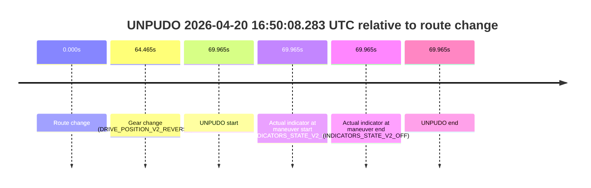
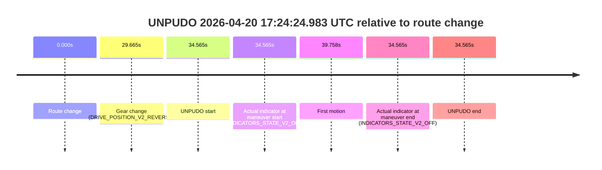
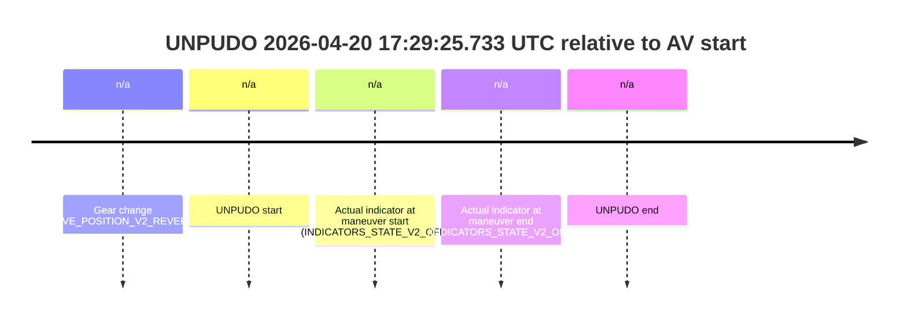

# Run Report: fme10003/2026-04-20--16-34-21--gen2-av-bfee6022-6cc5-4c76-b658-ee30a3f4ab6f

| Field | Value |
|---|---|
| Run ID | `fme10003/2026-04-20--16-34-21--gen2-av-bfee6022-6cc5-4c76-b658-ee30a3f4ab6f` |
| Date | `2026-04-20` |
| Model(s) | `blue-panther-solid` |
| Author | `guy.geva` |
| Event count | `3` |

## unpudo 2026-04-20 16:50:08.283 UTC

| Field | Value |
|---|---|
| Model | `blue-panther-solid` |
| Author | `guy.geva` |
| Run ID | `fme10003/2026-04-20--16-34-21--gen2-av-bfee6022-6cc5-4c76-b658-ee30a3f4ab6f` |
| Date | `2026-04-20` |
| Time (UTC) | `16:50:08.283` |
| Event type | `unpudo` |
| Disengagement type | `none observed` |
| Route change | `found` |
| Console | [run](https://console.sso.wayve.ai/run/fme10003/2026-04-20--16-34-21--gen2-av-bfee6022-6cc5-4c76-b658-ee30a3f4ab6f?id=&time-unixus=1776703808283301) |
| Foxglove | [segment](https://app.foxglove.dev/wayve-on-prem/p/prj_0dX18KZdVHg1fmmI/view?ds=foxglove-stream&ds.deviceName=fme10003&ds.start=2026-04-20T16%3A48%3A48.318172Z&ds.end=2026-04-20T16%3A50%3A18.283301Z&layoutId=lay_0e7VD4WIKDQGU73Y&time=2026-04-20T16%3A50%3A08.283301Z) |

### Event card: fail

- Fail: the credited unpudo does not stay AV-owned. The event window starts with DBW false, and the maneuver outcome lands outside a clean AV-owned segment.

| Event | Time (UTC) | Delta from route change |
|---|---:|---:|
| Route change | 2026-04-20 16:48:58.318 | `0.000s` |
| Gear change (DRIVE_POSITION_V2_REVERSE) | 2026-04-20 16:50:02.783 | `64.465s` |
| UNPUDO start | 2026-04-20 16:50:08.283 | `69.965s` |
| Actual indicator at maneuver start (INDICATORS_STATE_V2_OFF) | 2026-04-20 16:50:08.283 | `69.965s` |
| Actual indicator at maneuver end (INDICATORS_STATE_V2_OFF) | 2026-04-20 16:50:08.283 | `69.965s` |
| UNPUDO end | 2026-04-20 16:50:08.283 | `69.965s` |

| Metric | Value |
|---|---|
| Outcome | `fail` |
| Effective failure type | `not_av_owned` |
| Route change status | `found` |
| DBW at event start | `false` |
| DBW at event end | `false` |
| Predicted gear at AV start | `n/a` |
| Actual gear at AV start | `n/a` |
| Predicted gear at event start | `DRIVE_POSITION_V2_REVERSE` |
| Actual gear at event start | `DRIVE_POSITION_V2_REVERSE` |
| Planned indicator direction | `INDICATORS_STATE_V2_OFF` |
| Controller indicator direction | `INDICATORS_STATE_V2_OFF` |
| Actual indicator direction | `INDICATORS_STATE_V2_OFF` |
| Actual indicator at maneuver end | `INDICATORS_STATE_V2_OFF` |
| Driver accel help in AV | `false` |
| Driver accel help timestamp | `n/a` |
| Max accel pedal pct in AV | `0.0%` |
| Max brake pedal pct in AV | `0.0%` |
| Max speed mps in AV | `0.000` |
| Route -> AV | `n/a` |
| AV -> event start | `n/a` |
| AV -> first motion | `n/a` |
| AV duration before disengagement | `n/a` |
| Trajectory waypoint count | `37` |
| Driving-plan step count | `11` |

The scored portion starts from the AV-owned window, not from the pre-AV setup. Route-change search in the stopped pre-event segment was `found`, with the baseline therefore set to route change. At the event anchor the model predicts `DRIVE_POSITION_V2_REVERSE` and the actual gear is `DRIVE_POSITION_V2_REVERSE`. The effective model outcome is `fail` because `not_av_owned`.

### Resolution

| Field | Value |
|---|---|
| Final outcome | `fail` |
| Do we agree with this label? | `yes` |
| Source disengagement type | `none observed` |
| Resolved effective failure type | `not_av_owned` |
| Confidence | `high` |

## unpudo 2026-04-20 17:24:24.983 UTC

| Field | Value |
|---|---|
| Model | `blue-panther-solid` |
| Author | `guy.geva` |
| Run ID | `fme10003/2026-04-20--16-34-21--gen2-av-bfee6022-6cc5-4c76-b658-ee30a3f4ab6f` |
| Date | `2026-04-20` |
| Time (UTC) | `17:24:24.983` |
| Event type | `unpudo` |
| Disengagement type | `none observed` |
| Route change | `found` |
| Console | [run](https://console.sso.wayve.ai/run/fme10003/2026-04-20--16-34-21--gen2-av-bfee6022-6cc5-4c76-b658-ee30a3f4ab6f?id=&time-unixus=1776705864983308) |
| Foxglove | [segment](https://app.foxglove.dev/wayve-on-prem/p/prj_0dX18KZdVHg1fmmI/view?ds=foxglove-stream&ds.deviceName=fme10003&ds.start=2026-04-20T17%3A23%3A40.418256Z&ds.end=2026-04-20T17%3A24%3A34.983308Z&layoutId=lay_0e7VD4WIKDQGU73Y&time=2026-04-20T17%3A24%3A24.983308Z) |

### Event card: fail

- Fail: the credited unpudo does not stay AV-owned. The event window starts with DBW false, and the maneuver outcome lands outside a clean AV-owned segment.

| Event | Time (UTC) | Delta from route change |
|---|---:|---:|
| Route change | 2026-04-20 17:23:50.418 | `0.000s` |
| Gear change (DRIVE_POSITION_V2_REVERSE) | 2026-04-20 17:24:20.083 | `29.665s` |
| UNPUDO start | 2026-04-20 17:24:24.983 | `34.565s` |
| Actual indicator at maneuver start (INDICATORS_STATE_V2_OFF) | 2026-04-20 17:24:24.983 | `34.565s` |
| First motion | 2026-04-20 17:24:30.175 | `39.758s` |
| Actual indicator at maneuver end (INDICATORS_STATE_V2_OFF) | 2026-04-20 17:24:24.983 | `34.565s` |
| UNPUDO end | 2026-04-20 17:24:24.983 | `34.565s` |

| Metric | Value |
|---|---|
| Outcome | `fail` |
| Effective failure type | `not_av_owned` |
| Route change status | `found` |
| DBW at event start | `false` |
| DBW at event end | `false` |
| Predicted gear at AV start | `n/a` |
| Actual gear at AV start | `n/a` |
| Predicted gear at event start | `DRIVE_POSITION_V2_REVERSE` |
| Actual gear at event start | `DRIVE_POSITION_V2_REVERSE` |
| Planned indicator direction | `INDICATORS_STATE_V2_OFF` |
| Controller indicator direction | `INDICATORS_STATE_V2_OFF` |
| Actual indicator direction | `INDICATORS_STATE_V2_OFF` |
| Actual indicator at maneuver end | `INDICATORS_STATE_V2_OFF` |
| Driver accel help in AV | `false` |
| Driver accel help timestamp | `n/a` |
| Max accel pedal pct in AV | `0.0%` |
| Max brake pedal pct in AV | `0.0%` |
| Max speed mps in AV | `0.000` |
| Route -> AV | `n/a` |
| AV -> event start | `n/a` |
| AV -> first motion | `n/a` |
| AV duration before disengagement | `n/a` |
| Trajectory waypoint count | `37` |
| Driving-plan step count | `11` |

The scored portion starts from the AV-owned window, not from the pre-AV setup. Route-change search in the stopped pre-event segment was `found`, with the baseline therefore set to route change. At the event anchor the model predicts `DRIVE_POSITION_V2_REVERSE` and the actual gear is `DRIVE_POSITION_V2_REVERSE`. The effective model outcome is `fail` because `not_av_owned`.

### Resolution

| Field | Value |
|---|---|
| Final outcome | `fail` |
| Do we agree with this label? | `yes` |
| Source disengagement type | `none observed` |
| Resolved effective failure type | `not_av_owned` |
| Confidence | `high` |

## unpudo 2026-04-20 17:29:25.733 UTC

| Field | Value |
|---|---|
| Model | `blue-panther-solid` |
| Author | `guy.geva` |
| Run ID | `fme10003/2026-04-20--16-34-21--gen2-av-bfee6022-6cc5-4c76-b658-ee30a3f4ab6f` |
| Date | `2026-04-20` |
| Time (UTC) | `17:29:25.733` |
| Event type | `unpudo` |
| Disengagement type | `none observed` |
| Route change | `unclear` |
| Console | [run](https://console.sso.wayve.ai/run/fme10003/2026-04-20--16-34-21--gen2-av-bfee6022-6cc5-4c76-b658-ee30a3f4ab6f?id=&time-unixus=1776706165733293) |
| Foxglove | [segment](https://app.foxglove.dev/wayve-on-prem/p/prj_0dX18KZdVHg1fmmI/view?ds=foxglove-stream&ds.deviceName=fme10003&ds.start=2026-04-20T17%3A29%3A12.083308Z&ds.end=2026-04-20T17%3A29%3A35.733293Z&layoutId=lay_0e7VD4WIKDQGU73Y&time=2026-04-20T17%3A29%3A25.733293Z) |

### Event card: fail

- Fail: the credited unpudo does not stay AV-owned. The event window starts with DBW false, and the maneuver outcome lands outside a clean AV-owned segment.

| Event | Time (UTC) | Delta from AV start |
|---|---:|---:|
| Gear change (DRIVE_POSITION_V2_REVERSE) | 2026-04-20 17:29:22.083 | `n/a` |
| UNPUDO start | 2026-04-20 17:29:25.733 | `n/a` |
| Actual indicator at maneuver start (INDICATORS_STATE_V2_OFF) | 2026-04-20 17:29:25.733 | `n/a` |
| Actual indicator at maneuver end (INDICATORS_STATE_V2_OFF) | 2026-04-20 17:29:25.733 | `n/a` |
| UNPUDO end | 2026-04-20 17:29:25.733 | `n/a` |

| Metric | Value |
|---|---|
| Outcome | `fail` |
| Effective failure type | `not_av_owned` |
| Route change status | `unclear` |
| DBW at event start | `false` |
| DBW at event end | `false` |
| Predicted gear at AV start | `n/a` |
| Actual gear at AV start | `n/a` |
| Predicted gear at event start | `DRIVE_POSITION_V2_REVERSE` |
| Actual gear at event start | `DRIVE_POSITION_V2_REVERSE` |
| Planned indicator direction | `INDICATORS_STATE_V2_OFF` |
| Controller indicator direction | `INDICATORS_STATE_V2_OFF` |
| Actual indicator direction | `INDICATORS_STATE_V2_OFF` |
| Actual indicator at maneuver end | `INDICATORS_STATE_V2_OFF` |
| Driver accel help in AV | `false` |
| Driver accel help timestamp | `n/a` |
| Max accel pedal pct in AV | `0.0%` |
| Max brake pedal pct in AV | `0.0%` |
| Max speed mps in AV | `0.000` |
| Route -> AV | `n/a` |
| AV -> event start | `n/a` |
| AV -> first motion | `n/a` |
| AV duration before disengagement | `n/a` |
| Trajectory waypoint count | `38` |
| Driving-plan step count | `11` |

The scored portion starts from the AV-owned window, not from the pre-AV setup. Route-change search in the stopped pre-event segment was `unclear`, with the baseline therefore set to AV start. At the event anchor the model predicts `DRIVE_POSITION_V2_REVERSE` and the actual gear is `DRIVE_POSITION_V2_REVERSE`. The effective model outcome is `fail` because `not_av_owned`.

### Resolution

| Field | Value |
|---|---|
| Final outcome | `fail` |
| Do we agree with this label? | `yes` |
| Source disengagement type | `none observed` |
| Resolved effective failure type | `not_av_owned` |
| Confidence | `medium` |
