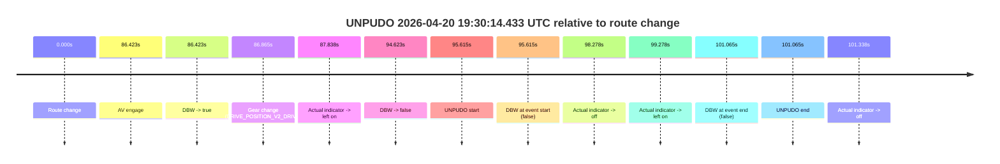
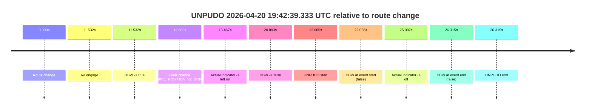

# Run Report: fme10003/2026-04-20--19-16-40--gen2-av-6e514031-1d30-469d-8c73-ae807d9c1a72

| Field | Value |
|---|---|
| Run ID | `fme10003/2026-04-20--19-16-40--gen2-av-6e514031-1d30-469d-8c73-ae807d9c1a72` |
| Date | `2026-04-20` |
| Model(s) | `pink-manta-ray-smooth` |
| Author | `guy.geva` |
| Event count | `2` |

## unpudo 2026-04-20 19:30:14.433 UTC

| Field | Value |
|---|---|
| Model | `pink-manta-ray-smooth` |
| Author | `guy.geva` |
| Run ID | `fme10003/2026-04-20--19-16-40--gen2-av-6e514031-1d30-469d-8c73-ae807d9c1a72` |
| Date | `2026-04-20` |
| Time (UTC) | `19:30:14.433` |
| Event type | `unpudo` |
| Disengagement type | `none observed` |
| Route change | `found` |
| Console | [run](https://console.sso.wayve.ai/run/fme10003/2026-04-20--19-16-40--gen2-av-6e514031-1d30-469d-8c73-ae807d9c1a72?id=&time-unixus=1776713414433307) |
| Foxglove | [segment](https://app.foxglove.dev/wayve-on-prem/p/prj_0dX18KZdVHg1fmmI/view?ds=foxglove-stream&ds.deviceName=fme10003&ds.start=2026-04-20T19%3A28%3A28.818279Z&ds.end=2026-04-20T19%3A30%3A29.883317Z&layoutId=lay_0e7VD4WIKDQGU73Y&time=2026-04-20T19%3A30%3A14.433307Z) |

### Event card: fail

- Fail: the credited unpudo does not stay AV-owned. The event window starts with DBW false, and the maneuver outcome lands outside a clean AV-owned segment.

| Event | Time (UTC) | Delta from route change |
|---|---:|---:|
| Route change | 2026-04-20 19:28:38.818 | `0.000s` |
| AV engage | 2026-04-20 19:30:05.240 | `86.423s` |
| DBW -> true | 2026-04-20 19:30:05.240 | `86.423s` |
| Gear change (DRIVE_POSITION_V2_DRIVE) | 2026-04-20 19:30:05.683 | `86.865s` |
| Actual indicator -> left on | 2026-04-20 19:30:06.656 | `87.838s` |
| DBW -> false | 2026-04-20 19:30:13.441 | `94.623s` |
| UNPUDO start | 2026-04-20 19:30:14.433 | `95.615s` |
| DBW at event start (false) | 2026-04-20 19:30:14.433 | `95.615s` |
| Actual indicator -> off | 2026-04-20 19:30:17.095 | `98.278s` |
| Actual indicator -> left on | 2026-04-20 19:30:18.095 | `99.278s` |
| DBW at event end (false) | 2026-04-20 19:30:19.883 | `101.065s` |
| UNPUDO end | 2026-04-20 19:30:19.883 | `101.065s` |
| Actual indicator -> off | 2026-04-20 19:30:20.155 | `101.338s` |

| Metric | Value |
|---|---|
| Outcome | `fail` |
| Effective failure type | `not_av_owned` |
| Route change status | `found` |
| DBW at event start | `false` |
| DBW at event end | `false` |
| Predicted gear at AV start | `DRIVE_POSITION_V2_DRIVE` |
| Actual gear at AV start | `DRIVE_POSITION_V2_PARK` |
| Predicted gear at event start | `DRIVE_POSITION_V2_DRIVE` |
| Actual gear at event start | `DRIVE_POSITION_V2_DRIVE` |
| Planned indicator direction | `INDICATORS_STATE_V2_LEFT_ON` |
| Controller indicator direction | `INDICATORS_STATE_V2_LEFT_ON` |
| Actual indicator direction | `INDICATORS_STATE_V2_LEFT_ON` |
| Actual indicator at maneuver end | `INDICATORS_STATE_V2_LEFT_ON` |
| Driver accel help in AV | `false` |
| Driver accel help timestamp | `n/a` |
| Max accel pedal pct in AV | `0.0%` |
| Max brake pedal pct in AV | `12.1%` |
| Max speed mps in AV | `0.000` |
| Success timing baseline | `route change` |
| Route -> AV | `86.423s` |
| AV -> event start | `9.192s` |
| AV -> first motion | `n/a` |
| Success baseline -> event start | `95.615s` |
| Success baseline -> first motion | `n/a` |
| AV duration before disengagement | `8.201s` |
| Trajectory waypoint count | `36` |
| Driving-plan step count | `11` |

The scored portion starts from the AV-owned window, not from the pre-AV setup. Route-change search in the stopped pre-event segment was `found`, with the baseline therefore set to route change. At the event anchor the model predicts `DRIVE_POSITION_V2_DRIVE` and the actual gear is `DRIVE_POSITION_V2_DRIVE`. The effective model outcome is `fail` because `not_av_owned.`

### Resolution

| Field | Value |
|---|---|
| Final outcome | `fail` |
| Do we agree with this label? | `yes` |
| Source disengagement type | `none observed` |
| Resolved effective failure type | `not_av_owned` |
| Confidence | `high` |

## unpudo 2026-04-20 19:42:39.333 UTC

| Field | Value |
|---|---|
| Model | `pink-manta-ray-smooth` |
| Author | `guy.geva` |
| Run ID | `fme10003/2026-04-20--19-16-40--gen2-av-6e514031-1d30-469d-8c73-ae807d9c1a72` |
| Date | `2026-04-20` |
| Time (UTC) | `19:42:39.333` |
| Event type | `unpudo` |
| Disengagement type | `none observed` |
| Route change | `found` |
| Console | [run](https://console.sso.wayve.ai/run/fme10003/2026-04-20--19-16-40--gen2-av-6e514031-1d30-469d-8c73-ae807d9c1a72?id=&time-unixus=1776714159333311) |
| Foxglove | [segment](https://app.foxglove.dev/wayve-on-prem/p/prj_0dX18KZdVHg1fmmI/view?ds=foxglove-stream&ds.deviceName=fme10003&ds.start=2026-04-20T19%3A42%3A07.268423Z&ds.end=2026-04-20T19%3A42%3A53.583310Z&layoutId=lay_0e7VD4WIKDQGU73Y&time=2026-04-20T19%3A42%3A39.333311Z) |

### Event card: fail

- Fail: the credited unpudo does not stay AV-owned. The event window starts with DBW false, and the maneuver outcome lands outside a clean AV-owned segment.

| Event | Time (UTC) | Delta from route change |
|---|---:|---:|
| Route change | 2026-04-20 19:42:17.268 | `0.000s` |
| AV engage | 2026-04-20 19:42:28.800 | `11.532s` |
| DBW -> true | 2026-04-20 19:42:28.800 | `11.532s` |
| Gear change (DRIVE_POSITION_V2_DRIVE) | 2026-04-20 19:42:29.333 | `12.065s` |
| Actual indicator -> left on | 2026-04-20 19:42:32.735 | `15.467s` |
| DBW -> false | 2026-04-20 19:42:38.161 | `20.893s` |
| UNPUDO start | 2026-04-20 19:42:39.333 | `22.065s` |
| DBW at event start (false) | 2026-04-20 19:42:39.333 | `22.065s` |
| Actual indicator -> off | 2026-04-20 19:42:42.355 | `25.087s` |
| DBW at event end (false) | 2026-04-20 19:42:43.583 | `26.315s` |
| UNPUDO end | 2026-04-20 19:42:43.583 | `26.315s` |

| Metric | Value |
|---|---|
| Outcome | `fail` |
| Effective failure type | `not_av_owned` |
| Route change status | `found` |
| DBW at event start | `false` |
| DBW at event end | `false` |
| Predicted gear at AV start | `DRIVE_POSITION_V2_DRIVE` |
| Actual gear at AV start | `DRIVE_POSITION_V2_PARK` |
| Predicted gear at event start | `DRIVE_POSITION_V2_DRIVE` |
| Actual gear at event start | `DRIVE_POSITION_V2_DRIVE` |
| Planned indicator direction | `INDICATORS_STATE_V2_LEFT_ON` |
| Controller indicator direction | `INDICATORS_STATE_V2_LEFT_ON` |
| Actual indicator direction | `INDICATORS_STATE_V2_LEFT_ON` |
| Actual indicator at maneuver end | `INDICATORS_STATE_V2_OFF` |
| Driver accel help in AV | `false` |
| Driver accel help timestamp | `n/a` |
| Max accel pedal pct in AV | `0.0%` |
| Max brake pedal pct in AV | `8.3%` |
| Max speed mps in AV | `0.000` |
| Success timing baseline | `route change` |
| Route -> AV | `11.532s` |
| AV -> event start | `10.532s` |
| AV -> first motion | `n/a` |
| Success baseline -> event start | `22.065s` |
| Success baseline -> first motion | `n/a` |
| AV duration before disengagement | `9.360s` |
| Trajectory waypoint count | `36` |
| Driving-plan step count | `11` |

The scored portion starts from the AV-owned window, not from the pre-AV setup. Route-change search in the stopped pre-event segment was `found`, with the baseline therefore set to route change. At the event anchor the model predicts `DRIVE_POSITION_V2_DRIVE` and the actual gear is `DRIVE_POSITION_V2_DRIVE`. The effective model outcome is `fail` because `not_av_owned.`

### Resolution

| Field | Value |
|---|---|
| Final outcome | `fail` |
| Do we agree with this label? | `yes` |
| Source disengagement type | `none observed` |
| Resolved effective failure type | `not_av_owned` |
| Confidence | `high` |
