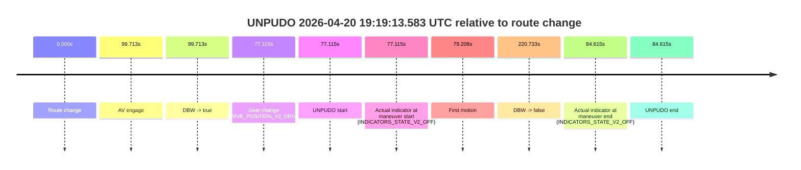
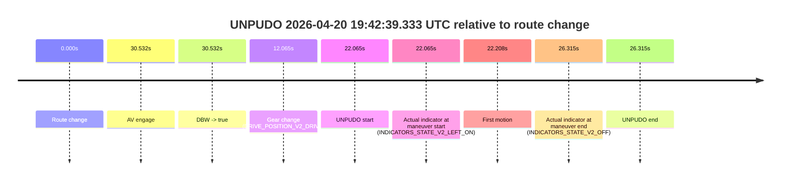

# Run Report: fme10003/2026-04-20--19-16-40--gen2-av-6e514031-1d30-469d-8c73-ae807d9c1a72

| Field | Value |
|---|---|
| Run ID | `fme10003/2026-04-20--19-16-40--gen2-av-6e514031-1d30-469d-8c73-ae807d9c1a72` |
| Date | `2026-04-20` |
| Model(s) | `pink-manta-ray-smooth` |
| Author | `guy.geva` |
| Event count | `3` |

## unpudo 2026-04-20 19:19:13.583 UTC

| Field | Value |
|---|---|
| Model | `pink-manta-ray-smooth` |
| Author | `guy.geva` |
| Run ID | `fme10003/2026-04-20--19-16-40--gen2-av-6e514031-1d30-469d-8c73-ae807d9c1a72` |
| Date | `2026-04-20` |
| Time (UTC) | `19:19:13.583` |
| Event type | `unpudo` |
| Disengagement type | `none observed` |
| Route change | `found` |
| Console | [run](https://console.sso.wayve.ai/run/fme10003/2026-04-20--19-16-40--gen2-av-6e514031-1d30-469d-8c73-ae807d9c1a72?id=&time-unixus=1776712753583301) |
| Foxglove | [segment](https://app.foxglove.dev/wayve-on-prem/p/prj_0dX18KZdVHg1fmmI/view?ds=foxglove-stream&ds.deviceName=fme10003&ds.start=2026-04-20T19%3A17%3A46.468349Z&ds.end=2026-04-20T19%3A21%3A47.201531Z&layoutId=lay_0e7VD4WIKDQGU73Y&time=2026-04-20T19%3A19%3A13.583301Z) |

### Event card: accidental

- Accidental: AV ownership is present for less than `2s`, so this is treated as an accidental brush with the maneuver rather than a meaningful model attempt.

| Event | Time (UTC) | Delta from route change |
|---|---:|---:|
| Route change | 2026-04-20 19:17:56.468 | `0.000s` |
| AV engage | 2026-04-20 19:19:36.181 | `99.713s` |
| DBW -> true | 2026-04-20 19:19:36.181 | `99.713s` |
| Gear change (DRIVE_POSITION_V2_DRIVE) | 2026-04-20 19:19:13.583 | `77.115s` |
| UNPUDO start | 2026-04-20 19:19:13.583 | `77.115s` |
| Actual indicator at maneuver start (INDICATORS_STATE_V2_OFF) | 2026-04-20 19:19:13.583 | `77.115s` |
| First motion | 2026-04-20 19:19:15.676 | `79.208s` |
| DBW -> false | 2026-04-20 19:21:37.201 | `220.733s` |
| Actual indicator at maneuver end (INDICATORS_STATE_V2_OFF) | 2026-04-20 19:19:21.083 | `84.615s` |
| UNPUDO end | 2026-04-20 19:19:21.083 | `84.615s` |

| Metric | Value |
|---|---|
| Outcome | `accidental` |
| Effective failure type | `none` |
| Route change status | `found` |
| DBW at event start | `false` |
| DBW at event end | `false` |
| Predicted gear at AV start | `DRIVE_POSITION_V2_DRIVE` |
| Actual gear at AV start | `DRIVE_POSITION_V2_DRIVE` |
| Predicted gear at event start | `DRIVE_POSITION_V2_DRIVE` |
| Actual gear at event start | `DRIVE_POSITION_V2_DRIVE` |
| Planned indicator direction | `INDICATORS_STATE_V2_OFF` |
| Controller indicator direction | `INDICATORS_STATE_V2_OFF` |
| Actual indicator direction | `INDICATORS_STATE_V2_OFF` |
| Actual indicator at maneuver end | `INDICATORS_STATE_V2_OFF` |
| Driver accel help in AV | `false` |
| Driver accel help timestamp | `n/a` |
| Max accel pedal pct in AV | `0.0%` |
| Max brake pedal pct in AV | `0.0%` |
| Max speed mps in AV | `0.000` |
| Route -> AV | `99.713s` |
| AV -> event start | `-22.598s` |
| AV -> first motion | `-20.505s` |
| AV duration before disengagement | `121.020s` |
| Trajectory waypoint count | `37` |
| Driving-plan step count | `11` |

The scored portion starts from the AV-owned window, not from the pre-AV setup. Route-change search in the stopped pre-event segment was `found`, with the baseline therefore set to route change. At the event anchor the model predicts `DRIVE_POSITION_V2_DRIVE` and the actual gear is `DRIVE_POSITION_V2_DRIVE`. The effective model outcome is `accidental` because `the AV-owned portion is shorter than 2s`.

### Resolution

| Field | Value |
|---|---|
| Final outcome | `accidental` |
| Do we agree with this label? | `yes` |
| Source disengagement type | `none observed` |
| Resolved effective failure type | `none` |
| Confidence | `high` |

## unpudo 2026-04-20 19:30:14.433 UTC

| Field | Value |
|---|---|
| Model | `pink-manta-ray-smooth` |
| Author | `guy.geva` |
| Run ID | `fme10003/2026-04-20--19-16-40--gen2-av-6e514031-1d30-469d-8c73-ae807d9c1a72` |
| Date | `2026-04-20` |
| Time (UTC) | `19:30:14.433` |
| Event type | `unpudo` |
| Disengagement type | `none observed` |
| Route change | `found` |
| Console | [run](https://console.sso.wayve.ai/run/fme10003/2026-04-20--19-16-40--gen2-av-6e514031-1d30-469d-8c73-ae807d9c1a72?id=&time-unixus=1776713414433307) |
| Foxglove | [segment](https://app.foxglove.dev/wayve-on-prem/p/prj_0dX18KZdVHg1fmmI/view?ds=foxglove-stream&ds.deviceName=fme10003&ds.start=2026-04-20T19%3A28%3A28.818279Z&ds.end=2026-04-20T19%3A31%3A58.600757Z&layoutId=lay_0e7VD4WIKDQGU73Y&time=2026-04-20T19%3A30%3A14.433307Z) |

### Event card: accidental

- Accidental: AV ownership is present for less than `2s`, so this is treated as an accidental brush with the maneuver rather than a meaningful model attempt.

| Event | Time (UTC) | Delta from route change |
|---|---:|---:|
| Route change | 2026-04-20 19:28:38.818 | `0.000s` |
| AV engage | 2026-04-20 19:30:27.241 | `108.423s` |
| DBW -> true | 2026-04-20 19:30:27.241 | `108.423s` |
| Gear change (DRIVE_POSITION_V2_DRIVE) | 2026-04-20 19:30:05.683 | `86.865s` |
| UNPUDO start | 2026-04-20 19:30:14.433 | `95.615s` |
| Actual indicator at maneuver start (INDICATORS_STATE_V2_LEFT_ON) | 2026-04-20 19:30:14.433 | `95.615s` |
| First motion | 2026-04-20 19:30:14.595 | `95.778s` |
| DBW -> false | 2026-04-20 19:31:48.600 | `189.782s` |
| Actual indicator at maneuver end (INDICATORS_STATE_V2_LEFT_ON) | 2026-04-20 19:30:19.883 | `101.065s` |
| UNPUDO end | 2026-04-20 19:30:19.883 | `101.065s` |

| Metric | Value |
|---|---|
| Outcome | `accidental` |
| Effective failure type | `none` |
| Route change status | `found` |
| DBW at event start | `false` |
| DBW at event end | `false` |
| Predicted gear at AV start | `DRIVE_POSITION_V2_DRIVE` |
| Actual gear at AV start | `DRIVE_POSITION_V2_DRIVE` |
| Predicted gear at event start | `DRIVE_POSITION_V2_DRIVE` |
| Actual gear at event start | `DRIVE_POSITION_V2_DRIVE` |
| Planned indicator direction | `INDICATORS_STATE_V2_LEFT_ON` |
| Controller indicator direction | `INDICATORS_STATE_V2_LEFT_ON` |
| Actual indicator direction | `INDICATORS_STATE_V2_LEFT_ON` |
| Actual indicator at maneuver end | `INDICATORS_STATE_V2_LEFT_ON` |
| Driver accel help in AV | `false` |
| Driver accel help timestamp | `n/a` |
| Max accel pedal pct in AV | `0.0%` |
| Max brake pedal pct in AV | `0.0%` |
| Max speed mps in AV | `0.000` |
| Route -> AV | `108.423s` |
| AV -> event start | `-12.808s` |
| AV -> first motion | `-12.645s` |
| AV duration before disengagement | `81.360s` |
| Trajectory waypoint count | `36` |
| Driving-plan step count | `11` |

The scored portion starts from the AV-owned window, not from the pre-AV setup. Route-change search in the stopped pre-event segment was `found`, with the baseline therefore set to route change. At the event anchor the model predicts `DRIVE_POSITION_V2_DRIVE` and the actual gear is `DRIVE_POSITION_V2_DRIVE`. The effective model outcome is `accidental` because `the AV-owned portion is shorter than 2s`.

### Resolution

| Field | Value |
|---|---|
| Final outcome | `accidental` |
| Do we agree with this label? | `yes` |
| Source disengagement type | `none observed` |
| Resolved effective failure type | `none` |
| Confidence | `high` |

## unpudo 2026-04-20 19:42:39.333 UTC

| Field | Value |
|---|---|
| Model | `pink-manta-ray-smooth` |
| Author | `guy.geva` |
| Run ID | `fme10003/2026-04-20--19-16-40--gen2-av-6e514031-1d30-469d-8c73-ae807d9c1a72` |
| Date | `2026-04-20` |
| Time (UTC) | `19:42:39.333` |
| Event type | `unpudo` |
| Disengagement type | `none observed` |
| Route change | `found` |
| Console | [run](https://console.sso.wayve.ai/run/fme10003/2026-04-20--19-16-40--gen2-av-6e514031-1d30-469d-8c73-ae807d9c1a72?id=&time-unixus=1776714159333311) |
| Foxglove | [segment](https://app.foxglove.dev/wayve-on-prem/p/prj_0dX18KZdVHg1fmmI/view?ds=foxglove-stream&ds.deviceName=fme10003&ds.start=2026-04-20T19%3A42%3A07.268423Z&ds.end=2026-04-20T19%3A42%3A53.583310Z&layoutId=lay_0e7VD4WIKDQGU73Y&time=2026-04-20T19%3A42%3A39.333311Z) |

### Event card: accidental

- Accidental: AV ownership is present for less than `2s`, so this is treated as an accidental brush with the maneuver rather than a meaningful model attempt.

| Event | Time (UTC) | Delta from route change |
|---|---:|---:|
| Route change | 2026-04-20 19:42:17.268 | `0.000s` |
| AV engage | 2026-04-20 19:42:47.800 | `30.532s` |
| DBW -> true | 2026-04-20 19:42:47.800 | `30.532s` |
| Gear change (DRIVE_POSITION_V2_DRIVE) | 2026-04-20 19:42:29.333 | `12.065s` |
| UNPUDO start | 2026-04-20 19:42:39.333 | `22.065s` |
| Actual indicator at maneuver start (INDICATORS_STATE_V2_LEFT_ON) | 2026-04-20 19:42:39.333 | `22.065s` |
| First motion | 2026-04-20 19:42:39.475 | `22.208s` |
| Actual indicator at maneuver end (INDICATORS_STATE_V2_OFF) | 2026-04-20 19:42:43.583 | `26.315s` |
| UNPUDO end | 2026-04-20 19:42:43.583 | `26.315s` |

| Metric | Value |
|---|---|
| Outcome | `accidental` |
| Effective failure type | `none` |
| Route change status | `found` |
| DBW at event start | `false` |
| DBW at event end | `false` |
| Predicted gear at AV start | `DRIVE_POSITION_V2_DRIVE` |
| Actual gear at AV start | `DRIVE_POSITION_V2_DRIVE` |
| Predicted gear at event start | `DRIVE_POSITION_V2_DRIVE` |
| Actual gear at event start | `DRIVE_POSITION_V2_DRIVE` |
| Planned indicator direction | `INDICATORS_STATE_V2_LEFT_ON` |
| Controller indicator direction | `INDICATORS_STATE_V2_LEFT_ON` |
| Actual indicator direction | `INDICATORS_STATE_V2_LEFT_ON` |
| Actual indicator at maneuver end | `INDICATORS_STATE_V2_OFF` |
| Driver accel help in AV | `false` |
| Driver accel help timestamp | `n/a` |
| Max accel pedal pct in AV | `0.0%` |
| Max brake pedal pct in AV | `0.0%` |
| Max speed mps in AV | `0.000` |
| Route -> AV | `30.532s` |
| AV -> event start | `-8.467s` |
| AV -> first motion | `-8.325s` |
| AV duration before disengagement | `n/a` |
| Trajectory waypoint count | `36` |
| Driving-plan step count | `11` |

The scored portion starts from the AV-owned window, not from the pre-AV setup. Route-change search in the stopped pre-event segment was `found`, with the baseline therefore set to route change. At the event anchor the model predicts `DRIVE_POSITION_V2_DRIVE` and the actual gear is `DRIVE_POSITION_V2_DRIVE`. The effective model outcome is `accidental` because `the AV-owned portion is shorter than 2s`.

### Resolution

| Field | Value |
|---|---|
| Final outcome | `accidental` |
| Do we agree with this label? | `yes` |
| Source disengagement type | `none observed` |
| Resolved effective failure type | `none` |
| Confidence | `high` |
