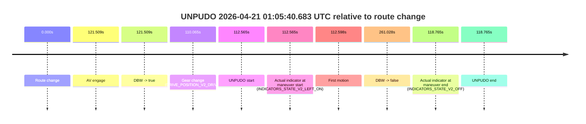
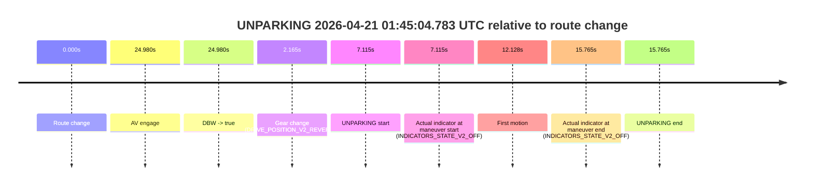

# Run Report: fme10003/2026-04-21--00-17-44--gen2-av-601b504d-11d5-4efe-942e-10a84ac2f5b0

| Field | Value |
|---|---|
| Run ID | `fme10003/2026-04-21--00-17-44--gen2-av-601b504d-11d5-4efe-942e-10a84ac2f5b0` |
| Date | `2026-04-21` |
| Model(s) | `blue-panther-solid` |
| Author | `guy.geva` |
| Event count | `8` |

## unpudo 2026-04-21 00:24:09.233 UTC

| Field | Value |
|---|---|
| Model | `blue-panther-solid` |
| Author | `guy.geva` |
| Run ID | `fme10003/2026-04-21--00-17-44--gen2-av-601b504d-11d5-4efe-942e-10a84ac2f5b0` |
| Date | `2026-04-21` |
| Time (UTC) | `00:24:09.233` |
| Event type | `unpudo` |
| Disengagement type | `failed_to_unpudo` |
| Route change | `found` |
| Console | [run](https://console.sso.wayve.ai/run/fme10003/2026-04-21--00-17-44--gen2-av-601b504d-11d5-4efe-942e-10a84ac2f5b0?id=&time-unixus=1776731049233289) |
| Foxglove | [segment](https://app.foxglove.dev/wayve-on-prem/p/prj_0dX18KZdVHg1fmmI/view?ds=foxglove-stream&ds.deviceName=fme10003&ds.start=2026-04-21T00%3A22%3A13.968242Z&ds.end=2026-04-21T00%3A27%3A46.145939Z&layoutId=lay_0e7VD4WIKDQGU73Y&time=2026-04-21T00%3A24%3A09.233289Z) |

### Event card: non-av

- Non-AV: there is no AV-owned portion anywhere inside the detected unpudo timeline, so it is kept for coverage but excluded from model success / failure scoring.

| Event | Time (UTC) | Delta from route change |
|---|---:|---:|
| Route change | 2026-04-21 00:22:23.968 | `0.000s` |
| AV engage | 2026-04-21 00:24:15.745 | `111.778s` |
| DBW -> true | 2026-04-21 00:24:15.745 | `111.778s` |
| Gear change (DRIVE_POSITION_V2_DRIVE) | 2026-04-21 00:24:04.633 | `100.665s` |
| UNPUDO start | 2026-04-21 00:24:09.233 | `105.265s` |
| Actual indicator at maneuver start (INDICATORS_STATE_V2_LEFT_ON) | 2026-04-21 00:24:09.233 | `105.265s` |
| First motion | 2026-04-21 00:24:09.255 | `105.288s` |
| DBW -> false | 2026-04-21 00:27:36.145 | `312.178s` |
| Actual indicator at maneuver end (INDICATORS_STATE_V2_OFF) | 2026-04-21 00:24:14.683 | `110.715s` |
| UNPUDO end | 2026-04-21 00:24:14.683 | `110.715s` |

| Metric | Value |
|---|---|
| Outcome | `non-av` |
| Effective failure type | `none` |
| Route change status | `found` |
| DBW at event start | `false` |
| DBW at event end | `false` |
| Predicted gear at AV start | `DRIVE_POSITION_V2_DRIVE` |
| Actual gear at AV start | `DRIVE_POSITION_V2_DRIVE` |
| Predicted gear at event start | `DRIVE_POSITION_V2_DRIVE` |
| Actual gear at event start | `DRIVE_POSITION_V2_DRIVE` |
| Planned indicator direction | `INDICATORS_STATE_V2_OFF` |
| Controller indicator direction | `INDICATORS_STATE_V2_OFF` |
| Actual indicator direction | `INDICATORS_STATE_V2_LEFT_ON` |
| Actual indicator at maneuver end | `INDICATORS_STATE_V2_OFF` |
| Driver accel help in AV | `false` |
| Driver accel help timestamp | `n/a` |
| Max accel pedal pct in AV | `0.0%` |
| Max brake pedal pct in AV | `0.0%` |
| Max speed mps in AV | `0.000` |
| Route -> AV | `111.778s` |
| AV -> event start | `-6.513s` |
| AV -> first motion | `-6.490s` |
| AV duration before disengagement | `200.400s` |
| Trajectory waypoint count | `37` |
| Driving-plan step count | `11` |

The scored portion starts from the AV-owned window, not from the pre-AV setup. Route-change search in the stopped pre-event segment was `found`, with the baseline therefore set to route change. At the event anchor the model predicts `DRIVE_POSITION_V2_DRIVE` and the actual gear is `DRIVE_POSITION_V2_DRIVE`. The effective model outcome is `non-av` because `there is no AV-owned overlap inside the event timeline`.

### Resolution

| Field | Value |
|---|---|
| Final outcome | `non-av` |
| Do we agree with this label? | `yes` |
| Source disengagement type | `failed_to_unpudo` |
| Resolved effective failure type | `none` |
| Confidence | `high` |

## unpudo 2026-04-21 00:33:53.083 UTC

| Field | Value |
|---|---|
| Model | `blue-panther-solid` |
| Author | `guy.geva` |
| Run ID | `fme10003/2026-04-21--00-17-44--gen2-av-601b504d-11d5-4efe-942e-10a84ac2f5b0` |
| Date | `2026-04-21` |
| Time (UTC) | `00:33:53.083` |
| Event type | `unpudo` |
| Disengagement type | `none observed` |
| Route change | `found` |
| Console | [run](https://console.sso.wayve.ai/run/fme10003/2026-04-21--00-17-44--gen2-av-601b504d-11d5-4efe-942e-10a84ac2f5b0?id=&time-unixus=1776731633083312) |
| Foxglove | [segment](https://app.foxglove.dev/wayve-on-prem/p/prj_0dX18KZdVHg1fmmI/view?ds=foxglove-stream&ds.deviceName=fme10003&ds.start=2026-04-21T00%3A32%3A37.018565Z&ds.end=2026-04-21T00%3A39%3A07.486503Z&layoutId=lay_0e7VD4WIKDQGU73Y&time=2026-04-21T00%3A33%3A53.083312Z) |

### Event card: non-av

- Non-AV: there is no AV-owned portion anywhere inside the detected unpudo timeline, so it is kept for coverage but excluded from model success / failure scoring.

| Event | Time (UTC) | Delta from route change |
|---|---:|---:|
| Route change | 2026-04-21 00:32:47.018 | `0.000s` |
| AV engage | 2026-04-21 00:34:00.005 | `72.987s` |
| DBW -> true | 2026-04-21 00:34:00.005 | `72.987s` |
| Gear change (DRIVE_POSITION_V2_DRIVE) | 2026-04-21 00:33:50.783 | `63.765s` |
| UNPUDO start | 2026-04-21 00:33:53.083 | `66.065s` |
| Actual indicator at maneuver start (INDICATORS_STATE_V2_LEFT_ON) | 2026-04-21 00:33:53.083 | `66.065s` |
| First motion | 2026-04-21 00:33:53.096 | `66.078s` |
| DBW -> false | 2026-04-21 00:38:57.486 | `370.468s` |
| Actual indicator at maneuver end (INDICATORS_STATE_V2_OFF) | 2026-04-21 00:33:56.833 | `69.815s` |
| UNPUDO end | 2026-04-21 00:33:56.833 | `69.815s` |

| Metric | Value |
|---|---|
| Outcome | `non-av` |
| Effective failure type | `none` |
| Route change status | `found` |
| DBW at event start | `false` |
| DBW at event end | `false` |
| Predicted gear at AV start | `DRIVE_POSITION_V2_DRIVE` |
| Actual gear at AV start | `DRIVE_POSITION_V2_DRIVE` |
| Predicted gear at event start | `DRIVE_POSITION_V2_DRIVE` |
| Actual gear at event start | `DRIVE_POSITION_V2_DRIVE` |
| Planned indicator direction | `INDICATORS_STATE_V2_OFF` |
| Controller indicator direction | `INDICATORS_STATE_V2_OFF` |
| Actual indicator direction | `INDICATORS_STATE_V2_LEFT_ON` |
| Actual indicator at maneuver end | `INDICATORS_STATE_V2_OFF` |
| Driver accel help in AV | `false` |
| Driver accel help timestamp | `n/a` |
| Max accel pedal pct in AV | `0.0%` |
| Max brake pedal pct in AV | `0.0%` |
| Max speed mps in AV | `0.000` |
| Route -> AV | `72.987s` |
| AV -> event start | `-6.923s` |
| AV -> first motion | `-6.910s` |
| AV duration before disengagement | `297.481s` |
| Trajectory waypoint count | `36` |
| Driving-plan step count | `11` |

The scored portion starts from the AV-owned window, not from the pre-AV setup. Route-change search in the stopped pre-event segment was `found`, with the baseline therefore set to route change. At the event anchor the model predicts `DRIVE_POSITION_V2_DRIVE` and the actual gear is `DRIVE_POSITION_V2_DRIVE`. The effective model outcome is `non-av` because `there is no AV-owned overlap inside the event timeline`.

### Resolution

| Field | Value |
|---|---|
| Final outcome | `non-av` |
| Do we agree with this label? | `yes` |
| Source disengagement type | `none observed` |
| Resolved effective failure type | `none` |
| Confidence | `high` |

## unpudo 2026-04-21 00:48:33.133 UTC

| Field | Value |
|---|---|
| Model | `blue-panther-solid` |
| Author | `guy.geva` |
| Run ID | `fme10003/2026-04-21--00-17-44--gen2-av-601b504d-11d5-4efe-942e-10a84ac2f5b0` |
| Date | `2026-04-21` |
| Time (UTC) | `00:48:33.133` |
| Event type | `unpudo` |
| Disengagement type | `none observed` |
| Route change | `found` |
| Console | [run](https://console.sso.wayve.ai/run/fme10003/2026-04-21--00-17-44--gen2-av-601b504d-11d5-4efe-942e-10a84ac2f5b0?id=&time-unixus=1776732513133310) |
| Foxglove | [segment](https://app.foxglove.dev/wayve-on-prem/p/prj_0dX18KZdVHg1fmmI/view?ds=foxglove-stream&ds.deviceName=fme10003&ds.start=2026-04-21T00%3A48%3A15.668274Z&ds.end=2026-04-21T00%3A49%3A04.986782Z&layoutId=lay_0e7VD4WIKDQGU73Y&time=2026-04-21T00%3A48%3A33.133310Z) |

### Event card: non-av

- Non-AV: there is no AV-owned portion anywhere inside the detected unpudo timeline, so it is kept for coverage but excluded from model success / failure scoring.

| Event | Time (UTC) | Delta from route change |
|---|---:|---:|
| Route change | 2026-04-21 00:48:25.668 | `0.000s` |
| AV engage | 2026-04-21 00:48:43.065 | `17.398s` |
| DBW -> true | 2026-04-21 00:48:43.065 | `17.398s` |
| Gear change (DRIVE_POSITION_V2_DRIVE) | 2026-04-21 00:48:26.083 | `0.415s` |
| UNPUDO start | 2026-04-21 00:48:33.133 | `7.465s` |
| Actual indicator at maneuver start (INDICATORS_STATE_V2_LEFT_ON) | 2026-04-21 00:48:33.133 | `7.465s` |
| First motion | 2026-04-21 00:48:33.156 | `7.488s` |
| DBW -> false | 2026-04-21 00:48:54.986 | `29.319s` |
| Actual indicator at maneuver end (INDICATORS_STATE_V2_OFF) | 2026-04-21 00:48:37.583 | `11.915s` |
| UNPUDO end | 2026-04-21 00:48:37.583 | `11.915s` |

| Metric | Value |
|---|---|
| Outcome | `non-av` |
| Effective failure type | `none` |
| Route change status | `found` |
| DBW at event start | `false` |
| DBW at event end | `false` |
| Predicted gear at AV start | `DRIVE_POSITION_V2_DRIVE` |
| Actual gear at AV start | `DRIVE_POSITION_V2_DRIVE` |
| Predicted gear at event start | `DRIVE_POSITION_V2_DRIVE` |
| Actual gear at event start | `DRIVE_POSITION_V2_DRIVE` |
| Planned indicator direction | `INDICATORS_STATE_V2_OFF` |
| Controller indicator direction | `INDICATORS_STATE_V2_OFF` |
| Actual indicator direction | `INDICATORS_STATE_V2_LEFT_ON` |
| Actual indicator at maneuver end | `INDICATORS_STATE_V2_OFF` |
| Driver accel help in AV | `false` |
| Driver accel help timestamp | `n/a` |
| Max accel pedal pct in AV | `0.0%` |
| Max brake pedal pct in AV | `0.0%` |
| Max speed mps in AV | `0.000` |
| Route -> AV | `17.398s` |
| AV -> event start | `-9.933s` |
| AV -> first motion | `-9.910s` |
| AV duration before disengagement | `11.921s` |
| Trajectory waypoint count | `37` |
| Driving-plan step count | `11` |

The scored portion starts from the AV-owned window, not from the pre-AV setup. Route-change search in the stopped pre-event segment was `found`, with the baseline therefore set to route change. At the event anchor the model predicts `DRIVE_POSITION_V2_DRIVE` and the actual gear is `DRIVE_POSITION_V2_DRIVE`. The effective model outcome is `non-av` because `there is no AV-owned overlap inside the event timeline`.

### Resolution

| Field | Value |
|---|---|
| Final outcome | `non-av` |
| Do we agree with this label? | `yes` |
| Source disengagement type | `none observed` |
| Resolved effective failure type | `none` |
| Confidence | `high` |

## unpudo 2026-04-21 00:50:10.983 UTC

| Field | Value |
|---|---|
| Model | `blue-panther-solid` |
| Author | `guy.geva` |
| Run ID | `fme10003/2026-04-21--00-17-44--gen2-av-601b504d-11d5-4efe-942e-10a84ac2f5b0` |
| Date | `2026-04-21` |
| Time (UTC) | `00:50:10.983` |
| Event type | `unpudo` |
| Disengagement type | `none observed` |
| Route change | `found` |
| Console | [run](https://console.sso.wayve.ai/run/fme10003/2026-04-21--00-17-44--gen2-av-601b504d-11d5-4efe-942e-10a84ac2f5b0?id=&time-unixus=1776732610983296) |
| Foxglove | [segment](https://app.foxglove.dev/wayve-on-prem/p/prj_0dX18KZdVHg1fmmI/view?ds=foxglove-stream&ds.deviceName=fme10003&ds.start=2026-04-21T00%3A48%3A15.668274Z&ds.end=2026-04-21T00%3A51%3A28.425879Z&layoutId=lay_0e7VD4WIKDQGU73Y&time=2026-04-21T00%3A50%3A10.983296Z) |

### Event card: non-av

- Non-AV: there is no AV-owned portion anywhere inside the detected unpudo timeline, so it is kept for coverage but excluded from model success / failure scoring.

| Event | Time (UTC) | Delta from route change |
|---|---:|---:|
| Route change | 2026-04-21 00:48:25.668 | `0.000s` |
| AV engage | 2026-04-21 00:50:15.705 | `110.038s` |
| DBW -> true | 2026-04-21 00:50:15.705 | `110.038s` |
| Gear change (DRIVE_POSITION_V2_DRIVE) | 2026-04-21 00:50:10.133 | `104.465s` |
| UNPUDO start | 2026-04-21 00:50:10.983 | `105.315s` |
| Actual indicator at maneuver start (INDICATORS_STATE_V2_LEFT_ON) | 2026-04-21 00:50:10.983 | `105.315s` |
| First motion | 2026-04-21 00:50:11.095 | `105.428s` |
| DBW -> false | 2026-04-21 00:51:18.425 | `172.758s` |
| Actual indicator at maneuver end (INDICATORS_STATE_V2_OFF) | 2026-04-21 00:50:14.733 | `109.065s` |
| UNPUDO end | 2026-04-21 00:50:14.733 | `109.065s` |

| Metric | Value |
|---|---|
| Outcome | `non-av` |
| Effective failure type | `none` |
| Route change status | `found` |
| DBW at event start | `false` |
| DBW at event end | `false` |
| Predicted gear at AV start | `DRIVE_POSITION_V2_DRIVE` |
| Actual gear at AV start | `DRIVE_POSITION_V2_DRIVE` |
| Predicted gear at event start | `DRIVE_POSITION_V2_DRIVE` |
| Actual gear at event start | `DRIVE_POSITION_V2_DRIVE` |
| Planned indicator direction | `INDICATORS_STATE_V2_LEFT_ON` |
| Controller indicator direction | `INDICATORS_STATE_V2_LEFT_ON` |
| Actual indicator direction | `INDICATORS_STATE_V2_LEFT_ON` |
| Actual indicator at maneuver end | `INDICATORS_STATE_V2_OFF` |
| Driver accel help in AV | `false` |
| Driver accel help timestamp | `n/a` |
| Max accel pedal pct in AV | `0.0%` |
| Max brake pedal pct in AV | `0.0%` |
| Max speed mps in AV | `0.000` |
| Route -> AV | `110.038s` |
| AV -> event start | `-4.722s` |
| AV -> first motion | `-4.610s` |
| AV duration before disengagement | `62.720s` |
| Trajectory waypoint count | `36` |
| Driving-plan step count | `11` |

The scored portion starts from the AV-owned window, not from the pre-AV setup. Route-change search in the stopped pre-event segment was `found`, with the baseline therefore set to route change. At the event anchor the model predicts `DRIVE_POSITION_V2_DRIVE` and the actual gear is `DRIVE_POSITION_V2_DRIVE`. The effective model outcome is `non-av` because `there is no AV-owned overlap inside the event timeline`.

### Resolution

| Field | Value |
|---|---|
| Final outcome | `non-av` |
| Do we agree with this label? | `yes` |
| Source disengagement type | `none observed` |
| Resolved effective failure type | `none` |
| Confidence | `high` |

## unpudo 2026-04-21 01:00:27.833 UTC

| Field | Value |
|---|---|
| Model | `blue-panther-solid` |
| Author | `guy.geva` |
| Run ID | `fme10003/2026-04-21--00-17-44--gen2-av-601b504d-11d5-4efe-942e-10a84ac2f5b0` |
| Date | `2026-04-21` |
| Time (UTC) | `01:00:27.833` |
| Event type | `unpudo` |
| Disengagement type | `none observed` |
| Route change | `found` |
| Console | [run](https://console.sso.wayve.ai/run/fme10003/2026-04-21--00-17-44--gen2-av-601b504d-11d5-4efe-942e-10a84ac2f5b0?id=&time-unixus=1776733227833326) |
| Foxglove | [segment](https://app.foxglove.dev/wayve-on-prem/p/prj_0dX18KZdVHg1fmmI/view?ds=foxglove-stream&ds.deviceName=fme10003&ds.start=2026-04-21T01%3A00%3A10.568292Z&ds.end=2026-04-21T01%3A01%3A09.347751Z&layoutId=lay_0e7VD4WIKDQGU73Y&time=2026-04-21T01%3A00%3A27.833326Z) |

### Event card: non-av

- Non-AV: there is no AV-owned portion anywhere inside the detected unpudo timeline, so it is kept for coverage but excluded from model success / failure scoring.

| Event | Time (UTC) | Delta from route change |
|---|---:|---:|
| Route change | 2026-04-21 01:00:20.568 | `0.000s` |
| AV engage | 2026-04-21 01:00:35.667 | `15.099s` |
| DBW -> true | 2026-04-21 01:00:35.667 | `15.099s` |
| Gear change (DRIVE_POSITION_V2_REVERSE) | 2026-04-21 01:00:20.883 | `0.315s` |
| UNPUDO start | 2026-04-21 01:00:27.833 | `7.265s` |
| Actual indicator at maneuver start (INDICATORS_STATE_V2_OFF) | 2026-04-21 01:00:27.833 | `7.265s` |
| First motion | 2026-04-21 01:00:30.115 | `9.548s` |
| DBW -> false | 2026-04-21 01:00:59.347 | `38.779s` |
| Actual indicator at maneuver end (INDICATORS_STATE_V2_OFF) | 2026-04-21 01:00:34.383 | `13.815s` |
| UNPUDO end | 2026-04-21 01:00:34.383 | `13.815s` |

| Metric | Value |
|---|---|
| Outcome | `non-av` |
| Effective failure type | `none` |
| Route change status | `found` |
| DBW at event start | `false` |
| DBW at event end | `false` |
| Predicted gear at AV start | `DRIVE_POSITION_V2_DRIVE` |
| Actual gear at AV start | `DRIVE_POSITION_V2_DRIVE` |
| Predicted gear at event start | `DRIVE_POSITION_V2_REVERSE` |
| Actual gear at event start | `DRIVE_POSITION_V2_REVERSE` |
| Planned indicator direction | `INDICATORS_STATE_V2_OFF` |
| Controller indicator direction | `INDICATORS_STATE_V2_OFF` |
| Actual indicator direction | `INDICATORS_STATE_V2_OFF` |
| Actual indicator at maneuver end | `INDICATORS_STATE_V2_OFF` |
| Driver accel help in AV | `false` |
| Driver accel help timestamp | `n/a` |
| Max accel pedal pct in AV | `0.0%` |
| Max brake pedal pct in AV | `0.0%` |
| Max speed mps in AV | `0.000` |
| Route -> AV | `15.099s` |
| AV -> event start | `-7.834s` |
| AV -> first motion | `-5.551s` |
| AV duration before disengagement | `23.681s` |
| Trajectory waypoint count | `37` |
| Driving-plan step count | `11` |

The scored portion starts from the AV-owned window, not from the pre-AV setup. Route-change search in the stopped pre-event segment was `found`, with the baseline therefore set to route change. At the event anchor the model predicts `DRIVE_POSITION_V2_REVERSE` and the actual gear is `DRIVE_POSITION_V2_REVERSE`. The effective model outcome is `non-av` because `there is no AV-owned overlap inside the event timeline`.

### Resolution

| Field | Value |
|---|---|
| Final outcome | `non-av` |
| Do we agree with this label? | `yes` |
| Source disengagement type | `none observed` |
| Resolved effective failure type | `none` |
| Confidence | `high` |

## unpudo 2026-04-21 01:05:40.683 UTC

| Field | Value |
|---|---|
| Model | `blue-panther-solid` |
| Author | `guy.geva` |
| Run ID | `fme10003/2026-04-21--00-17-44--gen2-av-601b504d-11d5-4efe-942e-10a84ac2f5b0` |
| Date | `2026-04-21` |
| Time (UTC) | `01:05:40.683` |
| Event type | `unpudo` |
| Disengagement type | `none observed` |
| Route change | `found` |
| Console | [run](https://console.sso.wayve.ai/run/fme10003/2026-04-21--00-17-44--gen2-av-601b504d-11d5-4efe-942e-10a84ac2f5b0?id=&time-unixus=1776733540683306) |
| Foxglove | [segment](https://app.foxglove.dev/wayve-on-prem/p/prj_0dX18KZdVHg1fmmI/view?ds=foxglove-stream&ds.deviceName=fme10003&ds.start=2026-04-21T01%3A03%3A38.118248Z&ds.end=2026-04-21T01%3A08%3A19.145765Z&layoutId=lay_0e7VD4WIKDQGU73Y&time=2026-04-21T01%3A05%3A40.683306Z) |

### Event card: non-av

- Non-AV: there is no AV-owned portion anywhere inside the detected unpudo timeline, so it is kept for coverage but excluded from model success / failure scoring.

| Event | Time (UTC) | Delta from route change |
|---|---:|---:|
| Route change | 2026-04-21 01:03:48.118 | `0.000s` |
| AV engage | 2026-04-21 01:05:49.626 | `121.509s` |
| DBW -> true | 2026-04-21 01:05:49.626 | `121.509s` |
| Gear change (DRIVE_POSITION_V2_DRIVE) | 2026-04-21 01:05:38.183 | `110.065s` |
| UNPUDO start | 2026-04-21 01:05:40.683 | `112.565s` |
| Actual indicator at maneuver start (INDICATORS_STATE_V2_LEFT_ON) | 2026-04-21 01:05:40.683 | `112.565s` |
| First motion | 2026-04-21 01:05:40.716 | `112.598s` |
| DBW -> false | 2026-04-21 01:08:09.145 | `261.028s` |
| Actual indicator at maneuver end (INDICATORS_STATE_V2_OFF) | 2026-04-21 01:05:46.883 | `118.765s` |
| UNPUDO end | 2026-04-21 01:05:46.883 | `118.765s` |

| Metric | Value |
|---|---|
| Outcome | `non-av` |
| Effective failure type | `none` |
| Route change status | `found` |
| DBW at event start | `false` |
| DBW at event end | `false` |
| Predicted gear at AV start | `DRIVE_POSITION_V2_DRIVE` |
| Actual gear at AV start | `DRIVE_POSITION_V2_DRIVE` |
| Predicted gear at event start | `DRIVE_POSITION_V2_DRIVE` |
| Actual gear at event start | `DRIVE_POSITION_V2_DRIVE` |
| Planned indicator direction | `INDICATORS_STATE_V2_OFF` |
| Controller indicator direction | `INDICATORS_STATE_V2_OFF` |
| Actual indicator direction | `INDICATORS_STATE_V2_LEFT_ON` |
| Actual indicator at maneuver end | `INDICATORS_STATE_V2_OFF` |
| Driver accel help in AV | `false` |
| Driver accel help timestamp | `n/a` |
| Max accel pedal pct in AV | `0.0%` |
| Max brake pedal pct in AV | `0.0%` |
| Max speed mps in AV | `0.000` |
| Route -> AV | `121.509s` |
| AV -> event start | `-8.944s` |
| AV -> first motion | `-8.911s` |
| AV duration before disengagement | `139.519s` |
| Trajectory waypoint count | `36` |
| Driving-plan step count | `11` |

The scored portion starts from the AV-owned window, not from the pre-AV setup. Route-change search in the stopped pre-event segment was `found`, with the baseline therefore set to route change. At the event anchor the model predicts `DRIVE_POSITION_V2_DRIVE` and the actual gear is `DRIVE_POSITION_V2_DRIVE`. The effective model outcome is `non-av` because `there is no AV-owned overlap inside the event timeline`.

### Resolution

| Field | Value |
|---|---|
| Final outcome | `non-av` |
| Do we agree with this label? | `yes` |
| Source disengagement type | `none observed` |
| Resolved effective failure type | `none` |
| Confidence | `high` |

## unpudo 2026-04-21 01:18:44.383 UTC

| Field | Value |
|---|---|
| Model | `blue-panther-solid` |
| Author | `guy.geva` |
| Run ID | `fme10003/2026-04-21--00-17-44--gen2-av-601b504d-11d5-4efe-942e-10a84ac2f5b0` |
| Date | `2026-04-21` |
| Time (UTC) | `01:18:44.383` |
| Event type | `unpudo` |
| Disengagement type | `none observed` |
| Route change | `found` |
| Console | [run](https://console.sso.wayve.ai/run/fme10003/2026-04-21--00-17-44--gen2-av-601b504d-11d5-4efe-942e-10a84ac2f5b0?id=&time-unixus=1776734324383316) |
| Foxglove | [segment](https://app.foxglove.dev/wayve-on-prem/p/prj_0dX18KZdVHg1fmmI/view?ds=foxglove-stream&ds.deviceName=fme10003&ds.start=2026-04-21T01%3A18%3A05.568319Z&ds.end=2026-04-21T01%3A20%3A49.085835Z&layoutId=lay_0e7VD4WIKDQGU73Y&time=2026-04-21T01%3A18%3A44.383316Z) |

### Event card: accidental

- Accidental: AV ownership is present for less than `2s`, so this is treated as an accidental brush with the maneuver rather than a meaningful model attempt.

| Event | Time (UTC) | Delta from route change |
|---|---:|---:|
| Route change | 2026-04-21 01:18:15.568 | `0.000s` |
| AV engage | 2026-04-21 01:18:46.685 | `31.118s` |
| DBW -> true | 2026-04-21 01:18:46.685 | `31.118s` |
| Gear change (DRIVE_POSITION_V2_DRIVE) | 2026-04-21 01:18:42.833 | `27.265s` |
| UNPUDO start | 2026-04-21 01:18:44.383 | `28.815s` |
| Actual indicator at maneuver start (INDICATORS_STATE_V2_OFF) | 2026-04-21 01:18:44.383 | `28.815s` |
| First motion | 2026-04-21 01:18:44.436 | `28.868s` |
| DBW -> false | 2026-04-21 01:20:39.085 | `143.518s` |
| Actual indicator at maneuver end (INDICATORS_STATE_V2_OFF) | 2026-04-21 01:18:48.233 | `32.665s` |
| UNPUDO end | 2026-04-21 01:18:48.233 | `32.665s` |

| Metric | Value |
|---|---|
| Outcome | `accidental` |
| Effective failure type | `none` |
| Route change status | `found` |
| DBW at event start | `false` |
| DBW at event end | `true` |
| Predicted gear at AV start | `DRIVE_POSITION_V2_DRIVE` |
| Actual gear at AV start | `DRIVE_POSITION_V2_DRIVE` |
| Predicted gear at event start | `DRIVE_POSITION_V2_DRIVE` |
| Actual gear at event start | `DRIVE_POSITION_V2_DRIVE` |
| Planned indicator direction | `INDICATORS_STATE_V2_LEFT_ON` |
| Controller indicator direction | `INDICATORS_STATE_V2_LEFT_ON` |
| Actual indicator direction | `INDICATORS_STATE_V2_OFF` |
| Actual indicator at maneuver end | `INDICATORS_STATE_V2_OFF` |
| Driver accel help in AV | `false` |
| Driver accel help timestamp | `n/a` |
| Max accel pedal pct in AV | `0.0%` |
| Max brake pedal pct in AV | `0.0%` |
| Max speed mps in AV | `4.339` |
| Route -> AV | `31.118s` |
| AV -> event start | `-2.303s` |
| AV -> first motion | `-2.250s` |
| AV duration before disengagement | `112.400s` |
| Trajectory waypoint count | `36` |
| Driving-plan step count | `11` |

The scored portion starts from the AV-owned window, not from the pre-AV setup. Route-change search in the stopped pre-event segment was `found`, with the baseline therefore set to route change. At the event anchor the model predicts `DRIVE_POSITION_V2_DRIVE` and the actual gear is `DRIVE_POSITION_V2_DRIVE`. The effective model outcome is `accidental` because `the AV-owned portion is shorter than 2s`.

### Resolution

| Field | Value |
|---|---|
| Final outcome | `accidental` |
| Do we agree with this label? | `yes` |
| Source disengagement type | `none observed` |
| Resolved effective failure type | `none` |
| Confidence | `high` |

## unparking 2026-04-21 01:45:04.783 UTC

| Field | Value |
|---|---|
| Model | `blue-panther-solid` |
| Author | `guy.geva` |
| Run ID | `fme10003/2026-04-21--00-17-44--gen2-av-601b504d-11d5-4efe-942e-10a84ac2f5b0` |
| Date | `2026-04-21` |
| Time (UTC) | `01:45:04.783` |
| Event type | `unparking` |
| Disengagement type | `none observed` |
| Route change | `found` |
| Console | [run](https://console.sso.wayve.ai/run/fme10003/2026-04-21--00-17-44--gen2-av-601b504d-11d5-4efe-942e-10a84ac2f5b0?id=&time-unixus=1776735904783310) |
| Foxglove | [segment](https://app.foxglove.dev/wayve-on-prem/p/prj_0dX18KZdVHg1fmmI/view?ds=foxglove-stream&ds.deviceName=fme10003&ds.start=2026-04-21T01%3A44%3A47.668305Z&ds.end=2026-04-21T01%3A45%3A23.433308Z&layoutId=lay_0e7VD4WIKDQGU73Y&time=2026-04-21T01%3A45%3A04.783310Z) |

### Event card: non-av

- Non-AV: there is no AV-owned portion anywhere inside the detected unparking timeline, so it is kept for coverage but excluded from model success / failure scoring.

| Event | Time (UTC) | Delta from route change |
|---|---:|---:|
| Route change | 2026-04-21 01:44:57.668 | `0.000s` |
| AV engage | 2026-04-21 01:45:22.647 | `24.980s` |
| DBW -> true | 2026-04-21 01:45:22.647 | `24.980s` |
| Gear change (DRIVE_POSITION_V2_REVERSE) | 2026-04-21 01:44:59.833 | `2.165s` |
| UNPARKING start | 2026-04-21 01:45:04.783 | `7.115s` |
| Actual indicator at maneuver start (INDICATORS_STATE_V2_OFF) | 2026-04-21 01:45:04.783 | `7.115s` |
| First motion | 2026-04-21 01:45:09.796 | `12.128s` |
| Actual indicator at maneuver end (INDICATORS_STATE_V2_OFF) | 2026-04-21 01:45:13.433 | `15.765s` |
| UNPARKING end | 2026-04-21 01:45:13.433 | `15.765s` |

| Metric | Value |
|---|---|
| Outcome | `non-av` |
| Effective failure type | `none` |
| Route change status | `found` |
| DBW at event start | `false` |
| DBW at event end | `false` |
| Predicted gear at AV start | `DRIVE_POSITION_V2_DRIVE` |
| Actual gear at AV start | `DRIVE_POSITION_V2_DRIVE` |
| Predicted gear at event start | `DRIVE_POSITION_V2_REVERSE` |
| Actual gear at event start | `DRIVE_POSITION_V2_REVERSE` |
| Planned indicator direction | `INDICATORS_STATE_V2_OFF` |
| Controller indicator direction | `INDICATORS_STATE_V2_OFF` |
| Actual indicator direction | `INDICATORS_STATE_V2_OFF` |
| Actual indicator at maneuver end | `INDICATORS_STATE_V2_OFF` |
| Driver accel help in AV | `false` |
| Driver accel help timestamp | `n/a` |
| Max accel pedal pct in AV | `0.0%` |
| Max brake pedal pct in AV | `0.0%` |
| Max speed mps in AV | `0.000` |
| Route -> AV | `24.980s` |
| AV -> event start | `-17.865s` |
| AV -> first motion | `-12.852s` |
| AV duration before disengagement | `n/a` |
| Trajectory waypoint count | `36` |
| Driving-plan step count | `11` |

The scored portion starts from the AV-owned window, not from the pre-AV setup. Route-change search in the stopped pre-event segment was `found`, with the baseline therefore set to route change. At the event anchor the model predicts `DRIVE_POSITION_V2_REVERSE` and the actual gear is `DRIVE_POSITION_V2_REVERSE`. The effective model outcome is `non-av` because `there is no AV-owned overlap inside the event timeline`.

### Resolution

| Field | Value |
|---|---|
| Final outcome | `non-av` |
| Do we agree with this label? | `yes` |
| Source disengagement type | `none observed` |
| Resolved effective failure type | `none` |
| Confidence | `high` |
