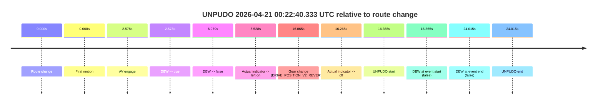
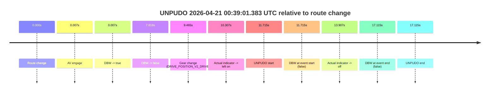
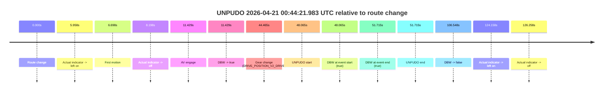
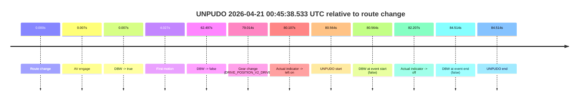
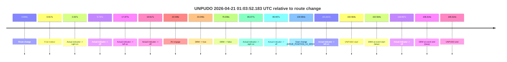
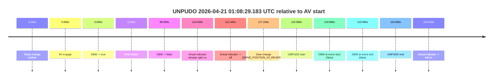

# Run Report: fme10003/2026-04-21--00-17-44--gen2-av-601b504d-11d5-4efe-942e-10a84ac2f5b0

| Field | Value |
|---|---|
| Run ID | `fme10003/2026-04-21--00-17-44--gen2-av-601b504d-11d5-4efe-942e-10a84ac2f5b0` |
| Date | `2026-04-21` |
| Model(s) | `eel-teal-outspoken` |
| Author | `zak` |
| Event count | `6` |

## unpudo 2026-04-21 00:22:40.333 UTC

| Field | Value |
|---|---|
| Model | `eel-teal-outspoken` |
| Author | `zak` |
| Run ID | `fme10003/2026-04-21--00-17-44--gen2-av-601b504d-11d5-4efe-942e-10a84ac2f5b0` |
| Date | `2026-04-21` |
| Time (UTC) | `00:22:40.333` |
| Event type | `unpudo` |
| Disengagement type | `none observed` |
| Route change | `found` |
| Console | [run](https://console.sso.wayve.ai/run/fme10003/2026-04-21--00-17-44--gen2-av-601b504d-11d5-4efe-942e-10a84ac2f5b0?id=&time-unixus=1776730960333292) |
| Foxglove | [segment](https://app.foxglove.dev/wayve-on-prem/p/prj_0dX18KZdVHg1fmmI/view?ds=foxglove-stream&ds.deviceName=fme10003&ds.start=2026-04-21T00%3A22%3A13.968242Z&ds.end=2026-04-21T00%3A22%3A57.983316Z&layoutId=lay_0e7VD4WIKDQGU73Y&time=2026-04-21T00%3A22%3A40.333292Z) |

### Event card: fail

- Fail: the credited unpudo does not stay AV-owned. The event window starts with DBW false, and the maneuver outcome lands outside a clean AV-owned segment.

| Event | Time (UTC) | Delta from route change |
|---|---:|---:|
| Route change | 2026-04-21 00:22:23.968 | `0.000s` |
| First motion | 2026-04-21 00:22:23.975 | `0.008s` |
| AV engage | 2026-04-21 00:22:26.545 | `2.578s` |
| DBW -> true | 2026-04-21 00:22:26.545 | `2.578s` |
| DBW -> false | 2026-04-21 00:22:30.947 | `6.979s` |
| Actual indicator -> left on | 2026-04-21 00:22:32.495 | `8.528s` |
| Gear change (DRIVE_POSITION_V2_REVERSE) | 2026-04-21 00:22:40.033 | `16.065s` |
| Actual indicator -> off | 2026-04-21 00:22:40.236 | `16.268s` |
| UNPUDO start | 2026-04-21 00:22:40.333 | `16.365s` |
| DBW at event start (false) | 2026-04-21 00:22:40.333 | `16.365s` |
| DBW at event end (false) | 2026-04-21 00:22:47.983 | `24.015s` |
| UNPUDO end | 2026-04-21 00:22:47.983 | `24.015s` |

| Metric | Value |
|---|---|
| Outcome | `fail` |
| Effective failure type | `completed_outside_av` |
| Route change status | `found` |
| DBW at event start | `false` |
| DBW at event end | `false` |
| Predicted gear at AV start | `DRIVE_POSITION_V2_DRIVE` |
| Actual gear at AV start | `DRIVE_POSITION_V2_DRIVE` |
| Predicted gear at event start | `DRIVE_POSITION_V2_REVERSE` |
| Actual gear at event start | `DRIVE_POSITION_V2_REVERSE` |
| Planned indicator direction | `INDICATORS_STATE_V2_LEFT_ON` |
| Controller indicator direction | `INDICATORS_STATE_V2_LEFT_ON` |
| Actual indicator direction | `INDICATORS_STATE_V2_OFF` |
| Actual indicator at maneuver end | `INDICATORS_STATE_V2_OFF` |
| Driver accel help in AV | `false` |
| Driver accel help timestamp | `n/a` |
| Max accel pedal pct in AV | `0.0%` |
| Max brake pedal pct in AV | `0.0%` |
| Max speed mps in AV | `6.544` |
| Success timing baseline | `route change` |
| Route -> AV | `2.578s` |
| AV -> event start | `13.787s` |
| AV -> first motion | `-2.570s` |
| Success baseline -> event start | `16.365s` |
| Success baseline -> first motion | `0.008s` |
| AV duration before disengagement | `4.401s` |
| Trajectory waypoint count | `35` |
| Driving-plan step count | `11` |

The scored portion starts from the AV-owned window, not from the pre-AV setup. Route-change search in the stopped pre-event segment was `found`, with the baseline therefore set to route change. At the event anchor the model predicts `DRIVE_POSITION_V2_REVERSE` and the actual gear is `DRIVE_POSITION_V2_REVERSE`. The effective model outcome is `fail` because `completed_outside_av.`

### Resolution

| Field | Value |
|---|---|
| Final outcome | `fail` |
| Do we agree with this label? | `yes` |
| Source disengagement type | `none observed` |
| Resolved effective failure type | `completed_outside_av` |
| Confidence | `high` |

## unpudo 2026-04-21 00:39:01.383 UTC

| Field | Value |
|---|---|
| Model | `eel-teal-outspoken` |
| Author | `zak` |
| Run ID | `fme10003/2026-04-21--00-17-44--gen2-av-601b504d-11d5-4efe-942e-10a84ac2f5b0` |
| Date | `2026-04-21` |
| Time (UTC) | `00:39:01.383` |
| Event type | `unpudo` |
| Disengagement type | `failed_to_unpudo` |
| Route change | `found` |
| Console | [run](https://console.sso.wayve.ai/run/fme10003/2026-04-21--00-17-44--gen2-av-601b504d-11d5-4efe-942e-10a84ac2f5b0?id=&time-unixus=1776731941383308) |
| Foxglove | [segment](https://app.foxglove.dev/wayve-on-prem/p/prj_0dX18KZdVHg1fmmI/view?ds=foxglove-stream&ds.deviceName=fme10003&ds.start=2026-04-21T00%3A38%3A39.668568Z&ds.end=2026-04-21T00%3A39%3A16.783301Z&layoutId=lay_0e7VD4WIKDQGU73Y&time=2026-04-21T00%3A39%3A01.383308Z) |

### Event card: fail

- Fail: AV owns part of the segment, but the event still resolves as a model-performance failure under the AV-only scoring rule.

| Event | Time (UTC) | Delta from route change |
|---|---:|---:|
| Route change | 2026-04-21 00:38:49.668 | `0.000s` |
| AV engage | 2026-04-21 00:38:49.676 | `0.007s` |
| DBW -> true | 2026-04-21 00:38:49.676 | `0.007s` |
| DBW -> false | 2026-04-21 00:38:57.486 | `7.818s` |
| Gear change (DRIVE_POSITION_V2_DRIVE) | 2026-04-21 00:38:59.133 | `9.465s` |
| Actual indicator -> left on | 2026-04-21 00:38:59.975 | `10.307s` |
| UNPUDO start | 2026-04-21 00:39:01.383 | `11.715s` |
| DBW at event start (false) | 2026-04-21 00:39:01.383 | `11.715s` |
| Actual indicator -> off | 2026-04-21 00:39:03.575 | `13.907s` |
| DBW at event end (false) | 2026-04-21 00:39:06.783 | `17.115s` |
| UNPUDO end | 2026-04-21 00:39:06.783 | `17.115s` |

| Metric | Value |
|---|---|
| Outcome | `fail` |
| Effective failure type | `failed_to_unpudo` |
| Route change status | `found` |
| DBW at event start | `false` |
| DBW at event end | `false` |
| Predicted gear at AV start | `DRIVE_POSITION_V2_PARK` |
| Actual gear at AV start | `DRIVE_POSITION_V2_PARK` |
| Predicted gear at event start | `DRIVE_POSITION_V2_DRIVE` |
| Actual gear at event start | `DRIVE_POSITION_V2_DRIVE` |
| Planned indicator direction | `INDICATORS_STATE_V2_LEFT_ON` |
| Controller indicator direction | `INDICATORS_STATE_V2_LEFT_ON` |
| Actual indicator direction | `INDICATORS_STATE_V2_LEFT_ON` |
| Actual indicator at maneuver end | `INDICATORS_STATE_V2_OFF` |
| Driver accel help in AV | `false` |
| Driver accel help timestamp | `n/a` |
| Max accel pedal pct in AV | `0.0%` |
| Max brake pedal pct in AV | `28.9%` |
| Max speed mps in AV | `0.000` |
| Success timing baseline | `route change` |
| Route -> AV | `0.007s` |
| AV -> event start | `11.707s` |
| AV -> first motion | `n/a` |
| Success baseline -> event start | `11.715s` |
| Success baseline -> first motion | `n/a` |
| AV duration before disengagement | `7.810s` |
| Trajectory waypoint count | `36` |
| Driving-plan step count | `11` |

The scored portion starts from the AV-owned window, not from the pre-AV setup. Route-change search in the stopped pre-event segment was `found`, with the baseline therefore set to route change. At the event anchor the model predicts `DRIVE_POSITION_V2_DRIVE` and the actual gear is `DRIVE_POSITION_V2_DRIVE`. The effective model outcome is `fail` because `failed_to_unpudo.`

### Resolution

| Field | Value |
|---|---|
| Final outcome | `fail` |
| Do we agree with this label? | `yes` |
| Source disengagement type | `failed_to_unpudo` |
| Resolved effective failure type | `failed_to_unpudo` |
| Confidence | `high` |

## unpudo 2026-04-21 00:44:21.983 UTC

| Field | Value |
|---|---|
| Model | `eel-teal-outspoken` |
| Author | `zak` |
| Run ID | `fme10003/2026-04-21--00-17-44--gen2-av-601b504d-11d5-4efe-942e-10a84ac2f5b0` |
| Date | `2026-04-21` |
| Time (UTC) | `00:44:21.983` |
| Event type | `unpudo` |
| Disengagement type | `none observed` |
| Route change | `found` |
| Console | [run](https://console.sso.wayve.ai/run/fme10003/2026-04-21--00-17-44--gen2-av-601b504d-11d5-4efe-942e-10a84ac2f5b0?id=&time-unixus=1776732261983313) |
| Foxglove | [segment](https://app.foxglove.dev/wayve-on-prem/p/prj_0dX18KZdVHg1fmmI/view?ds=foxglove-stream&ds.deviceName=fme10003&ds.start=2026-04-21T00%3A43%3A23.918231Z&ds.end=2026-04-21T00%3A45%3A30.465838Z&layoutId=lay_0e7VD4WIKDQGU73Y&time=2026-04-21T00%3A44%3A21.983313Z) |

### Event card: pass

- Pass: AV owns the credited unpudo from route change through the official unpudo window, the gear state is aligned at the anchor, and the vehicle moves without driver accelerator help in AV.

| Event | Time (UTC) | Delta from route change |
|---|---:|---:|
| Route change | 2026-04-21 00:43:33.918 | `0.000s` |
| Actual indicator -> left on | 2026-04-21 00:43:39.875 | `5.958s` |
| First motion | 2026-04-21 00:43:40.615 | `6.698s` |
| Actual indicator -> off | 2026-04-21 00:43:42.116 | `8.198s` |
| AV engage | 2026-04-21 00:43:45.347 | `11.429s` |
| DBW -> true | 2026-04-21 00:43:45.347 | `11.429s` |
| Gear change (DRIVE_POSITION_V2_DRIVE) | 2026-04-21 00:44:18.383 | `44.465s` |
| UNPUDO start | 2026-04-21 00:44:21.983 | `48.065s` |
| DBW at event start (true) | 2026-04-21 00:44:21.983 | `48.065s` |
| DBW at event end (true) | 2026-04-21 00:44:25.633 | `51.715s` |
| UNPUDO end | 2026-04-21 00:44:25.633 | `51.715s` |
| DBW -> false | 2026-04-21 00:45:20.465 | `106.548s` |
| Actual indicator -> left on | 2026-04-21 00:45:38.076 | `124.158s` |
| Actual indicator -> off | 2026-04-21 00:45:40.176 | `126.258s` |

| Metric | Value |
|---|---|
| Outcome | `pass` |
| Effective failure type | `none` |
| Route change status | `found` |
| DBW at event start | `true` |
| DBW at event end | `true` |
| Predicted gear at AV start | `DRIVE_POSITION_V2_DRIVE` |
| Actual gear at AV start | `DRIVE_POSITION_V2_DRIVE` |
| Predicted gear at event start | `DRIVE_POSITION_V2_DRIVE` |
| Actual gear at event start | `DRIVE_POSITION_V2_DRIVE` |
| Planned indicator direction | `INDICATORS_STATE_V2_LEFT_ON` |
| Controller indicator direction | `INDICATORS_STATE_V2_LEFT_ON` |
| Actual indicator direction | `INDICATORS_STATE_V2_OFF` |
| Actual indicator at maneuver end | `INDICATORS_STATE_V2_OFF` |
| Driver accel help in AV | `false` |
| Driver accel help timestamp | `n/a` |
| Max accel pedal pct in AV | `0.0%` |
| Max brake pedal pct in AV | `11.9%` |
| Max speed mps in AV | `9.161` |
| Success timing baseline | `route change` |
| Route -> AV | `11.429s` |
| AV -> event start | `36.636s` |
| AV -> first motion | `-4.731s` |
| Success baseline -> event start | `48.065s` |
| Success baseline -> first motion | `6.698s` |
| AV duration before disengagement | `95.119s` |
| Trajectory waypoint count | `36` |
| Driving-plan step count | `11` |

The scored portion starts from the AV-owned window, not from the pre-AV setup. Route-change search in the stopped pre-event segment was `found`, with the baseline therefore set to route change. At the event anchor the model predicts `DRIVE_POSITION_V2_DRIVE` and the actual gear is `DRIVE_POSITION_V2_DRIVE`. The effective model outcome is `pass` because `the credited unpudo stays AV-owned through the official unpudo window.`

### Resolution

| Field | Value |
|---|---|
| Final outcome | `pass` |
| Do we agree with this label? | `yes` |
| Source disengagement type | `none observed` |
| Resolved effective failure type | `none` |
| Confidence | `high` |

## unpudo 2026-04-21 00:45:38.533 UTC

| Field | Value |
|---|---|
| Model | `eel-teal-outspoken` |
| Author | `zak` |
| Run ID | `fme10003/2026-04-21--00-17-44--gen2-av-601b504d-11d5-4efe-942e-10a84ac2f5b0` |
| Date | `2026-04-21` |
| Time (UTC) | `00:45:38.533` |
| Event type | `unpudo` |
| Disengagement type | `none observed` |
| Route change | `found` |
| Console | [run](https://console.sso.wayve.ai/run/fme10003/2026-04-21--00-17-44--gen2-av-601b504d-11d5-4efe-942e-10a84ac2f5b0?id=&time-unixus=1776732338533302) |
| Foxglove | [segment](https://app.foxglove.dev/wayve-on-prem/p/prj_0dX18KZdVHg1fmmI/view?ds=foxglove-stream&ds.deviceName=fme10003&ds.start=2026-04-21T00%3A44%3A07.969149Z&ds.end=2026-04-21T00%3A45%3A52.483310Z&layoutId=lay_0e7VD4WIKDQGU73Y&time=2026-04-21T00%3A45%3A38.533302Z) |

### Event card: fail

- Fail: the credited unpudo does not stay AV-owned. The event window starts with DBW false, and the maneuver outcome lands outside a clean AV-owned segment.

| Event | Time (UTC) | Delta from route change |
|---|---:|---:|
| Route change | 2026-04-21 00:44:17.969 | `0.000s` |
| AV engage | 2026-04-21 00:44:17.976 | `0.007s` |
| DBW -> true | 2026-04-21 00:44:17.976 | `0.007s` |
| First motion | 2026-04-21 00:44:21.995 | `4.027s` |
| DBW -> false | 2026-04-21 00:45:20.465 | `62.497s` |
| Gear change (DRIVE_POSITION_V2_DRIVE) | 2026-04-21 00:45:36.983 | `79.014s` |
| Actual indicator -> left on | 2026-04-21 00:45:38.076 | `80.107s` |
| UNPUDO start | 2026-04-21 00:45:38.533 | `80.564s` |
| DBW at event start (false) | 2026-04-21 00:45:38.533 | `80.564s` |
| Actual indicator -> off | 2026-04-21 00:45:40.176 | `82.207s` |
| DBW at event end (false) | 2026-04-21 00:45:42.483 | `84.514s` |
| UNPUDO end | 2026-04-21 00:45:42.483 | `84.514s` |

| Metric | Value |
|---|---|
| Outcome | `fail` |
| Effective failure type | `not_av_owned` |
| Route change status | `found` |
| DBW at event start | `false` |
| DBW at event end | `false` |
| Predicted gear at AV start | `DRIVE_POSITION_V2_PARK` |
| Actual gear at AV start | `DRIVE_POSITION_V2_PARK` |
| Predicted gear at event start | `DRIVE_POSITION_V2_DRIVE` |
| Actual gear at event start | `DRIVE_POSITION_V2_DRIVE` |
| Planned indicator direction | `INDICATORS_STATE_V2_OFF` |
| Controller indicator direction | `INDICATORS_STATE_V2_OFF` |
| Actual indicator direction | `INDICATORS_STATE_V2_LEFT_ON` |
| Actual indicator at maneuver end | `INDICATORS_STATE_V2_OFF` |
| Driver accel help in AV | `false` |
| Driver accel help timestamp | `n/a` |
| Max accel pedal pct in AV | `0.0%` |
| Max brake pedal pct in AV | `18.2%` |
| Max speed mps in AV | `11.897` |
| Success timing baseline | `route change` |
| Route -> AV | `0.007s` |
| AV -> event start | `80.557s` |
| AV -> first motion | `4.020s` |
| Success baseline -> event start | `80.564s` |
| Success baseline -> first motion | `4.027s` |
| AV duration before disengagement | `62.490s` |
| Trajectory waypoint count | `37` |
| Driving-plan step count | `11` |

The scored portion starts from the AV-owned window, not from the pre-AV setup. Route-change search in the stopped pre-event segment was `found`, with the baseline therefore set to route change. At the event anchor the model predicts `DRIVE_POSITION_V2_DRIVE` and the actual gear is `DRIVE_POSITION_V2_DRIVE`. The effective model outcome is `fail` because `not_av_owned.`

### Resolution

| Field | Value |
|---|---|
| Final outcome | `fail` |
| Do we agree with this label? | `yes` |
| Source disengagement type | `none observed` |
| Resolved effective failure type | `not_av_owned` |
| Confidence | `high` |

## unpudo 2026-04-21 01:03:52.183 UTC

| Field | Value |
|---|---|
| Model | `eel-teal-outspoken` |
| Author | `zak` |
| Run ID | `fme10003/2026-04-21--00-17-44--gen2-av-601b504d-11d5-4efe-942e-10a84ac2f5b0` |
| Date | `2026-04-21` |
| Time (UTC) | `01:03:52.183` |
| Event type | `unpudo` |
| Disengagement type | `none observed` |
| Route change | `found` |
| Console | [run](https://console.sso.wayve.ai/run/fme10003/2026-04-21--00-17-44--gen2-av-601b504d-11d5-4efe-942e-10a84ac2f5b0?id=&time-unixus=1776733432183296) |
| Foxglove | [segment](https://app.foxglove.dev/wayve-on-prem/p/prj_0dX18KZdVHg1fmmI/view?ds=foxglove-stream&ds.deviceName=fme10003&ds.start=2026-04-21T01%3A01%3A59.618877Z&ds.end=2026-04-21T01%3A04%3A05.933303Z&layoutId=lay_0e7VD4WIKDQGU73Y&time=2026-04-21T01%3A03%3A52.183296Z) |

### Event card: fail

- Fail: the credited unpudo does not stay AV-owned. The event window starts with DBW false, and the maneuver outcome lands outside a clean AV-owned segment.

| Event | Time (UTC) | Delta from route change |
|---|---:|---:|
| Route change | 2026-04-21 01:02:09.618 | `0.000s` |
| First motion | 2026-04-21 01:02:09.636 | `0.017s` |
| Actual indicator -> right on | 2026-04-21 01:02:11.955 | `2.337s` |
| Actual indicator -> off | 2026-04-21 01:02:15.356 | `5.737s` |
| Actual indicator -> left on | 2026-04-21 01:02:26.996 | `17.377s` |
| Actual indicator -> off | 2026-04-21 01:02:29.235 | `19.617s` |
| AV engage | 2026-04-21 01:02:32.667 | `23.048s` |
| DBW -> true | 2026-04-21 01:02:32.667 | `23.048s` |
| DBW -> false | 2026-04-21 01:03:28.827 | `79.208s` |
| Actual indicator -> right on | 2026-04-21 01:03:34.996 | `85.377s` |
| Actual indicator -> off | 2026-04-21 01:03:39.116 | `89.497s` |
| Gear change (DRIVE_POSITION_V2_DRIVE) | 2026-04-21 01:03:50.583 | `100.964s` |
| Actual indicator -> left on | 2026-04-21 01:03:51.435 | `101.817s` |
| UNPUDO start | 2026-04-21 01:03:52.183 | `102.564s` |
| DBW at event start (false) | 2026-04-21 01:03:52.183 | `102.564s` |
| Actual indicator -> off | 2026-04-21 01:03:53.615 | `103.997s` |
| DBW at event end (false) | 2026-04-21 01:03:55.933 | `106.314s` |
| UNPUDO end | 2026-04-21 01:03:55.933 | `106.314s` |

| Metric | Value |
|---|---|
| Outcome | `fail` |
| Effective failure type | `completed_outside_av` |
| Route change status | `found` |
| DBW at event start | `false` |
| DBW at event end | `false` |
| Predicted gear at AV start | `DRIVE_POSITION_V2_DRIVE` |
| Actual gear at AV start | `DRIVE_POSITION_V2_DRIVE` |
| Predicted gear at event start | `DRIVE_POSITION_V2_DRIVE` |
| Actual gear at event start | `DRIVE_POSITION_V2_DRIVE` |
| Planned indicator direction | `INDICATORS_STATE_V2_LEFT_ON` |
| Controller indicator direction | `INDICATORS_STATE_V2_LEFT_ON` |
| Actual indicator direction | `INDICATORS_STATE_V2_LEFT_ON` |
| Actual indicator at maneuver end | `INDICATORS_STATE_V2_OFF` |
| Driver accel help in AV | `false` |
| Driver accel help timestamp | `n/a` |
| Max accel pedal pct in AV | `0.0%` |
| Max brake pedal pct in AV | `8.0%` |
| Max speed mps in AV | `7.050` |
| Success timing baseline | `route change` |
| Route -> AV | `23.048s` |
| AV -> event start | `79.516s` |
| AV -> first motion | `-23.031s` |
| Success baseline -> event start | `102.564s` |
| Success baseline -> first motion | `0.017s` |
| AV duration before disengagement | `56.160s` |
| Trajectory waypoint count | `36` |
| Driving-plan step count | `11` |

The scored portion starts from the AV-owned window, not from the pre-AV setup. Route-change search in the stopped pre-event segment was `found`, with the baseline therefore set to route change. At the event anchor the model predicts `DRIVE_POSITION_V2_DRIVE` and the actual gear is `DRIVE_POSITION_V2_DRIVE`. The effective model outcome is `fail` because `completed_outside_av.`

### Resolution

| Field | Value |
|---|---|
| Final outcome | `fail` |
| Do we agree with this label? | `yes` |
| Source disengagement type | `none observed` |
| Resolved effective failure type | `completed_outside_av` |
| Confidence | `high` |

## unpudo 2026-04-21 01:08:29.183 UTC

| Field | Value |
|---|---|
| Model | `eel-teal-outspoken` |
| Author | `zak` |
| Run ID | `fme10003/2026-04-21--00-17-44--gen2-av-601b504d-11d5-4efe-942e-10a84ac2f5b0` |
| Date | `2026-04-21` |
| Time (UTC) | `01:08:29.183` |
| Event type | `unpudo` |
| Disengagement type | `none observed` |
| Route change | `unclear` |
| Console | [run](https://console.sso.wayve.ai/run/fme10003/2026-04-21--00-17-44--gen2-av-601b504d-11d5-4efe-942e-10a84ac2f5b0?id=&time-unixus=1776733709183302) |
| Foxglove | [segment](https://app.foxglove.dev/wayve-on-prem/p/prj_0dX18KZdVHg1fmmI/view?ds=foxglove-stream&ds.deviceName=fme10003&ds.start=2026-04-21T01%3A06%3A19.187075Z&ds.end=2026-04-21T01%3A08%3A39.183302Z&layoutId=lay_0e7VD4WIKDQGU73Y&time=2026-04-21T01%3A08%3A29.183302Z) |

### Event card: fail

- Fail: the credited unpudo does not stay AV-owned. The event window starts with DBW false, and the maneuver outcome lands outside a clean AV-owned segment.

| Event | Time (UTC) | Delta from AV start |
|---|---:|---:|
| Route change unclear | 2026-04-21 01:06:29.187 | `0.000s` |
| AV engage | 2026-04-21 01:06:29.187 | `0.000s` |
| DBW -> true | 2026-04-21 01:06:29.187 | `0.000s` |
| First motion | 2026-04-21 01:06:29.196 | `0.009s` |
| DBW -> false | 2026-04-21 01:08:09.145 | `99.959s` |
| Actual indicator already right on | 2026-04-21 01:08:19.195 | `110.009s` |
| Actual indicator -> off | 2026-04-21 01:08:21.636 | `112.449s` |
| Gear change (DRIVE_POSITION_V2_REVERSE) | 2026-04-21 01:08:26.433 | `117.246s` |
| UNPUDO start | 2026-04-21 01:08:29.183 | `119.996s` |
| DBW at event start (false) | 2026-04-21 01:08:29.183 | `119.996s` |
| DBW at event end (false) | 2026-04-21 01:08:29.183 | `119.996s` |
| UNPUDO end | 2026-04-21 01:08:29.183 | `119.996s` |
| Actual indicator -> left on | 2026-04-21 01:08:49.136 | `139.949s` |

| Metric | Value |
|---|---|
| Outcome | `fail` |
| Effective failure type | `not_av_owned` |
| Route change status | `unclear` |
| DBW at event start | `false` |
| DBW at event end | `false` |
| Predicted gear at AV start | `DRIVE_POSITION_V2_DRIVE` |
| Actual gear at AV start | `DRIVE_POSITION_V2_DRIVE` |
| Predicted gear at event start | `DRIVE_POSITION_V2_REVERSE` |
| Actual gear at event start | `DRIVE_POSITION_V2_REVERSE` |
| Planned indicator direction | `INDICATORS_STATE_V2_OFF` |
| Controller indicator direction | `INDICATORS_STATE_V2_OFF` |
| Actual indicator direction | `INDICATORS_STATE_V2_OFF` |
| Actual indicator at maneuver end | `INDICATORS_STATE_V2_OFF` |
| Driver accel help in AV | `false` |
| Driver accel help timestamp | `n/a` |
| Max accel pedal pct in AV | `0.0%` |
| Max brake pedal pct in AV | `8.0%` |
| Max speed mps in AV | `6.183` |
| Success timing baseline | `AV start` |
| Route -> AV | `n/a` |
| AV -> event start | `119.996s` |
| AV -> first motion | `0.009s` |
| Success baseline -> event start | `119.996s` |
| Success baseline -> first motion | `0.009s` |
| AV duration before disengagement | `99.959s` |
| Trajectory waypoint count | `36` |
| Driving-plan step count | `11` |

The scored portion starts from the AV-owned window, not from the pre-AV setup. Route-change search in the stopped pre-event segment was `unclear`, with the baseline therefore set to AV start. At the event anchor the model predicts `DRIVE_POSITION_V2_REVERSE` and the actual gear is `DRIVE_POSITION_V2_REVERSE`. The effective model outcome is `fail` because `not_av_owned.`

### Resolution

| Field | Value |
|---|---|
| Final outcome | `fail` |
| Do we agree with this label? | `yes` |
| Source disengagement type | `none observed` |
| Resolved effective failure type | `not_av_owned` |
| Confidence | `medium` |
