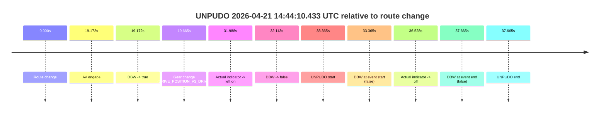
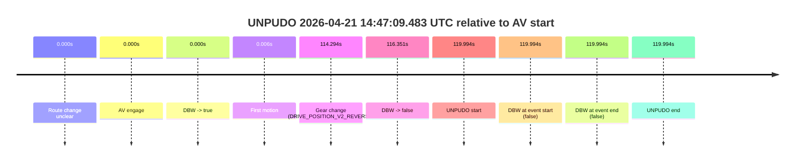
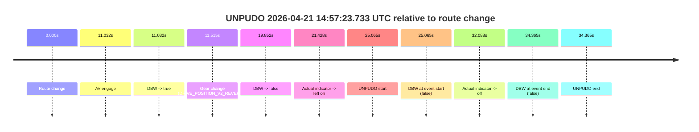

# Run Report: fme10003/2026-04-21--13-40-48--gen2-av-c0c918ed-060b-4500-95d6-3b5f9b49a61e

| Field | Value |
|---|---|
| Run ID | `fme10003/2026-04-21--13-40-48--gen2-av-c0c918ed-060b-4500-95d6-3b5f9b49a61e` |
| Date | `2026-04-21` |
| Model(s) | `pink-manta-ray-smooth` |
| Author | `guy.geva` |
| Event count | `3` |

## unpudo 2026-04-21 14:44:10.433 UTC

| Field | Value |
|---|---|
| Model | `pink-manta-ray-smooth` |
| Author | `guy.geva` |
| Run ID | `fme10003/2026-04-21--13-40-48--gen2-av-c0c918ed-060b-4500-95d6-3b5f9b49a61e` |
| Date | `2026-04-21` |
| Time (UTC) | `14:44:10.433` |
| Event type | `unpudo` |
| Disengagement type | `none observed` |
| Route change | `found` |
| Console | [run](https://console.sso.wayve.ai/run/fme10003/2026-04-21--13-40-48--gen2-av-c0c918ed-060b-4500-95d6-3b5f9b49a61e?id=&time-unixus=1776782650433307) |
| Foxglove | [segment](https://app.foxglove.dev/wayve-on-prem/p/prj_0dX18KZdVHg1fmmI/view?ds=foxglove-stream&ds.deviceName=fme10003&ds.start=2026-04-21T14%3A43%3A27.068324Z&ds.end=2026-04-21T14%3A44%3A24.733308Z&layoutId=lay_0e7VD4WIKDQGU73Y&time=2026-04-21T14%3A44%3A10.433307Z) |

### Event card: fail

- Fail: the credited unpudo does not stay AV-owned. The event window starts with DBW false, and the maneuver outcome lands outside a clean AV-owned segment.

| Event | Time (UTC) | Delta from route change |
|---|---:|---:|
| Route change | 2026-04-21 14:43:37.068 | `0.000s` |
| AV engage | 2026-04-21 14:43:56.240 | `19.172s` |
| DBW -> true | 2026-04-21 14:43:56.240 | `19.172s` |
| Gear change (DRIVE_POSITION_V2_DRIVE) | 2026-04-21 14:43:56.733 | `19.665s` |
| Actual indicator -> left on | 2026-04-21 14:44:09.056 | `31.988s` |
| DBW -> false | 2026-04-21 14:44:09.181 | `32.113s` |
| UNPUDO start | 2026-04-21 14:44:10.433 | `33.365s` |
| DBW at event start (false) | 2026-04-21 14:44:10.433 | `33.365s` |
| Actual indicator -> off | 2026-04-21 14:44:13.596 | `36.528s` |
| DBW at event end (false) | 2026-04-21 14:44:14.733 | `37.665s` |
| UNPUDO end | 2026-04-21 14:44:14.733 | `37.665s` |

| Metric | Value |
|---|---|
| Outcome | `fail` |
| Effective failure type | `not_av_owned` |
| Route change status | `found` |
| DBW at event start | `false` |
| DBW at event end | `false` |
| Predicted gear at AV start | `DRIVE_POSITION_V2_DRIVE` |
| Actual gear at AV start | `DRIVE_POSITION_V2_PARK` |
| Predicted gear at event start | `DRIVE_POSITION_V2_DRIVE` |
| Actual gear at event start | `DRIVE_POSITION_V2_DRIVE` |
| Planned indicator direction | `INDICATORS_STATE_V2_LEFT_ON` |
| Controller indicator direction | `INDICATORS_STATE_V2_LEFT_ON` |
| Actual indicator direction | `INDICATORS_STATE_V2_LEFT_ON` |
| Actual indicator at maneuver end | `INDICATORS_STATE_V2_OFF` |
| Driver accel help in AV | `false` |
| Driver accel help timestamp | `n/a` |
| Max accel pedal pct in AV | `0.0%` |
| Max brake pedal pct in AV | `8.0%` |
| Max speed mps in AV | `0.000` |
| Success timing baseline | `route change` |
| Route -> AV | `19.172s` |
| AV -> event start | `14.193s` |
| AV -> first motion | `n/a` |
| Success baseline -> event start | `33.365s` |
| Success baseline -> first motion | `n/a` |
| AV duration before disengagement | `12.941s` |
| Trajectory waypoint count | `36` |
| Driving-plan step count | `11` |

The scored portion starts from the AV-owned window, not from the pre-AV setup. Route-change search in the stopped pre-event segment was `found`, with the baseline therefore set to route change. At the event anchor the model predicts `DRIVE_POSITION_V2_DRIVE` and the actual gear is `DRIVE_POSITION_V2_DRIVE`. The effective model outcome is `fail` because `not_av_owned.`

### Resolution

| Field | Value |
|---|---|
| Final outcome | `fail` |
| Do we agree with this label? | `yes` |
| Source disengagement type | `none observed` |
| Resolved effective failure type | `not_av_owned` |
| Confidence | `high` |

## unpudo 2026-04-21 14:47:09.483 UTC

| Field | Value |
|---|---|
| Model | `pink-manta-ray-smooth` |
| Author | `guy.geva` |
| Run ID | `fme10003/2026-04-21--13-40-48--gen2-av-c0c918ed-060b-4500-95d6-3b5f9b49a61e` |
| Date | `2026-04-21` |
| Time (UTC) | `14:47:09.483` |
| Event type | `unpudo` |
| Disengagement type | `none observed` |
| Route change | `unclear` |
| Console | [run](https://console.sso.wayve.ai/run/fme10003/2026-04-21--13-40-48--gen2-av-c0c918ed-060b-4500-95d6-3b5f9b49a61e?id=&time-unixus=1776782829483309) |
| Foxglove | [segment](https://app.foxglove.dev/wayve-on-prem/p/prj_0dX18KZdVHg1fmmI/view?ds=foxglove-stream&ds.deviceName=fme10003&ds.start=2026-04-21T14%3A44%3A59.489709Z&ds.end=2026-04-21T14%3A47%3A19.483309Z&layoutId=lay_0e7VD4WIKDQGU73Y&time=2026-04-21T14%3A47%3A09.483309Z) |

### Event card: fail

- Fail: the credited unpudo does not stay AV-owned. The event window starts with DBW false, and the maneuver outcome lands outside a clean AV-owned segment.

| Event | Time (UTC) | Delta from AV start |
|---|---:|---:|
| Route change unclear | 2026-04-21 14:45:09.489 | `0.000s` |
| AV engage | 2026-04-21 14:45:09.489 | `0.000s` |
| DBW -> true | 2026-04-21 14:45:09.489 | `0.000s` |
| First motion | 2026-04-21 14:45:09.495 | `0.006s` |
| Gear change (DRIVE_POSITION_V2_REVERSE) | 2026-04-21 14:47:03.783 | `114.294s` |
| DBW -> false | 2026-04-21 14:47:05.840 | `116.351s` |
| UNPUDO start | 2026-04-21 14:47:09.483 | `119.994s` |
| DBW at event start (false) | 2026-04-21 14:47:09.483 | `119.994s` |
| DBW at event end (false) | 2026-04-21 14:47:09.483 | `119.994s` |
| UNPUDO end | 2026-04-21 14:47:09.483 | `119.994s` |

| Metric | Value |
|---|---|
| Outcome | `fail` |
| Effective failure type | `not_av_owned` |
| Route change status | `unclear` |
| DBW at event start | `false` |
| DBW at event end | `false` |
| Predicted gear at AV start | `DRIVE_POSITION_V2_DRIVE` |
| Actual gear at AV start | `DRIVE_POSITION_V2_DRIVE` |
| Predicted gear at event start | `DRIVE_POSITION_V2_REVERSE` |
| Actual gear at event start | `DRIVE_POSITION_V2_REVERSE` |
| Planned indicator direction | `INDICATORS_STATE_V2_OFF` |
| Controller indicator direction | `INDICATORS_STATE_V2_OFF` |
| Actual indicator direction | `INDICATORS_STATE_V2_OFF` |
| Actual indicator at maneuver end | `INDICATORS_STATE_V2_OFF` |
| Driver accel help in AV | `false` |
| Driver accel help timestamp | `n/a` |
| Max accel pedal pct in AV | `0.0%` |
| Max brake pedal pct in AV | `10.6%` |
| Max speed mps in AV | `10.094` |
| Success timing baseline | `AV start` |
| Route -> AV | `n/a` |
| AV -> event start | `119.994s` |
| AV -> first motion | `0.006s` |
| Success baseline -> event start | `119.994s` |
| Success baseline -> first motion | `0.006s` |
| AV duration before disengagement | `116.351s` |
| Trajectory waypoint count | `37` |
| Driving-plan step count | `11` |

The scored portion starts from the AV-owned window, not from the pre-AV setup. Route-change search in the stopped pre-event segment was `unclear`, with the baseline therefore set to AV start. At the event anchor the model predicts `DRIVE_POSITION_V2_REVERSE` and the actual gear is `DRIVE_POSITION_V2_REVERSE`. The effective model outcome is `fail` because `not_av_owned.`

### Resolution

| Field | Value |
|---|---|
| Final outcome | `fail` |
| Do we agree with this label? | `yes` |
| Source disengagement type | `none observed` |
| Resolved effective failure type | `not_av_owned` |
| Confidence | `medium` |

## unpudo 2026-04-21 14:57:23.733 UTC

| Field | Value |
|---|---|
| Model | `pink-manta-ray-smooth` |
| Author | `guy.geva` |
| Run ID | `fme10003/2026-04-21--13-40-48--gen2-av-c0c918ed-060b-4500-95d6-3b5f9b49a61e` |
| Date | `2026-04-21` |
| Time (UTC) | `14:57:23.733` |
| Event type | `unpudo` |
| Disengagement type | `none observed` |
| Route change | `found` |
| Console | [run](https://console.sso.wayve.ai/run/fme10003/2026-04-21--13-40-48--gen2-av-c0c918ed-060b-4500-95d6-3b5f9b49a61e?id=&time-unixus=1776783443733295) |
| Foxglove | [segment](https://app.foxglove.dev/wayve-on-prem/p/prj_0dX18KZdVHg1fmmI/view?ds=foxglove-stream&ds.deviceName=fme10003&ds.start=2026-04-21T14%3A56%3A48.668253Z&ds.end=2026-04-21T14%3A57%3A43.033299Z&layoutId=lay_0e7VD4WIKDQGU73Y&time=2026-04-21T14%3A57%3A23.733295Z) |

### Event card: fail

- Fail: the credited unpudo does not stay AV-owned. The event window starts with DBW false, and the maneuver outcome lands outside a clean AV-owned segment.

| Event | Time (UTC) | Delta from route change |
|---|---:|---:|
| Route change | 2026-04-21 14:56:58.668 | `0.000s` |
| AV engage | 2026-04-21 14:57:09.700 | `11.032s` |
| DBW -> true | 2026-04-21 14:57:09.700 | `11.032s` |
| Gear change (DRIVE_POSITION_V2_REVERSE) | 2026-04-21 14:57:10.183 | `11.515s` |
| DBW -> false | 2026-04-21 14:57:18.520 | `19.852s` |
| Actual indicator -> left on | 2026-04-21 14:57:20.095 | `21.428s` |
| UNPUDO start | 2026-04-21 14:57:23.733 | `25.065s` |
| DBW at event start (false) | 2026-04-21 14:57:23.733 | `25.065s` |
| Actual indicator -> off | 2026-04-21 14:57:30.756 | `32.088s` |
| DBW at event end (false) | 2026-04-21 14:57:33.033 | `34.365s` |
| UNPUDO end | 2026-04-21 14:57:33.033 | `34.365s` |

| Metric | Value |
|---|---|
| Outcome | `fail` |
| Effective failure type | `not_av_owned` |
| Route change status | `found` |
| DBW at event start | `false` |
| DBW at event end | `false` |
| Predicted gear at AV start | `DRIVE_POSITION_V2_REVERSE` |
| Actual gear at AV start | `DRIVE_POSITION_V2_PARK` |
| Predicted gear at event start | `DRIVE_POSITION_V2_REVERSE` |
| Actual gear at event start | `DRIVE_POSITION_V2_REVERSE` |
| Planned indicator direction | `INDICATORS_STATE_V2_LEFT_ON` |
| Controller indicator direction | `INDICATORS_STATE_V2_LEFT_ON` |
| Actual indicator direction | `INDICATORS_STATE_V2_LEFT_ON` |
| Actual indicator at maneuver end | `INDICATORS_STATE_V2_OFF` |
| Driver accel help in AV | `false` |
| Driver accel help timestamp | `n/a` |
| Max accel pedal pct in AV | `0.0%` |
| Max brake pedal pct in AV | `11.6%` |
| Max speed mps in AV | `0.000` |
| Success timing baseline | `route change` |
| Route -> AV | `11.032s` |
| AV -> event start | `14.033s` |
| AV -> first motion | `n/a` |
| Success baseline -> event start | `25.065s` |
| Success baseline -> first motion | `n/a` |
| AV duration before disengagement | `8.820s` |
| Trajectory waypoint count | `36` |
| Driving-plan step count | `11` |

The scored portion starts from the AV-owned window, not from the pre-AV setup. Route-change search in the stopped pre-event segment was `found`, with the baseline therefore set to route change. At the event anchor the model predicts `DRIVE_POSITION_V2_REVERSE` and the actual gear is `DRIVE_POSITION_V2_REVERSE`. The effective model outcome is `fail` because `not_av_owned.`

### Resolution

| Field | Value |
|---|---|
| Final outcome | `fail` |
| Do we agree with this label? | `yes` |
| Source disengagement type | `none observed` |
| Resolved effective failure type | `not_av_owned` |
| Confidence | `high` |
