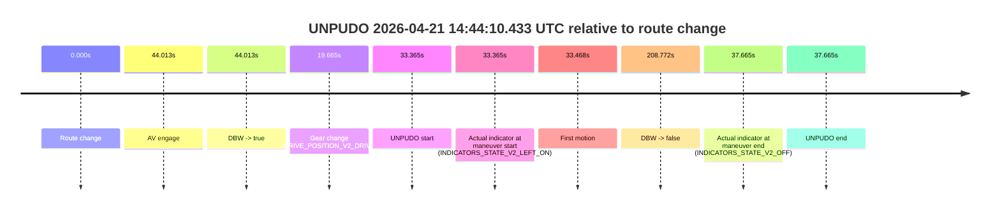
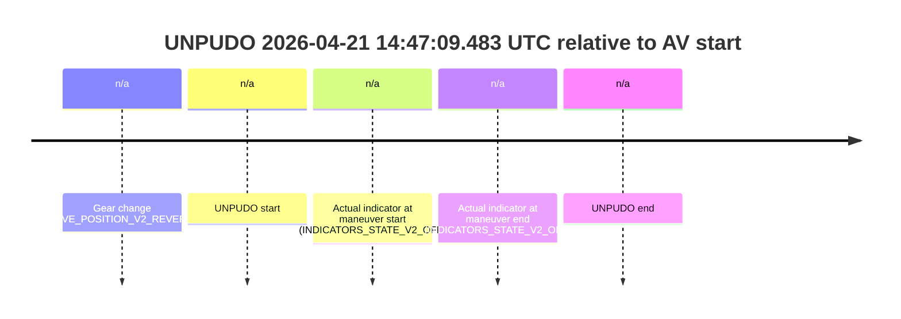
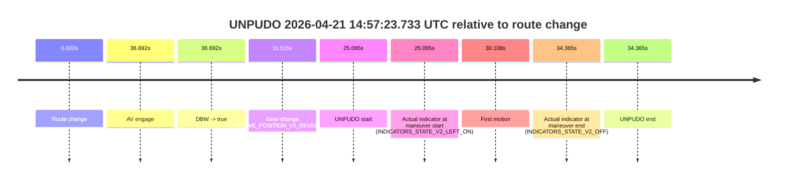

# Run Report: fme10003/2026-04-21--13-40-48--gen2-av-c0c918ed-060b-4500-95d6-3b5f9b49a61e

| Field | Value |
|---|---|
| Run ID | `fme10003/2026-04-21--13-40-48--gen2-av-c0c918ed-060b-4500-95d6-3b5f9b49a61e` |
| Date | `2026-04-21` |
| Model(s) | `pink-manta-ray-smooth` |
| Author | `guy.geva` |
| Event count | `3` |

## unpudo 2026-04-21 14:44:10.433 UTC

| Field | Value |
|---|---|
| Model | `pink-manta-ray-smooth` |
| Author | `guy.geva` |
| Run ID | `fme10003/2026-04-21--13-40-48--gen2-av-c0c918ed-060b-4500-95d6-3b5f9b49a61e` |
| Date | `2026-04-21` |
| Time (UTC) | `14:44:10.433` |
| Event type | `unpudo` |
| Disengagement type | `none observed` |
| Route change | `found` |
| Console | [run](https://console.sso.wayve.ai/run/fme10003/2026-04-21--13-40-48--gen2-av-c0c918ed-060b-4500-95d6-3b5f9b49a61e?id=&time-unixus=1776782650433307) |
| Foxglove | [segment](https://app.foxglove.dev/wayve-on-prem/p/prj_0dX18KZdVHg1fmmI/view?ds=foxglove-stream&ds.deviceName=fme10003&ds.start=2026-04-21T14%3A43%3A27.068324Z&ds.end=2026-04-21T14%3A47%3A15.840607Z&layoutId=lay_0e7VD4WIKDQGU73Y&time=2026-04-21T14%3A44%3A10.433307Z) |

### Event card: non-av

- Non-AV: there is no AV-owned portion anywhere inside the detected unpudo timeline, so it is kept for coverage but excluded from model success / failure scoring.

| Event | Time (UTC) | Delta from route change |
|---|---:|---:|
| Route change | 2026-04-21 14:43:37.068 | `0.000s` |
| AV engage | 2026-04-21 14:44:21.081 | `44.013s` |
| DBW -> true | 2026-04-21 14:44:21.081 | `44.013s` |
| Gear change (DRIVE_POSITION_V2_DRIVE) | 2026-04-21 14:43:56.733 | `19.665s` |
| UNPUDO start | 2026-04-21 14:44:10.433 | `33.365s` |
| Actual indicator at maneuver start (INDICATORS_STATE_V2_LEFT_ON) | 2026-04-21 14:44:10.433 | `33.365s` |
| First motion | 2026-04-21 14:44:10.536 | `33.468s` |
| DBW -> false | 2026-04-21 14:47:05.840 | `208.772s` |
| Actual indicator at maneuver end (INDICATORS_STATE_V2_OFF) | 2026-04-21 14:44:14.733 | `37.665s` |
| UNPUDO end | 2026-04-21 14:44:14.733 | `37.665s` |

| Metric | Value |
|---|---|
| Outcome | `non-av` |
| Effective failure type | `none` |
| Route change status | `found` |
| DBW at event start | `false` |
| DBW at event end | `false` |
| Predicted gear at AV start | `DRIVE_POSITION_V2_DRIVE` |
| Actual gear at AV start | `DRIVE_POSITION_V2_DRIVE` |
| Predicted gear at event start | `DRIVE_POSITION_V2_DRIVE` |
| Actual gear at event start | `DRIVE_POSITION_V2_DRIVE` |
| Planned indicator direction | `INDICATORS_STATE_V2_LEFT_ON` |
| Controller indicator direction | `INDICATORS_STATE_V2_LEFT_ON` |
| Actual indicator direction | `INDICATORS_STATE_V2_LEFT_ON` |
| Actual indicator at maneuver end | `INDICATORS_STATE_V2_OFF` |
| Driver accel help in AV | `false` |
| Driver accel help timestamp | `n/a` |
| Max accel pedal pct in AV | `0.0%` |
| Max brake pedal pct in AV | `0.0%` |
| Max speed mps in AV | `0.000` |
| Route -> AV | `44.013s` |
| AV -> event start | `-10.649s` |
| AV -> first motion | `-10.545s` |
| AV duration before disengagement | `164.759s` |
| Trajectory waypoint count | `36` |
| Driving-plan step count | `11` |

The scored portion starts from the AV-owned window, not from the pre-AV setup. Route-change search in the stopped pre-event segment was `found`, with the baseline therefore set to route change. At the event anchor the model predicts `DRIVE_POSITION_V2_DRIVE` and the actual gear is `DRIVE_POSITION_V2_DRIVE`. The effective model outcome is `non-av` because `there is no AV-owned overlap inside the event timeline`.

### Resolution

| Field | Value |
|---|---|
| Final outcome | `non-av` |
| Do we agree with this label? | `yes` |
| Source disengagement type | `none observed` |
| Resolved effective failure type | `none` |
| Confidence | `high` |

## unpudo 2026-04-21 14:47:09.483 UTC

| Field | Value |
|---|---|
| Model | `pink-manta-ray-smooth` |
| Author | `guy.geva` |
| Run ID | `fme10003/2026-04-21--13-40-48--gen2-av-c0c918ed-060b-4500-95d6-3b5f9b49a61e` |
| Date | `2026-04-21` |
| Time (UTC) | `14:47:09.483` |
| Event type | `unpudo` |
| Disengagement type | `none observed` |
| Route change | `unclear` |
| Console | [run](https://console.sso.wayve.ai/run/fme10003/2026-04-21--13-40-48--gen2-av-c0c918ed-060b-4500-95d6-3b5f9b49a61e?id=&time-unixus=1776782829483309) |
| Foxglove | [segment](https://app.foxglove.dev/wayve-on-prem/p/prj_0dX18KZdVHg1fmmI/view?ds=foxglove-stream&ds.deviceName=fme10003&ds.start=2026-04-21T14%3A46%3A53.783311Z&ds.end=2026-04-21T14%3A47%3A19.483309Z&layoutId=lay_0e7VD4WIKDQGU73Y&time=2026-04-21T14%3A47%3A09.483309Z) |

### Event card: non-av

- Non-AV: there is no AV-owned portion anywhere inside the detected unpudo timeline, so it is kept for coverage but excluded from model success / failure scoring.

| Event | Time (UTC) | Delta from AV start |
|---|---:|---:|
| Gear change (DRIVE_POSITION_V2_REVERSE) | 2026-04-21 14:47:03.783 | `n/a` |
| UNPUDO start | 2026-04-21 14:47:09.483 | `n/a` |
| Actual indicator at maneuver start (INDICATORS_STATE_V2_OFF) | 2026-04-21 14:47:09.483 | `n/a` |
| Actual indicator at maneuver end (INDICATORS_STATE_V2_OFF) | 2026-04-21 14:47:09.483 | `n/a` |
| UNPUDO end | 2026-04-21 14:47:09.483 | `n/a` |

| Metric | Value |
|---|---|
| Outcome | `non-av` |
| Effective failure type | `none` |
| Route change status | `unclear` |
| DBW at event start | `false` |
| DBW at event end | `false` |
| Predicted gear at AV start | `n/a` |
| Actual gear at AV start | `n/a` |
| Predicted gear at event start | `DRIVE_POSITION_V2_REVERSE` |
| Actual gear at event start | `DRIVE_POSITION_V2_REVERSE` |
| Planned indicator direction | `INDICATORS_STATE_V2_OFF` |
| Controller indicator direction | `INDICATORS_STATE_V2_OFF` |
| Actual indicator direction | `INDICATORS_STATE_V2_OFF` |
| Actual indicator at maneuver end | `INDICATORS_STATE_V2_OFF` |
| Driver accel help in AV | `false` |
| Driver accel help timestamp | `n/a` |
| Max accel pedal pct in AV | `0.0%` |
| Max brake pedal pct in AV | `0.0%` |
| Max speed mps in AV | `0.000` |
| Route -> AV | `n/a` |
| AV -> event start | `n/a` |
| AV -> first motion | `n/a` |
| AV duration before disengagement | `n/a` |
| Trajectory waypoint count | `37` |
| Driving-plan step count | `11` |

The scored portion starts from the AV-owned window, not from the pre-AV setup. Route-change search in the stopped pre-event segment was `unclear`, with the baseline therefore set to AV start. At the event anchor the model predicts `DRIVE_POSITION_V2_REVERSE` and the actual gear is `DRIVE_POSITION_V2_REVERSE`. The effective model outcome is `non-av` because `there is no AV-owned overlap inside the event timeline`.

### Resolution

| Field | Value |
|---|---|
| Final outcome | `non-av` |
| Do we agree with this label? | `yes` |
| Source disengagement type | `none observed` |
| Resolved effective failure type | `none` |
| Confidence | `medium` |

## unpudo 2026-04-21 14:57:23.733 UTC

| Field | Value |
|---|---|
| Model | `pink-manta-ray-smooth` |
| Author | `guy.geva` |
| Run ID | `fme10003/2026-04-21--13-40-48--gen2-av-c0c918ed-060b-4500-95d6-3b5f9b49a61e` |
| Date | `2026-04-21` |
| Time (UTC) | `14:57:23.733` |
| Event type | `unpudo` |
| Disengagement type | `none observed` |
| Route change | `found` |
| Console | [run](https://console.sso.wayve.ai/run/fme10003/2026-04-21--13-40-48--gen2-av-c0c918ed-060b-4500-95d6-3b5f9b49a61e?id=&time-unixus=1776783443733295) |
| Foxglove | [segment](https://app.foxglove.dev/wayve-on-prem/p/prj_0dX18KZdVHg1fmmI/view?ds=foxglove-stream&ds.deviceName=fme10003&ds.start=2026-04-21T14%3A56%3A48.668253Z&ds.end=2026-04-21T14%3A57%3A43.033299Z&layoutId=lay_0e7VD4WIKDQGU73Y&time=2026-04-21T14%3A57%3A23.733295Z) |

### Event card: non-av

- Non-AV: there is no AV-owned portion anywhere inside the detected unpudo timeline, so it is kept for coverage but excluded from model success / failure scoring.

| Event | Time (UTC) | Delta from route change |
|---|---:|---:|
| Route change | 2026-04-21 14:56:58.668 | `0.000s` |
| AV engage | 2026-04-21 14:57:35.360 | `36.692s` |
| DBW -> true | 2026-04-21 14:57:35.360 | `36.692s` |
| Gear change (DRIVE_POSITION_V2_REVERSE) | 2026-04-21 14:57:10.183 | `11.515s` |
| UNPUDO start | 2026-04-21 14:57:23.733 | `25.065s` |
| Actual indicator at maneuver start (INDICATORS_STATE_V2_LEFT_ON) | 2026-04-21 14:57:23.733 | `25.065s` |
| First motion | 2026-04-21 14:57:28.776 | `30.108s` |
| Actual indicator at maneuver end (INDICATORS_STATE_V2_OFF) | 2026-04-21 14:57:33.033 | `34.365s` |
| UNPUDO end | 2026-04-21 14:57:33.033 | `34.365s` |

| Metric | Value |
|---|---|
| Outcome | `non-av` |
| Effective failure type | `none` |
| Route change status | `found` |
| DBW at event start | `false` |
| DBW at event end | `false` |
| Predicted gear at AV start | `DRIVE_POSITION_V2_DRIVE` |
| Actual gear at AV start | `DRIVE_POSITION_V2_DRIVE` |
| Predicted gear at event start | `DRIVE_POSITION_V2_REVERSE` |
| Actual gear at event start | `DRIVE_POSITION_V2_REVERSE` |
| Planned indicator direction | `INDICATORS_STATE_V2_LEFT_ON` |
| Controller indicator direction | `INDICATORS_STATE_V2_LEFT_ON` |
| Actual indicator direction | `INDICATORS_STATE_V2_LEFT_ON` |
| Actual indicator at maneuver end | `INDICATORS_STATE_V2_OFF` |
| Driver accel help in AV | `false` |
| Driver accel help timestamp | `n/a` |
| Max accel pedal pct in AV | `0.0%` |
| Max brake pedal pct in AV | `0.0%` |
| Max speed mps in AV | `0.000` |
| Route -> AV | `36.692s` |
| AV -> event start | `-11.627s` |
| AV -> first motion | `-6.584s` |
| AV duration before disengagement | `n/a` |
| Trajectory waypoint count | `36` |
| Driving-plan step count | `11` |

The scored portion starts from the AV-owned window, not from the pre-AV setup. Route-change search in the stopped pre-event segment was `found`, with the baseline therefore set to route change. At the event anchor the model predicts `DRIVE_POSITION_V2_REVERSE` and the actual gear is `DRIVE_POSITION_V2_REVERSE`. The effective model outcome is `non-av` because `there is no AV-owned overlap inside the event timeline`.

### Resolution

| Field | Value |
|---|---|
| Final outcome | `non-av` |
| Do we agree with this label? | `yes` |
| Source disengagement type | `none observed` |
| Resolved effective failure type | `none` |
| Confidence | `high` |
