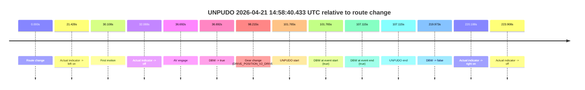
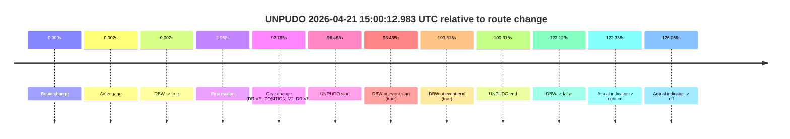
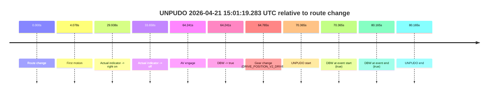

# Run Report: fme10003/2026-04-21--13-40-48--gen2-av-c0c918ed-060b-4500-95d6-3b5f9b49a61e

| Field | Value |
|---|---|
| Run ID | `fme10003/2026-04-21--13-40-48--gen2-av-c0c918ed-060b-4500-95d6-3b5f9b49a61e` |
| Date | `2026-04-21` |
| Model(s) | `eel-teal-outspoken` |
| Author | `zak` |
| Event count | `3` |

## unpudo 2026-04-21 14:58:40.433 UTC

| Field | Value |
|---|---|
| Model | `eel-teal-outspoken` |
| Author | `zak` |
| Run ID | `fme10003/2026-04-21--13-40-48--gen2-av-c0c918ed-060b-4500-95d6-3b5f9b49a61e` |
| Date | `2026-04-21` |
| Time (UTC) | `14:58:40.433` |
| Event type | `unpudo` |
| Disengagement type | `none observed` |
| Route change | `found` |
| Console | [run](https://console.sso.wayve.ai/run/fme10003/2026-04-21--13-40-48--gen2-av-c0c918ed-060b-4500-95d6-3b5f9b49a61e?id=&time-unixus=1776783520433313) |
| Foxglove | [segment](https://app.foxglove.dev/wayve-on-prem/p/prj_0dX18KZdVHg1fmmI/view?ds=foxglove-stream&ds.deviceName=fme10003&ds.start=2026-04-21T14%3A56%3A48.668253Z&ds.end=2026-04-21T15%3A00%3A48.641620Z&layoutId=lay_0e7VD4WIKDQGU73Y&time=2026-04-21T14%3A58%3A40.433313Z) |

### Event card: pass

- Pass: AV owns the credited unpudo from route change through the official unpudo window, the gear state is aligned at the anchor, and the vehicle moves without driver accelerator help in AV.

| Event | Time (UTC) | Delta from route change |
|---|---:|---:|
| Route change | 2026-04-21 14:56:58.668 | `0.000s` |
| Actual indicator -> left on | 2026-04-21 14:57:20.095 | `21.428s` |
| First motion | 2026-04-21 14:57:28.776 | `30.108s` |
| Actual indicator -> off | 2026-04-21 14:57:30.756 | `32.088s` |
| AV engage | 2026-04-21 14:57:35.360 | `36.692s` |
| DBW -> true | 2026-04-21 14:57:35.360 | `36.692s` |
| Gear change (DRIVE_POSITION_V2_DRIVE) | 2026-04-21 14:58:36.883 | `98.215s` |
| UNPUDO start | 2026-04-21 14:58:40.433 | `101.765s` |
| DBW at event start (true) | 2026-04-21 14:58:40.433 | `101.765s` |
| DBW at event end (true) | 2026-04-21 14:58:45.783 | `107.115s` |
| UNPUDO end | 2026-04-21 14:58:45.783 | `107.115s` |
| DBW -> false | 2026-04-21 15:00:38.641 | `219.973s` |
| Actual indicator -> right on | 2026-04-21 15:00:38.856 | `220.188s` |
| Actual indicator -> off | 2026-04-21 15:00:42.575 | `223.908s` |

| Metric | Value |
|---|---|
| Outcome | `pass` |
| Effective failure type | `none` |
| Route change status | `found` |
| DBW at event start | `true` |
| DBW at event end | `true` |
| Predicted gear at AV start | `DRIVE_POSITION_V2_DRIVE` |
| Actual gear at AV start | `DRIVE_POSITION_V2_DRIVE` |
| Predicted gear at event start | `DRIVE_POSITION_V2_DRIVE` |
| Actual gear at event start | `DRIVE_POSITION_V2_DRIVE` |
| Planned indicator direction | `INDICATORS_STATE_V2_LEFT_ON` |
| Controller indicator direction | `INDICATORS_STATE_V2_LEFT_ON` |
| Actual indicator direction | `INDICATORS_STATE_V2_OFF` |
| Actual indicator at maneuver end | `INDICATORS_STATE_V2_OFF` |
| Driver accel help in AV | `false` |
| Driver accel help timestamp | `n/a` |
| Max accel pedal pct in AV | `0.0%` |
| Max brake pedal pct in AV | `22.9%` |
| Max speed mps in AV | `8.314` |
| Success timing baseline | `route change` |
| Route -> AV | `36.692s` |
| AV -> event start | `65.073s` |
| AV -> first motion | `-6.584s` |
| Success baseline -> event start | `101.765s` |
| Success baseline -> first motion | `30.108s` |
| AV duration before disengagement | `183.281s` |
| Trajectory waypoint count | `38` |
| Driving-plan step count | `11` |

The scored portion starts from the AV-owned window, not from the pre-AV setup. Route-change search in the stopped pre-event segment was `found`, with the baseline therefore set to route change. At the event anchor the model predicts `DRIVE_POSITION_V2_DRIVE` and the actual gear is `DRIVE_POSITION_V2_DRIVE`. The effective model outcome is `pass` because `the credited unpudo stays AV-owned through the official unpudo window.`

### Resolution

| Field | Value |
|---|---|
| Final outcome | `pass` |
| Do we agree with this label? | `yes` |
| Source disengagement type | `none observed` |
| Resolved effective failure type | `none` |
| Confidence | `high` |

## unpudo 2026-04-21 15:00:12.983 UTC

| Field | Value |
|---|---|
| Model | `eel-teal-outspoken` |
| Author | `zak` |
| Run ID | `fme10003/2026-04-21--13-40-48--gen2-av-c0c918ed-060b-4500-95d6-3b5f9b49a61e` |
| Date | `2026-04-21` |
| Time (UTC) | `15:00:12.983` |
| Event type | `unpudo` |
| Disengagement type | `none observed` |
| Route change | `found` |
| Console | [run](https://console.sso.wayve.ai/run/fme10003/2026-04-21--13-40-48--gen2-av-c0c918ed-060b-4500-95d6-3b5f9b49a61e?id=&time-unixus=1776783612983295) |
| Foxglove | [segment](https://app.foxglove.dev/wayve-on-prem/p/prj_0dX18KZdVHg1fmmI/view?ds=foxglove-stream&ds.deviceName=fme10003&ds.start=2026-04-21T14%3A58%3A26.518267Z&ds.end=2026-04-21T15%3A00%3A48.641620Z&layoutId=lay_0e7VD4WIKDQGU73Y&time=2026-04-21T15%3A00%3A12.983295Z) |

### Event card: pass

- Pass: AV owns the credited unpudo from route change through the official unpudo window, the gear state is aligned at the anchor, and the vehicle moves without driver accelerator help in AV.

| Event | Time (UTC) | Delta from route change |
|---|---:|---:|
| Route change | 2026-04-21 14:58:36.518 | `0.000s` |
| AV engage | 2026-04-21 14:58:36.520 | `0.002s` |
| DBW -> true | 2026-04-21 14:58:36.520 | `0.002s` |
| First motion | 2026-04-21 14:58:40.475 | `3.958s` |
| Gear change (DRIVE_POSITION_V2_DRIVE) | 2026-04-21 15:00:09.283 | `92.765s` |
| UNPUDO start | 2026-04-21 15:00:12.983 | `96.465s` |
| DBW at event start (true) | 2026-04-21 15:00:12.983 | `96.465s` |
| DBW at event end (true) | 2026-04-21 15:00:16.833 | `100.315s` |
| UNPUDO end | 2026-04-21 15:00:16.833 | `100.315s` |
| DBW -> false | 2026-04-21 15:00:38.641 | `122.123s` |
| Actual indicator -> right on | 2026-04-21 15:00:38.856 | `122.338s` |
| Actual indicator -> off | 2026-04-21 15:00:42.575 | `126.058s` |

| Metric | Value |
|---|---|
| Outcome | `pass` |
| Effective failure type | `none` |
| Route change status | `found` |
| DBW at event start | `true` |
| DBW at event end | `true` |
| Predicted gear at AV start | `DRIVE_POSITION_V2_PARK` |
| Actual gear at AV start | `DRIVE_POSITION_V2_PARK` |
| Predicted gear at event start | `DRIVE_POSITION_V2_DRIVE` |
| Actual gear at event start | `DRIVE_POSITION_V2_DRIVE` |
| Planned indicator direction | `INDICATORS_STATE_V2_OFF` |
| Controller indicator direction | `INDICATORS_STATE_V2_LEFT_ON` |
| Actual indicator direction | `INDICATORS_STATE_V2_OFF` |
| Actual indicator at maneuver end | `INDICATORS_STATE_V2_OFF` |
| Driver accel help in AV | `false` |
| Driver accel help timestamp | `n/a` |
| Max accel pedal pct in AV | `0.0%` |
| Max brake pedal pct in AV | `30.0%` |
| Max speed mps in AV | `7.833` |
| Success timing baseline | `route change` |
| Route -> AV | `0.002s` |
| AV -> event start | `96.463s` |
| AV -> first motion | `3.955s` |
| Success baseline -> event start | `96.465s` |
| Success baseline -> first motion | `3.958s` |
| AV duration before disengagement | `122.121s` |
| Trajectory waypoint count | `37` |
| Driving-plan step count | `11` |

The scored portion starts from the AV-owned window, not from the pre-AV setup. Route-change search in the stopped pre-event segment was `found`, with the baseline therefore set to route change. At the event anchor the model predicts `DRIVE_POSITION_V2_DRIVE` and the actual gear is `DRIVE_POSITION_V2_DRIVE`. The effective model outcome is `pass` because `the credited unpudo stays AV-owned through the official unpudo window.`

### Resolution

| Field | Value |
|---|---|
| Final outcome | `pass` |
| Do we agree with this label? | `yes` |
| Source disengagement type | `none observed` |
| Resolved effective failure type | `none` |
| Confidence | `high` |

## unpudo 2026-04-21 15:01:19.283 UTC

| Field | Value |
|---|---|
| Model | `eel-teal-outspoken` |
| Author | `zak` |
| Run ID | `fme10003/2026-04-21--13-40-48--gen2-av-c0c918ed-060b-4500-95d6-3b5f9b49a61e` |
| Date | `2026-04-21` |
| Time (UTC) | `15:01:19.283` |
| Event type | `unpudo` |
| Disengagement type | `none observed` |
| Route change | `found` |
| Console | [run](https://console.sso.wayve.ai/run/fme10003/2026-04-21--13-40-48--gen2-av-c0c918ed-060b-4500-95d6-3b5f9b49a61e?id=&time-unixus=1776783679283292) |
| Foxglove | [segment](https://app.foxglove.dev/wayve-on-prem/p/prj_0dX18KZdVHg1fmmI/view?ds=foxglove-stream&ds.deviceName=fme10003&ds.start=2026-04-21T14%3A59%3A58.918230Z&ds.end=2026-04-21T15%3A01%3A39.083307Z&layoutId=lay_0e7VD4WIKDQGU73Y&time=2026-04-21T15%3A01%3A19.283292Z) |

### Event card: pass

- Pass: AV owns the credited unpudo from route change through the official unpudo window, the gear state is aligned at the anchor, and the vehicle moves without driver accelerator help in AV.

| Event | Time (UTC) | Delta from route change |
|---|---:|---:|
| Route change | 2026-04-21 15:00:08.918 | `0.000s` |
| First motion | 2026-04-21 15:00:12.995 | `4.078s` |
| Actual indicator -> right on | 2026-04-21 15:00:38.856 | `29.938s` |
| Actual indicator -> off | 2026-04-21 15:00:42.575 | `33.658s` |
| AV engage | 2026-04-21 15:01:13.159 | `64.241s` |
| DBW -> true | 2026-04-21 15:01:13.159 | `64.241s` |
| Gear change (DRIVE_POSITION_V2_DRIVE) | 2026-04-21 15:01:13.683 | `64.765s` |
| UNPUDO start | 2026-04-21 15:01:19.283 | `70.365s` |
| DBW at event start (true) | 2026-04-21 15:01:19.283 | `70.365s` |
| DBW at event end (true) | 2026-04-21 15:01:29.083 | `80.165s` |
| UNPUDO end | 2026-04-21 15:01:29.083 | `80.165s` |

| Metric | Value |
|---|---|
| Outcome | `pass` |
| Effective failure type | `none` |
| Route change status | `found` |
| DBW at event start | `true` |
| DBW at event end | `true` |
| Predicted gear at AV start | `DRIVE_POSITION_V2_DRIVE` |
| Actual gear at AV start | `DRIVE_POSITION_V2_PARK` |
| Predicted gear at event start | `DRIVE_POSITION_V2_DRIVE` |
| Actual gear at event start | `DRIVE_POSITION_V2_DRIVE` |
| Planned indicator direction | `INDICATORS_STATE_V2_LEFT_ON` |
| Controller indicator direction | `INDICATORS_STATE_V2_LEFT_ON` |
| Actual indicator direction | `INDICATORS_STATE_V2_OFF` |
| Actual indicator at maneuver end | `INDICATORS_STATE_V2_OFF` |
| Driver accel help in AV | `false` |
| Driver accel help timestamp | `n/a` |
| Max accel pedal pct in AV | `0.0%` |
| Max brake pedal pct in AV | `30.0%` |
| Max speed mps in AV | `2.283` |
| Success timing baseline | `route change` |
| Route -> AV | `64.241s` |
| AV -> event start | `6.124s` |
| AV -> first motion | `-60.164s` |
| Success baseline -> event start | `70.365s` |
| Success baseline -> first motion | `4.078s` |
| AV duration before disengagement | `n/a` |
| Trajectory waypoint count | `37` |
| Driving-plan step count | `11` |

The scored portion starts from the AV-owned window, not from the pre-AV setup. Route-change search in the stopped pre-event segment was `found`, with the baseline therefore set to route change. At the event anchor the model predicts `DRIVE_POSITION_V2_DRIVE` and the actual gear is `DRIVE_POSITION_V2_DRIVE`. The effective model outcome is `pass` because `the credited unpudo stays AV-owned through the official unpudo window.`

### Resolution

| Field | Value |
|---|---|
| Final outcome | `pass` |
| Do we agree with this label? | `yes` |
| Source disengagement type | `none observed` |
| Resolved effective failure type | `none` |
| Confidence | `high` |
