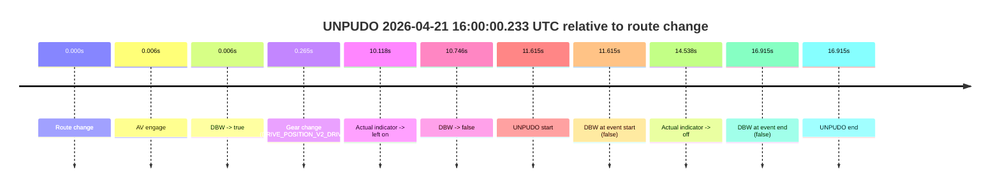
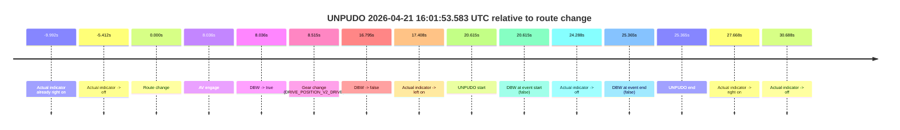
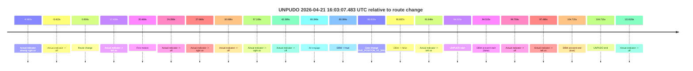
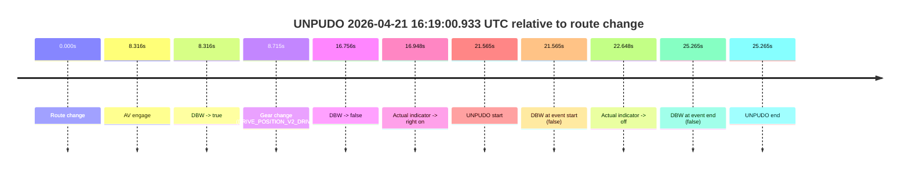
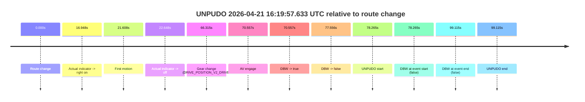
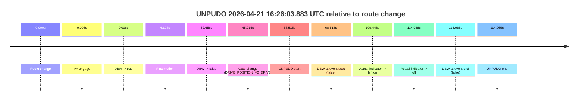
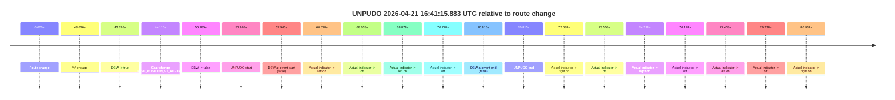
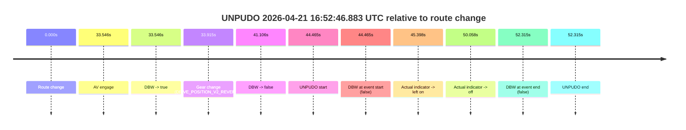
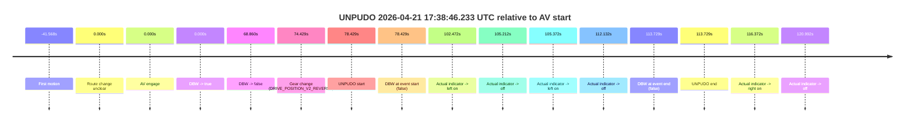

# Run Report: fme10003/2026-04-21--15-49-54--gen2-av-ad61770f-5e9c-472c-a44e-295c214bb63c

| Field | Value |
|---|---|
| Run ID | `fme10003/2026-04-21--15-49-54--gen2-av-ad61770f-5e9c-472c-a44e-295c214bb63c` |
| Date | `2026-04-21` |
| Model(s) | `pink-manta-ray-smooth` |
| Author | `guy.geva` |
| Event count | `11` |

## unpudo 2026-04-21 16:00:00.233 UTC

| Field | Value |
|---|---|
| Model | `pink-manta-ray-smooth` |
| Author | `guy.geva` |
| Run ID | `fme10003/2026-04-21--15-49-54--gen2-av-ad61770f-5e9c-472c-a44e-295c214bb63c` |
| Date | `2026-04-21` |
| Time (UTC) | `16:00:00.233` |
| Event type | `unpudo` |
| Disengagement type | `none observed` |
| Route change | `found` |
| Console | [run](https://console.sso.wayve.ai/run/fme10003/2026-04-21--15-49-54--gen2-av-ad61770f-5e9c-472c-a44e-295c214bb63c?id=&time-unixus=1776787200233292) |
| Foxglove | [segment](https://app.foxglove.dev/wayve-on-prem/p/prj_0dX18KZdVHg1fmmI/view?ds=foxglove-stream&ds.deviceName=fme10003&ds.start=2026-04-21T15%3A59%3A38.618319Z&ds.end=2026-04-21T16%3A00%3A15.533293Z&layoutId=lay_0e7VD4WIKDQGU73Y&time=2026-04-21T16%3A00%3A00.233292Z) |

### Event card: fail

- Fail: the credited unpudo does not stay AV-owned. The event window starts with DBW false, and the maneuver outcome lands outside a clean AV-owned segment.

| Event | Time (UTC) | Delta from route change |
|---|---:|---:|
| Route change | 2026-04-21 15:59:48.618 | `0.000s` |
| AV engage | 2026-04-21 15:59:48.623 | `0.006s` |
| DBW -> true | 2026-04-21 15:59:48.623 | `0.006s` |
| Gear change (DRIVE_POSITION_V2_DRIVE) | 2026-04-21 15:59:48.883 | `0.265s` |
| Actual indicator -> left on | 2026-04-21 15:59:58.735 | `10.118s` |
| DBW -> false | 2026-04-21 15:59:59.364 | `10.746s` |
| UNPUDO start | 2026-04-21 16:00:00.233 | `11.615s` |
| DBW at event start (false) | 2026-04-21 16:00:00.233 | `11.615s` |
| Actual indicator -> off | 2026-04-21 16:00:03.155 | `14.538s` |
| DBW at event end (false) | 2026-04-21 16:00:05.533 | `16.915s` |
| UNPUDO end | 2026-04-21 16:00:05.533 | `16.915s` |

| Metric | Value |
|---|---|
| Outcome | `fail` |
| Effective failure type | `not_av_owned` |
| Route change status | `found` |
| DBW at event start | `false` |
| DBW at event end | `false` |
| Predicted gear at AV start | `DRIVE_POSITION_V2_PARK` |
| Actual gear at AV start | `DRIVE_POSITION_V2_PARK` |
| Predicted gear at event start | `DRIVE_POSITION_V2_DRIVE` |
| Actual gear at event start | `DRIVE_POSITION_V2_DRIVE` |
| Planned indicator direction | `INDICATORS_STATE_V2_LEFT_ON` |
| Controller indicator direction | `INDICATORS_STATE_V2_LEFT_ON` |
| Actual indicator direction | `INDICATORS_STATE_V2_LEFT_ON` |
| Actual indicator at maneuver end | `INDICATORS_STATE_V2_OFF` |
| Driver accel help in AV | `false` |
| Driver accel help timestamp | `n/a` |
| Max accel pedal pct in AV | `0.0%` |
| Max brake pedal pct in AV | `9.4%` |
| Max speed mps in AV | `0.000` |
| Success timing baseline | `route change` |
| Route -> AV | `0.006s` |
| AV -> event start | `11.609s` |
| AV -> first motion | `n/a` |
| Success baseline -> event start | `11.615s` |
| Success baseline -> first motion | `n/a` |
| AV duration before disengagement | `10.741s` |
| Trajectory waypoint count | `38` |
| Driving-plan step count | `11` |

The scored portion starts from the AV-owned window, not from the pre-AV setup. Route-change search in the stopped pre-event segment was `found`, with the baseline therefore set to route change. At the event anchor the model predicts `DRIVE_POSITION_V2_DRIVE` and the actual gear is `DRIVE_POSITION_V2_DRIVE`. The effective model outcome is `fail` because `not_av_owned.`

### Resolution

| Field | Value |
|---|---|
| Final outcome | `fail` |
| Do we agree with this label? | `yes` |
| Source disengagement type | `none observed` |
| Resolved effective failure type | `not_av_owned` |
| Confidence | `high` |

## unpudo 2026-04-21 16:01:53.583 UTC

| Field | Value |
|---|---|
| Model | `pink-manta-ray-smooth` |
| Author | `guy.geva` |
| Run ID | `fme10003/2026-04-21--15-49-54--gen2-av-ad61770f-5e9c-472c-a44e-295c214bb63c` |
| Date | `2026-04-21` |
| Time (UTC) | `16:01:53.583` |
| Event type | `unpudo` |
| Disengagement type | `none observed` |
| Route change | `found` |
| Console | [run](https://console.sso.wayve.ai/run/fme10003/2026-04-21--15-49-54--gen2-av-ad61770f-5e9c-472c-a44e-295c214bb63c?id=&time-unixus=1776787313583311) |
| Foxglove | [segment](https://app.foxglove.dev/wayve-on-prem/p/prj_0dX18KZdVHg1fmmI/view?ds=foxglove-stream&ds.deviceName=fme10003&ds.start=2026-04-21T16%3A01%3A22.968233Z&ds.end=2026-04-21T16%3A02%3A08.333303Z&layoutId=lay_0e7VD4WIKDQGU73Y&time=2026-04-21T16%3A01%3A53.583311Z) |

### Event card: fail

- Fail: the credited unpudo does not stay AV-owned. The event window starts with DBW false, and the maneuver outcome lands outside a clean AV-owned segment.

| Event | Time (UTC) | Delta from route change |
|---|---:|---:|
| Actual indicator already right on | 2026-04-21 16:01:22.975 | `-9.992s` |
| Actual indicator -> off | 2026-04-21 16:01:27.556 | `-5.412s` |
| Route change | 2026-04-21 16:01:32.968 | `0.000s` |
| AV engage | 2026-04-21 16:01:41.004 | `8.036s` |
| DBW -> true | 2026-04-21 16:01:41.004 | `8.036s` |
| Gear change (DRIVE_POSITION_V2_DRIVE) | 2026-04-21 16:01:41.483 | `8.515s` |
| DBW -> false | 2026-04-21 16:01:49.763 | `16.795s` |
| Actual indicator -> left on | 2026-04-21 16:01:50.376 | `17.408s` |
| UNPUDO start | 2026-04-21 16:01:53.583 | `20.615s` |
| DBW at event start (false) | 2026-04-21 16:01:53.583 | `20.615s` |
| Actual indicator -> off | 2026-04-21 16:01:57.256 | `24.288s` |
| DBW at event end (false) | 2026-04-21 16:01:58.333 | `25.365s` |
| UNPUDO end | 2026-04-21 16:01:58.333 | `25.365s` |
| Actual indicator -> right on | 2026-04-21 16:02:00.636 | `27.668s` |
| Actual indicator -> off | 2026-04-21 16:02:03.656 | `30.688s` |

| Metric | Value |
|---|---|
| Outcome | `fail` |
| Effective failure type | `not_av_owned` |
| Route change status | `found` |
| DBW at event start | `false` |
| DBW at event end | `false` |
| Predicted gear at AV start | `DRIVE_POSITION_V2_DRIVE` |
| Actual gear at AV start | `DRIVE_POSITION_V2_PARK` |
| Predicted gear at event start | `DRIVE_POSITION_V2_DRIVE` |
| Actual gear at event start | `DRIVE_POSITION_V2_DRIVE` |
| Planned indicator direction | `INDICATORS_STATE_V2_RIGHT_ON` |
| Controller indicator direction | `INDICATORS_STATE_V2_RIGHT_ON` |
| Actual indicator direction | `INDICATORS_STATE_V2_LEFT_ON` |
| Actual indicator at maneuver end | `INDICATORS_STATE_V2_OFF` |
| Driver accel help in AV | `false` |
| Driver accel help timestamp | `n/a` |
| Max accel pedal pct in AV | `0.0%` |
| Max brake pedal pct in AV | `8.0%` |
| Max speed mps in AV | `0.000` |
| Success timing baseline | `route change` |
| Route -> AV | `8.036s` |
| AV -> event start | `12.579s` |
| AV -> first motion | `n/a` |
| Success baseline -> event start | `20.615s` |
| Success baseline -> first motion | `n/a` |
| AV duration before disengagement | `8.759s` |
| Trajectory waypoint count | `37` |
| Driving-plan step count | `11` |

The scored portion starts from the AV-owned window, not from the pre-AV setup. Route-change search in the stopped pre-event segment was `found`, with the baseline therefore set to route change. At the event anchor the model predicts `DRIVE_POSITION_V2_DRIVE` and the actual gear is `DRIVE_POSITION_V2_DRIVE`. The effective model outcome is `fail` because `not_av_owned.`

### Resolution

| Field | Value |
|---|---|
| Final outcome | `fail` |
| Do we agree with this label? | `yes` |
| Source disengagement type | `none observed` |
| Resolved effective failure type | `not_av_owned` |
| Confidence | `high` |

## unpudo 2026-04-21 16:03:07.483 UTC

| Field | Value |
|---|---|
| Model | `pink-manta-ray-smooth` |
| Author | `guy.geva` |
| Run ID | `fme10003/2026-04-21--15-49-54--gen2-av-ad61770f-5e9c-472c-a44e-295c214bb63c` |
| Date | `2026-04-21` |
| Time (UTC) | `16:03:07.483` |
| Event type | `unpudo` |
| Disengagement type | `none observed` |
| Route change | `found` |
| Console | [run](https://console.sso.wayve.ai/run/fme10003/2026-04-21--15-49-54--gen2-av-ad61770f-5e9c-472c-a44e-295c214bb63c?id=&time-unixus=1776787387483316) |
| Foxglove | [segment](https://app.foxglove.dev/wayve-on-prem/p/prj_0dX18KZdVHg1fmmI/view?ds=foxglove-stream&ds.deviceName=fme10003&ds.start=2026-04-21T16%3A01%3A22.968233Z&ds.end=2026-04-21T16%3A03%3A27.683311Z&layoutId=lay_0e7VD4WIKDQGU73Y&time=2026-04-21T16%3A03%3A07.483316Z) |

### Event card: fail

- Fail: the credited unpudo does not stay AV-owned. The event window starts with DBW false, and the maneuver outcome lands outside a clean AV-owned segment.

| Event | Time (UTC) | Delta from route change |
|---|---:|---:|
| Actual indicator already right on | 2026-04-21 16:01:22.975 | `-9.992s` |
| Actual indicator -> off | 2026-04-21 16:01:27.556 | `-5.412s` |
| Route change | 2026-04-21 16:01:32.968 | `0.000s` |
| Actual indicator -> left on | 2026-04-21 16:01:50.376 | `17.408s` |
| First motion | 2026-04-21 16:01:53.636 | `20.668s` |
| Actual indicator -> off | 2026-04-21 16:01:57.256 | `24.288s` |
| Actual indicator -> right on | 2026-04-21 16:02:00.636 | `27.668s` |
| Actual indicator -> off | 2026-04-21 16:02:03.656 | `30.688s` |
| Actual indicator -> right on | 2026-04-21 16:02:30.076 | `57.108s` |
| Actual indicator -> off | 2026-04-21 16:02:35.356 | `62.389s` |
| AV engage | 2026-04-21 16:02:53.364 | `80.396s` |
| DBW -> true | 2026-04-21 16:02:53.364 | `80.396s` |
| Gear change (DRIVE_POSITION_V2_DRIVE) | 2026-04-21 16:02:53.783 | `80.815s` |
| DBW -> false | 2026-04-21 16:03:04.625 | `91.657s` |
| Actual indicator -> left on | 2026-04-21 16:03:04.815 | `91.848s` |
| UNPUDO start | 2026-04-21 16:03:07.483 | `94.515s` |
| DBW at event start (false) | 2026-04-21 16:03:07.483 | `94.515s` |
| Actual indicator -> off | 2026-04-21 16:03:09.675 | `96.708s` |
| Actual indicator -> left on | 2026-04-21 16:03:10.455 | `97.488s` |
| DBW at event end (true) | 2026-04-21 16:03:17.683 | `104.715s` |
| UNPUDO end | 2026-04-21 16:03:17.683 | `104.715s` |
| Actual indicator -> off | 2026-04-21 16:03:26.595 | `113.628s` |

| Metric | Value |
|---|---|
| Outcome | `fail` |
| Effective failure type | `completed_outside_av` |
| Route change status | `found` |
| DBW at event start | `false` |
| DBW at event end | `true` |
| Predicted gear at AV start | `DRIVE_POSITION_V2_DRIVE` |
| Actual gear at AV start | `DRIVE_POSITION_V2_PARK` |
| Predicted gear at event start | `DRIVE_POSITION_V2_DRIVE` |
| Actual gear at event start | `DRIVE_POSITION_V2_DRIVE` |
| Planned indicator direction | `INDICATORS_STATE_V2_LEFT_ON` |
| Controller indicator direction | `INDICATORS_STATE_V2_LEFT_ON` |
| Actual indicator direction | `INDICATORS_STATE_V2_LEFT_ON` |
| Actual indicator at maneuver end | `INDICATORS_STATE_V2_LEFT_ON` |
| Driver accel help in AV | `false` |
| Driver accel help timestamp | `n/a` |
| Max accel pedal pct in AV | `0.0%` |
| Max brake pedal pct in AV | `28.9%` |
| Max speed mps in AV | `0.000` |
| Success timing baseline | `route change` |
| Route -> AV | `80.396s` |
| AV -> event start | `14.119s` |
| AV -> first motion | `-59.728s` |
| Success baseline -> event start | `94.515s` |
| Success baseline -> first motion | `20.668s` |
| AV duration before disengagement | `11.261s` |
| Trajectory waypoint count | `37` |
| Driving-plan step count | `11` |

The scored portion starts from the AV-owned window, not from the pre-AV setup. Route-change search in the stopped pre-event segment was `found`, with the baseline therefore set to route change. At the event anchor the model predicts `DRIVE_POSITION_V2_DRIVE` and the actual gear is `DRIVE_POSITION_V2_DRIVE`. The effective model outcome is `fail` because `completed_outside_av.`

### Resolution

| Field | Value |
|---|---|
| Final outcome | `fail` |
| Do we agree with this label? | `yes` |
| Source disengagement type | `none observed` |
| Resolved effective failure type | `completed_outside_av` |
| Confidence | `high` |

## unpudo 2026-04-21 16:19:00.933 UTC

| Field | Value |
|---|---|
| Model | `pink-manta-ray-smooth` |
| Author | `guy.geva` |
| Run ID | `fme10003/2026-04-21--15-49-54--gen2-av-ad61770f-5e9c-472c-a44e-295c214bb63c` |
| Date | `2026-04-21` |
| Time (UTC) | `16:19:00.933` |
| Event type | `unpudo` |
| Disengagement type | `none observed` |
| Route change | `found` |
| Console | [run](https://console.sso.wayve.ai/run/fme10003/2026-04-21--15-49-54--gen2-av-ad61770f-5e9c-472c-a44e-295c214bb63c?id=&time-unixus=1776788340933303) |
| Foxglove | [segment](https://app.foxglove.dev/wayve-on-prem/p/prj_0dX18KZdVHg1fmmI/view?ds=foxglove-stream&ds.deviceName=fme10003&ds.start=2026-04-21T16%3A18%3A29.368287Z&ds.end=2026-04-21T16%3A19%3A14.633307Z&layoutId=lay_0e7VD4WIKDQGU73Y&time=2026-04-21T16%3A19%3A00.933303Z) |

### Event card: fail

- Fail: the credited unpudo does not stay AV-owned. The event window starts with DBW false, and the maneuver outcome lands outside a clean AV-owned segment.

| Event | Time (UTC) | Delta from route change |
|---|---:|---:|
| Route change | 2026-04-21 16:18:39.368 | `0.000s` |
| AV engage | 2026-04-21 16:18:47.684 | `8.316s` |
| DBW -> true | 2026-04-21 16:18:47.684 | `8.316s` |
| Gear change (DRIVE_POSITION_V2_DRIVE) | 2026-04-21 16:18:48.083 | `8.715s` |
| DBW -> false | 2026-04-21 16:18:56.124 | `16.756s` |
| Actual indicator -> right on | 2026-04-21 16:18:56.315 | `16.948s` |
| UNPUDO start | 2026-04-21 16:19:00.933 | `21.565s` |
| DBW at event start (false) | 2026-04-21 16:19:00.933 | `21.565s` |
| Actual indicator -> off | 2026-04-21 16:19:02.015 | `22.648s` |
| DBW at event end (false) | 2026-04-21 16:19:04.633 | `25.265s` |
| UNPUDO end | 2026-04-21 16:19:04.633 | `25.265s` |

| Metric | Value |
|---|---|
| Outcome | `fail` |
| Effective failure type | `not_av_owned` |
| Route change status | `found` |
| DBW at event start | `false` |
| DBW at event end | `false` |
| Predicted gear at AV start | `DRIVE_POSITION_V2_DRIVE` |
| Actual gear at AV start | `DRIVE_POSITION_V2_PARK` |
| Predicted gear at event start | `DRIVE_POSITION_V2_DRIVE` |
| Actual gear at event start | `DRIVE_POSITION_V2_DRIVE` |
| Planned indicator direction | `INDICATORS_STATE_V2_OFF` |
| Controller indicator direction | `INDICATORS_STATE_V2_OFF` |
| Actual indicator direction | `INDICATORS_STATE_V2_RIGHT_ON` |
| Actual indicator at maneuver end | `INDICATORS_STATE_V2_OFF` |
| Driver accel help in AV | `false` |
| Driver accel help timestamp | `n/a` |
| Max accel pedal pct in AV | `0.0%` |
| Max brake pedal pct in AV | `30.0%` |
| Max speed mps in AV | `0.000` |
| Success timing baseline | `route change` |
| Route -> AV | `8.316s` |
| AV -> event start | `13.249s` |
| AV -> first motion | `n/a` |
| Success baseline -> event start | `21.565s` |
| Success baseline -> first motion | `n/a` |
| AV duration before disengagement | `8.440s` |
| Trajectory waypoint count | `36` |
| Driving-plan step count | `11` |

The scored portion starts from the AV-owned window, not from the pre-AV setup. Route-change search in the stopped pre-event segment was `found`, with the baseline therefore set to route change. At the event anchor the model predicts `DRIVE_POSITION_V2_DRIVE` and the actual gear is `DRIVE_POSITION_V2_DRIVE`. The effective model outcome is `fail` because `not_av_owned.`

### Resolution

| Field | Value |
|---|---|
| Final outcome | `fail` |
| Do we agree with this label? | `yes` |
| Source disengagement type | `none observed` |
| Resolved effective failure type | `not_av_owned` |
| Confidence | `high` |

## unpudo 2026-04-21 16:19:57.633 UTC

| Field | Value |
|---|---|
| Model | `pink-manta-ray-smooth` |
| Author | `guy.geva` |
| Run ID | `fme10003/2026-04-21--15-49-54--gen2-av-ad61770f-5e9c-472c-a44e-295c214bb63c` |
| Date | `2026-04-21` |
| Time (UTC) | `16:19:57.633` |
| Event type | `unpudo` |
| Disengagement type | `none observed` |
| Route change | `found` |
| Console | [run](https://console.sso.wayve.ai/run/fme10003/2026-04-21--15-49-54--gen2-av-ad61770f-5e9c-472c-a44e-295c214bb63c?id=&time-unixus=1776788397633314) |
| Foxglove | [segment](https://app.foxglove.dev/wayve-on-prem/p/prj_0dX18KZdVHg1fmmI/view?ds=foxglove-stream&ds.deviceName=fme10003&ds.start=2026-04-21T16%3A18%3A29.368287Z&ds.end=2026-04-21T16%3A20%3A28.483311Z&layoutId=lay_0e7VD4WIKDQGU73Y&time=2026-04-21T16%3A19%3A57.633314Z) |

### Event card: fail

- Fail: the credited unpudo does not stay AV-owned. The event window starts with DBW false, and the maneuver outcome lands outside a clean AV-owned segment.

| Event | Time (UTC) | Delta from route change |
|---|---:|---:|
| Route change | 2026-04-21 16:18:39.368 | `0.000s` |
| Actual indicator -> right on | 2026-04-21 16:18:56.315 | `16.948s` |
| First motion | 2026-04-21 16:19:00.976 | `21.608s` |
| Actual indicator -> off | 2026-04-21 16:19:02.015 | `22.648s` |
| Gear change (DRIVE_POSITION_V2_DRIVE) | 2026-04-21 16:19:45.683 | `66.315s` |
| AV engage | 2026-04-21 16:19:49.925 | `70.557s` |
| DBW -> true | 2026-04-21 16:19:49.925 | `70.557s` |
| DBW -> false | 2026-04-21 16:19:56.924 | `77.556s` |
| UNPUDO start | 2026-04-21 16:19:57.633 | `78.265s` |
| DBW at event start (false) | 2026-04-21 16:19:57.633 | `78.265s` |
| DBW at event end (false) | 2026-04-21 16:20:18.483 | `99.115s` |
| UNPUDO end | 2026-04-21 16:20:18.483 | `99.115s` |

| Metric | Value |
|---|---|
| Outcome | `fail` |
| Effective failure type | `completed_outside_av` |
| Route change status | `found` |
| DBW at event start | `false` |
| DBW at event end | `false` |
| Predicted gear at AV start | `DRIVE_POSITION_V2_DRIVE` |
| Actual gear at AV start | `DRIVE_POSITION_V2_DRIVE` |
| Predicted gear at event start | `DRIVE_POSITION_V2_DRIVE` |
| Actual gear at event start | `DRIVE_POSITION_V2_DRIVE` |
| Planned indicator direction | `INDICATORS_STATE_V2_OFF` |
| Controller indicator direction | `INDICATORS_STATE_V2_OFF` |
| Actual indicator direction | `INDICATORS_STATE_V2_OFF` |
| Actual indicator at maneuver end | `INDICATORS_STATE_V2_OFF` |
| Driver accel help in AV | `false` |
| Driver accel help timestamp | `n/a` |
| Max accel pedal pct in AV | `0.0%` |
| Max brake pedal pct in AV | `11.5%` |
| Max speed mps in AV | `0.000` |
| Success timing baseline | `route change` |
| Route -> AV | `70.557s` |
| AV -> event start | `7.708s` |
| AV -> first motion | `-48.949s` |
| Success baseline -> event start | `78.265s` |
| Success baseline -> first motion | `21.608s` |
| AV duration before disengagement | `6.999s` |
| Trajectory waypoint count | `38` |
| Driving-plan step count | `11` |

The scored portion starts from the AV-owned window, not from the pre-AV setup. Route-change search in the stopped pre-event segment was `found`, with the baseline therefore set to route change. At the event anchor the model predicts `DRIVE_POSITION_V2_DRIVE` and the actual gear is `DRIVE_POSITION_V2_DRIVE`. The effective model outcome is `fail` because `completed_outside_av.`

### Resolution

| Field | Value |
|---|---|
| Final outcome | `fail` |
| Do we agree with this label? | `yes` |
| Source disengagement type | `none observed` |
| Resolved effective failure type | `completed_outside_av` |
| Confidence | `high` |

## unpudo 2026-04-21 16:26:03.883 UTC

| Field | Value |
|---|---|
| Model | `pink-manta-ray-smooth` |
| Author | `guy.geva` |
| Run ID | `fme10003/2026-04-21--15-49-54--gen2-av-ad61770f-5e9c-472c-a44e-295c214bb63c` |
| Date | `2026-04-21` |
| Time (UTC) | `16:26:03.883` |
| Event type | `unpudo` |
| Disengagement type | `none observed` |
| Route change | `found` |
| Console | [run](https://console.sso.wayve.ai/run/fme10003/2026-04-21--15-49-54--gen2-av-ad61770f-5e9c-472c-a44e-295c214bb63c?id=&time-unixus=1776788763883319) |
| Foxglove | [segment](https://app.foxglove.dev/wayve-on-prem/p/prj_0dX18KZdVHg1fmmI/view?ds=foxglove-stream&ds.deviceName=fme10003&ds.start=2026-04-21T16%3A24%3A45.368290Z&ds.end=2026-04-21T16%3A27%3A00.333305Z&layoutId=lay_0e7VD4WIKDQGU73Y&time=2026-04-21T16%3A26%3A03.883319Z) |

### Event card: fail

- Fail: the credited unpudo does not stay AV-owned. The event window starts with DBW false, and the maneuver outcome lands outside a clean AV-owned segment.

| Event | Time (UTC) | Delta from route change |
|---|---:|---:|
| Route change | 2026-04-21 16:24:55.368 | `0.000s` |
| AV engage | 2026-04-21 16:24:55.374 | `0.006s` |
| DBW -> true | 2026-04-21 16:24:55.374 | `0.006s` |
| First motion | 2026-04-21 16:24:59.495 | `4.128s` |
| DBW -> false | 2026-04-21 16:25:58.024 | `62.656s` |
| Gear change (DRIVE_POSITION_V2_DRIVE) | 2026-04-21 16:26:00.583 | `65.215s` |
| UNPUDO start | 2026-04-21 16:26:03.883 | `68.515s` |
| DBW at event start (false) | 2026-04-21 16:26:03.883 | `68.515s` |
| Actual indicator -> left on | 2026-04-21 16:26:44.815 | `109.448s` |
| Actual indicator -> off | 2026-04-21 16:26:49.415 | `114.048s` |
| DBW at event end (false) | 2026-04-21 16:26:50.333 | `114.965s` |
| UNPUDO end | 2026-04-21 16:26:50.333 | `114.965s` |

| Metric | Value |
|---|---|
| Outcome | `fail` |
| Effective failure type | `not_av_owned` |
| Route change status | `found` |
| DBW at event start | `false` |
| DBW at event end | `false` |
| Predicted gear at AV start | `DRIVE_POSITION_V2_PARK` |
| Actual gear at AV start | `DRIVE_POSITION_V2_PARK` |
| Predicted gear at event start | `DRIVE_POSITION_V2_DRIVE` |
| Actual gear at event start | `DRIVE_POSITION_V2_DRIVE` |
| Planned indicator direction | `INDICATORS_STATE_V2_OFF` |
| Controller indicator direction | `INDICATORS_STATE_V2_OFF` |
| Actual indicator direction | `INDICATORS_STATE_V2_OFF` |
| Actual indicator at maneuver end | `INDICATORS_STATE_V2_OFF` |
| Driver accel help in AV | `false` |
| Driver accel help timestamp | `n/a` |
| Max accel pedal pct in AV | `0.0%` |
| Max brake pedal pct in AV | `15.9%` |
| Max speed mps in AV | `9.933` |
| Success timing baseline | `route change` |
| Route -> AV | `0.006s` |
| AV -> event start | `68.509s` |
| AV -> first motion | `4.122s` |
| Success baseline -> event start | `68.515s` |
| Success baseline -> first motion | `4.128s` |
| AV duration before disengagement | `62.650s` |
| Trajectory waypoint count | `37` |
| Driving-plan step count | `11` |

The scored portion starts from the AV-owned window, not from the pre-AV setup. Route-change search in the stopped pre-event segment was `found`, with the baseline therefore set to route change. At the event anchor the model predicts `DRIVE_POSITION_V2_DRIVE` and the actual gear is `DRIVE_POSITION_V2_DRIVE`. The effective model outcome is `fail` because `not_av_owned.`

### Resolution

| Field | Value |
|---|---|
| Final outcome | `fail` |
| Do we agree with this label? | `yes` |
| Source disengagement type | `none observed` |
| Resolved effective failure type | `not_av_owned` |
| Confidence | `high` |

## unpudo 2026-04-21 16:41:15.883 UTC

| Field | Value |
|---|---|
| Model | `pink-manta-ray-smooth` |
| Author | `guy.geva` |
| Run ID | `fme10003/2026-04-21--15-49-54--gen2-av-ad61770f-5e9c-472c-a44e-295c214bb63c` |
| Date | `2026-04-21` |
| Time (UTC) | `16:41:15.883` |
| Event type | `unpudo` |
| Disengagement type | `none observed` |
| Route change | `found` |
| Console | [run](https://console.sso.wayve.ai/run/fme10003/2026-04-21--15-49-54--gen2-av-ad61770f-5e9c-472c-a44e-295c214bb63c?id=&time-unixus=1776789675883314) |
| Foxglove | [segment](https://app.foxglove.dev/wayve-on-prem/p/prj_0dX18KZdVHg1fmmI/view?ds=foxglove-stream&ds.deviceName=fme10003&ds.start=2026-04-21T16%3A40%3A07.918278Z&ds.end=2026-04-21T16%3A41%3A38.733314Z&layoutId=lay_0e7VD4WIKDQGU73Y&time=2026-04-21T16%3A41%3A15.883314Z) |

### Event card: fail

- Fail: the credited unpudo does not stay AV-owned. The event window starts with DBW false, and the maneuver outcome lands outside a clean AV-owned segment.

| Event | Time (UTC) | Delta from route change |
|---|---:|---:|
| Route change | 2026-04-21 16:40:17.918 | `0.000s` |
| AV engage | 2026-04-21 16:41:01.544 | `43.626s` |
| DBW -> true | 2026-04-21 16:41:01.544 | `43.626s` |
| Gear change (DRIVE_POSITION_V2_REVERSE) | 2026-04-21 16:41:02.033 | `44.115s` |
| DBW -> false | 2026-04-21 16:41:14.203 | `56.285s` |
| UNPUDO start | 2026-04-21 16:41:15.883 | `57.965s` |
| DBW at event start (false) | 2026-04-21 16:41:15.883 | `57.965s` |
| Actual indicator -> left on | 2026-04-21 16:41:18.495 | `60.578s` |
| Actual indicator -> off | 2026-04-21 16:41:25.955 | `68.038s` |
| Actual indicator -> left on | 2026-04-21 16:41:26.795 | `68.878s` |
| Actual indicator -> off | 2026-04-21 16:41:28.695 | `70.778s` |
| DBW at event end (false) | 2026-04-21 16:41:28.733 | `70.815s` |
| UNPUDO end | 2026-04-21 16:41:28.733 | `70.815s` |
| Actual indicator -> right on | 2026-04-21 16:41:30.555 | `72.638s` |
| Actual indicator -> off | 2026-04-21 16:41:31.475 | `73.558s` |
| Actual indicator -> right on | 2026-04-21 16:41:32.216 | `74.298s` |
| Actual indicator -> off | 2026-04-21 16:41:34.096 | `76.178s` |
| Actual indicator -> left on | 2026-04-21 16:41:35.356 | `77.438s` |
| Actual indicator -> off | 2026-04-21 16:41:37.655 | `79.738s` |
| Actual indicator -> right on | 2026-04-21 16:41:38.356 | `80.438s` |

| Metric | Value |
|---|---|
| Outcome | `fail` |
| Effective failure type | `not_av_owned` |
| Route change status | `found` |
| DBW at event start | `false` |
| DBW at event end | `false` |
| Predicted gear at AV start | `DRIVE_POSITION_V2_REVERSE` |
| Actual gear at AV start | `DRIVE_POSITION_V2_PARK` |
| Predicted gear at event start | `DRIVE_POSITION_V2_REVERSE` |
| Actual gear at event start | `DRIVE_POSITION_V2_REVERSE` |
| Planned indicator direction | `INDICATORS_STATE_V2_OFF` |
| Controller indicator direction | `INDICATORS_STATE_V2_OFF` |
| Actual indicator direction | `INDICATORS_STATE_V2_OFF` |
| Actual indicator at maneuver end | `INDICATORS_STATE_V2_OFF` |
| Driver accel help in AV | `false` |
| Driver accel help timestamp | `n/a` |
| Max accel pedal pct in AV | `0.0%` |
| Max brake pedal pct in AV | `9.0%` |
| Max speed mps in AV | `0.000` |
| Success timing baseline | `route change` |
| Route -> AV | `43.626s` |
| AV -> event start | `14.339s` |
| AV -> first motion | `n/a` |
| Success baseline -> event start | `57.965s` |
| Success baseline -> first motion | `n/a` |
| AV duration before disengagement | `12.659s` |
| Trajectory waypoint count | `37` |
| Driving-plan step count | `11` |

The scored portion starts from the AV-owned window, not from the pre-AV setup. Route-change search in the stopped pre-event segment was `found`, with the baseline therefore set to route change. At the event anchor the model predicts `DRIVE_POSITION_V2_REVERSE` and the actual gear is `DRIVE_POSITION_V2_REVERSE`. The effective model outcome is `fail` because `not_av_owned.`

### Resolution

| Field | Value |
|---|---|
| Final outcome | `fail` |
| Do we agree with this label? | `yes` |
| Source disengagement type | `none observed` |
| Resolved effective failure type | `not_av_owned` |
| Confidence | `high` |

## unpudo 2026-04-21 16:52:46.883 UTC

| Field | Value |
|---|---|
| Model | `pink-manta-ray-smooth` |
| Author | `guy.geva` |
| Run ID | `fme10003/2026-04-21--15-49-54--gen2-av-ad61770f-5e9c-472c-a44e-295c214bb63c` |
| Date | `2026-04-21` |
| Time (UTC) | `16:52:46.883` |
| Event type | `unpudo` |
| Disengagement type | `none observed` |
| Route change | `found` |
| Console | [run](https://console.sso.wayve.ai/run/fme10003/2026-04-21--15-49-54--gen2-av-ad61770f-5e9c-472c-a44e-295c214bb63c?id=&time-unixus=1776790366883308) |
| Foxglove | [segment](https://app.foxglove.dev/wayve-on-prem/p/prj_0dX18KZdVHg1fmmI/view?ds=foxglove-stream&ds.deviceName=fme10003&ds.start=2026-04-21T16%3A51%3A52.418442Z&ds.end=2026-04-21T16%3A53%3A04.733310Z&layoutId=lay_0e7VD4WIKDQGU73Y&time=2026-04-21T16%3A52%3A46.883308Z) |

### Event card: fail

- Fail: the credited unpudo does not stay AV-owned. The event window starts with DBW false, and the maneuver outcome lands outside a clean AV-owned segment.

| Event | Time (UTC) | Delta from route change |
|---|---:|---:|
| Route change | 2026-04-21 16:52:02.418 | `0.000s` |
| AV engage | 2026-04-21 16:52:35.964 | `33.546s` |
| DBW -> true | 2026-04-21 16:52:35.964 | `33.546s` |
| Gear change (DRIVE_POSITION_V2_REVERSE) | 2026-04-21 16:52:36.333 | `33.915s` |
| DBW -> false | 2026-04-21 16:52:43.523 | `41.106s` |
| UNPUDO start | 2026-04-21 16:52:46.883 | `44.465s` |
| DBW at event start (false) | 2026-04-21 16:52:46.883 | `44.465s` |
| Actual indicator -> left on | 2026-04-21 16:52:47.816 | `45.398s` |
| Actual indicator -> off | 2026-04-21 16:52:52.476 | `50.058s` |
| DBW at event end (false) | 2026-04-21 16:52:54.733 | `52.315s` |
| UNPUDO end | 2026-04-21 16:52:54.733 | `52.315s` |

| Metric | Value |
|---|---|
| Outcome | `fail` |
| Effective failure type | `not_av_owned` |
| Route change status | `found` |
| DBW at event start | `false` |
| DBW at event end | `false` |
| Predicted gear at AV start | `DRIVE_POSITION_V2_REVERSE` |
| Actual gear at AV start | `DRIVE_POSITION_V2_PARK` |
| Predicted gear at event start | `DRIVE_POSITION_V2_REVERSE` |
| Actual gear at event start | `DRIVE_POSITION_V2_REVERSE` |
| Planned indicator direction | `INDICATORS_STATE_V2_LEFT_ON` |
| Controller indicator direction | `INDICATORS_STATE_V2_LEFT_ON` |
| Actual indicator direction | `INDICATORS_STATE_V2_OFF` |
| Actual indicator at maneuver end | `INDICATORS_STATE_V2_OFF` |
| Driver accel help in AV | `false` |
| Driver accel help timestamp | `n/a` |
| Max accel pedal pct in AV | `0.0%` |
| Max brake pedal pct in AV | `14.5%` |
| Max speed mps in AV | `0.000` |
| Success timing baseline | `route change` |
| Route -> AV | `33.546s` |
| AV -> event start | `10.919s` |
| AV -> first motion | `n/a` |
| Success baseline -> event start | `44.465s` |
| Success baseline -> first motion | `n/a` |
| AV duration before disengagement | `7.560s` |
| Trajectory waypoint count | `37` |
| Driving-plan step count | `11` |

The scored portion starts from the AV-owned window, not from the pre-AV setup. Route-change search in the stopped pre-event segment was `found`, with the baseline therefore set to route change. At the event anchor the model predicts `DRIVE_POSITION_V2_REVERSE` and the actual gear is `DRIVE_POSITION_V2_REVERSE`. The effective model outcome is `fail` because `not_av_owned.`

### Resolution

| Field | Value |
|---|---|
| Final outcome | `fail` |
| Do we agree with this label? | `yes` |
| Source disengagement type | `none observed` |
| Resolved effective failure type | `not_av_owned` |
| Confidence | `high` |

## unpudo 2026-04-21 17:11:45.233 UTC

| Field | Value |
|---|---|
| Model | `pink-manta-ray-smooth` |
| Author | `guy.geva` |
| Run ID | `fme10003/2026-04-21--15-49-54--gen2-av-ad61770f-5e9c-472c-a44e-295c214bb63c` |
| Date | `2026-04-21` |
| Time (UTC) | `17:11:45.233` |
| Event type | `unpudo` |
| Disengagement type | `none observed` |
| Route change | `found` |
| Console | [run](https://console.sso.wayve.ai/run/fme10003/2026-04-21--15-49-54--gen2-av-ad61770f-5e9c-472c-a44e-295c214bb63c?id=&time-unixus=1776791505233296) |
| Foxglove | [segment](https://app.foxglove.dev/wayve-on-prem/p/prj_0dX18KZdVHg1fmmI/view?ds=foxglove-stream&ds.deviceName=fme10003&ds.start=2026-04-21T17%3A11%3A02.718280Z&ds.end=2026-04-21T17%3A11%3A59.733293Z&layoutId=lay_0e7VD4WIKDQGU73Y&time=2026-04-21T17%3A11%3A45.233296Z) |

### Event card: fail

- Fail: the credited unpudo does not stay AV-owned. The event window starts with DBW false, and the maneuver outcome lands outside a clean AV-owned segment.

| Event | Time (UTC) | Delta from route change |
|---|---:|---:|
| Route change | 2026-04-21 17:11:12.718 | `0.000s` |
| AV engage | 2026-04-21 17:11:29.224 | `16.506s` |
| DBW -> true | 2026-04-21 17:11:29.224 | `16.506s` |
| Gear change (DRIVE_POSITION_V2_DRIVE) | 2026-04-21 17:11:29.733 | `17.015s` |
| DBW -> false | 2026-04-21 17:11:44.584 | `31.866s` |
| Actual indicator -> left on | 2026-04-21 17:11:44.695 | `31.978s` |
| UNPUDO start | 2026-04-21 17:11:45.233 | `32.515s` |
| DBW at event start (false) | 2026-04-21 17:11:45.233 | `32.515s` |
| Actual indicator -> off | 2026-04-21 17:11:47.596 | `34.878s` |
| DBW at event end (false) | 2026-04-21 17:11:49.733 | `37.015s` |
| UNPUDO end | 2026-04-21 17:11:49.733 | `37.015s` |

| Metric | Value |
|---|---|
| Outcome | `fail` |
| Effective failure type | `not_av_owned` |
| Route change status | `found` |
| DBW at event start | `false` |
| DBW at event end | `false` |
| Predicted gear at AV start | `DRIVE_POSITION_V2_DRIVE` |
| Actual gear at AV start | `DRIVE_POSITION_V2_PARK` |
| Predicted gear at event start | `DRIVE_POSITION_V2_DRIVE` |
| Actual gear at event start | `DRIVE_POSITION_V2_DRIVE` |
| Planned indicator direction | `INDICATORS_STATE_V2_LEFT_ON` |
| Controller indicator direction | `INDICATORS_STATE_V2_LEFT_ON` |
| Actual indicator direction | `INDICATORS_STATE_V2_LEFT_ON` |
| Actual indicator at maneuver end | `INDICATORS_STATE_V2_OFF` |
| Driver accel help in AV | `false` |
| Driver accel help timestamp | `n/a` |
| Max accel pedal pct in AV | `0.0%` |
| Max brake pedal pct in AV | `10.8%` |
| Max speed mps in AV | `0.000` |
| Success timing baseline | `route change` |
| Route -> AV | `16.506s` |
| AV -> event start | `16.009s` |
| AV -> first motion | `n/a` |
| Success baseline -> event start | `32.515s` |
| Success baseline -> first motion | `n/a` |
| AV duration before disengagement | `15.361s` |
| Trajectory waypoint count | `36` |
| Driving-plan step count | `11` |

The scored portion starts from the AV-owned window, not from the pre-AV setup. Route-change search in the stopped pre-event segment was `found`, with the baseline therefore set to route change. At the event anchor the model predicts `DRIVE_POSITION_V2_DRIVE` and the actual gear is `DRIVE_POSITION_V2_DRIVE`. The effective model outcome is `fail` because `not_av_owned.`

### Resolution

| Field | Value |
|---|---|
| Final outcome | `fail` |
| Do we agree with this label? | `yes` |
| Source disengagement type | `none observed` |
| Resolved effective failure type | `not_av_owned` |
| Confidence | `high` |

## unpudo 2026-04-21 17:16:34.283 UTC

| Field | Value |
|---|---|
| Model | `pink-manta-ray-smooth` |
| Author | `guy.geva` |
| Run ID | `fme10003/2026-04-21--15-49-54--gen2-av-ad61770f-5e9c-472c-a44e-295c214bb63c` |
| Date | `2026-04-21` |
| Time (UTC) | `17:16:34.283` |
| Event type | `unpudo` |
| Disengagement type | `none observed` |
| Route change | `found` |
| Console | [run](https://console.sso.wayve.ai/run/fme10003/2026-04-21--15-49-54--gen2-av-ad61770f-5e9c-472c-a44e-295c214bb63c?id=&time-unixus=1776791794283313) |
| Foxglove | [segment](https://app.foxglove.dev/wayve-on-prem/p/prj_0dX18KZdVHg1fmmI/view?ds=foxglove-stream&ds.deviceName=fme10003&ds.start=2026-04-21T17%3A16%3A01.168413Z&ds.end=2026-04-21T17%3A16%3A50.133307Z&layoutId=lay_0e7VD4WIKDQGU73Y&time=2026-04-21T17%3A16%3A34.283313Z) |

### Event card: fail

- Fail: the credited unpudo does not stay AV-owned. The event window starts with DBW false, and the maneuver outcome lands outside a clean AV-owned segment.

| Event | Time (UTC) | Delta from route change |
|---|---:|---:|
| Route change | 2026-04-21 17:16:11.168 | `0.000s` |
| AV engage | 2026-04-21 17:16:23.584 | `12.416s` |
| DBW -> true | 2026-04-21 17:16:23.584 | `12.416s` |
| Gear change (DRIVE_POSITION_V2_DRIVE) | 2026-04-21 17:16:24.033 | `12.865s` |
| Actual indicator -> left on | 2026-04-21 17:16:30.875 | `19.707s` |
| DBW -> false | 2026-04-21 17:16:31.905 | `20.737s` |
| UNPUDO start | 2026-04-21 17:16:34.283 | `23.115s` |
| DBW at event start (false) | 2026-04-21 17:16:34.283 | `23.115s` |
| Actual indicator -> off | 2026-04-21 17:16:38.116 | `26.948s` |
| DBW at event end (false) | 2026-04-21 17:16:40.133 | `28.965s` |
| UNPUDO end | 2026-04-21 17:16:40.133 | `28.965s` |

| Metric | Value |
|---|---|
| Outcome | `fail` |
| Effective failure type | `not_av_owned` |
| Route change status | `found` |
| DBW at event start | `false` |
| DBW at event end | `false` |
| Predicted gear at AV start | `DRIVE_POSITION_V2_DRIVE` |
| Actual gear at AV start | `DRIVE_POSITION_V2_PARK` |
| Predicted gear at event start | `DRIVE_POSITION_V2_DRIVE` |
| Actual gear at event start | `DRIVE_POSITION_V2_DRIVE` |
| Planned indicator direction | `INDICATORS_STATE_V2_OFF` |
| Controller indicator direction | `INDICATORS_STATE_V2_OFF` |
| Actual indicator direction | `INDICATORS_STATE_V2_LEFT_ON` |
| Actual indicator at maneuver end | `INDICATORS_STATE_V2_OFF` |
| Driver accel help in AV | `false` |
| Driver accel help timestamp | `n/a` |
| Max accel pedal pct in AV | `0.0%` |
| Max brake pedal pct in AV | `8.4%` |
| Max speed mps in AV | `0.000` |
| Success timing baseline | `route change` |
| Route -> AV | `12.416s` |
| AV -> event start | `10.699s` |
| AV -> first motion | `n/a` |
| Success baseline -> event start | `23.115s` |
| Success baseline -> first motion | `n/a` |
| AV duration before disengagement | `8.321s` |
| Trajectory waypoint count | `37` |
| Driving-plan step count | `11` |

The scored portion starts from the AV-owned window, not from the pre-AV setup. Route-change search in the stopped pre-event segment was `found`, with the baseline therefore set to route change. At the event anchor the model predicts `DRIVE_POSITION_V2_DRIVE` and the actual gear is `DRIVE_POSITION_V2_DRIVE`. The effective model outcome is `fail` because `not_av_owned.`

### Resolution

| Field | Value |
|---|---|
| Final outcome | `fail` |
| Do we agree with this label? | `yes` |
| Source disengagement type | `none observed` |
| Resolved effective failure type | `not_av_owned` |
| Confidence | `high` |

## unpudo 2026-04-21 17:38:46.233 UTC

| Field | Value |
|---|---|
| Model | `pink-manta-ray-smooth` |
| Author | `guy.geva` |
| Run ID | `fme10003/2026-04-21--15-49-54--gen2-av-ad61770f-5e9c-472c-a44e-295c214bb63c` |
| Date | `2026-04-21` |
| Time (UTC) | `17:38:46.233` |
| Event type | `unpudo` |
| Disengagement type | `none observed` |
| Route change | `unclear` |
| Console | [run](https://console.sso.wayve.ai/run/fme10003/2026-04-21--15-49-54--gen2-av-ad61770f-5e9c-472c-a44e-295c214bb63c?id=&time-unixus=1776793126233294) |
| Foxglove | [segment](https://app.foxglove.dev/wayve-on-prem/p/prj_0dX18KZdVHg1fmmI/view?ds=foxglove-stream&ds.deviceName=fme10003&ds.start=2026-04-21T17%3A37%3A17.803891Z&ds.end=2026-04-21T17%3A39%3A31.533307Z&layoutId=lay_0e7VD4WIKDQGU73Y&time=2026-04-21T17%3A38%3A46.233294Z) |

### Event card: fail

- Fail: the credited unpudo does not stay AV-owned. The event window starts with DBW false, and the maneuver outcome lands outside a clean AV-owned segment.

| Event | Time (UTC) | Delta from AV start |
|---|---:|---:|
| First motion | 2026-04-21 17:36:46.235 | `-41.568s` |
| Route change unclear | 2026-04-21 17:37:27.803 | `0.000s` |
| AV engage | 2026-04-21 17:37:27.803 | `0.000s` |
| DBW -> true | 2026-04-21 17:37:27.803 | `0.000s` |
| DBW -> false | 2026-04-21 17:38:36.663 | `68.860s` |
| Gear change (DRIVE_POSITION_V2_REVERSE) | 2026-04-21 17:38:42.233 | `74.429s` |
| UNPUDO start | 2026-04-21 17:38:46.233 | `78.429s` |
| DBW at event start (false) | 2026-04-21 17:38:46.233 | `78.429s` |
| Actual indicator -> left on | 2026-04-21 17:39:10.275 | `102.472s` |
| Actual indicator -> off | 2026-04-21 17:39:13.015 | `105.212s` |
| Actual indicator -> left on | 2026-04-21 17:39:13.175 | `105.372s` |
| Actual indicator -> off | 2026-04-21 17:39:19.936 | `112.132s` |
| DBW at event end (false) | 2026-04-21 17:39:21.533 | `113.729s` |
| UNPUDO end | 2026-04-21 17:39:21.533 | `113.729s` |
| Actual indicator -> right on | 2026-04-21 17:39:24.176 | `116.372s` |
| Actual indicator -> off | 2026-04-21 17:39:28.795 | `120.992s` |

| Metric | Value |
|---|---|
| Outcome | `fail` |
| Effective failure type | `completed_outside_av` |
| Route change status | `unclear` |
| DBW at event start | `false` |
| DBW at event end | `false` |
| Predicted gear at AV start | `DRIVE_POSITION_V2_DRIVE` |
| Actual gear at AV start | `DRIVE_POSITION_V2_DRIVE` |
| Predicted gear at event start | `DRIVE_POSITION_V2_REVERSE` |
| Actual gear at event start | `DRIVE_POSITION_V2_REVERSE` |
| Planned indicator direction | `INDICATORS_STATE_V2_OFF` |
| Controller indicator direction | `INDICATORS_STATE_V2_OFF` |
| Actual indicator direction | `INDICATORS_STATE_V2_OFF` |
| Actual indicator at maneuver end | `INDICATORS_STATE_V2_OFF` |
| Driver accel help in AV | `false` |
| Driver accel help timestamp | `n/a` |
| Max accel pedal pct in AV | `0.0%` |
| Max brake pedal pct in AV | `8.0%` |
| Max speed mps in AV | `9.028` |
| Success timing baseline | `AV start` |
| Route -> AV | `n/a` |
| AV -> event start | `78.429s` |
| AV -> first motion | `-41.568s` |
| Success baseline -> event start | `78.429s` |
| Success baseline -> first motion | `-41.568s` |
| AV duration before disengagement | `68.860s` |
| Trajectory waypoint count | `36` |
| Driving-plan step count | `11` |

The scored portion starts from the AV-owned window, not from the pre-AV setup. Route-change search in the stopped pre-event segment was `unclear`, with the baseline therefore set to AV start. At the event anchor the model predicts `DRIVE_POSITION_V2_REVERSE` and the actual gear is `DRIVE_POSITION_V2_REVERSE`. The effective model outcome is `fail` because `completed_outside_av.`

### Resolution

| Field | Value |
|---|---|
| Final outcome | `fail` |
| Do we agree with this label? | `yes` |
| Source disengagement type | `none observed` |
| Resolved effective failure type | `completed_outside_av` |
| Confidence | `medium` |
