# Run Report: fme10003/2026-04-21--15-49-54--gen2-av-ad61770f-5e9c-472c-a44e-295c214bb63c

| Field | Value |
|---|---|
| Run ID | `fme10003/2026-04-21--15-49-54--gen2-av-ad61770f-5e9c-472c-a44e-295c214bb63c` |
| Date | `2026-04-21` |
| Model(s) | `eel-teal-outspoken` |
| Author | `zak` |
| Event count | `11` |

## unpudo 2026-04-21 16:06:58.983 UTC

| Field | Value |
|---|---|
| Model | `eel-teal-outspoken` |
| Author | `zak` |
| Run ID | `fme10003/2026-04-21--15-49-54--gen2-av-ad61770f-5e9c-472c-a44e-295c214bb63c` |
| Date | `2026-04-21` |
| Time (UTC) | `16:06:58.983` |
| Event type | `unpudo` |
| Disengagement type | `none observed` |
| Route change | `found` |
| Console | [run](https://console.sso.wayve.ai/run/fme10003/2026-04-21--15-49-54--gen2-av-ad61770f-5e9c-472c-a44e-295c214bb63c?id=&time-unixus=1776787618983298) |
| Foxglove | [segment](https://app.foxglove.dev/wayve-on-prem/p/prj_0dX18KZdVHg1fmmI/view?ds=foxglove-stream&ds.deviceName=fme10003&ds.start=2026-04-21T16%3A05%3A01.468241Z&ds.end=2026-04-21T16%3A10%3A09.984664Z&layoutId=lay_0e7VD4WIKDQGU73Y&time=2026-04-21T16%3A06%3A58.983298Z) |

### Event card: pass

- Pass: AV owns the credited unpudo from route change through the official unpudo window, the gear state is aligned at the anchor, and the vehicle moves without driver accelerator help in AV.

| Event | Time (UTC) | Delta from route change |
|---|---:|---:|
| Route change | 2026-04-21 16:05:11.468 | `0.000s` |
| AV engage | 2026-04-21 16:06:54.724 | `103.256s` |
| DBW -> true | 2026-04-21 16:06:54.724 | `103.256s` |
| Gear change (DRIVE_POSITION_V2_DRIVE) | 2026-04-21 16:06:55.183 | `103.715s` |
| UNPUDO start | 2026-04-21 16:06:58.983 | `107.515s` |
| DBW at event start (true) | 2026-04-21 16:06:58.983 | `107.515s` |
| First motion | 2026-04-21 16:06:59.015 | `107.548s` |
| DBW at event end (true) | 2026-04-21 16:07:02.883 | `111.415s` |
| UNPUDO end | 2026-04-21 16:07:02.883 | `111.415s` |
| DBW -> false | 2026-04-21 16:09:59.984 | `288.516s` |
| Actual indicator -> right on | 2026-04-21 16:10:00.075 | `288.608s` |
| Actual indicator -> off | 2026-04-21 16:10:07.375 | `295.908s` |

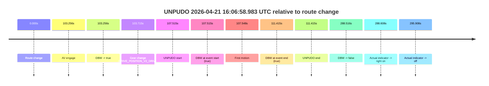

| Metric | Value |
|---|---|
| Outcome | `pass` |
| Effective failure type | `none` |
| Route change status | `found` |
| DBW at event start | `true` |
| DBW at event end | `true` |
| Predicted gear at AV start | `DRIVE_POSITION_V2_DRIVE` |
| Actual gear at AV start | `DRIVE_POSITION_V2_PARK` |
| Predicted gear at event start | `DRIVE_POSITION_V2_DRIVE` |
| Actual gear at event start | `DRIVE_POSITION_V2_DRIVE` |
| Planned indicator direction | `INDICATORS_STATE_V2_LEFT_ON` |
| Controller indicator direction | `INDICATORS_STATE_V2_LEFT_ON` |
| Actual indicator direction | `INDICATORS_STATE_V2_OFF` |
| Actual indicator at maneuver end | `INDICATORS_STATE_V2_OFF` |
| Driver accel help in AV | `false` |
| Driver accel help timestamp | `n/a` |
| Max accel pedal pct in AV | `0.0%` |
| Max brake pedal pct in AV | `30.0%` |
| Max speed mps in AV | `4.197` |
| Success timing baseline | `route change` |
| Route -> AV | `103.256s` |
| AV -> event start | `4.259s` |
| AV -> first motion | `4.292s` |
| Success baseline -> event start | `107.515s` |
| Success baseline -> first motion | `107.548s` |
| AV duration before disengagement | `185.261s` |
| Trajectory waypoint count | `37` |
| Driving-plan step count | `11` |

The scored portion starts from the AV-owned window, not from the pre-AV setup. Route-change search in the stopped pre-event segment was `found`, with the baseline therefore set to route change. At the event anchor the model predicts `DRIVE_POSITION_V2_DRIVE` and the actual gear is `DRIVE_POSITION_V2_DRIVE`. The effective model outcome is `pass` because `the credited unpudo stays AV-owned through the official unpudo window.`

### Resolution

| Field | Value |
|---|---|
| Final outcome | `pass` |
| Do we agree with this label? | `yes` |
| Source disengagement type | `none observed` |
| Resolved effective failure type | `none` |
| Confidence | `high` |

## unpudo 2026-04-21 16:14:34.133 UTC

| Field | Value |
|---|---|
| Model | `eel-teal-outspoken` |
| Author | `zak` |
| Run ID | `fme10003/2026-04-21--15-49-54--gen2-av-ad61770f-5e9c-472c-a44e-295c214bb63c` |
| Date | `2026-04-21` |
| Time (UTC) | `16:14:34.133` |
| Event type | `unpudo` |
| Disengagement type | `none observed` |
| Route change | `found` |
| Console | [run](https://console.sso.wayve.ai/run/fme10003/2026-04-21--15-49-54--gen2-av-ad61770f-5e9c-472c-a44e-295c214bb63c?id=&time-unixus=1776788074133297) |
| Foxglove | [segment](https://app.foxglove.dev/wayve-on-prem/p/prj_0dX18KZdVHg1fmmI/view?ds=foxglove-stream&ds.deviceName=fme10003&ds.start=2026-04-21T16%3A14%3A09.518254Z&ds.end=2026-04-21T16%3A15%3A00.633309Z&layoutId=lay_0e7VD4WIKDQGU73Y&time=2026-04-21T16%3A14%3A34.133297Z) |

### Event card: fail

- Fail: the credited unpudo does not stay AV-owned. The event window starts with DBW false, and the maneuver outcome lands outside a clean AV-owned segment.

| Event | Time (UTC) | Delta from route change |
|---|---:|---:|
| Route change | 2026-04-21 16:14:19.518 | `0.000s` |
| AV engage | 2026-04-21 16:14:19.523 | `0.006s` |
| DBW -> true | 2026-04-21 16:14:19.523 | `0.006s` |
| Gear change (DRIVE_POSITION_V2_REVERSE) | 2026-04-21 16:14:19.833 | `0.315s` |
| DBW -> false | 2026-04-21 16:14:28.004 | `8.486s` |
| UNPUDO start | 2026-04-21 16:14:34.133 | `14.615s` |
| DBW at event start (false) | 2026-04-21 16:14:34.133 | `14.615s` |
| DBW at event end (false) | 2026-04-21 16:14:50.633 | `31.115s` |
| UNPUDO end | 2026-04-21 16:14:50.633 | `31.115s` |

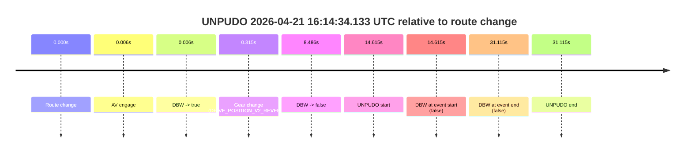

| Metric | Value |
|---|---|
| Outcome | `fail` |
| Effective failure type | `not_av_owned` |
| Route change status | `found` |
| DBW at event start | `false` |
| DBW at event end | `false` |
| Predicted gear at AV start | `DRIVE_POSITION_V2_PARK` |
| Actual gear at AV start | `DRIVE_POSITION_V2_PARK` |
| Predicted gear at event start | `DRIVE_POSITION_V2_REVERSE` |
| Actual gear at event start | `DRIVE_POSITION_V2_REVERSE` |
| Planned indicator direction | `INDICATORS_STATE_V2_OFF` |
| Controller indicator direction | `INDICATORS_STATE_V2_OFF` |
| Actual indicator direction | `INDICATORS_STATE_V2_OFF` |
| Actual indicator at maneuver end | `INDICATORS_STATE_V2_OFF` |
| Driver accel help in AV | `false` |
| Driver accel help timestamp | `n/a` |
| Max accel pedal pct in AV | `0.0%` |
| Max brake pedal pct in AV | `8.0%` |
| Max speed mps in AV | `0.000` |
| Success timing baseline | `route change` |
| Route -> AV | `0.006s` |
| AV -> event start | `14.609s` |
| AV -> first motion | `n/a` |
| Success baseline -> event start | `14.615s` |
| Success baseline -> first motion | `n/a` |
| AV duration before disengagement | `8.481s` |
| Trajectory waypoint count | `38` |
| Driving-plan step count | `11` |

The scored portion starts from the AV-owned window, not from the pre-AV setup. Route-change search in the stopped pre-event segment was `found`, with the baseline therefore set to route change. At the event anchor the model predicts `DRIVE_POSITION_V2_REVERSE` and the actual gear is `DRIVE_POSITION_V2_REVERSE`. The effective model outcome is `fail` because `not_av_owned.`

### Resolution

| Field | Value |
|---|---|
| Final outcome | `fail` |
| Do we agree with this label? | `yes` |
| Source disengagement type | `none observed` |
| Resolved effective failure type | `not_av_owned` |
| Confidence | `high` |

## unpudo 2026-04-21 16:24:59.483 UTC

| Field | Value |
|---|---|
| Model | `eel-teal-outspoken` |
| Author | `zak` |
| Run ID | `fme10003/2026-04-21--15-49-54--gen2-av-ad61770f-5e9c-472c-a44e-295c214bb63c` |
| Date | `2026-04-21` |
| Time (UTC) | `16:24:59.483` |
| Event type | `unpudo` |
| Disengagement type | `none observed` |
| Route change | `found` |
| Console | [run](https://console.sso.wayve.ai/run/fme10003/2026-04-21--15-49-54--gen2-av-ad61770f-5e9c-472c-a44e-295c214bb63c?id=&time-unixus=1776788699483312) |
| Foxglove | [segment](https://app.foxglove.dev/wayve-on-prem/p/prj_0dX18KZdVHg1fmmI/view?ds=foxglove-stream&ds.deviceName=fme10003&ds.start=2026-04-21T16%3A23%3A45.218342Z&ds.end=2026-04-21T16%3A26%3A08.024021Z&layoutId=lay_0e7VD4WIKDQGU73Y&time=2026-04-21T16%3A24%3A59.483312Z) |

### Event card: pass

- Pass: AV owns the credited unpudo from route change through the official unpudo window, the gear state is aligned at the anchor, and the vehicle moves without driver accelerator help in AV.

| Event | Time (UTC) | Delta from route change |
|---|---:|---:|
| Route change | 2026-04-21 16:23:55.218 | `0.000s` |
| AV engage | 2026-04-21 16:23:55.225 | `0.007s` |
| DBW -> true | 2026-04-21 16:23:55.225 | `0.007s` |
| First motion | 2026-04-21 16:23:55.235 | `0.018s` |
| Gear change (DRIVE_POSITION_V2_DRIVE) | 2026-04-21 16:24:55.633 | `60.415s` |
| UNPUDO start | 2026-04-21 16:24:59.483 | `64.265s` |
| DBW at event start (true) | 2026-04-21 16:24:59.483 | `64.265s` |
| DBW at event end (true) | 2026-04-21 16:25:03.633 | `68.415s` |
| UNPUDO end | 2026-04-21 16:25:03.633 | `68.415s` |
| DBW -> false | 2026-04-21 16:25:58.024 | `122.806s` |

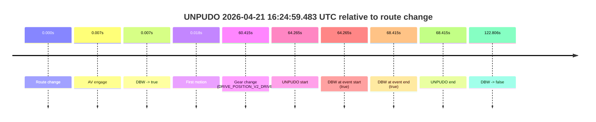

| Metric | Value |
|---|---|
| Outcome | `pass` |
| Effective failure type | `none` |
| Route change status | `found` |
| DBW at event start | `true` |
| DBW at event end | `true` |
| Predicted gear at AV start | `DRIVE_POSITION_V2_DRIVE` |
| Actual gear at AV start | `DRIVE_POSITION_V2_DRIVE` |
| Predicted gear at event start | `DRIVE_POSITION_V2_DRIVE` |
| Actual gear at event start | `DRIVE_POSITION_V2_DRIVE` |
| Planned indicator direction | `INDICATORS_STATE_V2_LEFT_ON` |
| Controller indicator direction | `INDICATORS_STATE_V2_LEFT_ON` |
| Actual indicator direction | `INDICATORS_STATE_V2_OFF` |
| Actual indicator at maneuver end | `INDICATORS_STATE_V2_OFF` |
| Driver accel help in AV | `false` |
| Driver accel help timestamp | `n/a` |
| Max accel pedal pct in AV | `0.0%` |
| Max brake pedal pct in AV | `16.4%` |
| Max speed mps in AV | `10.264` |
| Success timing baseline | `route change` |
| Route -> AV | `0.007s` |
| AV -> event start | `64.258s` |
| AV -> first motion | `0.010s` |
| Success baseline -> event start | `64.265s` |
| Success baseline -> first motion | `0.018s` |
| AV duration before disengagement | `122.799s` |
| Trajectory waypoint count | `37` |
| Driving-plan step count | `11` |

The scored portion starts from the AV-owned window, not from the pre-AV setup. Route-change search in the stopped pre-event segment was `found`, with the baseline therefore set to route change. At the event anchor the model predicts `DRIVE_POSITION_V2_DRIVE` and the actual gear is `DRIVE_POSITION_V2_DRIVE`. The effective model outcome is `pass` because `the credited unpudo stays AV-owned through the official unpudo window.`

### Resolution

| Field | Value |
|---|---|
| Final outcome | `pass` |
| Do we agree with this label? | `yes` |
| Source disengagement type | `none observed` |
| Resolved effective failure type | `none` |
| Confidence | `high` |

## unpudo 2026-04-21 16:29:13.183 UTC

| Field | Value |
|---|---|
| Model | `eel-teal-outspoken` |
| Author | `zak` |
| Run ID | `fme10003/2026-04-21--15-49-54--gen2-av-ad61770f-5e9c-472c-a44e-295c214bb63c` |
| Date | `2026-04-21` |
| Time (UTC) | `16:29:13.183` |
| Event type | `unpudo` |
| Disengagement type | `none observed` |
| Route change | `found` |
| Console | [run](https://console.sso.wayve.ai/run/fme10003/2026-04-21--15-49-54--gen2-av-ad61770f-5e9c-472c-a44e-295c214bb63c?id=&time-unixus=1776788953183291) |
| Foxglove | [segment](https://app.foxglove.dev/wayve-on-prem/p/prj_0dX18KZdVHg1fmmI/view?ds=foxglove-stream&ds.deviceName=fme10003&ds.start=2026-04-21T16%3A28%3A51.968242Z&ds.end=2026-04-21T16%3A30%3A51.403892Z&layoutId=lay_0e7VD4WIKDQGU73Y&time=2026-04-21T16%3A29%3A13.183291Z) |

### Event card: pass

- Pass: AV owns the credited unpudo from route change through the official unpudo window, the gear state is aligned at the anchor, and the vehicle moves without driver accelerator help in AV.

| Event | Time (UTC) | Delta from route change |
|---|---:|---:|
| Route change | 2026-04-21 16:29:01.968 | `0.000s` |
| AV engage | 2026-04-21 16:29:08.844 | `6.876s` |
| DBW -> true | 2026-04-21 16:29:08.844 | `6.876s` |
| Gear change (DRIVE_POSITION_V2_DRIVE) | 2026-04-21 16:29:09.283 | `7.315s` |
| UNPUDO start | 2026-04-21 16:29:13.183 | `11.215s` |
| DBW at event start (true) | 2026-04-21 16:29:13.183 | `11.215s` |
| First motion | 2026-04-21 16:29:13.236 | `11.268s` |
| DBW at event end (true) | 2026-04-21 16:29:18.083 | `16.115s` |
| UNPUDO end | 2026-04-21 16:29:18.083 | `16.115s` |
| DBW -> false | 2026-04-21 16:30:41.403 | `99.436s` |

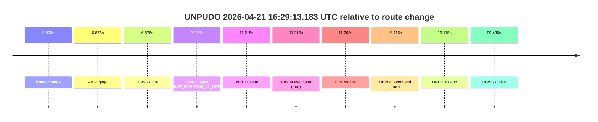

| Metric | Value |
|---|---|
| Outcome | `pass` |
| Effective failure type | `none` |
| Route change status | `found` |
| DBW at event start | `true` |
| DBW at event end | `true` |
| Predicted gear at AV start | `DRIVE_POSITION_V2_DRIVE` |
| Actual gear at AV start | `DRIVE_POSITION_V2_PARK` |
| Predicted gear at event start | `DRIVE_POSITION_V2_DRIVE` |
| Actual gear at event start | `DRIVE_POSITION_V2_DRIVE` |
| Planned indicator direction | `INDICATORS_STATE_V2_LEFT_ON` |
| Controller indicator direction | `INDICATORS_STATE_V2_LEFT_ON` |
| Actual indicator direction | `INDICATORS_STATE_V2_OFF` |
| Actual indicator at maneuver end | `INDICATORS_STATE_V2_OFF` |
| Driver accel help in AV | `false` |
| Driver accel help timestamp | `n/a` |
| Max accel pedal pct in AV | `0.0%` |
| Max brake pedal pct in AV | `28.5%` |
| Max speed mps in AV | `3.958` |
| Success timing baseline | `route change` |
| Route -> AV | `6.876s` |
| AV -> event start | `4.339s` |
| AV -> first motion | `4.392s` |
| Success baseline -> event start | `11.215s` |
| Success baseline -> first motion | `11.268s` |
| AV duration before disengagement | `92.560s` |
| Trajectory waypoint count | `37` |
| Driving-plan step count | `11` |

The scored portion starts from the AV-owned window, not from the pre-AV setup. Route-change search in the stopped pre-event segment was `found`, with the baseline therefore set to route change. At the event anchor the model predicts `DRIVE_POSITION_V2_DRIVE` and the actual gear is `DRIVE_POSITION_V2_DRIVE`. The effective model outcome is `pass` because `the credited unpudo stays AV-owned through the official unpudo window.`

### Resolution

| Field | Value |
|---|---|
| Final outcome | `pass` |
| Do we agree with this label? | `yes` |
| Source disengagement type | `none observed` |
| Resolved effective failure type | `none` |
| Confidence | `high` |

## unpudo 2026-04-21 16:31:24.183 UTC

| Field | Value |
|---|---|
| Model | `eel-teal-outspoken` |
| Author | `zak` |
| Run ID | `fme10003/2026-04-21--15-49-54--gen2-av-ad61770f-5e9c-472c-a44e-295c214bb63c` |
| Date | `2026-04-21` |
| Time (UTC) | `16:31:24.183` |
| Event type | `unpudo` |
| Disengagement type | `none observed` |
| Route change | `found` |
| Console | [run](https://console.sso.wayve.ai/run/fme10003/2026-04-21--15-49-54--gen2-av-ad61770f-5e9c-472c-a44e-295c214bb63c?id=&time-unixus=1776789084183306) |
| Foxglove | [segment](https://app.foxglove.dev/wayve-on-prem/p/prj_0dX18KZdVHg1fmmI/view?ds=foxglove-stream&ds.deviceName=fme10003&ds.start=2026-04-21T16%3A30%3A46.618548Z&ds.end=2026-04-21T16%3A31%3A39.133306Z&layoutId=lay_0e7VD4WIKDQGU73Y&time=2026-04-21T16%3A31%3A24.183306Z) |

### Event card: fail

- Fail: the credited unpudo does not stay AV-owned. The event window starts with DBW false, and the maneuver outcome lands outside a clean AV-owned segment.

| Event | Time (UTC) | Delta from route change |
|---|---:|---:|
| Route change | 2026-04-21 16:30:56.618 | `0.000s` |
| AV engage | 2026-04-21 16:31:08.044 | `11.426s` |
| DBW -> true | 2026-04-21 16:31:08.044 | `11.426s` |
| DBW -> false | 2026-04-21 16:31:18.844 | `22.226s` |
| Gear change (DRIVE_POSITION_V2_DRIVE) | 2026-04-21 16:31:20.033 | `23.415s` |
| Actual indicator -> left on | 2026-04-21 16:31:21.715 | `25.097s` |
| UNPUDO start | 2026-04-21 16:31:24.183 | `27.565s` |
| DBW at event start (false) | 2026-04-21 16:31:24.183 | `27.565s` |
| Actual indicator -> off | 2026-04-21 16:31:26.395 | `29.777s` |
| DBW at event end (false) | 2026-04-21 16:31:29.133 | `32.515s` |
| UNPUDO end | 2026-04-21 16:31:29.133 | `32.515s` |

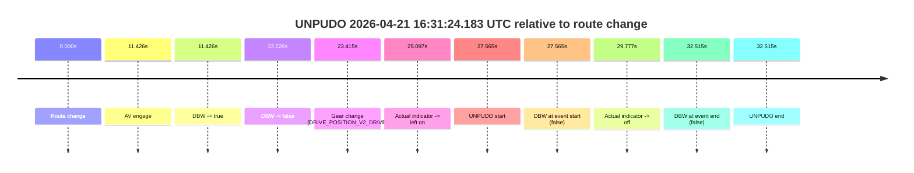

| Metric | Value |
|---|---|
| Outcome | `fail` |
| Effective failure type | `not_av_owned` |
| Route change status | `found` |
| DBW at event start | `false` |
| DBW at event end | `false` |
| Predicted gear at AV start | `DRIVE_POSITION_V2_DRIVE` |
| Actual gear at AV start | `DRIVE_POSITION_V2_PARK` |
| Predicted gear at event start | `DRIVE_POSITION_V2_DRIVE` |
| Actual gear at event start | `DRIVE_POSITION_V2_DRIVE` |
| Planned indicator direction | `INDICATORS_STATE_V2_LEFT_ON` |
| Controller indicator direction | `INDICATORS_STATE_V2_LEFT_ON` |
| Actual indicator direction | `INDICATORS_STATE_V2_LEFT_ON` |
| Actual indicator at maneuver end | `INDICATORS_STATE_V2_OFF` |
| Driver accel help in AV | `false` |
| Driver accel help timestamp | `n/a` |
| Max accel pedal pct in AV | `0.0%` |
| Max brake pedal pct in AV | `8.0%` |
| Max speed mps in AV | `0.000` |
| Success timing baseline | `route change` |
| Route -> AV | `11.426s` |
| AV -> event start | `16.139s` |
| AV -> first motion | `n/a` |
| Success baseline -> event start | `27.565s` |
| Success baseline -> first motion | `n/a` |
| AV duration before disengagement | `10.801s` |
| Trajectory waypoint count | `37` |
| Driving-plan step count | `11` |

The scored portion starts from the AV-owned window, not from the pre-AV setup. Route-change search in the stopped pre-event segment was `found`, with the baseline therefore set to route change. At the event anchor the model predicts `DRIVE_POSITION_V2_DRIVE` and the actual gear is `DRIVE_POSITION_V2_DRIVE`. The effective model outcome is `fail` because `not_av_owned.`

### Resolution

| Field | Value |
|---|---|
| Final outcome | `fail` |
| Do we agree with this label? | `yes` |
| Source disengagement type | `none observed` |
| Resolved effective failure type | `not_av_owned` |
| Confidence | `high` |

## unpudo 2026-04-21 16:42:38.683 UTC

| Field | Value |
|---|---|
| Model | `eel-teal-outspoken` |
| Author | `zak` |
| Run ID | `fme10003/2026-04-21--15-49-54--gen2-av-ad61770f-5e9c-472c-a44e-295c214bb63c` |
| Date | `2026-04-21` |
| Time (UTC) | `16:42:38.683` |
| Event type | `unpudo` |
| Disengagement type | `none observed` |
| Route change | `found` |
| Console | [run](https://console.sso.wayve.ai/run/fme10003/2026-04-21--15-49-54--gen2-av-ad61770f-5e9c-472c-a44e-295c214bb63c?id=&time-unixus=1776789758683312) |
| Foxglove | [segment](https://app.foxglove.dev/wayve-on-prem/p/prj_0dX18KZdVHg1fmmI/view?ds=foxglove-stream&ds.deviceName=fme10003&ds.start=2026-04-21T16%3A40%3A28.868338Z&ds.end=2026-04-21T16%3A43%3A17.533322Z&layoutId=lay_0e7VD4WIKDQGU73Y&time=2026-04-21T16%3A42%3A38.683312Z) |

### Event card: fail

- Fail: the credited unpudo does not stay AV-owned. The event window starts with DBW false, and the maneuver outcome lands outside a clean AV-owned segment.

| Event | Time (UTC) | Delta from route change |
|---|---:|---:|
| Route change | 2026-04-21 16:40:38.868 | `0.000s` |
| Actual indicator -> left on | 2026-04-21 16:41:18.495 | `39.628s` |
| First motion | 2026-04-21 16:41:23.415 | `44.548s` |
| Actual indicator -> off | 2026-04-21 16:41:25.955 | `47.088s` |
| Actual indicator -> left on | 2026-04-21 16:41:26.795 | `47.928s` |
| Actual indicator -> off | 2026-04-21 16:41:28.695 | `49.828s` |
| Actual indicator -> right on | 2026-04-21 16:41:30.555 | `51.688s` |
| Actual indicator -> off | 2026-04-21 16:41:31.475 | `52.608s` |
| Actual indicator -> right on | 2026-04-21 16:41:32.216 | `53.348s` |
| Actual indicator -> off | 2026-04-21 16:41:34.096 | `55.228s` |
| Actual indicator -> left on | 2026-04-21 16:41:35.356 | `56.488s` |
| Actual indicator -> off | 2026-04-21 16:41:37.655 | `58.788s` |
| Actual indicator -> right on | 2026-04-21 16:41:38.356 | `59.488s` |
| Actual indicator -> off | 2026-04-21 16:41:57.175 | `78.308s` |
| Actual indicator -> right on | 2026-04-21 16:42:04.956 | `86.088s` |
| Actual indicator -> off | 2026-04-21 16:42:09.955 | `91.088s` |
| AV engage | 2026-04-21 16:42:23.103 | `104.235s` |
| DBW -> true | 2026-04-21 16:42:23.103 | `104.235s` |
| Gear change (DRIVE_POSITION_V2_REVERSE) | 2026-04-21 16:42:23.633 | `104.765s` |
| DBW -> false | 2026-04-21 16:42:31.803 | `112.935s` |
| Actual indicator -> left on | 2026-04-21 16:42:38.615 | `119.748s` |
| UNPUDO start | 2026-04-21 16:42:38.683 | `119.815s` |
| DBW at event start (false) | 2026-04-21 16:42:38.683 | `119.815s` |
| Actual indicator -> off | 2026-04-21 16:42:47.775 | `128.908s` |
| DBW at event end (true) | 2026-04-21 16:43:07.533 | `148.665s` |
| UNPUDO end | 2026-04-21 16:43:07.533 | `148.665s` |

```mermaid
timeline
    title UNPUDO 2026-04-21 16:42:38.683 UTC relative to route change
    0.000s : Route change
    39.628s : Actual indicator -> left on
    44.548s : First motion
    47.088s : Actual indicator -> off
    47.928s : Actual indicator -> left on
    49.828s : Actual indicator -> off
    51.688s : Actual indicator -> right on
    52.608s : Actual indicator -> off
    53.348s : Actual indicator -> right on
    55.228s : Actual indicator -> off
    56.488s : Actual indicator -> left on
    58.788s : Actual indicator -> off
    59.488s : Actual indicator -> right on
    78.308s : Actual indicator -> off
    86.088s : Actual indicator -> right on
    91.088s : Actual indicator -> off
    104.235s : AV engage
    104.235s : DBW -> true
    104.765s : Gear change (DRIVE_POSITION_V2_REVERSE)
    112.935s : DBW -> false
    119.748s : Actual indicator -> left on
    119.815s : UNPUDO start
    119.815s : DBW at event start (false)
    128.908s : Actual indicator -> off
    148.665s : DBW at event end (true)
    148.665s : UNPUDO end
```

| Metric | Value |
|---|---|
| Outcome | `fail` |
| Effective failure type | `completed_outside_av` |
| Route change status | `found` |
| DBW at event start | `false` |
| DBW at event end | `true` |
| Predicted gear at AV start | `DRIVE_POSITION_V2_REVERSE` |
| Actual gear at AV start | `DRIVE_POSITION_V2_PARK` |
| Predicted gear at event start | `DRIVE_POSITION_V2_REVERSE` |
| Actual gear at event start | `DRIVE_POSITION_V2_REVERSE` |
| Planned indicator direction | `INDICATORS_STATE_V2_OFF` |
| Controller indicator direction | `INDICATORS_STATE_V2_OFF` |
| Actual indicator direction | `INDICATORS_STATE_V2_LEFT_ON` |
| Actual indicator at maneuver end | `INDICATORS_STATE_V2_OFF` |
| Driver accel help in AV | `false` |
| Driver accel help timestamp | `n/a` |
| Max accel pedal pct in AV | `0.0%` |
| Max brake pedal pct in AV | `28.2%` |
| Max speed mps in AV | `0.000` |
| Success timing baseline | `route change` |
| Route -> AV | `104.235s` |
| AV -> event start | `15.580s` |
| AV -> first motion | `-59.687s` |
| Success baseline -> event start | `119.815s` |
| Success baseline -> first motion | `44.548s` |
| AV duration before disengagement | `8.700s` |
| Trajectory waypoint count | `37` |
| Driving-plan step count | `11` |

The scored portion starts from the AV-owned window, not from the pre-AV setup. Route-change search in the stopped pre-event segment was `found`, with the baseline therefore set to route change. At the event anchor the model predicts `DRIVE_POSITION_V2_REVERSE` and the actual gear is `DRIVE_POSITION_V2_REVERSE`. The effective model outcome is `fail` because `completed_outside_av.`

### Resolution

| Field | Value |
|---|---|
| Final outcome | `fail` |
| Do we agree with this label? | `yes` |
| Source disengagement type | `none observed` |
| Resolved effective failure type | `completed_outside_av` |
| Confidence | `high` |

## unpudo 2026-04-21 16:54:17.233 UTC

| Field | Value |
|---|---|
| Model | `eel-teal-outspoken` |
| Author | `zak` |
| Run ID | `fme10003/2026-04-21--15-49-54--gen2-av-ad61770f-5e9c-472c-a44e-295c214bb63c` |
| Date | `2026-04-21` |
| Time (UTC) | `16:54:17.233` |
| Event type | `unpudo` |
| Disengagement type | `none observed` |
| Route change | `found` |
| Console | [run](https://console.sso.wayve.ai/run/fme10003/2026-04-21--15-49-54--gen2-av-ad61770f-5e9c-472c-a44e-295c214bb63c?id=&time-unixus=1776790457233308) |
| Foxglove | [segment](https://app.foxglove.dev/wayve-on-prem/p/prj_0dX18KZdVHg1fmmI/view?ds=foxglove-stream&ds.deviceName=fme10003&ds.start=2026-04-21T16%3A52%3A14.818261Z&ds.end=2026-04-21T16%3A54%3A48.083315Z&layoutId=lay_0e7VD4WIKDQGU73Y&time=2026-04-21T16%3A54%3A17.233308Z) |

### Event card: fail

- Fail: the credited unpudo does not stay AV-owned. The event window starts with DBW false, and the maneuver outcome lands outside a clean AV-owned segment.

| Event | Time (UTC) | Delta from route change |
|---|---:|---:|
| Route change | 2026-04-21 16:52:24.818 | `0.000s` |
| Actual indicator -> left on | 2026-04-21 16:52:47.816 | `22.998s` |
| First motion | 2026-04-21 16:52:51.195 | `26.378s` |
| Actual indicator -> off | 2026-04-21 16:52:52.476 | `27.658s` |
| AV engage | 2026-04-21 16:52:58.365 | `33.547s` |
| DBW -> true | 2026-04-21 16:52:58.365 | `33.547s` |
| DBW -> false | 2026-04-21 16:53:45.805 | `80.987s` |
| Gear change (DRIVE_POSITION_V2_REVERSE) | 2026-04-21 16:54:12.383 | `107.565s` |
| UNPUDO start | 2026-04-21 16:54:17.233 | `112.415s` |
| DBW at event start (false) | 2026-04-21 16:54:17.233 | `112.415s` |
| DBW at event end (true) | 2026-04-21 16:54:38.083 | `133.265s` |
| UNPUDO end | 2026-04-21 16:54:38.083 | `133.265s` |

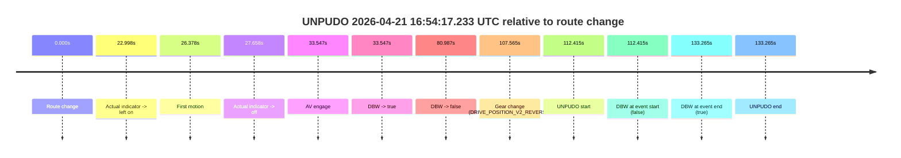

| Metric | Value |
|---|---|
| Outcome | `fail` |
| Effective failure type | `completed_outside_av` |
| Route change status | `found` |
| DBW at event start | `false` |
| DBW at event end | `true` |
| Predicted gear at AV start | `DRIVE_POSITION_V2_DRIVE` |
| Actual gear at AV start | `DRIVE_POSITION_V2_DRIVE` |
| Predicted gear at event start | `DRIVE_POSITION_V2_REVERSE` |
| Actual gear at event start | `DRIVE_POSITION_V2_REVERSE` |
| Planned indicator direction | `INDICATORS_STATE_V2_OFF` |
| Controller indicator direction | `INDICATORS_STATE_V2_OFF` |
| Actual indicator direction | `INDICATORS_STATE_V2_OFF` |
| Actual indicator at maneuver end | `INDICATORS_STATE_V2_OFF` |
| Driver accel help in AV | `false` |
| Driver accel help timestamp | `n/a` |
| Max accel pedal pct in AV | `0.0%` |
| Max brake pedal pct in AV | `12.8%` |
| Max speed mps in AV | `8.294` |
| Success timing baseline | `route change` |
| Route -> AV | `33.547s` |
| AV -> event start | `78.868s` |
| AV -> first motion | `-7.169s` |
| Success baseline -> event start | `112.415s` |
| Success baseline -> first motion | `26.378s` |
| AV duration before disengagement | `47.440s` |
| Trajectory waypoint count | `38` |
| Driving-plan step count | `11` |

The scored portion starts from the AV-owned window, not from the pre-AV setup. Route-change search in the stopped pre-event segment was `found`, with the baseline therefore set to route change. At the event anchor the model predicts `DRIVE_POSITION_V2_REVERSE` and the actual gear is `DRIVE_POSITION_V2_REVERSE`. The effective model outcome is `fail` because `completed_outside_av.`

### Resolution

| Field | Value |
|---|---|
| Final outcome | `fail` |
| Do we agree with this label? | `yes` |
| Source disengagement type | `none observed` |
| Resolved effective failure type | `completed_outside_av` |
| Confidence | `high` |

## unpudo 2026-04-21 16:58:19.233 UTC

| Field | Value |
|---|---|
| Model | `eel-teal-outspoken` |
| Author | `zak` |
| Run ID | `fme10003/2026-04-21--15-49-54--gen2-av-ad61770f-5e9c-472c-a44e-295c214bb63c` |
| Date | `2026-04-21` |
| Time (UTC) | `16:58:19.233` |
| Event type | `unpudo` |
| Disengagement type | `none observed` |
| Route change | `found` |
| Console | [run](https://console.sso.wayve.ai/run/fme10003/2026-04-21--15-49-54--gen2-av-ad61770f-5e9c-472c-a44e-295c214bb63c?id=&time-unixus=1776790699233297) |
| Foxglove | [segment](https://app.foxglove.dev/wayve-on-prem/p/prj_0dX18KZdVHg1fmmI/view?ds=foxglove-stream&ds.deviceName=fme10003&ds.start=2026-04-21T16%3A56%3A59.818262Z&ds.end=2026-04-21T16%3A59%3A37.304773Z&layoutId=lay_0e7VD4WIKDQGU73Y&time=2026-04-21T16%3A58%3A19.233297Z) |

### Event card: pass

- Pass: AV owns the credited unpudo from route change through the official unpudo window, the gear state is aligned at the anchor, and the vehicle moves without driver accelerator help in AV.

| Event | Time (UTC) | Delta from route change |
|---|---:|---:|
| Route change | 2026-04-21 16:57:09.818 | `0.000s` |
| First motion | 2026-04-21 16:57:09.835 | `0.018s` |
| Actual indicator -> right on | 2026-04-21 16:57:12.815 | `2.998s` |
| Actual indicator -> off | 2026-04-21 16:57:22.156 | `12.338s` |
| AV engage | 2026-04-21 16:58:13.164 | `63.346s` |
| DBW -> true | 2026-04-21 16:58:13.164 | `63.346s` |
| Gear change (DRIVE_POSITION_V2_DRIVE) | 2026-04-21 16:58:13.533 | `63.715s` |
| UNPUDO start | 2026-04-21 16:58:19.233 | `69.415s` |
| DBW at event start (true) | 2026-04-21 16:58:19.233 | `69.415s` |
| DBW at event end (true) | 2026-04-21 16:58:26.183 | `76.365s` |
| UNPUDO end | 2026-04-21 16:58:26.183 | `76.365s` |
| DBW -> false | 2026-04-21 16:59:27.304 | `137.487s` |

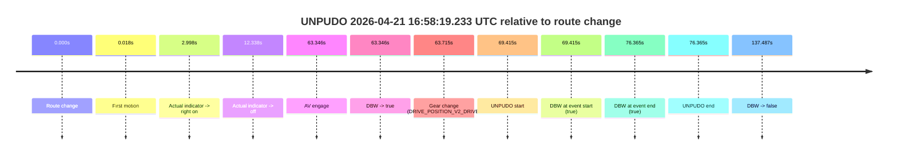

| Metric | Value |
|---|---|
| Outcome | `pass` |
| Effective failure type | `none` |
| Route change status | `found` |
| DBW at event start | `true` |
| DBW at event end | `true` |
| Predicted gear at AV start | `DRIVE_POSITION_V2_DRIVE` |
| Actual gear at AV start | `DRIVE_POSITION_V2_PARK` |
| Predicted gear at event start | `DRIVE_POSITION_V2_DRIVE` |
| Actual gear at event start | `DRIVE_POSITION_V2_DRIVE` |
| Planned indicator direction | `INDICATORS_STATE_V2_LEFT_ON` |
| Controller indicator direction | `INDICATORS_STATE_V2_LEFT_ON` |
| Actual indicator direction | `INDICATORS_STATE_V2_OFF` |
| Actual indicator at maneuver end | `INDICATORS_STATE_V2_OFF` |
| Driver accel help in AV | `false` |
| Driver accel help timestamp | `n/a` |
| Max accel pedal pct in AV | `0.0%` |
| Max brake pedal pct in AV | `8.0%` |
| Max speed mps in AV | `2.608` |
| Success timing baseline | `route change` |
| Route -> AV | `63.346s` |
| AV -> event start | `6.069s` |
| AV -> first motion | `-63.328s` |
| Success baseline -> event start | `69.415s` |
| Success baseline -> first motion | `0.018s` |
| AV duration before disengagement | `74.141s` |
| Trajectory waypoint count | `38` |
| Driving-plan step count | `11` |

The scored portion starts from the AV-owned window, not from the pre-AV setup. Route-change search in the stopped pre-event segment was `found`, with the baseline therefore set to route change. At the event anchor the model predicts `DRIVE_POSITION_V2_DRIVE` and the actual gear is `DRIVE_POSITION_V2_DRIVE`. The effective model outcome is `pass` because `the credited unpudo stays AV-owned through the official unpudo window.`

### Resolution

| Field | Value |
|---|---|
| Final outcome | `pass` |
| Do we agree with this label? | `yes` |
| Source disengagement type | `none observed` |
| Resolved effective failure type | `none` |
| Confidence | `high` |

## unpudo 2026-04-21 17:17:44.883 UTC

| Field | Value |
|---|---|
| Model | `eel-teal-outspoken` |
| Author | `zak` |
| Run ID | `fme10003/2026-04-21--15-49-54--gen2-av-ad61770f-5e9c-472c-a44e-295c214bb63c` |
| Date | `2026-04-21` |
| Time (UTC) | `17:17:44.883` |
| Event type | `unpudo` |
| Disengagement type | `none observed` |
| Route change | `found` |
| Console | [run](https://console.sso.wayve.ai/run/fme10003/2026-04-21--15-49-54--gen2-av-ad61770f-5e9c-472c-a44e-295c214bb63c?id=&time-unixus=1776791864883315) |
| Foxglove | [segment](https://app.foxglove.dev/wayve-on-prem/p/prj_0dX18KZdVHg1fmmI/view?ds=foxglove-stream&ds.deviceName=fme10003&ds.start=2026-04-21T17%3A16%3A01.168413Z&ds.end=2026-04-21T17%3A18%3A17.924638Z&layoutId=lay_0e7VD4WIKDQGU73Y&time=2026-04-21T17%3A17%3A44.883315Z) |

### Event card: pass

- Pass: AV owns the credited unpudo from route change through the official unpudo window, the gear state is aligned at the anchor, and the vehicle moves without driver accelerator help in AV.

| Event | Time (UTC) | Delta from route change |
|---|---:|---:|
| Route change | 2026-04-21 17:16:11.168 | `0.000s` |
| Actual indicator -> left on | 2026-04-21 17:16:30.875 | `19.707s` |
| First motion | 2026-04-21 17:16:34.296 | `23.128s` |
| Actual indicator -> off | 2026-04-21 17:16:38.116 | `26.948s` |
| AV engage | 2026-04-21 17:16:47.345 | `36.177s` |
| DBW -> true | 2026-04-21 17:16:47.345 | `36.177s` |
| Gear change (DRIVE_POSITION_V2_DRIVE) | 2026-04-21 17:17:41.333 | `90.165s` |
| UNPUDO start | 2026-04-21 17:17:44.883 | `93.715s` |
| DBW at event start (true) | 2026-04-21 17:17:44.883 | `93.715s` |
| DBW at event end (true) | 2026-04-21 17:17:48.483 | `97.315s` |
| UNPUDO end | 2026-04-21 17:17:48.483 | `97.315s` |
| DBW -> false | 2026-04-21 17:18:07.924 | `116.756s` |
| Actual indicator -> left on | 2026-04-21 17:18:22.195 | `131.027s` |

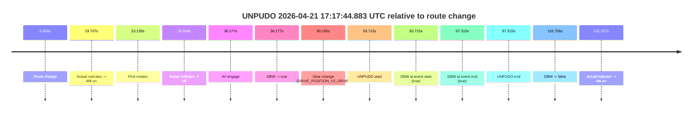

| Metric | Value |
|---|---|
| Outcome | `pass` |
| Effective failure type | `none` |
| Route change status | `found` |
| DBW at event start | `true` |
| DBW at event end | `true` |
| Predicted gear at AV start | `DRIVE_POSITION_V2_DRIVE` |
| Actual gear at AV start | `DRIVE_POSITION_V2_DRIVE` |
| Predicted gear at event start | `DRIVE_POSITION_V2_DRIVE` |
| Actual gear at event start | `DRIVE_POSITION_V2_DRIVE` |
| Planned indicator direction | `INDICATORS_STATE_V2_OFF` |
| Controller indicator direction | `INDICATORS_STATE_V2_LEFT_ON` |
| Actual indicator direction | `INDICATORS_STATE_V2_OFF` |
| Actual indicator at maneuver end | `INDICATORS_STATE_V2_OFF` |
| Driver accel help in AV | `false` |
| Driver accel help timestamp | `n/a` |
| Max accel pedal pct in AV | `0.0%` |
| Max brake pedal pct in AV | `8.2%` |
| Max speed mps in AV | `5.386` |
| Success timing baseline | `route change` |
| Route -> AV | `36.177s` |
| AV -> event start | `57.538s` |
| AV -> first motion | `-13.049s` |
| Success baseline -> event start | `93.715s` |
| Success baseline -> first motion | `23.128s` |
| AV duration before disengagement | `80.580s` |
| Trajectory waypoint count | `37` |
| Driving-plan step count | `11` |

The scored portion starts from the AV-owned window, not from the pre-AV setup. Route-change search in the stopped pre-event segment was `found`, with the baseline therefore set to route change. At the event anchor the model predicts `DRIVE_POSITION_V2_DRIVE` and the actual gear is `DRIVE_POSITION_V2_DRIVE`. The effective model outcome is `pass` because `the credited unpudo stays AV-owned through the official unpudo window.`

### Resolution

| Field | Value |
|---|---|
| Final outcome | `pass` |
| Do we agree with this label? | `yes` |
| Source disengagement type | `none observed` |
| Resolved effective failure type | `none` |
| Confidence | `high` |

## unpudo 2026-04-21 17:24:18.033 UTC

| Field | Value |
|---|---|
| Model | `eel-teal-outspoken` |
| Author | `zak` |
| Run ID | `fme10003/2026-04-21--15-49-54--gen2-av-ad61770f-5e9c-472c-a44e-295c214bb63c` |
| Date | `2026-04-21` |
| Time (UTC) | `17:24:18.033` |
| Event type | `unpudo` |
| Disengagement type | `none observed` |
| Route change | `not found` |
| Console | [run](https://console.sso.wayve.ai/run/fme10003/2026-04-21--15-49-54--gen2-av-ad61770f-5e9c-472c-a44e-295c214bb63c?id=&time-unixus=1776792258033299) |
| Foxglove | [segment](https://app.foxglove.dev/wayve-on-prem/p/prj_0dX18KZdVHg1fmmI/view?ds=foxglove-stream&ds.deviceName=fme10003&ds.start=2026-04-21T17%3A23%3A56.783250Z&ds.end=2026-04-21T17%3A25%3A01.283304Z&layoutId=lay_0e7VD4WIKDQGU73Y&time=2026-04-21T17%3A24%3A18.033299Z) |

### Event card: fail

- Fail: the credited unpudo does not stay AV-owned. The event window starts with DBW false, and the maneuver outcome lands outside a clean AV-owned segment.

| Event | Time (UTC) | Delta from AV start |
|---|---:|---:|
| Route change not recovered | 2026-04-21 17:24:06.783 | `0.000s` |
| AV engage | 2026-04-21 17:24:06.783 | `0.000s` |
| DBW -> true | 2026-04-21 17:24:06.783 | `0.000s` |
| Gear change (DRIVE_POSITION_V2_REVERSE) | 2026-04-21 17:24:07.283 | `0.500s` |
| DBW -> false | 2026-04-21 17:24:14.504 | `7.721s` |
| UNPUDO start | 2026-04-21 17:24:18.033 | `11.250s` |
| DBW at event start (false) | 2026-04-21 17:24:18.033 | `11.250s` |
| DBW at event end (true) | 2026-04-21 17:24:51.283 | `44.500s` |
| UNPUDO end | 2026-04-21 17:24:51.283 | `44.500s` |

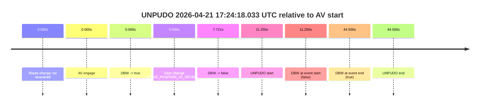

| Metric | Value |
|---|---|
| Outcome | `fail` |
| Effective failure type | `not_av_owned` |
| Route change status | `not found` |
| DBW at event start | `false` |
| DBW at event end | `true` |
| Predicted gear at AV start | `DRIVE_POSITION_V2_REVERSE` |
| Actual gear at AV start | `DRIVE_POSITION_V2_PARK` |
| Predicted gear at event start | `DRIVE_POSITION_V2_REVERSE` |
| Actual gear at event start | `DRIVE_POSITION_V2_REVERSE` |
| Planned indicator direction | `INDICATORS_STATE_V2_OFF` |
| Controller indicator direction | `INDICATORS_STATE_V2_OFF` |
| Actual indicator direction | `INDICATORS_STATE_V2_OFF` |
| Actual indicator at maneuver end | `INDICATORS_STATE_V2_OFF` |
| Driver accel help in AV | `false` |
| Driver accel help timestamp | `n/a` |
| Max accel pedal pct in AV | `0.0%` |
| Max brake pedal pct in AV | `9.1%` |
| Max speed mps in AV | `0.000` |
| Success timing baseline | `AV start` |
| Route -> AV | `n/a` |
| AV -> event start | `11.250s` |
| AV -> first motion | `n/a` |
| Success baseline -> event start | `11.250s` |
| Success baseline -> first motion | `n/a` |
| AV duration before disengagement | `7.721s` |
| Trajectory waypoint count | `38` |
| Driving-plan step count | `11` |

The scored portion starts from the AV-owned window, not from the pre-AV setup. Route-change search in the stopped pre-event segment was `not found`, with the baseline therefore set to AV start. At the event anchor the model predicts `DRIVE_POSITION_V2_REVERSE` and the actual gear is `DRIVE_POSITION_V2_REVERSE`. The effective model outcome is `fail` because `not_av_owned.`

### Resolution

| Field | Value |
|---|---|
| Final outcome | `fail` |
| Do we agree with this label? | `yes` |
| Source disengagement type | `none observed` |
| Resolved effective failure type | `not_av_owned` |
| Confidence | `high` |

## unpudo 2026-04-21 17:35:13.233 UTC

| Field | Value |
|---|---|
| Model | `eel-teal-outspoken` |
| Author | `zak` |
| Run ID | `fme10003/2026-04-21--15-49-54--gen2-av-ad61770f-5e9c-472c-a44e-295c214bb63c` |
| Date | `2026-04-21` |
| Time (UTC) | `17:35:13.233` |
| Event type | `unpudo` |
| Disengagement type | `none observed` |
| Route change | `found` |
| Console | [run](https://console.sso.wayve.ai/run/fme10003/2026-04-21--15-49-54--gen2-av-ad61770f-5e9c-472c-a44e-295c214bb63c?id=&time-unixus=1776792913233321) |
| Foxglove | [segment](https://app.foxglove.dev/wayve-on-prem/p/prj_0dX18KZdVHg1fmmI/view?ds=foxglove-stream&ds.deviceName=fme10003&ds.start=2026-04-21T17%3A34%3A52.618338Z&ds.end=2026-04-21T17%3A36%3A28.933322Z&layoutId=lay_0e7VD4WIKDQGU73Y&time=2026-04-21T17%3A35%3A13.233321Z) |

### Event card: fail

- Fail: the credited unpudo does not stay AV-owned. The event window starts with DBW true, and the maneuver outcome lands outside a clean AV-owned segment.

| Event | Time (UTC) | Delta from route change |
|---|---:|---:|
| Route change | 2026-04-21 17:35:02.618 | `0.000s` |
| AV engage | 2026-04-21 17:35:08.444 | `5.826s` |
| DBW -> true | 2026-04-21 17:35:08.444 | `5.826s` |
| Gear change (DRIVE_POSITION_V2_DRIVE) | 2026-04-21 17:35:08.883 | `6.265s` |
| UNPUDO start | 2026-04-21 17:35:13.233 | `10.615s` |
| DBW at event start (true) | 2026-04-21 17:35:13.233 | `10.615s` |
| First motion | 2026-04-21 17:35:13.376 | `10.758s` |
| DBW -> false | 2026-04-21 17:35:32.405 | `29.787s` |
| Actual indicator -> right on | 2026-04-21 17:35:40.655 | `38.038s` |
| Actual indicator -> off | 2026-04-21 17:35:47.735 | `45.118s` |
| Actual indicator -> right on | 2026-04-21 17:35:48.676 | `46.058s` |
| Actual indicator -> off | 2026-04-21 17:35:52.876 | `50.258s` |
| Actual indicator -> right on | 2026-04-21 17:35:53.195 | `50.578s` |
| DBW at event end (false) | 2026-04-21 17:36:18.933 | `76.315s` |
| UNPUDO end | 2026-04-21 17:36:18.933 | `76.315s` |
| Actual indicator -> off | 2026-04-21 17:36:18.975 | `76.358s` |
| Actual indicator -> left on | 2026-04-21 17:36:38.036 | `95.418s` |

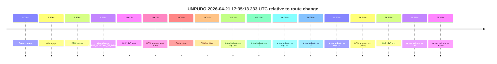

| Metric | Value |
|---|---|
| Outcome | `fail` |
| Effective failure type | `driver_completed_maneuver` |
| Route change status | `found` |
| DBW at event start | `true` |
| DBW at event end | `false` |
| Predicted gear at AV start | `DRIVE_POSITION_V2_DRIVE` |
| Actual gear at AV start | `DRIVE_POSITION_V2_PARK` |
| Predicted gear at event start | `DRIVE_POSITION_V2_DRIVE` |
| Actual gear at event start | `DRIVE_POSITION_V2_DRIVE` |
| Planned indicator direction | `INDICATORS_STATE_V2_OFF` |
| Controller indicator direction | `INDICATORS_STATE_V2_OFF` |
| Actual indicator direction | `INDICATORS_STATE_V2_OFF` |
| Actual indicator at maneuver end | `INDICATORS_STATE_V2_RIGHT_ON` |
| Driver accel help in AV | `false` |
| Driver accel help timestamp | `n/a` |
| Max accel pedal pct in AV | `0.0%` |
| Max brake pedal pct in AV | `24.6%` |
| Max speed mps in AV | `1.422` |
| Success timing baseline | `route change` |
| Route -> AV | `5.826s` |
| AV -> event start | `4.789s` |
| AV -> first motion | `4.932s` |
| Success baseline -> event start | `10.615s` |
| Success baseline -> first motion | `10.758s` |
| AV duration before disengagement | `23.962s` |
| Trajectory waypoint count | `38` |
| Driving-plan step count | `11` |

The scored portion starts from the AV-owned window, not from the pre-AV setup. Route-change search in the stopped pre-event segment was `found`, with the baseline therefore set to route change. At the event anchor the model predicts `DRIVE_POSITION_V2_DRIVE` and the actual gear is `DRIVE_POSITION_V2_DRIVE`. The effective model outcome is `fail` because `driver_completed_maneuver.`

### Resolution

| Field | Value |
|---|---|
| Final outcome | `fail` |
| Do we agree with this label? | `yes` |
| Source disengagement type | `none observed` |
| Resolved effective failure type | `driver_completed_maneuver` |
| Confidence | `high` |
