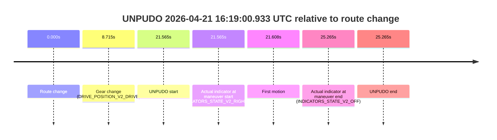
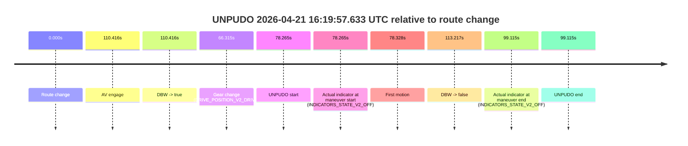
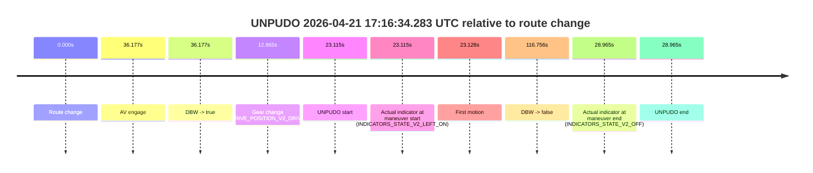
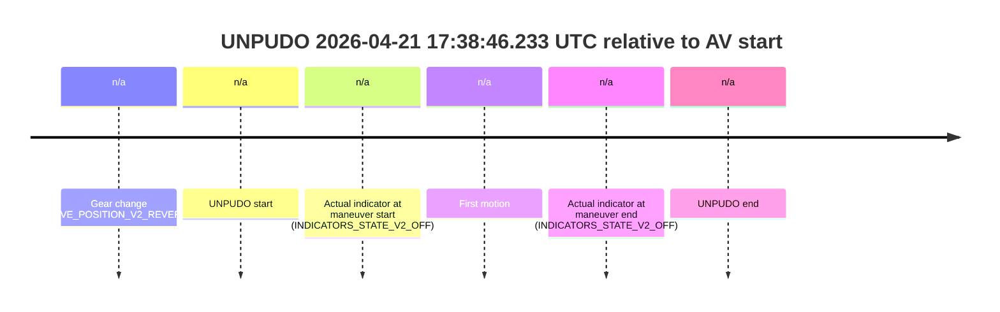

# Run Report: fme10003/2026-04-21--15-49-54--gen2-av-ad61770f-5e9c-472c-a44e-295c214bb63c

| Field | Value |
|---|---|
| Run ID | `fme10003/2026-04-21--15-49-54--gen2-av-ad61770f-5e9c-472c-a44e-295c214bb63c` |
| Date | `2026-04-21` |
| Model(s) | `pink-manta-ray-smooth` |
| Author | `guy.geva` |
| Event count | `11` |

## unpudo 2026-04-21 16:00:00.233 UTC

| Field | Value |
|---|---|
| Model | `pink-manta-ray-smooth` |
| Author | `guy.geva` |
| Run ID | `fme10003/2026-04-21--15-49-54--gen2-av-ad61770f-5e9c-472c-a44e-295c214bb63c` |
| Date | `2026-04-21` |
| Time (UTC) | `16:00:00.233` |
| Event type | `unpudo` |
| Disengagement type | `none observed` |
| Route change | `found` |
| Console | [run](https://console.sso.wayve.ai/run/fme10003/2026-04-21--15-49-54--gen2-av-ad61770f-5e9c-472c-a44e-295c214bb63c?id=&time-unixus=1776787200233292) |
| Foxglove | [segment](https://app.foxglove.dev/wayve-on-prem/p/prj_0dX18KZdVHg1fmmI/view?ds=foxglove-stream&ds.deviceName=fme10003&ds.start=2026-04-21T15%3A59%3A38.618319Z&ds.end=2026-04-21T16%3A01%3A22.245163Z&layoutId=lay_0e7VD4WIKDQGU73Y&time=2026-04-21T16%3A00%3A00.233292Z) |

### Event card: accidental

- Accidental: AV ownership is present for less than `2s`, so this is treated as an accidental brush with the maneuver rather than a meaningful model attempt.

| Event | Time (UTC) | Delta from route change |
|---|---:|---:|
| Route change | 2026-04-21 15:59:48.618 | `0.000s` |
| AV engage | 2026-04-21 16:00:09.465 | `20.847s` |
| DBW -> true | 2026-04-21 16:00:09.465 | `20.847s` |
| Gear change (DRIVE_POSITION_V2_DRIVE) | 2026-04-21 15:59:48.883 | `0.265s` |
| UNPUDO start | 2026-04-21 16:00:00.233 | `11.615s` |
| Actual indicator at maneuver start (INDICATORS_STATE_V2_LEFT_ON) | 2026-04-21 16:00:00.233 | `11.615s` |
| First motion | 2026-04-21 16:00:00.375 | `11.758s` |
| DBW -> false | 2026-04-21 16:01:12.245 | `83.627s` |
| Actual indicator at maneuver end (INDICATORS_STATE_V2_OFF) | 2026-04-21 16:00:05.533 | `16.915s` |
| UNPUDO end | 2026-04-21 16:00:05.533 | `16.915s` |

| Metric | Value |
|---|---|
| Outcome | `accidental` |
| Effective failure type | `none` |
| Route change status | `found` |
| DBW at event start | `false` |
| DBW at event end | `false` |
| Predicted gear at AV start | `DRIVE_POSITION_V2_DRIVE` |
| Actual gear at AV start | `DRIVE_POSITION_V2_DRIVE` |
| Predicted gear at event start | `DRIVE_POSITION_V2_DRIVE` |
| Actual gear at event start | `DRIVE_POSITION_V2_DRIVE` |
| Planned indicator direction | `INDICATORS_STATE_V2_LEFT_ON` |
| Controller indicator direction | `INDICATORS_STATE_V2_LEFT_ON` |
| Actual indicator direction | `INDICATORS_STATE_V2_LEFT_ON` |
| Actual indicator at maneuver end | `INDICATORS_STATE_V2_OFF` |
| Driver accel help in AV | `false` |
| Driver accel help timestamp | `n/a` |
| Max accel pedal pct in AV | `0.0%` |
| Max brake pedal pct in AV | `0.0%` |
| Max speed mps in AV | `0.000` |
| Route -> AV | `20.847s` |
| AV -> event start | `-9.232s` |
| AV -> first motion | `-9.089s` |
| AV duration before disengagement | `62.780s` |
| Trajectory waypoint count | `38` |
| Driving-plan step count | `11` |

The scored portion starts from the AV-owned window, not from the pre-AV setup. Route-change search in the stopped pre-event segment was `found`, with the baseline therefore set to route change. At the event anchor the model predicts `DRIVE_POSITION_V2_DRIVE` and the actual gear is `DRIVE_POSITION_V2_DRIVE`. The effective model outcome is `accidental` because `the AV-owned portion is shorter than 2s`.

### Resolution

| Field | Value |
|---|---|
| Final outcome | `accidental` |
| Do we agree with this label? | `yes` |
| Source disengagement type | `none observed` |
| Resolved effective failure type | `none` |
| Confidence | `high` |

## unpudo 2026-04-21 16:01:53.583 UTC

| Field | Value |
|---|---|
| Model | `pink-manta-ray-smooth` |
| Author | `guy.geva` |
| Run ID | `fme10003/2026-04-21--15-49-54--gen2-av-ad61770f-5e9c-472c-a44e-295c214bb63c` |
| Date | `2026-04-21` |
| Time (UTC) | `16:01:53.583` |
| Event type | `unpudo` |
| Disengagement type | `none observed` |
| Route change | `found` |
| Console | [run](https://console.sso.wayve.ai/run/fme10003/2026-04-21--15-49-54--gen2-av-ad61770f-5e9c-472c-a44e-295c214bb63c?id=&time-unixus=1776787313583311) |
| Foxglove | [segment](https://app.foxglove.dev/wayve-on-prem/p/prj_0dX18KZdVHg1fmmI/view?ds=foxglove-stream&ds.deviceName=fme10003&ds.start=2026-04-21T16%3A01%3A22.968233Z&ds.end=2026-04-21T16%3A02%3A38.124115Z&layoutId=lay_0e7VD4WIKDQGU73Y&time=2026-04-21T16%3A01%3A53.583311Z) |

### Event card: accidental

- Accidental: AV ownership is present for less than `2s`, so this is treated as an accidental brush with the maneuver rather than a meaningful model attempt.

| Event | Time (UTC) | Delta from route change |
|---|---:|---:|
| Route change | 2026-04-21 16:01:32.968 | `0.000s` |
| AV engage | 2026-04-21 16:02:07.563 | `34.596s` |
| DBW -> true | 2026-04-21 16:02:07.563 | `34.596s` |
| Gear change (DRIVE_POSITION_V2_DRIVE) | 2026-04-21 16:01:41.483 | `8.515s` |
| UNPUDO start | 2026-04-21 16:01:53.583 | `20.615s` |
| Actual indicator at maneuver start (INDICATORS_STATE_V2_LEFT_ON) | 2026-04-21 16:01:53.583 | `20.615s` |
| First motion | 2026-04-21 16:01:53.636 | `20.668s` |
| DBW -> false | 2026-04-21 16:02:28.124 | `55.156s` |
| Actual indicator at maneuver end (INDICATORS_STATE_V2_OFF) | 2026-04-21 16:01:58.333 | `25.365s` |
| UNPUDO end | 2026-04-21 16:01:58.333 | `25.365s` |

| Metric | Value |
|---|---|
| Outcome | `accidental` |
| Effective failure type | `none` |
| Route change status | `found` |
| DBW at event start | `false` |
| DBW at event end | `false` |
| Predicted gear at AV start | `DRIVE_POSITION_V2_DRIVE` |
| Actual gear at AV start | `DRIVE_POSITION_V2_DRIVE` |
| Predicted gear at event start | `DRIVE_POSITION_V2_DRIVE` |
| Actual gear at event start | `DRIVE_POSITION_V2_DRIVE` |
| Planned indicator direction | `INDICATORS_STATE_V2_RIGHT_ON` |
| Controller indicator direction | `INDICATORS_STATE_V2_RIGHT_ON` |
| Actual indicator direction | `INDICATORS_STATE_V2_LEFT_ON` |
| Actual indicator at maneuver end | `INDICATORS_STATE_V2_OFF` |
| Driver accel help in AV | `false` |
| Driver accel help timestamp | `n/a` |
| Max accel pedal pct in AV | `0.0%` |
| Max brake pedal pct in AV | `0.0%` |
| Max speed mps in AV | `0.000` |
| Route -> AV | `34.596s` |
| AV -> event start | `-13.981s` |
| AV -> first motion | `-13.928s` |
| AV duration before disengagement | `20.560s` |
| Trajectory waypoint count | `37` |
| Driving-plan step count | `11` |

The scored portion starts from the AV-owned window, not from the pre-AV setup. Route-change search in the stopped pre-event segment was `found`, with the baseline therefore set to route change. At the event anchor the model predicts `DRIVE_POSITION_V2_DRIVE` and the actual gear is `DRIVE_POSITION_V2_DRIVE`. The effective model outcome is `accidental` because `the AV-owned portion is shorter than 2s`.

### Resolution

| Field | Value |
|---|---|
| Final outcome | `accidental` |
| Do we agree with this label? | `yes` |
| Source disengagement type | `none observed` |
| Resolved effective failure type | `none` |
| Confidence | `high` |

## unpudo 2026-04-21 16:03:07.483 UTC

| Field | Value |
|---|---|
| Model | `pink-manta-ray-smooth` |
| Author | `guy.geva` |
| Run ID | `fme10003/2026-04-21--15-49-54--gen2-av-ad61770f-5e9c-472c-a44e-295c214bb63c` |
| Date | `2026-04-21` |
| Time (UTC) | `16:03:07.483` |
| Event type | `unpudo` |
| Disengagement type | `none observed` |
| Route change | `found` |
| Console | [run](https://console.sso.wayve.ai/run/fme10003/2026-04-21--15-49-54--gen2-av-ad61770f-5e9c-472c-a44e-295c214bb63c?id=&time-unixus=1776787387483316) |
| Foxglove | [segment](https://app.foxglove.dev/wayve-on-prem/p/prj_0dX18KZdVHg1fmmI/view?ds=foxglove-stream&ds.deviceName=fme10003&ds.start=2026-04-21T16%3A01%3A22.968233Z&ds.end=2026-04-21T16%3A04%3A14.084362Z&layoutId=lay_0e7VD4WIKDQGU73Y&time=2026-04-21T16%3A03%3A07.483316Z) |

### Event card: accidental

- Accidental: AV ownership is present for less than `2s`, so this is treated as an accidental brush with the maneuver rather than a meaningful model attempt.

| Event | Time (UTC) | Delta from route change |
|---|---:|---:|
| Route change | 2026-04-21 16:01:32.968 | `0.000s` |
| AV engage | 2026-04-21 16:03:16.023 | `103.056s` |
| DBW -> true | 2026-04-21 16:03:16.023 | `103.056s` |
| Gear change (DRIVE_POSITION_V2_DRIVE) | 2026-04-21 16:02:53.783 | `80.815s` |
| UNPUDO start | 2026-04-21 16:03:07.483 | `94.515s` |
| Actual indicator at maneuver start (INDICATORS_STATE_V2_LEFT_ON) | 2026-04-21 16:03:07.483 | `94.515s` |
| First motion | 2026-04-21 16:03:07.556 | `94.588s` |
| DBW -> false | 2026-04-21 16:04:04.084 | `151.116s` |
| Actual indicator at maneuver end (INDICATORS_STATE_V2_LEFT_ON) | 2026-04-21 16:03:17.683 | `104.715s` |
| UNPUDO end | 2026-04-21 16:03:17.683 | `104.715s` |

| Metric | Value |
|---|---|
| Outcome | `accidental` |
| Effective failure type | `none` |
| Route change status | `found` |
| DBW at event start | `false` |
| DBW at event end | `true` |
| Predicted gear at AV start | `DRIVE_POSITION_V2_DRIVE` |
| Actual gear at AV start | `DRIVE_POSITION_V2_DRIVE` |
| Predicted gear at event start | `DRIVE_POSITION_V2_DRIVE` |
| Actual gear at event start | `DRIVE_POSITION_V2_DRIVE` |
| Planned indicator direction | `INDICATORS_STATE_V2_LEFT_ON` |
| Controller indicator direction | `INDICATORS_STATE_V2_LEFT_ON` |
| Actual indicator direction | `INDICATORS_STATE_V2_LEFT_ON` |
| Actual indicator at maneuver end | `INDICATORS_STATE_V2_LEFT_ON` |
| Driver accel help in AV | `false` |
| Driver accel help timestamp | `n/a` |
| Max accel pedal pct in AV | `0.0%` |
| Max brake pedal pct in AV | `0.0%` |
| Max speed mps in AV | `2.314` |
| Route -> AV | `103.056s` |
| AV -> event start | `-8.541s` |
| AV -> first motion | `-8.468s` |
| AV duration before disengagement | `48.060s` |
| Trajectory waypoint count | `37` |
| Driving-plan step count | `11` |

The scored portion starts from the AV-owned window, not from the pre-AV setup. Route-change search in the stopped pre-event segment was `found`, with the baseline therefore set to route change. At the event anchor the model predicts `DRIVE_POSITION_V2_DRIVE` and the actual gear is `DRIVE_POSITION_V2_DRIVE`. The effective model outcome is `accidental` because `the AV-owned portion is shorter than 2s`.

### Resolution

| Field | Value |
|---|---|
| Final outcome | `accidental` |
| Do we agree with this label? | `yes` |
| Source disengagement type | `none observed` |
| Resolved effective failure type | `none` |
| Confidence | `high` |

## unpudo 2026-04-21 16:19:00.933 UTC

| Field | Value |
|---|---|
| Model | `pink-manta-ray-smooth` |
| Author | `guy.geva` |
| Run ID | `fme10003/2026-04-21--15-49-54--gen2-av-ad61770f-5e9c-472c-a44e-295c214bb63c` |
| Date | `2026-04-21` |
| Time (UTC) | `16:19:00.933` |
| Event type | `unpudo` |
| Disengagement type | `none observed` |
| Route change | `found` |
| Console | [run](https://console.sso.wayve.ai/run/fme10003/2026-04-21--15-49-54--gen2-av-ad61770f-5e9c-472c-a44e-295c214bb63c?id=&time-unixus=1776788340933303) |
| Foxglove | [segment](https://app.foxglove.dev/wayve-on-prem/p/prj_0dX18KZdVHg1fmmI/view?ds=foxglove-stream&ds.deviceName=fme10003&ds.start=2026-04-21T16%3A18%3A29.368287Z&ds.end=2026-04-21T16%3A19%3A14.633307Z&layoutId=lay_0e7VD4WIKDQGU73Y&time=2026-04-21T16%3A19%3A00.933303Z) |

### Event card: non-av

- Non-AV: the detected unpudo starts outside AV ownership, so it is kept for coverage but excluded from model success / failure scoring.

| Event | Time (UTC) | Delta from route change |
|---|---:|---:|
| Route change | 2026-04-21 16:18:39.368 | `0.000s` |
| Gear change (DRIVE_POSITION_V2_DRIVE) | 2026-04-21 16:18:48.083 | `8.715s` |
| UNPUDO start | 2026-04-21 16:19:00.933 | `21.565s` |
| Actual indicator at maneuver start (INDICATORS_STATE_V2_RIGHT_ON) | 2026-04-21 16:19:00.933 | `21.565s` |
| First motion | 2026-04-21 16:19:00.976 | `21.608s` |
| Actual indicator at maneuver end (INDICATORS_STATE_V2_OFF) | 2026-04-21 16:19:04.633 | `25.265s` |
| UNPUDO end | 2026-04-21 16:19:04.633 | `25.265s` |

| Metric | Value |
|---|---|
| Outcome | `non-av` |
| Effective failure type | `none` |
| Route change status | `found` |
| DBW at event start | `false` |
| DBW at event end | `false` |
| Predicted gear at AV start | `n/a` |
| Actual gear at AV start | `n/a` |
| Predicted gear at event start | `DRIVE_POSITION_V2_DRIVE` |
| Actual gear at event start | `DRIVE_POSITION_V2_DRIVE` |
| Planned indicator direction | `INDICATORS_STATE_V2_OFF` |
| Controller indicator direction | `INDICATORS_STATE_V2_OFF` |
| Actual indicator direction | `INDICATORS_STATE_V2_RIGHT_ON` |
| Actual indicator at maneuver end | `INDICATORS_STATE_V2_OFF` |
| Driver accel help in AV | `false` |
| Driver accel help timestamp | `n/a` |
| Max accel pedal pct in AV | `0.0%` |
| Max brake pedal pct in AV | `0.0%` |
| Max speed mps in AV | `0.000` |
| Route -> AV | `n/a` |
| AV -> event start | `n/a` |
| AV -> first motion | `n/a` |
| AV duration before disengagement | `n/a` |
| Trajectory waypoint count | `36` |
| Driving-plan step count | `11` |

The scored portion starts from the AV-owned window, not from the pre-AV setup. Route-change search in the stopped pre-event segment was `found`, with the baseline therefore set to route change. At the event anchor the model predicts `DRIVE_POSITION_V2_DRIVE` and the actual gear is `DRIVE_POSITION_V2_DRIVE`. The effective model outcome is `non-av` because `the event does not begin in AV ownership`.

### Resolution

| Field | Value |
|---|---|
| Final outcome | `non-av` |
| Do we agree with this label? | `yes` |
| Source disengagement type | `none observed` |
| Resolved effective failure type | `none` |
| Confidence | `high` |

## unpudo 2026-04-21 16:19:57.633 UTC

| Field | Value |
|---|---|
| Model | `pink-manta-ray-smooth` |
| Author | `guy.geva` |
| Run ID | `fme10003/2026-04-21--15-49-54--gen2-av-ad61770f-5e9c-472c-a44e-295c214bb63c` |
| Date | `2026-04-21` |
| Time (UTC) | `16:19:57.633` |
| Event type | `unpudo` |
| Disengagement type | `none observed` |
| Route change | `found` |
| Console | [run](https://console.sso.wayve.ai/run/fme10003/2026-04-21--15-49-54--gen2-av-ad61770f-5e9c-472c-a44e-295c214bb63c?id=&time-unixus=1776788397633314) |
| Foxglove | [segment](https://app.foxglove.dev/wayve-on-prem/p/prj_0dX18KZdVHg1fmmI/view?ds=foxglove-stream&ds.deviceName=fme10003&ds.start=2026-04-21T16%3A18%3A29.368287Z&ds.end=2026-04-21T16%3A20%3A42.585119Z&layoutId=lay_0e7VD4WIKDQGU73Y&time=2026-04-21T16%3A19%3A57.633314Z) |

### Event card: accidental

- Accidental: AV ownership is present for less than `2s`, so this is treated as an accidental brush with the maneuver rather than a meaningful model attempt.

| Event | Time (UTC) | Delta from route change |
|---|---:|---:|
| Route change | 2026-04-21 16:18:39.368 | `0.000s` |
| AV engage | 2026-04-21 16:20:29.784 | `110.416s` |
| DBW -> true | 2026-04-21 16:20:29.784 | `110.416s` |
| Gear change (DRIVE_POSITION_V2_DRIVE) | 2026-04-21 16:19:45.683 | `66.315s` |
| UNPUDO start | 2026-04-21 16:19:57.633 | `78.265s` |
| Actual indicator at maneuver start (INDICATORS_STATE_V2_OFF) | 2026-04-21 16:19:57.633 | `78.265s` |
| First motion | 2026-04-21 16:19:57.696 | `78.328s` |
| DBW -> false | 2026-04-21 16:20:32.585 | `113.217s` |
| Actual indicator at maneuver end (INDICATORS_STATE_V2_OFF) | 2026-04-21 16:20:18.483 | `99.115s` |
| UNPUDO end | 2026-04-21 16:20:18.483 | `99.115s` |

| Metric | Value |
|---|---|
| Outcome | `accidental` |
| Effective failure type | `none` |
| Route change status | `found` |
| DBW at event start | `false` |
| DBW at event end | `false` |
| Predicted gear at AV start | `DRIVE_POSITION_V2_DRIVE` |
| Actual gear at AV start | `DRIVE_POSITION_V2_DRIVE` |
| Predicted gear at event start | `DRIVE_POSITION_V2_DRIVE` |
| Actual gear at event start | `DRIVE_POSITION_V2_DRIVE` |
| Planned indicator direction | `INDICATORS_STATE_V2_OFF` |
| Controller indicator direction | `INDICATORS_STATE_V2_OFF` |
| Actual indicator direction | `INDICATORS_STATE_V2_OFF` |
| Actual indicator at maneuver end | `INDICATORS_STATE_V2_OFF` |
| Driver accel help in AV | `false` |
| Driver accel help timestamp | `n/a` |
| Max accel pedal pct in AV | `0.0%` |
| Max brake pedal pct in AV | `0.0%` |
| Max speed mps in AV | `0.000` |
| Route -> AV | `110.416s` |
| AV -> event start | `-32.151s` |
| AV -> first motion | `-32.088s` |
| AV duration before disengagement | `2.801s` |
| Trajectory waypoint count | `38` |
| Driving-plan step count | `11` |

The scored portion starts from the AV-owned window, not from the pre-AV setup. Route-change search in the stopped pre-event segment was `found`, with the baseline therefore set to route change. At the event anchor the model predicts `DRIVE_POSITION_V2_DRIVE` and the actual gear is `DRIVE_POSITION_V2_DRIVE`. The effective model outcome is `accidental` because `the AV-owned portion is shorter than 2s`.

### Resolution

| Field | Value |
|---|---|
| Final outcome | `accidental` |
| Do we agree with this label? | `yes` |
| Source disengagement type | `none observed` |
| Resolved effective failure type | `none` |
| Confidence | `high` |

## unpudo 2026-04-21 16:26:03.883 UTC

| Field | Value |
|---|---|
| Model | `pink-manta-ray-smooth` |
| Author | `guy.geva` |
| Run ID | `fme10003/2026-04-21--15-49-54--gen2-av-ad61770f-5e9c-472c-a44e-295c214bb63c` |
| Date | `2026-04-21` |
| Time (UTC) | `16:26:03.883` |
| Event type | `unpudo` |
| Disengagement type | `none observed` |
| Route change | `found` |
| Console | [run](https://console.sso.wayve.ai/run/fme10003/2026-04-21--15-49-54--gen2-av-ad61770f-5e9c-472c-a44e-295c214bb63c?id=&time-unixus=1776788763883319) |
| Foxglove | [segment](https://app.foxglove.dev/wayve-on-prem/p/prj_0dX18KZdVHg1fmmI/view?ds=foxglove-stream&ds.deviceName=fme10003&ds.start=2026-04-21T16%3A24%3A45.368290Z&ds.end=2026-04-21T16%3A27%3A00.333305Z&layoutId=lay_0e7VD4WIKDQGU73Y&time=2026-04-21T16%3A26%3A03.883319Z) |

### Event card: non-av

- Non-AV: the detected unpudo starts outside AV ownership, so it is kept for coverage but excluded from model success / failure scoring.

| Event | Time (UTC) | Delta from route change |
|---|---:|---:|
| Route change | 2026-04-21 16:24:55.368 | `0.000s` |
| AV engage | 2026-04-21 16:26:33.684 | `98.316s` |
| DBW -> true | 2026-04-21 16:26:33.684 | `98.316s` |
| Gear change (DRIVE_POSITION_V2_DRIVE) | 2026-04-21 16:26:00.583 | `65.215s` |
| UNPUDO start | 2026-04-21 16:26:03.883 | `68.515s` |
| Actual indicator at maneuver start (INDICATORS_STATE_V2_OFF) | 2026-04-21 16:26:03.883 | `68.515s` |
| First motion | 2026-04-21 16:26:03.935 | `68.568s` |
| DBW -> false | 2026-04-21 16:26:45.124 | `109.757s` |
| Actual indicator at maneuver end (INDICATORS_STATE_V2_OFF) | 2026-04-21 16:26:50.333 | `114.965s` |
| UNPUDO end | 2026-04-21 16:26:50.333 | `114.965s` |

| Metric | Value |
|---|---|
| Outcome | `non-av` |
| Effective failure type | `none` |
| Route change status | `found` |
| DBW at event start | `false` |
| DBW at event end | `false` |
| Predicted gear at AV start | `DRIVE_POSITION_V2_DRIVE` |
| Actual gear at AV start | `DRIVE_POSITION_V2_PARK` |
| Predicted gear at event start | `DRIVE_POSITION_V2_DRIVE` |
| Actual gear at event start | `DRIVE_POSITION_V2_DRIVE` |
| Planned indicator direction | `INDICATORS_STATE_V2_OFF` |
| Controller indicator direction | `INDICATORS_STATE_V2_OFF` |
| Actual indicator direction | `INDICATORS_STATE_V2_OFF` |
| Actual indicator at maneuver end | `INDICATORS_STATE_V2_OFF` |
| Driver accel help in AV | `false` |
| Driver accel help timestamp | `n/a` |
| Max accel pedal pct in AV | `0.0%` |
| Max brake pedal pct in AV | `10.2%` |
| Max speed mps in AV | `0.000` |
| Route -> AV | `98.316s` |
| AV -> event start | `-29.801s` |
| AV -> first motion | `-29.748s` |
| AV duration before disengagement | `11.441s` |
| Trajectory waypoint count | `37` |
| Driving-plan step count | `11` |

The scored portion starts from the AV-owned window, not from the pre-AV setup. Route-change search in the stopped pre-event segment was `found`, with the baseline therefore set to route change. At the event anchor the model predicts `DRIVE_POSITION_V2_DRIVE` and the actual gear is `DRIVE_POSITION_V2_DRIVE`. The effective model outcome is `non-av` because `the event does not begin in AV ownership`.

### Resolution

| Field | Value |
|---|---|
| Final outcome | `non-av` |
| Do we agree with this label? | `yes` |
| Source disengagement type | `none observed` |
| Resolved effective failure type | `none` |
| Confidence | `high` |

## unpudo 2026-04-21 16:41:15.883 UTC

| Field | Value |
|---|---|
| Model | `pink-manta-ray-smooth` |
| Author | `guy.geva` |
| Run ID | `fme10003/2026-04-21--15-49-54--gen2-av-ad61770f-5e9c-472c-a44e-295c214bb63c` |
| Date | `2026-04-21` |
| Time (UTC) | `16:41:15.883` |
| Event type | `unpudo` |
| Disengagement type | `none observed` |
| Route change | `found` |
| Console | [run](https://console.sso.wayve.ai/run/fme10003/2026-04-21--15-49-54--gen2-av-ad61770f-5e9c-472c-a44e-295c214bb63c?id=&time-unixus=1776789675883314) |
| Foxglove | [segment](https://app.foxglove.dev/wayve-on-prem/p/prj_0dX18KZdVHg1fmmI/view?ds=foxglove-stream&ds.deviceName=fme10003&ds.start=2026-04-21T16%3A40%3A07.918278Z&ds.end=2026-04-21T16%3A41%3A38.733314Z&layoutId=lay_0e7VD4WIKDQGU73Y&time=2026-04-21T16%3A41%3A15.883314Z) |

### Event card: non-av

- Non-AV: the detected unpudo starts outside AV ownership, so it is kept for coverage but excluded from model success / failure scoring.

| Event | Time (UTC) | Delta from route change |
|---|---:|---:|
| Route change | 2026-04-21 16:40:17.918 | `0.000s` |
| Gear change (DRIVE_POSITION_V2_REVERSE) | 2026-04-21 16:41:02.033 | `44.115s` |
| UNPUDO start | 2026-04-21 16:41:15.883 | `57.965s` |
| Actual indicator at maneuver start (INDICATORS_STATE_V2_OFF) | 2026-04-21 16:41:15.883 | `57.965s` |
| First motion | 2026-04-21 16:41:23.415 | `65.498s` |
| Actual indicator at maneuver end (INDICATORS_STATE_V2_OFF) | 2026-04-21 16:41:28.733 | `70.815s` |
| UNPUDO end | 2026-04-21 16:41:28.733 | `70.815s` |

| Metric | Value |
|---|---|
| Outcome | `non-av` |
| Effective failure type | `none` |
| Route change status | `found` |
| DBW at event start | `false` |
| DBW at event end | `false` |
| Predicted gear at AV start | `n/a` |
| Actual gear at AV start | `n/a` |
| Predicted gear at event start | `DRIVE_POSITION_V2_REVERSE` |
| Actual gear at event start | `DRIVE_POSITION_V2_REVERSE` |
| Planned indicator direction | `INDICATORS_STATE_V2_OFF` |
| Controller indicator direction | `INDICATORS_STATE_V2_OFF` |
| Actual indicator direction | `INDICATORS_STATE_V2_OFF` |
| Actual indicator at maneuver end | `INDICATORS_STATE_V2_OFF` |
| Driver accel help in AV | `false` |
| Driver accel help timestamp | `n/a` |
| Max accel pedal pct in AV | `0.0%` |
| Max brake pedal pct in AV | `0.0%` |
| Max speed mps in AV | `0.000` |
| Route -> AV | `n/a` |
| AV -> event start | `n/a` |
| AV -> first motion | `n/a` |
| AV duration before disengagement | `n/a` |
| Trajectory waypoint count | `37` |
| Driving-plan step count | `11` |

The scored portion starts from the AV-owned window, not from the pre-AV setup. Route-change search in the stopped pre-event segment was `found`, with the baseline therefore set to route change. At the event anchor the model predicts `DRIVE_POSITION_V2_REVERSE` and the actual gear is `DRIVE_POSITION_V2_REVERSE`. The effective model outcome is `non-av` because `the event does not begin in AV ownership`.

### Resolution

| Field | Value |
|---|---|
| Final outcome | `non-av` |
| Do we agree with this label? | `yes` |
| Source disengagement type | `none observed` |
| Resolved effective failure type | `none` |
| Confidence | `high` |

## unpudo 2026-04-21 16:52:46.883 UTC

| Field | Value |
|---|---|
| Model | `pink-manta-ray-smooth` |
| Author | `guy.geva` |
| Run ID | `fme10003/2026-04-21--15-49-54--gen2-av-ad61770f-5e9c-472c-a44e-295c214bb63c` |
| Date | `2026-04-21` |
| Time (UTC) | `16:52:46.883` |
| Event type | `unpudo` |
| Disengagement type | `none observed` |
| Route change | `found` |
| Console | [run](https://console.sso.wayve.ai/run/fme10003/2026-04-21--15-49-54--gen2-av-ad61770f-5e9c-472c-a44e-295c214bb63c?id=&time-unixus=1776790366883308) |
| Foxglove | [segment](https://app.foxglove.dev/wayve-on-prem/p/prj_0dX18KZdVHg1fmmI/view?ds=foxglove-stream&ds.deviceName=fme10003&ds.start=2026-04-21T16%3A51%3A52.418442Z&ds.end=2026-04-21T16%3A53%3A55.805181Z&layoutId=lay_0e7VD4WIKDQGU73Y&time=2026-04-21T16%3A52%3A46.883308Z) |

### Event card: accidental

- Accidental: AV ownership is present for less than `2s`, so this is treated as an accidental brush with the maneuver rather than a meaningful model attempt.

| Event | Time (UTC) | Delta from route change |
|---|---:|---:|
| Route change | 2026-04-21 16:52:02.418 | `0.000s` |
| AV engage | 2026-04-21 16:52:58.365 | `55.947s` |
| DBW -> true | 2026-04-21 16:52:58.365 | `55.947s` |
| Gear change (DRIVE_POSITION_V2_REVERSE) | 2026-04-21 16:52:36.333 | `33.915s` |
| UNPUDO start | 2026-04-21 16:52:46.883 | `44.465s` |
| Actual indicator at maneuver start (INDICATORS_STATE_V2_OFF) | 2026-04-21 16:52:46.883 | `44.465s` |
| First motion | 2026-04-21 16:52:51.195 | `48.777s` |
| DBW -> false | 2026-04-21 16:53:45.805 | `103.387s` |
| Actual indicator at maneuver end (INDICATORS_STATE_V2_OFF) | 2026-04-21 16:52:54.733 | `52.315s` |
| UNPUDO end | 2026-04-21 16:52:54.733 | `52.315s` |

| Metric | Value |
|---|---|
| Outcome | `accidental` |
| Effective failure type | `none` |
| Route change status | `found` |
| DBW at event start | `false` |
| DBW at event end | `false` |
| Predicted gear at AV start | `DRIVE_POSITION_V2_DRIVE` |
| Actual gear at AV start | `DRIVE_POSITION_V2_DRIVE` |
| Predicted gear at event start | `DRIVE_POSITION_V2_REVERSE` |
| Actual gear at event start | `DRIVE_POSITION_V2_REVERSE` |
| Planned indicator direction | `INDICATORS_STATE_V2_LEFT_ON` |
| Controller indicator direction | `INDICATORS_STATE_V2_LEFT_ON` |
| Actual indicator direction | `INDICATORS_STATE_V2_OFF` |
| Actual indicator at maneuver end | `INDICATORS_STATE_V2_OFF` |
| Driver accel help in AV | `false` |
| Driver accel help timestamp | `n/a` |
| Max accel pedal pct in AV | `0.0%` |
| Max brake pedal pct in AV | `0.0%` |
| Max speed mps in AV | `0.000` |
| Route -> AV | `55.947s` |
| AV -> event start | `-11.482s` |
| AV -> first motion | `-7.169s` |
| AV duration before disengagement | `47.440s` |
| Trajectory waypoint count | `37` |
| Driving-plan step count | `11` |

The scored portion starts from the AV-owned window, not from the pre-AV setup. Route-change search in the stopped pre-event segment was `found`, with the baseline therefore set to route change. At the event anchor the model predicts `DRIVE_POSITION_V2_REVERSE` and the actual gear is `DRIVE_POSITION_V2_REVERSE`. The effective model outcome is `accidental` because `the AV-owned portion is shorter than 2s`.

### Resolution

| Field | Value |
|---|---|
| Final outcome | `accidental` |
| Do we agree with this label? | `yes` |
| Source disengagement type | `none observed` |
| Resolved effective failure type | `none` |
| Confidence | `high` |

## unpudo 2026-04-21 17:11:45.233 UTC

| Field | Value |
|---|---|
| Model | `pink-manta-ray-smooth` |
| Author | `guy.geva` |
| Run ID | `fme10003/2026-04-21--15-49-54--gen2-av-ad61770f-5e9c-472c-a44e-295c214bb63c` |
| Date | `2026-04-21` |
| Time (UTC) | `17:11:45.233` |
| Event type | `unpudo` |
| Disengagement type | `none observed` |
| Route change | `found` |
| Console | [run](https://console.sso.wayve.ai/run/fme10003/2026-04-21--15-49-54--gen2-av-ad61770f-5e9c-472c-a44e-295c214bb63c?id=&time-unixus=1776791505233296) |
| Foxglove | [segment](https://app.foxglove.dev/wayve-on-prem/p/prj_0dX18KZdVHg1fmmI/view?ds=foxglove-stream&ds.deviceName=fme10003&ds.start=2026-04-21T17%3A11%3A02.718280Z&ds.end=2026-04-21T17%3A15%3A43.743918Z&layoutId=lay_0e7VD4WIKDQGU73Y&time=2026-04-21T17%3A11%3A45.233296Z) |

### Event card: accidental

- Accidental: AV ownership is present for less than `2s`, so this is treated as an accidental brush with the maneuver rather than a meaningful model attempt.

| Event | Time (UTC) | Delta from route change |
|---|---:|---:|
| Route change | 2026-04-21 17:11:12.718 | `0.000s` |
| AV engage | 2026-04-21 17:11:55.925 | `43.207s` |
| DBW -> true | 2026-04-21 17:11:55.925 | `43.207s` |
| Gear change (DRIVE_POSITION_V2_DRIVE) | 2026-04-21 17:11:29.733 | `17.015s` |
| UNPUDO start | 2026-04-21 17:11:45.233 | `32.515s` |
| Actual indicator at maneuver start (INDICATORS_STATE_V2_LEFT_ON) | 2026-04-21 17:11:45.233 | `32.515s` |
| First motion | 2026-04-21 17:11:45.315 | `32.598s` |
| DBW -> false | 2026-04-21 17:15:33.743 | `261.026s` |
| Actual indicator at maneuver end (INDICATORS_STATE_V2_OFF) | 2026-04-21 17:11:49.733 | `37.015s` |
| UNPUDO end | 2026-04-21 17:11:49.733 | `37.015s` |

| Metric | Value |
|---|---|
| Outcome | `accidental` |
| Effective failure type | `none` |
| Route change status | `found` |
| DBW at event start | `false` |
| DBW at event end | `false` |
| Predicted gear at AV start | `DRIVE_POSITION_V2_DRIVE` |
| Actual gear at AV start | `DRIVE_POSITION_V2_DRIVE` |
| Predicted gear at event start | `DRIVE_POSITION_V2_DRIVE` |
| Actual gear at event start | `DRIVE_POSITION_V2_DRIVE` |
| Planned indicator direction | `INDICATORS_STATE_V2_LEFT_ON` |
| Controller indicator direction | `INDICATORS_STATE_V2_LEFT_ON` |
| Actual indicator direction | `INDICATORS_STATE_V2_LEFT_ON` |
| Actual indicator at maneuver end | `INDICATORS_STATE_V2_OFF` |
| Driver accel help in AV | `false` |
| Driver accel help timestamp | `n/a` |
| Max accel pedal pct in AV | `0.0%` |
| Max brake pedal pct in AV | `0.0%` |
| Max speed mps in AV | `0.000` |
| Route -> AV | `43.207s` |
| AV -> event start | `-10.692s` |
| AV -> first motion | `-10.609s` |
| AV duration before disengagement | `217.819s` |
| Trajectory waypoint count | `36` |
| Driving-plan step count | `11` |

The scored portion starts from the AV-owned window, not from the pre-AV setup. Route-change search in the stopped pre-event segment was `found`, with the baseline therefore set to route change. At the event anchor the model predicts `DRIVE_POSITION_V2_DRIVE` and the actual gear is `DRIVE_POSITION_V2_DRIVE`. The effective model outcome is `accidental` because `the AV-owned portion is shorter than 2s`.

### Resolution

| Field | Value |
|---|---|
| Final outcome | `accidental` |
| Do we agree with this label? | `yes` |
| Source disengagement type | `none observed` |
| Resolved effective failure type | `none` |
| Confidence | `high` |

## unpudo 2026-04-21 17:16:34.283 UTC

| Field | Value |
|---|---|
| Model | `pink-manta-ray-smooth` |
| Author | `guy.geva` |
| Run ID | `fme10003/2026-04-21--15-49-54--gen2-av-ad61770f-5e9c-472c-a44e-295c214bb63c` |
| Date | `2026-04-21` |
| Time (UTC) | `17:16:34.283` |
| Event type | `unpudo` |
| Disengagement type | `none observed` |
| Route change | `found` |
| Console | [run](https://console.sso.wayve.ai/run/fme10003/2026-04-21--15-49-54--gen2-av-ad61770f-5e9c-472c-a44e-295c214bb63c?id=&time-unixus=1776791794283313) |
| Foxglove | [segment](https://app.foxglove.dev/wayve-on-prem/p/prj_0dX18KZdVHg1fmmI/view?ds=foxglove-stream&ds.deviceName=fme10003&ds.start=2026-04-21T17%3A16%3A01.168413Z&ds.end=2026-04-21T17%3A18%3A17.924638Z&layoutId=lay_0e7VD4WIKDQGU73Y&time=2026-04-21T17%3A16%3A34.283313Z) |

### Event card: accidental

- Accidental: AV ownership is present for less than `2s`, so this is treated as an accidental brush with the maneuver rather than a meaningful model attempt.

| Event | Time (UTC) | Delta from route change |
|---|---:|---:|
| Route change | 2026-04-21 17:16:11.168 | `0.000s` |
| AV engage | 2026-04-21 17:16:47.345 | `36.177s` |
| DBW -> true | 2026-04-21 17:16:47.345 | `36.177s` |
| Gear change (DRIVE_POSITION_V2_DRIVE) | 2026-04-21 17:16:24.033 | `12.865s` |
| UNPUDO start | 2026-04-21 17:16:34.283 | `23.115s` |
| Actual indicator at maneuver start (INDICATORS_STATE_V2_LEFT_ON) | 2026-04-21 17:16:34.283 | `23.115s` |
| First motion | 2026-04-21 17:16:34.296 | `23.128s` |
| DBW -> false | 2026-04-21 17:18:07.924 | `116.756s` |
| Actual indicator at maneuver end (INDICATORS_STATE_V2_OFF) | 2026-04-21 17:16:40.133 | `28.965s` |
| UNPUDO end | 2026-04-21 17:16:40.133 | `28.965s` |

| Metric | Value |
|---|---|
| Outcome | `accidental` |
| Effective failure type | `none` |
| Route change status | `found` |
| DBW at event start | `false` |
| DBW at event end | `false` |
| Predicted gear at AV start | `DRIVE_POSITION_V2_DRIVE` |
| Actual gear at AV start | `DRIVE_POSITION_V2_DRIVE` |
| Predicted gear at event start | `DRIVE_POSITION_V2_DRIVE` |
| Actual gear at event start | `DRIVE_POSITION_V2_DRIVE` |
| Planned indicator direction | `INDICATORS_STATE_V2_OFF` |
| Controller indicator direction | `INDICATORS_STATE_V2_OFF` |
| Actual indicator direction | `INDICATORS_STATE_V2_LEFT_ON` |
| Actual indicator at maneuver end | `INDICATORS_STATE_V2_OFF` |
| Driver accel help in AV | `false` |
| Driver accel help timestamp | `n/a` |
| Max accel pedal pct in AV | `0.0%` |
| Max brake pedal pct in AV | `0.0%` |
| Max speed mps in AV | `0.000` |
| Route -> AV | `36.177s` |
| AV -> event start | `-13.062s` |
| AV -> first motion | `-13.049s` |
| AV duration before disengagement | `80.580s` |
| Trajectory waypoint count | `37` |
| Driving-plan step count | `11` |

The scored portion starts from the AV-owned window, not from the pre-AV setup. Route-change search in the stopped pre-event segment was `found`, with the baseline therefore set to route change. At the event anchor the model predicts `DRIVE_POSITION_V2_DRIVE` and the actual gear is `DRIVE_POSITION_V2_DRIVE`. The effective model outcome is `accidental` because `the AV-owned portion is shorter than 2s`.

### Resolution

| Field | Value |
|---|---|
| Final outcome | `accidental` |
| Do we agree with this label? | `yes` |
| Source disengagement type | `none observed` |
| Resolved effective failure type | `none` |
| Confidence | `high` |

## unpudo 2026-04-21 17:38:46.233 UTC

| Field | Value |
|---|---|
| Model | `pink-manta-ray-smooth` |
| Author | `guy.geva` |
| Run ID | `fme10003/2026-04-21--15-49-54--gen2-av-ad61770f-5e9c-472c-a44e-295c214bb63c` |
| Date | `2026-04-21` |
| Time (UTC) | `17:38:46.233` |
| Event type | `unpudo` |
| Disengagement type | `none observed` |
| Route change | `unclear` |
| Console | [run](https://console.sso.wayve.ai/run/fme10003/2026-04-21--15-49-54--gen2-av-ad61770f-5e9c-472c-a44e-295c214bb63c?id=&time-unixus=1776793126233294) |
| Foxglove | [segment](https://app.foxglove.dev/wayve-on-prem/p/prj_0dX18KZdVHg1fmmI/view?ds=foxglove-stream&ds.deviceName=fme10003&ds.start=2026-04-21T17%3A38%3A32.233307Z&ds.end=2026-04-21T17%3A39%3A31.533307Z&layoutId=lay_0e7VD4WIKDQGU73Y&time=2026-04-21T17%3A38%3A46.233294Z) |

### Event card: non-av

- Non-AV: the detected unpudo starts outside AV ownership, so it is kept for coverage but excluded from model success / failure scoring.

| Event | Time (UTC) | Delta from AV start |
|---|---:|---:|
| Gear change (DRIVE_POSITION_V2_REVERSE) | 2026-04-21 17:38:42.233 | `n/a` |
| UNPUDO start | 2026-04-21 17:38:46.233 | `n/a` |
| Actual indicator at maneuver start (INDICATORS_STATE_V2_OFF) | 2026-04-21 17:38:46.233 | `n/a` |
| First motion | 2026-04-21 17:38:57.516 | `n/a` |
| Actual indicator at maneuver end (INDICATORS_STATE_V2_OFF) | 2026-04-21 17:39:21.533 | `n/a` |
| UNPUDO end | 2026-04-21 17:39:21.533 | `n/a` |

| Metric | Value |
|---|---|
| Outcome | `non-av` |
| Effective failure type | `none` |
| Route change status | `unclear` |
| DBW at event start | `false` |
| DBW at event end | `false` |
| Predicted gear at AV start | `n/a` |
| Actual gear at AV start | `n/a` |
| Predicted gear at event start | `DRIVE_POSITION_V2_REVERSE` |
| Actual gear at event start | `DRIVE_POSITION_V2_REVERSE` |
| Planned indicator direction | `INDICATORS_STATE_V2_OFF` |
| Controller indicator direction | `INDICATORS_STATE_V2_OFF` |
| Actual indicator direction | `INDICATORS_STATE_V2_OFF` |
| Actual indicator at maneuver end | `INDICATORS_STATE_V2_OFF` |
| Driver accel help in AV | `false` |
| Driver accel help timestamp | `n/a` |
| Max accel pedal pct in AV | `0.0%` |
| Max brake pedal pct in AV | `0.0%` |
| Max speed mps in AV | `0.000` |
| Route -> AV | `n/a` |
| AV -> event start | `n/a` |
| AV -> first motion | `n/a` |
| AV duration before disengagement | `n/a` |
| Trajectory waypoint count | `36` |
| Driving-plan step count | `11` |

The scored portion starts from the AV-owned window, not from the pre-AV setup. Route-change search in the stopped pre-event segment was `unclear`, with the baseline therefore set to AV start. At the event anchor the model predicts `DRIVE_POSITION_V2_REVERSE` and the actual gear is `DRIVE_POSITION_V2_REVERSE`. The effective model outcome is `non-av` because `the event does not begin in AV ownership`.

### Resolution

| Field | Value |
|---|---|
| Final outcome | `non-av` |
| Do we agree with this label? | `yes` |
| Source disengagement type | `none observed` |
| Resolved effective failure type | `none` |
| Confidence | `medium` |
