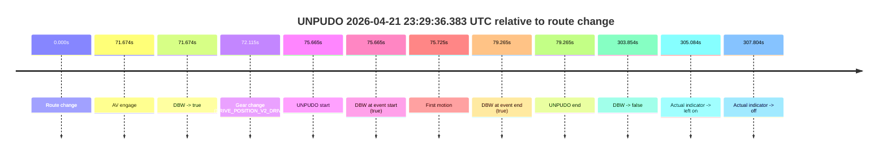
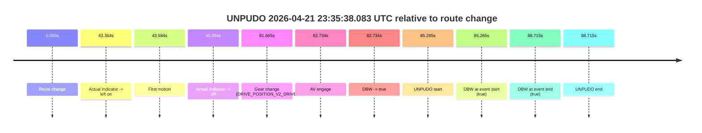

# Run Report: fme10003/2026-04-21--23-12-27--gen2-av-ae472c3d-4786-46e2-b786-a03111c15844

| Field | Value |
|---|---|
| Run ID | `fme10003/2026-04-21--23-12-27--gen2-av-ae472c3d-4786-46e2-b786-a03111c15844` |
| Date | `2026-04-21` |
| Model(s) | `eel-teal-outspoken` |
| Author | `zak` |
| Event count | `2` |

## unpudo 2026-04-21 23:29:36.383 UTC

| Field | Value |
|---|---|
| Model | `eel-teal-outspoken` |
| Author | `zak` |
| Run ID | `fme10003/2026-04-21--23-12-27--gen2-av-ae472c3d-4786-46e2-b786-a03111c15844` |
| Date | `2026-04-21` |
| Time (UTC) | `23:29:36.383` |
| Event type | `unpudo` |
| Disengagement type | `none observed` |
| Route change | `found` |
| Console | [run](https://console.sso.wayve.ai/run/fme10003/2026-04-21--23-12-27--gen2-av-ae472c3d-4786-46e2-b786-a03111c15844?id=&time-unixus=1776814176383310) |
| Foxglove | [segment](https://app.foxglove.dev/wayve-on-prem/p/prj_0dX18KZdVHg1fmmI/view?ds=foxglove-stream&ds.deviceName=fme10003&ds.start=2026-04-21T23%3A28%3A10.718257Z&ds.end=2026-04-21T23%3A33%3A34.572078Z&layoutId=lay_0e7VD4WIKDQGU73Y&time=2026-04-21T23%3A29%3A36.383310Z) |

### Event card: pass

- Pass: AV owns the credited unpudo from route change through the official unpudo window, the gear state is aligned at the anchor, and the vehicle moves without driver accelerator help in AV.

| Event | Time (UTC) | Delta from route change |
|---|---:|---:|
| Route change | 2026-04-21 23:28:20.718 | `0.000s` |
| AV engage | 2026-04-21 23:29:32.392 | `71.674s` |
| DBW -> true | 2026-04-21 23:29:32.392 | `71.674s` |
| Gear change (DRIVE_POSITION_V2_DRIVE) | 2026-04-21 23:29:32.833 | `72.115s` |
| UNPUDO start | 2026-04-21 23:29:36.383 | `75.665s` |
| DBW at event start (true) | 2026-04-21 23:29:36.383 | `75.665s` |
| First motion | 2026-04-21 23:29:36.442 | `75.725s` |
| DBW at event end (true) | 2026-04-21 23:29:39.983 | `79.265s` |
| UNPUDO end | 2026-04-21 23:29:39.983 | `79.265s` |
| DBW -> false | 2026-04-21 23:33:24.572 | `303.854s` |
| Actual indicator -> left on | 2026-04-21 23:33:25.802 | `305.084s` |
| Actual indicator -> off | 2026-04-21 23:33:28.522 | `307.804s` |

| Metric | Value |
|---|---|
| Outcome | `pass` |
| Effective failure type | `none` |
| Route change status | `found` |
| DBW at event start | `true` |
| DBW at event end | `true` |
| Predicted gear at AV start | `DRIVE_POSITION_V2_DRIVE` |
| Actual gear at AV start | `DRIVE_POSITION_V2_PARK` |
| Predicted gear at event start | `DRIVE_POSITION_V2_DRIVE` |
| Actual gear at event start | `DRIVE_POSITION_V2_DRIVE` |
| Planned indicator direction | `INDICATORS_STATE_V2_LEFT_ON` |
| Controller indicator direction | `INDICATORS_STATE_V2_LEFT_ON` |
| Actual indicator direction | `INDICATORS_STATE_V2_OFF` |
| Actual indicator at maneuver end | `INDICATORS_STATE_V2_OFF` |
| Driver accel help in AV | `false` |
| Driver accel help timestamp | `n/a` |
| Max accel pedal pct in AV | `0.0%` |
| Max brake pedal pct in AV | `8.0%` |
| Max speed mps in AV | `4.956` |
| Success timing baseline | `route change` |
| Route -> AV | `71.674s` |
| AV -> event start | `3.991s` |
| AV -> first motion | `4.051s` |
| Success baseline -> event start | `75.665s` |
| Success baseline -> first motion | `75.725s` |
| AV duration before disengagement | `232.180s` |
| Trajectory waypoint count | `37` |
| Driving-plan step count | `11` |

The scored portion starts from the AV-owned window, not from the pre-AV setup. Route-change search in the stopped pre-event segment was `found`, with the baseline therefore set to route change. At the event anchor the model predicts `DRIVE_POSITION_V2_DRIVE` and the actual gear is `DRIVE_POSITION_V2_DRIVE`. The effective model outcome is `pass` because `the credited unpudo stays AV-owned through the official unpudo window.`

### Resolution

| Field | Value |
|---|---|
| Final outcome | `pass` |
| Do we agree with this label? | `yes` |
| Source disengagement type | `none observed` |
| Resolved effective failure type | `none` |
| Confidence | `high` |

## unpudo 2026-04-21 23:35:38.083 UTC

| Field | Value |
|---|---|
| Model | `eel-teal-outspoken` |
| Author | `zak` |
| Run ID | `fme10003/2026-04-21--23-12-27--gen2-av-ae472c3d-4786-46e2-b786-a03111c15844` |
| Date | `2026-04-21` |
| Time (UTC) | `23:35:38.083` |
| Event type | `unpudo` |
| Disengagement type | `none observed` |
| Route change | `found` |
| Console | [run](https://console.sso.wayve.ai/run/fme10003/2026-04-21--23-12-27--gen2-av-ae472c3d-4786-46e2-b786-a03111c15844?id=&time-unixus=1776814538083303) |
| Foxglove | [segment](https://app.foxglove.dev/wayve-on-prem/p/prj_0dX18KZdVHg1fmmI/view?ds=foxglove-stream&ds.deviceName=fme10003&ds.start=2026-04-21T23%3A34%3A02.818583Z&ds.end=2026-04-21T23%3A35%3A51.533313Z&layoutId=lay_0e7VD4WIKDQGU73Y&time=2026-04-21T23%3A35%3A38.083303Z) |

### Event card: pass

- Pass: AV owns the credited unpudo from route change through the official unpudo window, the gear state is aligned at the anchor, and the vehicle moves without driver accelerator help in AV.

| Event | Time (UTC) | Delta from route change |
|---|---:|---:|
| Route change | 2026-04-21 23:34:12.818 | `0.000s` |
| Actual indicator -> left on | 2026-04-21 23:34:56.182 | `43.364s` |
| First motion | 2026-04-21 23:34:56.402 | `43.584s` |
| Actual indicator -> off | 2026-04-21 23:34:58.502 | `45.684s` |
| Gear change (DRIVE_POSITION_V2_DRIVE) | 2026-04-21 23:35:34.483 | `81.665s` |
| AV engage | 2026-04-21 23:35:35.552 | `82.734s` |
| DBW -> true | 2026-04-21 23:35:35.552 | `82.734s` |
| UNPUDO start | 2026-04-21 23:35:38.083 | `85.265s` |
| DBW at event start (true) | 2026-04-21 23:35:38.083 | `85.265s` |
| DBW at event end (true) | 2026-04-21 23:35:41.533 | `88.715s` |
| UNPUDO end | 2026-04-21 23:35:41.533 | `88.715s` |

| Metric | Value |
|---|---|
| Outcome | `pass` |
| Effective failure type | `none` |
| Route change status | `found` |
| DBW at event start | `true` |
| DBW at event end | `true` |
| Predicted gear at AV start | `DRIVE_POSITION_V2_DRIVE` |
| Actual gear at AV start | `DRIVE_POSITION_V2_DRIVE` |
| Predicted gear at event start | `DRIVE_POSITION_V2_DRIVE` |
| Actual gear at event start | `DRIVE_POSITION_V2_DRIVE` |
| Planned indicator direction | `INDICATORS_STATE_V2_OFF` |
| Controller indicator direction | `INDICATORS_STATE_V2_LEFT_ON` |
| Actual indicator direction | `INDICATORS_STATE_V2_OFF` |
| Actual indicator at maneuver end | `INDICATORS_STATE_V2_OFF` |
| Driver accel help in AV | `false` |
| Driver accel help timestamp | `n/a` |
| Max accel pedal pct in AV | `0.0%` |
| Max brake pedal pct in AV | `0.0%` |
| Max speed mps in AV | `5.150` |
| Success timing baseline | `route change` |
| Route -> AV | `82.734s` |
| AV -> event start | `2.531s` |
| AV -> first motion | `-39.150s` |
| Success baseline -> event start | `85.265s` |
| Success baseline -> first motion | `43.584s` |
| AV duration before disengagement | `n/a` |
| Trajectory waypoint count | `37` |
| Driving-plan step count | `11` |

The scored portion starts from the AV-owned window, not from the pre-AV setup. Route-change search in the stopped pre-event segment was `found`, with the baseline therefore set to route change. At the event anchor the model predicts `DRIVE_POSITION_V2_DRIVE` and the actual gear is `DRIVE_POSITION_V2_DRIVE`. The effective model outcome is `pass` because `the credited unpudo stays AV-owned through the official unpudo window.`

### Resolution

| Field | Value |
|---|---|
| Final outcome | `pass` |
| Do we agree with this label? | `yes` |
| Source disengagement type | `none observed` |
| Resolved effective failure type | `none` |
| Confidence | `high` |
