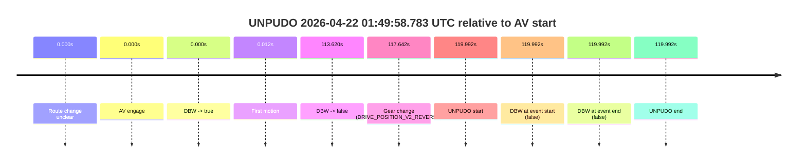
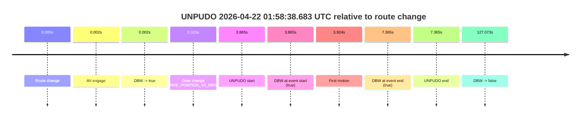

# Run Report: fme10003/2026-04-22--01-38-48--gen2-av-848a412f-c2ce-4d60-9fe4-1bfec42ba9a3

| Field | Value |
|---|---|
| Run ID | `fme10003/2026-04-22--01-38-48--gen2-av-848a412f-c2ce-4d60-9fe4-1bfec42ba9a3` |
| Date | `2026-04-22` |
| Model(s) | `eel-teal-outspoken` |
| Author | `zak` |
| Event count | `2` |

## unpudo 2026-04-22 01:49:58.783 UTC

| Field | Value |
|---|---|
| Model | `eel-teal-outspoken` |
| Author | `zak` |
| Run ID | `fme10003/2026-04-22--01-38-48--gen2-av-848a412f-c2ce-4d60-9fe4-1bfec42ba9a3` |
| Date | `2026-04-22` |
| Time (UTC) | `01:49:58.783` |
| Event type | `unpudo` |
| Disengagement type | `failed_to_pudo` |
| Route change | `unclear` |
| Console | [run](https://console.sso.wayve.ai/run/fme10003/2026-04-22--01-38-48--gen2-av-848a412f-c2ce-4d60-9fe4-1bfec42ba9a3?id=&time-unixus=1776822598783292) |
| Foxglove | [segment](https://app.foxglove.dev/wayve-on-prem/p/prj_0dX18KZdVHg1fmmI/view?ds=foxglove-stream&ds.deviceName=fme10003&ds.start=2026-04-22T01%3A47%3A48.791050Z&ds.end=2026-04-22T01%3A50%3A08.783292Z&layoutId=lay_0e7VD4WIKDQGU73Y&time=2026-04-22T01%3A49%3A58.783292Z) |

### Event card: fail

- Fail: AV owns part of the segment, but the event still resolves as a model-performance failure under the AV-only scoring rule.

| Event | Time (UTC) | Delta from AV start |
|---|---:|---:|
| Route change unclear | 2026-04-22 01:47:58.791 | `0.000s` |
| AV engage | 2026-04-22 01:47:58.791 | `0.000s` |
| DBW -> true | 2026-04-22 01:47:58.791 | `0.000s` |
| First motion | 2026-04-22 01:47:58.802 | `0.012s` |
| DBW -> false | 2026-04-22 01:49:52.410 | `113.620s` |
| Gear change (DRIVE_POSITION_V2_REVERSE) | 2026-04-22 01:49:56.433 | `117.642s` |
| UNPUDO start | 2026-04-22 01:49:58.783 | `119.992s` |
| DBW at event start (false) | 2026-04-22 01:49:58.783 | `119.992s` |
| DBW at event end (false) | 2026-04-22 01:49:58.783 | `119.992s` |
| UNPUDO end | 2026-04-22 01:49:58.783 | `119.992s` |

| Metric | Value |
|---|---|
| Outcome | `fail` |
| Effective failure type | `failed_to_pudo` |
| Route change status | `unclear` |
| DBW at event start | `false` |
| DBW at event end | `false` |
| Predicted gear at AV start | `DRIVE_POSITION_V2_DRIVE` |
| Actual gear at AV start | `DRIVE_POSITION_V2_DRIVE` |
| Predicted gear at event start | `DRIVE_POSITION_V2_REVERSE` |
| Actual gear at event start | `DRIVE_POSITION_V2_REVERSE` |
| Planned indicator direction | `INDICATORS_STATE_V2_OFF` |
| Controller indicator direction | `INDICATORS_STATE_V2_OFF` |
| Actual indicator direction | `INDICATORS_STATE_V2_OFF` |
| Actual indicator at maneuver end | `INDICATORS_STATE_V2_OFF` |
| Driver accel help in AV | `false` |
| Driver accel help timestamp | `n/a` |
| Max accel pedal pct in AV | `0.0%` |
| Max brake pedal pct in AV | `0.0%` |
| Max speed mps in AV | `14.342` |
| Success timing baseline | `AV start` |
| Route -> AV | `n/a` |
| AV -> event start | `119.992s` |
| AV -> first motion | `0.012s` |
| Success baseline -> event start | `119.992s` |
| Success baseline -> first motion | `0.012s` |
| AV duration before disengagement | `113.620s` |
| Trajectory waypoint count | `37` |
| Driving-plan step count | `11` |

The scored portion starts from the AV-owned window, not from the pre-AV setup. Route-change search in the stopped pre-event segment was `unclear`, with the baseline therefore set to AV start. At the event anchor the model predicts `DRIVE_POSITION_V2_REVERSE` and the actual gear is `DRIVE_POSITION_V2_REVERSE`. The effective model outcome is `fail` because `failed_to_pudo.`

### Resolution

| Field | Value |
|---|---|
| Final outcome | `fail` |
| Do we agree with this label? | `yes` |
| Source disengagement type | `failed_to_pudo` |
| Resolved effective failure type | `failed_to_pudo` |
| Confidence | `medium` |

## unpudo 2026-04-22 01:58:38.683 UTC

| Field | Value |
|---|---|
| Model | `eel-teal-outspoken` |
| Author | `zak` |
| Run ID | `fme10003/2026-04-22--01-38-48--gen2-av-848a412f-c2ce-4d60-9fe4-1bfec42ba9a3` |
| Date | `2026-04-22` |
| Time (UTC) | `01:58:38.683` |
| Event type | `unpudo` |
| Disengagement type | `none observed` |
| Route change | `found` |
| Console | [run](https://console.sso.wayve.ai/run/fme10003/2026-04-22--01-38-48--gen2-av-848a412f-c2ce-4d60-9fe4-1bfec42ba9a3?id=&time-unixus=1776823118683313) |
| Foxglove | [segment](https://app.foxglove.dev/wayve-on-prem/p/prj_0dX18KZdVHg1fmmI/view?ds=foxglove-stream&ds.deviceName=fme10003&ds.start=2026-04-22T01%3A58%3A24.818252Z&ds.end=2026-04-22T02%3A00%3A51.891027Z&layoutId=lay_0e7VD4WIKDQGU73Y&time=2026-04-22T01%3A58%3A38.683313Z) |

### Event card: pass

- Pass: AV owns the credited unpudo from route change through the official unpudo window, the gear state is aligned at the anchor, and the vehicle moves without driver accelerator help in AV.

| Event | Time (UTC) | Delta from route change |
|---|---:|---:|
| Route change | 2026-04-22 01:58:34.818 | `0.000s` |
| AV engage | 2026-04-22 01:58:34.820 | `0.002s` |
| DBW -> true | 2026-04-22 01:58:34.820 | `0.002s` |
| Gear change (DRIVE_POSITION_V2_DRIVE) | 2026-04-22 01:58:35.133 | `0.315s` |
| UNPUDO start | 2026-04-22 01:58:38.683 | `3.865s` |
| DBW at event start (true) | 2026-04-22 01:58:38.683 | `3.865s` |
| First motion | 2026-04-22 01:58:38.742 | `3.924s` |
| DBW at event end (true) | 2026-04-22 01:58:42.183 | `7.365s` |
| UNPUDO end | 2026-04-22 01:58:42.183 | `7.365s` |
| DBW -> false | 2026-04-22 02:00:41.891 | `127.073s` |

| Metric | Value |
|---|---|
| Outcome | `pass` |
| Effective failure type | `none` |
| Route change status | `found` |
| DBW at event start | `true` |
| DBW at event end | `true` |
| Predicted gear at AV start | `DRIVE_POSITION_V2_PARK` |
| Actual gear at AV start | `DRIVE_POSITION_V2_PARK` |
| Predicted gear at event start | `DRIVE_POSITION_V2_DRIVE` |
| Actual gear at event start | `DRIVE_POSITION_V2_DRIVE` |
| Planned indicator direction | `INDICATORS_STATE_V2_LEFT_ON` |
| Controller indicator direction | `INDICATORS_STATE_V2_LEFT_ON` |
| Actual indicator direction | `INDICATORS_STATE_V2_OFF` |
| Actual indicator at maneuver end | `INDICATORS_STATE_V2_OFF` |
| Driver accel help in AV | `false` |
| Driver accel help timestamp | `n/a` |
| Max accel pedal pct in AV | `0.0%` |
| Max brake pedal pct in AV | `8.0%` |
| Max speed mps in AV | `5.436` |
| Success timing baseline | `route change` |
| Route -> AV | `0.002s` |
| AV -> event start | `3.863s` |
| AV -> first motion | `3.922s` |
| Success baseline -> event start | `3.865s` |
| Success baseline -> first motion | `3.924s` |
| AV duration before disengagement | `127.071s` |
| Trajectory waypoint count | `37` |
| Driving-plan step count | `11` |

The scored portion starts from the AV-owned window, not from the pre-AV setup. Route-change search in the stopped pre-event segment was `found`, with the baseline therefore set to route change. At the event anchor the model predicts `DRIVE_POSITION_V2_DRIVE` and the actual gear is `DRIVE_POSITION_V2_DRIVE`. The effective model outcome is `pass` because `the credited unpudo stays AV-owned through the official unpudo window.`

### Resolution

| Field | Value |
|---|---|
| Final outcome | `pass` |
| Do we agree with this label? | `yes` |
| Source disengagement type | `none observed` |
| Resolved effective failure type | `none` |
| Confidence | `high` |
