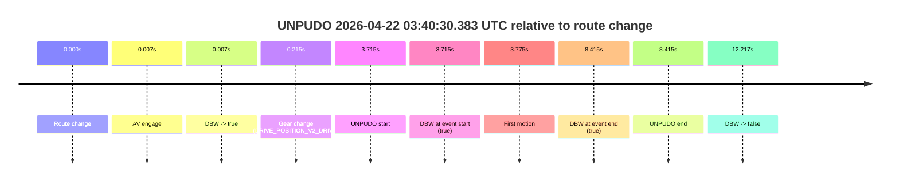
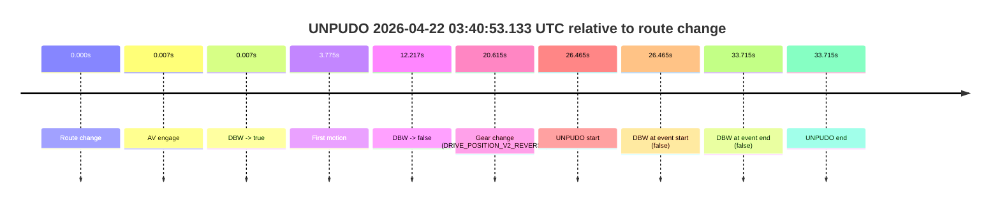
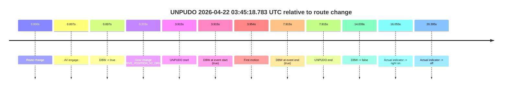

# Run Report: fme10003/2026-04-22--03-30-38--gen2-av-6002bf44-37af-457e-b5ed-51abfe8ed7c4

| Field | Value |
|---|---|
| Run ID | `fme10003/2026-04-22--03-30-38--gen2-av-6002bf44-37af-457e-b5ed-51abfe8ed7c4` |
| Date | `2026-04-22` |
| Model(s) | `eel-teal-outspoken` |
| Author | `zak` |
| Event count | `3` |

## unpudo 2026-04-22 03:40:30.383 UTC

| Field | Value |
|---|---|
| Model | `eel-teal-outspoken` |
| Author | `zak` |
| Run ID | `fme10003/2026-04-22--03-30-38--gen2-av-6002bf44-37af-457e-b5ed-51abfe8ed7c4` |
| Date | `2026-04-22` |
| Time (UTC) | `03:40:30.383` |
| Event type | `unpudo` |
| Disengagement type | `none observed` |
| Route change | `found` |
| Console | [run](https://console.sso.wayve.ai/run/fme10003/2026-04-22--03-30-38--gen2-av-6002bf44-37af-457e-b5ed-51abfe8ed7c4?id=&time-unixus=1776829230383310) |
| Foxglove | [segment](https://app.foxglove.dev/wayve-on-prem/p/prj_0dX18KZdVHg1fmmI/view?ds=foxglove-stream&ds.deviceName=fme10003&ds.start=2026-04-22T03%3A40%3A16.668335Z&ds.end=2026-04-22T03%3A40%3A48.885570Z&layoutId=lay_0e7VD4WIKDQGU73Y&time=2026-04-22T03%3A40%3A30.383310Z) |

### Event card: pass

- Pass: AV owns the credited unpudo from route change through the official unpudo window, the gear state is aligned at the anchor, and the vehicle moves without driver accelerator help in AV.

| Event | Time (UTC) | Delta from route change |
|---|---:|---:|
| Route change | 2026-04-22 03:40:26.668 | `0.000s` |
| AV engage | 2026-04-22 03:40:26.675 | `0.007s` |
| DBW -> true | 2026-04-22 03:40:26.675 | `0.007s` |
| Gear change (DRIVE_POSITION_V2_DRIVE) | 2026-04-22 03:40:26.883 | `0.215s` |
| UNPUDO start | 2026-04-22 03:40:30.383 | `3.715s` |
| DBW at event start (true) | 2026-04-22 03:40:30.383 | `3.715s` |
| First motion | 2026-04-22 03:40:30.443 | `3.775s` |
| DBW at event end (true) | 2026-04-22 03:40:35.083 | `8.415s` |
| UNPUDO end | 2026-04-22 03:40:35.083 | `8.415s` |
| DBW -> false | 2026-04-22 03:40:38.885 | `12.217s` |

| Metric | Value |
|---|---|
| Outcome | `pass` |
| Effective failure type | `none` |
| Route change status | `found` |
| DBW at event start | `true` |
| DBW at event end | `true` |
| Predicted gear at AV start | `DRIVE_POSITION_V2_PARK` |
| Actual gear at AV start | `DRIVE_POSITION_V2_PARK` |
| Predicted gear at event start | `DRIVE_POSITION_V2_DRIVE` |
| Actual gear at event start | `DRIVE_POSITION_V2_DRIVE` |
| Planned indicator direction | `INDICATORS_STATE_V2_LEFT_ON` |
| Controller indicator direction | `INDICATORS_STATE_V2_LEFT_ON` |
| Actual indicator direction | `INDICATORS_STATE_V2_OFF` |
| Actual indicator at maneuver end | `INDICATORS_STATE_V2_OFF` |
| Driver accel help in AV | `false` |
| Driver accel help timestamp | `n/a` |
| Max accel pedal pct in AV | `0.0%` |
| Max brake pedal pct in AV | `8.0%` |
| Max speed mps in AV | `2.733` |
| Success timing baseline | `route change` |
| Route -> AV | `0.007s` |
| AV -> event start | `3.708s` |
| AV -> first motion | `3.768s` |
| Success baseline -> event start | `3.715s` |
| Success baseline -> first motion | `3.775s` |
| AV duration before disengagement | `12.210s` |
| Trajectory waypoint count | `36` |
| Driving-plan step count | `11` |

The scored portion starts from the AV-owned window, not from the pre-AV setup. Route-change search in the stopped pre-event segment was `found`, with the baseline therefore set to route change. At the event anchor the model predicts `DRIVE_POSITION_V2_DRIVE` and the actual gear is `DRIVE_POSITION_V2_DRIVE`. The effective model outcome is `pass` because `the credited unpudo stays AV-owned through the official unpudo window.`

### Resolution

| Field | Value |
|---|---|
| Final outcome | `pass` |
| Do we agree with this label? | `yes` |
| Source disengagement type | `none observed` |
| Resolved effective failure type | `none` |
| Confidence | `high` |

## unpudo 2026-04-22 03:40:53.133 UTC

| Field | Value |
|---|---|
| Model | `eel-teal-outspoken` |
| Author | `zak` |
| Run ID | `fme10003/2026-04-22--03-30-38--gen2-av-6002bf44-37af-457e-b5ed-51abfe8ed7c4` |
| Date | `2026-04-22` |
| Time (UTC) | `03:40:53.133` |
| Event type | `unpudo` |
| Disengagement type | `failed_to_unpudo` |
| Route change | `found` |
| Console | [run](https://console.sso.wayve.ai/run/fme10003/2026-04-22--03-30-38--gen2-av-6002bf44-37af-457e-b5ed-51abfe8ed7c4?id=&time-unixus=1776829253133298) |
| Foxglove | [segment](https://app.foxglove.dev/wayve-on-prem/p/prj_0dX18KZdVHg1fmmI/view?ds=foxglove-stream&ds.deviceName=fme10003&ds.start=2026-04-22T03%3A40%3A16.668335Z&ds.end=2026-04-22T03%3A41%3A10.383309Z&layoutId=lay_0e7VD4WIKDQGU73Y&time=2026-04-22T03%3A40%3A53.133298Z) |

### Event card: fail

- Fail: AV owns part of the segment, but the event still resolves as a model-performance failure under the AV-only scoring rule.

| Event | Time (UTC) | Delta from route change |
|---|---:|---:|
| Route change | 2026-04-22 03:40:26.668 | `0.000s` |
| AV engage | 2026-04-22 03:40:26.675 | `0.007s` |
| DBW -> true | 2026-04-22 03:40:26.675 | `0.007s` |
| First motion | 2026-04-22 03:40:30.443 | `3.775s` |
| DBW -> false | 2026-04-22 03:40:38.885 | `12.217s` |
| Gear change (DRIVE_POSITION_V2_REVERSE) | 2026-04-22 03:40:47.283 | `20.615s` |
| UNPUDO start | 2026-04-22 03:40:53.133 | `26.465s` |
| DBW at event start (false) | 2026-04-22 03:40:53.133 | `26.465s` |
| DBW at event end (false) | 2026-04-22 03:41:00.383 | `33.715s` |
| UNPUDO end | 2026-04-22 03:41:00.383 | `33.715s` |

| Metric | Value |
|---|---|
| Outcome | `fail` |
| Effective failure type | `failed_to_unpudo` |
| Route change status | `found` |
| DBW at event start | `false` |
| DBW at event end | `false` |
| Predicted gear at AV start | `DRIVE_POSITION_V2_PARK` |
| Actual gear at AV start | `DRIVE_POSITION_V2_PARK` |
| Predicted gear at event start | `DRIVE_POSITION_V2_REVERSE` |
| Actual gear at event start | `DRIVE_POSITION_V2_REVERSE` |
| Planned indicator direction | `INDICATORS_STATE_V2_OFF` |
| Controller indicator direction | `INDICATORS_STATE_V2_OFF` |
| Actual indicator direction | `INDICATORS_STATE_V2_OFF` |
| Actual indicator at maneuver end | `INDICATORS_STATE_V2_OFF` |
| Driver accel help in AV | `false` |
| Driver accel help timestamp | `n/a` |
| Max accel pedal pct in AV | `0.0%` |
| Max brake pedal pct in AV | `8.0%` |
| Max speed mps in AV | `2.922` |
| Success timing baseline | `route change` |
| Route -> AV | `0.007s` |
| AV -> event start | `26.458s` |
| AV -> first motion | `3.768s` |
| Success baseline -> event start | `26.465s` |
| Success baseline -> first motion | `3.775s` |
| AV duration before disengagement | `12.210s` |
| Trajectory waypoint count | `37` |
| Driving-plan step count | `11` |

The scored portion starts from the AV-owned window, not from the pre-AV setup. Route-change search in the stopped pre-event segment was `found`, with the baseline therefore set to route change. At the event anchor the model predicts `DRIVE_POSITION_V2_REVERSE` and the actual gear is `DRIVE_POSITION_V2_REVERSE`. The effective model outcome is `fail` because `failed_to_unpudo.`

### Resolution

| Field | Value |
|---|---|
| Final outcome | `fail` |
| Do we agree with this label? | `yes` |
| Source disengagement type | `failed_to_unpudo` |
| Resolved effective failure type | `failed_to_unpudo` |
| Confidence | `high` |

## unpudo 2026-04-22 03:45:18.783 UTC

| Field | Value |
|---|---|
| Model | `eel-teal-outspoken` |
| Author | `zak` |
| Run ID | `fme10003/2026-04-22--03-30-38--gen2-av-6002bf44-37af-457e-b5ed-51abfe8ed7c4` |
| Date | `2026-04-22` |
| Time (UTC) | `03:45:18.783` |
| Event type | `unpudo` |
| Disengagement type | `none observed` |
| Route change | `found` |
| Console | [run](https://console.sso.wayve.ai/run/fme10003/2026-04-22--03-30-38--gen2-av-6002bf44-37af-457e-b5ed-51abfe8ed7c4?id=&time-unixus=1776829518783300) |
| Foxglove | [segment](https://app.foxglove.dev/wayve-on-prem/p/prj_0dX18KZdVHg1fmmI/view?ds=foxglove-stream&ds.deviceName=fme10003&ds.start=2026-04-22T03%3A45%3A04.868272Z&ds.end=2026-04-22T03%3A45%3A38.907057Z&layoutId=lay_0e7VD4WIKDQGU73Y&time=2026-04-22T03%3A45%3A18.783300Z) |

### Event card: pass

- Pass: AV owns the credited unpudo from route change through the official unpudo window, the gear state is aligned at the anchor, and the vehicle moves without driver accelerator help in AV.

| Event | Time (UTC) | Delta from route change |
|---|---:|---:|
| Route change | 2026-04-22 03:45:14.868 | `0.000s` |
| AV engage | 2026-04-22 03:45:14.875 | `0.007s` |
| DBW -> true | 2026-04-22 03:45:14.875 | `0.007s` |
| Gear change (DRIVE_POSITION_V2_DRIVE) | 2026-04-22 03:45:15.183 | `0.315s` |
| UNPUDO start | 2026-04-22 03:45:18.783 | `3.915s` |
| DBW at event start (true) | 2026-04-22 03:45:18.783 | `3.915s` |
| First motion | 2026-04-22 03:45:18.822 | `3.954s` |
| DBW at event end (true) | 2026-04-22 03:45:22.783 | `7.915s` |
| UNPUDO end | 2026-04-22 03:45:22.783 | `7.915s` |
| DBW -> false | 2026-04-22 03:45:28.907 | `14.039s` |
| Actual indicator -> right on | 2026-04-22 03:45:30.923 | `16.055s` |
| Actual indicator -> off | 2026-04-22 03:45:35.263 | `20.395s` |

| Metric | Value |
|---|---|
| Outcome | `pass` |
| Effective failure type | `none` |
| Route change status | `found` |
| DBW at event start | `true` |
| DBW at event end | `true` |
| Predicted gear at AV start | `DRIVE_POSITION_V2_PARK` |
| Actual gear at AV start | `DRIVE_POSITION_V2_PARK` |
| Predicted gear at event start | `DRIVE_POSITION_V2_DRIVE` |
| Actual gear at event start | `DRIVE_POSITION_V2_DRIVE` |
| Planned indicator direction | `INDICATORS_STATE_V2_LEFT_ON` |
| Controller indicator direction | `INDICATORS_STATE_V2_LEFT_ON` |
| Actual indicator direction | `INDICATORS_STATE_V2_OFF` |
| Actual indicator at maneuver end | `INDICATORS_STATE_V2_OFF` |
| Driver accel help in AV | `false` |
| Driver accel help timestamp | `n/a` |
| Max accel pedal pct in AV | `0.0%` |
| Max brake pedal pct in AV | `8.0%` |
| Max speed mps in AV | `3.567` |
| Success timing baseline | `route change` |
| Route -> AV | `0.007s` |
| AV -> event start | `3.908s` |
| AV -> first motion | `3.947s` |
| Success baseline -> event start | `3.915s` |
| Success baseline -> first motion | `3.954s` |
| AV duration before disengagement | `14.032s` |
| Trajectory waypoint count | `36` |
| Driving-plan step count | `11` |

The scored portion starts from the AV-owned window, not from the pre-AV setup. Route-change search in the stopped pre-event segment was `found`, with the baseline therefore set to route change. At the event anchor the model predicts `DRIVE_POSITION_V2_DRIVE` and the actual gear is `DRIVE_POSITION_V2_DRIVE`. The effective model outcome is `pass` because `the credited unpudo stays AV-owned through the official unpudo window.`

### Resolution

| Field | Value |
|---|---|
| Final outcome | `pass` |
| Do we agree with this label? | `yes` |
| Source disengagement type | `none observed` |
| Resolved effective failure type | `none` |
| Confidence | `high` |
