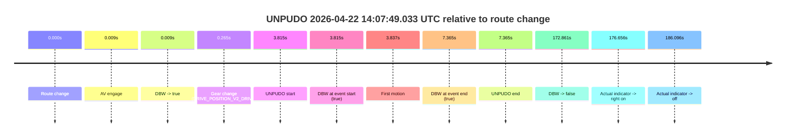
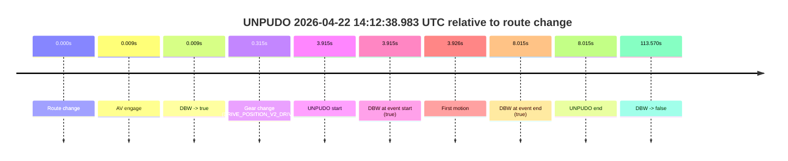
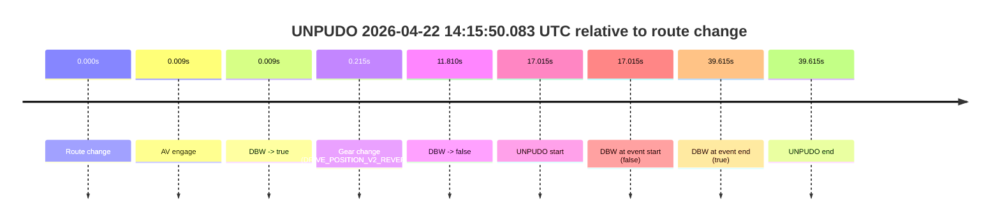
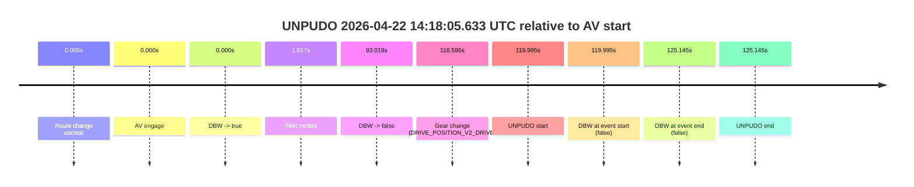
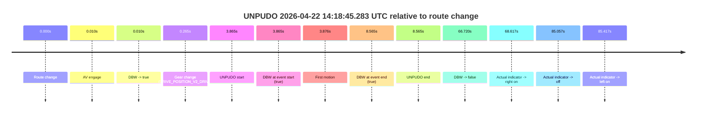
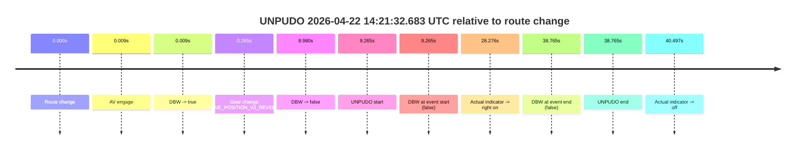
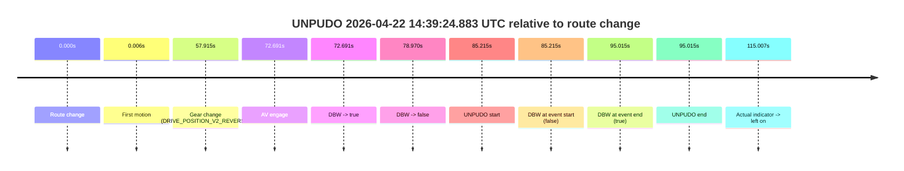

# Run Report: fme10003/2026-04-22--13-48-29--gen2-av-6cc0f9b6-4687-4074-be7f-51de100c4131

| Field | Value |
|---|---|
| Run ID | `fme10003/2026-04-22--13-48-29--gen2-av-6cc0f9b6-4687-4074-be7f-51de100c4131` |
| Date | `2026-04-22` |
| Model(s) | `eel-teal-outspoken` |
| Author | `zak` |
| Event count | `9` |

## unpudo 2026-04-22 14:07:49.033 UTC

| Field | Value |
|---|---|
| Model | `eel-teal-outspoken` |
| Author | `zak` |
| Run ID | `fme10003/2026-04-22--13-48-29--gen2-av-6cc0f9b6-4687-4074-be7f-51de100c4131` |
| Date | `2026-04-22` |
| Time (UTC) | `14:07:49.033` |
| Event type | `unpudo` |
| Disengagement type | `none observed` |
| Route change | `found` |
| Console | [run](https://console.sso.wayve.ai/run/fme10003/2026-04-22--13-48-29--gen2-av-6cc0f9b6-4687-4074-be7f-51de100c4131?id=&time-unixus=1776866869033313) |
| Foxglove | [segment](https://app.foxglove.dev/wayve-on-prem/p/prj_0dX18KZdVHg1fmmI/view?ds=foxglove-stream&ds.deviceName=fme10003&ds.start=2026-04-22T14%3A07%3A35.218354Z&ds.end=2026-04-22T14%3A10%3A48.079067Z&layoutId=lay_0e7VD4WIKDQGU73Y&time=2026-04-22T14%3A07%3A49.033313Z) |

### Event card: pass

- Pass: AV owns the credited unpudo from route change through the official unpudo window, the gear state is aligned at the anchor, and the vehicle moves without driver accelerator help in AV.

| Event | Time (UTC) | Delta from route change |
|---|---:|---:|
| Route change | 2026-04-22 14:07:45.218 | `0.000s` |
| AV engage | 2026-04-22 14:07:45.227 | `0.009s` |
| DBW -> true | 2026-04-22 14:07:45.227 | `0.009s` |
| Gear change (DRIVE_POSITION_V2_DRIVE) | 2026-04-22 14:07:45.483 | `0.265s` |
| UNPUDO start | 2026-04-22 14:07:49.033 | `3.815s` |
| DBW at event start (true) | 2026-04-22 14:07:49.033 | `3.815s` |
| First motion | 2026-04-22 14:07:49.054 | `3.837s` |
| DBW at event end (true) | 2026-04-22 14:07:52.583 | `7.365s` |
| UNPUDO end | 2026-04-22 14:07:52.583 | `7.365s` |
| DBW -> false | 2026-04-22 14:10:38.079 | `172.861s` |
| Actual indicator -> right on | 2026-04-22 14:10:41.874 | `176.656s` |
| Actual indicator -> off | 2026-04-22 14:10:51.314 | `186.096s` |

| Metric | Value |
|---|---|
| Outcome | `pass` |
| Effective failure type | `none` |
| Route change status | `found` |
| DBW at event start | `true` |
| DBW at event end | `true` |
| Predicted gear at AV start | `DRIVE_POSITION_V2_PARK` |
| Actual gear at AV start | `DRIVE_POSITION_V2_PARK` |
| Predicted gear at event start | `DRIVE_POSITION_V2_DRIVE` |
| Actual gear at event start | `DRIVE_POSITION_V2_DRIVE` |
| Planned indicator direction | `INDICATORS_STATE_V2_LEFT_ON` |
| Controller indicator direction | `INDICATORS_STATE_V2_LEFT_ON` |
| Actual indicator direction | `INDICATORS_STATE_V2_OFF` |
| Actual indicator at maneuver end | `INDICATORS_STATE_V2_OFF` |
| Driver accel help in AV | `false` |
| Driver accel help timestamp | `n/a` |
| Max accel pedal pct in AV | `0.0%` |
| Max brake pedal pct in AV | `8.0%` |
| Max speed mps in AV | `5.283` |
| Success timing baseline | `route change` |
| Route -> AV | `0.009s` |
| AV -> event start | `3.806s` |
| AV -> first motion | `3.827s` |
| Success baseline -> event start | `3.815s` |
| Success baseline -> first motion | `3.837s` |
| AV duration before disengagement | `172.851s` |
| Trajectory waypoint count | `38` |
| Driving-plan step count | `11` |

The scored portion starts from the AV-owned window, not from the pre-AV setup. Route-change search in the stopped pre-event segment was `found`, with the baseline therefore set to route change. At the event anchor the model predicts `DRIVE_POSITION_V2_DRIVE` and the actual gear is `DRIVE_POSITION_V2_DRIVE`. The effective model outcome is `pass` because `the credited unpudo stays AV-owned through the official unpudo window.`

### Resolution

| Field | Value |
|---|---|
| Final outcome | `pass` |
| Do we agree with this label? | `yes` |
| Source disengagement type | `none observed` |
| Resolved effective failure type | `none` |
| Confidence | `high` |

## unpudo 2026-04-22 14:12:38.983 UTC

| Field | Value |
|---|---|
| Model | `eel-teal-outspoken` |
| Author | `zak` |
| Run ID | `fme10003/2026-04-22--13-48-29--gen2-av-6cc0f9b6-4687-4074-be7f-51de100c4131` |
| Date | `2026-04-22` |
| Time (UTC) | `14:12:38.983` |
| Event type | `unpudo` |
| Disengagement type | `none observed` |
| Route change | `found` |
| Console | [run](https://console.sso.wayve.ai/run/fme10003/2026-04-22--13-48-29--gen2-av-6cc0f9b6-4687-4074-be7f-51de100c4131?id=&time-unixus=1776867158983300) |
| Foxglove | [segment](https://app.foxglove.dev/wayve-on-prem/p/prj_0dX18KZdVHg1fmmI/view?ds=foxglove-stream&ds.deviceName=fme10003&ds.start=2026-04-22T14%3A12%3A25.068403Z&ds.end=2026-04-22T14%3A14%3A38.638328Z&layoutId=lay_0e7VD4WIKDQGU73Y&time=2026-04-22T14%3A12%3A38.983300Z) |

### Event card: pass

- Pass: AV owns the credited unpudo from route change through the official unpudo window, the gear state is aligned at the anchor, and the vehicle moves without driver accelerator help in AV.

| Event | Time (UTC) | Delta from route change |
|---|---:|---:|
| Route change | 2026-04-22 14:12:35.068 | `0.000s` |
| AV engage | 2026-04-22 14:12:35.077 | `0.009s` |
| DBW -> true | 2026-04-22 14:12:35.077 | `0.009s` |
| Gear change (DRIVE_POSITION_V2_DRIVE) | 2026-04-22 14:12:35.383 | `0.315s` |
| UNPUDO start | 2026-04-22 14:12:38.983 | `3.915s` |
| DBW at event start (true) | 2026-04-22 14:12:38.983 | `3.915s` |
| First motion | 2026-04-22 14:12:38.994 | `3.926s` |
| DBW at event end (true) | 2026-04-22 14:12:43.083 | `8.015s` |
| UNPUDO end | 2026-04-22 14:12:43.083 | `8.015s` |
| DBW -> false | 2026-04-22 14:14:28.638 | `113.570s` |

| Metric | Value |
|---|---|
| Outcome | `pass` |
| Effective failure type | `none` |
| Route change status | `found` |
| DBW at event start | `true` |
| DBW at event end | `true` |
| Predicted gear at AV start | `DRIVE_POSITION_V2_PARK` |
| Actual gear at AV start | `DRIVE_POSITION_V2_PARK` |
| Predicted gear at event start | `DRIVE_POSITION_V2_DRIVE` |
| Actual gear at event start | `DRIVE_POSITION_V2_DRIVE` |
| Planned indicator direction | `INDICATORS_STATE_V2_OFF` |
| Controller indicator direction | `INDICATORS_STATE_V2_OFF` |
| Actual indicator direction | `INDICATORS_STATE_V2_OFF` |
| Actual indicator at maneuver end | `INDICATORS_STATE_V2_OFF` |
| Driver accel help in AV | `false` |
| Driver accel help timestamp | `n/a` |
| Max accel pedal pct in AV | `0.0%` |
| Max brake pedal pct in AV | `8.0%` |
| Max speed mps in AV | `3.264` |
| Success timing baseline | `route change` |
| Route -> AV | `0.009s` |
| AV -> event start | `3.906s` |
| AV -> first motion | `3.917s` |
| Success baseline -> event start | `3.915s` |
| Success baseline -> first motion | `3.926s` |
| AV duration before disengagement | `113.561s` |
| Trajectory waypoint count | `36` |
| Driving-plan step count | `11` |

The scored portion starts from the AV-owned window, not from the pre-AV setup. Route-change search in the stopped pre-event segment was `found`, with the baseline therefore set to route change. At the event anchor the model predicts `DRIVE_POSITION_V2_DRIVE` and the actual gear is `DRIVE_POSITION_V2_DRIVE`. The effective model outcome is `pass` because `the credited unpudo stays AV-owned through the official unpudo window.`

### Resolution

| Field | Value |
|---|---|
| Final outcome | `pass` |
| Do we agree with this label? | `yes` |
| Source disengagement type | `none observed` |
| Resolved effective failure type | `none` |
| Confidence | `high` |

## unpudo 2026-04-22 14:15:50.083 UTC

| Field | Value |
|---|---|
| Model | `eel-teal-outspoken` |
| Author | `zak` |
| Run ID | `fme10003/2026-04-22--13-48-29--gen2-av-6cc0f9b6-4687-4074-be7f-51de100c4131` |
| Date | `2026-04-22` |
| Time (UTC) | `14:15:50.083` |
| Event type | `unpudo` |
| Disengagement type | `none observed` |
| Route change | `found` |
| Console | [run](https://console.sso.wayve.ai/run/fme10003/2026-04-22--13-48-29--gen2-av-6cc0f9b6-4687-4074-be7f-51de100c4131?id=&time-unixus=1776867350083301) |
| Foxglove | [segment](https://app.foxglove.dev/wayve-on-prem/p/prj_0dX18KZdVHg1fmmI/view?ds=foxglove-stream&ds.deviceName=fme10003&ds.start=2026-04-22T14%3A15%3A23.068271Z&ds.end=2026-04-22T14%3A16%3A22.683293Z&layoutId=lay_0e7VD4WIKDQGU73Y&time=2026-04-22T14%3A15%3A50.083301Z) |

### Event card: fail

- Fail: the credited unpudo does not stay AV-owned. The event window starts with DBW false, and the maneuver outcome lands outside a clean AV-owned segment.

| Event | Time (UTC) | Delta from route change |
|---|---:|---:|
| Route change | 2026-04-22 14:15:33.068 | `0.000s` |
| AV engage | 2026-04-22 14:15:33.077 | `0.009s` |
| DBW -> true | 2026-04-22 14:15:33.077 | `0.009s` |
| Gear change (DRIVE_POSITION_V2_REVERSE) | 2026-04-22 14:15:33.283 | `0.215s` |
| DBW -> false | 2026-04-22 14:15:44.878 | `11.810s` |
| UNPUDO start | 2026-04-22 14:15:50.083 | `17.015s` |
| DBW at event start (false) | 2026-04-22 14:15:50.083 | `17.015s` |
| DBW at event end (true) | 2026-04-22 14:16:12.683 | `39.615s` |
| UNPUDO end | 2026-04-22 14:16:12.683 | `39.615s` |

| Metric | Value |
|---|---|
| Outcome | `fail` |
| Effective failure type | `not_av_owned` |
| Route change status | `found` |
| DBW at event start | `false` |
| DBW at event end | `true` |
| Predicted gear at AV start | `DRIVE_POSITION_V2_PARK` |
| Actual gear at AV start | `DRIVE_POSITION_V2_PARK` |
| Predicted gear at event start | `DRIVE_POSITION_V2_REVERSE` |
| Actual gear at event start | `DRIVE_POSITION_V2_REVERSE` |
| Planned indicator direction | `INDICATORS_STATE_V2_OFF` |
| Controller indicator direction | `INDICATORS_STATE_V2_OFF` |
| Actual indicator direction | `INDICATORS_STATE_V2_OFF` |
| Actual indicator at maneuver end | `INDICATORS_STATE_V2_OFF` |
| Driver accel help in AV | `false` |
| Driver accel help timestamp | `n/a` |
| Max accel pedal pct in AV | `0.0%` |
| Max brake pedal pct in AV | `8.9%` |
| Max speed mps in AV | `0.000` |
| Success timing baseline | `route change` |
| Route -> AV | `0.009s` |
| AV -> event start | `17.006s` |
| AV -> first motion | `n/a` |
| Success baseline -> event start | `17.015s` |
| Success baseline -> first motion | `n/a` |
| AV duration before disengagement | `11.801s` |
| Trajectory waypoint count | `37` |
| Driving-plan step count | `11` |

The scored portion starts from the AV-owned window, not from the pre-AV setup. Route-change search in the stopped pre-event segment was `found`, with the baseline therefore set to route change. At the event anchor the model predicts `DRIVE_POSITION_V2_REVERSE` and the actual gear is `DRIVE_POSITION_V2_REVERSE`. The effective model outcome is `fail` because `not_av_owned.`

### Resolution

| Field | Value |
|---|---|
| Final outcome | `fail` |
| Do we agree with this label? | `yes` |
| Source disengagement type | `none observed` |
| Resolved effective failure type | `not_av_owned` |
| Confidence | `high` |

## unpudo 2026-04-22 14:18:05.633 UTC

| Field | Value |
|---|---|
| Model | `eel-teal-outspoken` |
| Author | `zak` |
| Run ID | `fme10003/2026-04-22--13-48-29--gen2-av-6cc0f9b6-4687-4074-be7f-51de100c4131` |
| Date | `2026-04-22` |
| Time (UTC) | `14:18:05.633` |
| Event type | `unpudo` |
| Disengagement type | `none observed` |
| Route change | `unclear` |
| Console | [run](https://console.sso.wayve.ai/run/fme10003/2026-04-22--13-48-29--gen2-av-6cc0f9b6-4687-4074-be7f-51de100c4131?id=&time-unixus=1776867485633298) |
| Foxglove | [segment](https://app.foxglove.dev/wayve-on-prem/p/prj_0dX18KZdVHg1fmmI/view?ds=foxglove-stream&ds.deviceName=fme10003&ds.start=2026-04-22T14%3A15%3A55.638368Z&ds.end=2026-04-22T14%3A18%3A20.783317Z&layoutId=lay_0e7VD4WIKDQGU73Y&time=2026-04-22T14%3A18%3A05.633298Z) |

### Event card: fail

- Fail: the credited unpudo does not stay AV-owned. The event window starts with DBW false, and the maneuver outcome lands outside a clean AV-owned segment.

| Event | Time (UTC) | Delta from AV start |
|---|---:|---:|
| Route change unclear | 2026-04-22 14:16:05.638 | `0.000s` |
| AV engage | 2026-04-22 14:16:05.638 | `0.000s` |
| DBW -> true | 2026-04-22 14:16:05.638 | `0.000s` |
| First motion | 2026-04-22 14:16:07.454 | `1.817s` |
| DBW -> false | 2026-04-22 14:17:38.657 | `93.019s` |
| Gear change (DRIVE_POSITION_V2_DRIVE) | 2026-04-22 14:18:04.233 | `118.595s` |
| UNPUDO start | 2026-04-22 14:18:05.633 | `119.995s` |
| DBW at event start (false) | 2026-04-22 14:18:05.633 | `119.995s` |
| DBW at event end (false) | 2026-04-22 14:18:10.783 | `125.145s` |
| UNPUDO end | 2026-04-22 14:18:10.783 | `125.145s` |

| Metric | Value |
|---|---|
| Outcome | `fail` |
| Effective failure type | `not_av_owned` |
| Route change status | `unclear` |
| DBW at event start | `false` |
| DBW at event end | `false` |
| Predicted gear at AV start | `DRIVE_POSITION_V2_DRIVE` |
| Actual gear at AV start | `DRIVE_POSITION_V2_DRIVE` |
| Predicted gear at event start | `DRIVE_POSITION_V2_DRIVE` |
| Actual gear at event start | `DRIVE_POSITION_V2_DRIVE` |
| Planned indicator direction | `INDICATORS_STATE_V2_OFF` |
| Controller indicator direction | `INDICATORS_STATE_V2_OFF` |
| Actual indicator direction | `INDICATORS_STATE_V2_OFF` |
| Actual indicator at maneuver end | `INDICATORS_STATE_V2_OFF` |
| Driver accel help in AV | `false` |
| Driver accel help timestamp | `n/a` |
| Max accel pedal pct in AV | `0.0%` |
| Max brake pedal pct in AV | `16.7%` |
| Max speed mps in AV | `14.436` |
| Success timing baseline | `AV start` |
| Route -> AV | `n/a` |
| AV -> event start | `119.995s` |
| AV -> first motion | `1.817s` |
| Success baseline -> event start | `119.995s` |
| Success baseline -> first motion | `1.817s` |
| AV duration before disengagement | `93.019s` |
| Trajectory waypoint count | `38` |
| Driving-plan step count | `11` |

The scored portion starts from the AV-owned window, not from the pre-AV setup. Route-change search in the stopped pre-event segment was `unclear`, with the baseline therefore set to AV start. At the event anchor the model predicts `DRIVE_POSITION_V2_DRIVE` and the actual gear is `DRIVE_POSITION_V2_DRIVE`. The effective model outcome is `fail` because `not_av_owned.`

### Resolution

| Field | Value |
|---|---|
| Final outcome | `fail` |
| Do we agree with this label? | `yes` |
| Source disengagement type | `none observed` |
| Resolved effective failure type | `not_av_owned` |
| Confidence | `medium` |

## unpudo 2026-04-22 14:18:45.283 UTC

| Field | Value |
|---|---|
| Model | `eel-teal-outspoken` |
| Author | `zak` |
| Run ID | `fme10003/2026-04-22--13-48-29--gen2-av-6cc0f9b6-4687-4074-be7f-51de100c4131` |
| Date | `2026-04-22` |
| Time (UTC) | `14:18:45.283` |
| Event type | `unpudo` |
| Disengagement type | `none observed` |
| Route change | `found` |
| Console | [run](https://console.sso.wayve.ai/run/fme10003/2026-04-22--13-48-29--gen2-av-6cc0f9b6-4687-4074-be7f-51de100c4131?id=&time-unixus=1776867525283311) |
| Foxglove | [segment](https://app.foxglove.dev/wayve-on-prem/p/prj_0dX18KZdVHg1fmmI/view?ds=foxglove-stream&ds.deviceName=fme10003&ds.start=2026-04-22T14%3A18%3A31.418242Z&ds.end=2026-04-22T14%3A19%3A58.138317Z&layoutId=lay_0e7VD4WIKDQGU73Y&time=2026-04-22T14%3A18%3A45.283311Z) |

### Event card: pass

- Pass: AV owns the credited unpudo from route change through the official unpudo window, the gear state is aligned at the anchor, and the vehicle moves without driver accelerator help in AV.

| Event | Time (UTC) | Delta from route change |
|---|---:|---:|
| Route change | 2026-04-22 14:18:41.418 | `0.000s` |
| AV engage | 2026-04-22 14:18:41.427 | `0.010s` |
| DBW -> true | 2026-04-22 14:18:41.427 | `0.010s` |
| Gear change (DRIVE_POSITION_V2_DRIVE) | 2026-04-22 14:18:41.683 | `0.265s` |
| UNPUDO start | 2026-04-22 14:18:45.283 | `3.865s` |
| DBW at event start (true) | 2026-04-22 14:18:45.283 | `3.865s` |
| First motion | 2026-04-22 14:18:45.294 | `3.876s` |
| DBW at event end (true) | 2026-04-22 14:18:49.983 | `8.565s` |
| UNPUDO end | 2026-04-22 14:18:49.983 | `8.565s` |
| DBW -> false | 2026-04-22 14:19:48.138 | `66.720s` |
| Actual indicator -> right on | 2026-04-22 14:19:50.035 | `68.617s` |
| Actual indicator -> off | 2026-04-22 14:20:06.475 | `85.057s` |
| Actual indicator -> left on | 2026-04-22 14:20:06.835 | `85.417s` |

| Metric | Value |
|---|---|
| Outcome | `pass` |
| Effective failure type | `none` |
| Route change status | `found` |
| DBW at event start | `true` |
| DBW at event end | `true` |
| Predicted gear at AV start | `DRIVE_POSITION_V2_PARK` |
| Actual gear at AV start | `DRIVE_POSITION_V2_PARK` |
| Predicted gear at event start | `DRIVE_POSITION_V2_DRIVE` |
| Actual gear at event start | `DRIVE_POSITION_V2_DRIVE` |
| Planned indicator direction | `INDICATORS_STATE_V2_OFF` |
| Controller indicator direction | `INDICATORS_STATE_V2_OFF` |
| Actual indicator direction | `INDICATORS_STATE_V2_OFF` |
| Actual indicator at maneuver end | `INDICATORS_STATE_V2_OFF` |
| Driver accel help in AV | `false` |
| Driver accel help timestamp | `n/a` |
| Max accel pedal pct in AV | `0.0%` |
| Max brake pedal pct in AV | `8.0%` |
| Max speed mps in AV | `2.622` |
| Success timing baseline | `route change` |
| Route -> AV | `0.010s` |
| AV -> event start | `3.856s` |
| AV -> first motion | `3.867s` |
| Success baseline -> event start | `3.865s` |
| Success baseline -> first motion | `3.876s` |
| AV duration before disengagement | `66.711s` |
| Trajectory waypoint count | `36` |
| Driving-plan step count | `11` |

The scored portion starts from the AV-owned window, not from the pre-AV setup. Route-change search in the stopped pre-event segment was `found`, with the baseline therefore set to route change. At the event anchor the model predicts `DRIVE_POSITION_V2_DRIVE` and the actual gear is `DRIVE_POSITION_V2_DRIVE`. The effective model outcome is `pass` because `the credited unpudo stays AV-owned through the official unpudo window.`

### Resolution

| Field | Value |
|---|---|
| Final outcome | `pass` |
| Do we agree with this label? | `yes` |
| Source disengagement type | `none observed` |
| Resolved effective failure type | `none` |
| Confidence | `high` |

## unpudo 2026-04-22 14:21:32.683 UTC

| Field | Value |
|---|---|
| Model | `eel-teal-outspoken` |
| Author | `zak` |
| Run ID | `fme10003/2026-04-22--13-48-29--gen2-av-6cc0f9b6-4687-4074-be7f-51de100c4131` |
| Date | `2026-04-22` |
| Time (UTC) | `14:21:32.683` |
| Event type | `unpudo` |
| Disengagement type | `none observed` |
| Route change | `found` |
| Console | [run](https://console.sso.wayve.ai/run/fme10003/2026-04-22--13-48-29--gen2-av-6cc0f9b6-4687-4074-be7f-51de100c4131?id=&time-unixus=1776867692683309) |
| Foxglove | [segment](https://app.foxglove.dev/wayve-on-prem/p/prj_0dX18KZdVHg1fmmI/view?ds=foxglove-stream&ds.deviceName=fme10003&ds.start=2026-04-22T14%3A21%3A13.418282Z&ds.end=2026-04-22T14%3A22%3A12.183312Z&layoutId=lay_0e7VD4WIKDQGU73Y&time=2026-04-22T14%3A21%3A32.683309Z) |

### Event card: fail

- Fail: the credited unpudo does not stay AV-owned. The event window starts with DBW false, and the maneuver outcome lands outside a clean AV-owned segment.

| Event | Time (UTC) | Delta from route change |
|---|---:|---:|
| Route change | 2026-04-22 14:21:23.418 | `0.000s` |
| AV engage | 2026-04-22 14:21:23.427 | `0.009s` |
| DBW -> true | 2026-04-22 14:21:23.427 | `0.009s` |
| Gear change (DRIVE_POSITION_V2_REVERSE) | 2026-04-22 14:21:23.683 | `0.265s` |
| DBW -> false | 2026-04-22 14:21:32.398 | `8.980s` |
| UNPUDO start | 2026-04-22 14:21:32.683 | `9.265s` |
| DBW at event start (false) | 2026-04-22 14:21:32.683 | `9.265s` |
| Actual indicator -> right on | 2026-04-22 14:21:51.694 | `28.276s` |
| DBW at event end (false) | 2026-04-22 14:22:02.183 | `38.765s` |
| UNPUDO end | 2026-04-22 14:22:02.183 | `38.765s` |
| Actual indicator -> off | 2026-04-22 14:22:03.914 | `40.497s` |

| Metric | Value |
|---|---|
| Outcome | `fail` |
| Effective failure type | `not_av_owned` |
| Route change status | `found` |
| DBW at event start | `false` |
| DBW at event end | `false` |
| Predicted gear at AV start | `DRIVE_POSITION_V2_PARK` |
| Actual gear at AV start | `DRIVE_POSITION_V2_PARK` |
| Predicted gear at event start | `DRIVE_POSITION_V2_REVERSE` |
| Actual gear at event start | `DRIVE_POSITION_V2_REVERSE` |
| Planned indicator direction | `INDICATORS_STATE_V2_OFF` |
| Controller indicator direction | `INDICATORS_STATE_V2_OFF` |
| Actual indicator direction | `INDICATORS_STATE_V2_OFF` |
| Actual indicator at maneuver end | `INDICATORS_STATE_V2_RIGHT_ON` |
| Driver accel help in AV | `false` |
| Driver accel help timestamp | `n/a` |
| Max accel pedal pct in AV | `0.0%` |
| Max brake pedal pct in AV | `8.9%` |
| Max speed mps in AV | `0.000` |
| Success timing baseline | `route change` |
| Route -> AV | `0.009s` |
| AV -> event start | `9.256s` |
| AV -> first motion | `n/a` |
| Success baseline -> event start | `9.265s` |
| Success baseline -> first motion | `n/a` |
| AV duration before disengagement | `8.971s` |
| Trajectory waypoint count | `37` |
| Driving-plan step count | `11` |

The scored portion starts from the AV-owned window, not from the pre-AV setup. Route-change search in the stopped pre-event segment was `found`, with the baseline therefore set to route change. At the event anchor the model predicts `DRIVE_POSITION_V2_REVERSE` and the actual gear is `DRIVE_POSITION_V2_REVERSE`. The effective model outcome is `fail` because `not_av_owned.`

### Resolution

| Field | Value |
|---|---|
| Final outcome | `fail` |
| Do we agree with this label? | `yes` |
| Source disengagement type | `none observed` |
| Resolved effective failure type | `not_av_owned` |
| Confidence | `high` |

## unpudo 2026-04-22 14:28:25.183 UTC

| Field | Value |
|---|---|
| Model | `eel-teal-outspoken` |
| Author | `zak` |
| Run ID | `fme10003/2026-04-22--13-48-29--gen2-av-6cc0f9b6-4687-4074-be7f-51de100c4131` |
| Date | `2026-04-22` |
| Time (UTC) | `14:28:25.183` |
| Event type | `unpudo` |
| Disengagement type | `none observed` |
| Route change | `found` |
| Console | [run](https://console.sso.wayve.ai/run/fme10003/2026-04-22--13-48-29--gen2-av-6cc0f9b6-4687-4074-be7f-51de100c4131?id=&time-unixus=1776868105183303) |
| Foxglove | [segment](https://app.foxglove.dev/wayve-on-prem/p/prj_0dX18KZdVHg1fmmI/view?ds=foxglove-stream&ds.deviceName=fme10003&ds.start=2026-04-22T14%3A28%3A11.318252Z&ds.end=2026-04-22T14%3A29%3A42.998283Z&layoutId=lay_0e7VD4WIKDQGU73Y&time=2026-04-22T14%3A28%3A25.183303Z) |

### Event card: pass

- Pass: AV owns the credited unpudo from route change through the official unpudo window, the gear state is aligned at the anchor, and the vehicle moves without driver accelerator help in AV.

| Event | Time (UTC) | Delta from route change |
|---|---:|---:|
| Route change | 2026-04-22 14:28:21.318 | `0.000s` |
| AV engage | 2026-04-22 14:28:21.327 | `0.010s` |
| DBW -> true | 2026-04-22 14:28:21.327 | `0.010s` |
| Gear change (DRIVE_POSITION_V2_DRIVE) | 2026-04-22 14:28:21.583 | `0.265s` |
| UNPUDO start | 2026-04-22 14:28:25.183 | `3.865s` |
| DBW at event start (true) | 2026-04-22 14:28:25.183 | `3.865s` |
| First motion | 2026-04-22 14:28:25.215 | `3.897s` |
| DBW at event end (true) | 2026-04-22 14:28:28.883 | `7.565s` |
| UNPUDO end | 2026-04-22 14:28:28.883 | `7.565s` |
| DBW -> false | 2026-04-22 14:29:32.998 | `71.680s` |
| Actual indicator -> right on | 2026-04-22 14:29:35.655 | `74.337s` |
| Actual indicator -> off | 2026-04-22 14:29:39.075 | `77.757s` |

| Metric | Value |
|---|---|
| Outcome | `pass` |
| Effective failure type | `none` |
| Route change status | `found` |
| DBW at event start | `true` |
| DBW at event end | `true` |
| Predicted gear at AV start | `DRIVE_POSITION_V2_PARK` |
| Actual gear at AV start | `DRIVE_POSITION_V2_PARK` |
| Predicted gear at event start | `DRIVE_POSITION_V2_DRIVE` |
| Actual gear at event start | `DRIVE_POSITION_V2_DRIVE` |
| Planned indicator direction | `INDICATORS_STATE_V2_LEFT_ON` |
| Controller indicator direction | `INDICATORS_STATE_V2_LEFT_ON` |
| Actual indicator direction | `INDICATORS_STATE_V2_OFF` |
| Actual indicator at maneuver end | `INDICATORS_STATE_V2_OFF` |
| Driver accel help in AV | `false` |
| Driver accel help timestamp | `n/a` |
| Max accel pedal pct in AV | `0.0%` |
| Max brake pedal pct in AV | `8.0%` |
| Max speed mps in AV | `4.672` |
| Success timing baseline | `route change` |
| Route -> AV | `0.010s` |
| AV -> event start | `3.856s` |
| AV -> first motion | `3.888s` |
| Success baseline -> event start | `3.865s` |
| Success baseline -> first motion | `3.897s` |
| AV duration before disengagement | `71.670s` |
| Trajectory waypoint count | `36` |
| Driving-plan step count | `11` |

The scored portion starts from the AV-owned window, not from the pre-AV setup. Route-change search in the stopped pre-event segment was `found`, with the baseline therefore set to route change. At the event anchor the model predicts `DRIVE_POSITION_V2_DRIVE` and the actual gear is `DRIVE_POSITION_V2_DRIVE`. The effective model outcome is `pass` because `the credited unpudo stays AV-owned through the official unpudo window.`

### Resolution

| Field | Value |
|---|---|
| Final outcome | `pass` |
| Do we agree with this label? | `yes` |
| Source disengagement type | `none observed` |
| Resolved effective failure type | `none` |
| Confidence | `high` |

## unpudo 2026-04-22 14:35:01.683 UTC

| Field | Value |
|---|---|
| Model | `eel-teal-outspoken` |
| Author | `zak` |
| Run ID | `fme10003/2026-04-22--13-48-29--gen2-av-6cc0f9b6-4687-4074-be7f-51de100c4131` |
| Date | `2026-04-22` |
| Time (UTC) | `14:35:01.683` |
| Event type | `unpudo` |
| Disengagement type | `none observed` |
| Route change | `found` |
| Console | [run](https://console.sso.wayve.ai/run/fme10003/2026-04-22--13-48-29--gen2-av-6cc0f9b6-4687-4074-be7f-51de100c4131?id=&time-unixus=1776868501683308) |
| Foxglove | [segment](https://app.foxglove.dev/wayve-on-prem/p/prj_0dX18KZdVHg1fmmI/view?ds=foxglove-stream&ds.deviceName=fme10003&ds.start=2026-04-22T14%3A34%3A47.868247Z&ds.end=2026-04-22T14%3A35%3A28.137843Z&layoutId=lay_0e7VD4WIKDQGU73Y&time=2026-04-22T14%3A35%3A01.683308Z) |

### Event card: pass

- Pass: AV owns the credited unpudo from route change through the official unpudo window, the gear state is aligned at the anchor, and the vehicle moves without driver accelerator help in AV.

| Event | Time (UTC) | Delta from route change |
|---|---:|---:|
| Route change | 2026-04-22 14:34:57.868 | `0.000s` |
| AV engage | 2026-04-22 14:34:57.877 | `0.010s` |
| DBW -> true | 2026-04-22 14:34:57.877 | `0.010s` |
| Gear change (DRIVE_POSITION_V2_DRIVE) | 2026-04-22 14:34:58.083 | `0.215s` |
| UNPUDO start | 2026-04-22 14:35:01.683 | `3.815s` |
| DBW at event start (true) | 2026-04-22 14:35:01.683 | `3.815s` |
| First motion | 2026-04-22 14:35:01.695 | `3.827s` |
| DBW at event end (true) | 2026-04-22 14:35:06.533 | `8.665s` |
| UNPUDO end | 2026-04-22 14:35:06.533 | `8.665s` |
| DBW -> false | 2026-04-22 14:35:18.137 | `20.270s` |

| Metric | Value |
|---|---|
| Outcome | `pass` |
| Effective failure type | `none` |
| Route change status | `found` |
| DBW at event start | `true` |
| DBW at event end | `true` |
| Predicted gear at AV start | `DRIVE_POSITION_V2_PARK` |
| Actual gear at AV start | `DRIVE_POSITION_V2_PARK` |
| Predicted gear at event start | `DRIVE_POSITION_V2_DRIVE` |
| Actual gear at event start | `DRIVE_POSITION_V2_DRIVE` |
| Planned indicator direction | `INDICATORS_STATE_V2_OFF` |
| Controller indicator direction | `INDICATORS_STATE_V2_OFF` |
| Actual indicator direction | `INDICATORS_STATE_V2_OFF` |
| Actual indicator at maneuver end | `INDICATORS_STATE_V2_OFF` |
| Driver accel help in AV | `false` |
| Driver accel help timestamp | `n/a` |
| Max accel pedal pct in AV | `0.0%` |
| Max brake pedal pct in AV | `8.5%` |
| Max speed mps in AV | `2.522` |
| Success timing baseline | `route change` |
| Route -> AV | `0.010s` |
| AV -> event start | `3.806s` |
| AV -> first motion | `3.817s` |
| Success baseline -> event start | `3.815s` |
| Success baseline -> first motion | `3.827s` |
| AV duration before disengagement | `20.260s` |
| Trajectory waypoint count | `36` |
| Driving-plan step count | `11` |

The scored portion starts from the AV-owned window, not from the pre-AV setup. Route-change search in the stopped pre-event segment was `found`, with the baseline therefore set to route change. At the event anchor the model predicts `DRIVE_POSITION_V2_DRIVE` and the actual gear is `DRIVE_POSITION_V2_DRIVE`. The effective model outcome is `pass` because `the credited unpudo stays AV-owned through the official unpudo window.`

### Resolution

| Field | Value |
|---|---|
| Final outcome | `pass` |
| Do we agree with this label? | `yes` |
| Source disengagement type | `none observed` |
| Resolved effective failure type | `none` |
| Confidence | `high` |

## unpudo 2026-04-22 14:39:24.883 UTC

| Field | Value |
|---|---|
| Model | `eel-teal-outspoken` |
| Author | `zak` |
| Run ID | `fme10003/2026-04-22--13-48-29--gen2-av-6cc0f9b6-4687-4074-be7f-51de100c4131` |
| Date | `2026-04-22` |
| Time (UTC) | `14:39:24.883` |
| Event type | `unpudo` |
| Disengagement type | `none observed` |
| Route change | `found` |
| Console | [run](https://console.sso.wayve.ai/run/fme10003/2026-04-22--13-48-29--gen2-av-6cc0f9b6-4687-4074-be7f-51de100c4131?id=&time-unixus=1776868764883319) |
| Foxglove | [segment](https://app.foxglove.dev/wayve-on-prem/p/prj_0dX18KZdVHg1fmmI/view?ds=foxglove-stream&ds.deviceName=fme10003&ds.start=2026-04-22T14%3A37%3A49.668259Z&ds.end=2026-04-22T14%3A39%3A44.683318Z&layoutId=lay_0e7VD4WIKDQGU73Y&time=2026-04-22T14%3A39%3A24.883319Z) |

### Event card: fail

- Fail: the credited unpudo does not stay AV-owned. The event window starts with DBW false, and the maneuver outcome lands outside a clean AV-owned segment.

| Event | Time (UTC) | Delta from route change |
|---|---:|---:|
| Route change | 2026-04-22 14:37:59.668 | `0.000s` |
| First motion | 2026-04-22 14:37:59.674 | `0.006s` |
| Gear change (DRIVE_POSITION_V2_REVERSE) | 2026-04-22 14:38:57.583 | `57.915s` |
| AV engage | 2026-04-22 14:39:12.359 | `72.691s` |
| DBW -> true | 2026-04-22 14:39:12.359 | `72.691s` |
| DBW -> false | 2026-04-22 14:39:18.638 | `78.970s` |
| UNPUDO start | 2026-04-22 14:39:24.883 | `85.215s` |
| DBW at event start (false) | 2026-04-22 14:39:24.883 | `85.215s` |
| DBW at event end (true) | 2026-04-22 14:39:34.683 | `95.015s` |
| UNPUDO end | 2026-04-22 14:39:34.683 | `95.015s` |
| Actual indicator -> left on | 2026-04-22 14:39:54.674 | `115.007s` |

| Metric | Value |
|---|---|
| Outcome | `fail` |
| Effective failure type | `completed_outside_av` |
| Route change status | `found` |
| DBW at event start | `false` |
| DBW at event end | `true` |
| Predicted gear at AV start | `DRIVE_POSITION_V2_DRIVE` |
| Actual gear at AV start | `DRIVE_POSITION_V2_DRIVE` |
| Predicted gear at event start | `DRIVE_POSITION_V2_REVERSE` |
| Actual gear at event start | `DRIVE_POSITION_V2_REVERSE` |
| Planned indicator direction | `INDICATORS_STATE_V2_OFF` |
| Controller indicator direction | `INDICATORS_STATE_V2_OFF` |
| Actual indicator direction | `INDICATORS_STATE_V2_OFF` |
| Actual indicator at maneuver end | `INDICATORS_STATE_V2_OFF` |
| Driver accel help in AV | `false` |
| Driver accel help timestamp | `n/a` |
| Max accel pedal pct in AV | `0.0%` |
| Max brake pedal pct in AV | `9.7%` |
| Max speed mps in AV | `0.000` |
| Success timing baseline | `route change` |
| Route -> AV | `72.691s` |
| AV -> event start | `12.524s` |
| AV -> first motion | `-72.684s` |
| Success baseline -> event start | `85.215s` |
| Success baseline -> first motion | `0.006s` |
| AV duration before disengagement | `6.279s` |
| Trajectory waypoint count | `37` |
| Driving-plan step count | `11` |

The scored portion starts from the AV-owned window, not from the pre-AV setup. Route-change search in the stopped pre-event segment was `found`, with the baseline therefore set to route change. At the event anchor the model predicts `DRIVE_POSITION_V2_REVERSE` and the actual gear is `DRIVE_POSITION_V2_REVERSE`. The effective model outcome is `fail` because `completed_outside_av.`

### Resolution

| Field | Value |
|---|---|
| Final outcome | `fail` |
| Do we agree with this label? | `yes` |
| Source disengagement type | `none observed` |
| Resolved effective failure type | `completed_outside_av` |
| Confidence | `high` |
