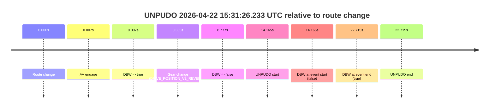
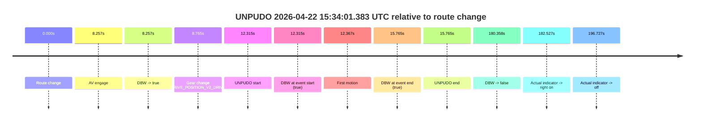
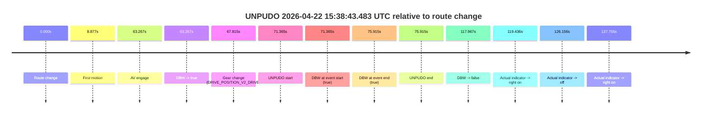
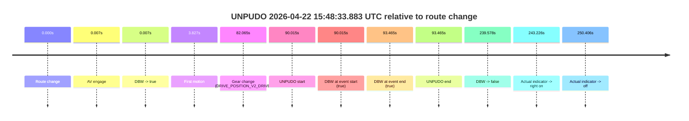
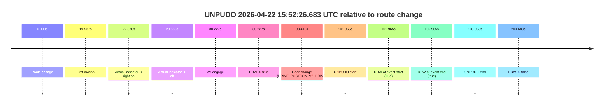
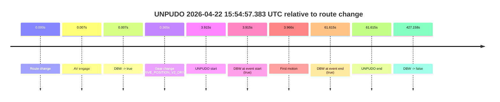
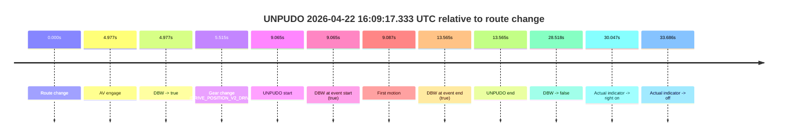
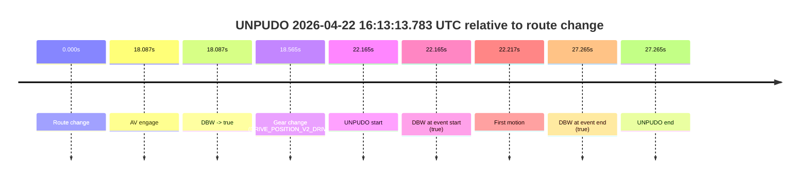

# Run Report: fme10003/2026-04-22--15-19-29--gen2-av-f2bf5f43-ed9b-41c4-9afa-e1dfca8557bb

| Field | Value |
|---|---|
| Run ID | `fme10003/2026-04-22--15-19-29--gen2-av-f2bf5f43-ed9b-41c4-9afa-e1dfca8557bb` |
| Date | `2026-04-22` |
| Model(s) | `eel-teal-outspoken` |
| Author | `zak` |
| Event count | `12` |

## unpudo 2026-04-22 15:31:26.233 UTC

| Field | Value |
|---|---|
| Model | `eel-teal-outspoken` |
| Author | `zak` |
| Run ID | `fme10003/2026-04-22--15-19-29--gen2-av-f2bf5f43-ed9b-41c4-9afa-e1dfca8557bb` |
| Date | `2026-04-22` |
| Time (UTC) | `15:31:26.233` |
| Event type | `unpudo` |
| Disengagement type | `none observed` |
| Route change | `found` |
| Console | [run](https://console.sso.wayve.ai/run/fme10003/2026-04-22--15-19-29--gen2-av-f2bf5f43-ed9b-41c4-9afa-e1dfca8557bb?id=&time-unixus=1776871886233311) |
| Foxglove | [segment](https://app.foxglove.dev/wayve-on-prem/p/prj_0dX18KZdVHg1fmmI/view?ds=foxglove-stream&ds.deviceName=fme10003&ds.start=2026-04-22T15%3A31%3A02.068253Z&ds.end=2026-04-22T15%3A31%3A44.783296Z&layoutId=lay_0e7VD4WIKDQGU73Y&time=2026-04-22T15%3A31%3A26.233311Z) |

### Event card: fail

- Fail: the credited unpudo does not stay AV-owned. The event window starts with DBW false, and the maneuver outcome lands outside a clean AV-owned segment.

| Event | Time (UTC) | Delta from route change |
|---|---:|---:|
| Route change | 2026-04-22 15:31:12.068 | `0.000s` |
| AV engage | 2026-04-22 15:31:12.074 | `0.007s` |
| DBW -> true | 2026-04-22 15:31:12.074 | `0.007s` |
| Gear change (DRIVE_POSITION_V2_REVERSE) | 2026-04-22 15:31:12.433 | `0.365s` |
| DBW -> false | 2026-04-22 15:31:20.845 | `8.777s` |
| UNPUDO start | 2026-04-22 15:31:26.233 | `14.165s` |
| DBW at event start (false) | 2026-04-22 15:31:26.233 | `14.165s` |
| DBW at event end (true) | 2026-04-22 15:31:34.783 | `22.715s` |
| UNPUDO end | 2026-04-22 15:31:34.783 | `22.715s` |

| Metric | Value |
|---|---|
| Outcome | `fail` |
| Effective failure type | `not_av_owned` |
| Route change status | `found` |
| DBW at event start | `false` |
| DBW at event end | `true` |
| Predicted gear at AV start | `DRIVE_POSITION_V2_PARK` |
| Actual gear at AV start | `DRIVE_POSITION_V2_PARK` |
| Predicted gear at event start | `DRIVE_POSITION_V2_REVERSE` |
| Actual gear at event start | `DRIVE_POSITION_V2_REVERSE` |
| Planned indicator direction | `INDICATORS_STATE_V2_OFF` |
| Controller indicator direction | `INDICATORS_STATE_V2_OFF` |
| Actual indicator direction | `INDICATORS_STATE_V2_OFF` |
| Actual indicator at maneuver end | `INDICATORS_STATE_V2_OFF` |
| Driver accel help in AV | `false` |
| Driver accel help timestamp | `n/a` |
| Max accel pedal pct in AV | `0.0%` |
| Max brake pedal pct in AV | `8.9%` |
| Max speed mps in AV | `0.000` |
| Success timing baseline | `route change` |
| Route -> AV | `0.007s` |
| AV -> event start | `14.158s` |
| AV -> first motion | `n/a` |
| Success baseline -> event start | `14.165s` |
| Success baseline -> first motion | `n/a` |
| AV duration before disengagement | `8.771s` |
| Trajectory waypoint count | `37` |
| Driving-plan step count | `11` |

The scored portion starts from the AV-owned window, not from the pre-AV setup. Route-change search in the stopped pre-event segment was `found`, with the baseline therefore set to route change. At the event anchor the model predicts `DRIVE_POSITION_V2_REVERSE` and the actual gear is `DRIVE_POSITION_V2_REVERSE`. The effective model outcome is `fail` because `not_av_owned.`

### Resolution

| Field | Value |
|---|---|
| Final outcome | `fail` |
| Do we agree with this label? | `yes` |
| Source disengagement type | `none observed` |
| Resolved effective failure type | `not_av_owned` |
| Confidence | `high` |

## unpudo 2026-04-22 15:34:01.383 UTC

| Field | Value |
|---|---|
| Model | `eel-teal-outspoken` |
| Author | `zak` |
| Run ID | `fme10003/2026-04-22--15-19-29--gen2-av-f2bf5f43-ed9b-41c4-9afa-e1dfca8557bb` |
| Date | `2026-04-22` |
| Time (UTC) | `15:34:01.383` |
| Event type | `unpudo` |
| Disengagement type | `none observed` |
| Route change | `found` |
| Console | [run](https://console.sso.wayve.ai/run/fme10003/2026-04-22--15-19-29--gen2-av-f2bf5f43-ed9b-41c4-9afa-e1dfca8557bb?id=&time-unixus=1776872041383307) |
| Foxglove | [segment](https://app.foxglove.dev/wayve-on-prem/p/prj_0dX18KZdVHg1fmmI/view?ds=foxglove-stream&ds.deviceName=fme10003&ds.start=2026-04-22T15%3A33%3A39.068261Z&ds.end=2026-04-22T15%3A36%3A59.426192Z&layoutId=lay_0e7VD4WIKDQGU73Y&time=2026-04-22T15%3A34%3A01.383307Z) |

### Event card: pass

- Pass: AV owns the credited unpudo from route change through the official unpudo window, the gear state is aligned at the anchor, and the vehicle moves without driver accelerator help in AV.

| Event | Time (UTC) | Delta from route change |
|---|---:|---:|
| Route change | 2026-04-22 15:33:49.068 | `0.000s` |
| AV engage | 2026-04-22 15:33:57.324 | `8.257s` |
| DBW -> true | 2026-04-22 15:33:57.324 | `8.257s` |
| Gear change (DRIVE_POSITION_V2_DRIVE) | 2026-04-22 15:33:57.833 | `8.765s` |
| UNPUDO start | 2026-04-22 15:34:01.383 | `12.315s` |
| DBW at event start (true) | 2026-04-22 15:34:01.383 | `12.315s` |
| First motion | 2026-04-22 15:34:01.434 | `12.367s` |
| DBW at event end (true) | 2026-04-22 15:34:04.833 | `15.765s` |
| UNPUDO end | 2026-04-22 15:34:04.833 | `15.765s` |
| DBW -> false | 2026-04-22 15:36:49.426 | `180.358s` |
| Actual indicator -> right on | 2026-04-22 15:36:51.595 | `182.527s` |
| Actual indicator -> off | 2026-04-22 15:37:05.795 | `196.727s` |

| Metric | Value |
|---|---|
| Outcome | `pass` |
| Effective failure type | `none` |
| Route change status | `found` |
| DBW at event start | `true` |
| DBW at event end | `true` |
| Predicted gear at AV start | `DRIVE_POSITION_V2_DRIVE` |
| Actual gear at AV start | `DRIVE_POSITION_V2_PARK` |
| Predicted gear at event start | `DRIVE_POSITION_V2_DRIVE` |
| Actual gear at event start | `DRIVE_POSITION_V2_DRIVE` |
| Planned indicator direction | `INDICATORS_STATE_V2_LEFT_ON` |
| Controller indicator direction | `INDICATORS_STATE_V2_LEFT_ON` |
| Actual indicator direction | `INDICATORS_STATE_V2_OFF` |
| Actual indicator at maneuver end | `INDICATORS_STATE_V2_OFF` |
| Driver accel help in AV | `false` |
| Driver accel help timestamp | `n/a` |
| Max accel pedal pct in AV | `0.0%` |
| Max brake pedal pct in AV | `8.0%` |
| Max speed mps in AV | `5.322` |
| Success timing baseline | `route change` |
| Route -> AV | `8.257s` |
| AV -> event start | `4.058s` |
| AV -> first motion | `4.110s` |
| Success baseline -> event start | `12.315s` |
| Success baseline -> first motion | `12.367s` |
| AV duration before disengagement | `172.101s` |
| Trajectory waypoint count | `36` |
| Driving-plan step count | `11` |

The scored portion starts from the AV-owned window, not from the pre-AV setup. Route-change search in the stopped pre-event segment was `found`, with the baseline therefore set to route change. At the event anchor the model predicts `DRIVE_POSITION_V2_DRIVE` and the actual gear is `DRIVE_POSITION_V2_DRIVE`. The effective model outcome is `pass` because `the credited unpudo stays AV-owned through the official unpudo window.`

### Resolution

| Field | Value |
|---|---|
| Final outcome | `pass` |
| Do we agree with this label? | `yes` |
| Source disengagement type | `none observed` |
| Resolved effective failure type | `none` |
| Confidence | `high` |

## unpudo 2026-04-22 15:37:40.983 UTC

| Field | Value |
|---|---|
| Model | `eel-teal-outspoken` |
| Author | `zak` |
| Run ID | `fme10003/2026-04-22--15-19-29--gen2-av-f2bf5f43-ed9b-41c4-9afa-e1dfca8557bb` |
| Date | `2026-04-22` |
| Time (UTC) | `15:37:40.983` |
| Event type | `unpudo` |
| Disengagement type | `none observed` |
| Route change | `found` |
| Console | [run](https://console.sso.wayve.ai/run/fme10003/2026-04-22--15-19-29--gen2-av-f2bf5f43-ed9b-41c4-9afa-e1dfca8557bb?id=&time-unixus=1776872260983291) |
| Foxglove | [segment](https://app.foxglove.dev/wayve-on-prem/p/prj_0dX18KZdVHg1fmmI/view?ds=foxglove-stream&ds.deviceName=fme10003&ds.start=2026-04-22T15%3A37%3A22.118305Z&ds.end=2026-04-22T15%3A38%3A20.905367Z&layoutId=lay_0e7VD4WIKDQGU73Y&time=2026-04-22T15%3A37%3A40.983291Z) |

### Event card: pass

- Pass: AV owns the credited unpudo from route change through the official unpudo window, the gear state is aligned at the anchor, and the vehicle moves without driver accelerator help in AV.

| Event | Time (UTC) | Delta from route change |
|---|---:|---:|
| Route change | 2026-04-22 15:37:32.118 | `0.000s` |
| AV engage | 2026-04-22 15:37:36.964 | `4.847s` |
| DBW -> true | 2026-04-22 15:37:36.964 | `4.847s` |
| Gear change (DRIVE_POSITION_V2_DRIVE) | 2026-04-22 15:37:37.433 | `5.315s` |
| UNPUDO start | 2026-04-22 15:37:40.983 | `8.865s` |
| DBW at event start (true) | 2026-04-22 15:37:40.983 | `8.865s` |
| First motion | 2026-04-22 15:37:40.995 | `8.877s` |
| DBW at event end (true) | 2026-04-22 15:37:44.383 | `12.265s` |
| UNPUDO end | 2026-04-22 15:37:44.383 | `12.265s` |
| DBW -> false | 2026-04-22 15:38:10.905 | `38.787s` |

| Metric | Value |
|---|---|
| Outcome | `pass` |
| Effective failure type | `none` |
| Route change status | `found` |
| DBW at event start | `true` |
| DBW at event end | `true` |
| Predicted gear at AV start | `DRIVE_POSITION_V2_DRIVE` |
| Actual gear at AV start | `DRIVE_POSITION_V2_PARK` |
| Predicted gear at event start | `DRIVE_POSITION_V2_DRIVE` |
| Actual gear at event start | `DRIVE_POSITION_V2_DRIVE` |
| Planned indicator direction | `INDICATORS_STATE_V2_LEFT_ON` |
| Controller indicator direction | `INDICATORS_STATE_V2_LEFT_ON` |
| Actual indicator direction | `INDICATORS_STATE_V2_OFF` |
| Actual indicator at maneuver end | `INDICATORS_STATE_V2_OFF` |
| Driver accel help in AV | `false` |
| Driver accel help timestamp | `n/a` |
| Max accel pedal pct in AV | `0.0%` |
| Max brake pedal pct in AV | `8.0%` |
| Max speed mps in AV | `5.886` |
| Success timing baseline | `route change` |
| Route -> AV | `4.847s` |
| AV -> event start | `4.018s` |
| AV -> first motion | `4.031s` |
| Success baseline -> event start | `8.865s` |
| Success baseline -> first motion | `8.877s` |
| AV duration before disengagement | `33.941s` |
| Trajectory waypoint count | `36` |
| Driving-plan step count | `11` |

The scored portion starts from the AV-owned window, not from the pre-AV setup. Route-change search in the stopped pre-event segment was `found`, with the baseline therefore set to route change. At the event anchor the model predicts `DRIVE_POSITION_V2_DRIVE` and the actual gear is `DRIVE_POSITION_V2_DRIVE`. The effective model outcome is `pass` because `the credited unpudo stays AV-owned through the official unpudo window.`

### Resolution

| Field | Value |
|---|---|
| Final outcome | `pass` |
| Do we agree with this label? | `yes` |
| Source disengagement type | `none observed` |
| Resolved effective failure type | `none` |
| Confidence | `high` |

## unpudo 2026-04-22 15:38:43.483 UTC

| Field | Value |
|---|---|
| Model | `eel-teal-outspoken` |
| Author | `zak` |
| Run ID | `fme10003/2026-04-22--15-19-29--gen2-av-f2bf5f43-ed9b-41c4-9afa-e1dfca8557bb` |
| Date | `2026-04-22` |
| Time (UTC) | `15:38:43.483` |
| Event type | `unpudo` |
| Disengagement type | `none observed` |
| Route change | `found` |
| Console | [run](https://console.sso.wayve.ai/run/fme10003/2026-04-22--15-19-29--gen2-av-f2bf5f43-ed9b-41c4-9afa-e1dfca8557bb?id=&time-unixus=1776872323483314) |
| Foxglove | [segment](https://app.foxglove.dev/wayve-on-prem/p/prj_0dX18KZdVHg1fmmI/view?ds=foxglove-stream&ds.deviceName=fme10003&ds.start=2026-04-22T15%3A37%3A22.118305Z&ds.end=2026-04-22T15%3A39%3A40.085623Z&layoutId=lay_0e7VD4WIKDQGU73Y&time=2026-04-22T15%3A38%3A43.483314Z) |

### Event card: pass

- Pass: AV owns the credited unpudo from route change through the official unpudo window, the gear state is aligned at the anchor, and the vehicle moves without driver accelerator help in AV.

| Event | Time (UTC) | Delta from route change |
|---|---:|---:|
| Route change | 2026-04-22 15:37:32.118 | `0.000s` |
| First motion | 2026-04-22 15:37:40.995 | `8.877s` |
| AV engage | 2026-04-22 15:38:35.384 | `63.267s` |
| DBW -> true | 2026-04-22 15:38:35.384 | `63.267s` |
| Gear change (DRIVE_POSITION_V2_DRIVE) | 2026-04-22 15:38:39.933 | `67.815s` |
| UNPUDO start | 2026-04-22 15:38:43.483 | `71.365s` |
| DBW at event start (true) | 2026-04-22 15:38:43.483 | `71.365s` |
| DBW at event end (true) | 2026-04-22 15:38:48.033 | `75.915s` |
| UNPUDO end | 2026-04-22 15:38:48.033 | `75.915s` |
| DBW -> false | 2026-04-22 15:39:30.085 | `117.967s` |
| Actual indicator -> right on | 2026-04-22 15:39:31.554 | `119.436s` |
| Actual indicator -> off | 2026-04-22 15:39:38.274 | `126.156s` |
| Actual indicator -> right on | 2026-04-22 15:39:49.874 | `137.756s` |

| Metric | Value |
|---|---|
| Outcome | `pass` |
| Effective failure type | `none` |
| Route change status | `found` |
| DBW at event start | `true` |
| DBW at event end | `true` |
| Predicted gear at AV start | `DRIVE_POSITION_V2_PARK` |
| Actual gear at AV start | `DRIVE_POSITION_V2_PARK` |
| Predicted gear at event start | `DRIVE_POSITION_V2_DRIVE` |
| Actual gear at event start | `DRIVE_POSITION_V2_DRIVE` |
| Planned indicator direction | `INDICATORS_STATE_V2_LEFT_ON` |
| Controller indicator direction | `INDICATORS_STATE_V2_LEFT_ON` |
| Actual indicator direction | `INDICATORS_STATE_V2_OFF` |
| Actual indicator at maneuver end | `INDICATORS_STATE_V2_OFF` |
| Driver accel help in AV | `false` |
| Driver accel help timestamp | `n/a` |
| Max accel pedal pct in AV | `0.0%` |
| Max brake pedal pct in AV | `8.0%` |
| Max speed mps in AV | `3.050` |
| Success timing baseline | `route change` |
| Route -> AV | `63.267s` |
| AV -> event start | `8.098s` |
| AV -> first motion | `-54.389s` |
| Success baseline -> event start | `71.365s` |
| Success baseline -> first motion | `8.877s` |
| AV duration before disengagement | `54.701s` |
| Trajectory waypoint count | `36` |
| Driving-plan step count | `11` |

The scored portion starts from the AV-owned window, not from the pre-AV setup. Route-change search in the stopped pre-event segment was `found`, with the baseline therefore set to route change. At the event anchor the model predicts `DRIVE_POSITION_V2_DRIVE` and the actual gear is `DRIVE_POSITION_V2_DRIVE`. The effective model outcome is `pass` because `the credited unpudo stays AV-owned through the official unpudo window.`

### Resolution

| Field | Value |
|---|---|
| Final outcome | `pass` |
| Do we agree with this label? | `yes` |
| Source disengagement type | `none observed` |
| Resolved effective failure type | `none` |
| Confidence | `high` |

## unpudo 2026-04-22 15:47:07.683 UTC

| Field | Value |
|---|---|
| Model | `eel-teal-outspoken` |
| Author | `zak` |
| Run ID | `fme10003/2026-04-22--15-19-29--gen2-av-f2bf5f43-ed9b-41c4-9afa-e1dfca8557bb` |
| Date | `2026-04-22` |
| Time (UTC) | `15:47:07.683` |
| Event type | `unpudo` |
| Disengagement type | `none observed` |
| Route change | `found` |
| Console | [run](https://console.sso.wayve.ai/run/fme10003/2026-04-22--15-19-29--gen2-av-f2bf5f43-ed9b-41c4-9afa-e1dfca8557bb?id=&time-unixus=1776872827683310) |
| Foxglove | [segment](https://app.foxglove.dev/wayve-on-prem/p/prj_0dX18KZdVHg1fmmI/view?ds=foxglove-stream&ds.deviceName=fme10003&ds.start=2026-04-22T15%3A46%3A53.868237Z&ds.end=2026-04-22T15%3A51%3A13.445937Z&layoutId=lay_0e7VD4WIKDQGU73Y&time=2026-04-22T15%3A47%3A07.683310Z) |

### Event card: pass

- Pass: AV owns the credited unpudo from route change through the official unpudo window, the gear state is aligned at the anchor, and the vehicle moves without driver accelerator help in AV.

| Event | Time (UTC) | Delta from route change |
|---|---:|---:|
| Route change | 2026-04-22 15:47:03.868 | `0.000s` |
| AV engage | 2026-04-22 15:47:03.874 | `0.007s` |
| DBW -> true | 2026-04-22 15:47:03.874 | `0.007s` |
| Gear change (DRIVE_POSITION_V2_DRIVE) | 2026-04-22 15:47:04.133 | `0.265s` |
| UNPUDO start | 2026-04-22 15:47:07.683 | `3.815s` |
| DBW at event start (true) | 2026-04-22 15:47:07.683 | `3.815s` |
| First motion | 2026-04-22 15:47:07.695 | `3.827s` |
| DBW at event end (true) | 2026-04-22 15:47:11.083 | `7.215s` |
| UNPUDO end | 2026-04-22 15:47:11.083 | `7.215s` |
| DBW -> false | 2026-04-22 15:51:03.445 | `239.578s` |
| Actual indicator -> right on | 2026-04-22 15:51:07.094 | `243.226s` |
| Actual indicator -> off | 2026-04-22 15:51:14.274 | `250.406s` |

| Metric | Value |
|---|---|
| Outcome | `pass` |
| Effective failure type | `none` |
| Route change status | `found` |
| DBW at event start | `true` |
| DBW at event end | `true` |
| Predicted gear at AV start | `DRIVE_POSITION_V2_PARK` |
| Actual gear at AV start | `DRIVE_POSITION_V2_PARK` |
| Predicted gear at event start | `DRIVE_POSITION_V2_DRIVE` |
| Actual gear at event start | `DRIVE_POSITION_V2_DRIVE` |
| Planned indicator direction | `INDICATORS_STATE_V2_LEFT_ON` |
| Controller indicator direction | `INDICATORS_STATE_V2_LEFT_ON` |
| Actual indicator direction | `INDICATORS_STATE_V2_OFF` |
| Actual indicator at maneuver end | `INDICATORS_STATE_V2_OFF` |
| Driver accel help in AV | `false` |
| Driver accel help timestamp | `n/a` |
| Max accel pedal pct in AV | `0.0%` |
| Max brake pedal pct in AV | `8.0%` |
| Max speed mps in AV | `6.003` |
| Success timing baseline | `route change` |
| Route -> AV | `0.007s` |
| AV -> event start | `3.809s` |
| AV -> first motion | `3.821s` |
| Success baseline -> event start | `3.815s` |
| Success baseline -> first motion | `3.827s` |
| AV duration before disengagement | `239.571s` |
| Trajectory waypoint count | `36` |
| Driving-plan step count | `11` |

The scored portion starts from the AV-owned window, not from the pre-AV setup. Route-change search in the stopped pre-event segment was `found`, with the baseline therefore set to route change. At the event anchor the model predicts `DRIVE_POSITION_V2_DRIVE` and the actual gear is `DRIVE_POSITION_V2_DRIVE`. The effective model outcome is `pass` because `the credited unpudo stays AV-owned through the official unpudo window.`

### Resolution

| Field | Value |
|---|---|
| Final outcome | `pass` |
| Do we agree with this label? | `yes` |
| Source disengagement type | `none observed` |
| Resolved effective failure type | `none` |
| Confidence | `high` |

## unpudo 2026-04-22 15:47:50.683 UTC

| Field | Value |
|---|---|
| Model | `eel-teal-outspoken` |
| Author | `zak` |
| Run ID | `fme10003/2026-04-22--15-19-29--gen2-av-f2bf5f43-ed9b-41c4-9afa-e1dfca8557bb` |
| Date | `2026-04-22` |
| Time (UTC) | `15:47:50.683` |
| Event type | `unpudo` |
| Disengagement type | `none observed` |
| Route change | `found` |
| Console | [run](https://console.sso.wayve.ai/run/fme10003/2026-04-22--15-19-29--gen2-av-f2bf5f43-ed9b-41c4-9afa-e1dfca8557bb?id=&time-unixus=1776872870683297) |
| Foxglove | [segment](https://app.foxglove.dev/wayve-on-prem/p/prj_0dX18KZdVHg1fmmI/view?ds=foxglove-stream&ds.deviceName=fme10003&ds.start=2026-04-22T15%3A46%3A53.868237Z&ds.end=2026-04-22T15%3A51%3A13.445937Z&layoutId=lay_0e7VD4WIKDQGU73Y&time=2026-04-22T15%3A47%3A50.683297Z) |

### Event card: pass

- Pass: AV owns the credited unpudo from route change through the official unpudo window, the gear state is aligned at the anchor, and the vehicle moves without driver accelerator help in AV.

| Event | Time (UTC) | Delta from route change |
|---|---:|---:|
| Route change | 2026-04-22 15:47:03.868 | `0.000s` |
| AV engage | 2026-04-22 15:47:03.874 | `0.007s` |
| DBW -> true | 2026-04-22 15:47:03.874 | `0.007s` |
| First motion | 2026-04-22 15:47:07.695 | `3.827s` |
| Gear change (DRIVE_POSITION_V2_DRIVE) | 2026-04-22 15:47:46.733 | `42.865s` |
| UNPUDO start | 2026-04-22 15:47:50.683 | `46.815s` |
| DBW at event start (true) | 2026-04-22 15:47:50.683 | `46.815s` |
| DBW at event end (true) | 2026-04-22 15:47:54.183 | `50.315s` |
| UNPUDO end | 2026-04-22 15:47:54.183 | `50.315s` |
| DBW -> false | 2026-04-22 15:51:03.445 | `239.578s` |
| Actual indicator -> right on | 2026-04-22 15:51:07.094 | `243.226s` |
| Actual indicator -> off | 2026-04-22 15:51:14.274 | `250.406s` |

| Metric | Value |
|---|---|
| Outcome | `pass` |
| Effective failure type | `none` |
| Route change status | `found` |
| DBW at event start | `true` |
| DBW at event end | `true` |
| Predicted gear at AV start | `DRIVE_POSITION_V2_PARK` |
| Actual gear at AV start | `DRIVE_POSITION_V2_PARK` |
| Predicted gear at event start | `DRIVE_POSITION_V2_DRIVE` |
| Actual gear at event start | `DRIVE_POSITION_V2_DRIVE` |
| Planned indicator direction | `INDICATORS_STATE_V2_LEFT_ON` |
| Controller indicator direction | `INDICATORS_STATE_V2_LEFT_ON` |
| Actual indicator direction | `INDICATORS_STATE_V2_OFF` |
| Actual indicator at maneuver end | `INDICATORS_STATE_V2_OFF` |
| Driver accel help in AV | `false` |
| Driver accel help timestamp | `n/a` |
| Max accel pedal pct in AV | `0.0%` |
| Max brake pedal pct in AV | `8.0%` |
| Max speed mps in AV | `9.256` |
| Success timing baseline | `route change` |
| Route -> AV | `0.007s` |
| AV -> event start | `46.808s` |
| AV -> first motion | `3.821s` |
| Success baseline -> event start | `46.815s` |
| Success baseline -> first motion | `3.827s` |
| AV duration before disengagement | `239.571s` |
| Trajectory waypoint count | `36` |
| Driving-plan step count | `11` |

The scored portion starts from the AV-owned window, not from the pre-AV setup. Route-change search in the stopped pre-event segment was `found`, with the baseline therefore set to route change. At the event anchor the model predicts `DRIVE_POSITION_V2_DRIVE` and the actual gear is `DRIVE_POSITION_V2_DRIVE`. The effective model outcome is `pass` because `the credited unpudo stays AV-owned through the official unpudo window.`

### Resolution

| Field | Value |
|---|---|
| Final outcome | `pass` |
| Do we agree with this label? | `yes` |
| Source disengagement type | `none observed` |
| Resolved effective failure type | `none` |
| Confidence | `high` |

## unpudo 2026-04-22 15:48:33.883 UTC

| Field | Value |
|---|---|
| Model | `eel-teal-outspoken` |
| Author | `zak` |
| Run ID | `fme10003/2026-04-22--15-19-29--gen2-av-f2bf5f43-ed9b-41c4-9afa-e1dfca8557bb` |
| Date | `2026-04-22` |
| Time (UTC) | `15:48:33.883` |
| Event type | `unpudo` |
| Disengagement type | `none observed` |
| Route change | `found` |
| Console | [run](https://console.sso.wayve.ai/run/fme10003/2026-04-22--15-19-29--gen2-av-f2bf5f43-ed9b-41c4-9afa-e1dfca8557bb?id=&time-unixus=1776872913883320) |
| Foxglove | [segment](https://app.foxglove.dev/wayve-on-prem/p/prj_0dX18KZdVHg1fmmI/view?ds=foxglove-stream&ds.deviceName=fme10003&ds.start=2026-04-22T15%3A46%3A53.868237Z&ds.end=2026-04-22T15%3A51%3A13.445937Z&layoutId=lay_0e7VD4WIKDQGU73Y&time=2026-04-22T15%3A48%3A33.883320Z) |

### Event card: pass

- Pass: AV owns the credited unpudo from route change through the official unpudo window, the gear state is aligned at the anchor, and the vehicle moves without driver accelerator help in AV.

| Event | Time (UTC) | Delta from route change |
|---|---:|---:|
| Route change | 2026-04-22 15:47:03.868 | `0.000s` |
| AV engage | 2026-04-22 15:47:03.874 | `0.007s` |
| DBW -> true | 2026-04-22 15:47:03.874 | `0.007s` |
| First motion | 2026-04-22 15:47:07.695 | `3.827s` |
| Gear change (DRIVE_POSITION_V2_DRIVE) | 2026-04-22 15:48:25.933 | `82.065s` |
| UNPUDO start | 2026-04-22 15:48:33.883 | `90.015s` |
| DBW at event start (true) | 2026-04-22 15:48:33.883 | `90.015s` |
| DBW at event end (true) | 2026-04-22 15:48:37.333 | `93.465s` |
| UNPUDO end | 2026-04-22 15:48:37.333 | `93.465s` |
| DBW -> false | 2026-04-22 15:51:03.445 | `239.578s` |
| Actual indicator -> right on | 2026-04-22 15:51:07.094 | `243.226s` |
| Actual indicator -> off | 2026-04-22 15:51:14.274 | `250.406s` |

| Metric | Value |
|---|---|
| Outcome | `pass` |
| Effective failure type | `none` |
| Route change status | `found` |
| DBW at event start | `true` |
| DBW at event end | `true` |
| Predicted gear at AV start | `DRIVE_POSITION_V2_PARK` |
| Actual gear at AV start | `DRIVE_POSITION_V2_PARK` |
| Predicted gear at event start | `DRIVE_POSITION_V2_DRIVE` |
| Actual gear at event start | `DRIVE_POSITION_V2_DRIVE` |
| Planned indicator direction | `INDICATORS_STATE_V2_LEFT_ON` |
| Controller indicator direction | `INDICATORS_STATE_V2_LEFT_ON` |
| Actual indicator direction | `INDICATORS_STATE_V2_OFF` |
| Actual indicator at maneuver end | `INDICATORS_STATE_V2_OFF` |
| Driver accel help in AV | `false` |
| Driver accel help timestamp | `n/a` |
| Max accel pedal pct in AV | `0.0%` |
| Max brake pedal pct in AV | `8.0%` |
| Max speed mps in AV | `9.256` |
| Success timing baseline | `route change` |
| Route -> AV | `0.007s` |
| AV -> event start | `90.009s` |
| AV -> first motion | `3.821s` |
| Success baseline -> event start | `90.015s` |
| Success baseline -> first motion | `3.827s` |
| AV duration before disengagement | `239.571s` |
| Trajectory waypoint count | `36` |
| Driving-plan step count | `11` |

The scored portion starts from the AV-owned window, not from the pre-AV setup. Route-change search in the stopped pre-event segment was `found`, with the baseline therefore set to route change. At the event anchor the model predicts `DRIVE_POSITION_V2_DRIVE` and the actual gear is `DRIVE_POSITION_V2_DRIVE`. The effective model outcome is `pass` because `the credited unpudo stays AV-owned through the official unpudo window.`

### Resolution

| Field | Value |
|---|---|
| Final outcome | `pass` |
| Do we agree with this label? | `yes` |
| Source disengagement type | `none observed` |
| Resolved effective failure type | `none` |
| Confidence | `high` |

## unpudo 2026-04-22 15:49:25.483 UTC

| Field | Value |
|---|---|
| Model | `eel-teal-outspoken` |
| Author | `zak` |
| Run ID | `fme10003/2026-04-22--15-19-29--gen2-av-f2bf5f43-ed9b-41c4-9afa-e1dfca8557bb` |
| Date | `2026-04-22` |
| Time (UTC) | `15:49:25.483` |
| Event type | `unpudo` |
| Disengagement type | `none observed` |
| Route change | `found` |
| Console | [run](https://console.sso.wayve.ai/run/fme10003/2026-04-22--15-19-29--gen2-av-f2bf5f43-ed9b-41c4-9afa-e1dfca8557bb?id=&time-unixus=1776872965483315) |
| Foxglove | [segment](https://app.foxglove.dev/wayve-on-prem/p/prj_0dX18KZdVHg1fmmI/view?ds=foxglove-stream&ds.deviceName=fme10003&ds.start=2026-04-22T15%3A47%3A36.468258Z&ds.end=2026-04-22T15%3A51%3A13.445937Z&layoutId=lay_0e7VD4WIKDQGU73Y&time=2026-04-22T15%3A49%3A25.483315Z) |

### Event card: pass

- Pass: AV owns the credited unpudo from route change through the official unpudo window, the gear state is aligned at the anchor, and the vehicle moves without driver accelerator help in AV.

| Event | Time (UTC) | Delta from route change |
|---|---:|---:|
| Route change | 2026-04-22 15:47:46.468 | `0.000s` |
| AV engage | 2026-04-22 15:47:46.474 | `0.007s` |
| DBW -> true | 2026-04-22 15:47:46.474 | `0.007s` |
| First motion | 2026-04-22 15:47:50.714 | `4.246s` |
| Gear change (DRIVE_POSITION_V2_DRIVE) | 2026-04-22 15:49:21.833 | `95.365s` |
| UNPUDO start | 2026-04-22 15:49:25.483 | `99.015s` |
| DBW at event start (true) | 2026-04-22 15:49:25.483 | `99.015s` |
| DBW at event end (true) | 2026-04-22 15:49:29.483 | `103.015s` |
| UNPUDO end | 2026-04-22 15:49:29.483 | `103.015s` |
| DBW -> false | 2026-04-22 15:51:03.445 | `196.978s` |
| Actual indicator -> right on | 2026-04-22 15:51:07.094 | `200.626s` |
| Actual indicator -> off | 2026-04-22 15:51:14.274 | `207.806s` |

| Metric | Value |
|---|---|
| Outcome | `pass` |
| Effective failure type | `none` |
| Route change status | `found` |
| DBW at event start | `true` |
| DBW at event end | `true` |
| Predicted gear at AV start | `DRIVE_POSITION_V2_PARK` |
| Actual gear at AV start | `DRIVE_POSITION_V2_PARK` |
| Predicted gear at event start | `DRIVE_POSITION_V2_DRIVE` |
| Actual gear at event start | `DRIVE_POSITION_V2_DRIVE` |
| Planned indicator direction | `INDICATORS_STATE_V2_LEFT_ON` |
| Controller indicator direction | `INDICATORS_STATE_V2_LEFT_ON` |
| Actual indicator direction | `INDICATORS_STATE_V2_OFF` |
| Actual indicator at maneuver end | `INDICATORS_STATE_V2_OFF` |
| Driver accel help in AV | `false` |
| Driver accel help timestamp | `n/a` |
| Max accel pedal pct in AV | `0.0%` |
| Max brake pedal pct in AV | `8.0%` |
| Max speed mps in AV | `12.472` |
| Success timing baseline | `route change` |
| Route -> AV | `0.007s` |
| AV -> event start | `99.008s` |
| AV -> first motion | `4.240s` |
| Success baseline -> event start | `99.015s` |
| Success baseline -> first motion | `4.246s` |
| AV duration before disengagement | `196.971s` |
| Trajectory waypoint count | `36` |
| Driving-plan step count | `11` |

The scored portion starts from the AV-owned window, not from the pre-AV setup. Route-change search in the stopped pre-event segment was `found`, with the baseline therefore set to route change. At the event anchor the model predicts `DRIVE_POSITION_V2_DRIVE` and the actual gear is `DRIVE_POSITION_V2_DRIVE`. The effective model outcome is `pass` because `the credited unpudo stays AV-owned through the official unpudo window.`

### Resolution

| Field | Value |
|---|---|
| Final outcome | `pass` |
| Do we agree with this label? | `yes` |
| Source disengagement type | `none observed` |
| Resolved effective failure type | `none` |
| Confidence | `high` |

## unpudo 2026-04-22 15:52:26.683 UTC

| Field | Value |
|---|---|
| Model | `eel-teal-outspoken` |
| Author | `zak` |
| Run ID | `fme10003/2026-04-22--15-19-29--gen2-av-f2bf5f43-ed9b-41c4-9afa-e1dfca8557bb` |
| Date | `2026-04-22` |
| Time (UTC) | `15:52:26.683` |
| Event type | `unpudo` |
| Disengagement type | `none observed` |
| Route change | `found` |
| Console | [run](https://console.sso.wayve.ai/run/fme10003/2026-04-22--15-19-29--gen2-av-f2bf5f43-ed9b-41c4-9afa-e1dfca8557bb?id=&time-unixus=1776873146683311) |
| Foxglove | [segment](https://app.foxglove.dev/wayve-on-prem/p/prj_0dX18KZdVHg1fmmI/view?ds=foxglove-stream&ds.deviceName=fme10003&ds.start=2026-04-22T15%3A50%3A34.718249Z&ds.end=2026-04-22T15%3A54%3A15.406132Z&layoutId=lay_0e7VD4WIKDQGU73Y&time=2026-04-22T15%3A52%3A26.683311Z) |

### Event card: pass

- Pass: AV owns the credited unpudo from route change through the official unpudo window, the gear state is aligned at the anchor, and the vehicle moves without driver accelerator help in AV.

| Event | Time (UTC) | Delta from route change |
|---|---:|---:|
| Route change | 2026-04-22 15:50:44.718 | `0.000s` |
| First motion | 2026-04-22 15:51:04.255 | `19.537s` |
| Actual indicator -> right on | 2026-04-22 15:51:07.094 | `22.376s` |
| Actual indicator -> off | 2026-04-22 15:51:14.274 | `29.556s` |
| AV engage | 2026-04-22 15:51:14.945 | `30.227s` |
| DBW -> true | 2026-04-22 15:51:14.945 | `30.227s` |
| Gear change (DRIVE_POSITION_V2_DRIVE) | 2026-04-22 15:52:23.133 | `98.415s` |
| UNPUDO start | 2026-04-22 15:52:26.683 | `101.965s` |
| DBW at event start (true) | 2026-04-22 15:52:26.683 | `101.965s` |
| DBW at event end (true) | 2026-04-22 15:52:30.683 | `105.965s` |
| UNPUDO end | 2026-04-22 15:52:30.683 | `105.965s` |
| DBW -> false | 2026-04-22 15:54:05.406 | `200.688s` |

| Metric | Value |
|---|---|
| Outcome | `pass` |
| Effective failure type | `none` |
| Route change status | `found` |
| DBW at event start | `true` |
| DBW at event end | `true` |
| Predicted gear at AV start | `DRIVE_POSITION_V2_DRIVE` |
| Actual gear at AV start | `DRIVE_POSITION_V2_DRIVE` |
| Predicted gear at event start | `DRIVE_POSITION_V2_DRIVE` |
| Actual gear at event start | `DRIVE_POSITION_V2_DRIVE` |
| Planned indicator direction | `INDICATORS_STATE_V2_LEFT_ON` |
| Controller indicator direction | `INDICATORS_STATE_V2_LEFT_ON` |
| Actual indicator direction | `INDICATORS_STATE_V2_OFF` |
| Actual indicator at maneuver end | `INDICATORS_STATE_V2_OFF` |
| Driver accel help in AV | `false` |
| Driver accel help timestamp | `n/a` |
| Max accel pedal pct in AV | `0.0%` |
| Max brake pedal pct in AV | `8.0%` |
| Max speed mps in AV | `10.208` |
| Success timing baseline | `route change` |
| Route -> AV | `30.227s` |
| AV -> event start | `71.738s` |
| AV -> first motion | `-10.690s` |
| Success baseline -> event start | `101.965s` |
| Success baseline -> first motion | `19.537s` |
| AV duration before disengagement | `170.461s` |
| Trajectory waypoint count | `36` |
| Driving-plan step count | `11` |

The scored portion starts from the AV-owned window, not from the pre-AV setup. Route-change search in the stopped pre-event segment was `found`, with the baseline therefore set to route change. At the event anchor the model predicts `DRIVE_POSITION_V2_DRIVE` and the actual gear is `DRIVE_POSITION_V2_DRIVE`. The effective model outcome is `pass` because `the credited unpudo stays AV-owned through the official unpudo window.`

### Resolution

| Field | Value |
|---|---|
| Final outcome | `pass` |
| Do we agree with this label? | `yes` |
| Source disengagement type | `none observed` |
| Resolved effective failure type | `none` |
| Confidence | `high` |

## unpudo 2026-04-22 15:54:57.383 UTC

| Field | Value |
|---|---|
| Model | `eel-teal-outspoken` |
| Author | `zak` |
| Run ID | `fme10003/2026-04-22--15-19-29--gen2-av-f2bf5f43-ed9b-41c4-9afa-e1dfca8557bb` |
| Date | `2026-04-22` |
| Time (UTC) | `15:54:57.383` |
| Event type | `unpudo` |
| Disengagement type | `none observed` |
| Route change | `found` |
| Console | [run](https://console.sso.wayve.ai/run/fme10003/2026-04-22--15-19-29--gen2-av-f2bf5f43-ed9b-41c4-9afa-e1dfca8557bb?id=&time-unixus=1776873297383311) |
| Foxglove | [segment](https://app.foxglove.dev/wayve-on-prem/p/prj_0dX18KZdVHg1fmmI/view?ds=foxglove-stream&ds.deviceName=fme10003&ds.start=2026-04-22T15%3A54%3A43.468339Z&ds.end=2026-04-22T16%3A02%3A10.626135Z&layoutId=lay_0e7VD4WIKDQGU73Y&time=2026-04-22T15%3A54%3A57.383311Z) |

### Event card: pass

- Pass: AV owns the credited unpudo from route change through the official unpudo window, the gear state is aligned at the anchor, and the vehicle moves without driver accelerator help in AV.

| Event | Time (UTC) | Delta from route change |
|---|---:|---:|
| Route change | 2026-04-22 15:54:53.468 | `0.000s` |
| AV engage | 2026-04-22 15:54:53.475 | `0.007s` |
| DBW -> true | 2026-04-22 15:54:53.475 | `0.007s` |
| Gear change (DRIVE_POSITION_V2_DRIVE) | 2026-04-22 15:54:53.833 | `0.365s` |
| UNPUDO start | 2026-04-22 15:54:57.383 | `3.915s` |
| DBW at event start (true) | 2026-04-22 15:54:57.383 | `3.915s` |
| First motion | 2026-04-22 15:54:57.434 | `3.966s` |
| DBW at event end (true) | 2026-04-22 15:55:55.083 | `61.615s` |
| UNPUDO end | 2026-04-22 15:55:55.083 | `61.615s` |
| DBW -> false | 2026-04-22 16:02:00.626 | `427.158s` |

| Metric | Value |
|---|---|
| Outcome | `pass` |
| Effective failure type | `none` |
| Route change status | `found` |
| DBW at event start | `true` |
| DBW at event end | `true` |
| Predicted gear at AV start | `DRIVE_POSITION_V2_PARK` |
| Actual gear at AV start | `DRIVE_POSITION_V2_PARK` |
| Predicted gear at event start | `DRIVE_POSITION_V2_DRIVE` |
| Actual gear at event start | `DRIVE_POSITION_V2_DRIVE` |
| Planned indicator direction | `INDICATORS_STATE_V2_OFF` |
| Controller indicator direction | `INDICATORS_STATE_V2_OFF` |
| Actual indicator direction | `INDICATORS_STATE_V2_OFF` |
| Actual indicator at maneuver end | `INDICATORS_STATE_V2_OFF` |
| Driver accel help in AV | `false` |
| Driver accel help timestamp | `n/a` |
| Max accel pedal pct in AV | `0.0%` |
| Max brake pedal pct in AV | `26.0%` |
| Max speed mps in AV | `2.300` |
| Success timing baseline | `route change` |
| Route -> AV | `0.007s` |
| AV -> event start | `3.908s` |
| AV -> first motion | `3.959s` |
| Success baseline -> event start | `3.915s` |
| Success baseline -> first motion | `3.966s` |
| AV duration before disengagement | `427.151s` |
| Trajectory waypoint count | `36` |
| Driving-plan step count | `11` |

The scored portion starts from the AV-owned window, not from the pre-AV setup. Route-change search in the stopped pre-event segment was `found`, with the baseline therefore set to route change. At the event anchor the model predicts `DRIVE_POSITION_V2_DRIVE` and the actual gear is `DRIVE_POSITION_V2_DRIVE`. The effective model outcome is `pass` because `the credited unpudo stays AV-owned through the official unpudo window.`

### Resolution

| Field | Value |
|---|---|
| Final outcome | `pass` |
| Do we agree with this label? | `yes` |
| Source disengagement type | `none observed` |
| Resolved effective failure type | `none` |
| Confidence | `high` |

## unpudo 2026-04-22 16:09:17.333 UTC

| Field | Value |
|---|---|
| Model | `eel-teal-outspoken` |
| Author | `zak` |
| Run ID | `fme10003/2026-04-22--15-19-29--gen2-av-f2bf5f43-ed9b-41c4-9afa-e1dfca8557bb` |
| Date | `2026-04-22` |
| Time (UTC) | `16:09:17.333` |
| Event type | `unpudo` |
| Disengagement type | `none observed` |
| Route change | `found` |
| Console | [run](https://console.sso.wayve.ai/run/fme10003/2026-04-22--15-19-29--gen2-av-f2bf5f43-ed9b-41c4-9afa-e1dfca8557bb?id=&time-unixus=1776874157333302) |
| Foxglove | [segment](https://app.foxglove.dev/wayve-on-prem/p/prj_0dX18KZdVHg1fmmI/view?ds=foxglove-stream&ds.deviceName=fme10003&ds.start=2026-04-22T16%3A08%3A58.268248Z&ds.end=2026-04-22T16%3A09%3A46.785930Z&layoutId=lay_0e7VD4WIKDQGU73Y&time=2026-04-22T16%3A09%3A17.333302Z) |

### Event card: pass

- Pass: AV owns the credited unpudo from route change through the official unpudo window, the gear state is aligned at the anchor, and the vehicle moves without driver accelerator help in AV.

| Event | Time (UTC) | Delta from route change |
|---|---:|---:|
| Route change | 2026-04-22 16:09:08.268 | `0.000s` |
| AV engage | 2026-04-22 16:09:13.244 | `4.977s` |
| DBW -> true | 2026-04-22 16:09:13.244 | `4.977s` |
| Gear change (DRIVE_POSITION_V2_DRIVE) | 2026-04-22 16:09:13.783 | `5.515s` |
| UNPUDO start | 2026-04-22 16:09:17.333 | `9.065s` |
| DBW at event start (true) | 2026-04-22 16:09:17.333 | `9.065s` |
| First motion | 2026-04-22 16:09:17.355 | `9.087s` |
| DBW at event end (true) | 2026-04-22 16:09:21.833 | `13.565s` |
| UNPUDO end | 2026-04-22 16:09:21.833 | `13.565s` |
| DBW -> false | 2026-04-22 16:09:36.785 | `28.518s` |
| Actual indicator -> right on | 2026-04-22 16:09:38.315 | `30.047s` |
| Actual indicator -> off | 2026-04-22 16:09:41.954 | `33.686s` |

| Metric | Value |
|---|---|
| Outcome | `pass` |
| Effective failure type | `none` |
| Route change status | `found` |
| DBW at event start | `true` |
| DBW at event end | `true` |
| Predicted gear at AV start | `DRIVE_POSITION_V2_DRIVE` |
| Actual gear at AV start | `DRIVE_POSITION_V2_PARK` |
| Predicted gear at event start | `DRIVE_POSITION_V2_DRIVE` |
| Actual gear at event start | `DRIVE_POSITION_V2_DRIVE` |
| Planned indicator direction | `INDICATORS_STATE_V2_OFF` |
| Controller indicator direction | `INDICATORS_STATE_V2_OFF` |
| Actual indicator direction | `INDICATORS_STATE_V2_OFF` |
| Actual indicator at maneuver end | `INDICATORS_STATE_V2_OFF` |
| Driver accel help in AV | `false` |
| Driver accel help timestamp | `n/a` |
| Max accel pedal pct in AV | `0.0%` |
| Max brake pedal pct in AV | `8.0%` |
| Max speed mps in AV | `2.719` |
| Success timing baseline | `route change` |
| Route -> AV | `4.977s` |
| AV -> event start | `4.089s` |
| AV -> first motion | `4.110s` |
| Success baseline -> event start | `9.065s` |
| Success baseline -> first motion | `9.087s` |
| AV duration before disengagement | `23.541s` |
| Trajectory waypoint count | `37` |
| Driving-plan step count | `11` |

The scored portion starts from the AV-owned window, not from the pre-AV setup. Route-change search in the stopped pre-event segment was `found`, with the baseline therefore set to route change. At the event anchor the model predicts `DRIVE_POSITION_V2_DRIVE` and the actual gear is `DRIVE_POSITION_V2_DRIVE`. The effective model outcome is `pass` because `the credited unpudo stays AV-owned through the official unpudo window.`

### Resolution

| Field | Value |
|---|---|
| Final outcome | `pass` |
| Do we agree with this label? | `yes` |
| Source disengagement type | `none observed` |
| Resolved effective failure type | `none` |
| Confidence | `high` |

## unpudo 2026-04-22 16:13:13.783 UTC

| Field | Value |
|---|---|
| Model | `eel-teal-outspoken` |
| Author | `zak` |
| Run ID | `fme10003/2026-04-22--15-19-29--gen2-av-f2bf5f43-ed9b-41c4-9afa-e1dfca8557bb` |
| Date | `2026-04-22` |
| Time (UTC) | `16:13:13.783` |
| Event type | `unpudo` |
| Disengagement type | `none observed` |
| Route change | `found` |
| Console | [run](https://console.sso.wayve.ai/run/fme10003/2026-04-22--15-19-29--gen2-av-f2bf5f43-ed9b-41c4-9afa-e1dfca8557bb?id=&time-unixus=1776874393783307) |
| Foxglove | [segment](https://app.foxglove.dev/wayve-on-prem/p/prj_0dX18KZdVHg1fmmI/view?ds=foxglove-stream&ds.deviceName=fme10003&ds.start=2026-04-22T16%3A12%3A41.618257Z&ds.end=2026-04-22T16%3A13%3A28.883292Z&layoutId=lay_0e7VD4WIKDQGU73Y&time=2026-04-22T16%3A13%3A13.783307Z) |

### Event card: pass

- Pass: AV owns the credited unpudo from route change through the official unpudo window, the gear state is aligned at the anchor, and the vehicle moves without driver accelerator help in AV.

| Event | Time (UTC) | Delta from route change |
|---|---:|---:|
| Route change | 2026-04-22 16:12:51.618 | `0.000s` |
| AV engage | 2026-04-22 16:13:09.704 | `18.087s` |
| DBW -> true | 2026-04-22 16:13:09.704 | `18.087s` |
| Gear change (DRIVE_POSITION_V2_DRIVE) | 2026-04-22 16:13:10.183 | `18.565s` |
| UNPUDO start | 2026-04-22 16:13:13.783 | `22.165s` |
| DBW at event start (true) | 2026-04-22 16:13:13.783 | `22.165s` |
| First motion | 2026-04-22 16:13:13.834 | `22.217s` |
| DBW at event end (true) | 2026-04-22 16:13:18.883 | `27.265s` |
| UNPUDO end | 2026-04-22 16:13:18.883 | `27.265s` |

| Metric | Value |
|---|---|
| Outcome | `pass` |
| Effective failure type | `none` |
| Route change status | `found` |
| DBW at event start | `true` |
| DBW at event end | `true` |
| Predicted gear at AV start | `DRIVE_POSITION_V2_DRIVE` |
| Actual gear at AV start | `DRIVE_POSITION_V2_PARK` |
| Predicted gear at event start | `DRIVE_POSITION_V2_DRIVE` |
| Actual gear at event start | `DRIVE_POSITION_V2_DRIVE` |
| Planned indicator direction | `INDICATORS_STATE_V2_OFF` |
| Controller indicator direction | `INDICATORS_STATE_V2_OFF` |
| Actual indicator direction | `INDICATORS_STATE_V2_OFF` |
| Actual indicator at maneuver end | `INDICATORS_STATE_V2_OFF` |
| Driver accel help in AV | `false` |
| Driver accel help timestamp | `n/a` |
| Max accel pedal pct in AV | `0.0%` |
| Max brake pedal pct in AV | `8.0%` |
| Max speed mps in AV | `2.594` |
| Success timing baseline | `route change` |
| Route -> AV | `18.087s` |
| AV -> event start | `4.079s` |
| AV -> first motion | `4.130s` |
| Success baseline -> event start | `22.165s` |
| Success baseline -> first motion | `22.217s` |
| AV duration before disengagement | `n/a` |
| Trajectory waypoint count | `36` |
| Driving-plan step count | `11` |

The scored portion starts from the AV-owned window, not from the pre-AV setup. Route-change search in the stopped pre-event segment was `found`, with the baseline therefore set to route change. At the event anchor the model predicts `DRIVE_POSITION_V2_DRIVE` and the actual gear is `DRIVE_POSITION_V2_DRIVE`. The effective model outcome is `pass` because `the credited unpudo stays AV-owned through the official unpudo window.`

### Resolution

| Field | Value |
|---|---|
| Final outcome | `pass` |
| Do we agree with this label? | `yes` |
| Source disengagement type | `none observed` |
| Resolved effective failure type | `none` |
| Confidence | `high` |
