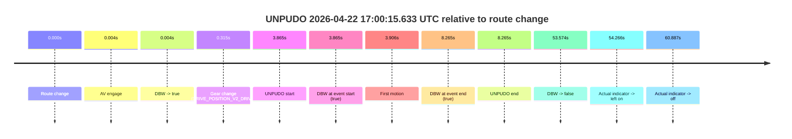
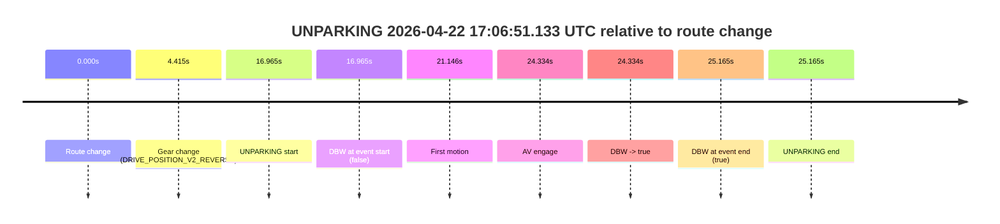

# Run Report: fme10003/2026-04-22--16-45-34--gen2-av-1ab30619-caf1-4f23-b5f0-bb02c1a94628

| Field | Value |
|---|---|
| Run ID | `fme10003/2026-04-22--16-45-34--gen2-av-1ab30619-caf1-4f23-b5f0-bb02c1a94628` |
| Date | `2026-04-22` |
| Model(s) | `eel-teal-outspoken` |
| Author | `zak` |
| Event count | `2` |

## unpudo 2026-04-22 17:00:15.633 UTC

| Field | Value |
|---|---|
| Model | `eel-teal-outspoken` |
| Author | `zak` |
| Run ID | `fme10003/2026-04-22--16-45-34--gen2-av-1ab30619-caf1-4f23-b5f0-bb02c1a94628` |
| Date | `2026-04-22` |
| Time (UTC) | `17:00:15.633` |
| Event type | `unpudo` |
| Disengagement type | `none observed` |
| Route change | `found` |
| Console | [run](https://console.sso.wayve.ai/run/fme10003/2026-04-22--16-45-34--gen2-av-1ab30619-caf1-4f23-b5f0-bb02c1a94628?id=&time-unixus=1776877215633315) |
| Foxglove | [segment](https://app.foxglove.dev/wayve-on-prem/p/prj_0dX18KZdVHg1fmmI/view?ds=foxglove-stream&ds.deviceName=fme10003&ds.start=2026-04-22T17%3A00%3A01.768245Z&ds.end=2026-04-22T17%3A01%3A15.342412Z&layoutId=lay_0e7VD4WIKDQGU73Y&time=2026-04-22T17%3A00%3A15.633315Z) |

### Event card: pass

- Pass: AV owns the credited unpudo from route change through the official unpudo window, the gear state is aligned at the anchor, and the vehicle moves without driver accelerator help in AV.

| Event | Time (UTC) | Delta from route change |
|---|---:|---:|
| Route change | 2026-04-22 17:00:11.768 | `0.000s` |
| AV engage | 2026-04-22 17:00:11.771 | `0.004s` |
| DBW -> true | 2026-04-22 17:00:11.771 | `0.004s` |
| Gear change (DRIVE_POSITION_V2_DRIVE) | 2026-04-22 17:00:12.083 | `0.315s` |
| UNPUDO start | 2026-04-22 17:00:15.633 | `3.865s` |
| DBW at event start (true) | 2026-04-22 17:00:15.633 | `3.865s` |
| First motion | 2026-04-22 17:00:15.674 | `3.906s` |
| DBW at event end (true) | 2026-04-22 17:00:20.033 | `8.265s` |
| UNPUDO end | 2026-04-22 17:00:20.033 | `8.265s` |
| DBW -> false | 2026-04-22 17:01:05.342 | `53.574s` |
| Actual indicator -> left on | 2026-04-22 17:01:06.034 | `54.266s` |
| Actual indicator -> off | 2026-04-22 17:01:12.654 | `60.887s` |

| Metric | Value |
|---|---|
| Outcome | `pass` |
| Effective failure type | `none` |
| Route change status | `found` |
| DBW at event start | `true` |
| DBW at event end | `true` |
| Predicted gear at AV start | `DRIVE_POSITION_V2_PARK` |
| Actual gear at AV start | `DRIVE_POSITION_V2_PARK` |
| Predicted gear at event start | `DRIVE_POSITION_V2_DRIVE` |
| Actual gear at event start | `DRIVE_POSITION_V2_DRIVE` |
| Planned indicator direction | `INDICATORS_STATE_V2_OFF` |
| Controller indicator direction | `INDICATORS_STATE_V2_OFF` |
| Actual indicator direction | `INDICATORS_STATE_V2_OFF` |
| Actual indicator at maneuver end | `INDICATORS_STATE_V2_OFF` |
| Driver accel help in AV | `false` |
| Driver accel help timestamp | `n/a` |
| Max accel pedal pct in AV | `0.0%` |
| Max brake pedal pct in AV | `8.0%` |
| Max speed mps in AV | `2.797` |
| Success timing baseline | `route change` |
| Route -> AV | `0.004s` |
| AV -> event start | `3.862s` |
| AV -> first motion | `3.903s` |
| Success baseline -> event start | `3.865s` |
| Success baseline -> first motion | `3.906s` |
| AV duration before disengagement | `53.571s` |
| Trajectory waypoint count | `38` |
| Driving-plan step count | `11` |

The scored portion starts from the AV-owned window, not from the pre-AV setup. Route-change search in the stopped pre-event segment was `found`, with the baseline therefore set to route change. At the event anchor the model predicts `DRIVE_POSITION_V2_DRIVE` and the actual gear is `DRIVE_POSITION_V2_DRIVE`. The effective model outcome is `pass` because `the credited unpudo stays AV-owned through the official unpudo window.`

### Resolution

| Field | Value |
|---|---|
| Final outcome | `pass` |
| Do we agree with this label? | `yes` |
| Source disengagement type | `none observed` |
| Resolved effective failure type | `none` |
| Confidence | `high` |

## unparking 2026-04-22 17:06:51.133 UTC

| Field | Value |
|---|---|
| Model | `eel-teal-outspoken` |
| Author | `zak` |
| Run ID | `fme10003/2026-04-22--16-45-34--gen2-av-1ab30619-caf1-4f23-b5f0-bb02c1a94628` |
| Date | `2026-04-22` |
| Time (UTC) | `17:06:51.133` |
| Event type | `unparking` |
| Disengagement type | `none observed` |
| Route change | `found` |
| Console | [run](https://console.sso.wayve.ai/run/fme10003/2026-04-22--16-45-34--gen2-av-1ab30619-caf1-4f23-b5f0-bb02c1a94628?id=&time-unixus=1776877611133313) |
| Foxglove | [segment](https://app.foxglove.dev/wayve-on-prem/p/prj_0dX18KZdVHg1fmmI/view?ds=foxglove-stream&ds.deviceName=fme10003&ds.start=2026-04-22T17%3A06%3A24.168336Z&ds.end=2026-04-22T17%3A07%3A09.333315Z&layoutId=lay_0e7VD4WIKDQGU73Y&time=2026-04-22T17%3A06%3A51.133313Z) |

### Event card: accidental

- Accidental: AV ownership is present for less than `2s`, so this is treated as an accidental brush with the maneuver rather than a meaningful model attempt.

| Event | Time (UTC) | Delta from route change |
|---|---:|---:|
| Route change | 2026-04-22 17:06:34.168 | `0.000s` |
| Gear change (DRIVE_POSITION_V2_REVERSE) | 2026-04-22 17:06:38.583 | `4.415s` |
| UNPARKING start | 2026-04-22 17:06:51.133 | `16.965s` |
| DBW at event start (false) | 2026-04-22 17:06:51.133 | `16.965s` |
| First motion | 2026-04-22 17:06:55.314 | `21.146s` |
| AV engage | 2026-04-22 17:06:58.502 | `24.334s` |
| DBW -> true | 2026-04-22 17:06:58.502 | `24.334s` |
| DBW at event end (true) | 2026-04-22 17:06:59.333 | `25.165s` |
| UNPARKING end | 2026-04-22 17:06:59.333 | `25.165s` |

| Metric | Value |
|---|---|
| Outcome | `accidental` |
| Effective failure type | `none` |
| Route change status | `found` |
| DBW at event start | `false` |
| DBW at event end | `true` |
| Predicted gear at AV start | `DRIVE_POSITION_V2_DRIVE` |
| Actual gear at AV start | `DRIVE_POSITION_V2_DRIVE` |
| Predicted gear at event start | `DRIVE_POSITION_V2_REVERSE` |
| Actual gear at event start | `DRIVE_POSITION_V2_REVERSE` |
| Planned indicator direction | `INDICATORS_STATE_V2_OFF` |
| Controller indicator direction | `INDICATORS_STATE_V2_OFF` |
| Actual indicator direction | `INDICATORS_STATE_V2_OFF` |
| Actual indicator at maneuver end | `INDICATORS_STATE_V2_OFF` |
| Driver accel help in AV | `false` |
| Driver accel help timestamp | `n/a` |
| Max accel pedal pct in AV | `0.0%` |
| Max brake pedal pct in AV | `0.0%` |
| Max speed mps in AV | `3.086` |
| Success timing baseline | `route change` |
| Route -> AV | `24.334s` |
| AV -> event start | `-7.369s` |
| AV -> first motion | `-3.188s` |
| Success baseline -> event start | `16.965s` |
| Success baseline -> first motion | `21.146s` |
| AV duration before disengagement | `n/a` |
| Trajectory waypoint count | `38` |
| Driving-plan step count | `11` |

The scored portion starts from the AV-owned window, not from the pre-AV setup. Route-change search in the stopped pre-event segment was `found`, with the baseline therefore set to route change. At the event anchor the model predicts `DRIVE_POSITION_V2_REVERSE` and the actual gear is `DRIVE_POSITION_V2_REVERSE`. The effective model outcome is `accidental` because `the AV-owned portion is shorter than 2s.`

### Resolution

| Field | Value |
|---|---|
| Final outcome | `accidental` |
| Do we agree with this label? | `yes` |
| Source disengagement type | `none observed` |
| Resolved effective failure type | `none` |
| Confidence | `high` |
