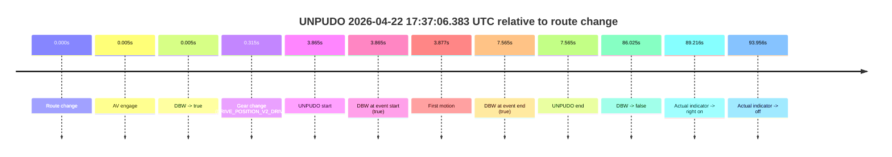
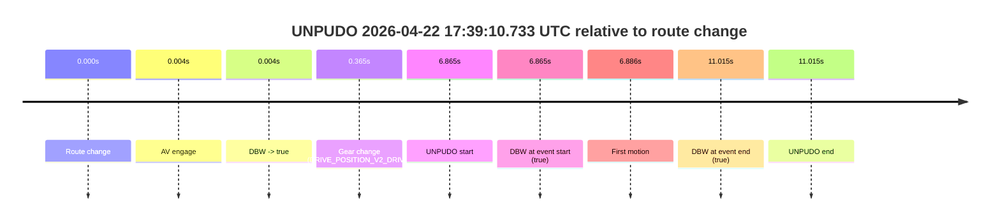
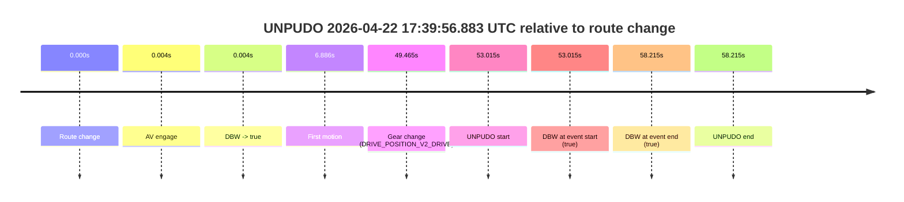

# Run Report: fme10003/2026-04-22--17-21-28--gen2-av-7d5636db-09bc-474b-8f5b-c67d6e0c2e2c

| Field | Value |
|---|---|
| Run ID | `fme10003/2026-04-22--17-21-28--gen2-av-7d5636db-09bc-474b-8f5b-c67d6e0c2e2c` |
| Date | `2026-04-22` |
| Model(s) | `eel-teal-outspoken` |
| Author | `zak` |
| Event count | `3` |

## unpudo 2026-04-22 17:37:06.383 UTC

| Field | Value |
|---|---|
| Model | `eel-teal-outspoken` |
| Author | `zak` |
| Run ID | `fme10003/2026-04-22--17-21-28--gen2-av-7d5636db-09bc-474b-8f5b-c67d6e0c2e2c` |
| Date | `2026-04-22` |
| Time (UTC) | `17:37:06.383` |
| Event type | `unpudo` |
| Disengagement type | `none observed` |
| Route change | `found` |
| Console | [run](https://console.sso.wayve.ai/run/fme10003/2026-04-22--17-21-28--gen2-av-7d5636db-09bc-474b-8f5b-c67d6e0c2e2c?id=&time-unixus=1776879426383293) |
| Foxglove | [segment](https://app.foxglove.dev/wayve-on-prem/p/prj_0dX18KZdVHg1fmmI/view?ds=foxglove-stream&ds.deviceName=fme10003&ds.start=2026-04-22T17%3A36%3A52.518251Z&ds.end=2026-04-22T17%3A38%3A38.543505Z&layoutId=lay_0e7VD4WIKDQGU73Y&time=2026-04-22T17%3A37%3A06.383293Z) |

### Event card: pass

- Pass: AV owns the credited unpudo from route change through the official unpudo window, the gear state is aligned at the anchor, and the vehicle moves without driver accelerator help in AV.

| Event | Time (UTC) | Delta from route change |
|---|---:|---:|
| Route change | 2026-04-22 17:37:02.518 | `0.000s` |
| AV engage | 2026-04-22 17:37:02.522 | `0.005s` |
| DBW -> true | 2026-04-22 17:37:02.522 | `0.005s` |
| Gear change (DRIVE_POSITION_V2_DRIVE) | 2026-04-22 17:37:02.833 | `0.315s` |
| UNPUDO start | 2026-04-22 17:37:06.383 | `3.865s` |
| DBW at event start (true) | 2026-04-22 17:37:06.383 | `3.865s` |
| First motion | 2026-04-22 17:37:06.395 | `3.877s` |
| DBW at event end (true) | 2026-04-22 17:37:10.083 | `7.565s` |
| UNPUDO end | 2026-04-22 17:37:10.083 | `7.565s` |
| DBW -> false | 2026-04-22 17:38:28.543 | `86.025s` |
| Actual indicator -> right on | 2026-04-22 17:38:31.734 | `89.216s` |
| Actual indicator -> off | 2026-04-22 17:38:36.474 | `93.956s` |

| Metric | Value |
|---|---|
| Outcome | `pass` |
| Effective failure type | `none` |
| Route change status | `found` |
| DBW at event start | `true` |
| DBW at event end | `true` |
| Predicted gear at AV start | `DRIVE_POSITION_V2_PARK` |
| Actual gear at AV start | `DRIVE_POSITION_V2_PARK` |
| Predicted gear at event start | `DRIVE_POSITION_V2_DRIVE` |
| Actual gear at event start | `DRIVE_POSITION_V2_DRIVE` |
| Planned indicator direction | `INDICATORS_STATE_V2_LEFT_ON` |
| Controller indicator direction | `INDICATORS_STATE_V2_LEFT_ON` |
| Actual indicator direction | `INDICATORS_STATE_V2_OFF` |
| Actual indicator at maneuver end | `INDICATORS_STATE_V2_OFF` |
| Driver accel help in AV | `false` |
| Driver accel help timestamp | `n/a` |
| Max accel pedal pct in AV | `0.0%` |
| Max brake pedal pct in AV | `8.0%` |
| Max speed mps in AV | `4.417` |
| Success timing baseline | `route change` |
| Route -> AV | `0.005s` |
| AV -> event start | `3.860s` |
| AV -> first motion | `3.872s` |
| Success baseline -> event start | `3.865s` |
| Success baseline -> first motion | `3.877s` |
| AV duration before disengagement | `86.021s` |
| Trajectory waypoint count | `37` |
| Driving-plan step count | `11` |

The scored portion starts from the AV-owned window, not from the pre-AV setup. Route-change search in the stopped pre-event segment was `found`, with the baseline therefore set to route change. At the event anchor the model predicts `DRIVE_POSITION_V2_DRIVE` and the actual gear is `DRIVE_POSITION_V2_DRIVE`. The effective model outcome is `pass` because `the credited unpudo stays AV-owned through the official unpudo window.`

### Resolution

| Field | Value |
|---|---|
| Final outcome | `pass` |
| Do we agree with this label? | `yes` |
| Source disengagement type | `none observed` |
| Resolved effective failure type | `none` |
| Confidence | `high` |

## unpudo 2026-04-22 17:39:10.733 UTC

| Field | Value |
|---|---|
| Model | `eel-teal-outspoken` |
| Author | `zak` |
| Run ID | `fme10003/2026-04-22--17-21-28--gen2-av-7d5636db-09bc-474b-8f5b-c67d6e0c2e2c` |
| Date | `2026-04-22` |
| Time (UTC) | `17:39:10.733` |
| Event type | `unpudo` |
| Disengagement type | `none observed` |
| Route change | `found` |
| Console | [run](https://console.sso.wayve.ai/run/fme10003/2026-04-22--17-21-28--gen2-av-7d5636db-09bc-474b-8f5b-c67d6e0c2e2c?id=&time-unixus=1776879550733298) |
| Foxglove | [segment](https://app.foxglove.dev/wayve-on-prem/p/prj_0dX18KZdVHg1fmmI/view?ds=foxglove-stream&ds.deviceName=fme10003&ds.start=2026-04-22T17%3A38%3A53.868796Z&ds.end=2026-04-22T17%3A39%3A24.883308Z&layoutId=lay_0e7VD4WIKDQGU73Y&time=2026-04-22T17%3A39%3A10.733298Z) |

### Event card: pass

- Pass: AV owns the credited unpudo from route change through the official unpudo window, the gear state is aligned at the anchor, and the vehicle moves without driver accelerator help in AV.

| Event | Time (UTC) | Delta from route change |
|---|---:|---:|
| Route change | 2026-04-22 17:39:03.868 | `0.000s` |
| AV engage | 2026-04-22 17:39:03.872 | `0.004s` |
| DBW -> true | 2026-04-22 17:39:03.872 | `0.004s` |
| Gear change (DRIVE_POSITION_V2_DRIVE) | 2026-04-22 17:39:04.233 | `0.365s` |
| UNPUDO start | 2026-04-22 17:39:10.733 | `6.865s` |
| DBW at event start (true) | 2026-04-22 17:39:10.733 | `6.865s` |
| First motion | 2026-04-22 17:39:10.754 | `6.886s` |
| DBW at event end (true) | 2026-04-22 17:39:14.883 | `11.015s` |
| UNPUDO end | 2026-04-22 17:39:14.883 | `11.015s` |

| Metric | Value |
|---|---|
| Outcome | `pass` |
| Effective failure type | `none` |
| Route change status | `found` |
| DBW at event start | `true` |
| DBW at event end | `true` |
| Predicted gear at AV start | `DRIVE_POSITION_V2_PARK` |
| Actual gear at AV start | `DRIVE_POSITION_V2_PARK` |
| Predicted gear at event start | `DRIVE_POSITION_V2_DRIVE` |
| Actual gear at event start | `DRIVE_POSITION_V2_DRIVE` |
| Planned indicator direction | `INDICATORS_STATE_V2_LEFT_ON` |
| Controller indicator direction | `INDICATORS_STATE_V2_LEFT_ON` |
| Actual indicator direction | `INDICATORS_STATE_V2_OFF` |
| Actual indicator at maneuver end | `INDICATORS_STATE_V2_OFF` |
| Driver accel help in AV | `false` |
| Driver accel help timestamp | `n/a` |
| Max accel pedal pct in AV | `0.0%` |
| Max brake pedal pct in AV | `8.0%` |
| Max speed mps in AV | `5.136` |
| Success timing baseline | `route change` |
| Route -> AV | `0.004s` |
| AV -> event start | `6.860s` |
| AV -> first motion | `6.882s` |
| Success baseline -> event start | `6.865s` |
| Success baseline -> first motion | `6.886s` |
| AV duration before disengagement | `n/a` |
| Trajectory waypoint count | `38` |
| Driving-plan step count | `11` |

The scored portion starts from the AV-owned window, not from the pre-AV setup. Route-change search in the stopped pre-event segment was `found`, with the baseline therefore set to route change. At the event anchor the model predicts `DRIVE_POSITION_V2_DRIVE` and the actual gear is `DRIVE_POSITION_V2_DRIVE`. The effective model outcome is `pass` because `the credited unpudo stays AV-owned through the official unpudo window.`

### Resolution

| Field | Value |
|---|---|
| Final outcome | `pass` |
| Do we agree with this label? | `yes` |
| Source disengagement type | `none observed` |
| Resolved effective failure type | `none` |
| Confidence | `high` |

## unpudo 2026-04-22 17:39:56.883 UTC

| Field | Value |
|---|---|
| Model | `eel-teal-outspoken` |
| Author | `zak` |
| Run ID | `fme10003/2026-04-22--17-21-28--gen2-av-7d5636db-09bc-474b-8f5b-c67d6e0c2e2c` |
| Date | `2026-04-22` |
| Time (UTC) | `17:39:56.883` |
| Event type | `unpudo` |
| Disengagement type | `none observed` |
| Route change | `found` |
| Console | [run](https://console.sso.wayve.ai/run/fme10003/2026-04-22--17-21-28--gen2-av-7d5636db-09bc-474b-8f5b-c67d6e0c2e2c?id=&time-unixus=1776879596883315) |
| Foxglove | [segment](https://app.foxglove.dev/wayve-on-prem/p/prj_0dX18KZdVHg1fmmI/view?ds=foxglove-stream&ds.deviceName=fme10003&ds.start=2026-04-22T17%3A38%3A53.868796Z&ds.end=2026-04-22T17%3A40%3A12.083310Z&layoutId=lay_0e7VD4WIKDQGU73Y&time=2026-04-22T17%3A39%3A56.883315Z) |

### Event card: pass

- Pass: AV owns the credited unpudo from route change through the official unpudo window, the gear state is aligned at the anchor, and the vehicle moves without driver accelerator help in AV.

| Event | Time (UTC) | Delta from route change |
|---|---:|---:|
| Route change | 2026-04-22 17:39:03.868 | `0.000s` |
| AV engage | 2026-04-22 17:39:03.872 | `0.004s` |
| DBW -> true | 2026-04-22 17:39:03.872 | `0.004s` |
| First motion | 2026-04-22 17:39:10.754 | `6.886s` |
| Gear change (DRIVE_POSITION_V2_DRIVE) | 2026-04-22 17:39:53.333 | `49.465s` |
| UNPUDO start | 2026-04-22 17:39:56.883 | `53.015s` |
| DBW at event start (true) | 2026-04-22 17:39:56.883 | `53.015s` |
| DBW at event end (true) | 2026-04-22 17:40:02.083 | `58.215s` |
| UNPUDO end | 2026-04-22 17:40:02.083 | `58.215s` |

| Metric | Value |
|---|---|
| Outcome | `pass` |
| Effective failure type | `none` |
| Route change status | `found` |
| DBW at event start | `true` |
| DBW at event end | `true` |
| Predicted gear at AV start | `DRIVE_POSITION_V2_PARK` |
| Actual gear at AV start | `DRIVE_POSITION_V2_PARK` |
| Predicted gear at event start | `DRIVE_POSITION_V2_DRIVE` |
| Actual gear at event start | `DRIVE_POSITION_V2_DRIVE` |
| Planned indicator direction | `INDICATORS_STATE_V2_OFF` |
| Controller indicator direction | `INDICATORS_STATE_V2_OFF` |
| Actual indicator direction | `INDICATORS_STATE_V2_OFF` |
| Actual indicator at maneuver end | `INDICATORS_STATE_V2_OFF` |
| Driver accel help in AV | `false` |
| Driver accel help timestamp | `n/a` |
| Max accel pedal pct in AV | `0.0%` |
| Max brake pedal pct in AV | `8.0%` |
| Max speed mps in AV | `5.617` |
| Success timing baseline | `route change` |
| Route -> AV | `0.004s` |
| AV -> event start | `53.010s` |
| AV -> first motion | `6.882s` |
| Success baseline -> event start | `53.015s` |
| Success baseline -> first motion | `6.886s` |
| AV duration before disengagement | `n/a` |
| Trajectory waypoint count | `37` |
| Driving-plan step count | `11` |

The scored portion starts from the AV-owned window, not from the pre-AV setup. Route-change search in the stopped pre-event segment was `found`, with the baseline therefore set to route change. At the event anchor the model predicts `DRIVE_POSITION_V2_DRIVE` and the actual gear is `DRIVE_POSITION_V2_DRIVE`. The effective model outcome is `pass` because `the credited unpudo stays AV-owned through the official unpudo window.`

### Resolution

| Field | Value |
|---|---|
| Final outcome | `pass` |
| Do we agree with this label? | `yes` |
| Source disengagement type | `none observed` |
| Resolved effective failure type | `none` |
| Confidence | `high` |
