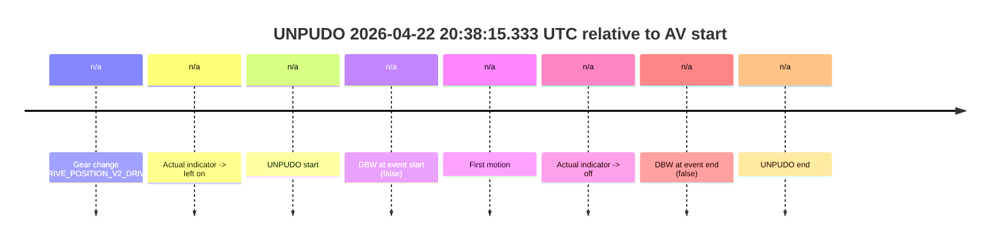
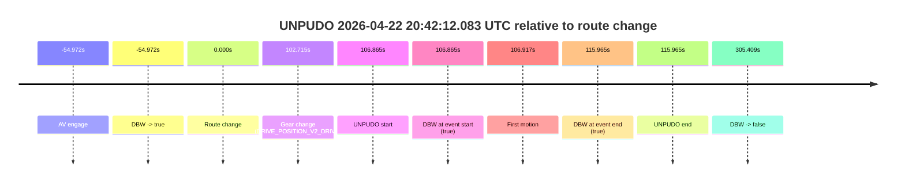
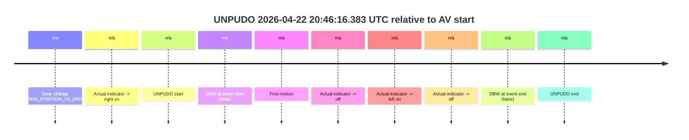
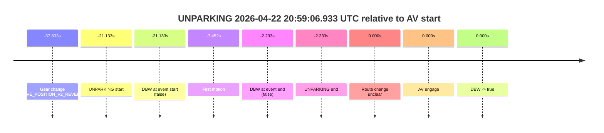

# Run Report: fme10003/2026-04-22--20-12-43--gen2-av-3e0a8cb2-409e-4489-9145-f4a94365bc6c

| Field | Value |
|---|---|
| Run ID | `fme10003/2026-04-22--20-12-43--gen2-av-3e0a8cb2-409e-4489-9145-f4a94365bc6c` |
| Date | `2026-04-22` |
| Model(s) | `mallard-plum-mysterious` |
| Author | `guy.geva` |
| Event count | `4` |

## unpudo 2026-04-22 20:38:15.333 UTC

| Field | Value |
|---|---|
| Model | `mallard-plum-mysterious` |
| Author | `guy.geva` |
| Run ID | `fme10003/2026-04-22--20-12-43--gen2-av-3e0a8cb2-409e-4489-9145-f4a94365bc6c` |
| Date | `2026-04-22` |
| Time (UTC) | `20:38:15.333` |
| Event type | `unpudo` |
| Disengagement type | `none observed` |
| Route change | `unclear` |
| Console | [run](https://console.sso.wayve.ai/run/fme10003/2026-04-22--20-12-43--gen2-av-3e0a8cb2-409e-4489-9145-f4a94365bc6c?id=&time-unixus=1776890295333302) |
| Foxglove | [segment](https://app.foxglove.dev/wayve-on-prem/p/prj_0dX18KZdVHg1fmmI/view?ds=foxglove-stream&ds.deviceName=fme10003&ds.start=2026-04-22T20%3A38%3A02.633316Z&ds.end=2026-04-22T20%3A38%3A30.883299Z&layoutId=lay_0e7VD4WIKDQGU73Y&time=2026-04-22T20%3A38%3A15.333302Z) |

### Event card: non-av

- Non-AV: there is no AV-owned portion anywhere inside the detected unpudo timeline, so it is kept for coverage but excluded from model success / failure scoring.

| Event | Time (UTC) | Delta from AV start |
|---|---:|---:|
| Gear change (DRIVE_POSITION_V2_DRIVE) | 2026-04-22 20:38:12.633 | `n/a` |
| Actual indicator -> left on | 2026-04-22 20:38:14.194 | `n/a` |
| UNPUDO start | 2026-04-22 20:38:15.333 | `n/a` |
| DBW at event start (false) | 2026-04-22 20:38:15.333 | `n/a` |
| First motion | 2026-04-22 20:38:15.494 | `n/a` |
| Actual indicator -> off | 2026-04-22 20:38:16.894 | `n/a` |
| DBW at event end (false) | 2026-04-22 20:38:20.883 | `n/a` |
| UNPUDO end | 2026-04-22 20:38:20.883 | `n/a` |

| Metric | Value |
|---|---|
| Outcome | `non-av` |
| Effective failure type | `none` |
| Route change status | `unclear` |
| DBW at event start | `false` |
| DBW at event end | `false` |
| Predicted gear at AV start | `n/a` |
| Actual gear at AV start | `n/a` |
| Predicted gear at event start | `DRIVE_POSITION_V2_DRIVE` |
| Actual gear at event start | `DRIVE_POSITION_V2_DRIVE` |
| Planned indicator direction | `INDICATORS_STATE_V2_LEFT_ON` |
| Controller indicator direction | `INDICATORS_STATE_V2_LEFT_ON` |
| Actual indicator direction | `INDICATORS_STATE_V2_LEFT_ON` |
| Actual indicator at maneuver end | `INDICATORS_STATE_V2_OFF` |
| Driver accel help in AV | `false` |
| Driver accel help timestamp | `n/a` |
| Max accel pedal pct in AV | `0.0%` |
| Max brake pedal pct in AV | `0.0%` |
| Max speed mps in AV | `0.000` |
| Route -> AV | `n/a` |
| AV -> event start | `n/a` |
| AV -> first motion | `n/a` |
| AV duration before disengagement | `n/a` |
| Trajectory waypoint count | `37` |
| Driving-plan step count | `11` |

The scored portion starts from the AV-owned window, not from the pre-AV setup. Route-change search in the stopped pre-event segment was `unclear`, with the baseline therefore set to AV start. At the event anchor the model predicts `DRIVE_POSITION_V2_DRIVE` and the actual gear is `DRIVE_POSITION_V2_DRIVE`. The effective model outcome is `non-av` because `there is no AV-owned overlap inside the event timeline`.

### Resolution

| Field | Value |
|---|---|
| Final outcome | `non-av` |
| Do we agree with this label? | `yes` |
| Source disengagement type | `none observed` |
| Resolved effective failure type | `none` |
| Confidence | `medium` |

## unpudo 2026-04-22 20:42:12.083 UTC

| Field | Value |
|---|---|
| Model | `mallard-plum-mysterious` |
| Author | `guy.geva` |
| Run ID | `fme10003/2026-04-22--20-12-43--gen2-av-3e0a8cb2-409e-4489-9145-f4a94365bc6c` |
| Date | `2026-04-22` |
| Time (UTC) | `20:42:12.083` |
| Event type | `unpudo` |
| Disengagement type | `none observed` |
| Route change | `found` |
| Console | [run](https://console.sso.wayve.ai/run/fme10003/2026-04-22--20-12-43--gen2-av-3e0a8cb2-409e-4489-9145-f4a94365bc6c?id=&time-unixus=1776890532083311) |
| Foxglove | [segment](https://app.foxglove.dev/wayve-on-prem/p/prj_0dX18KZdVHg1fmmI/view?ds=foxglove-stream&ds.deviceName=fme10003&ds.start=2026-04-22T20%3A39%3A20.246087Z&ds.end=2026-04-22T20%3A45%3A40.626846Z&layoutId=lay_0e7VD4WIKDQGU73Y&time=2026-04-22T20%3A42%3A12.083311Z) |

### Event card: pass

- Pass: AV owns the credited unpudo through the official event window, the gear state is aligned at the anchor, and the vehicle moves without driver accelerator help in AV.

| Event | Time (UTC) | Delta from route change |
|---|---:|---:|
| AV engage | 2026-04-22 20:39:30.246 | `-54.972s` |
| DBW -> true | 2026-04-22 20:39:30.246 | `-54.972s` |
| Route change | 2026-04-22 20:40:25.218 | `0.000s` |
| Gear change (DRIVE_POSITION_V2_DRIVE) | 2026-04-22 20:42:07.933 | `102.715s` |
| UNPUDO start | 2026-04-22 20:42:12.083 | `106.865s` |
| DBW at event start (true) | 2026-04-22 20:42:12.083 | `106.865s` |
| First motion | 2026-04-22 20:42:12.135 | `106.917s` |
| DBW at event end (true) | 2026-04-22 20:42:21.183 | `115.965s` |
| UNPUDO end | 2026-04-22 20:42:21.183 | `115.965s` |
| DBW -> false | 2026-04-22 20:45:30.626 | `305.409s` |

| Metric | Value |
|---|---|
| Outcome | `pass` |
| Effective failure type | `none` |
| Route change status | `found` |
| DBW at event start | `true` |
| DBW at event end | `true` |
| Predicted gear at AV start | `DRIVE_POSITION_V2_DRIVE` |
| Actual gear at AV start | `DRIVE_POSITION_V2_DRIVE` |
| Predicted gear at event start | `DRIVE_POSITION_V2_DRIVE` |
| Actual gear at event start | `DRIVE_POSITION_V2_DRIVE` |
| Planned indicator direction | `INDICATORS_STATE_V2_OFF` |
| Controller indicator direction | `INDICATORS_STATE_V2_OFF` |
| Actual indicator direction | `INDICATORS_STATE_V2_OFF` |
| Actual indicator at maneuver end | `INDICATORS_STATE_V2_OFF` |
| Driver accel help in AV | `false` |
| Driver accel help timestamp | `n/a` |
| Max accel pedal pct in AV | `0.0%` |
| Max brake pedal pct in AV | `0.0%` |
| Max speed mps in AV | `2.686` |
| Route -> AV | `-54.972s` |
| AV -> event start | `161.837s` |
| AV -> first motion | `161.889s` |
| AV duration before disengagement | `360.381s` |
| Trajectory waypoint count | `36` |
| Driving-plan step count | `11` |

The scored portion starts from the AV-owned window, not from the pre-AV setup. Route-change search in the stopped pre-event segment was `found`, with the baseline therefore set to route change. At the event anchor the model predicts `DRIVE_POSITION_V2_DRIVE` and the actual gear is `DRIVE_POSITION_V2_DRIVE`. The effective model outcome is `pass` because `the credited maneuver stays AV-owned through the official event end`.

### Resolution

| Field | Value |
|---|---|
| Final outcome | `pass` |
| Do we agree with this label? | `yes` |
| Source disengagement type | `none observed` |
| Resolved effective failure type | `none` |
| Confidence | `high` |

## unpudo 2026-04-22 20:46:16.383 UTC

| Field | Value |
|---|---|
| Model | `mallard-plum-mysterious` |
| Author | `guy.geva` |
| Run ID | `fme10003/2026-04-22--20-12-43--gen2-av-3e0a8cb2-409e-4489-9145-f4a94365bc6c` |
| Date | `2026-04-22` |
| Time (UTC) | `20:46:16.383` |
| Event type | `unpudo` |
| Disengagement type | `none observed` |
| Route change | `unclear` |
| Console | [run](https://console.sso.wayve.ai/run/fme10003/2026-04-22--20-12-43--gen2-av-3e0a8cb2-409e-4489-9145-f4a94365bc6c?id=&time-unixus=1776890776383304) |
| Foxglove | [segment](https://app.foxglove.dev/wayve-on-prem/p/prj_0dX18KZdVHg1fmmI/view?ds=foxglove-stream&ds.deviceName=fme10003&ds.start=2026-04-22T20%3A45%3A49.183292Z&ds.end=2026-04-22T20%3A46%3A56.183316Z&layoutId=lay_0e7VD4WIKDQGU73Y&time=2026-04-22T20%3A46%3A16.383304Z) |

### Event card: non-av

- Non-AV: there is no AV-owned portion anywhere inside the detected unpudo timeline, so it is kept for coverage but excluded from model success / failure scoring.

| Event | Time (UTC) | Delta from AV start |
|---|---:|---:|
| Gear change (DRIVE_POSITION_V2_DRIVE) | 2026-04-22 20:45:59.183 | `n/a` |
| Actual indicator -> right on | 2026-04-22 20:46:16.295 | `n/a` |
| UNPUDO start | 2026-04-22 20:46:16.383 | `n/a` |
| DBW at event start (false) | 2026-04-22 20:46:16.383 | `n/a` |
| First motion | 2026-04-22 20:46:16.454 | `n/a` |
| Actual indicator -> off | 2026-04-22 20:46:21.754 | `n/a` |
| Actual indicator -> left on | 2026-04-22 20:46:23.795 | `n/a` |
| Actual indicator -> off | 2026-04-22 20:46:36.934 | `n/a` |
| DBW at event end (false) | 2026-04-22 20:46:46.183 | `n/a` |
| UNPUDO end | 2026-04-22 20:46:46.183 | `n/a` |

| Metric | Value |
|---|---|
| Outcome | `non-av` |
| Effective failure type | `none` |
| Route change status | `unclear` |
| DBW at event start | `false` |
| DBW at event end | `false` |
| Predicted gear at AV start | `n/a` |
| Actual gear at AV start | `n/a` |
| Predicted gear at event start | `DRIVE_POSITION_V2_DRIVE` |
| Actual gear at event start | `DRIVE_POSITION_V2_DRIVE` |
| Planned indicator direction | `INDICATORS_STATE_V2_OFF` |
| Controller indicator direction | `INDICATORS_STATE_V2_OFF` |
| Actual indicator direction | `INDICATORS_STATE_V2_RIGHT_ON` |
| Actual indicator at maneuver end | `INDICATORS_STATE_V2_OFF` |
| Driver accel help in AV | `false` |
| Driver accel help timestamp | `n/a` |
| Max accel pedal pct in AV | `0.0%` |
| Max brake pedal pct in AV | `0.0%` |
| Max speed mps in AV | `0.000` |
| Route -> AV | `n/a` |
| AV -> event start | `n/a` |
| AV -> first motion | `n/a` |
| AV duration before disengagement | `n/a` |
| Trajectory waypoint count | `36` |
| Driving-plan step count | `11` |

The scored portion starts from the AV-owned window, not from the pre-AV setup. Route-change search in the stopped pre-event segment was `unclear`, with the baseline therefore set to AV start. At the event anchor the model predicts `DRIVE_POSITION_V2_DRIVE` and the actual gear is `DRIVE_POSITION_V2_DRIVE`. The effective model outcome is `non-av` because `there is no AV-owned overlap inside the event timeline`.

### Resolution

| Field | Value |
|---|---|
| Final outcome | `non-av` |
| Do we agree with this label? | `yes` |
| Source disengagement type | `none observed` |
| Resolved effective failure type | `none` |
| Confidence | `medium` |

## unparking 2026-04-22 20:59:06.933 UTC

| Field | Value |
|---|---|
| Model | `mallard-plum-mysterious` |
| Author | `guy.geva` |
| Run ID | `fme10003/2026-04-22--20-12-43--gen2-av-3e0a8cb2-409e-4489-9145-f4a94365bc6c` |
| Date | `2026-04-22` |
| Time (UTC) | `20:59:06.933` |
| Event type | `unparking` |
| Disengagement type | `none observed` |
| Route change | `unclear` |
| Console | [run](https://console.sso.wayve.ai/run/fme10003/2026-04-22--20-12-43--gen2-av-3e0a8cb2-409e-4489-9145-f4a94365bc6c?id=&time-unixus=1776891546933314) |
| Foxglove | [segment](https://app.foxglove.dev/wayve-on-prem/p/prj_0dX18KZdVHg1fmmI/view?ds=foxglove-stream&ds.deviceName=fme10003&ds.start=2026-04-22T20%3A58%3A40.233290Z&ds.end=2026-04-22T20%3A59%3A35.833293Z&layoutId=lay_0e7VD4WIKDQGU73Y&time=2026-04-22T20%3A59%3A06.933314Z) |

### Event card: non-av

- Non-AV: there is no AV-owned portion anywhere inside the detected unparking timeline, so it is kept for coverage but excluded from model success / failure scoring.

| Event | Time (UTC) | Delta from AV start |
|---|---:|---:|
| Gear change (DRIVE_POSITION_V2_REVERSE) | 2026-04-22 20:58:50.233 | `-37.833s` |
| UNPARKING start | 2026-04-22 20:59:06.933 | `-21.133s` |
| DBW at event start (false) | 2026-04-22 20:59:06.933 | `-21.133s` |
| First motion | 2026-04-22 20:59:20.614 | `-7.452s` |
| DBW at event end (false) | 2026-04-22 20:59:25.833 | `-2.233s` |
| UNPARKING end | 2026-04-22 20:59:25.833 | `-2.233s` |
| Route change unclear | 2026-04-22 20:59:28.066 | `0.000s` |
| AV engage | 2026-04-22 20:59:28.066 | `0.000s` |
| DBW -> true | 2026-04-22 20:59:28.066 | `0.000s` |

| Metric | Value |
|---|---|
| Outcome | `non-av` |
| Effective failure type | `none` |
| Route change status | `unclear` |
| DBW at event start | `false` |
| DBW at event end | `false` |
| Predicted gear at AV start | `DRIVE_POSITION_V2_DRIVE` |
| Actual gear at AV start | `DRIVE_POSITION_V2_DRIVE` |
| Predicted gear at event start | `DRIVE_POSITION_V2_REVERSE` |
| Actual gear at event start | `DRIVE_POSITION_V2_REVERSE` |
| Planned indicator direction | `INDICATORS_STATE_V2_OFF` |
| Controller indicator direction | `INDICATORS_STATE_V2_OFF` |
| Actual indicator direction | `INDICATORS_STATE_V2_OFF` |
| Actual indicator at maneuver end | `INDICATORS_STATE_V2_OFF` |
| Driver accel help in AV | `false` |
| Driver accel help timestamp | `n/a` |
| Max accel pedal pct in AV | `0.0%` |
| Max brake pedal pct in AV | `0.0%` |
| Max speed mps in AV | `0.000` |
| Route -> AV | `n/a` |
| AV -> event start | `-21.133s` |
| AV -> first motion | `-7.452s` |
| AV duration before disengagement | `n/a` |
| Trajectory waypoint count | `37` |
| Driving-plan step count | `11` |

The scored portion starts from the AV-owned window, not from the pre-AV setup. Route-change search in the stopped pre-event segment was `unclear`, with the baseline therefore set to AV start. At the event anchor the model predicts `DRIVE_POSITION_V2_REVERSE` and the actual gear is `DRIVE_POSITION_V2_REVERSE`. The effective model outcome is `non-av` because `there is no AV-owned overlap inside the event timeline`.

### Resolution

| Field | Value |
|---|---|
| Final outcome | `non-av` |
| Do we agree with this label? | `yes` |
| Source disengagement type | `none observed` |
| Resolved effective failure type | `none` |
| Confidence | `medium` |
