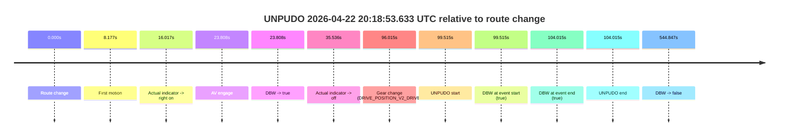
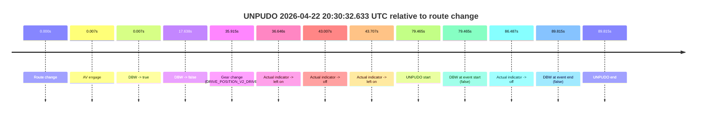
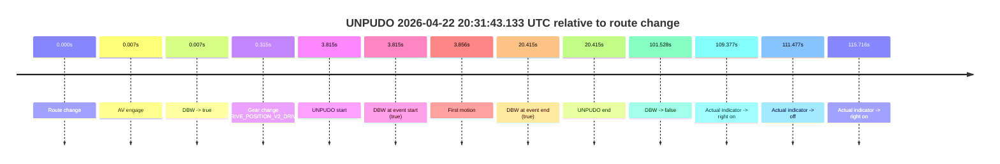
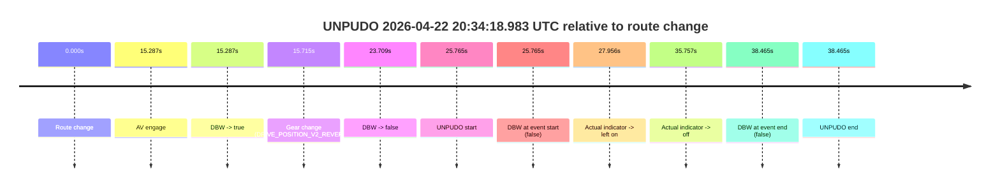
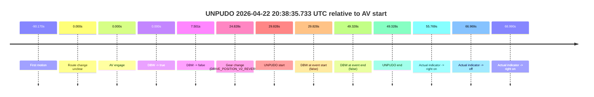
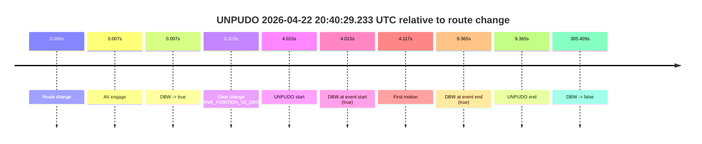
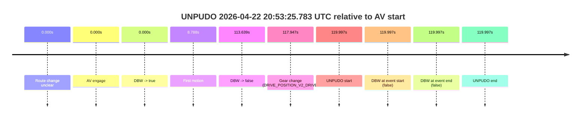
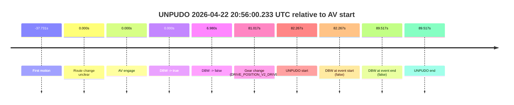
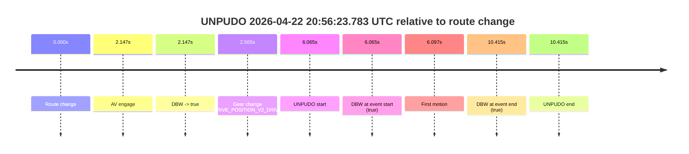

# Run Report: fme10003/2026-04-22--20-12-43--gen2-av-3e0a8cb2-409e-4489-9145-f4a94365bc6c

| Field | Value |
|---|---|
| Run ID | `fme10003/2026-04-22--20-12-43--gen2-av-3e0a8cb2-409e-4489-9145-f4a94365bc6c` |
| Date | `2026-04-22` |
| Model(s) | `eel-teal-outspoken` |
| Author | `zak` |
| Event count | `10` |

## unpudo 2026-04-22 20:18:53.633 UTC

| Field | Value |
|---|---|
| Model | `eel-teal-outspoken` |
| Author | `zak` |
| Run ID | `fme10003/2026-04-22--20-12-43--gen2-av-3e0a8cb2-409e-4489-9145-f4a94365bc6c` |
| Date | `2026-04-22` |
| Time (UTC) | `20:18:53.633` |
| Event type | `unpudo` |
| Disengagement type | `none observed` |
| Route change | `found` |
| Console | [run](https://console.sso.wayve.ai/run/fme10003/2026-04-22--20-12-43--gen2-av-3e0a8cb2-409e-4489-9145-f4a94365bc6c?id=&time-unixus=1776889133633294) |
| Foxglove | [segment](https://app.foxglove.dev/wayve-on-prem/p/prj_0dX18KZdVHg1fmmI/view?ds=foxglove-stream&ds.deviceName=fme10003&ds.start=2026-04-22T20%3A17%3A04.118242Z&ds.end=2026-04-22T20%3A26%3A28.965492Z&layoutId=lay_0e7VD4WIKDQGU73Y&time=2026-04-22T20%3A18%3A53.633294Z) |

### Event card: pass

- Pass: AV owns the credited unpudo from route change through the official unpudo window, the gear state is aligned at the anchor, and the vehicle moves without driver accelerator help in AV.

| Event | Time (UTC) | Delta from route change |
|---|---:|---:|
| Route change | 2026-04-22 20:17:14.118 | `0.000s` |
| First motion | 2026-04-22 20:17:22.294 | `8.177s` |
| Actual indicator -> right on | 2026-04-22 20:17:30.134 | `16.017s` |
| AV engage | 2026-04-22 20:17:37.926 | `23.808s` |
| DBW -> true | 2026-04-22 20:17:37.926 | `23.808s` |
| Actual indicator -> off | 2026-04-22 20:17:49.654 | `35.536s` |
| Gear change (DRIVE_POSITION_V2_DRIVE) | 2026-04-22 20:18:50.133 | `96.015s` |
| UNPUDO start | 2026-04-22 20:18:53.633 | `99.515s` |
| DBW at event start (true) | 2026-04-22 20:18:53.633 | `99.515s` |
| DBW at event end (true) | 2026-04-22 20:18:58.133 | `104.015s` |
| UNPUDO end | 2026-04-22 20:18:58.133 | `104.015s` |
| DBW -> false | 2026-04-22 20:26:18.965 | `544.847s` |

| Metric | Value |
|---|---|
| Outcome | `pass` |
| Effective failure type | `none` |
| Route change status | `found` |
| DBW at event start | `true` |
| DBW at event end | `true` |
| Predicted gear at AV start | `DRIVE_POSITION_V2_DRIVE` |
| Actual gear at AV start | `DRIVE_POSITION_V2_DRIVE` |
| Predicted gear at event start | `DRIVE_POSITION_V2_DRIVE` |
| Actual gear at event start | `DRIVE_POSITION_V2_DRIVE` |
| Planned indicator direction | `INDICATORS_STATE_V2_OFF` |
| Controller indicator direction | `INDICATORS_STATE_V2_OFF` |
| Actual indicator direction | `INDICATORS_STATE_V2_OFF` |
| Actual indicator at maneuver end | `INDICATORS_STATE_V2_OFF` |
| Driver accel help in AV | `false` |
| Driver accel help timestamp | `n/a` |
| Max accel pedal pct in AV | `0.0%` |
| Max brake pedal pct in AV | `11.6%` |
| Max speed mps in AV | `8.183` |
| Success timing baseline | `route change` |
| Route -> AV | `23.808s` |
| AV -> event start | `75.707s` |
| AV -> first motion | `-15.631s` |
| Success baseline -> event start | `99.515s` |
| Success baseline -> first motion | `8.177s` |
| AV duration before disengagement | `521.039s` |
| Trajectory waypoint count | `37` |
| Driving-plan step count | `11` |

The scored portion starts from the AV-owned window, not from the pre-AV setup. Route-change search in the stopped pre-event segment was `found`, with the baseline therefore set to route change. At the event anchor the model predicts `DRIVE_POSITION_V2_DRIVE` and the actual gear is `DRIVE_POSITION_V2_DRIVE`. The effective model outcome is `pass` because `the credited unpudo stays AV-owned through the official unpudo window.`

### Resolution

| Field | Value |
|---|---|
| Final outcome | `pass` |
| Do we agree with this label? | `yes` |
| Source disengagement type | `none observed` |
| Resolved effective failure type | `none` |
| Confidence | `high` |

## unpudo 2026-04-22 20:30:32.633 UTC

| Field | Value |
|---|---|
| Model | `eel-teal-outspoken` |
| Author | `zak` |
| Run ID | `fme10003/2026-04-22--20-12-43--gen2-av-3e0a8cb2-409e-4489-9145-f4a94365bc6c` |
| Date | `2026-04-22` |
| Time (UTC) | `20:30:32.633` |
| Event type | `unpudo` |
| Disengagement type | `none observed` |
| Route change | `found` |
| Console | [run](https://console.sso.wayve.ai/run/fme10003/2026-04-22--20-12-43--gen2-av-3e0a8cb2-409e-4489-9145-f4a94365bc6c?id=&time-unixus=1776889832633290) |
| Foxglove | [segment](https://app.foxglove.dev/wayve-on-prem/p/prj_0dX18KZdVHg1fmmI/view?ds=foxglove-stream&ds.deviceName=fme10003&ds.start=2026-04-22T20%3A29%3A03.168259Z&ds.end=2026-04-22T20%3A30%3A52.983317Z&layoutId=lay_0e7VD4WIKDQGU73Y&time=2026-04-22T20%3A30%3A32.633290Z) |

### Event card: fail

- Fail: the credited unpudo does not stay AV-owned. The event window starts with DBW false, and the maneuver outcome lands outside a clean AV-owned segment.

| Event | Time (UTC) | Delta from route change |
|---|---:|---:|
| Route change | 2026-04-22 20:29:13.168 | `0.000s` |
| AV engage | 2026-04-22 20:29:13.175 | `0.007s` |
| DBW -> true | 2026-04-22 20:29:13.175 | `0.007s` |
| DBW -> false | 2026-04-22 20:29:30.806 | `17.638s` |
| Gear change (DRIVE_POSITION_V2_DRIVE) | 2026-04-22 20:29:49.083 | `35.915s` |
| Actual indicator -> left on | 2026-04-22 20:29:49.814 | `36.646s` |
| Actual indicator -> off | 2026-04-22 20:29:56.174 | `43.007s` |
| Actual indicator -> left on | 2026-04-22 20:29:56.874 | `43.707s` |
| UNPUDO start | 2026-04-22 20:30:32.633 | `79.465s` |
| DBW at event start (false) | 2026-04-22 20:30:32.633 | `79.465s` |
| Actual indicator -> off | 2026-04-22 20:30:39.655 | `86.487s` |
| DBW at event end (false) | 2026-04-22 20:30:42.983 | `89.815s` |
| UNPUDO end | 2026-04-22 20:30:42.983 | `89.815s` |

| Metric | Value |
|---|---|
| Outcome | `fail` |
| Effective failure type | `not_av_owned` |
| Route change status | `found` |
| DBW at event start | `false` |
| DBW at event end | `false` |
| Predicted gear at AV start | `DRIVE_POSITION_V2_PARK` |
| Actual gear at AV start | `DRIVE_POSITION_V2_PARK` |
| Predicted gear at event start | `DRIVE_POSITION_V2_DRIVE` |
| Actual gear at event start | `DRIVE_POSITION_V2_DRIVE` |
| Planned indicator direction | `INDICATORS_STATE_V2_LEFT_ON` |
| Controller indicator direction | `INDICATORS_STATE_V2_LEFT_ON` |
| Actual indicator direction | `INDICATORS_STATE_V2_LEFT_ON` |
| Actual indicator at maneuver end | `INDICATORS_STATE_V2_OFF` |
| Driver accel help in AV | `false` |
| Driver accel help timestamp | `n/a` |
| Max accel pedal pct in AV | `0.0%` |
| Max brake pedal pct in AV | `8.0%` |
| Max speed mps in AV | `0.000` |
| Success timing baseline | `route change` |
| Route -> AV | `0.007s` |
| AV -> event start | `79.458s` |
| AV -> first motion | `n/a` |
| Success baseline -> event start | `79.465s` |
| Success baseline -> first motion | `n/a` |
| AV duration before disengagement | `17.631s` |
| Trajectory waypoint count | `37` |
| Driving-plan step count | `11` |

The scored portion starts from the AV-owned window, not from the pre-AV setup. Route-change search in the stopped pre-event segment was `found`, with the baseline therefore set to route change. At the event anchor the model predicts `DRIVE_POSITION_V2_DRIVE` and the actual gear is `DRIVE_POSITION_V2_DRIVE`. The effective model outcome is `fail` because `not_av_owned.`

### Resolution

| Field | Value |
|---|---|
| Final outcome | `fail` |
| Do we agree with this label? | `yes` |
| Source disengagement type | `none observed` |
| Resolved effective failure type | `not_av_owned` |
| Confidence | `high` |

## unpudo 2026-04-22 20:31:43.133 UTC

| Field | Value |
|---|---|
| Model | `eel-teal-outspoken` |
| Author | `zak` |
| Run ID | `fme10003/2026-04-22--20-12-43--gen2-av-3e0a8cb2-409e-4489-9145-f4a94365bc6c` |
| Date | `2026-04-22` |
| Time (UTC) | `20:31:43.133` |
| Event type | `unpudo` |
| Disengagement type | `none observed` |
| Route change | `found` |
| Console | [run](https://console.sso.wayve.ai/run/fme10003/2026-04-22--20-12-43--gen2-av-3e0a8cb2-409e-4489-9145-f4a94365bc6c?id=&time-unixus=1776889903133301) |
| Foxglove | [segment](https://app.foxglove.dev/wayve-on-prem/p/prj_0dX18KZdVHg1fmmI/view?ds=foxglove-stream&ds.deviceName=fme10003&ds.start=2026-04-22T20%3A31%3A29.318293Z&ds.end=2026-04-22T20%3A33%3A30.846057Z&layoutId=lay_0e7VD4WIKDQGU73Y&time=2026-04-22T20%3A31%3A43.133301Z) |

### Event card: pass

- Pass: AV owns the credited unpudo from route change through the official unpudo window, the gear state is aligned at the anchor, and the vehicle moves without driver accelerator help in AV.

| Event | Time (UTC) | Delta from route change |
|---|---:|---:|
| Route change | 2026-04-22 20:31:39.318 | `0.000s` |
| AV engage | 2026-04-22 20:31:39.325 | `0.007s` |
| DBW -> true | 2026-04-22 20:31:39.325 | `0.007s` |
| Gear change (DRIVE_POSITION_V2_DRIVE) | 2026-04-22 20:31:39.633 | `0.315s` |
| UNPUDO start | 2026-04-22 20:31:43.133 | `3.815s` |
| DBW at event start (true) | 2026-04-22 20:31:43.133 | `3.815s` |
| First motion | 2026-04-22 20:31:43.174 | `3.856s` |
| DBW at event end (true) | 2026-04-22 20:31:59.733 | `20.415s` |
| UNPUDO end | 2026-04-22 20:31:59.733 | `20.415s` |
| DBW -> false | 2026-04-22 20:33:20.846 | `101.528s` |
| Actual indicator -> right on | 2026-04-22 20:33:28.695 | `109.377s` |
| Actual indicator -> off | 2026-04-22 20:33:30.795 | `111.477s` |
| Actual indicator -> right on | 2026-04-22 20:33:35.034 | `115.716s` |

| Metric | Value |
|---|---|
| Outcome | `pass` |
| Effective failure type | `none` |
| Route change status | `found` |
| DBW at event start | `true` |
| DBW at event end | `true` |
| Predicted gear at AV start | `DRIVE_POSITION_V2_PARK` |
| Actual gear at AV start | `DRIVE_POSITION_V2_PARK` |
| Predicted gear at event start | `DRIVE_POSITION_V2_DRIVE` |
| Actual gear at event start | `DRIVE_POSITION_V2_DRIVE` |
| Planned indicator direction | `INDICATORS_STATE_V2_OFF` |
| Controller indicator direction | `INDICATORS_STATE_V2_OFF` |
| Actual indicator direction | `INDICATORS_STATE_V2_OFF` |
| Actual indicator at maneuver end | `INDICATORS_STATE_V2_OFF` |
| Driver accel help in AV | `false` |
| Driver accel help timestamp | `n/a` |
| Max accel pedal pct in AV | `0.0%` |
| Max brake pedal pct in AV | `8.0%` |
| Max speed mps in AV | `2.236` |
| Success timing baseline | `route change` |
| Route -> AV | `0.007s` |
| AV -> event start | `3.808s` |
| AV -> first motion | `3.849s` |
| Success baseline -> event start | `3.815s` |
| Success baseline -> first motion | `3.856s` |
| AV duration before disengagement | `101.521s` |
| Trajectory waypoint count | `37` |
| Driving-plan step count | `11` |

The scored portion starts from the AV-owned window, not from the pre-AV setup. Route-change search in the stopped pre-event segment was `found`, with the baseline therefore set to route change. At the event anchor the model predicts `DRIVE_POSITION_V2_DRIVE` and the actual gear is `DRIVE_POSITION_V2_DRIVE`. The effective model outcome is `pass` because `the credited unpudo stays AV-owned through the official unpudo window.`

### Resolution

| Field | Value |
|---|---|
| Final outcome | `pass` |
| Do we agree with this label? | `yes` |
| Source disengagement type | `none observed` |
| Resolved effective failure type | `none` |
| Confidence | `high` |

## unpudo 2026-04-22 20:34:18.983 UTC

| Field | Value |
|---|---|
| Model | `eel-teal-outspoken` |
| Author | `zak` |
| Run ID | `fme10003/2026-04-22--20-12-43--gen2-av-3e0a8cb2-409e-4489-9145-f4a94365bc6c` |
| Date | `2026-04-22` |
| Time (UTC) | `20:34:18.983` |
| Event type | `unpudo` |
| Disengagement type | `none observed` |
| Route change | `found` |
| Console | [run](https://console.sso.wayve.ai/run/fme10003/2026-04-22--20-12-43--gen2-av-3e0a8cb2-409e-4489-9145-f4a94365bc6c?id=&time-unixus=1776890058983319) |
| Foxglove | [segment](https://app.foxglove.dev/wayve-on-prem/p/prj_0dX18KZdVHg1fmmI/view?ds=foxglove-stream&ds.deviceName=fme10003&ds.start=2026-04-22T20%3A33%3A43.218261Z&ds.end=2026-04-22T20%3A34%3A41.683317Z&layoutId=lay_0e7VD4WIKDQGU73Y&time=2026-04-22T20%3A34%3A18.983319Z) |

### Event card: fail

- Fail: the credited unpudo does not stay AV-owned. The event window starts with DBW false, and the maneuver outcome lands outside a clean AV-owned segment.

| Event | Time (UTC) | Delta from route change |
|---|---:|---:|
| Route change | 2026-04-22 20:33:53.218 | `0.000s` |
| AV engage | 2026-04-22 20:34:08.505 | `15.287s` |
| DBW -> true | 2026-04-22 20:34:08.505 | `15.287s` |
| Gear change (DRIVE_POSITION_V2_REVERSE) | 2026-04-22 20:34:08.933 | `15.715s` |
| DBW -> false | 2026-04-22 20:34:16.927 | `23.709s` |
| UNPUDO start | 2026-04-22 20:34:18.983 | `25.765s` |
| DBW at event start (false) | 2026-04-22 20:34:18.983 | `25.765s` |
| Actual indicator -> left on | 2026-04-22 20:34:21.174 | `27.956s` |
| Actual indicator -> off | 2026-04-22 20:34:28.975 | `35.757s` |
| DBW at event end (false) | 2026-04-22 20:34:31.683 | `38.465s` |
| UNPUDO end | 2026-04-22 20:34:31.683 | `38.465s` |

| Metric | Value |
|---|---|
| Outcome | `fail` |
| Effective failure type | `not_av_owned` |
| Route change status | `found` |
| DBW at event start | `false` |
| DBW at event end | `false` |
| Predicted gear at AV start | `DRIVE_POSITION_V2_PARK` |
| Actual gear at AV start | `DRIVE_POSITION_V2_PARK` |
| Predicted gear at event start | `DRIVE_POSITION_V2_REVERSE` |
| Actual gear at event start | `DRIVE_POSITION_V2_REVERSE` |
| Planned indicator direction | `INDICATORS_STATE_V2_OFF` |
| Controller indicator direction | `INDICATORS_STATE_V2_OFF` |
| Actual indicator direction | `INDICATORS_STATE_V2_OFF` |
| Actual indicator at maneuver end | `INDICATORS_STATE_V2_OFF` |
| Driver accel help in AV | `false` |
| Driver accel help timestamp | `n/a` |
| Max accel pedal pct in AV | `0.0%` |
| Max brake pedal pct in AV | `8.0%` |
| Max speed mps in AV | `0.000` |
| Success timing baseline | `route change` |
| Route -> AV | `15.287s` |
| AV -> event start | `10.478s` |
| AV -> first motion | `n/a` |
| Success baseline -> event start | `25.765s` |
| Success baseline -> first motion | `n/a` |
| AV duration before disengagement | `8.421s` |
| Trajectory waypoint count | `36` |
| Driving-plan step count | `11` |

The scored portion starts from the AV-owned window, not from the pre-AV setup. Route-change search in the stopped pre-event segment was `found`, with the baseline therefore set to route change. At the event anchor the model predicts `DRIVE_POSITION_V2_REVERSE` and the actual gear is `DRIVE_POSITION_V2_REVERSE`. The effective model outcome is `fail` because `not_av_owned.`

### Resolution

| Field | Value |
|---|---|
| Final outcome | `fail` |
| Do we agree with this label? | `yes` |
| Source disengagement type | `none observed` |
| Resolved effective failure type | `not_av_owned` |
| Confidence | `high` |

## unpudo 2026-04-22 20:38:35.733 UTC

| Field | Value |
|---|---|
| Model | `eel-teal-outspoken` |
| Author | `zak` |
| Run ID | `fme10003/2026-04-22--20-12-43--gen2-av-3e0a8cb2-409e-4489-9145-f4a94365bc6c` |
| Date | `2026-04-22` |
| Time (UTC) | `20:38:35.733` |
| Event type | `unpudo` |
| Disengagement type | `none observed` |
| Route change | `unclear` |
| Console | [run](https://console.sso.wayve.ai/run/fme10003/2026-04-22--20-12-43--gen2-av-3e0a8cb2-409e-4489-9145-f4a94365bc6c?id=&time-unixus=1776890315733304) |
| Foxglove | [segment](https://app.foxglove.dev/wayve-on-prem/p/prj_0dX18KZdVHg1fmmI/view?ds=foxglove-stream&ds.deviceName=fme10003&ds.start=2026-04-22T20%3A37%3A55.905486Z&ds.end=2026-04-22T20%3A39%3A05.233298Z&layoutId=lay_0e7VD4WIKDQGU73Y&time=2026-04-22T20%3A38%3A35.733304Z) |

### Event card: fail

- Fail: the credited unpudo does not stay AV-owned. The event window starts with DBW false, and the maneuver outcome lands outside a clean AV-owned segment.

| Event | Time (UTC) | Delta from AV start |
|---|---:|---:|
| First motion | 2026-04-22 20:36:35.735 | `-90.170s` |
| Route change unclear | 2026-04-22 20:38:05.905 | `0.000s` |
| AV engage | 2026-04-22 20:38:05.905 | `0.000s` |
| DBW -> true | 2026-04-22 20:38:05.905 | `0.000s` |
| DBW -> false | 2026-04-22 20:38:13.406 | `7.501s` |
| Gear change (DRIVE_POSITION_V2_REVERSE) | 2026-04-22 20:38:30.733 | `24.828s` |
| UNPUDO start | 2026-04-22 20:38:35.733 | `29.828s` |
| DBW at event start (false) | 2026-04-22 20:38:35.733 | `29.828s` |
| DBW at event end (false) | 2026-04-22 20:38:55.233 | `49.328s` |
| UNPUDO end | 2026-04-22 20:38:55.233 | `49.328s` |
| Actual indicator -> right on | 2026-04-22 20:39:01.674 | `55.769s` |
| Actual indicator -> off | 2026-04-22 20:39:12.874 | `66.969s` |
| Actual indicator -> right on | 2026-04-22 20:39:14.895 | `68.990s` |

| Metric | Value |
|---|---|
| Outcome | `fail` |
| Effective failure type | `completed_outside_av` |
| Route change status | `unclear` |
| DBW at event start | `false` |
| DBW at event end | `false` |
| Predicted gear at AV start | `DRIVE_POSITION_V2_DRIVE` |
| Actual gear at AV start | `DRIVE_POSITION_V2_PARK` |
| Predicted gear at event start | `DRIVE_POSITION_V2_REVERSE` |
| Actual gear at event start | `DRIVE_POSITION_V2_REVERSE` |
| Planned indicator direction | `INDICATORS_STATE_V2_OFF` |
| Controller indicator direction | `INDICATORS_STATE_V2_OFF` |
| Actual indicator direction | `INDICATORS_STATE_V2_OFF` |
| Actual indicator at maneuver end | `INDICATORS_STATE_V2_OFF` |
| Driver accel help in AV | `false` |
| Driver accel help timestamp | `n/a` |
| Max accel pedal pct in AV | `0.0%` |
| Max brake pedal pct in AV | `8.0%` |
| Max speed mps in AV | `0.000` |
| Success timing baseline | `AV start` |
| Route -> AV | `n/a` |
| AV -> event start | `29.828s` |
| AV -> first motion | `-90.170s` |
| Success baseline -> event start | `29.828s` |
| Success baseline -> first motion | `-90.170s` |
| AV duration before disengagement | `7.501s` |
| Trajectory waypoint count | `37` |
| Driving-plan step count | `11` |

The scored portion starts from the AV-owned window, not from the pre-AV setup. Route-change search in the stopped pre-event segment was `unclear`, with the baseline therefore set to AV start. At the event anchor the model predicts `DRIVE_POSITION_V2_REVERSE` and the actual gear is `DRIVE_POSITION_V2_REVERSE`. The effective model outcome is `fail` because `completed_outside_av.`

### Resolution

| Field | Value |
|---|---|
| Final outcome | `fail` |
| Do we agree with this label? | `yes` |
| Source disengagement type | `none observed` |
| Resolved effective failure type | `completed_outside_av` |
| Confidence | `medium` |

## unpudo 2026-04-22 20:40:29.233 UTC

| Field | Value |
|---|---|
| Model | `eel-teal-outspoken` |
| Author | `zak` |
| Run ID | `fme10003/2026-04-22--20-12-43--gen2-av-3e0a8cb2-409e-4489-9145-f4a94365bc6c` |
| Date | `2026-04-22` |
| Time (UTC) | `20:40:29.233` |
| Event type | `unpudo` |
| Disengagement type | `none observed` |
| Route change | `found` |
| Console | [run](https://console.sso.wayve.ai/run/fme10003/2026-04-22--20-12-43--gen2-av-3e0a8cb2-409e-4489-9145-f4a94365bc6c?id=&time-unixus=1776890429233293) |
| Foxglove | [segment](https://app.foxglove.dev/wayve-on-prem/p/prj_0dX18KZdVHg1fmmI/view?ds=foxglove-stream&ds.deviceName=fme10003&ds.start=2026-04-22T20%3A40%3A15.218274Z&ds.end=2026-04-22T20%3A45%3A40.626846Z&layoutId=lay_0e7VD4WIKDQGU73Y&time=2026-04-22T20%3A40%3A29.233293Z) |

### Event card: pass

- Pass: AV owns the credited unpudo from route change through the official unpudo window, the gear state is aligned at the anchor, and the vehicle moves without driver accelerator help in AV.

| Event | Time (UTC) | Delta from route change |
|---|---:|---:|
| Route change | 2026-04-22 20:40:25.218 | `0.000s` |
| AV engage | 2026-04-22 20:40:25.225 | `0.007s` |
| DBW -> true | 2026-04-22 20:40:25.225 | `0.007s` |
| Gear change (DRIVE_POSITION_V2_DRIVE) | 2026-04-22 20:40:25.533 | `0.315s` |
| UNPUDO start | 2026-04-22 20:40:29.233 | `4.015s` |
| DBW at event start (true) | 2026-04-22 20:40:29.233 | `4.015s` |
| First motion | 2026-04-22 20:40:29.334 | `4.117s` |
| DBW at event end (true) | 2026-04-22 20:40:34.583 | `9.365s` |
| UNPUDO end | 2026-04-22 20:40:34.583 | `9.365s` |
| DBW -> false | 2026-04-22 20:45:30.626 | `305.409s` |

| Metric | Value |
|---|---|
| Outcome | `pass` |
| Effective failure type | `none` |
| Route change status | `found` |
| DBW at event start | `true` |
| DBW at event end | `true` |
| Predicted gear at AV start | `DRIVE_POSITION_V2_PARK` |
| Actual gear at AV start | `DRIVE_POSITION_V2_PARK` |
| Predicted gear at event start | `DRIVE_POSITION_V2_DRIVE` |
| Actual gear at event start | `DRIVE_POSITION_V2_DRIVE` |
| Planned indicator direction | `INDICATORS_STATE_V2_OFF` |
| Controller indicator direction | `INDICATORS_STATE_V2_OFF` |
| Actual indicator direction | `INDICATORS_STATE_V2_OFF` |
| Actual indicator at maneuver end | `INDICATORS_STATE_V2_OFF` |
| Driver accel help in AV | `false` |
| Driver accel help timestamp | `n/a` |
| Max accel pedal pct in AV | `0.0%` |
| Max brake pedal pct in AV | `8.0%` |
| Max speed mps in AV | `2.819` |
| Success timing baseline | `route change` |
| Route -> AV | `0.007s` |
| AV -> event start | `4.008s` |
| AV -> first motion | `4.109s` |
| Success baseline -> event start | `4.015s` |
| Success baseline -> first motion | `4.117s` |
| AV duration before disengagement | `305.401s` |
| Trajectory waypoint count | `37` |
| Driving-plan step count | `11` |

The scored portion starts from the AV-owned window, not from the pre-AV setup. Route-change search in the stopped pre-event segment was `found`, with the baseline therefore set to route change. At the event anchor the model predicts `DRIVE_POSITION_V2_DRIVE` and the actual gear is `DRIVE_POSITION_V2_DRIVE`. The effective model outcome is `pass` because `the credited unpudo stays AV-owned through the official unpudo window.`

### Resolution

| Field | Value |
|---|---|
| Final outcome | `pass` |
| Do we agree with this label? | `yes` |
| Source disengagement type | `none observed` |
| Resolved effective failure type | `none` |
| Confidence | `high` |

## unpudo 2026-04-22 20:53:25.783 UTC

| Field | Value |
|---|---|
| Model | `eel-teal-outspoken` |
| Author | `zak` |
| Run ID | `fme10003/2026-04-22--20-12-43--gen2-av-3e0a8cb2-409e-4489-9145-f4a94365bc6c` |
| Date | `2026-04-22` |
| Time (UTC) | `20:53:25.783` |
| Event type | `unpudo` |
| Disengagement type | `none observed` |
| Route change | `unclear` |
| Console | [run](https://console.sso.wayve.ai/run/fme10003/2026-04-22--20-12-43--gen2-av-3e0a8cb2-409e-4489-9145-f4a94365bc6c?id=&time-unixus=1776891205783293) |
| Foxglove | [segment](https://app.foxglove.dev/wayve-on-prem/p/prj_0dX18KZdVHg1fmmI/view?ds=foxglove-stream&ds.deviceName=fme10003&ds.start=2026-04-22T20%3A51%3A15.786701Z&ds.end=2026-04-22T20%3A53%3A35.783293Z&layoutId=lay_0e7VD4WIKDQGU73Y&time=2026-04-22T20%3A53%3A25.783293Z) |

### Event card: fail

- Fail: the credited unpudo does not stay AV-owned. The event window starts with DBW false, and the maneuver outcome lands outside a clean AV-owned segment.

| Event | Time (UTC) | Delta from AV start |
|---|---:|---:|
| Route change unclear | 2026-04-22 20:51:25.786 | `0.000s` |
| AV engage | 2026-04-22 20:51:25.786 | `0.000s` |
| DBW -> true | 2026-04-22 20:51:25.786 | `0.000s` |
| First motion | 2026-04-22 20:51:34.574 | `8.788s` |
| DBW -> false | 2026-04-22 20:53:19.425 | `113.639s` |
| Gear change (DRIVE_POSITION_V2_DRIVE) | 2026-04-22 20:53:23.733 | `117.947s` |
| UNPUDO start | 2026-04-22 20:53:25.783 | `119.997s` |
| DBW at event start (false) | 2026-04-22 20:53:25.783 | `119.997s` |
| DBW at event end (false) | 2026-04-22 20:53:25.783 | `119.997s` |
| UNPUDO end | 2026-04-22 20:53:25.783 | `119.997s` |

| Metric | Value |
|---|---|
| Outcome | `fail` |
| Effective failure type | `not_av_owned` |
| Route change status | `unclear` |
| DBW at event start | `false` |
| DBW at event end | `false` |
| Predicted gear at AV start | `DRIVE_POSITION_V2_DRIVE` |
| Actual gear at AV start | `DRIVE_POSITION_V2_DRIVE` |
| Predicted gear at event start | `DRIVE_POSITION_V2_DRIVE` |
| Actual gear at event start | `DRIVE_POSITION_V2_DRIVE` |
| Planned indicator direction | `INDICATORS_STATE_V2_OFF` |
| Controller indicator direction | `INDICATORS_STATE_V2_OFF` |
| Actual indicator direction | `INDICATORS_STATE_V2_OFF` |
| Actual indicator at maneuver end | `INDICATORS_STATE_V2_OFF` |
| Driver accel help in AV | `false` |
| Driver accel help timestamp | `n/a` |
| Max accel pedal pct in AV | `0.0%` |
| Max brake pedal pct in AV | `14.2%` |
| Max speed mps in AV | `9.803` |
| Success timing baseline | `AV start` |
| Route -> AV | `n/a` |
| AV -> event start | `119.997s` |
| AV -> first motion | `8.788s` |
| Success baseline -> event start | `119.997s` |
| Success baseline -> first motion | `8.788s` |
| AV duration before disengagement | `113.639s` |
| Trajectory waypoint count | `36` |
| Driving-plan step count | `11` |

The scored portion starts from the AV-owned window, not from the pre-AV setup. Route-change search in the stopped pre-event segment was `unclear`, with the baseline therefore set to AV start. At the event anchor the model predicts `DRIVE_POSITION_V2_DRIVE` and the actual gear is `DRIVE_POSITION_V2_DRIVE`. The effective model outcome is `fail` because `not_av_owned.`

### Resolution

| Field | Value |
|---|---|
| Final outcome | `fail` |
| Do we agree with this label? | `yes` |
| Source disengagement type | `none observed` |
| Resolved effective failure type | `not_av_owned` |
| Confidence | `medium` |

## unpudo 2026-04-22 20:53:58.783 UTC

| Field | Value |
|---|---|
| Model | `eel-teal-outspoken` |
| Author | `zak` |
| Run ID | `fme10003/2026-04-22--20-12-43--gen2-av-3e0a8cb2-409e-4489-9145-f4a94365bc6c` |
| Date | `2026-04-22` |
| Time (UTC) | `20:53:58.783` |
| Event type | `unpudo` |
| Disengagement type | `none observed` |
| Route change | `found` |
| Console | [run](https://console.sso.wayve.ai/run/fme10003/2026-04-22--20-12-43--gen2-av-3e0a8cb2-409e-4489-9145-f4a94365bc6c?id=&time-unixus=1776891238783306) |
| Foxglove | [segment](https://app.foxglove.dev/wayve-on-prem/p/prj_0dX18KZdVHg1fmmI/view?ds=foxglove-stream&ds.deviceName=fme10003&ds.start=2026-04-22T20%3A53%3A31.968322Z&ds.end=2026-04-22T20%3A54%3A35.486209Z&layoutId=lay_0e7VD4WIKDQGU73Y&time=2026-04-22T20%3A53%3A58.783306Z) |

### Event card: pass

- Pass: AV owns the credited unpudo from route change through the official unpudo window, the gear state is aligned at the anchor, and the vehicle moves without driver accelerator help in AV.

| Event | Time (UTC) | Delta from route change |
|---|---:|---:|
| Route change | 2026-04-22 20:53:41.968 | `0.000s` |
| AV engage | 2026-04-22 20:53:54.825 | `12.857s` |
| DBW -> true | 2026-04-22 20:53:54.825 | `12.857s` |
| Gear change (DRIVE_POSITION_V2_DRIVE) | 2026-04-22 20:53:55.233 | `13.265s` |
| UNPUDO start | 2026-04-22 20:53:58.783 | `16.815s` |
| DBW at event start (true) | 2026-04-22 20:53:58.783 | `16.815s` |
| First motion | 2026-04-22 20:53:58.814 | `16.846s` |
| DBW at event end (true) | 2026-04-22 20:54:02.583 | `20.615s` |
| UNPUDO end | 2026-04-22 20:54:02.583 | `20.615s` |
| DBW -> false | 2026-04-22 20:54:25.486 | `43.518s` |

| Metric | Value |
|---|---|
| Outcome | `pass` |
| Effective failure type | `none` |
| Route change status | `found` |
| DBW at event start | `true` |
| DBW at event end | `true` |
| Predicted gear at AV start | `DRIVE_POSITION_V2_DRIVE` |
| Actual gear at AV start | `DRIVE_POSITION_V2_PARK` |
| Predicted gear at event start | `DRIVE_POSITION_V2_DRIVE` |
| Actual gear at event start | `DRIVE_POSITION_V2_DRIVE` |
| Planned indicator direction | `INDICATORS_STATE_V2_OFF` |
| Controller indicator direction | `INDICATORS_STATE_V2_OFF` |
| Actual indicator direction | `INDICATORS_STATE_V2_OFF` |
| Actual indicator at maneuver end | `INDICATORS_STATE_V2_OFF` |
| Driver accel help in AV | `false` |
| Driver accel help timestamp | `n/a` |
| Max accel pedal pct in AV | `0.0%` |
| Max brake pedal pct in AV | `8.0%` |
| Max speed mps in AV | `4.022` |
| Success timing baseline | `route change` |
| Route -> AV | `12.857s` |
| AV -> event start | `3.958s` |
| AV -> first motion | `3.989s` |
| Success baseline -> event start | `16.815s` |
| Success baseline -> first motion | `16.846s` |
| AV duration before disengagement | `30.661s` |
| Trajectory waypoint count | `36` |
| Driving-plan step count | `11` |

The scored portion starts from the AV-owned window, not from the pre-AV setup. Route-change search in the stopped pre-event segment was `found`, with the baseline therefore set to route change. At the event anchor the model predicts `DRIVE_POSITION_V2_DRIVE` and the actual gear is `DRIVE_POSITION_V2_DRIVE`. The effective model outcome is `pass` because `the credited unpudo stays AV-owned through the official unpudo window.`

### Resolution

| Field | Value |
|---|---|
| Final outcome | `pass` |
| Do we agree with this label? | `yes` |
| Source disengagement type | `none observed` |
| Resolved effective failure type | `none` |
| Confidence | `high` |

## unpudo 2026-04-22 20:56:00.233 UTC

| Field | Value |
|---|---|
| Model | `eel-teal-outspoken` |
| Author | `zak` |
| Run ID | `fme10003/2026-04-22--20-12-43--gen2-av-3e0a8cb2-409e-4489-9145-f4a94365bc6c` |
| Date | `2026-04-22` |
| Time (UTC) | `20:56:00.233` |
| Event type | `unpudo` |
| Disengagement type | `none observed` |
| Route change | `unclear` |
| Console | [run](https://console.sso.wayve.ai/run/fme10003/2026-04-22--20-12-43--gen2-av-3e0a8cb2-409e-4489-9145-f4a94365bc6c?id=&time-unixus=1776891360233296) |
| Foxglove | [segment](https://app.foxglove.dev/wayve-on-prem/p/prj_0dX18KZdVHg1fmmI/view?ds=foxglove-stream&ds.deviceName=fme10003&ds.start=2026-04-22T20%3A54%3A27.966089Z&ds.end=2026-04-22T20%3A56%3A17.483307Z&layoutId=lay_0e7VD4WIKDQGU73Y&time=2026-04-22T20%3A56%3A00.233296Z) |

### Event card: fail

- Fail: the credited unpudo does not stay AV-owned. The event window starts with DBW false, and the maneuver outcome lands outside a clean AV-owned segment.

| Event | Time (UTC) | Delta from AV start |
|---|---:|---:|
| First motion | 2026-04-22 20:54:00.234 | `-37.731s` |
| Route change unclear | 2026-04-22 20:54:37.966 | `0.000s` |
| AV engage | 2026-04-22 20:54:37.966 | `0.000s` |
| DBW -> true | 2026-04-22 20:54:37.966 | `0.000s` |
| DBW -> false | 2026-04-22 20:54:44.946 | `6.980s` |
| Gear change (DRIVE_POSITION_V2_DRIVE) | 2026-04-22 20:55:58.983 | `81.017s` |
| UNPUDO start | 2026-04-22 20:56:00.233 | `82.267s` |
| DBW at event start (false) | 2026-04-22 20:56:00.233 | `82.267s` |
| DBW at event end (false) | 2026-04-22 20:56:07.483 | `89.517s` |
| UNPUDO end | 2026-04-22 20:56:07.483 | `89.517s` |

| Metric | Value |
|---|---|
| Outcome | `fail` |
| Effective failure type | `completed_outside_av` |
| Route change status | `unclear` |
| DBW at event start | `false` |
| DBW at event end | `false` |
| Predicted gear at AV start | `DRIVE_POSITION_V2_DRIVE` |
| Actual gear at AV start | `DRIVE_POSITION_V2_DRIVE` |
| Predicted gear at event start | `DRIVE_POSITION_V2_DRIVE` |
| Actual gear at event start | `DRIVE_POSITION_V2_DRIVE` |
| Planned indicator direction | `INDICATORS_STATE_V2_OFF` |
| Controller indicator direction | `INDICATORS_STATE_V2_OFF` |
| Actual indicator direction | `INDICATORS_STATE_V2_OFF` |
| Actual indicator at maneuver end | `INDICATORS_STATE_V2_OFF` |
| Driver accel help in AV | `false` |
| Driver accel help timestamp | `n/a` |
| Max accel pedal pct in AV | `0.0%` |
| Max brake pedal pct in AV | `0.0%` |
| Max speed mps in AV | `11.117` |
| Success timing baseline | `AV start` |
| Route -> AV | `n/a` |
| AV -> event start | `82.267s` |
| AV -> first motion | `-37.731s` |
| Success baseline -> event start | `82.267s` |
| Success baseline -> first motion | `-37.731s` |
| AV duration before disengagement | `6.980s` |
| Trajectory waypoint count | `37` |
| Driving-plan step count | `11` |

The scored portion starts from the AV-owned window, not from the pre-AV setup. Route-change search in the stopped pre-event segment was `unclear`, with the baseline therefore set to AV start. At the event anchor the model predicts `DRIVE_POSITION_V2_DRIVE` and the actual gear is `DRIVE_POSITION_V2_DRIVE`. The effective model outcome is `fail` because `completed_outside_av.`

### Resolution

| Field | Value |
|---|---|
| Final outcome | `fail` |
| Do we agree with this label? | `yes` |
| Source disengagement type | `none observed` |
| Resolved effective failure type | `completed_outside_av` |
| Confidence | `medium` |

## unpudo 2026-04-22 20:56:23.783 UTC

| Field | Value |
|---|---|
| Model | `eel-teal-outspoken` |
| Author | `zak` |
| Run ID | `fme10003/2026-04-22--20-12-43--gen2-av-3e0a8cb2-409e-4489-9145-f4a94365bc6c` |
| Date | `2026-04-22` |
| Time (UTC) | `20:56:23.783` |
| Event type | `unpudo` |
| Disengagement type | `none observed` |
| Route change | `found` |
| Console | [run](https://console.sso.wayve.ai/run/fme10003/2026-04-22--20-12-43--gen2-av-3e0a8cb2-409e-4489-9145-f4a94365bc6c?id=&time-unixus=1776891383783309) |
| Foxglove | [segment](https://app.foxglove.dev/wayve-on-prem/p/prj_0dX18KZdVHg1fmmI/view?ds=foxglove-stream&ds.deviceName=fme10003&ds.start=2026-04-22T20%3A56%3A07.718263Z&ds.end=2026-04-22T20%3A56%3A38.133296Z&layoutId=lay_0e7VD4WIKDQGU73Y&time=2026-04-22T20%3A56%3A23.783309Z) |

### Event card: pass

- Pass: AV owns the credited unpudo from route change through the official unpudo window, the gear state is aligned at the anchor, and the vehicle moves without driver accelerator help in AV.

| Event | Time (UTC) | Delta from route change |
|---|---:|---:|
| Route change | 2026-04-22 20:56:17.718 | `0.000s` |
| AV engage | 2026-04-22 20:56:19.865 | `2.147s` |
| DBW -> true | 2026-04-22 20:56:19.865 | `2.147s` |
| Gear change (DRIVE_POSITION_V2_DRIVE) | 2026-04-22 20:56:20.283 | `2.565s` |
| UNPUDO start | 2026-04-22 20:56:23.783 | `6.065s` |
| DBW at event start (true) | 2026-04-22 20:56:23.783 | `6.065s` |
| First motion | 2026-04-22 20:56:23.815 | `6.097s` |
| DBW at event end (true) | 2026-04-22 20:56:28.133 | `10.415s` |
| UNPUDO end | 2026-04-22 20:56:28.133 | `10.415s` |

| Metric | Value |
|---|---|
| Outcome | `pass` |
| Effective failure type | `none` |
| Route change status | `found` |
| DBW at event start | `true` |
| DBW at event end | `true` |
| Predicted gear at AV start | `DRIVE_POSITION_V2_DRIVE` |
| Actual gear at AV start | `DRIVE_POSITION_V2_PARK` |
| Predicted gear at event start | `DRIVE_POSITION_V2_DRIVE` |
| Actual gear at event start | `DRIVE_POSITION_V2_DRIVE` |
| Planned indicator direction | `INDICATORS_STATE_V2_OFF` |
| Controller indicator direction | `INDICATORS_STATE_V2_OFF` |
| Actual indicator direction | `INDICATORS_STATE_V2_OFF` |
| Actual indicator at maneuver end | `INDICATORS_STATE_V2_OFF` |
| Driver accel help in AV | `false` |
| Driver accel help timestamp | `n/a` |
| Max accel pedal pct in AV | `0.0%` |
| Max brake pedal pct in AV | `8.0%` |
| Max speed mps in AV | `2.878` |
| Success timing baseline | `route change` |
| Route -> AV | `2.147s` |
| AV -> event start | `3.918s` |
| AV -> first motion | `3.950s` |
| Success baseline -> event start | `6.065s` |
| Success baseline -> first motion | `6.097s` |
| AV duration before disengagement | `n/a` |
| Trajectory waypoint count | `36` |
| Driving-plan step count | `11` |

The scored portion starts from the AV-owned window, not from the pre-AV setup. Route-change search in the stopped pre-event segment was `found`, with the baseline therefore set to route change. At the event anchor the model predicts `DRIVE_POSITION_V2_DRIVE` and the actual gear is `DRIVE_POSITION_V2_DRIVE`. The effective model outcome is `pass` because `the credited unpudo stays AV-owned through the official unpudo window.`

### Resolution

| Field | Value |
|---|---|
| Final outcome | `pass` |
| Do we agree with this label? | `yes` |
| Source disengagement type | `none observed` |
| Resolved effective failure type | `none` |
| Confidence | `high` |
