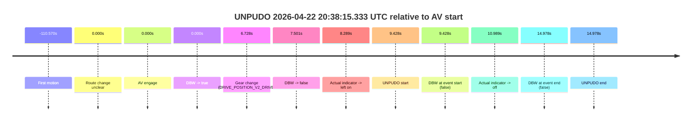
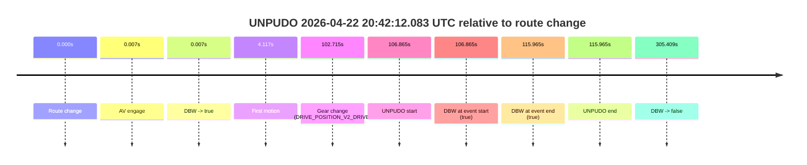
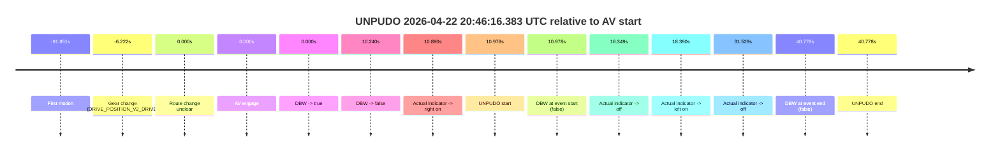

# Run Report: fme10003/2026-04-22--20-12-43--gen2-av-3e0a8cb2-409e-4489-9145-f4a94365bc6c

| Field | Value |
|---|---|
| Run ID | `fme10003/2026-04-22--20-12-43--gen2-av-3e0a8cb2-409e-4489-9145-f4a94365bc6c` |
| Date | `2026-04-22` |
| Model(s) | `mallard-plum-mysterious` |
| Author | `guy.geva` |
| Event count | `3` |

## unpudo 2026-04-22 20:38:15.333 UTC

| Field | Value |
|---|---|
| Model | `mallard-plum-mysterious` |
| Author | `guy.geva` |
| Run ID | `fme10003/2026-04-22--20-12-43--gen2-av-3e0a8cb2-409e-4489-9145-f4a94365bc6c` |
| Date | `2026-04-22` |
| Time (UTC) | `20:38:15.333` |
| Event type | `unpudo` |
| Disengagement type | `none observed` |
| Route change | `unclear` |
| Console | [run](https://console.sso.wayve.ai/run/fme10003/2026-04-22--20-12-43--gen2-av-3e0a8cb2-409e-4489-9145-f4a94365bc6c?id=&time-unixus=1776890295333302) |
| Foxglove | [segment](https://app.foxglove.dev/wayve-on-prem/p/prj_0dX18KZdVHg1fmmI/view?ds=foxglove-stream&ds.deviceName=fme10003&ds.start=2026-04-22T20%3A37%3A55.905486Z&ds.end=2026-04-22T20%3A38%3A30.883299Z&layoutId=lay_0e7VD4WIKDQGU73Y&time=2026-04-22T20%3A38%3A15.333302Z) |

### Event card: fail

- Fail: the credited unpudo does not stay AV-owned. The event window starts with DBW false, and the maneuver outcome lands outside a clean AV-owned segment.

| Event | Time (UTC) | Delta from AV start |
|---|---:|---:|
| First motion | 2026-04-22 20:36:15.335 | `-110.570s` |
| Route change unclear | 2026-04-22 20:38:05.905 | `0.000s` |
| AV engage | 2026-04-22 20:38:05.905 | `0.000s` |
| DBW -> true | 2026-04-22 20:38:05.905 | `0.000s` |
| Gear change (DRIVE_POSITION_V2_DRIVE) | 2026-04-22 20:38:12.633 | `6.728s` |
| DBW -> false | 2026-04-22 20:38:13.406 | `7.501s` |
| Actual indicator -> left on | 2026-04-22 20:38:14.194 | `8.289s` |
| UNPUDO start | 2026-04-22 20:38:15.333 | `9.428s` |
| DBW at event start (false) | 2026-04-22 20:38:15.333 | `9.428s` |
| Actual indicator -> off | 2026-04-22 20:38:16.894 | `10.989s` |
| DBW at event end (false) | 2026-04-22 20:38:20.883 | `14.978s` |
| UNPUDO end | 2026-04-22 20:38:20.883 | `14.978s` |

| Metric | Value |
|---|---|
| Outcome | `fail` |
| Effective failure type | `completed_outside_av` |
| Route change status | `unclear` |
| DBW at event start | `false` |
| DBW at event end | `false` |
| Predicted gear at AV start | `DRIVE_POSITION_V2_DRIVE` |
| Actual gear at AV start | `DRIVE_POSITION_V2_PARK` |
| Predicted gear at event start | `DRIVE_POSITION_V2_DRIVE` |
| Actual gear at event start | `DRIVE_POSITION_V2_DRIVE` |
| Planned indicator direction | `INDICATORS_STATE_V2_LEFT_ON` |
| Controller indicator direction | `INDICATORS_STATE_V2_LEFT_ON` |
| Actual indicator direction | `INDICATORS_STATE_V2_LEFT_ON` |
| Actual indicator at maneuver end | `INDICATORS_STATE_V2_OFF` |
| Driver accel help in AV | `false` |
| Driver accel help timestamp | `n/a` |
| Max accel pedal pct in AV | `0.0%` |
| Max brake pedal pct in AV | `8.0%` |
| Max speed mps in AV | `0.000` |
| Success timing baseline | `AV start` |
| Route -> AV | `n/a` |
| AV -> event start | `9.428s` |
| AV -> first motion | `-110.570s` |
| Success baseline -> event start | `9.428s` |
| Success baseline -> first motion | `-110.570s` |
| AV duration before disengagement | `7.501s` |
| Trajectory waypoint count | `37` |
| Driving-plan step count | `11` |

The scored portion starts from the AV-owned window, not from the pre-AV setup. Route-change search in the stopped pre-event segment was `unclear`, with the baseline therefore set to AV start. At the event anchor the model predicts `DRIVE_POSITION_V2_DRIVE` and the actual gear is `DRIVE_POSITION_V2_DRIVE`. The effective model outcome is `fail` because `completed_outside_av.`

### Resolution

| Field | Value |
|---|---|
| Final outcome | `fail` |
| Do we agree with this label? | `yes` |
| Source disengagement type | `none observed` |
| Resolved effective failure type | `completed_outside_av` |
| Confidence | `medium` |

## unpudo 2026-04-22 20:42:12.083 UTC

| Field | Value |
|---|---|
| Model | `mallard-plum-mysterious` |
| Author | `guy.geva` |
| Run ID | `fme10003/2026-04-22--20-12-43--gen2-av-3e0a8cb2-409e-4489-9145-f4a94365bc6c` |
| Date | `2026-04-22` |
| Time (UTC) | `20:42:12.083` |
| Event type | `unpudo` |
| Disengagement type | `none observed` |
| Route change | `found` |
| Console | [run](https://console.sso.wayve.ai/run/fme10003/2026-04-22--20-12-43--gen2-av-3e0a8cb2-409e-4489-9145-f4a94365bc6c?id=&time-unixus=1776890532083311) |
| Foxglove | [segment](https://app.foxglove.dev/wayve-on-prem/p/prj_0dX18KZdVHg1fmmI/view?ds=foxglove-stream&ds.deviceName=fme10003&ds.start=2026-04-22T20%3A40%3A15.218274Z&ds.end=2026-04-22T20%3A45%3A40.626846Z&layoutId=lay_0e7VD4WIKDQGU73Y&time=2026-04-22T20%3A42%3A12.083311Z) |

### Event card: pass

- Pass: AV owns the credited unpudo from route change through the official unpudo window, the gear state is aligned at the anchor, and the vehicle moves without driver accelerator help in AV.

| Event | Time (UTC) | Delta from route change |
|---|---:|---:|
| Route change | 2026-04-22 20:40:25.218 | `0.000s` |
| AV engage | 2026-04-22 20:40:25.225 | `0.007s` |
| DBW -> true | 2026-04-22 20:40:25.225 | `0.007s` |
| First motion | 2026-04-22 20:40:29.334 | `4.117s` |
| Gear change (DRIVE_POSITION_V2_DRIVE) | 2026-04-22 20:42:07.933 | `102.715s` |
| UNPUDO start | 2026-04-22 20:42:12.083 | `106.865s` |
| DBW at event start (true) | 2026-04-22 20:42:12.083 | `106.865s` |
| DBW at event end (true) | 2026-04-22 20:42:21.183 | `115.965s` |
| UNPUDO end | 2026-04-22 20:42:21.183 | `115.965s` |
| DBW -> false | 2026-04-22 20:45:30.626 | `305.409s` |

| Metric | Value |
|---|---|
| Outcome | `pass` |
| Effective failure type | `none` |
| Route change status | `found` |
| DBW at event start | `true` |
| DBW at event end | `true` |
| Predicted gear at AV start | `DRIVE_POSITION_V2_PARK` |
| Actual gear at AV start | `DRIVE_POSITION_V2_PARK` |
| Predicted gear at event start | `DRIVE_POSITION_V2_DRIVE` |
| Actual gear at event start | `DRIVE_POSITION_V2_DRIVE` |
| Planned indicator direction | `INDICATORS_STATE_V2_OFF` |
| Controller indicator direction | `INDICATORS_STATE_V2_OFF` |
| Actual indicator direction | `INDICATORS_STATE_V2_OFF` |
| Actual indicator at maneuver end | `INDICATORS_STATE_V2_OFF` |
| Driver accel help in AV | `false` |
| Driver accel help timestamp | `n/a` |
| Max accel pedal pct in AV | `0.0%` |
| Max brake pedal pct in AV | `22.0%` |
| Max speed mps in AV | `13.022` |
| Success timing baseline | `route change` |
| Route -> AV | `0.007s` |
| AV -> event start | `106.858s` |
| AV -> first motion | `4.109s` |
| Success baseline -> event start | `106.865s` |
| Success baseline -> first motion | `4.117s` |
| AV duration before disengagement | `305.401s` |
| Trajectory waypoint count | `36` |
| Driving-plan step count | `11` |

The scored portion starts from the AV-owned window, not from the pre-AV setup. Route-change search in the stopped pre-event segment was `found`, with the baseline therefore set to route change. At the event anchor the model predicts `DRIVE_POSITION_V2_DRIVE` and the actual gear is `DRIVE_POSITION_V2_DRIVE`. The effective model outcome is `pass` because `the credited unpudo stays AV-owned through the official unpudo window.`

### Resolution

| Field | Value |
|---|---|
| Final outcome | `pass` |
| Do we agree with this label? | `yes` |
| Source disengagement type | `none observed` |
| Resolved effective failure type | `none` |
| Confidence | `high` |

## unpudo 2026-04-22 20:46:16.383 UTC

| Field | Value |
|---|---|
| Model | `mallard-plum-mysterious` |
| Author | `guy.geva` |
| Run ID | `fme10003/2026-04-22--20-12-43--gen2-av-3e0a8cb2-409e-4489-9145-f4a94365bc6c` |
| Date | `2026-04-22` |
| Time (UTC) | `20:46:16.383` |
| Event type | `unpudo` |
| Disengagement type | `none observed` |
| Route change | `unclear` |
| Console | [run](https://console.sso.wayve.ai/run/fme10003/2026-04-22--20-12-43--gen2-av-3e0a8cb2-409e-4489-9145-f4a94365bc6c?id=&time-unixus=1776890776383304) |
| Foxglove | [segment](https://app.foxglove.dev/wayve-on-prem/p/prj_0dX18KZdVHg1fmmI/view?ds=foxglove-stream&ds.deviceName=fme10003&ds.start=2026-04-22T20%3A45%3A49.183292Z&ds.end=2026-04-22T20%3A46%3A56.183316Z&layoutId=lay_0e7VD4WIKDQGU73Y&time=2026-04-22T20%3A46%3A16.383304Z) |

### Event card: fail

- Fail: the credited unpudo does not stay AV-owned. The event window starts with DBW false, and the maneuver outcome lands outside a clean AV-owned segment.

| Event | Time (UTC) | Delta from AV start |
|---|---:|---:|
| First motion | 2026-04-22 20:44:33.554 | `-91.851s` |
| Gear change (DRIVE_POSITION_V2_DRIVE) | 2026-04-22 20:45:59.183 | `-6.222s` |
| Route change unclear | 2026-04-22 20:46:05.405 | `0.000s` |
| AV engage | 2026-04-22 20:46:05.405 | `0.000s` |
| DBW -> true | 2026-04-22 20:46:05.405 | `0.000s` |
| DBW -> false | 2026-04-22 20:46:15.645 | `10.240s` |
| Actual indicator -> right on | 2026-04-22 20:46:16.295 | `10.890s` |
| UNPUDO start | 2026-04-22 20:46:16.383 | `10.978s` |
| DBW at event start (false) | 2026-04-22 20:46:16.383 | `10.978s` |
| Actual indicator -> off | 2026-04-22 20:46:21.754 | `16.349s` |
| Actual indicator -> left on | 2026-04-22 20:46:23.795 | `18.390s` |
| Actual indicator -> off | 2026-04-22 20:46:36.934 | `31.529s` |
| DBW at event end (false) | 2026-04-22 20:46:46.183 | `40.778s` |
| UNPUDO end | 2026-04-22 20:46:46.183 | `40.778s` |

| Metric | Value |
|---|---|
| Outcome | `fail` |
| Effective failure type | `completed_outside_av` |
| Route change status | `unclear` |
| DBW at event start | `false` |
| DBW at event end | `false` |
| Predicted gear at AV start | `DRIVE_POSITION_V2_DRIVE` |
| Actual gear at AV start | `DRIVE_POSITION_V2_DRIVE` |
| Predicted gear at event start | `DRIVE_POSITION_V2_DRIVE` |
| Actual gear at event start | `DRIVE_POSITION_V2_DRIVE` |
| Planned indicator direction | `INDICATORS_STATE_V2_OFF` |
| Controller indicator direction | `INDICATORS_STATE_V2_OFF` |
| Actual indicator direction | `INDICATORS_STATE_V2_RIGHT_ON` |
| Actual indicator at maneuver end | `INDICATORS_STATE_V2_OFF` |
| Driver accel help in AV | `false` |
| Driver accel help timestamp | `n/a` |
| Max accel pedal pct in AV | `0.0%` |
| Max brake pedal pct in AV | `8.0%` |
| Max speed mps in AV | `0.000` |
| Success timing baseline | `AV start` |
| Route -> AV | `n/a` |
| AV -> event start | `10.978s` |
| AV -> first motion | `-91.851s` |
| Success baseline -> event start | `10.978s` |
| Success baseline -> first motion | `-91.851s` |
| AV duration before disengagement | `10.240s` |
| Trajectory waypoint count | `36` |
| Driving-plan step count | `11` |

The scored portion starts from the AV-owned window, not from the pre-AV setup. Route-change search in the stopped pre-event segment was `unclear`, with the baseline therefore set to AV start. At the event anchor the model predicts `DRIVE_POSITION_V2_DRIVE` and the actual gear is `DRIVE_POSITION_V2_DRIVE`. The effective model outcome is `fail` because `completed_outside_av.`

### Resolution

| Field | Value |
|---|---|
| Final outcome | `fail` |
| Do we agree with this label? | `yes` |
| Source disengagement type | `none observed` |
| Resolved effective failure type | `completed_outside_av` |
| Confidence | `medium` |
