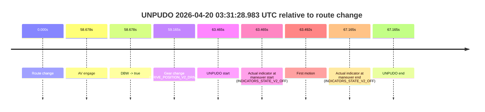

# Run Report: fme10005/2026-04-20--03-13-58--gen2-av-d9cbcfb6-5fa1-40ae-9588-e31507ab03a3

| Field | Value |
|---|---|
| Run ID | `fme10005/2026-04-20--03-13-58--gen2-av-d9cbcfb6-5fa1-40ae-9588-e31507ab03a3` |
| Date | `2026-04-20` |
| Model(s) | `pink-manta-ray-smooth` |
| Author | `guy.geva` |
| Event count | `1` |

## unpudo 2026-04-20 03:31:28.983 UTC

| Field | Value |
|---|---|
| Model | `pink-manta-ray-smooth` |
| Author | `guy.geva` |
| Run ID | `fme10005/2026-04-20--03-13-58--gen2-av-d9cbcfb6-5fa1-40ae-9588-e31507ab03a3` |
| Date | `2026-04-20` |
| Time (UTC) | `03:31:28.983` |
| Event type | `unpudo` |
| Disengagement type | `none observed` |
| Route change | `found` |
| Console | [run](https://console.sso.wayve.ai/run/fme10005/2026-04-20--03-13-58--gen2-av-d9cbcfb6-5fa1-40ae-9588-e31507ab03a3?id=&time-unixus=1776655888983314) |
| Foxglove | [segment](https://app.foxglove.dev/wayve-on-prem/p/prj_0dX18KZdVHg1fmmI/view?ds=foxglove-stream&ds.deviceName=fme10005&ds.start=2026-04-20T03%3A30%3A15.518246Z&ds.end=2026-04-20T03%3A31%3A42.683300Z&layoutId=lay_0e7VD4WIKDQGU73Y&time=2026-04-20T03%3A31%3A28.983314Z) |

### Event card: pass

- Pass: AV owns the credited unpudo through the official event window, the gear state is aligned at the anchor, and the vehicle moves without driver accelerator help in AV.

| Event | Time (UTC) | Delta from route change |
|---|---:|---:|
| Route change | 2026-04-20 03:30:25.518 | `0.000s` |
| AV engage | 2026-04-20 03:31:24.195 | `58.678s` |
| DBW -> true | 2026-04-20 03:31:24.195 | `58.678s` |
| Gear change (DRIVE_POSITION_V2_DRIVE) | 2026-04-20 03:31:24.683 | `59.165s` |
| UNPUDO start | 2026-04-20 03:31:28.983 | `63.465s` |
| Actual indicator at maneuver start (INDICATORS_STATE_V2_OFF) | 2026-04-20 03:31:28.983 | `63.465s` |
| First motion | 2026-04-20 03:31:29.010 | `63.492s` |
| Actual indicator at maneuver end (INDICATORS_STATE_V2_OFF) | 2026-04-20 03:31:32.683 | `67.165s` |
| UNPUDO end | 2026-04-20 03:31:32.683 | `67.165s` |

| Metric | Value |
|---|---|
| Outcome | `pass` |
| Effective failure type | `none` |
| Route change status | `found` |
| DBW at event start | `true` |
| DBW at event end | `true` |
| Predicted gear at AV start | `DRIVE_POSITION_V2_DRIVE` |
| Actual gear at AV start | `DRIVE_POSITION_V2_PARK` |
| Predicted gear at event start | `DRIVE_POSITION_V2_DRIVE` |
| Actual gear at event start | `DRIVE_POSITION_V2_DRIVE` |
| Planned indicator direction | `INDICATORS_STATE_V2_LEFT_ON` |
| Controller indicator direction | `INDICATORS_STATE_V2_LEFT_ON` |
| Actual indicator direction | `INDICATORS_STATE_V2_OFF` |
| Actual indicator at maneuver end | `INDICATORS_STATE_V2_OFF` |
| Driver accel help in AV | `false` |
| Driver accel help timestamp | `n/a` |
| Max accel pedal pct in AV | `0.0%` |
| Max brake pedal pct in AV | `8.0%` |
| Max speed mps in AV | `5.053` |
| Route -> AV | `58.678s` |
| AV -> event start | `4.787s` |
| AV -> first motion | `4.814s` |
| AV duration before disengagement | `n/a` |
| Trajectory waypoint count | `36` |
| Driving-plan step count | `11` |

The scored portion starts from the AV-owned window, not from the pre-AV setup. Route-change search in the stopped pre-event segment was `found`, with the baseline therefore set to route change. At the event anchor the model predicts `DRIVE_POSITION_V2_DRIVE` and the actual gear is `DRIVE_POSITION_V2_DRIVE`. The effective model outcome is `pass` because `the credited maneuver stays AV-owned through the official event end`.

### Resolution

| Field | Value |
|---|---|
| Final outcome | `pass` |
| Do we agree with this label? | `yes` |
| Source disengagement type | `none observed` |
| Resolved effective failure type | `none` |
| Confidence | `high` |
