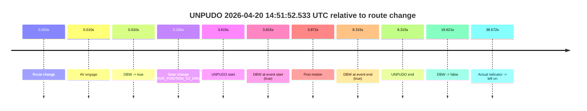
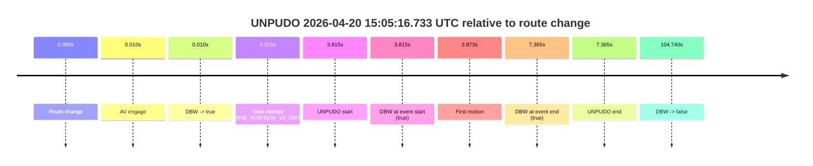
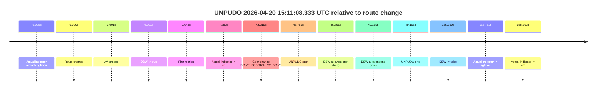
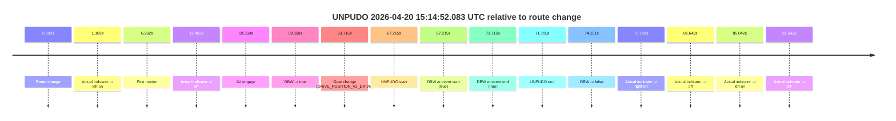
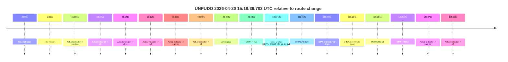
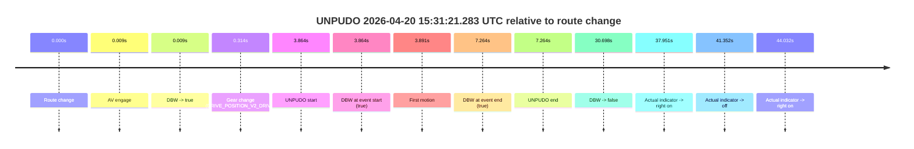
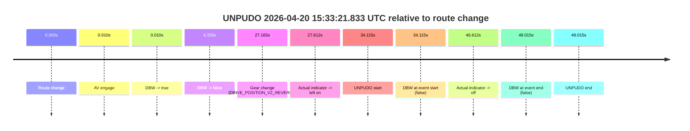
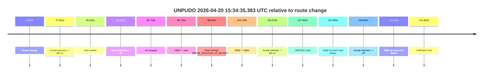

# Run Report: fme10005/2026-04-20--13-43-30--gen2-av-1cf69e8e-fc53-4334-aca9-89918a4f3427

| Field | Value |
|---|---|
| Run ID | `fme10005/2026-04-20--13-43-30--gen2-av-1cf69e8e-fc53-4334-aca9-89918a4f3427` |
| Date | `2026-04-20` |
| Model(s) | `eel-teal-outspoken` |
| Author | `zak` |
| Event count | `10` |

## unpudo 2026-04-20 14:51:52.533 UTC

| Field | Value |
|---|---|
| Model | `eel-teal-outspoken` |
| Author | `zak` |
| Run ID | `fme10005/2026-04-20--13-43-30--gen2-av-1cf69e8e-fc53-4334-aca9-89918a4f3427` |
| Date | `2026-04-20` |
| Time (UTC) | `14:51:52.533` |
| Event type | `unpudo` |
| Disengagement type | `none observed` |
| Route change | `found` |
| Console | [run](https://console.sso.wayve.ai/run/fme10005/2026-04-20--13-43-30--gen2-av-1cf69e8e-fc53-4334-aca9-89918a4f3427?id=&time-unixus=1776696712533303) |
| Foxglove | [segment](https://app.foxglove.dev/wayve-on-prem/p/prj_0dX18KZdVHg1fmmI/view?ds=foxglove-stream&ds.deviceName=fme10005&ds.start=2026-04-20T14%3A51%3A38.718323Z&ds.end=2026-04-20T14%3A52%3A18.338876Z&layoutId=lay_0e7VD4WIKDQGU73Y&time=2026-04-20T14%3A51%3A52.533303Z) |

### Event card: pass

- Pass: AV owns the credited unpudo from route change through the official unpudo window, the gear state is aligned at the anchor, and the vehicle moves without driver accelerator help in AV.

| Event | Time (UTC) | Delta from route change |
|---|---:|---:|
| Route change | 2026-04-20 14:51:48.718 | `0.000s` |
| AV engage | 2026-04-20 14:51:48.727 | `0.010s` |
| DBW -> true | 2026-04-20 14:51:48.727 | `0.010s` |
| Gear change (DRIVE_POSITION_V2_DRIVE) | 2026-04-20 14:51:48.983 | `0.265s` |
| UNPUDO start | 2026-04-20 14:51:52.533 | `3.815s` |
| DBW at event start (true) | 2026-04-20 14:51:52.533 | `3.815s` |
| First motion | 2026-04-20 14:51:52.590 | `3.872s` |
| DBW at event end (true) | 2026-04-20 14:51:57.033 | `8.315s` |
| UNPUDO end | 2026-04-20 14:51:57.033 | `8.315s` |
| DBW -> false | 2026-04-20 14:52:08.338 | `19.621s` |
| Actual indicator -> left on | 2026-04-20 14:52:27.290 | `38.572s` |

| Metric | Value |
|---|---|
| Outcome | `pass` |
| Effective failure type | `none` |
| Route change status | `found` |
| DBW at event start | `true` |
| DBW at event end | `true` |
| Predicted gear at AV start | `DRIVE_POSITION_V2_PARK` |
| Actual gear at AV start | `DRIVE_POSITION_V2_PARK` |
| Predicted gear at event start | `DRIVE_POSITION_V2_DRIVE` |
| Actual gear at event start | `DRIVE_POSITION_V2_DRIVE` |
| Planned indicator direction | `INDICATORS_STATE_V2_LEFT_ON` |
| Controller indicator direction | `INDICATORS_STATE_V2_LEFT_ON` |
| Actual indicator direction | `INDICATORS_STATE_V2_OFF` |
| Actual indicator at maneuver end | `INDICATORS_STATE_V2_OFF` |
| Driver accel help in AV | `false` |
| Driver accel help timestamp | `n/a` |
| Max accel pedal pct in AV | `0.0%` |
| Max brake pedal pct in AV | `9.2%` |
| Max speed mps in AV | `2.850` |
| Success timing baseline | `route change` |
| Route -> AV | `0.010s` |
| AV -> event start | `3.805s` |
| AV -> first motion | `3.862s` |
| Success baseline -> event start | `3.815s` |
| Success baseline -> first motion | `3.872s` |
| AV duration before disengagement | `19.611s` |
| Trajectory waypoint count | `37` |
| Driving-plan step count | `11` |

The scored portion starts from the AV-owned window, not from the pre-AV setup. Route-change search in the stopped pre-event segment was `found`, with the baseline therefore set to route change. At the event anchor the model predicts `DRIVE_POSITION_V2_DRIVE` and the actual gear is `DRIVE_POSITION_V2_DRIVE`. The effective model outcome is `pass` because `the credited unpudo stays AV-owned through the official unpudo window.`

### Resolution

| Field | Value |
|---|---|
| Final outcome | `pass` |
| Do we agree with this label? | `yes` |
| Source disengagement type | `none observed` |
| Resolved effective failure type | `none` |
| Confidence | `high` |

## unpudo 2026-04-20 15:05:16.733 UTC

| Field | Value |
|---|---|
| Model | `eel-teal-outspoken` |
| Author | `zak` |
| Run ID | `fme10005/2026-04-20--13-43-30--gen2-av-1cf69e8e-fc53-4334-aca9-89918a4f3427` |
| Date | `2026-04-20` |
| Time (UTC) | `15:05:16.733` |
| Event type | `unpudo` |
| Disengagement type | `none observed` |
| Route change | `found` |
| Console | [run](https://console.sso.wayve.ai/run/fme10005/2026-04-20--13-43-30--gen2-av-1cf69e8e-fc53-4334-aca9-89918a4f3427?id=&time-unixus=1776697516733298) |
| Foxglove | [segment](https://app.foxglove.dev/wayve-on-prem/p/prj_0dX18KZdVHg1fmmI/view?ds=foxglove-stream&ds.deviceName=fme10005&ds.start=2026-04-20T15%3A05%3A02.918266Z&ds.end=2026-04-20T15%3A07%3A07.658363Z&layoutId=lay_0e7VD4WIKDQGU73Y&time=2026-04-20T15%3A05%3A16.733298Z) |

### Event card: pass

- Pass: AV owns the credited unpudo from route change through the official unpudo window, the gear state is aligned at the anchor, and the vehicle moves without driver accelerator help in AV.

| Event | Time (UTC) | Delta from route change |
|---|---:|---:|
| Route change | 2026-04-20 15:05:12.918 | `0.000s` |
| AV engage | 2026-04-20 15:05:12.927 | `0.010s` |
| DBW -> true | 2026-04-20 15:05:12.927 | `0.010s` |
| Gear change (DRIVE_POSITION_V2_DRIVE) | 2026-04-20 15:05:13.233 | `0.315s` |
| UNPUDO start | 2026-04-20 15:05:16.733 | `3.815s` |
| DBW at event start (true) | 2026-04-20 15:05:16.733 | `3.815s` |
| First motion | 2026-04-20 15:05:16.790 | `3.873s` |
| DBW at event end (true) | 2026-04-20 15:05:20.283 | `7.365s` |
| UNPUDO end | 2026-04-20 15:05:20.283 | `7.365s` |
| DBW -> false | 2026-04-20 15:06:57.658 | `104.740s` |

| Metric | Value |
|---|---|
| Outcome | `pass` |
| Effective failure type | `none` |
| Route change status | `found` |
| DBW at event start | `true` |
| DBW at event end | `true` |
| Predicted gear at AV start | `DRIVE_POSITION_V2_PARK` |
| Actual gear at AV start | `DRIVE_POSITION_V2_PARK` |
| Predicted gear at event start | `DRIVE_POSITION_V2_DRIVE` |
| Actual gear at event start | `DRIVE_POSITION_V2_DRIVE` |
| Planned indicator direction | `INDICATORS_STATE_V2_LEFT_ON` |
| Controller indicator direction | `INDICATORS_STATE_V2_LEFT_ON` |
| Actual indicator direction | `INDICATORS_STATE_V2_OFF` |
| Actual indicator at maneuver end | `INDICATORS_STATE_V2_OFF` |
| Driver accel help in AV | `false` |
| Driver accel help timestamp | `n/a` |
| Max accel pedal pct in AV | `0.0%` |
| Max brake pedal pct in AV | `8.0%` |
| Max speed mps in AV | `5.164` |
| Success timing baseline | `route change` |
| Route -> AV | `0.010s` |
| AV -> event start | `3.805s` |
| AV -> first motion | `3.863s` |
| Success baseline -> event start | `3.815s` |
| Success baseline -> first motion | `3.873s` |
| AV duration before disengagement | `104.731s` |
| Trajectory waypoint count | `37` |
| Driving-plan step count | `11` |

The scored portion starts from the AV-owned window, not from the pre-AV setup. Route-change search in the stopped pre-event segment was `found`, with the baseline therefore set to route change. At the event anchor the model predicts `DRIVE_POSITION_V2_DRIVE` and the actual gear is `DRIVE_POSITION_V2_DRIVE`. The effective model outcome is `pass` because `the credited unpudo stays AV-owned through the official unpudo window.`

### Resolution

| Field | Value |
|---|---|
| Final outcome | `pass` |
| Do we agree with this label? | `yes` |
| Source disengagement type | `none observed` |
| Resolved effective failure type | `none` |
| Confidence | `high` |

## unpudo 2026-04-20 15:11:08.333 UTC

| Field | Value |
|---|---|
| Model | `eel-teal-outspoken` |
| Author | `zak` |
| Run ID | `fme10005/2026-04-20--13-43-30--gen2-av-1cf69e8e-fc53-4334-aca9-89918a4f3427` |
| Date | `2026-04-20` |
| Time (UTC) | `15:11:08.333` |
| Event type | `unpudo` |
| Disengagement type | `none observed` |
| Route change | `found` |
| Console | [run](https://console.sso.wayve.ai/run/fme10005/2026-04-20--13-43-30--gen2-av-1cf69e8e-fc53-4334-aca9-89918a4f3427?id=&time-unixus=1776697868333306) |
| Foxglove | [segment](https://app.foxglove.dev/wayve-on-prem/p/prj_0dX18KZdVHg1fmmI/view?ds=foxglove-stream&ds.deviceName=fme10005&ds.start=2026-04-20T15%3A10%3A12.568263Z&ds.end=2026-04-20T15%3A13%3A07.937578Z&layoutId=lay_0e7VD4WIKDQGU73Y&time=2026-04-20T15%3A11%3A08.333306Z) |

### Event card: pass

- Pass: AV owns the credited unpudo from route change through the official unpudo window, the gear state is aligned at the anchor, and the vehicle moves without driver accelerator help in AV.

| Event | Time (UTC) | Delta from route change |
|---|---:|---:|
| Actual indicator already right on | 2026-04-20 15:10:12.570 | `-9.998s` |
| Route change | 2026-04-20 15:10:22.568 | `0.000s` |
| AV engage | 2026-04-20 15:10:22.569 | `0.001s` |
| DBW -> true | 2026-04-20 15:10:22.569 | `0.001s` |
| First motion | 2026-04-20 15:10:25.210 | `2.642s` |
| Actual indicator -> off | 2026-04-20 15:10:30.450 | `7.882s` |
| Gear change (DRIVE_POSITION_V2_DRIVE) | 2026-04-20 15:11:04.783 | `42.215s` |
| UNPUDO start | 2026-04-20 15:11:08.333 | `45.765s` |
| DBW at event start (true) | 2026-04-20 15:11:08.333 | `45.765s` |
| DBW at event end (true) | 2026-04-20 15:11:11.733 | `49.165s` |
| UNPUDO end | 2026-04-20 15:11:11.733 | `49.165s` |
| DBW -> false | 2026-04-20 15:12:57.937 | `155.369s` |
| Actual indicator -> right on | 2026-04-20 15:12:58.350 | `155.782s` |
| Actual indicator -> off | 2026-04-20 15:13:00.930 | `158.362s` |

| Metric | Value |
|---|---|
| Outcome | `pass` |
| Effective failure type | `none` |
| Route change status | `found` |
| DBW at event start | `true` |
| DBW at event end | `true` |
| Predicted gear at AV start | `DRIVE_POSITION_V2_DRIVE` |
| Actual gear at AV start | `DRIVE_POSITION_V2_DRIVE` |
| Predicted gear at event start | `DRIVE_POSITION_V2_DRIVE` |
| Actual gear at event start | `DRIVE_POSITION_V2_DRIVE` |
| Planned indicator direction | `INDICATORS_STATE_V2_LEFT_ON` |
| Controller indicator direction | `INDICATORS_STATE_V2_LEFT_ON` |
| Actual indicator direction | `INDICATORS_STATE_V2_OFF` |
| Actual indicator at maneuver end | `INDICATORS_STATE_V2_OFF` |
| Driver accel help in AV | `false` |
| Driver accel help timestamp | `n/a` |
| Max accel pedal pct in AV | `0.0%` |
| Max brake pedal pct in AV | `20.2%` |
| Max speed mps in AV | `10.386` |
| Success timing baseline | `route change` |
| Route -> AV | `0.001s` |
| AV -> event start | `45.764s` |
| AV -> first motion | `2.642s` |
| Success baseline -> event start | `45.765s` |
| Success baseline -> first motion | `2.642s` |
| AV duration before disengagement | `155.369s` |
| Trajectory waypoint count | `37` |
| Driving-plan step count | `11` |

The scored portion starts from the AV-owned window, not from the pre-AV setup. Route-change search in the stopped pre-event segment was `found`, with the baseline therefore set to route change. At the event anchor the model predicts `DRIVE_POSITION_V2_DRIVE` and the actual gear is `DRIVE_POSITION_V2_DRIVE`. The effective model outcome is `pass` because `the credited unpudo stays AV-owned through the official unpudo window.`

### Resolution

| Field | Value |
|---|---|
| Final outcome | `pass` |
| Do we agree with this label? | `yes` |
| Source disengagement type | `none observed` |
| Resolved effective failure type | `none` |
| Confidence | `high` |

## unpudo 2026-04-20 15:14:52.083 UTC

| Field | Value |
|---|---|
| Model | `eel-teal-outspoken` |
| Author | `zak` |
| Run ID | `fme10005/2026-04-20--13-43-30--gen2-av-1cf69e8e-fc53-4334-aca9-89918a4f3427` |
| Date | `2026-04-20` |
| Time (UTC) | `15:14:52.083` |
| Event type | `unpudo` |
| Disengagement type | `none observed` |
| Route change | `found` |
| Console | [run](https://console.sso.wayve.ai/run/fme10005/2026-04-20--13-43-30--gen2-av-1cf69e8e-fc53-4334-aca9-89918a4f3427?id=&time-unixus=1776698092083291) |
| Foxglove | [segment](https://app.foxglove.dev/wayve-on-prem/p/prj_0dX18KZdVHg1fmmI/view?ds=foxglove-stream&ds.deviceName=fme10005&ds.start=2026-04-20T15%3A13%3A34.868243Z&ds.end=2026-04-20T15%3A15%3A09.018800Z&layoutId=lay_0e7VD4WIKDQGU73Y&time=2026-04-20T15%3A14%3A52.083291Z) |

### Event card: pass

- Pass: AV owns the credited unpudo from route change through the official unpudo window, the gear state is aligned at the anchor, and the vehicle moves without driver accelerator help in AV.

| Event | Time (UTC) | Delta from route change |
|---|---:|---:|
| Route change | 2026-04-20 15:13:44.868 | `0.000s` |
| Actual indicator -> left on | 2026-04-20 15:13:45.970 | `1.103s` |
| First motion | 2026-04-20 15:13:51.130 | `6.262s` |
| Actual indicator -> off | 2026-04-20 15:13:56.271 | `11.403s` |
| AV engage | 2026-04-20 15:14:44.217 | `59.350s` |
| DBW -> true | 2026-04-20 15:14:44.217 | `59.350s` |
| Gear change (DRIVE_POSITION_V2_DRIVE) | 2026-04-20 15:14:48.583 | `63.715s` |
| UNPUDO start | 2026-04-20 15:14:52.083 | `67.215s` |
| DBW at event start (true) | 2026-04-20 15:14:52.083 | `67.215s` |
| DBW at event end (true) | 2026-04-20 15:14:56.583 | `71.715s` |
| UNPUDO end | 2026-04-20 15:14:56.583 | `71.715s` |
| DBW -> false | 2026-04-20 15:14:59.018 | `74.151s` |
| Actual indicator -> right on | 2026-04-20 15:15:04.010 | `79.142s` |
| Actual indicator -> off | 2026-04-20 15:15:06.510 | `81.642s` |
| Actual indicator -> left on | 2026-04-20 15:15:09.910 | `85.042s` |
| Actual indicator -> off | 2026-04-20 15:15:17.510 | `92.642s` |

| Metric | Value |
|---|---|
| Outcome | `pass` |
| Effective failure type | `none` |
| Route change status | `found` |
| DBW at event start | `true` |
| DBW at event end | `true` |
| Predicted gear at AV start | `DRIVE_POSITION_V2_PARK` |
| Actual gear at AV start | `DRIVE_POSITION_V2_PARK` |
| Predicted gear at event start | `DRIVE_POSITION_V2_DRIVE` |
| Actual gear at event start | `DRIVE_POSITION_V2_DRIVE` |
| Planned indicator direction | `INDICATORS_STATE_V2_OFF` |
| Controller indicator direction | `INDICATORS_STATE_V2_OFF` |
| Actual indicator direction | `INDICATORS_STATE_V2_OFF` |
| Actual indicator at maneuver end | `INDICATORS_STATE_V2_OFF` |
| Driver accel help in AV | `false` |
| Driver accel help timestamp | `n/a` |
| Max accel pedal pct in AV | `0.0%` |
| Max brake pedal pct in AV | `8.0%` |
| Max speed mps in AV | `2.956` |
| Success timing baseline | `route change` |
| Route -> AV | `59.350s` |
| AV -> event start | `7.866s` |
| AV -> first motion | `-53.088s` |
| Success baseline -> event start | `67.215s` |
| Success baseline -> first motion | `6.262s` |
| AV duration before disengagement | `14.801s` |
| Trajectory waypoint count | `36` |
| Driving-plan step count | `11` |

The scored portion starts from the AV-owned window, not from the pre-AV setup. Route-change search in the stopped pre-event segment was `found`, with the baseline therefore set to route change. At the event anchor the model predicts `DRIVE_POSITION_V2_DRIVE` and the actual gear is `DRIVE_POSITION_V2_DRIVE`. The effective model outcome is `pass` because `the credited unpudo stays AV-owned through the official unpudo window.`

### Resolution

| Field | Value |
|---|---|
| Final outcome | `pass` |
| Do we agree with this label? | `yes` |
| Source disengagement type | `none observed` |
| Resolved effective failure type | `none` |
| Confidence | `high` |

## unpudo 2026-04-20 15:16:39.783 UTC

| Field | Value |
|---|---|
| Model | `eel-teal-outspoken` |
| Author | `zak` |
| Run ID | `fme10005/2026-04-20--13-43-30--gen2-av-1cf69e8e-fc53-4334-aca9-89918a4f3427` |
| Date | `2026-04-20` |
| Time (UTC) | `15:16:39.783` |
| Event type | `unpudo` |
| Disengagement type | `none observed` |
| Route change | `found` |
| Console | [run](https://console.sso.wayve.ai/run/fme10005/2026-04-20--13-43-30--gen2-av-1cf69e8e-fc53-4334-aca9-89918a4f3427?id=&time-unixus=1776698199783307) |
| Foxglove | [segment](https://app.foxglove.dev/wayve-on-prem/p/prj_0dX18KZdVHg1fmmI/view?ds=foxglove-stream&ds.deviceName=fme10005&ds.start=2026-04-20T15%3A14%3A38.318988Z&ds.end=2026-04-20T15%3A17%3A59.377623Z&layoutId=lay_0e7VD4WIKDQGU73Y&time=2026-04-20T15%3A16%3A39.783307Z) |

### Event card: pass

- Pass: AV owns the credited unpudo from route change through the official unpudo window, the gear state is aligned at the anchor, and the vehicle moves without driver accelerator help in AV.

| Event | Time (UTC) | Delta from route change |
|---|---:|---:|
| Route change | 2026-04-20 15:14:48.318 | `0.000s` |
| First motion | 2026-04-20 15:14:52.130 | `3.811s` |
| Actual indicator -> right on | 2026-04-20 15:15:04.010 | `15.691s` |
| Actual indicator -> off | 2026-04-20 15:15:06.510 | `18.191s` |
| Actual indicator -> left on | 2026-04-20 15:15:09.910 | `21.591s` |
| Actual indicator -> off | 2026-04-20 15:15:17.510 | `29.191s` |
| Actual indicator -> right on | 2026-04-20 15:15:23.830 | `35.511s` |
| Actual indicator -> off | 2026-04-20 15:15:28.410 | `40.092s` |
| AV engage | 2026-04-20 15:15:31.817 | `43.499s` |
| DBW -> true | 2026-04-20 15:15:31.817 | `43.499s` |
| Gear change (DRIVE_POSITION_V2_DRIVE) | 2026-04-20 15:16:29.483 | `101.164s` |
| UNPUDO start | 2026-04-20 15:16:39.783 | `111.464s` |
| DBW at event start (true) | 2026-04-20 15:16:39.783 | `111.464s` |
| DBW at event end (true) | 2026-04-20 15:16:43.983 | `115.664s` |
| UNPUDO end | 2026-04-20 15:16:43.983 | `115.664s` |
| DBW -> false | 2026-04-20 15:17:49.377 | `181.059s` |
| Actual indicator -> right on | 2026-04-20 15:17:51.790 | `183.471s` |
| Actual indicator -> off | 2026-04-20 15:18:05.310 | `196.991s` |

| Metric | Value |
|---|---|
| Outcome | `pass` |
| Effective failure type | `none` |
| Route change status | `found` |
| DBW at event start | `true` |
| DBW at event end | `true` |
| Predicted gear at AV start | `DRIVE_POSITION_V2_DRIVE` |
| Actual gear at AV start | `DRIVE_POSITION_V2_DRIVE` |
| Predicted gear at event start | `DRIVE_POSITION_V2_DRIVE` |
| Actual gear at event start | `DRIVE_POSITION_V2_DRIVE` |
| Planned indicator direction | `INDICATORS_STATE_V2_LEFT_ON` |
| Controller indicator direction | `INDICATORS_STATE_V2_LEFT_ON` |
| Actual indicator direction | `INDICATORS_STATE_V2_OFF` |
| Actual indicator at maneuver end | `INDICATORS_STATE_V2_OFF` |
| Driver accel help in AV | `false` |
| Driver accel help timestamp | `n/a` |
| Max accel pedal pct in AV | `0.0%` |
| Max brake pedal pct in AV | `13.6%` |
| Max speed mps in AV | `8.881` |
| Success timing baseline | `route change` |
| Route -> AV | `43.499s` |
| AV -> event start | `67.966s` |
| AV -> first motion | `-39.688s` |
| Success baseline -> event start | `111.464s` |
| Success baseline -> first motion | `3.811s` |
| AV duration before disengagement | `137.560s` |
| Trajectory waypoint count | `36` |
| Driving-plan step count | `11` |

The scored portion starts from the AV-owned window, not from the pre-AV setup. Route-change search in the stopped pre-event segment was `found`, with the baseline therefore set to route change. At the event anchor the model predicts `DRIVE_POSITION_V2_DRIVE` and the actual gear is `DRIVE_POSITION_V2_DRIVE`. The effective model outcome is `pass` because `the credited unpudo stays AV-owned through the official unpudo window.`

### Resolution

| Field | Value |
|---|---|
| Final outcome | `pass` |
| Do we agree with this label? | `yes` |
| Source disengagement type | `none observed` |
| Resolved effective failure type | `none` |
| Confidence | `high` |

## unpudo 2026-04-20 15:31:21.283 UTC

| Field | Value |
|---|---|
| Model | `eel-teal-outspoken` |
| Author | `zak` |
| Run ID | `fme10005/2026-04-20--13-43-30--gen2-av-1cf69e8e-fc53-4334-aca9-89918a4f3427` |
| Date | `2026-04-20` |
| Time (UTC) | `15:31:21.283` |
| Event type | `unpudo` |
| Disengagement type | `none observed` |
| Route change | `found` |
| Console | [run](https://console.sso.wayve.ai/run/fme10005/2026-04-20--13-43-30--gen2-av-1cf69e8e-fc53-4334-aca9-89918a4f3427?id=&time-unixus=1776699081283300) |
| Foxglove | [segment](https://app.foxglove.dev/wayve-on-prem/p/prj_0dX18KZdVHg1fmmI/view?ds=foxglove-stream&ds.deviceName=fme10005&ds.start=2026-04-20T15%3A31%3A07.419310Z&ds.end=2026-04-20T15%3A31%3A58.117636Z&layoutId=lay_0e7VD4WIKDQGU73Y&time=2026-04-20T15%3A31%3A21.283300Z) |

### Event card: pass

- Pass: AV owns the credited unpudo from route change through the official unpudo window, the gear state is aligned at the anchor, and the vehicle moves without driver accelerator help in AV.

| Event | Time (UTC) | Delta from route change |
|---|---:|---:|
| Route change | 2026-04-20 15:31:17.419 | `0.000s` |
| AV engage | 2026-04-20 15:31:17.428 | `0.009s` |
| DBW -> true | 2026-04-20 15:31:17.428 | `0.009s` |
| Gear change (DRIVE_POSITION_V2_DRIVE) | 2026-04-20 15:31:17.733 | `0.314s` |
| UNPUDO start | 2026-04-20 15:31:21.283 | `3.864s` |
| DBW at event start (true) | 2026-04-20 15:31:21.283 | `3.864s` |
| First motion | 2026-04-20 15:31:21.310 | `3.891s` |
| DBW at event end (true) | 2026-04-20 15:31:24.683 | `7.264s` |
| UNPUDO end | 2026-04-20 15:31:24.683 | `7.264s` |
| DBW -> false | 2026-04-20 15:31:48.117 | `30.698s` |
| Actual indicator -> right on | 2026-04-20 15:31:55.370 | `37.951s` |
| Actual indicator -> off | 2026-04-20 15:31:58.771 | `41.352s` |
| Actual indicator -> right on | 2026-04-20 15:32:01.451 | `44.032s` |

| Metric | Value |
|---|---|
| Outcome | `pass` |
| Effective failure type | `none` |
| Route change status | `found` |
| DBW at event start | `true` |
| DBW at event end | `true` |
| Predicted gear at AV start | `DRIVE_POSITION_V2_PARK` |
| Actual gear at AV start | `DRIVE_POSITION_V2_PARK` |
| Predicted gear at event start | `DRIVE_POSITION_V2_DRIVE` |
| Actual gear at event start | `DRIVE_POSITION_V2_DRIVE` |
| Planned indicator direction | `INDICATORS_STATE_V2_LEFT_ON` |
| Controller indicator direction | `INDICATORS_STATE_V2_LEFT_ON` |
| Actual indicator direction | `INDICATORS_STATE_V2_OFF` |
| Actual indicator at maneuver end | `INDICATORS_STATE_V2_OFF` |
| Driver accel help in AV | `false` |
| Driver accel help timestamp | `n/a` |
| Max accel pedal pct in AV | `0.0%` |
| Max brake pedal pct in AV | `8.1%` |
| Max speed mps in AV | `5.194` |
| Success timing baseline | `route change` |
| Route -> AV | `0.009s` |
| AV -> event start | `3.855s` |
| AV -> first motion | `3.882s` |
| Success baseline -> event start | `3.864s` |
| Success baseline -> first motion | `3.891s` |
| AV duration before disengagement | `30.690s` |
| Trajectory waypoint count | `36` |
| Driving-plan step count | `11` |

The scored portion starts from the AV-owned window, not from the pre-AV setup. Route-change search in the stopped pre-event segment was `found`, with the baseline therefore set to route change. At the event anchor the model predicts `DRIVE_POSITION_V2_DRIVE` and the actual gear is `DRIVE_POSITION_V2_DRIVE`. The effective model outcome is `pass` because `the credited unpudo stays AV-owned through the official unpudo window.`

### Resolution

| Field | Value |
|---|---|
| Final outcome | `pass` |
| Do we agree with this label? | `yes` |
| Source disengagement type | `none observed` |
| Resolved effective failure type | `none` |
| Confidence | `high` |

## unpudo 2026-04-20 15:33:21.833 UTC

| Field | Value |
|---|---|
| Model | `eel-teal-outspoken` |
| Author | `zak` |
| Run ID | `fme10005/2026-04-20--13-43-30--gen2-av-1cf69e8e-fc53-4334-aca9-89918a4f3427` |
| Date | `2026-04-20` |
| Time (UTC) | `15:33:21.833` |
| Event type | `unpudo` |
| Disengagement type | `none observed` |
| Route change | `found` |
| Console | [run](https://console.sso.wayve.ai/run/fme10005/2026-04-20--13-43-30--gen2-av-1cf69e8e-fc53-4334-aca9-89918a4f3427?id=&time-unixus=1776699201833315) |
| Foxglove | [segment](https://app.foxglove.dev/wayve-on-prem/p/prj_0dX18KZdVHg1fmmI/view?ds=foxglove-stream&ds.deviceName=fme10005&ds.start=2026-04-20T15%3A32%3A37.718294Z&ds.end=2026-04-20T15%3A33%3A46.733304Z&layoutId=lay_0e7VD4WIKDQGU73Y&time=2026-04-20T15%3A33%3A21.833315Z) |

### Event card: fail

- Fail: the credited unpudo does not stay AV-owned. The event window starts with DBW false, and the maneuver outcome lands outside a clean AV-owned segment.

| Event | Time (UTC) | Delta from route change |
|---|---:|---:|
| Route change | 2026-04-20 15:32:47.718 | `0.000s` |
| AV engage | 2026-04-20 15:32:47.727 | `0.010s` |
| DBW -> true | 2026-04-20 15:32:47.727 | `0.010s` |
| DBW -> false | 2026-04-20 15:32:52.057 | `4.339s` |
| Gear change (DRIVE_POSITION_V2_REVERSE) | 2026-04-20 15:33:14.883 | `27.165s` |
| Actual indicator -> left on | 2026-04-20 15:33:15.330 | `27.612s` |
| UNPUDO start | 2026-04-20 15:33:21.833 | `34.115s` |
| DBW at event start (false) | 2026-04-20 15:33:21.833 | `34.115s` |
| Actual indicator -> off | 2026-04-20 15:33:34.330 | `46.612s` |
| DBW at event end (false) | 2026-04-20 15:33:36.733 | `49.015s` |
| UNPUDO end | 2026-04-20 15:33:36.733 | `49.015s` |

| Metric | Value |
|---|---|
| Outcome | `fail` |
| Effective failure type | `not_av_owned` |
| Route change status | `found` |
| DBW at event start | `false` |
| DBW at event end | `false` |
| Predicted gear at AV start | `DRIVE_POSITION_V2_PARK` |
| Actual gear at AV start | `DRIVE_POSITION_V2_PARK` |
| Predicted gear at event start | `DRIVE_POSITION_V2_REVERSE` |
| Actual gear at event start | `DRIVE_POSITION_V2_REVERSE` |
| Planned indicator direction | `INDICATORS_STATE_V2_OFF` |
| Controller indicator direction | `INDICATORS_STATE_V2_OFF` |
| Actual indicator direction | `INDICATORS_STATE_V2_LEFT_ON` |
| Actual indicator at maneuver end | `INDICATORS_STATE_V2_OFF` |
| Driver accel help in AV | `false` |
| Driver accel help timestamp | `n/a` |
| Max accel pedal pct in AV | `0.0%` |
| Max brake pedal pct in AV | `14.4%` |
| Max speed mps in AV | `0.000` |
| Success timing baseline | `route change` |
| Route -> AV | `0.010s` |
| AV -> event start | `34.105s` |
| AV -> first motion | `n/a` |
| Success baseline -> event start | `34.115s` |
| Success baseline -> first motion | `n/a` |
| AV duration before disengagement | `4.329s` |
| Trajectory waypoint count | `38` |
| Driving-plan step count | `11` |

The scored portion starts from the AV-owned window, not from the pre-AV setup. Route-change search in the stopped pre-event segment was `found`, with the baseline therefore set to route change. At the event anchor the model predicts `DRIVE_POSITION_V2_REVERSE` and the actual gear is `DRIVE_POSITION_V2_REVERSE`. The effective model outcome is `fail` because `not_av_owned.`

### Resolution

| Field | Value |
|---|---|
| Final outcome | `fail` |
| Do we agree with this label? | `yes` |
| Source disengagement type | `none observed` |
| Resolved effective failure type | `not_av_owned` |
| Confidence | `high` |

## unpudo 2026-04-20 15:34:35.383 UTC

| Field | Value |
|---|---|
| Model | `eel-teal-outspoken` |
| Author | `zak` |
| Run ID | `fme10005/2026-04-20--13-43-30--gen2-av-1cf69e8e-fc53-4334-aca9-89918a4f3427` |
| Date | `2026-04-20` |
| Time (UTC) | `15:34:35.383` |
| Event type | `unpudo` |
| Disengagement type | `none observed` |
| Route change | `found` |
| Console | [run](https://console.sso.wayve.ai/run/fme10005/2026-04-20--13-43-30--gen2-av-1cf69e8e-fc53-4334-aca9-89918a4f3427?id=&time-unixus=1776699275383305) |
| Foxglove | [segment](https://app.foxglove.dev/wayve-on-prem/p/prj_0dX18KZdVHg1fmmI/view?ds=foxglove-stream&ds.deviceName=fme10005&ds.start=2026-04-20T15%3A32%3A37.718294Z&ds.end=2026-04-20T15%3A34%3A59.533313Z&layoutId=lay_0e7VD4WIKDQGU73Y&time=2026-04-20T15%3A34%3A35.383305Z) |

### Event card: fail

- Fail: the credited unpudo does not stay AV-owned. The event window starts with DBW false, and the maneuver outcome lands outside a clean AV-owned segment.

| Event | Time (UTC) | Delta from route change |
|---|---:|---:|
| Route change | 2026-04-20 15:32:47.718 | `0.000s` |
| Actual indicator -> left on | 2026-04-20 15:33:15.330 | `27.612s` |
| First motion | 2026-04-20 15:33:32.750 | `45.032s` |
| Actual indicator -> off | 2026-04-20 15:33:34.330 | `46.612s` |
| AV engage | 2026-04-20 15:33:54.437 | `66.719s` |
| DBW -> true | 2026-04-20 15:33:54.437 | `66.719s` |
| Gear change (DRIVE_POSITION_V2_REVERSE) | 2026-04-20 15:34:26.333 | `98.615s` |
| DBW -> false | 2026-04-20 15:34:30.838 | `103.120s` |
| Actual indicator -> left on | 2026-04-20 15:34:34.390 | `106.672s` |
| UNPUDO start | 2026-04-20 15:34:35.383 | `107.665s` |
| DBW at event start (false) | 2026-04-20 15:34:35.383 | `107.665s` |
| Actual indicator -> off | 2026-04-20 15:34:46.310 | `118.592s` |
| DBW at event end (false) | 2026-04-20 15:34:49.533 | `121.815s` |
| UNPUDO end | 2026-04-20 15:34:49.533 | `121.815s` |

| Metric | Value |
|---|---|
| Outcome | `fail` |
| Effective failure type | `completed_outside_av` |
| Route change status | `found` |
| DBW at event start | `false` |
| DBW at event end | `false` |
| Predicted gear at AV start | `DRIVE_POSITION_V2_DRIVE` |
| Actual gear at AV start | `DRIVE_POSITION_V2_DRIVE` |
| Predicted gear at event start | `DRIVE_POSITION_V2_REVERSE` |
| Actual gear at event start | `DRIVE_POSITION_V2_REVERSE` |
| Planned indicator direction | `INDICATORS_STATE_V2_OFF` |
| Controller indicator direction | `INDICATORS_STATE_V2_OFF` |
| Actual indicator direction | `INDICATORS_STATE_V2_LEFT_ON` |
| Actual indicator at maneuver end | `INDICATORS_STATE_V2_OFF` |
| Driver accel help in AV | `false` |
| Driver accel help timestamp | `n/a` |
| Max accel pedal pct in AV | `0.0%` |
| Max brake pedal pct in AV | `8.0%` |
| Max speed mps in AV | `10.264` |
| Success timing baseline | `route change` |
| Route -> AV | `66.719s` |
| AV -> event start | `40.946s` |
| AV -> first motion | `-21.687s` |
| Success baseline -> event start | `107.665s` |
| Success baseline -> first motion | `45.032s` |
| AV duration before disengagement | `36.401s` |
| Trajectory waypoint count | `36` |
| Driving-plan step count | `11` |

The scored portion starts from the AV-owned window, not from the pre-AV setup. Route-change search in the stopped pre-event segment was `found`, with the baseline therefore set to route change. At the event anchor the model predicts `DRIVE_POSITION_V2_REVERSE` and the actual gear is `DRIVE_POSITION_V2_REVERSE`. The effective model outcome is `fail` because `completed_outside_av.`

### Resolution

| Field | Value |
|---|---|
| Final outcome | `fail` |
| Do we agree with this label? | `yes` |
| Source disengagement type | `none observed` |
| Resolved effective failure type | `completed_outside_av` |
| Confidence | `high` |

## unpudo 2026-04-20 15:56:01.033 UTC

| Field | Value |
|---|---|
| Model | `eel-teal-outspoken` |
| Author | `zak` |
| Run ID | `fme10005/2026-04-20--13-43-30--gen2-av-1cf69e8e-fc53-4334-aca9-89918a4f3427` |
| Date | `2026-04-20` |
| Time (UTC) | `15:56:01.033` |
| Event type | `unpudo` |
| Disengagement type | `none observed` |
| Route change | `found` |
| Console | [run](https://console.sso.wayve.ai/run/fme10005/2026-04-20--13-43-30--gen2-av-1cf69e8e-fc53-4334-aca9-89918a4f3427?id=&time-unixus=1776700561033320) |
| Foxglove | [segment](https://app.foxglove.dev/wayve-on-prem/p/prj_0dX18KZdVHg1fmmI/view?ds=foxglove-stream&ds.deviceName=fme10005&ds.start=2026-04-20T15%3A55%3A33.218310Z&ds.end=2026-04-20T15%3A57%3A45.057804Z&layoutId=lay_0e7VD4WIKDQGU73Y&time=2026-04-20T15%3A56%3A01.033320Z) |

### Event card: pass

- Pass: AV owns the credited unpudo from route change through the official unpudo window, the gear state is aligned at the anchor, and the vehicle moves without driver accelerator help in AV.

| Event | Time (UTC) | Delta from route change |
|---|---:|---:|
| Route change | 2026-04-20 15:55:43.218 | `0.000s` |
| AV engage | 2026-04-20 15:55:56.057 | `12.840s` |
| DBW -> true | 2026-04-20 15:55:56.057 | `12.840s` |
| Gear change (DRIVE_POSITION_V2_DRIVE) | 2026-04-20 15:55:56.533 | `13.315s` |
| UNPUDO start | 2026-04-20 15:56:01.033 | `17.815s` |
| DBW at event start (true) | 2026-04-20 15:56:01.033 | `17.815s` |
| First motion | 2026-04-20 15:56:01.090 | `17.873s` |
| DBW at event end (true) | 2026-04-20 15:56:04.733 | `21.515s` |
| UNPUDO end | 2026-04-20 15:56:04.733 | `21.515s` |
| DBW -> false | 2026-04-20 15:57:35.057 | `111.839s` |

| Metric | Value |
|---|---|
| Outcome | `pass` |
| Effective failure type | `none` |
| Route change status | `found` |
| DBW at event start | `true` |
| DBW at event end | `true` |
| Predicted gear at AV start | `DRIVE_POSITION_V2_DRIVE` |
| Actual gear at AV start | `DRIVE_POSITION_V2_PARK` |
| Predicted gear at event start | `DRIVE_POSITION_V2_DRIVE` |
| Actual gear at event start | `DRIVE_POSITION_V2_DRIVE` |
| Planned indicator direction | `INDICATORS_STATE_V2_LEFT_ON` |
| Controller indicator direction | `INDICATORS_STATE_V2_LEFT_ON` |
| Actual indicator direction | `INDICATORS_STATE_V2_OFF` |
| Actual indicator at maneuver end | `INDICATORS_STATE_V2_OFF` |
| Driver accel help in AV | `false` |
| Driver accel help timestamp | `n/a` |
| Max accel pedal pct in AV | `0.0%` |
| Max brake pedal pct in AV | `8.3%` |
| Max speed mps in AV | `4.722` |
| Success timing baseline | `route change` |
| Route -> AV | `12.840s` |
| AV -> event start | `4.975s` |
| AV -> first motion | `5.033s` |
| Success baseline -> event start | `17.815s` |
| Success baseline -> first motion | `17.873s` |
| AV duration before disengagement | `99.000s` |
| Trajectory waypoint count | `37` |
| Driving-plan step count | `11` |

The scored portion starts from the AV-owned window, not from the pre-AV setup. Route-change search in the stopped pre-event segment was `found`, with the baseline therefore set to route change. At the event anchor the model predicts `DRIVE_POSITION_V2_DRIVE` and the actual gear is `DRIVE_POSITION_V2_DRIVE`. The effective model outcome is `pass` because `the credited unpudo stays AV-owned through the official unpudo window.`

### Resolution

| Field | Value |
|---|---|
| Final outcome | `pass` |
| Do we agree with this label? | `yes` |
| Source disengagement type | `none observed` |
| Resolved effective failure type | `none` |
| Confidence | `high` |

## unpudo 2026-04-20 16:00:19.333 UTC

| Field | Value |
|---|---|
| Model | `eel-teal-outspoken` |
| Author | `zak` |
| Run ID | `fme10005/2026-04-20--13-43-30--gen2-av-1cf69e8e-fc53-4334-aca9-89918a4f3427` |
| Date | `2026-04-20` |
| Time (UTC) | `16:00:19.333` |
| Event type | `unpudo` |
| Disengagement type | `none observed` |
| Route change | `found` |
| Console | [run](https://console.sso.wayve.ai/run/fme10005/2026-04-20--13-43-30--gen2-av-1cf69e8e-fc53-4334-aca9-89918a4f3427?id=&time-unixus=1776700819333297) |
| Foxglove | [segment](https://app.foxglove.dev/wayve-on-prem/p/prj_0dX18KZdVHg1fmmI/view?ds=foxglove-stream&ds.deviceName=fme10005&ds.start=2026-04-20T16%3A00%3A05.418360Z&ds.end=2026-04-20T16%3A00%3A33.678932Z&layoutId=lay_0e7VD4WIKDQGU73Y&time=2026-04-20T16%3A00%3A19.333297Z) |

### Event card: pass

- Pass: AV owns the credited unpudo from route change through the official unpudo window, the gear state is aligned at the anchor, and the vehicle moves without driver accelerator help in AV.

| Event | Time (UTC) | Delta from route change |
|---|---:|---:|
| Route change | 2026-04-20 16:00:15.418 | `0.000s` |
| AV engage | 2026-04-20 16:00:15.428 | `0.010s` |
| DBW -> true | 2026-04-20 16:00:15.428 | `0.010s` |
| Gear change (DRIVE_POSITION_V2_DRIVE) | 2026-04-20 16:00:15.733 | `0.315s` |
| UNPUDO start | 2026-04-20 16:00:19.333 | `3.915s` |
| DBW at event start (true) | 2026-04-20 16:00:19.333 | `3.915s` |
| First motion | 2026-04-20 16:00:19.390 | `3.972s` |
| DBW at event end (true) | 2026-04-20 16:00:22.933 | `7.515s` |
| UNPUDO end | 2026-04-20 16:00:22.933 | `7.515s` |
| DBW -> false | 2026-04-20 16:00:23.678 | `8.261s` |

| Metric | Value |
|---|---|
| Outcome | `pass` |
| Effective failure type | `none` |
| Route change status | `found` |
| DBW at event start | `true` |
| DBW at event end | `true` |
| Predicted gear at AV start | `DRIVE_POSITION_V2_PARK` |
| Actual gear at AV start | `DRIVE_POSITION_V2_PARK` |
| Predicted gear at event start | `DRIVE_POSITION_V2_DRIVE` |
| Actual gear at event start | `DRIVE_POSITION_V2_DRIVE` |
| Planned indicator direction | `INDICATORS_STATE_V2_LEFT_ON` |
| Controller indicator direction | `INDICATORS_STATE_V2_LEFT_ON` |
| Actual indicator direction | `INDICATORS_STATE_V2_OFF` |
| Actual indicator at maneuver end | `INDICATORS_STATE_V2_OFF` |
| Driver accel help in AV | `false` |
| Driver accel help timestamp | `n/a` |
| Max accel pedal pct in AV | `0.0%` |
| Max brake pedal pct in AV | `16.5%` |
| Max speed mps in AV | `4.369` |
| Success timing baseline | `route change` |
| Route -> AV | `0.010s` |
| AV -> event start | `3.905s` |
| AV -> first motion | `3.962s` |
| Success baseline -> event start | `3.915s` |
| Success baseline -> first motion | `3.972s` |
| AV duration before disengagement | `8.251s` |
| Trajectory waypoint count | `37` |
| Driving-plan step count | `11` |

The scored portion starts from the AV-owned window, not from the pre-AV setup. Route-change search in the stopped pre-event segment was `found`, with the baseline therefore set to route change. At the event anchor the model predicts `DRIVE_POSITION_V2_DRIVE` and the actual gear is `DRIVE_POSITION_V2_DRIVE`. The effective model outcome is `pass` because `the credited unpudo stays AV-owned through the official unpudo window.`

### Resolution

| Field | Value |
|---|---|
| Final outcome | `pass` |
| Do we agree with this label? | `yes` |
| Source disengagement type | `none observed` |
| Resolved effective failure type | `none` |
| Confidence | `high` |
