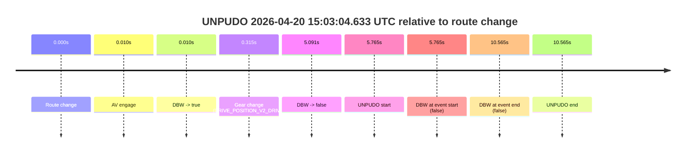
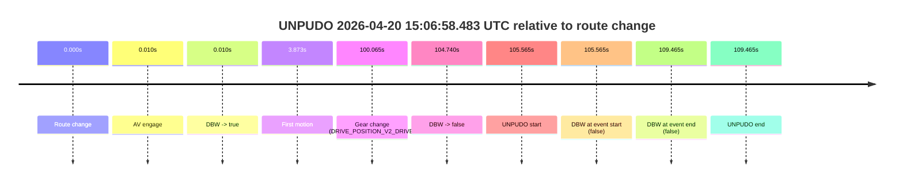
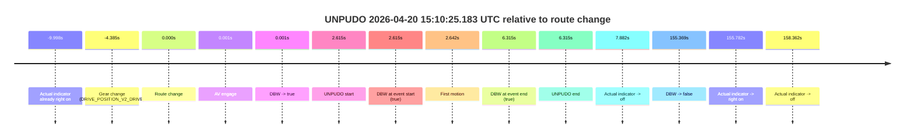
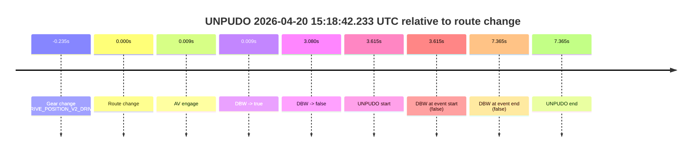
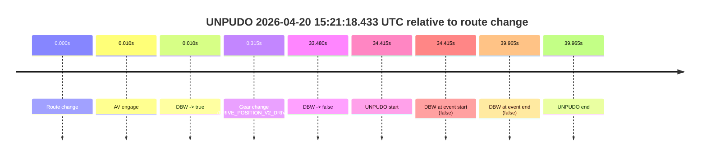
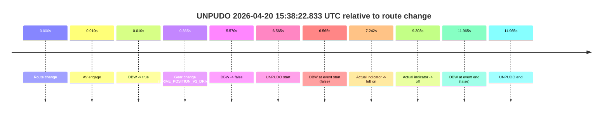
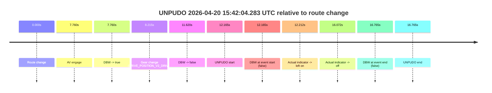

# Run Report: fme10005/2026-04-20--13-43-30--gen2-av-1cf69e8e-fc53-4334-aca9-89918a4f3427

| Field | Value |
|---|---|
| Run ID | `fme10005/2026-04-20--13-43-30--gen2-av-1cf69e8e-fc53-4334-aca9-89918a4f3427` |
| Date | `2026-04-20` |
| Model(s) | `pink-manta-ray-smooth` |
| Author | `guy.geva` |
| Event count | `10` |

## unpudo 2026-04-20 15:03:04.633 UTC

| Field | Value |
|---|---|
| Model | `pink-manta-ray-smooth` |
| Author | `guy.geva` |
| Run ID | `fme10005/2026-04-20--13-43-30--gen2-av-1cf69e8e-fc53-4334-aca9-89918a4f3427` |
| Date | `2026-04-20` |
| Time (UTC) | `15:03:04.633` |
| Event type | `unpudo` |
| Disengagement type | `none observed` |
| Route change | `found` |
| Console | [run](https://console.sso.wayve.ai/run/fme10005/2026-04-20--13-43-30--gen2-av-1cf69e8e-fc53-4334-aca9-89918a4f3427?id=&time-unixus=1776697384633315) |
| Foxglove | [segment](https://app.foxglove.dev/wayve-on-prem/p/prj_0dX18KZdVHg1fmmI/view?ds=foxglove-stream&ds.deviceName=fme10005&ds.start=2026-04-20T15%3A02%3A48.868263Z&ds.end=2026-04-20T15%3A03%3A19.433309Z&layoutId=lay_0e7VD4WIKDQGU73Y&time=2026-04-20T15%3A03%3A04.633315Z) |

### Event card: fail

- Fail: the credited unpudo does not stay AV-owned. The event window starts with DBW false, and the maneuver outcome lands outside a clean AV-owned segment.

| Event | Time (UTC) | Delta from route change |
|---|---:|---:|
| Route change | 2026-04-20 15:02:58.868 | `0.000s` |
| AV engage | 2026-04-20 15:02:58.877 | `0.010s` |
| DBW -> true | 2026-04-20 15:02:58.877 | `0.010s` |
| Gear change (DRIVE_POSITION_V2_DRIVE) | 2026-04-20 15:02:59.183 | `0.315s` |
| DBW -> false | 2026-04-20 15:03:03.959 | `5.091s` |
| UNPUDO start | 2026-04-20 15:03:04.633 | `5.765s` |
| DBW at event start (false) | 2026-04-20 15:03:04.633 | `5.765s` |
| DBW at event end (false) | 2026-04-20 15:03:09.433 | `10.565s` |
| UNPUDO end | 2026-04-20 15:03:09.433 | `10.565s` |

| Metric | Value |
|---|---|
| Outcome | `fail` |
| Effective failure type | `not_av_owned` |
| Route change status | `found` |
| DBW at event start | `false` |
| DBW at event end | `false` |
| Predicted gear at AV start | `DRIVE_POSITION_V2_PARK` |
| Actual gear at AV start | `DRIVE_POSITION_V2_PARK` |
| Predicted gear at event start | `DRIVE_POSITION_V2_DRIVE` |
| Actual gear at event start | `DRIVE_POSITION_V2_DRIVE` |
| Planned indicator direction | `INDICATORS_STATE_V2_OFF` |
| Controller indicator direction | `INDICATORS_STATE_V2_OFF` |
| Actual indicator direction | `INDICATORS_STATE_V2_OFF` |
| Actual indicator at maneuver end | `INDICATORS_STATE_V2_OFF` |
| Driver accel help in AV | `false` |
| Driver accel help timestamp | `n/a` |
| Max accel pedal pct in AV | `0.0%` |
| Max brake pedal pct in AV | `10.3%` |
| Max speed mps in AV | `0.000` |
| Success timing baseline | `route change` |
| Route -> AV | `0.010s` |
| AV -> event start | `5.755s` |
| AV -> first motion | `n/a` |
| Success baseline -> event start | `5.765s` |
| Success baseline -> first motion | `n/a` |
| AV duration before disengagement | `5.082s` |
| Trajectory waypoint count | `37` |
| Driving-plan step count | `11` |

The scored portion starts from the AV-owned window, not from the pre-AV setup. Route-change search in the stopped pre-event segment was `found`, with the baseline therefore set to route change. At the event anchor the model predicts `DRIVE_POSITION_V2_DRIVE` and the actual gear is `DRIVE_POSITION_V2_DRIVE`. The effective model outcome is `fail` because `not_av_owned.`

### Resolution

| Field | Value |
|---|---|
| Final outcome | `fail` |
| Do we agree with this label? | `yes` |
| Source disengagement type | `none observed` |
| Resolved effective failure type | `not_av_owned` |
| Confidence | `high` |

## unpudo 2026-04-20 15:06:58.483 UTC

| Field | Value |
|---|---|
| Model | `pink-manta-ray-smooth` |
| Author | `guy.geva` |
| Run ID | `fme10005/2026-04-20--13-43-30--gen2-av-1cf69e8e-fc53-4334-aca9-89918a4f3427` |
| Date | `2026-04-20` |
| Time (UTC) | `15:06:58.483` |
| Event type | `unpudo` |
| Disengagement type | `none observed` |
| Route change | `found` |
| Console | [run](https://console.sso.wayve.ai/run/fme10005/2026-04-20--13-43-30--gen2-av-1cf69e8e-fc53-4334-aca9-89918a4f3427?id=&time-unixus=1776697618483314) |
| Foxglove | [segment](https://app.foxglove.dev/wayve-on-prem/p/prj_0dX18KZdVHg1fmmI/view?ds=foxglove-stream&ds.deviceName=fme10005&ds.start=2026-04-20T15%3A05%3A02.918266Z&ds.end=2026-04-20T15%3A07%3A12.383293Z&layoutId=lay_0e7VD4WIKDQGU73Y&time=2026-04-20T15%3A06%3A58.483314Z) |

### Event card: fail

- Fail: the credited unpudo does not stay AV-owned. The event window starts with DBW false, and the maneuver outcome lands outside a clean AV-owned segment.

| Event | Time (UTC) | Delta from route change |
|---|---:|---:|
| Route change | 2026-04-20 15:05:12.918 | `0.000s` |
| AV engage | 2026-04-20 15:05:12.927 | `0.010s` |
| DBW -> true | 2026-04-20 15:05:12.927 | `0.010s` |
| First motion | 2026-04-20 15:05:16.790 | `3.873s` |
| Gear change (DRIVE_POSITION_V2_DRIVE) | 2026-04-20 15:06:52.983 | `100.065s` |
| DBW -> false | 2026-04-20 15:06:57.658 | `104.740s` |
| UNPUDO start | 2026-04-20 15:06:58.483 | `105.565s` |
| DBW at event start (false) | 2026-04-20 15:06:58.483 | `105.565s` |
| DBW at event end (false) | 2026-04-20 15:07:02.383 | `109.465s` |
| UNPUDO end | 2026-04-20 15:07:02.383 | `109.465s` |

| Metric | Value |
|---|---|
| Outcome | `fail` |
| Effective failure type | `not_av_owned` |
| Route change status | `found` |
| DBW at event start | `false` |
| DBW at event end | `false` |
| Predicted gear at AV start | `DRIVE_POSITION_V2_PARK` |
| Actual gear at AV start | `DRIVE_POSITION_V2_PARK` |
| Predicted gear at event start | `DRIVE_POSITION_V2_DRIVE` |
| Actual gear at event start | `DRIVE_POSITION_V2_DRIVE` |
| Planned indicator direction | `INDICATORS_STATE_V2_LEFT_ON` |
| Controller indicator direction | `INDICATORS_STATE_V2_LEFT_ON` |
| Actual indicator direction | `INDICATORS_STATE_V2_OFF` |
| Actual indicator at maneuver end | `INDICATORS_STATE_V2_OFF` |
| Driver accel help in AV | `false` |
| Driver accel help timestamp | `n/a` |
| Max accel pedal pct in AV | `0.0%` |
| Max brake pedal pct in AV | `8.8%` |
| Max speed mps in AV | `9.117` |
| Success timing baseline | `route change` |
| Route -> AV | `0.010s` |
| AV -> event start | `105.555s` |
| AV -> first motion | `3.863s` |
| Success baseline -> event start | `105.565s` |
| Success baseline -> first motion | `3.873s` |
| AV duration before disengagement | `104.731s` |
| Trajectory waypoint count | `36` |
| Driving-plan step count | `11` |

The scored portion starts from the AV-owned window, not from the pre-AV setup. Route-change search in the stopped pre-event segment was `found`, with the baseline therefore set to route change. At the event anchor the model predicts `DRIVE_POSITION_V2_DRIVE` and the actual gear is `DRIVE_POSITION_V2_DRIVE`. The effective model outcome is `fail` because `not_av_owned.`

### Resolution

| Field | Value |
|---|---|
| Final outcome | `fail` |
| Do we agree with this label? | `yes` |
| Source disengagement type | `none observed` |
| Resolved effective failure type | `not_av_owned` |
| Confidence | `high` |

## unpudo 2026-04-20 15:10:25.183 UTC

| Field | Value |
|---|---|
| Model | `pink-manta-ray-smooth` |
| Author | `guy.geva` |
| Run ID | `fme10005/2026-04-20--13-43-30--gen2-av-1cf69e8e-fc53-4334-aca9-89918a4f3427` |
| Date | `2026-04-20` |
| Time (UTC) | `15:10:25.183` |
| Event type | `unpudo` |
| Disengagement type | `none observed` |
| Route change | `found` |
| Console | [run](https://console.sso.wayve.ai/run/fme10005/2026-04-20--13-43-30--gen2-av-1cf69e8e-fc53-4334-aca9-89918a4f3427?id=&time-unixus=1776697825183298) |
| Foxglove | [segment](https://app.foxglove.dev/wayve-on-prem/p/prj_0dX18KZdVHg1fmmI/view?ds=foxglove-stream&ds.deviceName=fme10005&ds.start=2026-04-20T15%3A10%3A08.183309Z&ds.end=2026-04-20T15%3A13%3A07.937578Z&layoutId=lay_0e7VD4WIKDQGU73Y&time=2026-04-20T15%3A10%3A25.183298Z) |

### Event card: pass

- Pass: AV owns the credited unpudo from route change through the official unpudo window, the gear state is aligned at the anchor, and the vehicle moves without driver accelerator help in AV.

| Event | Time (UTC) | Delta from route change |
|---|---:|---:|
| Actual indicator already right on | 2026-04-20 15:10:12.570 | `-9.998s` |
| Gear change (DRIVE_POSITION_V2_DRIVE) | 2026-04-20 15:10:18.183 | `-4.385s` |
| Route change | 2026-04-20 15:10:22.568 | `0.000s` |
| AV engage | 2026-04-20 15:10:22.569 | `0.001s` |
| DBW -> true | 2026-04-20 15:10:22.569 | `0.001s` |
| UNPUDO start | 2026-04-20 15:10:25.183 | `2.615s` |
| DBW at event start (true) | 2026-04-20 15:10:25.183 | `2.615s` |
| First motion | 2026-04-20 15:10:25.210 | `2.642s` |
| DBW at event end (true) | 2026-04-20 15:10:28.883 | `6.315s` |
| UNPUDO end | 2026-04-20 15:10:28.883 | `6.315s` |
| Actual indicator -> off | 2026-04-20 15:10:30.450 | `7.882s` |
| DBW -> false | 2026-04-20 15:12:57.937 | `155.369s` |
| Actual indicator -> right on | 2026-04-20 15:12:58.350 | `155.782s` |
| Actual indicator -> off | 2026-04-20 15:13:00.930 | `158.362s` |

| Metric | Value |
|---|---|
| Outcome | `pass` |
| Effective failure type | `none` |
| Route change status | `found` |
| DBW at event start | `true` |
| DBW at event end | `true` |
| Predicted gear at AV start | `DRIVE_POSITION_V2_DRIVE` |
| Actual gear at AV start | `DRIVE_POSITION_V2_DRIVE` |
| Predicted gear at event start | `DRIVE_POSITION_V2_DRIVE` |
| Actual gear at event start | `DRIVE_POSITION_V2_DRIVE` |
| Planned indicator direction | `INDICATORS_STATE_V2_RIGHT_ON` |
| Controller indicator direction | `INDICATORS_STATE_V2_RIGHT_ON` |
| Actual indicator direction | `INDICATORS_STATE_V2_RIGHT_ON` |
| Actual indicator at maneuver end | `INDICATORS_STATE_V2_RIGHT_ON` |
| Driver accel help in AV | `false` |
| Driver accel help timestamp | `n/a` |
| Max accel pedal pct in AV | `0.0%` |
| Max brake pedal pct in AV | `20.2%` |
| Max speed mps in AV | `4.022` |
| Success timing baseline | `route change` |
| Route -> AV | `0.001s` |
| AV -> event start | `2.614s` |
| AV -> first motion | `2.642s` |
| Success baseline -> event start | `2.615s` |
| Success baseline -> first motion | `2.642s` |
| AV duration before disengagement | `155.369s` |
| Trajectory waypoint count | `36` |
| Driving-plan step count | `11` |

The scored portion starts from the AV-owned window, not from the pre-AV setup. Route-change search in the stopped pre-event segment was `found`, with the baseline therefore set to route change. At the event anchor the model predicts `DRIVE_POSITION_V2_DRIVE` and the actual gear is `DRIVE_POSITION_V2_DRIVE`. The effective model outcome is `pass` because `the credited unpudo stays AV-owned through the official unpudo window.`

### Resolution

| Field | Value |
|---|---|
| Final outcome | `pass` |
| Do we agree with this label? | `yes` |
| Source disengagement type | `none observed` |
| Resolved effective failure type | `none` |
| Confidence | `high` |

## unpudo 2026-04-20 15:18:42.233 UTC

| Field | Value |
|---|---|
| Model | `pink-manta-ray-smooth` |
| Author | `guy.geva` |
| Run ID | `fme10005/2026-04-20--13-43-30--gen2-av-1cf69e8e-fc53-4334-aca9-89918a4f3427` |
| Date | `2026-04-20` |
| Time (UTC) | `15:18:42.233` |
| Event type | `unpudo` |
| Disengagement type | `none observed` |
| Route change | `found` |
| Console | [run](https://console.sso.wayve.ai/run/fme10005/2026-04-20--13-43-30--gen2-av-1cf69e8e-fc53-4334-aca9-89918a4f3427?id=&time-unixus=1776698322233291) |
| Foxglove | [segment](https://app.foxglove.dev/wayve-on-prem/p/prj_0dX18KZdVHg1fmmI/view?ds=foxglove-stream&ds.deviceName=fme10005&ds.start=2026-04-20T15%3A18%3A28.383305Z&ds.end=2026-04-20T15%3A18%3A55.983302Z&layoutId=lay_0e7VD4WIKDQGU73Y&time=2026-04-20T15%3A18%3A42.233291Z) |

### Event card: fail

- Fail: the credited unpudo does not stay AV-owned. The event window starts with DBW false, and the maneuver outcome lands outside a clean AV-owned segment.

| Event | Time (UTC) | Delta from route change |
|---|---:|---:|
| Gear change (DRIVE_POSITION_V2_DRIVE) | 2026-04-20 15:18:38.383 | `-0.235s` |
| Route change | 2026-04-20 15:18:38.618 | `0.000s` |
| AV engage | 2026-04-20 15:18:38.628 | `0.009s` |
| DBW -> true | 2026-04-20 15:18:38.628 | `0.009s` |
| DBW -> false | 2026-04-20 15:18:41.698 | `3.080s` |
| UNPUDO start | 2026-04-20 15:18:42.233 | `3.615s` |
| DBW at event start (false) | 2026-04-20 15:18:42.233 | `3.615s` |
| DBW at event end (false) | 2026-04-20 15:18:45.983 | `7.365s` |
| UNPUDO end | 2026-04-20 15:18:45.983 | `7.365s` |

| Metric | Value |
|---|---|
| Outcome | `fail` |
| Effective failure type | `not_av_owned` |
| Route change status | `found` |
| DBW at event start | `false` |
| DBW at event end | `false` |
| Predicted gear at AV start | `DRIVE_POSITION_V2_DRIVE` |
| Actual gear at AV start | `DRIVE_POSITION_V2_DRIVE` |
| Predicted gear at event start | `DRIVE_POSITION_V2_DRIVE` |
| Actual gear at event start | `DRIVE_POSITION_V2_DRIVE` |
| Planned indicator direction | `INDICATORS_STATE_V2_LEFT_ON` |
| Controller indicator direction | `INDICATORS_STATE_V2_LEFT_ON` |
| Actual indicator direction | `INDICATORS_STATE_V2_OFF` |
| Actual indicator at maneuver end | `INDICATORS_STATE_V2_OFF` |
| Driver accel help in AV | `false` |
| Driver accel help timestamp | `n/a` |
| Max accel pedal pct in AV | `0.0%` |
| Max brake pedal pct in AV | `8.0%` |
| Max speed mps in AV | `0.000` |
| Success timing baseline | `route change` |
| Route -> AV | `0.009s` |
| AV -> event start | `3.605s` |
| AV -> first motion | `n/a` |
| Success baseline -> event start | `3.615s` |
| Success baseline -> first motion | `n/a` |
| AV duration before disengagement | `3.070s` |
| Trajectory waypoint count | `37` |
| Driving-plan step count | `11` |

The scored portion starts from the AV-owned window, not from the pre-AV setup. Route-change search in the stopped pre-event segment was `found`, with the baseline therefore set to route change. At the event anchor the model predicts `DRIVE_POSITION_V2_DRIVE` and the actual gear is `DRIVE_POSITION_V2_DRIVE`. The effective model outcome is `fail` because `not_av_owned.`

### Resolution

| Field | Value |
|---|---|
| Final outcome | `fail` |
| Do we agree with this label? | `yes` |
| Source disengagement type | `none observed` |
| Resolved effective failure type | `not_av_owned` |
| Confidence | `high` |

## unpudo 2026-04-20 15:21:18.433 UTC

| Field | Value |
|---|---|
| Model | `pink-manta-ray-smooth` |
| Author | `guy.geva` |
| Run ID | `fme10005/2026-04-20--13-43-30--gen2-av-1cf69e8e-fc53-4334-aca9-89918a4f3427` |
| Date | `2026-04-20` |
| Time (UTC) | `15:21:18.433` |
| Event type | `unpudo` |
| Disengagement type | `none observed` |
| Route change | `found` |
| Console | [run](https://console.sso.wayve.ai/run/fme10005/2026-04-20--13-43-30--gen2-av-1cf69e8e-fc53-4334-aca9-89918a4f3427?id=&time-unixus=1776698478433305) |
| Foxglove | [segment](https://app.foxglove.dev/wayve-on-prem/p/prj_0dX18KZdVHg1fmmI/view?ds=foxglove-stream&ds.deviceName=fme10005&ds.start=2026-04-20T15%3A20%3A34.018329Z&ds.end=2026-04-20T15%3A21%3A33.983309Z&layoutId=lay_0e7VD4WIKDQGU73Y&time=2026-04-20T15%3A21%3A18.433305Z) |

### Event card: fail

- Fail: the credited unpudo does not stay AV-owned. The event window starts with DBW false, and the maneuver outcome lands outside a clean AV-owned segment.

| Event | Time (UTC) | Delta from route change |
|---|---:|---:|
| Route change | 2026-04-20 15:20:44.018 | `0.000s` |
| AV engage | 2026-04-20 15:20:44.027 | `0.010s` |
| DBW -> true | 2026-04-20 15:20:44.027 | `0.010s` |
| Gear change (DRIVE_POSITION_V2_DRIVE) | 2026-04-20 15:20:44.333 | `0.315s` |
| DBW -> false | 2026-04-20 15:21:17.498 | `33.480s` |
| UNPUDO start | 2026-04-20 15:21:18.433 | `34.415s` |
| DBW at event start (false) | 2026-04-20 15:21:18.433 | `34.415s` |
| DBW at event end (false) | 2026-04-20 15:21:23.983 | `39.965s` |
| UNPUDO end | 2026-04-20 15:21:23.983 | `39.965s` |

| Metric | Value |
|---|---|
| Outcome | `fail` |
| Effective failure type | `not_av_owned` |
| Route change status | `found` |
| DBW at event start | `false` |
| DBW at event end | `false` |
| Predicted gear at AV start | `DRIVE_POSITION_V2_PARK` |
| Actual gear at AV start | `DRIVE_POSITION_V2_PARK` |
| Predicted gear at event start | `DRIVE_POSITION_V2_DRIVE` |
| Actual gear at event start | `DRIVE_POSITION_V2_DRIVE` |
| Planned indicator direction | `INDICATORS_STATE_V2_LEFT_ON` |
| Controller indicator direction | `INDICATORS_STATE_V2_LEFT_ON` |
| Actual indicator direction | `INDICATORS_STATE_V2_OFF` |
| Actual indicator at maneuver end | `INDICATORS_STATE_V2_OFF` |
| Driver accel help in AV | `false` |
| Driver accel help timestamp | `n/a` |
| Max accel pedal pct in AV | `0.0%` |
| Max brake pedal pct in AV | `11.5%` |
| Max speed mps in AV | `0.000` |
| Success timing baseline | `route change` |
| Route -> AV | `0.010s` |
| AV -> event start | `34.405s` |
| AV -> first motion | `n/a` |
| Success baseline -> event start | `34.415s` |
| Success baseline -> first motion | `n/a` |
| AV duration before disengagement | `33.470s` |
| Trajectory waypoint count | `37` |
| Driving-plan step count | `11` |

The scored portion starts from the AV-owned window, not from the pre-AV setup. Route-change search in the stopped pre-event segment was `found`, with the baseline therefore set to route change. At the event anchor the model predicts `DRIVE_POSITION_V2_DRIVE` and the actual gear is `DRIVE_POSITION_V2_DRIVE`. The effective model outcome is `fail` because `not_av_owned.`

### Resolution

| Field | Value |
|---|---|
| Final outcome | `fail` |
| Do we agree with this label? | `yes` |
| Source disengagement type | `none observed` |
| Resolved effective failure type | `not_av_owned` |
| Confidence | `high` |

## unpudo 2026-04-20 15:28:43.433 UTC

| Field | Value |
|---|---|
| Model | `pink-manta-ray-smooth` |
| Author | `guy.geva` |
| Run ID | `fme10005/2026-04-20--13-43-30--gen2-av-1cf69e8e-fc53-4334-aca9-89918a4f3427` |
| Date | `2026-04-20` |
| Time (UTC) | `15:28:43.433` |
| Event type | `unpudo` |
| Disengagement type | `none observed` |
| Route change | `found` |
| Console | [run](https://console.sso.wayve.ai/run/fme10005/2026-04-20--13-43-30--gen2-av-1cf69e8e-fc53-4334-aca9-89918a4f3427?id=&time-unixus=1776698923433311) |
| Foxglove | [segment](https://app.foxglove.dev/wayve-on-prem/p/prj_0dX18KZdVHg1fmmI/view?ds=foxglove-stream&ds.deviceName=fme10005&ds.start=2026-04-20T15%3A28%3A12.418295Z&ds.end=2026-04-20T15%3A28%3A57.483293Z&layoutId=lay_0e7VD4WIKDQGU73Y&time=2026-04-20T15%3A28%3A43.433311Z) |

### Event card: fail

- Fail: the credited unpudo does not stay AV-owned. The event window starts with DBW false, and the maneuver outcome lands outside a clean AV-owned segment.

| Event | Time (UTC) | Delta from route change |
|---|---:|---:|
| Route change | 2026-04-20 15:28:22.418 | `0.000s` |
| AV engage | 2026-04-20 15:28:22.427 | `0.009s` |
| DBW -> true | 2026-04-20 15:28:22.427 | `0.009s` |
| Gear change (DRIVE_POSITION_V2_DRIVE) | 2026-04-20 15:28:22.733 | `0.315s` |
| DBW -> false | 2026-04-20 15:28:42.838 | `20.420s` |
| UNPUDO start | 2026-04-20 15:28:43.433 | `21.015s` |
| DBW at event start (false) | 2026-04-20 15:28:43.433 | `21.015s` |
| Actual indicator -> left on | 2026-04-20 15:28:44.550 | `22.133s` |
| Actual indicator -> off | 2026-04-20 15:28:46.690 | `24.273s` |
| DBW at event end (false) | 2026-04-20 15:28:47.483 | `25.065s` |
| UNPUDO end | 2026-04-20 15:28:47.483 | `25.065s` |

| Metric | Value |
|---|---|
| Outcome | `fail` |
| Effective failure type | `not_av_owned` |
| Route change status | `found` |
| DBW at event start | `false` |
| DBW at event end | `false` |
| Predicted gear at AV start | `DRIVE_POSITION_V2_PARK` |
| Actual gear at AV start | `DRIVE_POSITION_V2_PARK` |
| Predicted gear at event start | `DRIVE_POSITION_V2_DRIVE` |
| Actual gear at event start | `DRIVE_POSITION_V2_DRIVE` |
| Planned indicator direction | `INDICATORS_STATE_V2_LEFT_ON` |
| Controller indicator direction | `INDICATORS_STATE_V2_LEFT_ON` |
| Actual indicator direction | `INDICATORS_STATE_V2_OFF` |
| Actual indicator at maneuver end | `INDICATORS_STATE_V2_OFF` |
| Driver accel help in AV | `false` |
| Driver accel help timestamp | `n/a` |
| Max accel pedal pct in AV | `0.0%` |
| Max brake pedal pct in AV | `15.7%` |
| Max speed mps in AV | `0.000` |
| Success timing baseline | `route change` |
| Route -> AV | `0.009s` |
| AV -> event start | `21.006s` |
| AV -> first motion | `n/a` |
| Success baseline -> event start | `21.015s` |
| Success baseline -> first motion | `n/a` |
| AV duration before disengagement | `20.411s` |
| Trajectory waypoint count | `37` |
| Driving-plan step count | `11` |

The scored portion starts from the AV-owned window, not from the pre-AV setup. Route-change search in the stopped pre-event segment was `found`, with the baseline therefore set to route change. At the event anchor the model predicts `DRIVE_POSITION_V2_DRIVE` and the actual gear is `DRIVE_POSITION_V2_DRIVE`. The effective model outcome is `fail` because `not_av_owned.`

### Resolution

| Field | Value |
|---|---|
| Final outcome | `fail` |
| Do we agree with this label? | `yes` |
| Source disengagement type | `none observed` |
| Resolved effective failure type | `not_av_owned` |
| Confidence | `high` |

## unpudo 2026-04-20 15:38:22.833 UTC

| Field | Value |
|---|---|
| Model | `pink-manta-ray-smooth` |
| Author | `guy.geva` |
| Run ID | `fme10005/2026-04-20--13-43-30--gen2-av-1cf69e8e-fc53-4334-aca9-89918a4f3427` |
| Date | `2026-04-20` |
| Time (UTC) | `15:38:22.833` |
| Event type | `unpudo` |
| Disengagement type | `none observed` |
| Route change | `found` |
| Console | [run](https://console.sso.wayve.ai/run/fme10005/2026-04-20--13-43-30--gen2-av-1cf69e8e-fc53-4334-aca9-89918a4f3427?id=&time-unixus=1776699502833313) |
| Foxglove | [segment](https://app.foxglove.dev/wayve-on-prem/p/prj_0dX18KZdVHg1fmmI/view?ds=foxglove-stream&ds.deviceName=fme10005&ds.start=2026-04-20T15%3A38%3A06.268263Z&ds.end=2026-04-20T15%3A38%3A38.233313Z&layoutId=lay_0e7VD4WIKDQGU73Y&time=2026-04-20T15%3A38%3A22.833313Z) |

### Event card: fail

- Fail: the credited unpudo does not stay AV-owned. The event window starts with DBW false, and the maneuver outcome lands outside a clean AV-owned segment.

| Event | Time (UTC) | Delta from route change |
|---|---:|---:|
| Route change | 2026-04-20 15:38:16.268 | `0.000s` |
| AV engage | 2026-04-20 15:38:16.277 | `0.010s` |
| DBW -> true | 2026-04-20 15:38:16.277 | `0.010s` |
| Gear change (DRIVE_POSITION_V2_DRIVE) | 2026-04-20 15:38:16.633 | `0.365s` |
| DBW -> false | 2026-04-20 15:38:21.838 | `5.570s` |
| UNPUDO start | 2026-04-20 15:38:22.833 | `6.565s` |
| DBW at event start (false) | 2026-04-20 15:38:22.833 | `6.565s` |
| Actual indicator -> left on | 2026-04-20 15:38:23.510 | `7.242s` |
| Actual indicator -> off | 2026-04-20 15:38:25.571 | `9.303s` |
| DBW at event end (false) | 2026-04-20 15:38:28.233 | `11.965s` |
| UNPUDO end | 2026-04-20 15:38:28.233 | `11.965s` |

| Metric | Value |
|---|---|
| Outcome | `fail` |
| Effective failure type | `not_av_owned` |
| Route change status | `found` |
| DBW at event start | `false` |
| DBW at event end | `false` |
| Predicted gear at AV start | `DRIVE_POSITION_V2_PARK` |
| Actual gear at AV start | `DRIVE_POSITION_V2_PARK` |
| Predicted gear at event start | `DRIVE_POSITION_V2_DRIVE` |
| Actual gear at event start | `DRIVE_POSITION_V2_DRIVE` |
| Planned indicator direction | `INDICATORS_STATE_V2_LEFT_ON` |
| Controller indicator direction | `INDICATORS_STATE_V2_LEFT_ON` |
| Actual indicator direction | `INDICATORS_STATE_V2_OFF` |
| Actual indicator at maneuver end | `INDICATORS_STATE_V2_OFF` |
| Driver accel help in AV | `false` |
| Driver accel help timestamp | `n/a` |
| Max accel pedal pct in AV | `0.0%` |
| Max brake pedal pct in AV | `8.0%` |
| Max speed mps in AV | `0.000` |
| Success timing baseline | `route change` |
| Route -> AV | `0.010s` |
| AV -> event start | `6.556s` |
| AV -> first motion | `n/a` |
| Success baseline -> event start | `6.565s` |
| Success baseline -> first motion | `n/a` |
| AV duration before disengagement | `5.561s` |
| Trajectory waypoint count | `37` |
| Driving-plan step count | `11` |

The scored portion starts from the AV-owned window, not from the pre-AV setup. Route-change search in the stopped pre-event segment was `found`, with the baseline therefore set to route change. At the event anchor the model predicts `DRIVE_POSITION_V2_DRIVE` and the actual gear is `DRIVE_POSITION_V2_DRIVE`. The effective model outcome is `fail` because `not_av_owned.`

### Resolution

| Field | Value |
|---|---|
| Final outcome | `fail` |
| Do we agree with this label? | `yes` |
| Source disengagement type | `none observed` |
| Resolved effective failure type | `not_av_owned` |
| Confidence | `high` |

## unpudo 2026-04-20 15:42:04.283 UTC

| Field | Value |
|---|---|
| Model | `pink-manta-ray-smooth` |
| Author | `guy.geva` |
| Run ID | `fme10005/2026-04-20--13-43-30--gen2-av-1cf69e8e-fc53-4334-aca9-89918a4f3427` |
| Date | `2026-04-20` |
| Time (UTC) | `15:42:04.283` |
| Event type | `unpudo` |
| Disengagement type | `none observed` |
| Route change | `found` |
| Console | [run](https://console.sso.wayve.ai/run/fme10005/2026-04-20--13-43-30--gen2-av-1cf69e8e-fc53-4334-aca9-89918a4f3427?id=&time-unixus=1776699724283293) |
| Foxglove | [segment](https://app.foxglove.dev/wayve-on-prem/p/prj_0dX18KZdVHg1fmmI/view?ds=foxglove-stream&ds.deviceName=fme10005&ds.start=2026-04-20T15%3A41%3A42.118309Z&ds.end=2026-04-20T15%3A42%3A18.883313Z&layoutId=lay_0e7VD4WIKDQGU73Y&time=2026-04-20T15%3A42%3A04.283293Z) |

### Event card: fail

- Fail: the credited unpudo does not stay AV-owned. The event window starts with DBW false, and the maneuver outcome lands outside a clean AV-owned segment.

| Event | Time (UTC) | Delta from route change |
|---|---:|---:|
| Route change | 2026-04-20 15:41:52.118 | `0.000s` |
| AV engage | 2026-04-20 15:41:59.877 | `7.760s` |
| DBW -> true | 2026-04-20 15:41:59.877 | `7.760s` |
| Gear change (DRIVE_POSITION_V2_DRIVE) | 2026-04-20 15:42:00.333 | `8.215s` |
| DBW -> false | 2026-04-20 15:42:03.738 | `11.620s` |
| UNPUDO start | 2026-04-20 15:42:04.283 | `12.165s` |
| DBW at event start (false) | 2026-04-20 15:42:04.283 | `12.165s` |
| Actual indicator -> left on | 2026-04-20 15:42:04.330 | `12.212s` |
| Actual indicator -> off | 2026-04-20 15:42:08.190 | `16.072s` |
| DBW at event end (false) | 2026-04-20 15:42:08.883 | `16.765s` |
| UNPUDO end | 2026-04-20 15:42:08.883 | `16.765s` |

| Metric | Value |
|---|---|
| Outcome | `fail` |
| Effective failure type | `not_av_owned` |
| Route change status | `found` |
| DBW at event start | `false` |
| DBW at event end | `false` |
| Predicted gear at AV start | `DRIVE_POSITION_V2_DRIVE` |
| Actual gear at AV start | `DRIVE_POSITION_V2_PARK` |
| Predicted gear at event start | `DRIVE_POSITION_V2_DRIVE` |
| Actual gear at event start | `DRIVE_POSITION_V2_DRIVE` |
| Planned indicator direction | `INDICATORS_STATE_V2_LEFT_ON` |
| Controller indicator direction | `INDICATORS_STATE_V2_LEFT_ON` |
| Actual indicator direction | `INDICATORS_STATE_V2_OFF` |
| Actual indicator at maneuver end | `INDICATORS_STATE_V2_OFF` |
| Driver accel help in AV | `false` |
| Driver accel help timestamp | `n/a` |
| Max accel pedal pct in AV | `0.0%` |
| Max brake pedal pct in AV | `9.1%` |
| Max speed mps in AV | `0.000` |
| Success timing baseline | `route change` |
| Route -> AV | `7.760s` |
| AV -> event start | `4.405s` |
| AV -> first motion | `n/a` |
| Success baseline -> event start | `12.165s` |
| Success baseline -> first motion | `n/a` |
| AV duration before disengagement | `3.860s` |
| Trajectory waypoint count | `36` |
| Driving-plan step count | `11` |

The scored portion starts from the AV-owned window, not from the pre-AV setup. Route-change search in the stopped pre-event segment was `found`, with the baseline therefore set to route change. At the event anchor the model predicts `DRIVE_POSITION_V2_DRIVE` and the actual gear is `DRIVE_POSITION_V2_DRIVE`. The effective model outcome is `fail` because `not_av_owned.`

### Resolution

| Field | Value |
|---|---|
| Final outcome | `fail` |
| Do we agree with this label? | `yes` |
| Source disengagement type | `none observed` |
| Resolved effective failure type | `not_av_owned` |
| Confidence | `high` |

## unpudo 2026-04-20 15:50:46.183 UTC

| Field | Value |
|---|---|
| Model | `pink-manta-ray-smooth` |
| Author | `guy.geva` |
| Run ID | `fme10005/2026-04-20--13-43-30--gen2-av-1cf69e8e-fc53-4334-aca9-89918a4f3427` |
| Date | `2026-04-20` |
| Time (UTC) | `15:50:46.183` |
| Event type | `unpudo` |
| Disengagement type | `none observed` |
| Route change | `found` |
| Console | [run](https://console.sso.wayve.ai/run/fme10005/2026-04-20--13-43-30--gen2-av-1cf69e8e-fc53-4334-aca9-89918a4f3427?id=&time-unixus=1776700246183300) |
| Foxglove | [segment](https://app.foxglove.dev/wayve-on-prem/p/prj_0dX18KZdVHg1fmmI/view?ds=foxglove-stream&ds.deviceName=fme10005&ds.start=2026-04-20T15%3A50%3A27.568280Z&ds.end=2026-04-20T15%3A50%3A59.933310Z&layoutId=lay_0e7VD4WIKDQGU73Y&time=2026-04-20T15%3A50%3A46.183300Z) |

### Event card: fail

- Fail: the credited unpudo does not stay AV-owned. The event window starts with DBW false, and the maneuver outcome lands outside a clean AV-owned segment.

| Event | Time (UTC) | Delta from route change |
|---|---:|---:|
| Route change | 2026-04-20 15:50:37.568 | `0.000s` |
| AV engage | 2026-04-20 15:50:41.897 | `4.330s` |
| DBW -> true | 2026-04-20 15:50:41.897 | `4.330s` |
| Gear change (DRIVE_POSITION_V2_DRIVE) | 2026-04-20 15:50:42.233 | `4.665s` |
| DBW -> false | 2026-04-20 15:50:45.598 | `8.030s` |
| UNPUDO start | 2026-04-20 15:50:46.183 | `8.615s` |
| DBW at event start (false) | 2026-04-20 15:50:46.183 | `8.615s` |
| Actual indicator -> left on | 2026-04-20 15:50:46.870 | `9.302s` |
| Actual indicator -> off | 2026-04-20 15:50:49.110 | `11.542s` |
| DBW at event end (false) | 2026-04-20 15:50:49.933 | `12.365s` |
| UNPUDO end | 2026-04-20 15:50:49.933 | `12.365s` |

| Metric | Value |
|---|---|
| Outcome | `fail` |
| Effective failure type | `not_av_owned` |
| Route change status | `found` |
| DBW at event start | `false` |
| DBW at event end | `false` |
| Predicted gear at AV start | `DRIVE_POSITION_V2_DRIVE` |
| Actual gear at AV start | `DRIVE_POSITION_V2_PARK` |
| Predicted gear at event start | `DRIVE_POSITION_V2_DRIVE` |
| Actual gear at event start | `DRIVE_POSITION_V2_DRIVE` |
| Planned indicator direction | `INDICATORS_STATE_V2_LEFT_ON` |
| Controller indicator direction | `INDICATORS_STATE_V2_LEFT_ON` |
| Actual indicator direction | `INDICATORS_STATE_V2_OFF` |
| Actual indicator at maneuver end | `INDICATORS_STATE_V2_OFF` |
| Driver accel help in AV | `false` |
| Driver accel help timestamp | `n/a` |
| Max accel pedal pct in AV | `0.0%` |
| Max brake pedal pct in AV | `11.0%` |
| Max speed mps in AV | `0.000` |
| Success timing baseline | `route change` |
| Route -> AV | `4.330s` |
| AV -> event start | `4.285s` |
| AV -> first motion | `n/a` |
| Success baseline -> event start | `8.615s` |
| Success baseline -> first motion | `n/a` |
| AV duration before disengagement | `3.700s` |
| Trajectory waypoint count | `37` |
| Driving-plan step count | `11` |

The scored portion starts from the AV-owned window, not from the pre-AV setup. Route-change search in the stopped pre-event segment was `found`, with the baseline therefore set to route change. At the event anchor the model predicts `DRIVE_POSITION_V2_DRIVE` and the actual gear is `DRIVE_POSITION_V2_DRIVE`. The effective model outcome is `fail` because `not_av_owned.`

### Resolution

| Field | Value |
|---|---|
| Final outcome | `fail` |
| Do we agree with this label? | `yes` |
| Source disengagement type | `none observed` |
| Resolved effective failure type | `not_av_owned` |
| Confidence | `high` |

## unpudo 2026-04-20 15:58:21.533 UTC

| Field | Value |
|---|---|
| Model | `pink-manta-ray-smooth` |
| Author | `guy.geva` |
| Run ID | `fme10005/2026-04-20--13-43-30--gen2-av-1cf69e8e-fc53-4334-aca9-89918a4f3427` |
| Date | `2026-04-20` |
| Time (UTC) | `15:58:21.533` |
| Event type | `unpudo` |
| Disengagement type | `none observed` |
| Route change | `found` |
| Console | [run](https://console.sso.wayve.ai/run/fme10005/2026-04-20--13-43-30--gen2-av-1cf69e8e-fc53-4334-aca9-89918a4f3427?id=&time-unixus=1776700701533308) |
| Foxglove | [segment](https://app.foxglove.dev/wayve-on-prem/p/prj_0dX18KZdVHg1fmmI/view?ds=foxglove-stream&ds.deviceName=fme10005&ds.start=2026-04-20T15%3A57%3A21.418281Z&ds.end=2026-04-20T15%3A58%3A36.333301Z&layoutId=lay_0e7VD4WIKDQGU73Y&time=2026-04-20T15%3A58%3A21.533308Z) |

### Event card: fail

- Fail: the credited unpudo does not stay AV-owned. The event window starts with DBW false, and the maneuver outcome lands outside a clean AV-owned segment.

| Event | Time (UTC) | Delta from route change |
|---|---:|---:|
| Route change | 2026-04-20 15:57:31.418 | `0.000s` |
| AV engage | 2026-04-20 15:58:05.317 | `33.899s` |
| DBW -> true | 2026-04-20 15:58:05.317 | `33.899s` |
| DBW -> false | 2026-04-20 15:58:07.777 | `36.360s` |
| Actual indicator -> left on | 2026-04-20 15:58:15.710 | `44.292s` |
| Gear change (DRIVE_POSITION_V2_DRIVE) | 2026-04-20 15:58:19.633 | `48.215s` |
| UNPUDO start | 2026-04-20 15:58:21.533 | `50.115s` |
| DBW at event start (false) | 2026-04-20 15:58:21.533 | `50.115s` |
| Actual indicator -> off | 2026-04-20 15:58:23.930 | `52.513s` |
| DBW at event end (true) | 2026-04-20 15:58:26.333 | `54.915s` |
| UNPUDO end | 2026-04-20 15:58:26.333 | `54.915s` |

| Metric | Value |
|---|---|
| Outcome | `fail` |
| Effective failure type | `not_av_owned` |
| Route change status | `found` |
| DBW at event start | `false` |
| DBW at event end | `true` |
| Predicted gear at AV start | `DRIVE_POSITION_V2_REVERSE` |
| Actual gear at AV start | `DRIVE_POSITION_V2_PARK` |
| Predicted gear at event start | `DRIVE_POSITION_V2_DRIVE` |
| Actual gear at event start | `DRIVE_POSITION_V2_DRIVE` |
| Planned indicator direction | `INDICATORS_STATE_V2_OFF` |
| Controller indicator direction | `INDICATORS_STATE_V2_OFF` |
| Actual indicator direction | `INDICATORS_STATE_V2_LEFT_ON` |
| Actual indicator at maneuver end | `INDICATORS_STATE_V2_OFF` |
| Driver accel help in AV | `false` |
| Driver accel help timestamp | `n/a` |
| Max accel pedal pct in AV | `0.0%` |
| Max brake pedal pct in AV | `8.0%` |
| Max speed mps in AV | `0.000` |
| Success timing baseline | `route change` |
| Route -> AV | `33.899s` |
| AV -> event start | `16.216s` |
| AV -> first motion | `n/a` |
| Success baseline -> event start | `50.115s` |
| Success baseline -> first motion | `n/a` |
| AV duration before disengagement | `2.460s` |
| Trajectory waypoint count | `37` |
| Driving-plan step count | `11` |

The scored portion starts from the AV-owned window, not from the pre-AV setup. Route-change search in the stopped pre-event segment was `found`, with the baseline therefore set to route change. At the event anchor the model predicts `DRIVE_POSITION_V2_DRIVE` and the actual gear is `DRIVE_POSITION_V2_DRIVE`. The effective model outcome is `fail` because `not_av_owned.`

### Resolution

| Field | Value |
|---|---|
| Final outcome | `fail` |
| Do we agree with this label? | `yes` |
| Source disengagement type | `none observed` |
| Resolved effective failure type | `not_av_owned` |
| Confidence | `high` |
