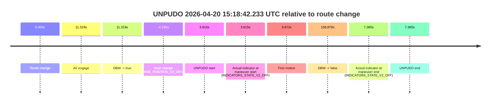
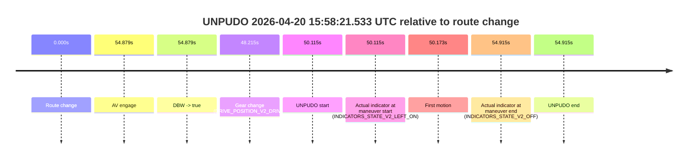

# Run Report: fme10005/2026-04-20--13-43-30--gen2-av-1cf69e8e-fc53-4334-aca9-89918a4f3427

| Field | Value |
|---|---|
| Run ID | `fme10005/2026-04-20--13-43-30--gen2-av-1cf69e8e-fc53-4334-aca9-89918a4f3427` |
| Date | `2026-04-20` |
| Model(s) | `pink-manta-ray-smooth` |
| Author | `guy.geva` |
| Event count | `10` |

## unpudo 2026-04-20 15:03:04.633 UTC

| Field | Value |
|---|---|
| Model | `pink-manta-ray-smooth` |
| Author | `guy.geva` |
| Run ID | `fme10005/2026-04-20--13-43-30--gen2-av-1cf69e8e-fc53-4334-aca9-89918a4f3427` |
| Date | `2026-04-20` |
| Time (UTC) | `15:03:04.633` |
| Event type | `unpudo` |
| Disengagement type | `none observed` |
| Route change | `found` |
| Console | [run](https://console.sso.wayve.ai/run/fme10005/2026-04-20--13-43-30--gen2-av-1cf69e8e-fc53-4334-aca9-89918a4f3427?id=&time-unixus=1776697384633315) |
| Foxglove | [segment](https://app.foxglove.dev/wayve-on-prem/p/prj_0dX18KZdVHg1fmmI/view?ds=foxglove-stream&ds.deviceName=fme10005&ds.start=2026-04-20T15%3A02%3A48.868263Z&ds.end=2026-04-20T15%3A04%3A31.478566Z&layoutId=lay_0e7VD4WIKDQGU73Y&time=2026-04-20T15%3A03%3A04.633315Z) |

### Event card: non-av

- Non-AV: there is no AV-owned portion anywhere inside the detected unpudo timeline, so it is kept for coverage but excluded from model success / failure scoring.

| Event | Time (UTC) | Delta from route change |
|---|---:|---:|
| Route change | 2026-04-20 15:02:58.868 | `0.000s` |
| AV engage | 2026-04-20 15:03:11.777 | `12.909s` |
| DBW -> true | 2026-04-20 15:03:11.777 | `12.909s` |
| Gear change (DRIVE_POSITION_V2_DRIVE) | 2026-04-20 15:02:59.183 | `0.315s` |
| UNPUDO start | 2026-04-20 15:03:04.633 | `5.765s` |
| Actual indicator at maneuver start (INDICATORS_STATE_V2_OFF) | 2026-04-20 15:03:04.633 | `5.765s` |
| First motion | 2026-04-20 15:03:04.650 | `5.782s` |
| DBW -> false | 2026-04-20 15:04:21.478 | `82.610s` |
| Actual indicator at maneuver end (INDICATORS_STATE_V2_OFF) | 2026-04-20 15:03:09.433 | `10.565s` |
| UNPUDO end | 2026-04-20 15:03:09.433 | `10.565s` |

| Metric | Value |
|---|---|
| Outcome | `non-av` |
| Effective failure type | `none` |
| Route change status | `found` |
| DBW at event start | `false` |
| DBW at event end | `false` |
| Predicted gear at AV start | `DRIVE_POSITION_V2_DRIVE` |
| Actual gear at AV start | `DRIVE_POSITION_V2_DRIVE` |
| Predicted gear at event start | `DRIVE_POSITION_V2_DRIVE` |
| Actual gear at event start | `DRIVE_POSITION_V2_DRIVE` |
| Planned indicator direction | `INDICATORS_STATE_V2_OFF` |
| Controller indicator direction | `INDICATORS_STATE_V2_OFF` |
| Actual indicator direction | `INDICATORS_STATE_V2_OFF` |
| Actual indicator at maneuver end | `INDICATORS_STATE_V2_OFF` |
| Driver accel help in AV | `false` |
| Driver accel help timestamp | `n/a` |
| Max accel pedal pct in AV | `0.0%` |
| Max brake pedal pct in AV | `0.0%` |
| Max speed mps in AV | `0.000` |
| Route -> AV | `12.909s` |
| AV -> event start | `-7.144s` |
| AV -> first motion | `-7.127s` |
| AV duration before disengagement | `69.701s` |
| Trajectory waypoint count | `37` |
| Driving-plan step count | `11` |

The scored portion starts from the AV-owned window, not from the pre-AV setup. Route-change search in the stopped pre-event segment was `found`, with the baseline therefore set to route change. At the event anchor the model predicts `DRIVE_POSITION_V2_DRIVE` and the actual gear is `DRIVE_POSITION_V2_DRIVE`. The effective model outcome is `non-av` because `there is no AV-owned overlap inside the event timeline`.

### Resolution

| Field | Value |
|---|---|
| Final outcome | `non-av` |
| Do we agree with this label? | `yes` |
| Source disengagement type | `none observed` |
| Resolved effective failure type | `none` |
| Confidence | `high` |

## unpudo 2026-04-20 15:06:58.483 UTC

| Field | Value |
|---|---|
| Model | `pink-manta-ray-smooth` |
| Author | `guy.geva` |
| Run ID | `fme10005/2026-04-20--13-43-30--gen2-av-1cf69e8e-fc53-4334-aca9-89918a4f3427` |
| Date | `2026-04-20` |
| Time (UTC) | `15:06:58.483` |
| Event type | `unpudo` |
| Disengagement type | `none observed` |
| Route change | `found` |
| Console | [run](https://console.sso.wayve.ai/run/fme10005/2026-04-20--13-43-30--gen2-av-1cf69e8e-fc53-4334-aca9-89918a4f3427?id=&time-unixus=1776697618483314) |
| Foxglove | [segment](https://app.foxglove.dev/wayve-on-prem/p/prj_0dX18KZdVHg1fmmI/view?ds=foxglove-stream&ds.deviceName=fme10005&ds.start=2026-04-20T15%3A05%3A02.918266Z&ds.end=2026-04-20T15%3A08%3A52.518900Z&layoutId=lay_0e7VD4WIKDQGU73Y&time=2026-04-20T15%3A06%3A58.483314Z) |

### Event card: non-av

- Non-AV: there is no AV-owned portion anywhere inside the detected unpudo timeline, so it is kept for coverage but excluded from model success / failure scoring.

| Event | Time (UTC) | Delta from route change |
|---|---:|---:|
| Route change | 2026-04-20 15:05:12.918 | `0.000s` |
| AV engage | 2026-04-20 15:07:04.758 | `111.840s` |
| DBW -> true | 2026-04-20 15:07:04.758 | `111.840s` |
| Gear change (DRIVE_POSITION_V2_DRIVE) | 2026-04-20 15:06:52.983 | `100.065s` |
| UNPUDO start | 2026-04-20 15:06:58.483 | `105.565s` |
| Actual indicator at maneuver start (INDICATORS_STATE_V2_OFF) | 2026-04-20 15:06:58.483 | `105.565s` |
| First motion | 2026-04-20 15:06:58.531 | `105.613s` |
| DBW -> false | 2026-04-20 15:08:42.518 | `209.601s` |
| Actual indicator at maneuver end (INDICATORS_STATE_V2_OFF) | 2026-04-20 15:07:02.383 | `109.465s` |
| UNPUDO end | 2026-04-20 15:07:02.383 | `109.465s` |

| Metric | Value |
|---|---|
| Outcome | `non-av` |
| Effective failure type | `none` |
| Route change status | `found` |
| DBW at event start | `false` |
| DBW at event end | `false` |
| Predicted gear at AV start | `DRIVE_POSITION_V2_DRIVE` |
| Actual gear at AV start | `DRIVE_POSITION_V2_DRIVE` |
| Predicted gear at event start | `DRIVE_POSITION_V2_DRIVE` |
| Actual gear at event start | `DRIVE_POSITION_V2_DRIVE` |
| Planned indicator direction | `INDICATORS_STATE_V2_LEFT_ON` |
| Controller indicator direction | `INDICATORS_STATE_V2_LEFT_ON` |
| Actual indicator direction | `INDICATORS_STATE_V2_OFF` |
| Actual indicator at maneuver end | `INDICATORS_STATE_V2_OFF` |
| Driver accel help in AV | `false` |
| Driver accel help timestamp | `n/a` |
| Max accel pedal pct in AV | `0.0%` |
| Max brake pedal pct in AV | `0.0%` |
| Max speed mps in AV | `0.000` |
| Route -> AV | `111.840s` |
| AV -> event start | `-6.275s` |
| AV -> first motion | `-6.227s` |
| AV duration before disengagement | `97.760s` |
| Trajectory waypoint count | `36` |
| Driving-plan step count | `11` |

The scored portion starts from the AV-owned window, not from the pre-AV setup. Route-change search in the stopped pre-event segment was `found`, with the baseline therefore set to route change. At the event anchor the model predicts `DRIVE_POSITION_V2_DRIVE` and the actual gear is `DRIVE_POSITION_V2_DRIVE`. The effective model outcome is `non-av` because `there is no AV-owned overlap inside the event timeline`.

### Resolution

| Field | Value |
|---|---|
| Final outcome | `non-av` |
| Do we agree with this label? | `yes` |
| Source disengagement type | `none observed` |
| Resolved effective failure type | `none` |
| Confidence | `high` |

## unpudo 2026-04-20 15:10:25.183 UTC

| Field | Value |
|---|---|
| Model | `pink-manta-ray-smooth` |
| Author | `guy.geva` |
| Run ID | `fme10005/2026-04-20--13-43-30--gen2-av-1cf69e8e-fc53-4334-aca9-89918a4f3427` |
| Date | `2026-04-20` |
| Time (UTC) | `15:10:25.183` |
| Event type | `unpudo` |
| Disengagement type | `none observed` |
| Route change | `found` |
| Console | [run](https://console.sso.wayve.ai/run/fme10005/2026-04-20--13-43-30--gen2-av-1cf69e8e-fc53-4334-aca9-89918a4f3427?id=&time-unixus=1776697825183298) |
| Foxglove | [segment](https://app.foxglove.dev/wayve-on-prem/p/prj_0dX18KZdVHg1fmmI/view?ds=foxglove-stream&ds.deviceName=fme10005&ds.start=2026-04-20T15%3A10%3A07.757832Z&ds.end=2026-04-20T15%3A13%3A07.937578Z&layoutId=lay_0e7VD4WIKDQGU73Y&time=2026-04-20T15%3A10%3A25.183298Z) |

### Event card: pass

- Pass: AV owns the credited unpudo through the official event window, the gear state is aligned at the anchor, and the vehicle moves without driver accelerator help in AV.

| Event | Time (UTC) | Delta from route change |
|---|---:|---:|
| Route change | 2026-04-20 15:10:22.568 | `0.000s` |
| AV engage | 2026-04-20 15:10:17.757 | `-4.810s` |
| DBW -> true | 2026-04-20 15:10:17.757 | `-4.810s` |
| Gear change (DRIVE_POSITION_V2_DRIVE) | 2026-04-20 15:10:18.183 | `-4.385s` |
| UNPUDO start | 2026-04-20 15:10:25.183 | `2.615s` |
| Actual indicator at maneuver start (INDICATORS_STATE_V2_RIGHT_ON) | 2026-04-20 15:10:25.183 | `2.615s` |
| First motion | 2026-04-20 15:10:25.210 | `2.642s` |
| DBW -> false | 2026-04-20 15:12:57.937 | `155.369s` |
| Actual indicator at maneuver end (INDICATORS_STATE_V2_RIGHT_ON) | 2026-04-20 15:10:28.883 | `6.315s` |
| UNPUDO end | 2026-04-20 15:10:28.883 | `6.315s` |

| Metric | Value |
|---|---|
| Outcome | `pass` |
| Effective failure type | `none` |
| Route change status | `found` |
| DBW at event start | `true` |
| DBW at event end | `true` |
| Predicted gear at AV start | `DRIVE_POSITION_V2_DRIVE` |
| Actual gear at AV start | `DRIVE_POSITION_V2_PARK` |
| Predicted gear at event start | `DRIVE_POSITION_V2_DRIVE` |
| Actual gear at event start | `DRIVE_POSITION_V2_DRIVE` |
| Planned indicator direction | `INDICATORS_STATE_V2_RIGHT_ON` |
| Controller indicator direction | `INDICATORS_STATE_V2_RIGHT_ON` |
| Actual indicator direction | `INDICATORS_STATE_V2_RIGHT_ON` |
| Actual indicator at maneuver end | `INDICATORS_STATE_V2_RIGHT_ON` |
| Driver accel help in AV | `false` |
| Driver accel help timestamp | `n/a` |
| Max accel pedal pct in AV | `0.0%` |
| Max brake pedal pct in AV | `0.0%` |
| Max speed mps in AV | `4.022` |
| Route -> AV | `-4.810s` |
| AV -> event start | `7.425s` |
| AV -> first motion | `7.453s` |
| AV duration before disengagement | `160.180s` |
| Trajectory waypoint count | `36` |
| Driving-plan step count | `11` |

The scored portion starts from the AV-owned window, not from the pre-AV setup. Route-change search in the stopped pre-event segment was `found`, with the baseline therefore set to route change. At the event anchor the model predicts `DRIVE_POSITION_V2_DRIVE` and the actual gear is `DRIVE_POSITION_V2_DRIVE`. The effective model outcome is `pass` because `the credited maneuver stays AV-owned through the official event end`.

### Resolution

| Field | Value |
|---|---|
| Final outcome | `pass` |
| Do we agree with this label? | `yes` |
| Source disengagement type | `none observed` |
| Resolved effective failure type | `none` |
| Confidence | `high` |

## unpudo 2026-04-20 15:18:42.233 UTC

| Field | Value |
|---|---|
| Model | `pink-manta-ray-smooth` |
| Author | `guy.geva` |
| Run ID | `fme10005/2026-04-20--13-43-30--gen2-av-1cf69e8e-fc53-4334-aca9-89918a4f3427` |
| Date | `2026-04-20` |
| Time (UTC) | `15:18:42.233` |
| Event type | `unpudo` |
| Disengagement type | `none observed` |
| Route change | `found` |
| Console | [run](https://console.sso.wayve.ai/run/fme10005/2026-04-20--13-43-30--gen2-av-1cf69e8e-fc53-4334-aca9-89918a4f3427?id=&time-unixus=1776698322233291) |
| Foxglove | [segment](https://app.foxglove.dev/wayve-on-prem/p/prj_0dX18KZdVHg1fmmI/view?ds=foxglove-stream&ds.deviceName=fme10005&ds.start=2026-04-20T15%3A18%3A28.383305Z&ds.end=2026-04-20T15%3A21%3A27.498190Z&layoutId=lay_0e7VD4WIKDQGU73Y&time=2026-04-20T15%3A18%3A42.233291Z) |

### Event card: non-av

- Non-AV: there is no AV-owned portion anywhere inside the detected unpudo timeline, so it is kept for coverage but excluded from model success / failure scoring.

| Event | Time (UTC) | Delta from route change |
|---|---:|---:|
| Route change | 2026-04-20 15:18:38.618 | `0.000s` |
| AV engage | 2026-04-20 15:18:49.937 | `11.319s` |
| DBW -> true | 2026-04-20 15:18:49.937 | `11.319s` |
| Gear change (DRIVE_POSITION_V2_DRIVE) | 2026-04-20 15:18:38.383 | `-0.235s` |
| UNPUDO start | 2026-04-20 15:18:42.233 | `3.615s` |
| Actual indicator at maneuver start (INDICATORS_STATE_V2_OFF) | 2026-04-20 15:18:42.233 | `3.615s` |
| First motion | 2026-04-20 15:18:42.290 | `3.672s` |
| DBW -> false | 2026-04-20 15:21:17.498 | `158.879s` |
| Actual indicator at maneuver end (INDICATORS_STATE_V2_OFF) | 2026-04-20 15:18:45.983 | `7.365s` |
| UNPUDO end | 2026-04-20 15:18:45.983 | `7.365s` |

| Metric | Value |
|---|---|
| Outcome | `non-av` |
| Effective failure type | `none` |
| Route change status | `found` |
| DBW at event start | `false` |
| DBW at event end | `false` |
| Predicted gear at AV start | `DRIVE_POSITION_V2_DRIVE` |
| Actual gear at AV start | `DRIVE_POSITION_V2_DRIVE` |
| Predicted gear at event start | `DRIVE_POSITION_V2_DRIVE` |
| Actual gear at event start | `DRIVE_POSITION_V2_DRIVE` |
| Planned indicator direction | `INDICATORS_STATE_V2_LEFT_ON` |
| Controller indicator direction | `INDICATORS_STATE_V2_LEFT_ON` |
| Actual indicator direction | `INDICATORS_STATE_V2_OFF` |
| Actual indicator at maneuver end | `INDICATORS_STATE_V2_OFF` |
| Driver accel help in AV | `false` |
| Driver accel help timestamp | `n/a` |
| Max accel pedal pct in AV | `0.0%` |
| Max brake pedal pct in AV | `0.0%` |
| Max speed mps in AV | `0.000` |
| Route -> AV | `11.319s` |
| AV -> event start | `-7.704s` |
| AV -> first motion | `-7.647s` |
| AV duration before disengagement | `147.561s` |
| Trajectory waypoint count | `37` |
| Driving-plan step count | `11` |

The scored portion starts from the AV-owned window, not from the pre-AV setup. Route-change search in the stopped pre-event segment was `found`, with the baseline therefore set to route change. At the event anchor the model predicts `DRIVE_POSITION_V2_DRIVE` and the actual gear is `DRIVE_POSITION_V2_DRIVE`. The effective model outcome is `non-av` because `there is no AV-owned overlap inside the event timeline`.

### Resolution

| Field | Value |
|---|---|
| Final outcome | `non-av` |
| Do we agree with this label? | `yes` |
| Source disengagement type | `none observed` |
| Resolved effective failure type | `none` |
| Confidence | `high` |

## unpudo 2026-04-20 15:21:18.433 UTC

| Field | Value |
|---|---|
| Model | `pink-manta-ray-smooth` |
| Author | `guy.geva` |
| Run ID | `fme10005/2026-04-20--13-43-30--gen2-av-1cf69e8e-fc53-4334-aca9-89918a4f3427` |
| Date | `2026-04-20` |
| Time (UTC) | `15:21:18.433` |
| Event type | `unpudo` |
| Disengagement type | `none observed` |
| Route change | `found` |
| Console | [run](https://console.sso.wayve.ai/run/fme10005/2026-04-20--13-43-30--gen2-av-1cf69e8e-fc53-4334-aca9-89918a4f3427?id=&time-unixus=1776698478433305) |
| Foxglove | [segment](https://app.foxglove.dev/wayve-on-prem/p/prj_0dX18KZdVHg1fmmI/view?ds=foxglove-stream&ds.deviceName=fme10005&ds.start=2026-04-20T15%3A20%3A34.018329Z&ds.end=2026-04-20T15%3A24%3A23.358480Z&layoutId=lay_0e7VD4WIKDQGU73Y&time=2026-04-20T15%3A21%3A18.433305Z) |

### Event card: non-av

- Non-AV: there is no AV-owned portion anywhere inside the detected unpudo timeline, so it is kept for coverage but excluded from model success / failure scoring.

| Event | Time (UTC) | Delta from route change |
|---|---:|---:|
| Route change | 2026-04-20 15:20:44.018 | `0.000s` |
| AV engage | 2026-04-20 15:21:26.017 | `41.999s` |
| DBW -> true | 2026-04-20 15:21:26.017 | `41.999s` |
| Gear change (DRIVE_POSITION_V2_DRIVE) | 2026-04-20 15:20:44.333 | `0.315s` |
| UNPUDO start | 2026-04-20 15:21:18.433 | `34.415s` |
| Actual indicator at maneuver start (INDICATORS_STATE_V2_OFF) | 2026-04-20 15:21:18.433 | `34.415s` |
| First motion | 2026-04-20 15:21:18.490 | `34.472s` |
| DBW -> false | 2026-04-20 15:24:13.358 | `209.340s` |
| Actual indicator at maneuver end (INDICATORS_STATE_V2_OFF) | 2026-04-20 15:21:23.983 | `39.965s` |
| UNPUDO end | 2026-04-20 15:21:23.983 | `39.965s` |

| Metric | Value |
|---|---|
| Outcome | `non-av` |
| Effective failure type | `none` |
| Route change status | `found` |
| DBW at event start | `false` |
| DBW at event end | `false` |
| Predicted gear at AV start | `DRIVE_POSITION_V2_DRIVE` |
| Actual gear at AV start | `DRIVE_POSITION_V2_DRIVE` |
| Predicted gear at event start | `DRIVE_POSITION_V2_DRIVE` |
| Actual gear at event start | `DRIVE_POSITION_V2_DRIVE` |
| Planned indicator direction | `INDICATORS_STATE_V2_LEFT_ON` |
| Controller indicator direction | `INDICATORS_STATE_V2_LEFT_ON` |
| Actual indicator direction | `INDICATORS_STATE_V2_OFF` |
| Actual indicator at maneuver end | `INDICATORS_STATE_V2_OFF` |
| Driver accel help in AV | `false` |
| Driver accel help timestamp | `n/a` |
| Max accel pedal pct in AV | `0.0%` |
| Max brake pedal pct in AV | `0.0%` |
| Max speed mps in AV | `0.000` |
| Route -> AV | `41.999s` |
| AV -> event start | `-7.584s` |
| AV -> first motion | `-7.527s` |
| AV duration before disengagement | `167.341s` |
| Trajectory waypoint count | `37` |
| Driving-plan step count | `11` |

The scored portion starts from the AV-owned window, not from the pre-AV setup. Route-change search in the stopped pre-event segment was `found`, with the baseline therefore set to route change. At the event anchor the model predicts `DRIVE_POSITION_V2_DRIVE` and the actual gear is `DRIVE_POSITION_V2_DRIVE`. The effective model outcome is `non-av` because `there is no AV-owned overlap inside the event timeline`.

### Resolution

| Field | Value |
|---|---|
| Final outcome | `non-av` |
| Do we agree with this label? | `yes` |
| Source disengagement type | `none observed` |
| Resolved effective failure type | `none` |
| Confidence | `high` |

## unpudo 2026-04-20 15:28:43.433 UTC

| Field | Value |
|---|---|
| Model | `pink-manta-ray-smooth` |
| Author | `guy.geva` |
| Run ID | `fme10005/2026-04-20--13-43-30--gen2-av-1cf69e8e-fc53-4334-aca9-89918a4f3427` |
| Date | `2026-04-20` |
| Time (UTC) | `15:28:43.433` |
| Event type | `unpudo` |
| Disengagement type | `none observed` |
| Route change | `found` |
| Console | [run](https://console.sso.wayve.ai/run/fme10005/2026-04-20--13-43-30--gen2-av-1cf69e8e-fc53-4334-aca9-89918a4f3427?id=&time-unixus=1776698923433311) |
| Foxglove | [segment](https://app.foxglove.dev/wayve-on-prem/p/prj_0dX18KZdVHg1fmmI/view?ds=foxglove-stream&ds.deviceName=fme10005&ds.start=2026-04-20T15%3A28%3A12.418295Z&ds.end=2026-04-20T15%3A29%3A55.398586Z&layoutId=lay_0e7VD4WIKDQGU73Y&time=2026-04-20T15%3A28%3A43.433311Z) |

### Event card: non-av

- Non-AV: there is no AV-owned portion anywhere inside the detected unpudo timeline, so it is kept for coverage but excluded from model success / failure scoring.

| Event | Time (UTC) | Delta from route change |
|---|---:|---:|
| Route change | 2026-04-20 15:28:22.418 | `0.000s` |
| AV engage | 2026-04-20 15:28:52.178 | `29.761s` |
| DBW -> true | 2026-04-20 15:28:52.178 | `29.761s` |
| Gear change (DRIVE_POSITION_V2_DRIVE) | 2026-04-20 15:28:22.733 | `0.315s` |
| UNPUDO start | 2026-04-20 15:28:43.433 | `21.015s` |
| Actual indicator at maneuver start (INDICATORS_STATE_V2_OFF) | 2026-04-20 15:28:43.433 | `21.015s` |
| First motion | 2026-04-20 15:28:43.491 | `21.073s` |
| DBW -> false | 2026-04-20 15:29:45.398 | `82.980s` |
| Actual indicator at maneuver end (INDICATORS_STATE_V2_OFF) | 2026-04-20 15:28:47.483 | `25.065s` |
| UNPUDO end | 2026-04-20 15:28:47.483 | `25.065s` |

| Metric | Value |
|---|---|
| Outcome | `non-av` |
| Effective failure type | `none` |
| Route change status | `found` |
| DBW at event start | `false` |
| DBW at event end | `false` |
| Predicted gear at AV start | `DRIVE_POSITION_V2_DRIVE` |
| Actual gear at AV start | `DRIVE_POSITION_V2_DRIVE` |
| Predicted gear at event start | `DRIVE_POSITION_V2_DRIVE` |
| Actual gear at event start | `DRIVE_POSITION_V2_DRIVE` |
| Planned indicator direction | `INDICATORS_STATE_V2_LEFT_ON` |
| Controller indicator direction | `INDICATORS_STATE_V2_LEFT_ON` |
| Actual indicator direction | `INDICATORS_STATE_V2_OFF` |
| Actual indicator at maneuver end | `INDICATORS_STATE_V2_OFF` |
| Driver accel help in AV | `false` |
| Driver accel help timestamp | `n/a` |
| Max accel pedal pct in AV | `0.0%` |
| Max brake pedal pct in AV | `0.0%` |
| Max speed mps in AV | `0.000` |
| Route -> AV | `29.761s` |
| AV -> event start | `-8.746s` |
| AV -> first motion | `-8.688s` |
| AV duration before disengagement | `53.220s` |
| Trajectory waypoint count | `37` |
| Driving-plan step count | `11` |

The scored portion starts from the AV-owned window, not from the pre-AV setup. Route-change search in the stopped pre-event segment was `found`, with the baseline therefore set to route change. At the event anchor the model predicts `DRIVE_POSITION_V2_DRIVE` and the actual gear is `DRIVE_POSITION_V2_DRIVE`. The effective model outcome is `non-av` because `there is no AV-owned overlap inside the event timeline`.

### Resolution

| Field | Value |
|---|---|
| Final outcome | `non-av` |
| Do we agree with this label? | `yes` |
| Source disengagement type | `none observed` |
| Resolved effective failure type | `none` |
| Confidence | `high` |

## unpudo 2026-04-20 15:38:22.833 UTC

| Field | Value |
|---|---|
| Model | `pink-manta-ray-smooth` |
| Author | `guy.geva` |
| Run ID | `fme10005/2026-04-20--13-43-30--gen2-av-1cf69e8e-fc53-4334-aca9-89918a4f3427` |
| Date | `2026-04-20` |
| Time (UTC) | `15:38:22.833` |
| Event type | `unpudo` |
| Disengagement type | `none observed` |
| Route change | `found` |
| Console | [run](https://console.sso.wayve.ai/run/fme10005/2026-04-20--13-43-30--gen2-av-1cf69e8e-fc53-4334-aca9-89918a4f3427?id=&time-unixus=1776699502833313) |
| Foxglove | [segment](https://app.foxglove.dev/wayve-on-prem/p/prj_0dX18KZdVHg1fmmI/view?ds=foxglove-stream&ds.deviceName=fme10005&ds.start=2026-04-20T15%3A38%3A06.268263Z&ds.end=2026-04-20T15%3A39%3A29.078839Z&layoutId=lay_0e7VD4WIKDQGU73Y&time=2026-04-20T15%3A38%3A22.833313Z) |

### Event card: non-av

- Non-AV: there is no AV-owned portion anywhere inside the detected unpudo timeline, so it is kept for coverage but excluded from model success / failure scoring.

| Event | Time (UTC) | Delta from route change |
|---|---:|---:|
| Route change | 2026-04-20 15:38:16.268 | `0.000s` |
| AV engage | 2026-04-20 15:38:30.398 | `14.131s` |
| DBW -> true | 2026-04-20 15:38:30.398 | `14.131s` |
| Gear change (DRIVE_POSITION_V2_DRIVE) | 2026-04-20 15:38:16.633 | `0.365s` |
| UNPUDO start | 2026-04-20 15:38:22.833 | `6.565s` |
| Actual indicator at maneuver start (INDICATORS_STATE_V2_OFF) | 2026-04-20 15:38:22.833 | `6.565s` |
| First motion | 2026-04-20 15:38:22.870 | `6.602s` |
| DBW -> false | 2026-04-20 15:39:19.078 | `62.811s` |
| Actual indicator at maneuver end (INDICATORS_STATE_V2_OFF) | 2026-04-20 15:38:28.233 | `11.965s` |
| UNPUDO end | 2026-04-20 15:38:28.233 | `11.965s` |

| Metric | Value |
|---|---|
| Outcome | `non-av` |
| Effective failure type | `none` |
| Route change status | `found` |
| DBW at event start | `false` |
| DBW at event end | `false` |
| Predicted gear at AV start | `DRIVE_POSITION_V2_DRIVE` |
| Actual gear at AV start | `DRIVE_POSITION_V2_DRIVE` |
| Predicted gear at event start | `DRIVE_POSITION_V2_DRIVE` |
| Actual gear at event start | `DRIVE_POSITION_V2_DRIVE` |
| Planned indicator direction | `INDICATORS_STATE_V2_LEFT_ON` |
| Controller indicator direction | `INDICATORS_STATE_V2_LEFT_ON` |
| Actual indicator direction | `INDICATORS_STATE_V2_OFF` |
| Actual indicator at maneuver end | `INDICATORS_STATE_V2_OFF` |
| Driver accel help in AV | `false` |
| Driver accel help timestamp | `n/a` |
| Max accel pedal pct in AV | `0.0%` |
| Max brake pedal pct in AV | `0.0%` |
| Max speed mps in AV | `0.000` |
| Route -> AV | `14.131s` |
| AV -> event start | `-7.566s` |
| AV -> first motion | `-7.528s` |
| AV duration before disengagement | `48.680s` |
| Trajectory waypoint count | `37` |
| Driving-plan step count | `11` |

The scored portion starts from the AV-owned window, not from the pre-AV setup. Route-change search in the stopped pre-event segment was `found`, with the baseline therefore set to route change. At the event anchor the model predicts `DRIVE_POSITION_V2_DRIVE` and the actual gear is `DRIVE_POSITION_V2_DRIVE`. The effective model outcome is `non-av` because `there is no AV-owned overlap inside the event timeline`.

### Resolution

| Field | Value |
|---|---|
| Final outcome | `non-av` |
| Do we agree with this label? | `yes` |
| Source disengagement type | `none observed` |
| Resolved effective failure type | `none` |
| Confidence | `high` |

## unpudo 2026-04-20 15:42:04.283 UTC

| Field | Value |
|---|---|
| Model | `pink-manta-ray-smooth` |
| Author | `guy.geva` |
| Run ID | `fme10005/2026-04-20--13-43-30--gen2-av-1cf69e8e-fc53-4334-aca9-89918a4f3427` |
| Date | `2026-04-20` |
| Time (UTC) | `15:42:04.283` |
| Event type | `unpudo` |
| Disengagement type | `none observed` |
| Route change | `found` |
| Console | [run](https://console.sso.wayve.ai/run/fme10005/2026-04-20--13-43-30--gen2-av-1cf69e8e-fc53-4334-aca9-89918a4f3427?id=&time-unixus=1776699724283293) |
| Foxglove | [segment](https://app.foxglove.dev/wayve-on-prem/p/prj_0dX18KZdVHg1fmmI/view?ds=foxglove-stream&ds.deviceName=fme10005&ds.start=2026-04-20T15%3A41%3A42.118309Z&ds.end=2026-04-20T15%3A43%3A21.677976Z&layoutId=lay_0e7VD4WIKDQGU73Y&time=2026-04-20T15%3A42%3A04.283293Z) |

### Event card: non-av

- Non-AV: there is no AV-owned portion anywhere inside the detected unpudo timeline, so it is kept for coverage but excluded from model success / failure scoring.

| Event | Time (UTC) | Delta from route change |
|---|---:|---:|
| Route change | 2026-04-20 15:41:52.118 | `0.000s` |
| AV engage | 2026-04-20 15:42:13.098 | `20.981s` |
| DBW -> true | 2026-04-20 15:42:13.098 | `20.981s` |
| Gear change (DRIVE_POSITION_V2_DRIVE) | 2026-04-20 15:42:00.333 | `8.215s` |
| UNPUDO start | 2026-04-20 15:42:04.283 | `12.165s` |
| Actual indicator at maneuver start (INDICATORS_STATE_V2_OFF) | 2026-04-20 15:42:04.283 | `12.165s` |
| First motion | 2026-04-20 15:42:04.330 | `12.212s` |
| DBW -> false | 2026-04-20 15:43:11.677 | `79.560s` |
| Actual indicator at maneuver end (INDICATORS_STATE_V2_OFF) | 2026-04-20 15:42:08.883 | `16.765s` |
| UNPUDO end | 2026-04-20 15:42:08.883 | `16.765s` |

| Metric | Value |
|---|---|
| Outcome | `non-av` |
| Effective failure type | `none` |
| Route change status | `found` |
| DBW at event start | `false` |
| DBW at event end | `false` |
| Predicted gear at AV start | `DRIVE_POSITION_V2_DRIVE` |
| Actual gear at AV start | `DRIVE_POSITION_V2_DRIVE` |
| Predicted gear at event start | `DRIVE_POSITION_V2_DRIVE` |
| Actual gear at event start | `DRIVE_POSITION_V2_DRIVE` |
| Planned indicator direction | `INDICATORS_STATE_V2_LEFT_ON` |
| Controller indicator direction | `INDICATORS_STATE_V2_LEFT_ON` |
| Actual indicator direction | `INDICATORS_STATE_V2_OFF` |
| Actual indicator at maneuver end | `INDICATORS_STATE_V2_OFF` |
| Driver accel help in AV | `false` |
| Driver accel help timestamp | `n/a` |
| Max accel pedal pct in AV | `0.0%` |
| Max brake pedal pct in AV | `0.0%` |
| Max speed mps in AV | `0.000` |
| Route -> AV | `20.981s` |
| AV -> event start | `-8.816s` |
| AV -> first motion | `-8.769s` |
| AV duration before disengagement | `58.579s` |
| Trajectory waypoint count | `36` |
| Driving-plan step count | `11` |

The scored portion starts from the AV-owned window, not from the pre-AV setup. Route-change search in the stopped pre-event segment was `found`, with the baseline therefore set to route change. At the event anchor the model predicts `DRIVE_POSITION_V2_DRIVE` and the actual gear is `DRIVE_POSITION_V2_DRIVE`. The effective model outcome is `non-av` because `there is no AV-owned overlap inside the event timeline`.

### Resolution

| Field | Value |
|---|---|
| Final outcome | `non-av` |
| Do we agree with this label? | `yes` |
| Source disengagement type | `none observed` |
| Resolved effective failure type | `none` |
| Confidence | `high` |

## unpudo 2026-04-20 15:50:46.183 UTC

| Field | Value |
|---|---|
| Model | `pink-manta-ray-smooth` |
| Author | `guy.geva` |
| Run ID | `fme10005/2026-04-20--13-43-30--gen2-av-1cf69e8e-fc53-4334-aca9-89918a4f3427` |
| Date | `2026-04-20` |
| Time (UTC) | `15:50:46.183` |
| Event type | `unpudo` |
| Disengagement type | `none observed` |
| Route change | `found` |
| Console | [run](https://console.sso.wayve.ai/run/fme10005/2026-04-20--13-43-30--gen2-av-1cf69e8e-fc53-4334-aca9-89918a4f3427?id=&time-unixus=1776700246183300) |
| Foxglove | [segment](https://app.foxglove.dev/wayve-on-prem/p/prj_0dX18KZdVHg1fmmI/view?ds=foxglove-stream&ds.deviceName=fme10005&ds.start=2026-04-20T15%3A50%3A27.568280Z&ds.end=2026-04-20T15%3A52%3A13.197634Z&layoutId=lay_0e7VD4WIKDQGU73Y&time=2026-04-20T15%3A50%3A46.183300Z) |

### Event card: non-av

- Non-AV: there is no AV-owned portion anywhere inside the detected unpudo timeline, so it is kept for coverage but excluded from model success / failure scoring.

| Event | Time (UTC) | Delta from route change |
|---|---:|---:|
| Route change | 2026-04-20 15:50:37.568 | `0.000s` |
| AV engage | 2026-04-20 15:50:52.938 | `15.371s` |
| DBW -> true | 2026-04-20 15:50:52.938 | `15.371s` |
| Gear change (DRIVE_POSITION_V2_DRIVE) | 2026-04-20 15:50:42.233 | `4.665s` |
| UNPUDO start | 2026-04-20 15:50:46.183 | `8.615s` |
| Actual indicator at maneuver start (INDICATORS_STATE_V2_OFF) | 2026-04-20 15:50:46.183 | `8.615s` |
| First motion | 2026-04-20 15:50:46.230 | `8.662s` |
| DBW -> false | 2026-04-20 15:52:03.197 | `85.629s` |
| Actual indicator at maneuver end (INDICATORS_STATE_V2_OFF) | 2026-04-20 15:50:49.933 | `12.365s` |
| UNPUDO end | 2026-04-20 15:50:49.933 | `12.365s` |

| Metric | Value |
|---|---|
| Outcome | `non-av` |
| Effective failure type | `none` |
| Route change status | `found` |
| DBW at event start | `false` |
| DBW at event end | `false` |
| Predicted gear at AV start | `DRIVE_POSITION_V2_DRIVE` |
| Actual gear at AV start | `DRIVE_POSITION_V2_DRIVE` |
| Predicted gear at event start | `DRIVE_POSITION_V2_DRIVE` |
| Actual gear at event start | `DRIVE_POSITION_V2_DRIVE` |
| Planned indicator direction | `INDICATORS_STATE_V2_LEFT_ON` |
| Controller indicator direction | `INDICATORS_STATE_V2_LEFT_ON` |
| Actual indicator direction | `INDICATORS_STATE_V2_OFF` |
| Actual indicator at maneuver end | `INDICATORS_STATE_V2_OFF` |
| Driver accel help in AV | `false` |
| Driver accel help timestamp | `n/a` |
| Max accel pedal pct in AV | `0.0%` |
| Max brake pedal pct in AV | `0.0%` |
| Max speed mps in AV | `0.000` |
| Route -> AV | `15.371s` |
| AV -> event start | `-6.756s` |
| AV -> first motion | `-6.709s` |
| AV duration before disengagement | `70.259s` |
| Trajectory waypoint count | `37` |
| Driving-plan step count | `11` |

The scored portion starts from the AV-owned window, not from the pre-AV setup. Route-change search in the stopped pre-event segment was `found`, with the baseline therefore set to route change. At the event anchor the model predicts `DRIVE_POSITION_V2_DRIVE` and the actual gear is `DRIVE_POSITION_V2_DRIVE`. The effective model outcome is `non-av` because `there is no AV-owned overlap inside the event timeline`.

### Resolution

| Field | Value |
|---|---|
| Final outcome | `non-av` |
| Do we agree with this label? | `yes` |
| Source disengagement type | `none observed` |
| Resolved effective failure type | `none` |
| Confidence | `high` |

## unpudo 2026-04-20 15:58:21.533 UTC

| Field | Value |
|---|---|
| Model | `pink-manta-ray-smooth` |
| Author | `guy.geva` |
| Run ID | `fme10005/2026-04-20--13-43-30--gen2-av-1cf69e8e-fc53-4334-aca9-89918a4f3427` |
| Date | `2026-04-20` |
| Time (UTC) | `15:58:21.533` |
| Event type | `unpudo` |
| Disengagement type | `none observed` |
| Route change | `found` |
| Console | [run](https://console.sso.wayve.ai/run/fme10005/2026-04-20--13-43-30--gen2-av-1cf69e8e-fc53-4334-aca9-89918a4f3427?id=&time-unixus=1776700701533308) |
| Foxglove | [segment](https://app.foxglove.dev/wayve-on-prem/p/prj_0dX18KZdVHg1fmmI/view?ds=foxglove-stream&ds.deviceName=fme10005&ds.start=2026-04-20T15%3A57%3A21.418281Z&ds.end=2026-04-20T15%3A58%3A36.333301Z&layoutId=lay_0e7VD4WIKDQGU73Y&time=2026-04-20T15%3A58%3A21.533308Z) |

### Event card: accidental

- Accidental: AV ownership is present for less than `2s`, so this is treated as an accidental brush with the maneuver rather than a meaningful model attempt.

| Event | Time (UTC) | Delta from route change |
|---|---:|---:|
| Route change | 2026-04-20 15:57:31.418 | `0.000s` |
| AV engage | 2026-04-20 15:58:26.297 | `54.879s` |
| DBW -> true | 2026-04-20 15:58:26.297 | `54.879s` |
| Gear change (DRIVE_POSITION_V2_DRIVE) | 2026-04-20 15:58:19.633 | `48.215s` |
| UNPUDO start | 2026-04-20 15:58:21.533 | `50.115s` |
| Actual indicator at maneuver start (INDICATORS_STATE_V2_LEFT_ON) | 2026-04-20 15:58:21.533 | `50.115s` |
| First motion | 2026-04-20 15:58:21.590 | `50.173s` |
| Actual indicator at maneuver end (INDICATORS_STATE_V2_OFF) | 2026-04-20 15:58:26.333 | `54.915s` |
| UNPUDO end | 2026-04-20 15:58:26.333 | `54.915s` |

| Metric | Value |
|---|---|
| Outcome | `accidental` |
| Effective failure type | `none` |
| Route change status | `found` |
| DBW at event start | `false` |
| DBW at event end | `true` |
| Predicted gear at AV start | `DRIVE_POSITION_V2_DRIVE` |
| Actual gear at AV start | `DRIVE_POSITION_V2_DRIVE` |
| Predicted gear at event start | `DRIVE_POSITION_V2_DRIVE` |
| Actual gear at event start | `DRIVE_POSITION_V2_DRIVE` |
| Planned indicator direction | `INDICATORS_STATE_V2_OFF` |
| Controller indicator direction | `INDICATORS_STATE_V2_OFF` |
| Actual indicator direction | `INDICATORS_STATE_V2_LEFT_ON` |
| Actual indicator at maneuver end | `INDICATORS_STATE_V2_OFF` |
| Driver accel help in AV | `false` |
| Driver accel help timestamp | `n/a` |
| Max accel pedal pct in AV | `0.0%` |
| Max brake pedal pct in AV | `0.0%` |
| Max speed mps in AV | `3.506` |
| Route -> AV | `54.879s` |
| AV -> event start | `-4.764s` |
| AV -> first motion | `-4.707s` |
| AV duration before disengagement | `n/a` |
| Trajectory waypoint count | `37` |
| Driving-plan step count | `11` |

The scored portion starts from the AV-owned window, not from the pre-AV setup. Route-change search in the stopped pre-event segment was `found`, with the baseline therefore set to route change. At the event anchor the model predicts `DRIVE_POSITION_V2_DRIVE` and the actual gear is `DRIVE_POSITION_V2_DRIVE`. The effective model outcome is `accidental` because `the AV-owned portion is shorter than 2s`.

### Resolution

| Field | Value |
|---|---|
| Final outcome | `accidental` |
| Do we agree with this label? | `yes` |
| Source disengagement type | `none observed` |
| Resolved effective failure type | `none` |
| Confidence | `high` |
