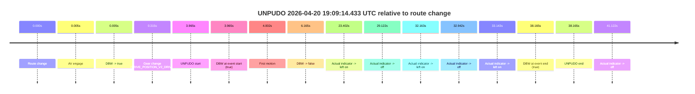
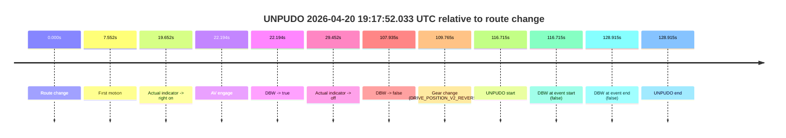
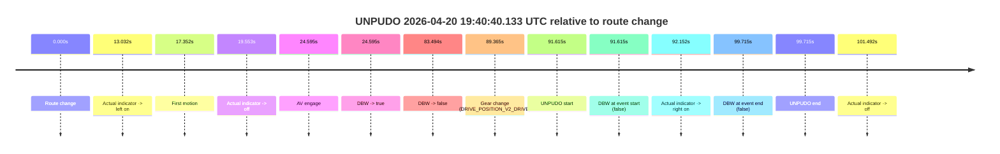

# Run Report: fme10005/2026-04-20--18-58-24--gen2-av-b0b11094-68a7-4599-8be9-e2c59d00a873

| Field | Value |
|---|---|
| Run ID | `fme10005/2026-04-20--18-58-24--gen2-av-b0b11094-68a7-4599-8be9-e2c59d00a873` |
| Date | `2026-04-20` |
| Model(s) | `eel-teal-outspoken` |
| Author | `zak` |
| Event count | `3` |

## unpudo 2026-04-20 19:09:14.433 UTC

| Field | Value |
|---|---|
| Model | `eel-teal-outspoken` |
| Author | `zak` |
| Run ID | `fme10005/2026-04-20--18-58-24--gen2-av-b0b11094-68a7-4599-8be9-e2c59d00a873` |
| Date | `2026-04-20` |
| Time (UTC) | `19:09:14.433` |
| Event type | `unpudo` |
| Disengagement type | `failed_to_unpudo` |
| Route change | `found` |
| Console | [run](https://console.sso.wayve.ai/run/fme10005/2026-04-20--18-58-24--gen2-av-b0b11094-68a7-4599-8be9-e2c59d00a873?id=&time-unixus=1776712154433318) |
| Foxglove | [segment](https://app.foxglove.dev/wayve-on-prem/p/prj_0dX18KZdVHg1fmmI/view?ds=foxglove-stream&ds.deviceName=fme10005&ds.start=2026-04-20T19%3A09%3A00.468289Z&ds.end=2026-04-20T19%3A09%3A58.633313Z&layoutId=lay_0e7VD4WIKDQGU73Y&time=2026-04-20T19%3A09%3A14.433318Z) |

### Event card: fail

- Fail: AV owns part of the segment, but the event still resolves as a model-performance failure under the AV-only scoring rule.

| Event | Time (UTC) | Delta from route change |
|---|---:|---:|
| Route change | 2026-04-20 19:09:10.468 | `0.000s` |
| AV engage | 2026-04-20 19:09:10.472 | `0.005s` |
| DBW -> true | 2026-04-20 19:09:10.472 | `0.005s` |
| Gear change (DRIVE_POSITION_V2_DRIVE) | 2026-04-20 19:09:10.783 | `0.315s` |
| UNPUDO start | 2026-04-20 19:09:14.433 | `3.965s` |
| DBW at event start (true) | 2026-04-20 19:09:14.433 | `3.965s` |
| First motion | 2026-04-20 19:09:14.470 | `4.002s` |
| DBW -> false | 2026-04-20 19:09:16.633 | `6.165s` |
| Actual indicator -> left on | 2026-04-20 19:09:33.870 | `23.402s` |
| Actual indicator -> off | 2026-04-20 19:09:39.590 | `29.122s` |
| Actual indicator -> left on | 2026-04-20 19:09:42.631 | `32.163s` |
| Actual indicator -> off | 2026-04-20 19:09:43.410 | `32.942s` |
| Actual indicator -> left on | 2026-04-20 19:09:43.610 | `33.143s` |
| DBW at event end (true) | 2026-04-20 19:09:48.633 | `38.165s` |
| UNPUDO end | 2026-04-20 19:09:48.633 | `38.165s` |
| Actual indicator -> off | 2026-04-20 19:09:51.590 | `41.122s` |

| Metric | Value |
|---|---|
| Outcome | `fail` |
| Effective failure type | `failed_to_unpudo` |
| Route change status | `found` |
| DBW at event start | `true` |
| DBW at event end | `true` |
| Predicted gear at AV start | `DRIVE_POSITION_V2_PARK` |
| Actual gear at AV start | `DRIVE_POSITION_V2_PARK` |
| Predicted gear at event start | `DRIVE_POSITION_V2_DRIVE` |
| Actual gear at event start | `DRIVE_POSITION_V2_DRIVE` |
| Planned indicator direction | `INDICATORS_STATE_V2_OFF` |
| Controller indicator direction | `INDICATORS_STATE_V2_OFF` |
| Actual indicator direction | `INDICATORS_STATE_V2_OFF` |
| Actual indicator at maneuver end | `INDICATORS_STATE_V2_LEFT_ON` |
| Driver accel help in AV | `false` |
| Driver accel help timestamp | `n/a` |
| Max accel pedal pct in AV | `0.0%` |
| Max brake pedal pct in AV | `9.4%` |
| Max speed mps in AV | `1.581` |
| Success timing baseline | `route change` |
| Route -> AV | `0.005s` |
| AV -> event start | `3.961s` |
| AV -> first motion | `3.998s` |
| Success baseline -> event start | `3.965s` |
| Success baseline -> first motion | `4.002s` |
| AV duration before disengagement | `6.161s` |
| Trajectory waypoint count | `38` |
| Driving-plan step count | `11` |

The scored portion starts from the AV-owned window, not from the pre-AV setup. Route-change search in the stopped pre-event segment was `found`, with the baseline therefore set to route change. At the event anchor the model predicts `DRIVE_POSITION_V2_DRIVE` and the actual gear is `DRIVE_POSITION_V2_DRIVE`. The effective model outcome is `fail` because `failed_to_unpudo.`

### Resolution

| Field | Value |
|---|---|
| Final outcome | `fail` |
| Do we agree with this label? | `yes` |
| Source disengagement type | `failed_to_unpudo` |
| Resolved effective failure type | `failed_to_unpudo` |
| Confidence | `high` |

## unpudo 2026-04-20 19:17:52.033 UTC

| Field | Value |
|---|---|
| Model | `eel-teal-outspoken` |
| Author | `zak` |
| Run ID | `fme10005/2026-04-20--18-58-24--gen2-av-b0b11094-68a7-4599-8be9-e2c59d00a873` |
| Date | `2026-04-20` |
| Time (UTC) | `19:17:52.033` |
| Event type | `unpudo` |
| Disengagement type | `failed_to_unpudo` |
| Route change | `found` |
| Console | [run](https://console.sso.wayve.ai/run/fme10005/2026-04-20--18-58-24--gen2-av-b0b11094-68a7-4599-8be9-e2c59d00a873?id=&time-unixus=1776712672033315) |
| Foxglove | [segment](https://app.foxglove.dev/wayve-on-prem/p/prj_0dX18KZdVHg1fmmI/view?ds=foxglove-stream&ds.deviceName=fme10005&ds.start=2026-04-20T19%3A15%3A45.318281Z&ds.end=2026-04-20T19%3A18%3A14.233291Z&layoutId=lay_0e7VD4WIKDQGU73Y&time=2026-04-20T19%3A17%3A52.033315Z) |

### Event card: fail

- Fail: AV owns part of the segment, but the event still resolves as a model-performance failure under the AV-only scoring rule.

| Event | Time (UTC) | Delta from route change |
|---|---:|---:|
| Route change | 2026-04-20 19:15:55.318 | `0.000s` |
| First motion | 2026-04-20 19:16:02.870 | `7.552s` |
| Actual indicator -> right on | 2026-04-20 19:16:14.970 | `19.652s` |
| AV engage | 2026-04-20 19:16:17.512 | `22.194s` |
| DBW -> true | 2026-04-20 19:16:17.512 | `22.194s` |
| Actual indicator -> off | 2026-04-20 19:16:24.770 | `29.452s` |
| DBW -> false | 2026-04-20 19:17:43.253 | `107.935s` |
| Gear change (DRIVE_POSITION_V2_REVERSE) | 2026-04-20 19:17:45.083 | `109.765s` |
| UNPUDO start | 2026-04-20 19:17:52.033 | `116.715s` |
| DBW at event start (false) | 2026-04-20 19:17:52.033 | `116.715s` |
| DBW at event end (false) | 2026-04-20 19:18:04.233 | `128.915s` |
| UNPUDO end | 2026-04-20 19:18:04.233 | `128.915s` |

| Metric | Value |
|---|---|
| Outcome | `fail` |
| Effective failure type | `failed_to_unpudo` |
| Route change status | `found` |
| DBW at event start | `false` |
| DBW at event end | `false` |
| Predicted gear at AV start | `DRIVE_POSITION_V2_DRIVE` |
| Actual gear at AV start | `DRIVE_POSITION_V2_DRIVE` |
| Predicted gear at event start | `DRIVE_POSITION_V2_REVERSE` |
| Actual gear at event start | `DRIVE_POSITION_V2_REVERSE` |
| Planned indicator direction | `INDICATORS_STATE_V2_OFF` |
| Controller indicator direction | `INDICATORS_STATE_V2_OFF` |
| Actual indicator direction | `INDICATORS_STATE_V2_OFF` |
| Actual indicator at maneuver end | `INDICATORS_STATE_V2_OFF` |
| Driver accel help in AV | `false` |
| Driver accel help timestamp | `n/a` |
| Max accel pedal pct in AV | `0.0%` |
| Max brake pedal pct in AV | `8.6%` |
| Max speed mps in AV | `10.547` |
| Success timing baseline | `route change` |
| Route -> AV | `22.194s` |
| AV -> event start | `94.521s` |
| AV -> first motion | `-14.642s` |
| Success baseline -> event start | `116.715s` |
| Success baseline -> first motion | `7.552s` |
| AV duration before disengagement | `85.741s` |
| Trajectory waypoint count | `38` |
| Driving-plan step count | `11` |

The scored portion starts from the AV-owned window, not from the pre-AV setup. Route-change search in the stopped pre-event segment was `found`, with the baseline therefore set to route change. At the event anchor the model predicts `DRIVE_POSITION_V2_REVERSE` and the actual gear is `DRIVE_POSITION_V2_REVERSE`. The effective model outcome is `fail` because `failed_to_unpudo.`

### Resolution

| Field | Value |
|---|---|
| Final outcome | `fail` |
| Do we agree with this label? | `yes` |
| Source disengagement type | `failed_to_unpudo` |
| Resolved effective failure type | `failed_to_unpudo` |
| Confidence | `high` |

## unpudo 2026-04-20 19:40:40.133 UTC

| Field | Value |
|---|---|
| Model | `eel-teal-outspoken` |
| Author | `zak` |
| Run ID | `fme10005/2026-04-20--18-58-24--gen2-av-b0b11094-68a7-4599-8be9-e2c59d00a873` |
| Date | `2026-04-20` |
| Time (UTC) | `19:40:40.133` |
| Event type | `unpudo` |
| Disengagement type | `uncategorised` |
| Route change | `found` |
| Console | [run](https://console.sso.wayve.ai/run/fme10005/2026-04-20--18-58-24--gen2-av-b0b11094-68a7-4599-8be9-e2c59d00a873?id=&time-unixus=1776714040133304) |
| Foxglove | [segment](https://app.foxglove.dev/wayve-on-prem/p/prj_0dX18KZdVHg1fmmI/view?ds=foxglove-stream&ds.deviceName=fme10005&ds.start=2026-04-20T19%3A38%3A58.518329Z&ds.end=2026-04-20T19%3A40%3A58.233309Z&layoutId=lay_0e7VD4WIKDQGU73Y&time=2026-04-20T19%3A40%3A40.133304Z) |

### Event card: fail

- Fail: AV owns part of the segment, but the event still resolves as a model-performance failure under the AV-only scoring rule.

| Event | Time (UTC) | Delta from route change |
|---|---:|---:|
| Route change | 2026-04-20 19:39:08.518 | `0.000s` |
| Actual indicator -> left on | 2026-04-20 19:39:21.550 | `13.032s` |
| First motion | 2026-04-20 19:39:25.870 | `17.352s` |
| Actual indicator -> off | 2026-04-20 19:39:28.071 | `19.553s` |
| AV engage | 2026-04-20 19:39:33.113 | `24.595s` |
| DBW -> true | 2026-04-20 19:39:33.113 | `24.595s` |
| DBW -> false | 2026-04-20 19:40:32.012 | `83.494s` |
| Gear change (DRIVE_POSITION_V2_DRIVE) | 2026-04-20 19:40:37.883 | `89.365s` |
| UNPUDO start | 2026-04-20 19:40:40.133 | `91.615s` |
| DBW at event start (false) | 2026-04-20 19:40:40.133 | `91.615s` |
| Actual indicator -> right on | 2026-04-20 19:40:40.670 | `92.152s` |
| DBW at event end (false) | 2026-04-20 19:40:48.233 | `99.715s` |
| UNPUDO end | 2026-04-20 19:40:48.233 | `99.715s` |
| Actual indicator -> off | 2026-04-20 19:40:50.010 | `101.492s` |

| Metric | Value |
|---|---|
| Outcome | `fail` |
| Effective failure type | `uncategorised` |
| Route change status | `found` |
| DBW at event start | `false` |
| DBW at event end | `false` |
| Predicted gear at AV start | `DRIVE_POSITION_V2_DRIVE` |
| Actual gear at AV start | `DRIVE_POSITION_V2_DRIVE` |
| Predicted gear at event start | `DRIVE_POSITION_V2_DRIVE` |
| Actual gear at event start | `DRIVE_POSITION_V2_DRIVE` |
| Planned indicator direction | `INDICATORS_STATE_V2_RIGHT_ON` |
| Controller indicator direction | `INDICATORS_STATE_V2_RIGHT_ON` |
| Actual indicator direction | `INDICATORS_STATE_V2_OFF` |
| Actual indicator at maneuver end | `INDICATORS_STATE_V2_RIGHT_ON` |
| Driver accel help in AV | `false` |
| Driver accel help timestamp | `n/a` |
| Max accel pedal pct in AV | `0.0%` |
| Max brake pedal pct in AV | `10.2%` |
| Max speed mps in AV | `6.914` |
| Success timing baseline | `route change` |
| Route -> AV | `24.595s` |
| AV -> event start | `67.019s` |
| AV -> first motion | `-7.244s` |
| Success baseline -> event start | `91.615s` |
| Success baseline -> first motion | `17.352s` |
| AV duration before disengagement | `58.899s` |
| Trajectory waypoint count | `38` |
| Driving-plan step count | `11` |

The scored portion starts from the AV-owned window, not from the pre-AV setup. Route-change search in the stopped pre-event segment was `found`, with the baseline therefore set to route change. At the event anchor the model predicts `DRIVE_POSITION_V2_DRIVE` and the actual gear is `DRIVE_POSITION_V2_DRIVE`. The effective model outcome is `fail` because `uncategorised.`

### Resolution

| Field | Value |
|---|---|
| Final outcome | `fail` |
| Do we agree with this label? | `yes` |
| Source disengagement type | `uncategorised` |
| Resolved effective failure type | `uncategorised` |
| Confidence | `high` |
