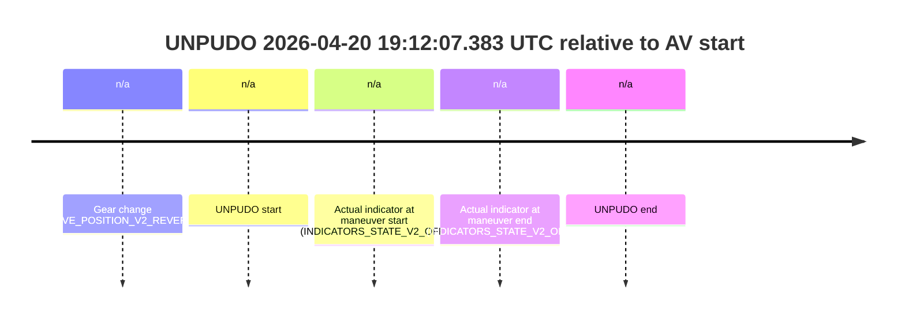
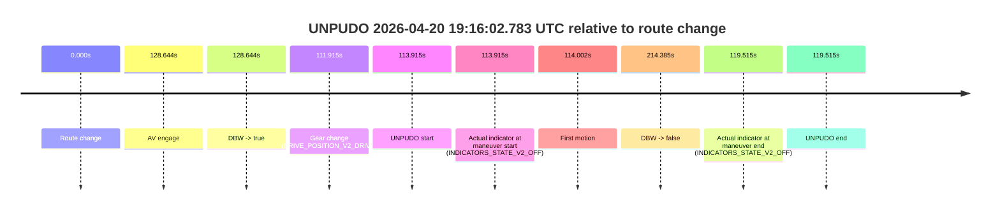
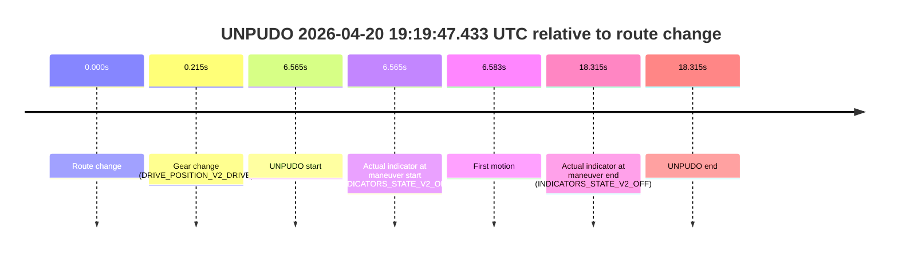
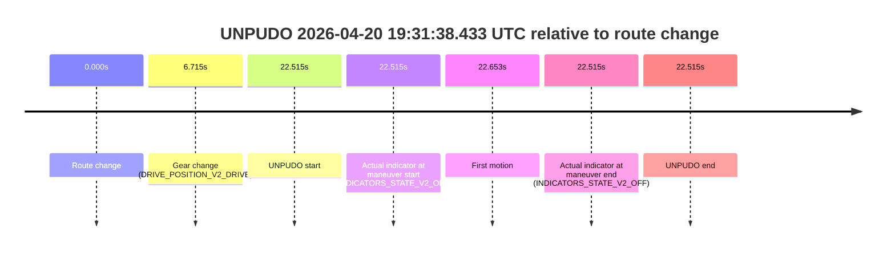
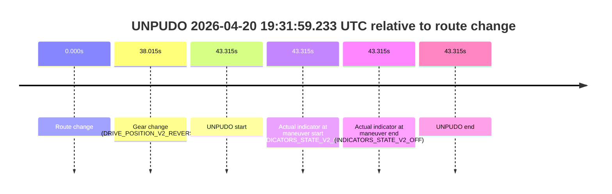
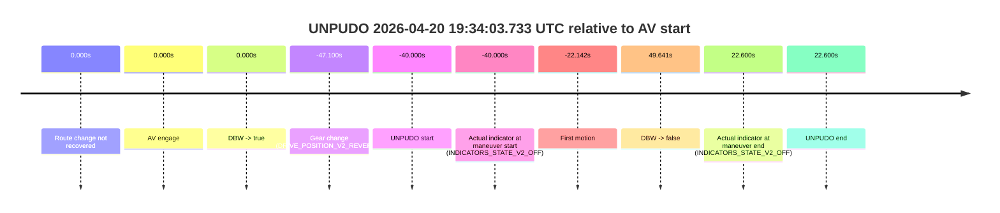
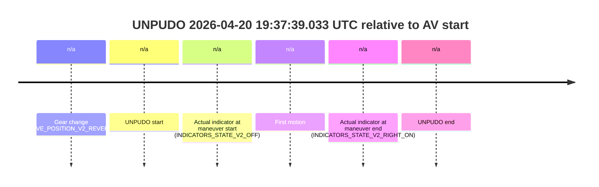
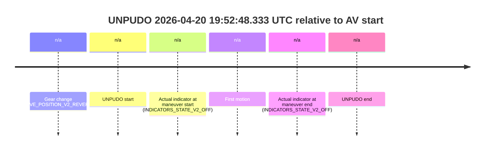
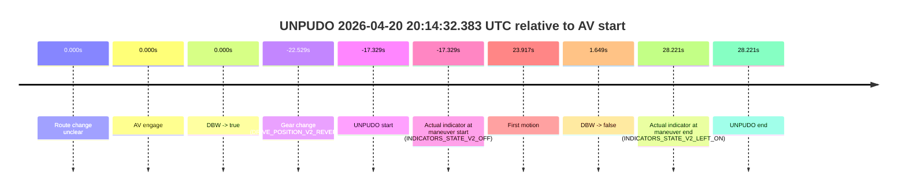

# Run Report: fme10005/2026-04-20--18-58-24--gen2-av-b0b11094-68a7-4599-8be9-e2c59d00a873

| Field | Value |
|---|---|
| Run ID | `fme10005/2026-04-20--18-58-24--gen2-av-b0b11094-68a7-4599-8be9-e2c59d00a873` |
| Date | `2026-04-20` |
| Model(s) | `blue-panther-solid` |
| Author | `guy.geva` |
| Event count | `21` |

## unpudo 2026-04-20 19:12:07.383 UTC

| Field | Value |
|---|---|
| Model | `blue-panther-solid` |
| Author | `guy.geva` |
| Run ID | `fme10005/2026-04-20--18-58-24--gen2-av-b0b11094-68a7-4599-8be9-e2c59d00a873` |
| Date | `2026-04-20` |
| Time (UTC) | `19:12:07.383` |
| Event type | `unpudo` |
| Disengagement type | `none observed` |
| Route change | `unclear` |
| Console | [run](https://console.sso.wayve.ai/run/fme10005/2026-04-20--18-58-24--gen2-av-b0b11094-68a7-4599-8be9-e2c59d00a873?id=&time-unixus=1776712327383310) |
| Foxglove | [segment](https://app.foxglove.dev/wayve-on-prem/p/prj_0dX18KZdVHg1fmmI/view?ds=foxglove-stream&ds.deviceName=fme10005&ds.start=2026-04-20T19%3A11%3A53.633292Z&ds.end=2026-04-20T19%3A12%3A17.383310Z&layoutId=lay_0e7VD4WIKDQGU73Y&time=2026-04-20T19%3A12%3A07.383310Z) |

### Event card: fail

- Fail: the credited unpudo does not stay AV-owned. The event window starts with DBW false, and the maneuver outcome lands outside a clean AV-owned segment.

| Event | Time (UTC) | Delta from AV start |
|---|---:|---:|
| Gear change (DRIVE_POSITION_V2_REVERSE) | 2026-04-20 19:12:03.633 | `n/a` |
| UNPUDO start | 2026-04-20 19:12:07.383 | `n/a` |
| Actual indicator at maneuver start (INDICATORS_STATE_V2_OFF) | 2026-04-20 19:12:07.383 | `n/a` |
| Actual indicator at maneuver end (INDICATORS_STATE_V2_OFF) | 2026-04-20 19:12:07.383 | `n/a` |
| UNPUDO end | 2026-04-20 19:12:07.383 | `n/a` |



| Metric | Value |
|---|---|
| Outcome | `fail` |
| Effective failure type | `not_av_owned` |
| Route change status | `unclear` |
| DBW at event start | `false` |
| DBW at event end | `false` |
| Predicted gear at AV start | `n/a` |
| Actual gear at AV start | `n/a` |
| Predicted gear at event start | `DRIVE_POSITION_V2_REVERSE` |
| Actual gear at event start | `DRIVE_POSITION_V2_REVERSE` |
| Planned indicator direction | `INDICATORS_STATE_V2_OFF` |
| Controller indicator direction | `INDICATORS_STATE_V2_OFF` |
| Actual indicator direction | `INDICATORS_STATE_V2_OFF` |
| Actual indicator at maneuver end | `INDICATORS_STATE_V2_OFF` |
| Driver accel help in AV | `false` |
| Driver accel help timestamp | `n/a` |
| Max accel pedal pct in AV | `0.0%` |
| Max brake pedal pct in AV | `0.0%` |
| Max speed mps in AV | `0.000` |
| Route -> AV | `n/a` |
| AV -> event start | `n/a` |
| AV -> first motion | `n/a` |
| AV duration before disengagement | `n/a` |
| Trajectory waypoint count | `37` |
| Driving-plan step count | `11` |

The scored portion starts from the AV-owned window, not from the pre-AV setup. Route-change search in the stopped pre-event segment was `unclear`, with the baseline therefore set to AV start. At the event anchor the model predicts `DRIVE_POSITION_V2_REVERSE` and the actual gear is `DRIVE_POSITION_V2_REVERSE`. The effective model outcome is `fail` because `not_av_owned`.

### Resolution

| Field | Value |
|---|---|
| Final outcome | `fail` |
| Do we agree with this label? | `yes` |
| Source disengagement type | `none observed` |
| Resolved effective failure type | `not_av_owned` |
| Confidence | `medium` |

## unpudo 2026-04-20 19:16:02.783 UTC

| Field | Value |
|---|---|
| Model | `blue-panther-solid` |
| Author | `guy.geva` |
| Run ID | `fme10005/2026-04-20--18-58-24--gen2-av-b0b11094-68a7-4599-8be9-e2c59d00a873` |
| Date | `2026-04-20` |
| Time (UTC) | `19:16:02.783` |
| Event type | `unpudo` |
| Disengagement type | `none observed` |
| Route change | `found` |
| Console | [run](https://console.sso.wayve.ai/run/fme10005/2026-04-20--18-58-24--gen2-av-b0b11094-68a7-4599-8be9-e2c59d00a873?id=&time-unixus=1776712562783319) |
| Foxglove | [segment](https://app.foxglove.dev/wayve-on-prem/p/prj_0dX18KZdVHg1fmmI/view?ds=foxglove-stream&ds.deviceName=fme10005&ds.start=2026-04-20T19%3A13%3A58.868261Z&ds.end=2026-04-20T19%3A17%3A53.253336Z&layoutId=lay_0e7VD4WIKDQGU73Y&time=2026-04-20T19%3A16%3A02.783319Z) |

### Event card: fail

- Fail: the credited unpudo does not stay AV-owned. The event window starts with DBW false, and the maneuver outcome lands outside a clean AV-owned segment.

| Event | Time (UTC) | Delta from route change |
|---|---:|---:|
| Route change | 2026-04-20 19:14:08.868 | `0.000s` |
| AV engage | 2026-04-20 19:16:17.512 | `128.644s` |
| DBW -> true | 2026-04-20 19:16:17.512 | `128.644s` |
| Gear change (DRIVE_POSITION_V2_DRIVE) | 2026-04-20 19:16:00.783 | `111.915s` |
| UNPUDO start | 2026-04-20 19:16:02.783 | `113.915s` |
| Actual indicator at maneuver start (INDICATORS_STATE_V2_OFF) | 2026-04-20 19:16:02.783 | `113.915s` |
| First motion | 2026-04-20 19:16:02.870 | `114.002s` |
| DBW -> false | 2026-04-20 19:17:43.253 | `214.385s` |
| Actual indicator at maneuver end (INDICATORS_STATE_V2_OFF) | 2026-04-20 19:16:08.383 | `119.515s` |
| UNPUDO end | 2026-04-20 19:16:08.383 | `119.515s` |



| Metric | Value |
|---|---|
| Outcome | `fail` |
| Effective failure type | `completed_outside_av` |
| Route change status | `found` |
| DBW at event start | `false` |
| DBW at event end | `false` |
| Predicted gear at AV start | `DRIVE_POSITION_V2_DRIVE` |
| Actual gear at AV start | `DRIVE_POSITION_V2_DRIVE` |
| Predicted gear at event start | `DRIVE_POSITION_V2_DRIVE` |
| Actual gear at event start | `DRIVE_POSITION_V2_DRIVE` |
| Planned indicator direction | `INDICATORS_STATE_V2_OFF` |
| Controller indicator direction | `INDICATORS_STATE_V2_OFF` |
| Actual indicator direction | `INDICATORS_STATE_V2_OFF` |
| Actual indicator at maneuver end | `INDICATORS_STATE_V2_OFF` |
| Driver accel help in AV | `false` |
| Driver accel help timestamp | `n/a` |
| Max accel pedal pct in AV | `0.0%` |
| Max brake pedal pct in AV | `0.0%` |
| Max speed mps in AV | `0.000` |
| Route -> AV | `128.644s` |
| AV -> event start | `-14.729s` |
| AV -> first motion | `-14.642s` |
| AV duration before disengagement | `85.741s` |
| Trajectory waypoint count | `37` |
| Driving-plan step count | `11` |

The scored portion starts from the AV-owned window, not from the pre-AV setup. Route-change search in the stopped pre-event segment was `found`, with the baseline therefore set to route change. At the event anchor the model predicts `DRIVE_POSITION_V2_DRIVE` and the actual gear is `DRIVE_POSITION_V2_DRIVE`. The effective model outcome is `fail` because `completed_outside_av`.

### Resolution

| Field | Value |
|---|---|
| Final outcome | `fail` |
| Do we agree with this label? | `yes` |
| Source disengagement type | `none observed` |
| Resolved effective failure type | `completed_outside_av` |
| Confidence | `high` |

## unpudo 2026-04-20 19:19:47.433 UTC

| Field | Value |
|---|---|
| Model | `blue-panther-solid` |
| Author | `guy.geva` |
| Run ID | `fme10005/2026-04-20--18-58-24--gen2-av-b0b11094-68a7-4599-8be9-e2c59d00a873` |
| Date | `2026-04-20` |
| Time (UTC) | `19:19:47.433` |
| Event type | `unpudo` |
| Disengagement type | `failed_to_unpudo` |
| Route change | `found` |
| Console | [run](https://console.sso.wayve.ai/run/fme10005/2026-04-20--18-58-24--gen2-av-b0b11094-68a7-4599-8be9-e2c59d00a873?id=&time-unixus=1776712787433317) |
| Foxglove | [segment](https://app.foxglove.dev/wayve-on-prem/p/prj_0dX18KZdVHg1fmmI/view?ds=foxglove-stream&ds.deviceName=fme10005&ds.start=2026-04-20T19%3A19%3A30.868262Z&ds.end=2026-04-20T19%3A20%3A09.183319Z&layoutId=lay_0e7VD4WIKDQGU73Y&time=2026-04-20T19%3A19%3A47.433317Z) |

### Event card: fail

- Fail: AV owns part of the segment, but the event still resolves as a model-performance failure under the AV-only scoring rule.

| Event | Time (UTC) | Delta from route change |
|---|---:|---:|
| Route change | 2026-04-20 19:19:40.868 | `0.000s` |
| Gear change (DRIVE_POSITION_V2_DRIVE) | 2026-04-20 19:19:41.083 | `0.215s` |
| UNPUDO start | 2026-04-20 19:19:47.433 | `6.565s` |
| Actual indicator at maneuver start (INDICATORS_STATE_V2_OFF) | 2026-04-20 19:19:47.433 | `6.565s` |
| First motion | 2026-04-20 19:19:47.450 | `6.583s` |
| Actual indicator at maneuver end (INDICATORS_STATE_V2_OFF) | 2026-04-20 19:19:59.183 | `18.315s` |
| UNPUDO end | 2026-04-20 19:19:59.183 | `18.315s` |



| Metric | Value |
|---|---|
| Outcome | `fail` |
| Effective failure type | `failed_to_unpudo` |
| Route change status | `found` |
| DBW at event start | `false` |
| DBW at event end | `false` |
| Predicted gear at AV start | `n/a` |
| Actual gear at AV start | `n/a` |
| Predicted gear at event start | `DRIVE_POSITION_V2_DRIVE` |
| Actual gear at event start | `DRIVE_POSITION_V2_DRIVE` |
| Planned indicator direction | `INDICATORS_STATE_V2_OFF` |
| Controller indicator direction | `INDICATORS_STATE_V2_OFF` |
| Actual indicator direction | `INDICATORS_STATE_V2_OFF` |
| Actual indicator at maneuver end | `INDICATORS_STATE_V2_OFF` |
| Driver accel help in AV | `false` |
| Driver accel help timestamp | `n/a` |
| Max accel pedal pct in AV | `0.0%` |
| Max brake pedal pct in AV | `0.0%` |
| Max speed mps in AV | `0.000` |
| Route -> AV | `n/a` |
| AV -> event start | `n/a` |
| AV -> first motion | `n/a` |
| AV duration before disengagement | `n/a` |
| Trajectory waypoint count | `38` |
| Driving-plan step count | `11` |

The scored portion starts from the AV-owned window, not from the pre-AV setup. Route-change search in the stopped pre-event segment was `found`, with the baseline therefore set to route change. At the event anchor the model predicts `DRIVE_POSITION_V2_DRIVE` and the actual gear is `DRIVE_POSITION_V2_DRIVE`. The effective model outcome is `fail` because `failed_to_unpudo`.

### Resolution

| Field | Value |
|---|---|
| Final outcome | `fail` |
| Do we agree with this label? | `yes` |
| Source disengagement type | `failed_to_unpudo` |
| Resolved effective failure type | `failed_to_unpudo` |
| Confidence | `high` |

## unpudo 2026-04-20 19:20:14.583 UTC

| Field | Value |
|---|---|
| Model | `blue-panther-solid` |
| Author | `guy.geva` |
| Run ID | `fme10005/2026-04-20--18-58-24--gen2-av-b0b11094-68a7-4599-8be9-e2c59d00a873` |
| Date | `2026-04-20` |
| Time (UTC) | `19:20:14.583` |
| Event type | `unpudo` |
| Disengagement type | `none observed` |
| Route change | `found` |
| Console | [run](https://console.sso.wayve.ai/run/fme10005/2026-04-20--18-58-24--gen2-av-b0b11094-68a7-4599-8be9-e2c59d00a873?id=&time-unixus=1776712814583298) |
| Foxglove | [segment](https://app.foxglove.dev/wayve-on-prem/p/prj_0dX18KZdVHg1fmmI/view?ds=foxglove-stream&ds.deviceName=fme10005&ds.start=2026-04-20T19%3A19%3A30.868262Z&ds.end=2026-04-20T19%3A21%3A02.533065Z&layoutId=lay_0e7VD4WIKDQGU73Y&time=2026-04-20T19%3A20%3A14.583298Z) |

### Event card: fail

- Fail: the credited unpudo does not stay AV-owned. The event window starts with DBW false, and the maneuver outcome lands outside a clean AV-owned segment.

| Event | Time (UTC) | Delta from route change |
|---|---:|---:|
| Route change | 2026-04-20 19:19:40.868 | `0.000s` |
| AV engage | 2026-04-20 19:20:31.592 | `50.724s` |
| DBW -> true | 2026-04-20 19:20:31.592 | `50.724s` |
| Gear change (DRIVE_POSITION_V2_REVERSE) | 2026-04-20 19:20:07.833 | `26.965s` |
| UNPUDO start | 2026-04-20 19:20:14.583 | `33.715s` |
| Actual indicator at maneuver start (INDICATORS_STATE_V2_OFF) | 2026-04-20 19:20:14.583 | `33.715s` |
| First motion | 2026-04-20 19:20:24.310 | `43.442s` |
| DBW -> false | 2026-04-20 19:20:52.533 | `71.665s` |
| Actual indicator at maneuver end (INDICATORS_STATE_V2_OFF) | 2026-04-20 19:20:29.733 | `48.865s` |
| UNPUDO end | 2026-04-20 19:20:29.733 | `48.865s` |


| Metric | Value |
|---|---|
| Outcome | `fail` |
| Effective failure type | `completed_outside_av` |
| Route change status | `found` |
| DBW at event start | `false` |
| DBW at event end | `false` |
| Predicted gear at AV start | `DRIVE_POSITION_V2_DRIVE` |
| Actual gear at AV start | `DRIVE_POSITION_V2_DRIVE` |
| Predicted gear at event start | `DRIVE_POSITION_V2_REVERSE` |
| Actual gear at event start | `DRIVE_POSITION_V2_REVERSE` |
| Planned indicator direction | `INDICATORS_STATE_V2_OFF` |
| Controller indicator direction | `INDICATORS_STATE_V2_OFF` |
| Actual indicator direction | `INDICATORS_STATE_V2_OFF` |
| Actual indicator at maneuver end | `INDICATORS_STATE_V2_OFF` |
| Driver accel help in AV | `false` |
| Driver accel help timestamp | `n/a` |
| Max accel pedal pct in AV | `0.0%` |
| Max brake pedal pct in AV | `0.0%` |
| Max speed mps in AV | `0.000` |
| Route -> AV | `50.724s` |
| AV -> event start | `-17.009s` |
| AV -> first motion | `-7.282s` |
| AV duration before disengagement | `20.940s` |
| Trajectory waypoint count | `37` |
| Driving-plan step count | `11` |

The scored portion starts from the AV-owned window, not from the pre-AV setup. Route-change search in the stopped pre-event segment was `found`, with the baseline therefore set to route change. At the event anchor the model predicts `DRIVE_POSITION_V2_REVERSE` and the actual gear is `DRIVE_POSITION_V2_REVERSE`. The effective model outcome is `fail` because `completed_outside_av`.

### Resolution

| Field | Value |
|---|---|
| Final outcome | `fail` |
| Do we agree with this label? | `yes` |
| Source disengagement type | `none observed` |
| Resolved effective failure type | `completed_outside_av` |
| Confidence | `high` |

## unpudo 2026-04-20 19:23:35.233 UTC

| Field | Value |
|---|---|
| Model | `blue-panther-solid` |
| Author | `guy.geva` |
| Run ID | `fme10005/2026-04-20--18-58-24--gen2-av-b0b11094-68a7-4599-8be9-e2c59d00a873` |
| Date | `2026-04-20` |
| Time (UTC) | `19:23:35.233` |
| Event type | `unpudo` |
| Disengagement type | `none observed` |
| Route change | `found` |
| Console | [run](https://console.sso.wayve.ai/run/fme10005/2026-04-20--18-58-24--gen2-av-b0b11094-68a7-4599-8be9-e2c59d00a873?id=&time-unixus=1776713015233291) |
| Foxglove | [segment](https://app.foxglove.dev/wayve-on-prem/p/prj_0dX18KZdVHg1fmmI/view?ds=foxglove-stream&ds.deviceName=fme10005&ds.start=2026-04-20T19%3A23%3A10.568246Z&ds.end=2026-04-20T19%3A24%3A47.482767Z&layoutId=lay_0e7VD4WIKDQGU73Y&time=2026-04-20T19%3A23%3A35.233291Z) |

### Event card: fail

- Fail: the credited unpudo does not stay AV-owned. The event window starts with DBW false, and the maneuver outcome lands outside a clean AV-owned segment.

| Event | Time (UTC) | Delta from route change |
|---|---:|---:|
| Route change | 2026-04-20 19:23:20.568 | `0.000s` |
| AV engage | 2026-04-20 19:24:06.092 | `45.524s` |
| DBW -> true | 2026-04-20 19:24:06.092 | `45.524s` |
| Gear change (DRIVE_POSITION_V2_DRIVE) | 2026-04-20 19:23:29.783 | `9.215s` |
| UNPUDO start | 2026-04-20 19:23:35.233 | `14.665s` |
| Actual indicator at maneuver start (INDICATORS_STATE_V2_OFF) | 2026-04-20 19:23:35.233 | `14.665s` |
| First motion | 2026-04-20 19:23:35.270 | `14.702s` |
| DBW -> false | 2026-04-20 19:24:37.482 | `76.915s` |
| Actual indicator at maneuver end (INDICATORS_STATE_V2_OFF) | 2026-04-20 19:24:00.533 | `39.965s` |
| UNPUDO end | 2026-04-20 19:24:00.533 | `39.965s` |


| Metric | Value |
|---|---|
| Outcome | `fail` |
| Effective failure type | `completed_outside_av` |
| Route change status | `found` |
| DBW at event start | `false` |
| DBW at event end | `false` |
| Predicted gear at AV start | `DRIVE_POSITION_V2_DRIVE` |
| Actual gear at AV start | `DRIVE_POSITION_V2_DRIVE` |
| Predicted gear at event start | `DRIVE_POSITION_V2_DRIVE` |
| Actual gear at event start | `DRIVE_POSITION_V2_DRIVE` |
| Planned indicator direction | `INDICATORS_STATE_V2_OFF` |
| Controller indicator direction | `INDICATORS_STATE_V2_OFF` |
| Actual indicator direction | `INDICATORS_STATE_V2_OFF` |
| Actual indicator at maneuver end | `INDICATORS_STATE_V2_OFF` |
| Driver accel help in AV | `false` |
| Driver accel help timestamp | `n/a` |
| Max accel pedal pct in AV | `0.0%` |
| Max brake pedal pct in AV | `0.0%` |
| Max speed mps in AV | `0.000` |
| Route -> AV | `45.524s` |
| AV -> event start | `-30.859s` |
| AV -> first motion | `-30.822s` |
| AV duration before disengagement | `31.390s` |
| Trajectory waypoint count | `38` |
| Driving-plan step count | `11` |

The scored portion starts from the AV-owned window, not from the pre-AV setup. Route-change search in the stopped pre-event segment was `found`, with the baseline therefore set to route change. At the event anchor the model predicts `DRIVE_POSITION_V2_DRIVE` and the actual gear is `DRIVE_POSITION_V2_DRIVE`. The effective model outcome is `fail` because `completed_outside_av`.

### Resolution

| Field | Value |
|---|---|
| Final outcome | `fail` |
| Do we agree with this label? | `yes` |
| Source disengagement type | `none observed` |
| Resolved effective failure type | `completed_outside_av` |
| Confidence | `high` |

## unpudo 2026-04-20 19:26:53.683 UTC

| Field | Value |
|---|---|
| Model | `blue-panther-solid` |
| Author | `guy.geva` |
| Run ID | `fme10005/2026-04-20--18-58-24--gen2-av-b0b11094-68a7-4599-8be9-e2c59d00a873` |
| Date | `2026-04-20` |
| Time (UTC) | `19:26:53.683` |
| Event type | `unpudo` |
| Disengagement type | `none observed` |
| Route change | `unclear` |
| Console | [run](https://console.sso.wayve.ai/run/fme10005/2026-04-20--18-58-24--gen2-av-b0b11094-68a7-4599-8be9-e2c59d00a873?id=&time-unixus=1776713213683305) |
| Foxglove | [segment](https://app.foxglove.dev/wayve-on-prem/p/prj_0dX18KZdVHg1fmmI/view?ds=foxglove-stream&ds.deviceName=fme10005&ds.start=2026-04-20T19%3A26%3A38.183295Z&ds.end=2026-04-20T19%3A27%3A31.033308Z&layoutId=lay_0e7VD4WIKDQGU73Y&time=2026-04-20T19%3A26%3A53.683305Z) |

### Event card: fail

- Fail: the credited unpudo does not stay AV-owned. The event window starts with DBW false, and the maneuver outcome lands outside a clean AV-owned segment.

| Event | Time (UTC) | Delta from AV start |
|---|---:|---:|
| Gear change (DRIVE_POSITION_V2_REVERSE) | 2026-04-20 19:26:48.183 | `n/a` |
| UNPUDO start | 2026-04-20 19:26:53.683 | `n/a` |
| Actual indicator at maneuver start (INDICATORS_STATE_V2_OFF) | 2026-04-20 19:26:53.683 | `n/a` |
| First motion | 2026-04-20 19:27:15.490 | `n/a` |
| Actual indicator at maneuver end (INDICATORS_STATE_V2_RIGHT_ON) | 2026-04-20 19:27:21.033 | `n/a` |
| UNPUDO end | 2026-04-20 19:27:21.033 | `n/a` |


| Metric | Value |
|---|---|
| Outcome | `fail` |
| Effective failure type | `not_av_owned` |
| Route change status | `unclear` |
| DBW at event start | `false` |
| DBW at event end | `false` |
| Predicted gear at AV start | `n/a` |
| Actual gear at AV start | `n/a` |
| Predicted gear at event start | `DRIVE_POSITION_V2_REVERSE` |
| Actual gear at event start | `DRIVE_POSITION_V2_REVERSE` |
| Planned indicator direction | `INDICATORS_STATE_V2_OFF` |
| Controller indicator direction | `INDICATORS_STATE_V2_OFF` |
| Actual indicator direction | `INDICATORS_STATE_V2_OFF` |
| Actual indicator at maneuver end | `INDICATORS_STATE_V2_RIGHT_ON` |
| Driver accel help in AV | `false` |
| Driver accel help timestamp | `n/a` |
| Max accel pedal pct in AV | `0.0%` |
| Max brake pedal pct in AV | `0.0%` |
| Max speed mps in AV | `0.000` |
| Route -> AV | `n/a` |
| AV -> event start | `n/a` |
| AV -> first motion | `n/a` |
| AV duration before disengagement | `n/a` |
| Trajectory waypoint count | `37` |
| Driving-plan step count | `11` |

The scored portion starts from the AV-owned window, not from the pre-AV setup. Route-change search in the stopped pre-event segment was `unclear`, with the baseline therefore set to AV start. At the event anchor the model predicts `DRIVE_POSITION_V2_REVERSE` and the actual gear is `DRIVE_POSITION_V2_REVERSE`. The effective model outcome is `fail` because `not_av_owned`.

### Resolution

| Field | Value |
|---|---|
| Final outcome | `fail` |
| Do we agree with this label? | `yes` |
| Source disengagement type | `none observed` |
| Resolved effective failure type | `not_av_owned` |
| Confidence | `medium` |

## unpudo 2026-04-20 19:27:40.983 UTC

| Field | Value |
|---|---|
| Model | `blue-panther-solid` |
| Author | `guy.geva` |
| Run ID | `fme10005/2026-04-20--18-58-24--gen2-av-b0b11094-68a7-4599-8be9-e2c59d00a873` |
| Date | `2026-04-20` |
| Time (UTC) | `19:27:40.983` |
| Event type | `unpudo` |
| Disengagement type | `none observed` |
| Route change | `unclear` |
| Console | [run](https://console.sso.wayve.ai/run/fme10005/2026-04-20--18-58-24--gen2-av-b0b11094-68a7-4599-8be9-e2c59d00a873?id=&time-unixus=1776713260983309) |
| Foxglove | [segment](https://app.foxglove.dev/wayve-on-prem/p/prj_0dX18KZdVHg1fmmI/view?ds=foxglove-stream&ds.deviceName=fme10005&ds.start=2026-04-20T19%3A27%3A22.733298Z&ds.end=2026-04-20T19%3A31%3A25.772880Z&layoutId=lay_0e7VD4WIKDQGU73Y&time=2026-04-20T19%3A27%3A40.983309Z) |

### Event card: fail

- Fail: the credited unpudo does not stay AV-owned. The event window starts with DBW false, and the maneuver outcome lands outside a clean AV-owned segment.

| Event | Time (UTC) | Delta from AV start |
|---|---:|---:|
| Route change unclear | 2026-04-20 19:27:54.872 | `0.000s` |
| AV engage | 2026-04-20 19:27:54.872 | `0.000s` |
| DBW -> true | 2026-04-20 19:27:54.872 | `0.000s` |
| Gear change (DRIVE_POSITION_V2_REVERSE) | 2026-04-20 19:27:32.733 | `-22.140s` |
| UNPUDO start | 2026-04-20 19:27:40.983 | `-13.890s` |
| Actual indicator at maneuver start (INDICATORS_STATE_V2_OFF) | 2026-04-20 19:27:40.983 | `-13.890s` |
| First motion | 2026-04-20 19:28:17.590 | `22.718s` |
| DBW -> false | 2026-04-20 19:31:15.772 | `200.900s` |
| Actual indicator at maneuver end (INDICATORS_STATE_V2_OFF) | 2026-04-20 19:27:40.983 | `-13.890s` |
| UNPUDO end | 2026-04-20 19:27:40.983 | `-13.890s` |


| Metric | Value |
|---|---|
| Outcome | `fail` |
| Effective failure type | `not_av_owned` |
| Route change status | `unclear` |
| DBW at event start | `false` |
| DBW at event end | `false` |
| Predicted gear at AV start | `DRIVE_POSITION_V2_PARK` |
| Actual gear at AV start | `DRIVE_POSITION_V2_PARK` |
| Predicted gear at event start | `DRIVE_POSITION_V2_REVERSE` |
| Actual gear at event start | `DRIVE_POSITION_V2_REVERSE` |
| Planned indicator direction | `INDICATORS_STATE_V2_OFF` |
| Controller indicator direction | `INDICATORS_STATE_V2_OFF` |
| Actual indicator direction | `INDICATORS_STATE_V2_OFF` |
| Actual indicator at maneuver end | `INDICATORS_STATE_V2_OFF` |
| Driver accel help in AV | `false` |
| Driver accel help timestamp | `n/a` |
| Max accel pedal pct in AV | `0.0%` |
| Max brake pedal pct in AV | `0.0%` |
| Max speed mps in AV | `0.000` |
| Route -> AV | `n/a` |
| AV -> event start | `-13.890s` |
| AV -> first motion | `22.718s` |
| AV duration before disengagement | `200.900s` |
| Trajectory waypoint count | `37` |
| Driving-plan step count | `11` |

The scored portion starts from the AV-owned window, not from the pre-AV setup. Route-change search in the stopped pre-event segment was `unclear`, with the baseline therefore set to AV start. At the event anchor the model predicts `DRIVE_POSITION_V2_REVERSE` and the actual gear is `DRIVE_POSITION_V2_REVERSE`. The effective model outcome is `fail` because `not_av_owned`.

### Resolution

| Field | Value |
|---|---|
| Final outcome | `fail` |
| Do we agree with this label? | `yes` |
| Source disengagement type | `none observed` |
| Resolved effective failure type | `not_av_owned` |
| Confidence | `medium` |

## unpudo 2026-04-20 19:31:38.433 UTC

| Field | Value |
|---|---|
| Model | `blue-panther-solid` |
| Author | `guy.geva` |
| Run ID | `fme10005/2026-04-20--18-58-24--gen2-av-b0b11094-68a7-4599-8be9-e2c59d00a873` |
| Date | `2026-04-20` |
| Time (UTC) | `19:31:38.433` |
| Event type | `unpudo` |
| Disengagement type | `uncategorised` |
| Route change | `found` |
| Console | [run](https://console.sso.wayve.ai/run/fme10005/2026-04-20--18-58-24--gen2-av-b0b11094-68a7-4599-8be9-e2c59d00a873?id=&time-unixus=1776713498433316) |
| Foxglove | [segment](https://app.foxglove.dev/wayve-on-prem/p/prj_0dX18KZdVHg1fmmI/view?ds=foxglove-stream&ds.deviceName=fme10005&ds.start=2026-04-20T19%3A31%3A05.918281Z&ds.end=2026-04-20T19%3A31%3A48.433316Z&layoutId=lay_0e7VD4WIKDQGU73Y&time=2026-04-20T19%3A31%3A38.433316Z) |

### Event card: fail

- Fail: AV owns part of the segment, but the event still resolves as a model-performance failure under the AV-only scoring rule.

| Event | Time (UTC) | Delta from route change |
|---|---:|---:|
| Route change | 2026-04-20 19:31:15.918 | `0.000s` |
| Gear change (DRIVE_POSITION_V2_DRIVE) | 2026-04-20 19:31:22.633 | `6.715s` |
| UNPUDO start | 2026-04-20 19:31:38.433 | `22.515s` |
| Actual indicator at maneuver start (INDICATORS_STATE_V2_OFF) | 2026-04-20 19:31:38.433 | `22.515s` |
| First motion | 2026-04-20 19:31:38.571 | `22.653s` |
| Actual indicator at maneuver end (INDICATORS_STATE_V2_OFF) | 2026-04-20 19:31:38.433 | `22.515s` |
| UNPUDO end | 2026-04-20 19:31:38.433 | `22.515s` |



| Metric | Value |
|---|---|
| Outcome | `fail` |
| Effective failure type | `uncategorised` |
| Route change status | `found` |
| DBW at event start | `false` |
| DBW at event end | `false` |
| Predicted gear at AV start | `n/a` |
| Actual gear at AV start | `n/a` |
| Predicted gear at event start | `DRIVE_POSITION_V2_DRIVE` |
| Actual gear at event start | `DRIVE_POSITION_V2_DRIVE` |
| Planned indicator direction | `INDICATORS_STATE_V2_OFF` |
| Controller indicator direction | `INDICATORS_STATE_V2_OFF` |
| Actual indicator direction | `INDICATORS_STATE_V2_OFF` |
| Actual indicator at maneuver end | `INDICATORS_STATE_V2_OFF` |
| Driver accel help in AV | `false` |
| Driver accel help timestamp | `n/a` |
| Max accel pedal pct in AV | `0.0%` |
| Max brake pedal pct in AV | `0.0%` |
| Max speed mps in AV | `0.000` |
| Route -> AV | `n/a` |
| AV -> event start | `n/a` |
| AV -> first motion | `n/a` |
| AV duration before disengagement | `n/a` |
| Trajectory waypoint count | `36` |
| Driving-plan step count | `11` |

The scored portion starts from the AV-owned window, not from the pre-AV setup. Route-change search in the stopped pre-event segment was `found`, with the baseline therefore set to route change. At the event anchor the model predicts `DRIVE_POSITION_V2_DRIVE` and the actual gear is `DRIVE_POSITION_V2_DRIVE`. The effective model outcome is `fail` because `uncategorised`.

### Resolution

| Field | Value |
|---|---|
| Final outcome | `fail` |
| Do we agree with this label? | `yes` |
| Source disengagement type | `uncategorised` |
| Resolved effective failure type | `uncategorised` |
| Confidence | `high` |

## unpudo 2026-04-20 19:31:59.233 UTC

| Field | Value |
|---|---|
| Model | `blue-panther-solid` |
| Author | `guy.geva` |
| Run ID | `fme10005/2026-04-20--18-58-24--gen2-av-b0b11094-68a7-4599-8be9-e2c59d00a873` |
| Date | `2026-04-20` |
| Time (UTC) | `19:31:59.233` |
| Event type | `unpudo` |
| Disengagement type | `none observed` |
| Route change | `found` |
| Console | [run](https://console.sso.wayve.ai/run/fme10005/2026-04-20--18-58-24--gen2-av-b0b11094-68a7-4599-8be9-e2c59d00a873?id=&time-unixus=1776713519233298) |
| Foxglove | [segment](https://app.foxglove.dev/wayve-on-prem/p/prj_0dX18KZdVHg1fmmI/view?ds=foxglove-stream&ds.deviceName=fme10005&ds.start=2026-04-20T19%3A31%3A05.918281Z&ds.end=2026-04-20T19%3A32%3A09.233298Z&layoutId=lay_0e7VD4WIKDQGU73Y&time=2026-04-20T19%3A31%3A59.233298Z) |

### Event card: fail

- Fail: the credited unpudo does not stay AV-owned. The event window starts with DBW false, and the maneuver outcome lands outside a clean AV-owned segment.

| Event | Time (UTC) | Delta from route change |
|---|---:|---:|
| Route change | 2026-04-20 19:31:15.918 | `0.000s` |
| Gear change (DRIVE_POSITION_V2_REVERSE) | 2026-04-20 19:31:53.933 | `38.015s` |
| UNPUDO start | 2026-04-20 19:31:59.233 | `43.315s` |
| Actual indicator at maneuver start (INDICATORS_STATE_V2_OFF) | 2026-04-20 19:31:59.233 | `43.315s` |
| Actual indicator at maneuver end (INDICATORS_STATE_V2_OFF) | 2026-04-20 19:31:59.233 | `43.315s` |
| UNPUDO end | 2026-04-20 19:31:59.233 | `43.315s` |



| Metric | Value |
|---|---|
| Outcome | `fail` |
| Effective failure type | `not_av_owned` |
| Route change status | `found` |
| DBW at event start | `false` |
| DBW at event end | `false` |
| Predicted gear at AV start | `n/a` |
| Actual gear at AV start | `n/a` |
| Predicted gear at event start | `DRIVE_POSITION_V2_REVERSE` |
| Actual gear at event start | `DRIVE_POSITION_V2_REVERSE` |
| Planned indicator direction | `INDICATORS_STATE_V2_OFF` |
| Controller indicator direction | `INDICATORS_STATE_V2_OFF` |
| Actual indicator direction | `INDICATORS_STATE_V2_OFF` |
| Actual indicator at maneuver end | `INDICATORS_STATE_V2_OFF` |
| Driver accel help in AV | `false` |
| Driver accel help timestamp | `n/a` |
| Max accel pedal pct in AV | `0.0%` |
| Max brake pedal pct in AV | `0.0%` |
| Max speed mps in AV | `0.000` |
| Route -> AV | `n/a` |
| AV -> event start | `n/a` |
| AV -> first motion | `n/a` |
| AV duration before disengagement | `n/a` |
| Trajectory waypoint count | `36` |
| Driving-plan step count | `11` |

The scored portion starts from the AV-owned window, not from the pre-AV setup. Route-change search in the stopped pre-event segment was `found`, with the baseline therefore set to route change. At the event anchor the model predicts `DRIVE_POSITION_V2_REVERSE` and the actual gear is `DRIVE_POSITION_V2_REVERSE`. The effective model outcome is `fail` because `not_av_owned`.

### Resolution

| Field | Value |
|---|---|
| Final outcome | `fail` |
| Do we agree with this label? | `yes` |
| Source disengagement type | `none observed` |
| Resolved effective failure type | `not_av_owned` |
| Confidence | `high` |

## unpudo 2026-04-20 19:34:03.733 UTC

| Field | Value |
|---|---|
| Model | `blue-panther-solid` |
| Author | `guy.geva` |
| Run ID | `fme10005/2026-04-20--18-58-24--gen2-av-b0b11094-68a7-4599-8be9-e2c59d00a873` |
| Date | `2026-04-20` |
| Time (UTC) | `19:34:03.733` |
| Event type | `unpudo` |
| Disengagement type | `none observed` |
| Route change | `not found` |
| Console | [run](https://console.sso.wayve.ai/run/fme10005/2026-04-20--18-58-24--gen2-av-b0b11094-68a7-4599-8be9-e2c59d00a873?id=&time-unixus=1776713643733296) |
| Foxglove | [segment](https://app.foxglove.dev/wayve-on-prem/p/prj_0dX18KZdVHg1fmmI/view?ds=foxglove-stream&ds.deviceName=fme10005&ds.start=2026-04-20T19%3A33%3A46.633301Z&ds.end=2026-04-20T19%3A35%3A43.373814Z&layoutId=lay_0e7VD4WIKDQGU73Y&time=2026-04-20T19%3A34%3A03.733296Z) |

### Event card: fail

- Fail: the credited unpudo does not stay AV-owned. The event window starts with DBW false, and the maneuver outcome lands outside a clean AV-owned segment.

| Event | Time (UTC) | Delta from AV start |
|---|---:|---:|
| Route change not recovered | 2026-04-20 19:34:43.733 | `0.000s` |
| AV engage | 2026-04-20 19:34:43.733 | `0.000s` |
| DBW -> true | 2026-04-20 19:34:43.733 | `0.000s` |
| Gear change (DRIVE_POSITION_V2_REVERSE) | 2026-04-20 19:33:56.633 | `-47.100s` |
| UNPUDO start | 2026-04-20 19:34:03.733 | `-40.000s` |
| Actual indicator at maneuver start (INDICATORS_STATE_V2_OFF) | 2026-04-20 19:34:03.733 | `-40.000s` |
| First motion | 2026-04-20 19:34:21.591 | `-22.142s` |
| DBW -> false | 2026-04-20 19:35:33.373 | `49.641s` |
| Actual indicator at maneuver end (INDICATORS_STATE_V2_OFF) | 2026-04-20 19:35:06.333 | `22.600s` |
| UNPUDO end | 2026-04-20 19:35:06.333 | `22.600s` |



| Metric | Value |
|---|---|
| Outcome | `fail` |
| Effective failure type | `completed_outside_av` |
| Route change status | `not found` |
| DBW at event start | `false` |
| DBW at event end | `true` |
| Predicted gear at AV start | `DRIVE_POSITION_V2_DRIVE` |
| Actual gear at AV start | `DRIVE_POSITION_V2_DRIVE` |
| Predicted gear at event start | `DRIVE_POSITION_V2_REVERSE` |
| Actual gear at event start | `DRIVE_POSITION_V2_REVERSE` |
| Planned indicator direction | `INDICATORS_STATE_V2_OFF` |
| Controller indicator direction | `INDICATORS_STATE_V2_OFF` |
| Actual indicator direction | `INDICATORS_STATE_V2_OFF` |
| Actual indicator at maneuver end | `INDICATORS_STATE_V2_OFF` |
| Driver accel help in AV | `false` |
| Driver accel help timestamp | `n/a` |
| Max accel pedal pct in AV | `0.0%` |
| Max brake pedal pct in AV | `8.0%` |
| Max speed mps in AV | `2.239` |
| Route -> AV | `n/a` |
| AV -> event start | `-40.000s` |
| AV -> first motion | `-22.142s` |
| AV duration before disengagement | `49.641s` |
| Trajectory waypoint count | `38` |
| Driving-plan step count | `11` |

The scored portion starts from the AV-owned window, not from the pre-AV setup. Route-change search in the stopped pre-event segment was `not found`, with the baseline therefore set to AV start. At the event anchor the model predicts `DRIVE_POSITION_V2_REVERSE` and the actual gear is `DRIVE_POSITION_V2_REVERSE`. The effective model outcome is `fail` because `completed_outside_av`.

### Resolution

| Field | Value |
|---|---|
| Final outcome | `fail` |
| Do we agree with this label? | `yes` |
| Source disengagement type | `none observed` |
| Resolved effective failure type | `completed_outside_av` |
| Confidence | `high` |

## unpudo 2026-04-20 19:37:39.033 UTC

| Field | Value |
|---|---|
| Model | `blue-panther-solid` |
| Author | `guy.geva` |
| Run ID | `fme10005/2026-04-20--18-58-24--gen2-av-b0b11094-68a7-4599-8be9-e2c59d00a873` |
| Date | `2026-04-20` |
| Time (UTC) | `19:37:39.033` |
| Event type | `unpudo` |
| Disengagement type | `none observed` |
| Route change | `unclear` |
| Console | [run](https://console.sso.wayve.ai/run/fme10005/2026-04-20--18-58-24--gen2-av-b0b11094-68a7-4599-8be9-e2c59d00a873?id=&time-unixus=1776713859033319) |
| Foxglove | [segment](https://app.foxglove.dev/wayve-on-prem/p/prj_0dX18KZdVHg1fmmI/view?ds=foxglove-stream&ds.deviceName=fme10005&ds.start=2026-04-20T19%3A37%3A22.433302Z&ds.end=2026-04-20T19%3A38%3A19.933298Z&layoutId=lay_0e7VD4WIKDQGU73Y&time=2026-04-20T19%3A37%3A39.033319Z) |

### Event card: fail

- Fail: the credited unpudo does not stay AV-owned. The event window starts with DBW false, and the maneuver outcome lands outside a clean AV-owned segment.

| Event | Time (UTC) | Delta from AV start |
|---|---:|---:|
| Gear change (DRIVE_POSITION_V2_REVERSE) | 2026-04-20 19:37:32.433 | `n/a` |
| UNPUDO start | 2026-04-20 19:37:39.033 | `n/a` |
| Actual indicator at maneuver start (INDICATORS_STATE_V2_OFF) | 2026-04-20 19:37:39.033 | `n/a` |
| First motion | 2026-04-20 19:37:42.150 | `n/a` |
| Actual indicator at maneuver end (INDICATORS_STATE_V2_RIGHT_ON) | 2026-04-20 19:38:09.933 | `n/a` |
| UNPUDO end | 2026-04-20 19:38:09.933 | `n/a` |



| Metric | Value |
|---|---|
| Outcome | `fail` |
| Effective failure type | `not_av_owned` |
| Route change status | `unclear` |
| DBW at event start | `false` |
| DBW at event end | `false` |
| Predicted gear at AV start | `n/a` |
| Actual gear at AV start | `n/a` |
| Predicted gear at event start | `DRIVE_POSITION_V2_REVERSE` |
| Actual gear at event start | `DRIVE_POSITION_V2_REVERSE` |
| Planned indicator direction | `INDICATORS_STATE_V2_OFF` |
| Controller indicator direction | `INDICATORS_STATE_V2_OFF` |
| Actual indicator direction | `INDICATORS_STATE_V2_OFF` |
| Actual indicator at maneuver end | `INDICATORS_STATE_V2_RIGHT_ON` |
| Driver accel help in AV | `false` |
| Driver accel help timestamp | `n/a` |
| Max accel pedal pct in AV | `0.0%` |
| Max brake pedal pct in AV | `0.0%` |
| Max speed mps in AV | `0.000` |
| Route -> AV | `n/a` |
| AV -> event start | `n/a` |
| AV -> first motion | `n/a` |
| AV duration before disengagement | `n/a` |
| Trajectory waypoint count | `36` |
| Driving-plan step count | `11` |

The scored portion starts from the AV-owned window, not from the pre-AV setup. Route-change search in the stopped pre-event segment was `unclear`, with the baseline therefore set to AV start. At the event anchor the model predicts `DRIVE_POSITION_V2_REVERSE` and the actual gear is `DRIVE_POSITION_V2_REVERSE`. The effective model outcome is `fail` because `not_av_owned`.

### Resolution

| Field | Value |
|---|---|
| Final outcome | `fail` |
| Do we agree with this label? | `yes` |
| Source disengagement type | `none observed` |
| Resolved effective failure type | `not_av_owned` |
| Confidence | `medium` |

## unpudo 2026-04-20 19:39:21.133 UTC

| Field | Value |
|---|---|
| Model | `blue-panther-solid` |
| Author | `guy.geva` |
| Run ID | `fme10005/2026-04-20--18-58-24--gen2-av-b0b11094-68a7-4599-8be9-e2c59d00a873` |
| Date | `2026-04-20` |
| Time (UTC) | `19:39:21.133` |
| Event type | `unpudo` |
| Disengagement type | `failed_to_unpudo` |
| Route change | `found` |
| Console | [run](https://console.sso.wayve.ai/run/fme10005/2026-04-20--18-58-24--gen2-av-b0b11094-68a7-4599-8be9-e2c59d00a873?id=&time-unixus=1776713961133299) |
| Foxglove | [segment](https://app.foxglove.dev/wayve-on-prem/p/prj_0dX18KZdVHg1fmmI/view?ds=foxglove-stream&ds.deviceName=fme10005&ds.start=2026-04-20T19%3A38%3A58.518329Z&ds.end=2026-04-20T19%3A40%3A42.012675Z&layoutId=lay_0e7VD4WIKDQGU73Y&time=2026-04-20T19%3A39%3A21.133299Z) |

### Event card: fail

- Fail: AV owns part of the segment, but the event still resolves as a model-performance failure under the AV-only scoring rule.

| Event | Time (UTC) | Delta from route change |
|---|---:|---:|
| Route change | 2026-04-20 19:39:08.518 | `0.000s` |
| AV engage | 2026-04-20 19:39:33.113 | `24.595s` |
| DBW -> true | 2026-04-20 19:39:33.113 | `24.595s` |
| Gear change (DRIVE_POSITION_V2_REVERSE) | 2026-04-20 19:39:12.533 | `4.015s` |
| UNPUDO start | 2026-04-20 19:39:21.133 | `12.615s` |
| Actual indicator at maneuver start (INDICATORS_STATE_V2_OFF) | 2026-04-20 19:39:21.133 | `12.615s` |
| First motion | 2026-04-20 19:39:25.870 | `17.352s` |
| DBW -> false | 2026-04-20 19:40:32.012 | `83.494s` |
| Actual indicator at maneuver end (INDICATORS_STATE_V2_OFF) | 2026-04-20 19:39:31.283 | `22.765s` |
| UNPUDO end | 2026-04-20 19:39:31.283 | `22.765s` |


| Metric | Value |
|---|---|
| Outcome | `fail` |
| Effective failure type | `failed_to_unpudo` |
| Route change status | `found` |
| DBW at event start | `false` |
| DBW at event end | `false` |
| Predicted gear at AV start | `DRIVE_POSITION_V2_DRIVE` |
| Actual gear at AV start | `DRIVE_POSITION_V2_DRIVE` |
| Predicted gear at event start | `DRIVE_POSITION_V2_REVERSE` |
| Actual gear at event start | `DRIVE_POSITION_V2_REVERSE` |
| Planned indicator direction | `INDICATORS_STATE_V2_LEFT_ON` |
| Controller indicator direction | `INDICATORS_STATE_V2_LEFT_ON` |
| Actual indicator direction | `INDICATORS_STATE_V2_OFF` |
| Actual indicator at maneuver end | `INDICATORS_STATE_V2_OFF` |
| Driver accel help in AV | `false` |
| Driver accel help timestamp | `n/a` |
| Max accel pedal pct in AV | `0.0%` |
| Max brake pedal pct in AV | `0.0%` |
| Max speed mps in AV | `0.000` |
| Route -> AV | `24.595s` |
| AV -> event start | `-11.981s` |
| AV -> first motion | `-7.244s` |
| AV duration before disengagement | `58.899s` |
| Trajectory waypoint count | `36` |
| Driving-plan step count | `11` |

The scored portion starts from the AV-owned window, not from the pre-AV setup. Route-change search in the stopped pre-event segment was `found`, with the baseline therefore set to route change. At the event anchor the model predicts `DRIVE_POSITION_V2_REVERSE` and the actual gear is `DRIVE_POSITION_V2_REVERSE`. The effective model outcome is `fail` because `failed_to_unpudo`.

### Resolution

| Field | Value |
|---|---|
| Final outcome | `fail` |
| Do we agree with this label? | `yes` |
| Source disengagement type | `failed_to_unpudo` |
| Resolved effective failure type | `failed_to_unpudo` |
| Confidence | `high` |

## unpudo 2026-04-20 19:41:51.683 UTC

| Field | Value |
|---|---|
| Model | `blue-panther-solid` |
| Author | `guy.geva` |
| Run ID | `fme10005/2026-04-20--18-58-24--gen2-av-b0b11094-68a7-4599-8be9-e2c59d00a873` |
| Date | `2026-04-20` |
| Time (UTC) | `19:41:51.683` |
| Event type | `unpudo` |
| Disengagement type | `failed_to_pudo` |
| Route change | `found` |
| Console | [run](https://console.sso.wayve.ai/run/fme10005/2026-04-20--18-58-24--gen2-av-b0b11094-68a7-4599-8be9-e2c59d00a873?id=&time-unixus=1776714111683313) |
| Foxglove | [segment](https://app.foxglove.dev/wayve-on-prem/p/prj_0dX18KZdVHg1fmmI/view?ds=foxglove-stream&ds.deviceName=fme10005&ds.start=2026-04-20T19%3A40%3A44.218296Z&ds.end=2026-04-20T19%3A42%3A30.583291Z&layoutId=lay_0e7VD4WIKDQGU73Y&time=2026-04-20T19%3A41%3A51.683313Z) |

### Event card: fail

- Fail: AV owns part of the segment, but the event still resolves as a model-performance failure under the AV-only scoring rule.

| Event | Time (UTC) | Delta from route change |
|---|---:|---:|
| Route change | 2026-04-20 19:40:54.218 | `0.000s` |
| Gear change (DRIVE_POSITION_V2_REVERSE) | 2026-04-20 19:41:42.433 | `48.215s` |
| UNPUDO start | 2026-04-20 19:41:51.683 | `57.465s` |
| Actual indicator at maneuver start (INDICATORS_STATE_V2_OFF) | 2026-04-20 19:41:51.683 | `57.465s` |
| First motion | 2026-04-20 19:42:16.710 | `82.492s` |
| Actual indicator at maneuver end (INDICATORS_STATE_V2_RIGHT_ON) | 2026-04-20 19:42:20.583 | `86.365s` |
| UNPUDO end | 2026-04-20 19:42:20.583 | `86.365s` |


| Metric | Value |
|---|---|
| Outcome | `fail` |
| Effective failure type | `failed_to_pudo` |
| Route change status | `found` |
| DBW at event start | `false` |
| DBW at event end | `false` |
| Predicted gear at AV start | `n/a` |
| Actual gear at AV start | `n/a` |
| Predicted gear at event start | `DRIVE_POSITION_V2_REVERSE` |
| Actual gear at event start | `DRIVE_POSITION_V2_REVERSE` |
| Planned indicator direction | `INDICATORS_STATE_V2_OFF` |
| Controller indicator direction | `INDICATORS_STATE_V2_OFF` |
| Actual indicator direction | `INDICATORS_STATE_V2_OFF` |
| Actual indicator at maneuver end | `INDICATORS_STATE_V2_RIGHT_ON` |
| Driver accel help in AV | `false` |
| Driver accel help timestamp | `n/a` |
| Max accel pedal pct in AV | `0.0%` |
| Max brake pedal pct in AV | `0.0%` |
| Max speed mps in AV | `0.000` |
| Route -> AV | `n/a` |
| AV -> event start | `n/a` |
| AV -> first motion | `n/a` |
| AV duration before disengagement | `n/a` |
| Trajectory waypoint count | `37` |
| Driving-plan step count | `11` |

The scored portion starts from the AV-owned window, not from the pre-AV setup. Route-change search in the stopped pre-event segment was `found`, with the baseline therefore set to route change. At the event anchor the model predicts `DRIVE_POSITION_V2_REVERSE` and the actual gear is `DRIVE_POSITION_V2_REVERSE`. The effective model outcome is `fail` because `failed_to_pudo`.

### Resolution

| Field | Value |
|---|---|
| Final outcome | `fail` |
| Do we agree with this label? | `yes` |
| Source disengagement type | `failed_to_pudo` |
| Resolved effective failure type | `failed_to_pudo` |
| Confidence | `high` |

## unpudo 2026-04-20 19:43:18.033 UTC

| Field | Value |
|---|---|
| Model | `blue-panther-solid` |
| Author | `guy.geva` |
| Run ID | `fme10005/2026-04-20--18-58-24--gen2-av-b0b11094-68a7-4599-8be9-e2c59d00a873` |
| Date | `2026-04-20` |
| Time (UTC) | `19:43:18.033` |
| Event type | `unpudo` |
| Disengagement type | `failed_to_unpudo` |
| Route change | `found` |
| Console | [run](https://console.sso.wayve.ai/run/fme10005/2026-04-20--18-58-24--gen2-av-b0b11094-68a7-4599-8be9-e2c59d00a873?id=&time-unixus=1776714198033312) |
| Foxglove | [segment](https://app.foxglove.dev/wayve-on-prem/p/prj_0dX18KZdVHg1fmmI/view?ds=foxglove-stream&ds.deviceName=fme10005&ds.start=2026-04-20T19%3A41%3A50.018304Z&ds.end=2026-04-20T19%3A44%3A12.473907Z&layoutId=lay_0e7VD4WIKDQGU73Y&time=2026-04-20T19%3A43%3A18.033312Z) |

### Event card: fail

- Fail: AV owns part of the segment, but the event still resolves as a model-performance failure under the AV-only scoring rule.

| Event | Time (UTC) | Delta from route change |
|---|---:|---:|
| Route change | 2026-04-20 19:42:00.018 | `0.000s` |
| AV engage | 2026-04-20 19:43:44.632 | `104.615s` |
| DBW -> true | 2026-04-20 19:43:44.632 | `104.615s` |
| Gear change (DRIVE_POSITION_V2_DRIVE) | 2026-04-20 19:43:12.033 | `72.015s` |
| UNPUDO start | 2026-04-20 19:43:18.033 | `78.015s` |
| Actual indicator at maneuver start (INDICATORS_STATE_V2_OFF) | 2026-04-20 19:43:18.033 | `78.015s` |
| First motion | 2026-04-20 19:43:18.130 | `78.112s` |
| DBW -> false | 2026-04-20 19:44:02.473 | `122.456s` |
| Actual indicator at maneuver end (INDICATORS_STATE_V2_RIGHT_ON) | 2026-04-20 19:44:02.233 | `122.215s` |
| UNPUDO end | 2026-04-20 19:44:02.233 | `122.215s` |


| Metric | Value |
|---|---|
| Outcome | `fail` |
| Effective failure type | `failed_to_unpudo` |
| Route change status | `found` |
| DBW at event start | `false` |
| DBW at event end | `true` |
| Predicted gear at AV start | `DRIVE_POSITION_V2_DRIVE` |
| Actual gear at AV start | `DRIVE_POSITION_V2_DRIVE` |
| Predicted gear at event start | `DRIVE_POSITION_V2_DRIVE` |
| Actual gear at event start | `DRIVE_POSITION_V2_DRIVE` |
| Planned indicator direction | `INDICATORS_STATE_V2_OFF` |
| Controller indicator direction | `INDICATORS_STATE_V2_OFF` |
| Actual indicator direction | `INDICATORS_STATE_V2_OFF` |
| Actual indicator at maneuver end | `INDICATORS_STATE_V2_RIGHT_ON` |
| Driver accel help in AV | `false` |
| Driver accel help timestamp | `n/a` |
| Max accel pedal pct in AV | `0.0%` |
| Max brake pedal pct in AV | `11.9%` |
| Max speed mps in AV | `2.314` |
| Route -> AV | `104.615s` |
| AV -> event start | `-26.600s` |
| AV -> first motion | `-26.503s` |
| AV duration before disengagement | `17.841s` |
| Trajectory waypoint count | `36` |
| Driving-plan step count | `11` |

The scored portion starts from the AV-owned window, not from the pre-AV setup. Route-change search in the stopped pre-event segment was `found`, with the baseline therefore set to route change. At the event anchor the model predicts `DRIVE_POSITION_V2_DRIVE` and the actual gear is `DRIVE_POSITION_V2_DRIVE`. The effective model outcome is `fail` because `failed_to_unpudo`.

### Resolution

| Field | Value |
|---|---|
| Final outcome | `fail` |
| Do we agree with this label? | `yes` |
| Source disengagement type | `failed_to_unpudo` |
| Resolved effective failure type | `failed_to_unpudo` |
| Confidence | `high` |

## unpudo 2026-04-20 19:47:22.383 UTC

| Field | Value |
|---|---|
| Model | `blue-panther-solid` |
| Author | `guy.geva` |
| Run ID | `fme10005/2026-04-20--18-58-24--gen2-av-b0b11094-68a7-4599-8be9-e2c59d00a873` |
| Date | `2026-04-20` |
| Time (UTC) | `19:47:22.383` |
| Event type | `unpudo` |
| Disengagement type | `failed_to_unpudo` |
| Route change | `found` |
| Console | [run](https://console.sso.wayve.ai/run/fme10005/2026-04-20--18-58-24--gen2-av-b0b11094-68a7-4599-8be9-e2c59d00a873?id=&time-unixus=1776714442383303) |
| Foxglove | [segment](https://app.foxglove.dev/wayve-on-prem/p/prj_0dX18KZdVHg1fmmI/view?ds=foxglove-stream&ds.deviceName=fme10005&ds.start=2026-04-20T19%3A47%3A06.068271Z&ds.end=2026-04-20T19%3A48%3A31.533307Z&layoutId=lay_0e7VD4WIKDQGU73Y&time=2026-04-20T19%3A47%3A22.383303Z) |

### Event card: fail

- Fail: AV owns part of the segment, but the event still resolves as a model-performance failure under the AV-only scoring rule.

| Event | Time (UTC) | Delta from route change |
|---|---:|---:|
| Route change | 2026-04-20 19:47:16.068 | `0.000s` |
| AV engage | 2026-04-20 19:47:55.513 | `39.446s` |
| DBW -> true | 2026-04-20 19:47:55.513 | `39.446s` |
| Gear change (DRIVE_POSITION_V2_DRIVE) | 2026-04-20 19:47:16.333 | `0.265s` |
| UNPUDO start | 2026-04-20 19:47:22.383 | `6.315s` |
| Actual indicator at maneuver start (INDICATORS_STATE_V2_OFF) | 2026-04-20 19:47:22.383 | `6.315s` |
| First motion | 2026-04-20 19:47:22.471 | `6.403s` |
| DBW -> false | 2026-04-20 19:48:00.733 | `44.666s` |
| Actual indicator at maneuver end (INDICATORS_STATE_V2_RIGHT_ON) | 2026-04-20 19:48:21.533 | `65.465s` |
| UNPUDO end | 2026-04-20 19:48:21.533 | `65.465s` |


| Metric | Value |
|---|---|
| Outcome | `fail` |
| Effective failure type | `failed_to_unpudo` |
| Route change status | `found` |
| DBW at event start | `false` |
| DBW at event end | `true` |
| Predicted gear at AV start | `DRIVE_POSITION_V2_DRIVE` |
| Actual gear at AV start | `DRIVE_POSITION_V2_DRIVE` |
| Predicted gear at event start | `DRIVE_POSITION_V2_DRIVE` |
| Actual gear at event start | `DRIVE_POSITION_V2_DRIVE` |
| Planned indicator direction | `INDICATORS_STATE_V2_OFF` |
| Controller indicator direction | `INDICATORS_STATE_V2_OFF` |
| Actual indicator direction | `INDICATORS_STATE_V2_OFF` |
| Actual indicator at maneuver end | `INDICATORS_STATE_V2_RIGHT_ON` |
| Driver accel help in AV | `false` |
| Driver accel help timestamp | `n/a` |
| Max accel pedal pct in AV | `0.0%` |
| Max brake pedal pct in AV | `0.0%` |
| Max speed mps in AV | `1.717` |
| Route -> AV | `39.446s` |
| AV -> event start | `-33.130s` |
| AV -> first motion | `-33.042s` |
| AV duration before disengagement | `5.220s` |
| Trajectory waypoint count | `37` |
| Driving-plan step count | `11` |

The scored portion starts from the AV-owned window, not from the pre-AV setup. Route-change search in the stopped pre-event segment was `found`, with the baseline therefore set to route change. At the event anchor the model predicts `DRIVE_POSITION_V2_DRIVE` and the actual gear is `DRIVE_POSITION_V2_DRIVE`. The effective model outcome is `fail` because `failed_to_unpudo`.

### Resolution

| Field | Value |
|---|---|
| Final outcome | `fail` |
| Do we agree with this label? | `yes` |
| Source disengagement type | `failed_to_unpudo` |
| Resolved effective failure type | `failed_to_unpudo` |
| Confidence | `high` |

## unpudo 2026-04-20 19:49:53.783 UTC

| Field | Value |
|---|---|
| Model | `blue-panther-solid` |
| Author | `guy.geva` |
| Run ID | `fme10005/2026-04-20--18-58-24--gen2-av-b0b11094-68a7-4599-8be9-e2c59d00a873` |
| Date | `2026-04-20` |
| Time (UTC) | `19:49:53.783` |
| Event type | `unpudo` |
| Disengagement type | `failed_to_pudo` |
| Route change | `unclear` |
| Console | [run](https://console.sso.wayve.ai/run/fme10005/2026-04-20--18-58-24--gen2-av-b0b11094-68a7-4599-8be9-e2c59d00a873?id=&time-unixus=1776714593783315) |
| Foxglove | [segment](https://app.foxglove.dev/wayve-on-prem/p/prj_0dX18KZdVHg1fmmI/view?ds=foxglove-stream&ds.deviceName=fme10005&ds.start=2026-04-20T19%3A49%3A35.983310Z&ds.end=2026-04-20T19%3A50%3A32.683298Z&layoutId=lay_0e7VD4WIKDQGU73Y&time=2026-04-20T19%3A49%3A53.783315Z) |

### Event card: fail

- Fail: AV owns part of the segment, but the event still resolves as a model-performance failure under the AV-only scoring rule.

| Event | Time (UTC) | Delta from AV start |
|---|---:|---:|
| Route change unclear | 2026-04-20 19:50:04.192 | `0.000s` |
| AV engage | 2026-04-20 19:50:04.192 | `0.000s` |
| DBW -> true | 2026-04-20 19:50:04.192 | `0.000s` |
| Gear change (DRIVE_POSITION_V2_REVERSE) | 2026-04-20 19:49:45.983 | `-18.209s` |
| UNPUDO start | 2026-04-20 19:49:53.783 | `-10.409s` |
| Actual indicator at maneuver start (INDICATORS_STATE_V2_OFF) | 2026-04-20 19:49:53.783 | `-10.409s` |
| First motion | 2026-04-20 19:50:12.670 | `8.478s` |
| DBW -> false | 2026-04-20 19:50:11.953 | `7.761s` |
| Actual indicator at maneuver end (INDICATORS_STATE_V2_OFF) | 2026-04-20 19:50:22.683 | `18.491s` |
| UNPUDO end | 2026-04-20 19:50:22.683 | `18.491s` |


| Metric | Value |
|---|---|
| Outcome | `fail` |
| Effective failure type | `failed_to_pudo` |
| Route change status | `unclear` |
| DBW at event start | `false` |
| DBW at event end | `true` |
| Predicted gear at AV start | `DRIVE_POSITION_V2_PARK` |
| Actual gear at AV start | `DRIVE_POSITION_V2_PARK` |
| Predicted gear at event start | `DRIVE_POSITION_V2_REVERSE` |
| Actual gear at event start | `DRIVE_POSITION_V2_REVERSE` |
| Planned indicator direction | `INDICATORS_STATE_V2_OFF` |
| Controller indicator direction | `INDICATORS_STATE_V2_OFF` |
| Actual indicator direction | `INDICATORS_STATE_V2_OFF` |
| Actual indicator at maneuver end | `INDICATORS_STATE_V2_OFF` |
| Driver accel help in AV | `false` |
| Driver accel help timestamp | `n/a` |
| Max accel pedal pct in AV | `0.0%` |
| Max brake pedal pct in AV | `8.0%` |
| Max speed mps in AV | `0.000` |
| Route -> AV | `n/a` |
| AV -> event start | `-10.409s` |
| AV -> first motion | `8.478s` |
| AV duration before disengagement | `7.761s` |
| Trajectory waypoint count | `37` |
| Driving-plan step count | `11` |

The scored portion starts from the AV-owned window, not from the pre-AV setup. Route-change search in the stopped pre-event segment was `unclear`, with the baseline therefore set to AV start. At the event anchor the model predicts `DRIVE_POSITION_V2_REVERSE` and the actual gear is `DRIVE_POSITION_V2_REVERSE`. The effective model outcome is `fail` because `failed_to_pudo`.

### Resolution

| Field | Value |
|---|---|
| Final outcome | `fail` |
| Do we agree with this label? | `yes` |
| Source disengagement type | `failed_to_pudo` |
| Resolved effective failure type | `failed_to_pudo` |
| Confidence | `medium` |

## unpudo 2026-04-20 19:52:48.333 UTC

| Field | Value |
|---|---|
| Model | `blue-panther-solid` |
| Author | `guy.geva` |
| Run ID | `fme10005/2026-04-20--18-58-24--gen2-av-b0b11094-68a7-4599-8be9-e2c59d00a873` |
| Date | `2026-04-20` |
| Time (UTC) | `19:52:48.333` |
| Event type | `unpudo` |
| Disengagement type | `none observed` |
| Route change | `unclear` |
| Console | [run](https://console.sso.wayve.ai/run/fme10005/2026-04-20--18-58-24--gen2-av-b0b11094-68a7-4599-8be9-e2c59d00a873?id=&time-unixus=1776714768333310) |
| Foxglove | [segment](https://app.foxglove.dev/wayve-on-prem/p/prj_0dX18KZdVHg1fmmI/view?ds=foxglove-stream&ds.deviceName=fme10005&ds.start=2026-04-20T19%3A52%3A34.183293Z&ds.end=2026-04-20T19%3A53%3A05.533303Z&layoutId=lay_0e7VD4WIKDQGU73Y&time=2026-04-20T19%3A52%3A48.333310Z) |

### Event card: fail

- Fail: the credited unpudo does not stay AV-owned. The event window starts with DBW false, and the maneuver outcome lands outside a clean AV-owned segment.

| Event | Time (UTC) | Delta from AV start |
|---|---:|---:|
| Gear change (DRIVE_POSITION_V2_REVERSE) | 2026-04-20 19:52:44.183 | `n/a` |
| UNPUDO start | 2026-04-20 19:52:48.333 | `n/a` |
| Actual indicator at maneuver start (INDICATORS_STATE_V2_OFF) | 2026-04-20 19:52:48.333 | `n/a` |
| First motion | 2026-04-20 19:52:51.450 | `n/a` |
| Actual indicator at maneuver end (INDICATORS_STATE_V2_OFF) | 2026-04-20 19:52:55.533 | `n/a` |
| UNPUDO end | 2026-04-20 19:52:55.533 | `n/a` |



| Metric | Value |
|---|---|
| Outcome | `fail` |
| Effective failure type | `not_av_owned` |
| Route change status | `unclear` |
| DBW at event start | `false` |
| DBW at event end | `false` |
| Predicted gear at AV start | `n/a` |
| Actual gear at AV start | `n/a` |
| Predicted gear at event start | `DRIVE_POSITION_V2_REVERSE` |
| Actual gear at event start | `DRIVE_POSITION_V2_REVERSE` |
| Planned indicator direction | `INDICATORS_STATE_V2_OFF` |
| Controller indicator direction | `INDICATORS_STATE_V2_OFF` |
| Actual indicator direction | `INDICATORS_STATE_V2_OFF` |
| Actual indicator at maneuver end | `INDICATORS_STATE_V2_OFF` |
| Driver accel help in AV | `false` |
| Driver accel help timestamp | `n/a` |
| Max accel pedal pct in AV | `0.0%` |
| Max brake pedal pct in AV | `0.0%` |
| Max speed mps in AV | `0.000` |
| Route -> AV | `n/a` |
| AV -> event start | `n/a` |
| AV -> first motion | `n/a` |
| AV duration before disengagement | `n/a` |
| Trajectory waypoint count | `36` |
| Driving-plan step count | `11` |

The scored portion starts from the AV-owned window, not from the pre-AV setup. Route-change search in the stopped pre-event segment was `unclear`, with the baseline therefore set to AV start. At the event anchor the model predicts `DRIVE_POSITION_V2_REVERSE` and the actual gear is `DRIVE_POSITION_V2_REVERSE`. The effective model outcome is `fail` because `not_av_owned`.

### Resolution

| Field | Value |
|---|---|
| Final outcome | `fail` |
| Do we agree with this label? | `yes` |
| Source disengagement type | `none observed` |
| Resolved effective failure type | `not_av_owned` |
| Confidence | `medium` |

## unpudo 2026-04-20 19:53:58.683 UTC

| Field | Value |
|---|---|
| Model | `blue-panther-solid` |
| Author | `guy.geva` |
| Run ID | `fme10005/2026-04-20--18-58-24--gen2-av-b0b11094-68a7-4599-8be9-e2c59d00a873` |
| Date | `2026-04-20` |
| Time (UTC) | `19:53:58.683` |
| Event type | `unpudo` |
| Disengagement type | `uncategorised` |
| Route change | `found` |
| Console | [run](https://console.sso.wayve.ai/run/fme10005/2026-04-20--18-58-24--gen2-av-b0b11094-68a7-4599-8be9-e2c59d00a873?id=&time-unixus=1776714838683291) |
| Foxglove | [segment](https://app.foxglove.dev/wayve-on-prem/p/prj_0dX18KZdVHg1fmmI/view?ds=foxglove-stream&ds.deviceName=fme10005&ds.start=2026-04-20T19%3A53%3A32.768269Z&ds.end=2026-04-20T19%3A55%3A05.052668Z&layoutId=lay_0e7VD4WIKDQGU73Y&time=2026-04-20T19%3A53%3A58.683291Z) |

### Event card: fail

- Fail: AV owns part of the segment, but the event still resolves as a model-performance failure under the AV-only scoring rule.

| Event | Time (UTC) | Delta from route change |
|---|---:|---:|
| Route change | 2026-04-20 19:53:42.768 | `0.000s` |
| AV engage | 2026-04-20 19:54:02.252 | `19.484s` |
| DBW -> true | 2026-04-20 19:54:02.252 | `19.484s` |
| Gear change (DRIVE_POSITION_V2_DRIVE) | 2026-04-20 19:53:56.983 | `14.215s` |
| UNPUDO start | 2026-04-20 19:53:58.683 | `15.915s` |
| Actual indicator at maneuver start (INDICATORS_STATE_V2_OFF) | 2026-04-20 19:53:58.683 | `15.915s` |
| First motion | 2026-04-20 19:53:58.830 | `16.062s` |
| DBW -> false | 2026-04-20 19:54:55.052 | `72.284s` |
| Actual indicator at maneuver end (INDICATORS_STATE_V2_OFF) | 2026-04-20 19:54:03.483 | `20.715s` |
| UNPUDO end | 2026-04-20 19:54:03.483 | `20.715s` |


| Metric | Value |
|---|---|
| Outcome | `fail` |
| Effective failure type | `uncategorised` |
| Route change status | `found` |
| DBW at event start | `false` |
| DBW at event end | `true` |
| Predicted gear at AV start | `DRIVE_POSITION_V2_DRIVE` |
| Actual gear at AV start | `DRIVE_POSITION_V2_DRIVE` |
| Predicted gear at event start | `DRIVE_POSITION_V2_DRIVE` |
| Actual gear at event start | `DRIVE_POSITION_V2_DRIVE` |
| Planned indicator direction | `INDICATORS_STATE_V2_RIGHT_ON` |
| Controller indicator direction | `INDICATORS_STATE_V2_RIGHT_ON` |
| Actual indicator direction | `INDICATORS_STATE_V2_OFF` |
| Actual indicator at maneuver end | `INDICATORS_STATE_V2_OFF` |
| Driver accel help in AV | `false` |
| Driver accel help timestamp | `n/a` |
| Max accel pedal pct in AV | `0.0%` |
| Max brake pedal pct in AV | `0.0%` |
| Max speed mps in AV | `3.581` |
| Route -> AV | `19.484s` |
| AV -> event start | `-3.569s` |
| AV -> first motion | `-3.422s` |
| AV duration before disengagement | `52.800s` |
| Trajectory waypoint count | `37` |
| Driving-plan step count | `11` |

The scored portion starts from the AV-owned window, not from the pre-AV setup. Route-change search in the stopped pre-event segment was `found`, with the baseline therefore set to route change. At the event anchor the model predicts `DRIVE_POSITION_V2_DRIVE` and the actual gear is `DRIVE_POSITION_V2_DRIVE`. The effective model outcome is `fail` because `uncategorised`.

### Resolution

| Field | Value |
|---|---|
| Final outcome | `fail` |
| Do we agree with this label? | `yes` |
| Source disengagement type | `uncategorised` |
| Resolved effective failure type | `uncategorised` |
| Confidence | `high` |

## unpudo 2026-04-20 20:12:30.083 UTC

| Field | Value |
|---|---|
| Model | `blue-panther-solid` |
| Author | `guy.geva` |
| Run ID | `fme10005/2026-04-20--18-58-24--gen2-av-b0b11094-68a7-4599-8be9-e2c59d00a873` |
| Date | `2026-04-20` |
| Time (UTC) | `20:12:30.083` |
| Event type | `unpudo` |
| Disengagement type | `uncategorised` |
| Route change | `found` |
| Console | [run](https://console.sso.wayve.ai/run/fme10005/2026-04-20--18-58-24--gen2-av-b0b11094-68a7-4599-8be9-e2c59d00a873?id=&time-unixus=1776715950083294) |
| Foxglove | [segment](https://app.foxglove.dev/wayve-on-prem/p/prj_0dX18KZdVHg1fmmI/view?ds=foxglove-stream&ds.deviceName=fme10005&ds.start=2026-04-20T20%3A11%3A56.568253Z&ds.end=2026-04-20T20%3A13%3A15.733295Z&layoutId=lay_0e7VD4WIKDQGU73Y&time=2026-04-20T20%3A12%3A30.083294Z) |

### Event card: fail

- Fail: AV owns part of the segment, but the event still resolves as a model-performance failure under the AV-only scoring rule.

| Event | Time (UTC) | Delta from route change |
|---|---:|---:|
| Route change | 2026-04-20 20:12:06.568 | `0.000s` |
| AV engage | 2026-04-20 20:12:41.913 | `35.345s` |
| DBW -> true | 2026-04-20 20:12:41.913 | `35.345s` |
| Gear change (DRIVE_POSITION_V2_REVERSE) | 2026-04-20 20:12:23.783 | `17.215s` |
| UNPUDO start | 2026-04-20 20:12:30.083 | `23.515s` |
| Actual indicator at maneuver start (INDICATORS_STATE_V2_OFF) | 2026-04-20 20:12:30.083 | `23.515s` |
| First motion | 2026-04-20 20:12:36.710 | `30.143s` |
| DBW -> false | 2026-04-20 20:12:44.953 | `38.386s` |
| Actual indicator at maneuver end (INDICATORS_STATE_V2_RIGHT_ON) | 2026-04-20 20:13:05.733 | `59.165s` |
| UNPUDO end | 2026-04-20 20:13:05.733 | `59.165s` |


| Metric | Value |
|---|---|
| Outcome | `fail` |
| Effective failure type | `uncategorised` |
| Route change status | `found` |
| DBW at event start | `false` |
| DBW at event end | `false` |
| Predicted gear at AV start | `DRIVE_POSITION_V2_DRIVE` |
| Actual gear at AV start | `DRIVE_POSITION_V2_DRIVE` |
| Predicted gear at event start | `DRIVE_POSITION_V2_REVERSE` |
| Actual gear at event start | `DRIVE_POSITION_V2_REVERSE` |
| Planned indicator direction | `INDICATORS_STATE_V2_OFF` |
| Controller indicator direction | `INDICATORS_STATE_V2_OFF` |
| Actual indicator direction | `INDICATORS_STATE_V2_OFF` |
| Actual indicator at maneuver end | `INDICATORS_STATE_V2_RIGHT_ON` |
| Driver accel help in AV | `false` |
| Driver accel help timestamp | `n/a` |
| Max accel pedal pct in AV | `0.0%` |
| Max brake pedal pct in AV | `0.0%` |
| Max speed mps in AV | `1.636` |
| Route -> AV | `35.345s` |
| AV -> event start | `-11.830s` |
| AV -> first motion | `-5.203s` |
| AV duration before disengagement | `3.040s` |
| Trajectory waypoint count | `37` |
| Driving-plan step count | `11` |

The scored portion starts from the AV-owned window, not from the pre-AV setup. Route-change search in the stopped pre-event segment was `found`, with the baseline therefore set to route change. At the event anchor the model predicts `DRIVE_POSITION_V2_REVERSE` and the actual gear is `DRIVE_POSITION_V2_REVERSE`. The effective model outcome is `fail` because `uncategorised`.

### Resolution

| Field | Value |
|---|---|
| Final outcome | `fail` |
| Do we agree with this label? | `yes` |
| Source disengagement type | `uncategorised` |
| Resolved effective failure type | `uncategorised` |
| Confidence | `high` |

## unpudo 2026-04-20 20:14:32.383 UTC

| Field | Value |
|---|---|
| Model | `blue-panther-solid` |
| Author | `guy.geva` |
| Run ID | `fme10005/2026-04-20--18-58-24--gen2-av-b0b11094-68a7-4599-8be9-e2c59d00a873` |
| Date | `2026-04-20` |
| Time (UTC) | `20:14:32.383` |
| Event type | `unpudo` |
| Disengagement type | `uncategorised` |
| Route change | `unclear` |
| Console | [run](https://console.sso.wayve.ai/run/fme10005/2026-04-20--18-58-24--gen2-av-b0b11094-68a7-4599-8be9-e2c59d00a873?id=&time-unixus=1776716072383300) |
| Foxglove | [segment](https://app.foxglove.dev/wayve-on-prem/p/prj_0dX18KZdVHg1fmmI/view?ds=foxglove-stream&ds.deviceName=fme10005&ds.start=2026-04-20T20%3A14%3A17.183299Z&ds.end=2026-04-20T20%3A15%3A27.933302Z&layoutId=lay_0e7VD4WIKDQGU73Y&time=2026-04-20T20%3A14%3A32.383300Z) |

### Event card: fail

- Fail: AV owns part of the segment, but the event still resolves as a model-performance failure under the AV-only scoring rule.

| Event | Time (UTC) | Delta from AV start |
|---|---:|---:|
| Route change unclear | 2026-04-20 20:14:49.712 | `0.000s` |
| AV engage | 2026-04-20 20:14:49.712 | `0.000s` |
| DBW -> true | 2026-04-20 20:14:49.712 | `0.000s` |
| Gear change (DRIVE_POSITION_V2_REVERSE) | 2026-04-20 20:14:27.183 | `-22.529s` |
| UNPUDO start | 2026-04-20 20:14:32.383 | `-17.329s` |
| Actual indicator at maneuver start (INDICATORS_STATE_V2_OFF) | 2026-04-20 20:14:32.383 | `-17.329s` |
| First motion | 2026-04-20 20:15:13.630 | `23.917s` |
| DBW -> false | 2026-04-20 20:14:51.362 | `1.649s` |
| Actual indicator at maneuver end (INDICATORS_STATE_V2_LEFT_ON) | 2026-04-20 20:15:17.933 | `28.221s` |
| UNPUDO end | 2026-04-20 20:15:17.933 | `28.221s` |



| Metric | Value |
|---|---|
| Outcome | `fail` |
| Effective failure type | `uncategorised` |
| Route change status | `unclear` |
| DBW at event start | `false` |
| DBW at event end | `false` |
| Predicted gear at AV start | `DRIVE_POSITION_V2_REVERSE` |
| Actual gear at AV start | `DRIVE_POSITION_V2_PARK` |
| Predicted gear at event start | `DRIVE_POSITION_V2_REVERSE` |
| Actual gear at event start | `DRIVE_POSITION_V2_REVERSE` |
| Planned indicator direction | `INDICATORS_STATE_V2_OFF` |
| Controller indicator direction | `INDICATORS_STATE_V2_OFF` |
| Actual indicator direction | `INDICATORS_STATE_V2_OFF` |
| Actual indicator at maneuver end | `INDICATORS_STATE_V2_LEFT_ON` |
| Driver accel help in AV | `false` |
| Driver accel help timestamp | `n/a` |
| Max accel pedal pct in AV | `0.0%` |
| Max brake pedal pct in AV | `8.0%` |
| Max speed mps in AV | `0.000` |
| Route -> AV | `n/a` |
| AV -> event start | `-17.329s` |
| AV -> first motion | `23.917s` |
| AV duration before disengagement | `1.649s` |
| Trajectory waypoint count | `37` |
| Driving-plan step count | `11` |

The scored portion starts from the AV-owned window, not from the pre-AV setup. Route-change search in the stopped pre-event segment was `unclear`, with the baseline therefore set to AV start. At the event anchor the model predicts `DRIVE_POSITION_V2_REVERSE` and the actual gear is `DRIVE_POSITION_V2_REVERSE`. The effective model outcome is `fail` because `uncategorised`.

### Resolution

| Field | Value |
|---|---|
| Final outcome | `fail` |
| Do we agree with this label? | `yes` |
| Source disengagement type | `uncategorised` |
| Resolved effective failure type | `uncategorised` |
| Confidence | `medium` |

## unpudo 2026-04-20 20:20:14.333 UTC

| Field | Value |
|---|---|
| Model | `blue-panther-solid` |
| Author | `guy.geva` |
| Run ID | `fme10005/2026-04-20--18-58-24--gen2-av-b0b11094-68a7-4599-8be9-e2c59d00a873` |
| Date | `2026-04-20` |
| Time (UTC) | `20:20:14.333` |
| Event type | `unpudo` |
| Disengagement type | `none observed` |
| Route change | `found` |
| Console | [run](https://console.sso.wayve.ai/run/fme10005/2026-04-20--18-58-24--gen2-av-b0b11094-68a7-4599-8be9-e2c59d00a873?id=&time-unixus=1776716414333316) |
| Foxglove | [segment](https://app.foxglove.dev/wayve-on-prem/p/prj_0dX18KZdVHg1fmmI/view?ds=foxglove-stream&ds.deviceName=fme10005&ds.start=2026-04-20T20%3A18%3A50.218261Z&ds.end=2026-04-20T20%3A21%3A28.033301Z&layoutId=lay_0e7VD4WIKDQGU73Y&time=2026-04-20T20%3A20%3A14.333316Z) |

### Event card: fail

- Fail: the credited unpudo does not stay AV-owned. The event window starts with DBW false, and the maneuver outcome lands outside a clean AV-owned segment.

| Event | Time (UTC) | Delta from route change |
|---|---:|---:|
| Route change | 2026-04-20 20:19:00.218 | `0.000s` |
| AV engage | 2026-04-20 20:21:25.652 | `145.434s` |
| DBW -> true | 2026-04-20 20:21:25.652 | `145.434s` |
| Gear change (DRIVE_POSITION_V2_DRIVE) | 2026-04-20 20:20:12.183 | `71.965s` |
| UNPUDO start | 2026-04-20 20:20:14.333 | `74.115s` |
| Actual indicator at maneuver start (INDICATORS_STATE_V2_OFF) | 2026-04-20 20:20:14.333 | `74.115s` |
| First motion | 2026-04-20 20:20:14.370 | `74.152s` |
| Actual indicator at maneuver end (INDICATORS_STATE_V2_RIGHT_ON) | 2026-04-20 20:21:18.033 | `137.815s` |
| UNPUDO end | 2026-04-20 20:21:18.033 | `137.815s` |

```mermaid
timeline
    title UNPUDO 2026-04-20 20:20:14.333 UTC relative to route change
    0.000s : Route change
    145.434s : AV engage
    145.434s : DBW -> true
    71.965s : Gear change (DRIVE_POSITION_V2_DRIVE)
    74.115s : UNPUDO start
    74.115s : Actual indicator at maneuver start (INDICATORS_STATE_V2_OFF)
    74.152s : First motion
    137.815s : Actual indicator at maneuver end (INDICATORS_STATE_V2_RIGHT_ON)
    137.815s : UNPUDO end
```

| Metric | Value |
|---|---|
| Outcome | `fail` |
| Effective failure type | `completed_outside_av` |
| Route change status | `found` |
| DBW at event start | `false` |
| DBW at event end | `false` |
| Predicted gear at AV start | `DRIVE_POSITION_V2_DRIVE` |
| Actual gear at AV start | `DRIVE_POSITION_V2_DRIVE` |
| Predicted gear at event start | `DRIVE_POSITION_V2_DRIVE` |
| Actual gear at event start | `DRIVE_POSITION_V2_DRIVE` |
| Planned indicator direction | `INDICATORS_STATE_V2_OFF` |
| Controller indicator direction | `INDICATORS_STATE_V2_OFF` |
| Actual indicator direction | `INDICATORS_STATE_V2_OFF` |
| Actual indicator at maneuver end | `INDICATORS_STATE_V2_RIGHT_ON` |
| Driver accel help in AV | `false` |
| Driver accel help timestamp | `n/a` |
| Max accel pedal pct in AV | `0.0%` |
| Max brake pedal pct in AV | `0.0%` |
| Max speed mps in AV | `0.000` |
| Route -> AV | `145.434s` |
| AV -> event start | `-71.319s` |
| AV -> first motion | `-71.282s` |
| AV duration before disengagement | `n/a` |
| Trajectory waypoint count | `38` |
| Driving-plan step count | `11` |

The scored portion starts from the AV-owned window, not from the pre-AV setup. Route-change search in the stopped pre-event segment was `found`, with the baseline therefore set to route change. At the event anchor the model predicts `DRIVE_POSITION_V2_DRIVE` and the actual gear is `DRIVE_POSITION_V2_DRIVE`. The effective model outcome is `fail` because `completed_outside_av`.

### Resolution

| Field | Value |
|---|---|
| Final outcome | `fail` |
| Do we agree with this label? | `yes` |
| Source disengagement type | `none observed` |
| Resolved effective failure type | `completed_outside_av` |
| Confidence | `high` |
