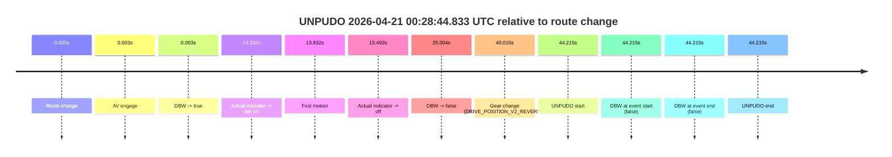

# Run Report: fme10005/2026-04-21--00-06-57--gen2-av-1a76f117-ec97-477d-bfa7-ad49c228fade

| Field | Value |
|---|---|
| Run ID | `fme10005/2026-04-21--00-06-57--gen2-av-1a76f117-ec97-477d-bfa7-ad49c228fade` |
| Date | `2026-04-21` |
| Model(s) | `pink-manta-ray-smooth` |
| Author | `guy.geva` |
| Event count | `1` |

## unpudo 2026-04-21 00:28:44.833 UTC

| Field | Value |
|---|---|
| Model | `pink-manta-ray-smooth` |
| Author | `guy.geva` |
| Run ID | `fme10005/2026-04-21--00-06-57--gen2-av-1a76f117-ec97-477d-bfa7-ad49c228fade` |
| Date | `2026-04-21` |
| Time (UTC) | `00:28:44.833` |
| Event type | `unpudo` |
| Disengagement type | `none observed` |
| Route change | `found` |
| Console | [run](https://console.sso.wayve.ai/run/fme10005/2026-04-21--00-06-57--gen2-av-1a76f117-ec97-477d-bfa7-ad49c228fade?id=&time-unixus=1776731324833310) |
| Foxglove | [segment](https://app.foxglove.dev/wayve-on-prem/p/prj_0dX18KZdVHg1fmmI/view?ds=foxglove-stream&ds.deviceName=fme10005&ds.start=2026-04-21T00%3A27%3A50.618430Z&ds.end=2026-04-21T00%3A28%3A54.833310Z&layoutId=lay_0e7VD4WIKDQGU73Y&time=2026-04-21T00%3A28%3A44.833310Z) |

### Event card: fail

- Fail: the credited unpudo does not stay AV-owned. The event window starts with DBW false, and the maneuver outcome lands outside a clean AV-owned segment.

| Event | Time (UTC) | Delta from route change |
|---|---:|---:|
| Route change | 2026-04-21 00:28:00.618 | `0.000s` |
| AV engage | 2026-04-21 00:28:00.621 | `0.003s` |
| DBW -> true | 2026-04-21 00:28:00.621 | `0.003s` |
| Actual indicator -> left on | 2026-04-21 00:28:13.950 | `13.332s` |
| First motion | 2026-04-21 00:28:14.450 | `13.832s` |
| Actual indicator -> off | 2026-04-21 00:28:16.110 | `15.492s` |
| DBW -> false | 2026-04-21 00:28:25.622 | `25.004s` |
| Gear change (DRIVE_POSITION_V2_REVERSE) | 2026-04-21 00:28:40.633 | `40.015s` |
| UNPUDO start | 2026-04-21 00:28:44.833 | `44.215s` |
| DBW at event start (false) | 2026-04-21 00:28:44.833 | `44.215s` |
| DBW at event end (false) | 2026-04-21 00:28:44.833 | `44.215s` |
| UNPUDO end | 2026-04-21 00:28:44.833 | `44.215s` |

| Metric | Value |
|---|---|
| Outcome | `fail` |
| Effective failure type | `not_av_owned` |
| Route change status | `found` |
| DBW at event start | `false` |
| DBW at event end | `false` |
| Predicted gear at AV start | `DRIVE_POSITION_V2_PARK` |
| Actual gear at AV start | `DRIVE_POSITION_V2_PARK` |
| Predicted gear at event start | `DRIVE_POSITION_V2_REVERSE` |
| Actual gear at event start | `DRIVE_POSITION_V2_REVERSE` |
| Planned indicator direction | `INDICATORS_STATE_V2_OFF` |
| Controller indicator direction | `INDICATORS_STATE_V2_OFF` |
| Actual indicator direction | `INDICATORS_STATE_V2_OFF` |
| Actual indicator at maneuver end | `INDICATORS_STATE_V2_OFF` |
| Driver accel help in AV | `false` |
| Driver accel help timestamp | `n/a` |
| Max accel pedal pct in AV | `0.0%` |
| Max brake pedal pct in AV | `10.8%` |
| Max speed mps in AV | `8.306` |
| Success timing baseline | `route change` |
| Route -> AV | `0.003s` |
| AV -> event start | `44.212s` |
| AV -> first motion | `13.829s` |
| Success baseline -> event start | `44.215s` |
| Success baseline -> first motion | `13.832s` |
| AV duration before disengagement | `25.001s` |
| Trajectory waypoint count | `36` |
| Driving-plan step count | `11` |

The scored portion starts from the AV-owned window, not from the pre-AV setup. Route-change search in the stopped pre-event segment was `found`, with the baseline therefore set to route change. At the event anchor the model predicts `DRIVE_POSITION_V2_REVERSE` and the actual gear is `DRIVE_POSITION_V2_REVERSE`. The effective model outcome is `fail` because `not_av_owned.`

### Resolution

| Field | Value |
|---|---|
| Final outcome | `fail` |
| Do we agree with this label? | `yes` |
| Source disengagement type | `none observed` |
| Resolved effective failure type | `not_av_owned` |
| Confidence | `high` |
