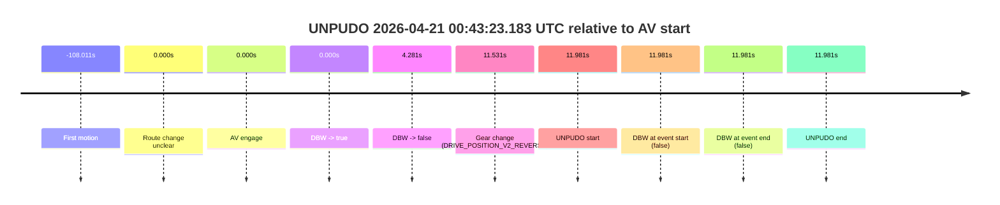

# Run Report: fme10005/2026-04-21--00-33-59--gen2-av-a0b633da-ff3d-4856-98d0-b89f810c1c3d

| Field | Value |
|---|---|
| Run ID | `fme10005/2026-04-21--00-33-59--gen2-av-a0b633da-ff3d-4856-98d0-b89f810c1c3d` |
| Date | `2026-04-21` |
| Model(s) | `pink-manta-ray-smooth` |
| Author | `guy.geva` |
| Event count | `1` |

## unpudo 2026-04-21 00:43:23.183 UTC

| Field | Value |
|---|---|
| Model | `pink-manta-ray-smooth` |
| Author | `guy.geva` |
| Run ID | `fme10005/2026-04-21--00-33-59--gen2-av-a0b633da-ff3d-4856-98d0-b89f810c1c3d` |
| Date | `2026-04-21` |
| Time (UTC) | `00:43:23.183` |
| Event type | `unpudo` |
| Disengagement type | `none observed` |
| Route change | `unclear` |
| Console | [run](https://console.sso.wayve.ai/run/fme10005/2026-04-21--00-33-59--gen2-av-a0b633da-ff3d-4856-98d0-b89f810c1c3d?id=&time-unixus=1776732203183306) |
| Foxglove | [segment](https://app.foxglove.dev/wayve-on-prem/p/prj_0dX18KZdVHg1fmmI/view?ds=foxglove-stream&ds.deviceName=fme10005&ds.start=2026-04-21T00%3A43%3A01.201871Z&ds.end=2026-04-21T00%3A43%3A33.183306Z&layoutId=lay_0e7VD4WIKDQGU73Y&time=2026-04-21T00%3A43%3A23.183306Z) |

### Event card: fail

- Fail: the credited unpudo does not stay AV-owned. The event window starts with DBW false, and the maneuver outcome lands outside a clean AV-owned segment.

| Event | Time (UTC) | Delta from AV start |
|---|---:|---:|
| First motion | 2026-04-21 00:41:23.190 | `-108.011s` |
| Route change unclear | 2026-04-21 00:43:11.201 | `0.000s` |
| AV engage | 2026-04-21 00:43:11.201 | `0.000s` |
| DBW -> true | 2026-04-21 00:43:11.201 | `0.000s` |
| DBW -> false | 2026-04-21 00:43:15.483 | `4.281s` |
| Gear change (DRIVE_POSITION_V2_REVERSE) | 2026-04-21 00:43:22.733 | `11.531s` |
| UNPUDO start | 2026-04-21 00:43:23.183 | `11.981s` |
| DBW at event start (false) | 2026-04-21 00:43:23.183 | `11.981s` |
| DBW at event end (false) | 2026-04-21 00:43:23.183 | `11.981s` |
| UNPUDO end | 2026-04-21 00:43:23.183 | `11.981s` |

| Metric | Value |
|---|---|
| Outcome | `fail` |
| Effective failure type | `completed_outside_av` |
| Route change status | `unclear` |
| DBW at event start | `false` |
| DBW at event end | `false` |
| Predicted gear at AV start | `DRIVE_POSITION_V2_DRIVE` |
| Actual gear at AV start | `DRIVE_POSITION_V2_DRIVE` |
| Predicted gear at event start | `DRIVE_POSITION_V2_REVERSE` |
| Actual gear at event start | `DRIVE_POSITION_V2_REVERSE` |
| Planned indicator direction | `INDICATORS_STATE_V2_OFF` |
| Controller indicator direction | `INDICATORS_STATE_V2_OFF` |
| Actual indicator direction | `INDICATORS_STATE_V2_OFF` |
| Actual indicator at maneuver end | `INDICATORS_STATE_V2_OFF` |
| Driver accel help in AV | `false` |
| Driver accel help timestamp | `n/a` |
| Max accel pedal pct in AV | `0.0%` |
| Max brake pedal pct in AV | `0.0%` |
| Max speed mps in AV | `5.758` |
| Success timing baseline | `AV start` |
| Route -> AV | `n/a` |
| AV -> event start | `11.981s` |
| AV -> first motion | `-108.011s` |
| Success baseline -> event start | `11.981s` |
| Success baseline -> first motion | `-108.011s` |
| AV duration before disengagement | `4.281s` |
| Trajectory waypoint count | `35` |
| Driving-plan step count | `11` |

The scored portion starts from the AV-owned window, not from the pre-AV setup. Route-change search in the stopped pre-event segment was `unclear`, with the baseline therefore set to AV start. At the event anchor the model predicts `DRIVE_POSITION_V2_REVERSE` and the actual gear is `DRIVE_POSITION_V2_REVERSE`. The effective model outcome is `fail` because `completed_outside_av.`

### Resolution

| Field | Value |
|---|---|
| Final outcome | `fail` |
| Do we agree with this label? | `yes` |
| Source disengagement type | `none observed` |
| Resolved effective failure type | `completed_outside_av` |
| Confidence | `medium` |
