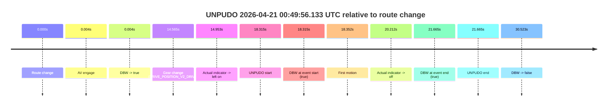
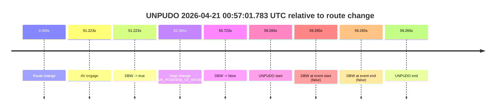
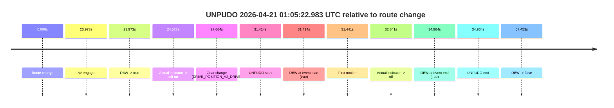
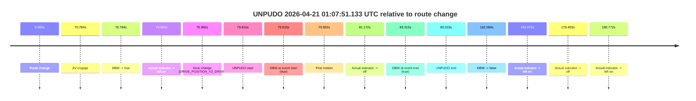
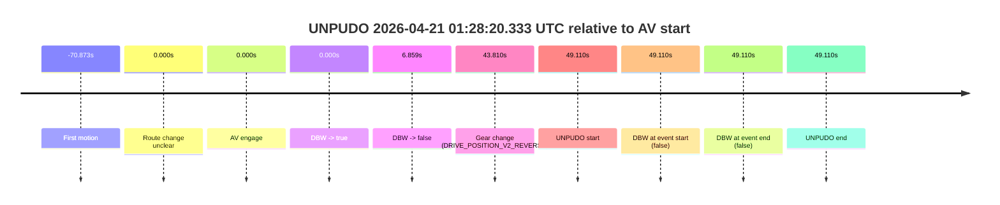

# Run Report: fme10005/2026-04-21--00-33-59--gen2-av-a0b633da-ff3d-4856-98d0-b89f810c1c3d

| Field | Value |
|---|---|
| Run ID | `fme10005/2026-04-21--00-33-59--gen2-av-a0b633da-ff3d-4856-98d0-b89f810c1c3d` |
| Date | `2026-04-21` |
| Model(s) | `eel-teal-outspoken` |
| Author | `zak` |
| Event count | `5` |

## unpudo 2026-04-21 00:49:56.133 UTC

| Field | Value |
|---|---|
| Model | `eel-teal-outspoken` |
| Author | `zak` |
| Run ID | `fme10005/2026-04-21--00-33-59--gen2-av-a0b633da-ff3d-4856-98d0-b89f810c1c3d` |
| Date | `2026-04-21` |
| Time (UTC) | `00:49:56.133` |
| Event type | `unpudo` |
| Disengagement type | `none observed` |
| Route change | `found` |
| Console | [run](https://console.sso.wayve.ai/run/fme10005/2026-04-21--00-33-59--gen2-av-a0b633da-ff3d-4856-98d0-b89f810c1c3d?id=&time-unixus=1776732596133297) |
| Foxglove | [segment](https://app.foxglove.dev/wayve-on-prem/p/prj_0dX18KZdVHg1fmmI/view?ds=foxglove-stream&ds.deviceName=fme10005&ds.start=2026-04-21T00%3A49%3A27.818363Z&ds.end=2026-04-21T00%3A50%3A18.341843Z&layoutId=lay_0e7VD4WIKDQGU73Y&time=2026-04-21T00%3A49%3A56.133297Z) |

### Event card: pass

- Pass: AV owns the credited unpudo from route change through the official unpudo window, the gear state is aligned at the anchor, and the vehicle moves without driver accelerator help in AV.

| Event | Time (UTC) | Delta from route change |
|---|---:|---:|
| Route change | 2026-04-21 00:49:37.818 | `0.000s` |
| AV engage | 2026-04-21 00:49:37.821 | `0.004s` |
| DBW -> true | 2026-04-21 00:49:37.821 | `0.004s` |
| Gear change (DRIVE_POSITION_V2_DRIVE) | 2026-04-21 00:49:52.383 | `14.565s` |
| Actual indicator -> left on | 2026-04-21 00:49:52.771 | `14.953s` |
| UNPUDO start | 2026-04-21 00:49:56.133 | `18.315s` |
| DBW at event start (true) | 2026-04-21 00:49:56.133 | `18.315s` |
| First motion | 2026-04-21 00:49:56.170 | `18.352s` |
| Actual indicator -> off | 2026-04-21 00:49:58.030 | `20.212s` |
| DBW at event end (true) | 2026-04-21 00:49:59.483 | `21.665s` |
| UNPUDO end | 2026-04-21 00:49:59.483 | `21.665s` |
| DBW -> false | 2026-04-21 00:50:08.341 | `30.523s` |

| Metric | Value |
|---|---|
| Outcome | `pass` |
| Effective failure type | `none` |
| Route change status | `found` |
| DBW at event start | `true` |
| DBW at event end | `true` |
| Predicted gear at AV start | `DRIVE_POSITION_V2_PARK` |
| Actual gear at AV start | `DRIVE_POSITION_V2_PARK` |
| Predicted gear at event start | `DRIVE_POSITION_V2_DRIVE` |
| Actual gear at event start | `DRIVE_POSITION_V2_DRIVE` |
| Planned indicator direction | `INDICATORS_STATE_V2_LEFT_ON` |
| Controller indicator direction | `INDICATORS_STATE_V2_LEFT_ON` |
| Actual indicator direction | `INDICATORS_STATE_V2_LEFT_ON` |
| Actual indicator at maneuver end | `INDICATORS_STATE_V2_OFF` |
| Driver accel help in AV | `false` |
| Driver accel help timestamp | `n/a` |
| Max accel pedal pct in AV | `0.0%` |
| Max brake pedal pct in AV | `23.6%` |
| Max speed mps in AV | `5.233` |
| Success timing baseline | `route change` |
| Route -> AV | `0.004s` |
| AV -> event start | `18.311s` |
| AV -> first motion | `18.349s` |
| Success baseline -> event start | `18.315s` |
| Success baseline -> first motion | `18.352s` |
| AV duration before disengagement | `30.520s` |
| Trajectory waypoint count | `38` |
| Driving-plan step count | `11` |

The scored portion starts from the AV-owned window, not from the pre-AV setup. Route-change search in the stopped pre-event segment was `found`, with the baseline therefore set to route change. At the event anchor the model predicts `DRIVE_POSITION_V2_DRIVE` and the actual gear is `DRIVE_POSITION_V2_DRIVE`. The effective model outcome is `pass` because `the credited unpudo stays AV-owned through the official unpudo window.`

### Resolution

| Field | Value |
|---|---|
| Final outcome | `pass` |
| Do we agree with this label? | `yes` |
| Source disengagement type | `none observed` |
| Resolved effective failure type | `none` |
| Confidence | `high` |

## unpudo 2026-04-21 00:57:01.783 UTC

| Field | Value |
|---|---|
| Model | `eel-teal-outspoken` |
| Author | `zak` |
| Run ID | `fme10005/2026-04-21--00-33-59--gen2-av-a0b633da-ff3d-4856-98d0-b89f810c1c3d` |
| Date | `2026-04-21` |
| Time (UTC) | `00:57:01.783` |
| Event type | `unpudo` |
| Disengagement type | `none observed` |
| Route change | `found` |
| Console | [run](https://console.sso.wayve.ai/run/fme10005/2026-04-21--00-33-59--gen2-av-a0b633da-ff3d-4856-98d0-b89f810c1c3d?id=&time-unixus=1776733021783306) |
| Foxglove | [segment](https://app.foxglove.dev/wayve-on-prem/p/prj_0dX18KZdVHg1fmmI/view?ds=foxglove-stream&ds.deviceName=fme10005&ds.start=2026-04-21T00%3A55%3A52.518412Z&ds.end=2026-04-21T00%3A57%3A11.783306Z&layoutId=lay_0e7VD4WIKDQGU73Y&time=2026-04-21T00%3A57%3A01.783306Z) |

### Event card: fail

- Fail: the credited unpudo does not stay AV-owned. The event window starts with DBW false, and the maneuver outcome lands outside a clean AV-owned segment.

| Event | Time (UTC) | Delta from route change |
|---|---:|---:|
| Route change | 2026-04-21 00:56:02.518 | `0.000s` |
| AV engage | 2026-04-21 00:56:53.741 | `51.223s` |
| DBW -> true | 2026-04-21 00:56:53.741 | `51.223s` |
| Gear change (DRIVE_POSITION_V2_REVERSE) | 2026-04-21 00:56:54.883 | `52.365s` |
| DBW -> false | 2026-04-21 00:56:58.241 | `55.723s` |
| UNPUDO start | 2026-04-21 00:57:01.783 | `59.265s` |
| DBW at event start (false) | 2026-04-21 00:57:01.783 | `59.265s` |
| DBW at event end (false) | 2026-04-21 00:57:01.783 | `59.265s` |
| UNPUDO end | 2026-04-21 00:57:01.783 | `59.265s` |

| Metric | Value |
|---|---|
| Outcome | `fail` |
| Effective failure type | `not_av_owned` |
| Route change status | `found` |
| DBW at event start | `false` |
| DBW at event end | `false` |
| Predicted gear at AV start | `DRIVE_POSITION_V2_PARK` |
| Actual gear at AV start | `DRIVE_POSITION_V2_PARK` |
| Predicted gear at event start | `DRIVE_POSITION_V2_REVERSE` |
| Actual gear at event start | `DRIVE_POSITION_V2_REVERSE` |
| Planned indicator direction | `INDICATORS_STATE_V2_OFF` |
| Controller indicator direction | `INDICATORS_STATE_V2_OFF` |
| Actual indicator direction | `INDICATORS_STATE_V2_OFF` |
| Actual indicator at maneuver end | `INDICATORS_STATE_V2_OFF` |
| Driver accel help in AV | `false` |
| Driver accel help timestamp | `n/a` |
| Max accel pedal pct in AV | `0.0%` |
| Max brake pedal pct in AV | `8.0%` |
| Max speed mps in AV | `0.000` |
| Success timing baseline | `route change` |
| Route -> AV | `51.223s` |
| AV -> event start | `8.042s` |
| AV -> first motion | `n/a` |
| Success baseline -> event start | `59.265s` |
| Success baseline -> first motion | `n/a` |
| AV duration before disengagement | `4.501s` |
| Trajectory waypoint count | `37` |
| Driving-plan step count | `11` |

The scored portion starts from the AV-owned window, not from the pre-AV setup. Route-change search in the stopped pre-event segment was `found`, with the baseline therefore set to route change. At the event anchor the model predicts `DRIVE_POSITION_V2_REVERSE` and the actual gear is `DRIVE_POSITION_V2_REVERSE`. The effective model outcome is `fail` because `not_av_owned.`

### Resolution

| Field | Value |
|---|---|
| Final outcome | `fail` |
| Do we agree with this label? | `yes` |
| Source disengagement type | `none observed` |
| Resolved effective failure type | `not_av_owned` |
| Confidence | `high` |

## unpudo 2026-04-21 01:05:22.983 UTC

| Field | Value |
|---|---|
| Model | `eel-teal-outspoken` |
| Author | `zak` |
| Run ID | `fme10005/2026-04-21--00-33-59--gen2-av-a0b633da-ff3d-4856-98d0-b89f810c1c3d` |
| Date | `2026-04-21` |
| Time (UTC) | `01:05:22.983` |
| Event type | `unpudo` |
| Disengagement type | `none observed` |
| Route change | `found` |
| Console | [run](https://console.sso.wayve.ai/run/fme10005/2026-04-21--00-33-59--gen2-av-a0b633da-ff3d-4856-98d0-b89f810c1c3d?id=&time-unixus=1776733522983316) |
| Foxglove | [segment](https://app.foxglove.dev/wayve-on-prem/p/prj_0dX18KZdVHg1fmmI/view?ds=foxglove-stream&ds.deviceName=fme10005&ds.start=2026-04-21T01%3A04%3A41.568869Z&ds.end=2026-04-21T01%3A06%3A09.021856Z&layoutId=lay_0e7VD4WIKDQGU73Y&time=2026-04-21T01%3A05%3A22.983316Z) |

### Event card: pass

- Pass: AV owns the credited unpudo from route change through the official unpudo window, the gear state is aligned at the anchor, and the vehicle moves without driver accelerator help in AV.

| Event | Time (UTC) | Delta from route change |
|---|---:|---:|
| Route change | 2026-04-21 01:04:51.568 | `0.000s` |
| AV engage | 2026-04-21 01:05:15.541 | `23.973s` |
| DBW -> true | 2026-04-21 01:05:15.541 | `23.973s` |
| Actual indicator -> left on | 2026-04-21 01:05:16.090 | `24.521s` |
| Gear change (DRIVE_POSITION_V2_DRIVE) | 2026-04-21 01:05:19.233 | `27.664s` |
| UNPUDO start | 2026-04-21 01:05:22.983 | `31.414s` |
| DBW at event start (true) | 2026-04-21 01:05:22.983 | `31.414s` |
| First motion | 2026-04-21 01:05:23.010 | `31.441s` |
| Actual indicator -> off | 2026-04-21 01:05:24.410 | `32.841s` |
| DBW at event end (true) | 2026-04-21 01:05:26.533 | `34.964s` |
| UNPUDO end | 2026-04-21 01:05:26.533 | `34.964s` |
| DBW -> false | 2026-04-21 01:05:59.021 | `67.453s` |

| Metric | Value |
|---|---|
| Outcome | `pass` |
| Effective failure type | `none` |
| Route change status | `found` |
| DBW at event start | `true` |
| DBW at event end | `true` |
| Predicted gear at AV start | `DRIVE_POSITION_V2_PARK` |
| Actual gear at AV start | `DRIVE_POSITION_V2_PARK` |
| Predicted gear at event start | `DRIVE_POSITION_V2_DRIVE` |
| Actual gear at event start | `DRIVE_POSITION_V2_DRIVE` |
| Planned indicator direction | `INDICATORS_STATE_V2_LEFT_ON` |
| Controller indicator direction | `INDICATORS_STATE_V2_LEFT_ON` |
| Actual indicator direction | `INDICATORS_STATE_V2_LEFT_ON` |
| Actual indicator at maneuver end | `INDICATORS_STATE_V2_OFF` |
| Driver accel help in AV | `false` |
| Driver accel help timestamp | `n/a` |
| Max accel pedal pct in AV | `0.0%` |
| Max brake pedal pct in AV | `11.8%` |
| Max speed mps in AV | `5.072` |
| Success timing baseline | `route change` |
| Route -> AV | `23.973s` |
| AV -> event start | `7.441s` |
| AV -> first motion | `7.468s` |
| Success baseline -> event start | `31.414s` |
| Success baseline -> first motion | `31.441s` |
| AV duration before disengagement | `43.480s` |
| Trajectory waypoint count | `37` |
| Driving-plan step count | `11` |

The scored portion starts from the AV-owned window, not from the pre-AV setup. Route-change search in the stopped pre-event segment was `found`, with the baseline therefore set to route change. At the event anchor the model predicts `DRIVE_POSITION_V2_DRIVE` and the actual gear is `DRIVE_POSITION_V2_DRIVE`. The effective model outcome is `pass` because `the credited unpudo stays AV-owned through the official unpudo window.`

### Resolution

| Field | Value |
|---|---|
| Final outcome | `pass` |
| Do we agree with this label? | `yes` |
| Source disengagement type | `none observed` |
| Resolved effective failure type | `none` |
| Confidence | `high` |

## unpudo 2026-04-21 01:07:51.133 UTC

| Field | Value |
|---|---|
| Model | `eel-teal-outspoken` |
| Author | `zak` |
| Run ID | `fme10005/2026-04-21--00-33-59--gen2-av-a0b633da-ff3d-4856-98d0-b89f810c1c3d` |
| Date | `2026-04-21` |
| Time (UTC) | `01:07:51.133` |
| Event type | `unpudo` |
| Disengagement type | `none observed` |
| Route change | `found` |
| Console | [run](https://console.sso.wayve.ai/run/fme10005/2026-04-21--00-33-59--gen2-av-a0b633da-ff3d-4856-98d0-b89f810c1c3d?id=&time-unixus=1776733671133313) |
| Foxglove | [segment](https://app.foxglove.dev/wayve-on-prem/p/prj_0dX18KZdVHg1fmmI/view?ds=foxglove-stream&ds.deviceName=fme10005&ds.start=2026-04-21T01%3A06%3A21.318334Z&ds.end=2026-04-21T01%3A09%3A23.901838Z&layoutId=lay_0e7VD4WIKDQGU73Y&time=2026-04-21T01%3A07%3A51.133313Z) |

### Event card: pass

- Pass: AV owns the credited unpudo from route change through the official unpudo window, the gear state is aligned at the anchor, and the vehicle moves without driver accelerator help in AV.

| Event | Time (UTC) | Delta from route change |
|---|---:|---:|
| Route change | 2026-04-21 01:06:31.318 | `0.000s` |
| AV engage | 2026-04-21 01:07:42.102 | `70.784s` |
| DBW -> true | 2026-04-21 01:07:42.102 | `70.784s` |
| Actual indicator -> left on | 2026-04-21 01:07:45.010 | `73.692s` |
| Gear change (DRIVE_POSITION_V2_DRIVE) | 2026-04-21 01:07:47.283 | `75.965s` |
| UNPUDO start | 2026-04-21 01:07:51.133 | `79.815s` |
| DBW at event start (true) | 2026-04-21 01:07:51.133 | `79.815s` |
| First motion | 2026-04-21 01:07:51.170 | `79.852s` |
| Actual indicator -> off | 2026-04-21 01:07:52.490 | `81.172s` |
| DBW at event end (true) | 2026-04-21 01:07:54.633 | `83.315s` |
| UNPUDO end | 2026-04-21 01:07:54.633 | `83.315s` |
| DBW -> false | 2026-04-21 01:09:13.901 | `162.584s` |
| Actual indicator -> left on | 2026-04-21 01:09:14.390 | `163.072s` |
| Actual indicator -> off | 2026-04-21 01:09:30.810 | `179.492s` |
| Actual indicator -> left on | 2026-04-21 01:09:32.090 | `180.772s` |

| Metric | Value |
|---|---|
| Outcome | `pass` |
| Effective failure type | `none` |
| Route change status | `found` |
| DBW at event start | `true` |
| DBW at event end | `true` |
| Predicted gear at AV start | `DRIVE_POSITION_V2_PARK` |
| Actual gear at AV start | `DRIVE_POSITION_V2_PARK` |
| Predicted gear at event start | `DRIVE_POSITION_V2_DRIVE` |
| Actual gear at event start | `DRIVE_POSITION_V2_DRIVE` |
| Planned indicator direction | `INDICATORS_STATE_V2_LEFT_ON` |
| Controller indicator direction | `INDICATORS_STATE_V2_LEFT_ON` |
| Actual indicator direction | `INDICATORS_STATE_V2_LEFT_ON` |
| Actual indicator at maneuver end | `INDICATORS_STATE_V2_OFF` |
| Driver accel help in AV | `false` |
| Driver accel help timestamp | `n/a` |
| Max accel pedal pct in AV | `0.0%` |
| Max brake pedal pct in AV | `27.8%` |
| Max speed mps in AV | `4.883` |
| Success timing baseline | `route change` |
| Route -> AV | `70.784s` |
| AV -> event start | `9.031s` |
| AV -> first motion | `9.068s` |
| Success baseline -> event start | `79.815s` |
| Success baseline -> first motion | `79.852s` |
| AV duration before disengagement | `91.800s` |
| Trajectory waypoint count | `36` |
| Driving-plan step count | `11` |

The scored portion starts from the AV-owned window, not from the pre-AV setup. Route-change search in the stopped pre-event segment was `found`, with the baseline therefore set to route change. At the event anchor the model predicts `DRIVE_POSITION_V2_DRIVE` and the actual gear is `DRIVE_POSITION_V2_DRIVE`. The effective model outcome is `pass` because `the credited unpudo stays AV-owned through the official unpudo window.`

### Resolution

| Field | Value |
|---|---|
| Final outcome | `pass` |
| Do we agree with this label? | `yes` |
| Source disengagement type | `none observed` |
| Resolved effective failure type | `none` |
| Confidence | `high` |

## unpudo 2026-04-21 01:28:20.333 UTC

| Field | Value |
|---|---|
| Model | `eel-teal-outspoken` |
| Author | `zak` |
| Run ID | `fme10005/2026-04-21--00-33-59--gen2-av-a0b633da-ff3d-4856-98d0-b89f810c1c3d` |
| Date | `2026-04-21` |
| Time (UTC) | `01:28:20.333` |
| Event type | `unpudo` |
| Disengagement type | `none observed` |
| Route change | `unclear` |
| Console | [run](https://console.sso.wayve.ai/run/fme10005/2026-04-21--00-33-59--gen2-av-a0b633da-ff3d-4856-98d0-b89f810c1c3d?id=&time-unixus=1776734900333314) |
| Foxglove | [segment](https://app.foxglove.dev/wayve-on-prem/p/prj_0dX18KZdVHg1fmmI/view?ds=foxglove-stream&ds.deviceName=fme10005&ds.start=2026-04-21T01%3A27%3A21.223066Z&ds.end=2026-04-21T01%3A28%3A30.333314Z&layoutId=lay_0e7VD4WIKDQGU73Y&time=2026-04-21T01%3A28%3A20.333314Z) |

### Event card: fail

- Fail: the credited unpudo does not stay AV-owned. The event window starts with DBW false, and the maneuver outcome lands outside a clean AV-owned segment.

| Event | Time (UTC) | Delta from AV start |
|---|---:|---:|
| First motion | 2026-04-21 01:26:20.350 | `-70.873s` |
| Route change unclear | 2026-04-21 01:27:31.223 | `0.000s` |
| AV engage | 2026-04-21 01:27:31.223 | `0.000s` |
| DBW -> true | 2026-04-21 01:27:31.223 | `0.000s` |
| DBW -> false | 2026-04-21 01:27:38.081 | `6.859s` |
| Gear change (DRIVE_POSITION_V2_REVERSE) | 2026-04-21 01:28:15.033 | `43.810s` |
| UNPUDO start | 2026-04-21 01:28:20.333 | `49.110s` |
| DBW at event start (false) | 2026-04-21 01:28:20.333 | `49.110s` |
| DBW at event end (false) | 2026-04-21 01:28:20.333 | `49.110s` |
| UNPUDO end | 2026-04-21 01:28:20.333 | `49.110s` |

| Metric | Value |
|---|---|
| Outcome | `fail` |
| Effective failure type | `completed_outside_av` |
| Route change status | `unclear` |
| DBW at event start | `false` |
| DBW at event end | `false` |
| Predicted gear at AV start | `DRIVE_POSITION_V2_DRIVE` |
| Actual gear at AV start | `DRIVE_POSITION_V2_DRIVE` |
| Predicted gear at event start | `DRIVE_POSITION_V2_REVERSE` |
| Actual gear at event start | `DRIVE_POSITION_V2_REVERSE` |
| Planned indicator direction | `INDICATORS_STATE_V2_OFF` |
| Controller indicator direction | `INDICATORS_STATE_V2_OFF` |
| Actual indicator direction | `INDICATORS_STATE_V2_OFF` |
| Actual indicator at maneuver end | `INDICATORS_STATE_V2_OFF` |
| Driver accel help in AV | `false` |
| Driver accel help timestamp | `n/a` |
| Max accel pedal pct in AV | `0.0%` |
| Max brake pedal pct in AV | `0.0%` |
| Max speed mps in AV | `9.939` |
| Success timing baseline | `AV start` |
| Route -> AV | `n/a` |
| AV -> event start | `49.110s` |
| AV -> first motion | `-70.873s` |
| Success baseline -> event start | `49.110s` |
| Success baseline -> first motion | `-70.873s` |
| AV duration before disengagement | `6.859s` |
| Trajectory waypoint count | `38` |
| Driving-plan step count | `11` |

The scored portion starts from the AV-owned window, not from the pre-AV setup. Route-change search in the stopped pre-event segment was `unclear`, with the baseline therefore set to AV start. At the event anchor the model predicts `DRIVE_POSITION_V2_REVERSE` and the actual gear is `DRIVE_POSITION_V2_REVERSE`. The effective model outcome is `fail` because `completed_outside_av.`

### Resolution

| Field | Value |
|---|---|
| Final outcome | `fail` |
| Do we agree with this label? | `yes` |
| Source disengagement type | `none observed` |
| Resolved effective failure type | `completed_outside_av` |
| Confidence | `medium` |
