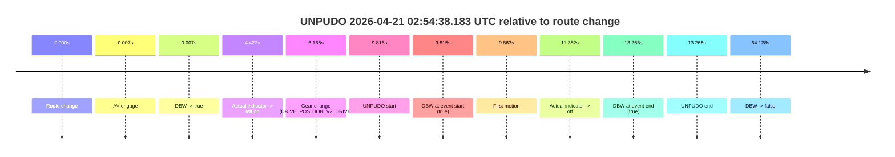
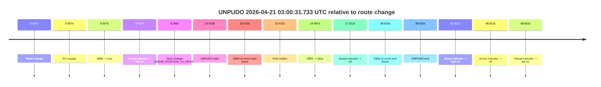
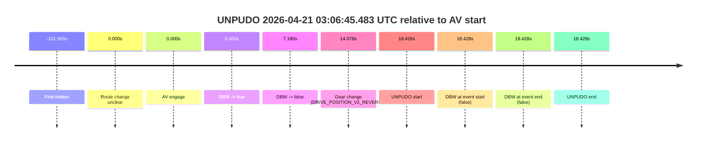
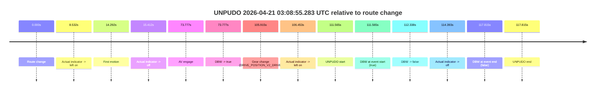
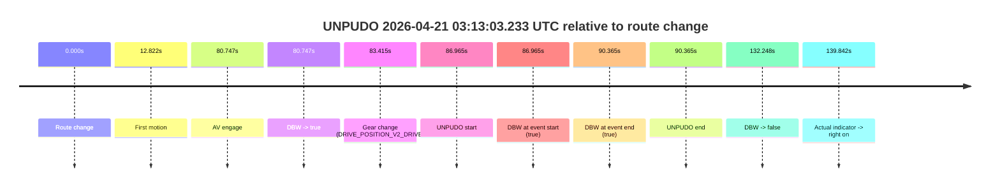
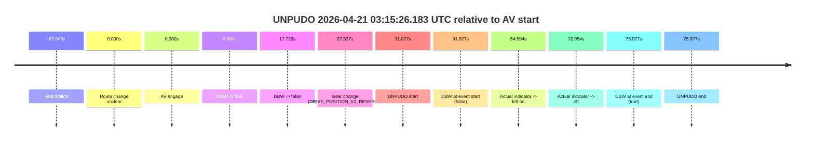
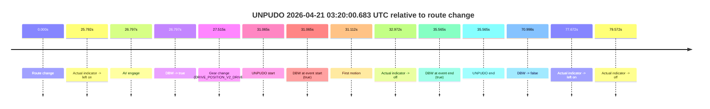
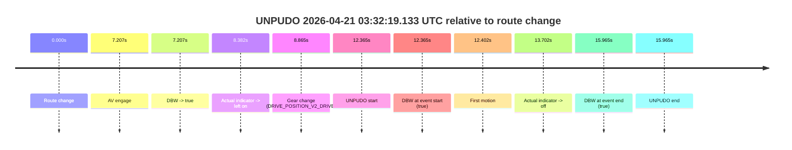

# Run Report: fme10005/2026-04-21--02-34-08--gen2-av-88814959-a959-438b-a1f8-52e6417ba36a

| Field | Value |
|---|---|
| Run ID | `fme10005/2026-04-21--02-34-08--gen2-av-88814959-a959-438b-a1f8-52e6417ba36a` |
| Date | `2026-04-21` |
| Model(s) | `eel-teal-outspoken` |
| Author | `zak` |
| Event count | `8` |

## unpudo 2026-04-21 02:54:38.183 UTC

| Field | Value |
|---|---|
| Model | `eel-teal-outspoken` |
| Author | `zak` |
| Run ID | `fme10005/2026-04-21--02-34-08--gen2-av-88814959-a959-438b-a1f8-52e6417ba36a` |
| Date | `2026-04-21` |
| Time (UTC) | `02:54:38.183` |
| Event type | `unpudo` |
| Disengagement type | `none observed` |
| Route change | `found` |
| Console | [run](https://console.sso.wayve.ai/run/fme10005/2026-04-21--02-34-08--gen2-av-88814959-a959-438b-a1f8-52e6417ba36a?id=&time-unixus=1776740078183300) |
| Foxglove | [segment](https://app.foxglove.dev/wayve-on-prem/p/prj_0dX18KZdVHg1fmmI/view?ds=foxglove-stream&ds.deviceName=fme10005&ds.start=2026-04-21T02%3A54%3A18.368284Z&ds.end=2026-04-21T02%3A55%3A42.496665Z&layoutId=lay_0e7VD4WIKDQGU73Y&time=2026-04-21T02%3A54%3A38.183300Z) |

### Event card: pass

- Pass: AV owns the credited unpudo from route change through the official unpudo window, the gear state is aligned at the anchor, and the vehicle moves without driver accelerator help in AV.

| Event | Time (UTC) | Delta from route change |
|---|---:|---:|
| Route change | 2026-04-21 02:54:28.368 | `0.000s` |
| AV engage | 2026-04-21 02:54:28.375 | `0.007s` |
| DBW -> true | 2026-04-21 02:54:28.375 | `0.007s` |
| Actual indicator -> left on | 2026-04-21 02:54:32.790 | `4.422s` |
| Gear change (DRIVE_POSITION_V2_DRIVE) | 2026-04-21 02:54:34.533 | `6.165s` |
| UNPUDO start | 2026-04-21 02:54:38.183 | `9.815s` |
| DBW at event start (true) | 2026-04-21 02:54:38.183 | `9.815s` |
| First motion | 2026-04-21 02:54:38.230 | `9.863s` |
| Actual indicator -> off | 2026-04-21 02:54:39.750 | `11.382s` |
| DBW at event end (true) | 2026-04-21 02:54:41.633 | `13.265s` |
| UNPUDO end | 2026-04-21 02:54:41.633 | `13.265s` |
| DBW -> false | 2026-04-21 02:55:32.496 | `64.128s` |

| Metric | Value |
|---|---|
| Outcome | `pass` |
| Effective failure type | `none` |
| Route change status | `found` |
| DBW at event start | `true` |
| DBW at event end | `true` |
| Predicted gear at AV start | `DRIVE_POSITION_V2_PARK` |
| Actual gear at AV start | `DRIVE_POSITION_V2_PARK` |
| Predicted gear at event start | `DRIVE_POSITION_V2_DRIVE` |
| Actual gear at event start | `DRIVE_POSITION_V2_DRIVE` |
| Planned indicator direction | `INDICATORS_STATE_V2_LEFT_ON` |
| Controller indicator direction | `INDICATORS_STATE_V2_LEFT_ON` |
| Actual indicator direction | `INDICATORS_STATE_V2_LEFT_ON` |
| Actual indicator at maneuver end | `INDICATORS_STATE_V2_OFF` |
| Driver accel help in AV | `false` |
| Driver accel help timestamp | `n/a` |
| Max accel pedal pct in AV | `0.0%` |
| Max brake pedal pct in AV | `29.4%` |
| Max speed mps in AV | `5.397` |
| Success timing baseline | `route change` |
| Route -> AV | `0.007s` |
| AV -> event start | `9.808s` |
| AV -> first motion | `9.855s` |
| Success baseline -> event start | `9.815s` |
| Success baseline -> first motion | `9.863s` |
| AV duration before disengagement | `64.121s` |
| Trajectory waypoint count | `36` |
| Driving-plan step count | `11` |

The scored portion starts from the AV-owned window, not from the pre-AV setup. Route-change search in the stopped pre-event segment was `found`, with the baseline therefore set to route change. At the event anchor the model predicts `DRIVE_POSITION_V2_DRIVE` and the actual gear is `DRIVE_POSITION_V2_DRIVE`. The effective model outcome is `pass` because `the credited unpudo stays AV-owned through the official unpudo window.`

### Resolution

| Field | Value |
|---|---|
| Final outcome | `pass` |
| Do we agree with this label? | `yes` |
| Source disengagement type | `none observed` |
| Resolved effective failure type | `none` |
| Confidence | `high` |

## unpudo 2026-04-21 03:00:31.733 UTC

| Field | Value |
|---|---|
| Model | `eel-teal-outspoken` |
| Author | `zak` |
| Run ID | `fme10005/2026-04-21--02-34-08--gen2-av-88814959-a959-438b-a1f8-52e6417ba36a` |
| Date | `2026-04-21` |
| Time (UTC) | `03:00:31.733` |
| Event type | `unpudo` |
| Disengagement type | `none observed` |
| Route change | `found` |
| Console | [run](https://console.sso.wayve.ai/run/fme10005/2026-04-21--02-34-08--gen2-av-88814959-a959-438b-a1f8-52e6417ba36a?id=&time-unixus=1776740431733299) |
| Foxglove | [segment](https://app.foxglove.dev/wayve-on-prem/p/prj_0dX18KZdVHg1fmmI/view?ds=foxglove-stream&ds.deviceName=fme10005&ds.start=2026-04-21T03%3A00%3A11.318554Z&ds.end=2026-04-21T03%3A01%3A11.233317Z&layoutId=lay_0e7VD4WIKDQGU73Y&time=2026-04-21T03%3A00%3A31.733299Z) |

### Event card: fail

- Fail: the credited unpudo does not stay AV-owned. The event window starts with DBW true, and the maneuver outcome lands outside a clean AV-owned segment.

| Event | Time (UTC) | Delta from route change |
|---|---:|---:|
| Route change | 2026-04-21 03:00:21.318 | `0.000s` |
| AV engage | 2026-04-21 03:00:21.325 | `0.007s` |
| DBW -> true | 2026-04-21 03:00:21.325 | `0.007s` |
| Actual indicator -> left on | 2026-04-21 03:00:26.930 | `5.612s` |
| Gear change (DRIVE_POSITION_V2_DRIVE) | 2026-04-21 03:00:27.583 | `6.265s` |
| UNPUDO start | 2026-04-21 03:00:31.733 | `10.415s` |
| DBW at event start (true) | 2026-04-21 03:00:31.733 | `10.415s` |
| First motion | 2026-04-21 03:00:31.790 | `10.472s` |
| DBW -> false | 2026-04-21 03:00:35.815 | `14.497s` |
| Actual indicator -> off | 2026-04-21 03:00:38.630 | `17.312s` |
| DBW at event end (false) | 2026-04-21 03:01:01.233 | `39.915s` |
| UNPUDO end | 2026-04-21 03:01:01.233 | `39.915s` |
| Actual indicator -> right on | 2026-04-21 03:01:04.130 | `42.812s` |
| Actual indicator -> off | 2026-04-21 03:01:10.230 | `48.912s` |
| Actual indicator -> left on | 2026-04-21 03:01:19.970 | `58.652s` |

| Metric | Value |
|---|---|
| Outcome | `fail` |
| Effective failure type | `driver_completed_maneuver` |
| Route change status | `found` |
| DBW at event start | `true` |
| DBW at event end | `false` |
| Predicted gear at AV start | `DRIVE_POSITION_V2_PARK` |
| Actual gear at AV start | `DRIVE_POSITION_V2_PARK` |
| Predicted gear at event start | `DRIVE_POSITION_V2_DRIVE` |
| Actual gear at event start | `DRIVE_POSITION_V2_DRIVE` |
| Planned indicator direction | `INDICATORS_STATE_V2_LEFT_ON` |
| Controller indicator direction | `INDICATORS_STATE_V2_LEFT_ON` |
| Actual indicator direction | `INDICATORS_STATE_V2_LEFT_ON` |
| Actual indicator at maneuver end | `INDICATORS_STATE_V2_OFF` |
| Driver accel help in AV | `false` |
| Driver accel help timestamp | `n/a` |
| Max accel pedal pct in AV | `0.0%` |
| Max brake pedal pct in AV | `26.2%` |
| Max speed mps in AV | `1.497` |
| Success timing baseline | `route change` |
| Route -> AV | `0.007s` |
| AV -> event start | `10.408s` |
| AV -> first motion | `10.465s` |
| Success baseline -> event start | `10.415s` |
| Success baseline -> first motion | `10.472s` |
| AV duration before disengagement | `14.490s` |
| Trajectory waypoint count | `37` |
| Driving-plan step count | `11` |

The scored portion starts from the AV-owned window, not from the pre-AV setup. Route-change search in the stopped pre-event segment was `found`, with the baseline therefore set to route change. At the event anchor the model predicts `DRIVE_POSITION_V2_DRIVE` and the actual gear is `DRIVE_POSITION_V2_DRIVE`. The effective model outcome is `fail` because `driver_completed_maneuver.`

### Resolution

| Field | Value |
|---|---|
| Final outcome | `fail` |
| Do we agree with this label? | `yes` |
| Source disengagement type | `none observed` |
| Resolved effective failure type | `driver_completed_maneuver` |
| Confidence | `high` |

## unpudo 2026-04-21 03:06:45.483 UTC

| Field | Value |
|---|---|
| Model | `eel-teal-outspoken` |
| Author | `zak` |
| Run ID | `fme10005/2026-04-21--02-34-08--gen2-av-88814959-a959-438b-a1f8-52e6417ba36a` |
| Date | `2026-04-21` |
| Time (UTC) | `03:06:45.483` |
| Event type | `unpudo` |
| Disengagement type | `none observed` |
| Route change | `unclear` |
| Console | [run](https://console.sso.wayve.ai/run/fme10005/2026-04-21--02-34-08--gen2-av-88814959-a959-438b-a1f8-52e6417ba36a?id=&time-unixus=1776740805483308) |
| Foxglove | [segment](https://app.foxglove.dev/wayve-on-prem/p/prj_0dX18KZdVHg1fmmI/view?ds=foxglove-stream&ds.deviceName=fme10005&ds.start=2026-04-21T03%3A06%3A17.055630Z&ds.end=2026-04-21T03%3A06%3A55.483308Z&layoutId=lay_0e7VD4WIKDQGU73Y&time=2026-04-21T03%3A06%3A45.483308Z) |

### Event card: fail

- Fail: the credited unpudo does not stay AV-owned. The event window starts with DBW false, and the maneuver outcome lands outside a clean AV-owned segment.

| Event | Time (UTC) | Delta from AV start |
|---|---:|---:|
| First motion | 2026-04-21 03:04:45.490 | `-101.565s` |
| Route change unclear | 2026-04-21 03:06:27.055 | `0.000s` |
| AV engage | 2026-04-21 03:06:27.055 | `0.000s` |
| DBW -> true | 2026-04-21 03:06:27.055 | `0.000s` |
| DBW -> false | 2026-04-21 03:06:34.235 | `7.180s` |
| Gear change (DRIVE_POSITION_V2_REVERSE) | 2026-04-21 03:06:41.133 | `14.078s` |
| UNPUDO start | 2026-04-21 03:06:45.483 | `18.428s` |
| DBW at event start (false) | 2026-04-21 03:06:45.483 | `18.428s` |
| DBW at event end (false) | 2026-04-21 03:06:45.483 | `18.428s` |
| UNPUDO end | 2026-04-21 03:06:45.483 | `18.428s` |

| Metric | Value |
|---|---|
| Outcome | `fail` |
| Effective failure type | `completed_outside_av` |
| Route change status | `unclear` |
| DBW at event start | `false` |
| DBW at event end | `false` |
| Predicted gear at AV start | `DRIVE_POSITION_V2_DRIVE` |
| Actual gear at AV start | `DRIVE_POSITION_V2_DRIVE` |
| Predicted gear at event start | `DRIVE_POSITION_V2_REVERSE` |
| Actual gear at event start | `DRIVE_POSITION_V2_REVERSE` |
| Planned indicator direction | `INDICATORS_STATE_V2_OFF` |
| Controller indicator direction | `INDICATORS_STATE_V2_OFF` |
| Actual indicator direction | `INDICATORS_STATE_V2_OFF` |
| Actual indicator at maneuver end | `INDICATORS_STATE_V2_OFF` |
| Driver accel help in AV | `false` |
| Driver accel help timestamp | `n/a` |
| Max accel pedal pct in AV | `0.0%` |
| Max brake pedal pct in AV | `0.0%` |
| Max speed mps in AV | `4.986` |
| Success timing baseline | `AV start` |
| Route -> AV | `n/a` |
| AV -> event start | `18.428s` |
| AV -> first motion | `-101.565s` |
| Success baseline -> event start | `18.428s` |
| Success baseline -> first motion | `-101.565s` |
| AV duration before disengagement | `7.180s` |
| Trajectory waypoint count | `36` |
| Driving-plan step count | `11` |

The scored portion starts from the AV-owned window, not from the pre-AV setup. Route-change search in the stopped pre-event segment was `unclear`, with the baseline therefore set to AV start. At the event anchor the model predicts `DRIVE_POSITION_V2_REVERSE` and the actual gear is `DRIVE_POSITION_V2_REVERSE`. The effective model outcome is `fail` because `completed_outside_av.`

### Resolution

| Field | Value |
|---|---|
| Final outcome | `fail` |
| Do we agree with this label? | `yes` |
| Source disengagement type | `none observed` |
| Resolved effective failure type | `completed_outside_av` |
| Confidence | `medium` |

## unpudo 2026-04-21 03:08:55.283 UTC

| Field | Value |
|---|---|
| Model | `eel-teal-outspoken` |
| Author | `zak` |
| Run ID | `fme10005/2026-04-21--02-34-08--gen2-av-88814959-a959-438b-a1f8-52e6417ba36a` |
| Date | `2026-04-21` |
| Time (UTC) | `03:08:55.283` |
| Event type | `unpudo` |
| Disengagement type | `none observed` |
| Route change | `found` |
| Console | [run](https://console.sso.wayve.ai/run/fme10005/2026-04-21--02-34-08--gen2-av-88814959-a959-438b-a1f8-52e6417ba36a?id=&time-unixus=1776740935283298) |
| Foxglove | [segment](https://app.foxglove.dev/wayve-on-prem/p/prj_0dX18KZdVHg1fmmI/view?ds=foxglove-stream&ds.deviceName=fme10005&ds.start=2026-04-21T03%3A06%3A53.718261Z&ds.end=2026-04-21T03%3A09%3A11.533304Z&layoutId=lay_0e7VD4WIKDQGU73Y&time=2026-04-21T03%3A08%3A55.283298Z) |

### Event card: fail

- Fail: the credited unpudo does not stay AV-owned. The event window starts with DBW true, and the maneuver outcome lands outside a clean AV-owned segment.

| Event | Time (UTC) | Delta from route change |
|---|---:|---:|
| Route change | 2026-04-21 03:07:03.718 | `0.000s` |
| Actual indicator -> left on | 2026-04-21 03:07:12.250 | `8.532s` |
| First motion | 2026-04-21 03:07:18.010 | `14.292s` |
| Actual indicator -> off | 2026-04-21 03:07:19.130 | `15.412s` |
| AV engage | 2026-04-21 03:08:17.495 | `73.777s` |
| DBW -> true | 2026-04-21 03:08:17.495 | `73.777s` |
| Gear change (DRIVE_POSITION_V2_DRIVE) | 2026-04-21 03:08:49.633 | `105.915s` |
| Actual indicator -> left on | 2026-04-21 03:08:50.170 | `106.453s` |
| UNPUDO start | 2026-04-21 03:08:55.283 | `111.565s` |
| DBW at event start (true) | 2026-04-21 03:08:55.283 | `111.565s` |
| DBW -> false | 2026-04-21 03:08:56.056 | `112.338s` |
| Actual indicator -> off | 2026-04-21 03:08:58.110 | `114.393s` |
| DBW at event end (false) | 2026-04-21 03:09:01.533 | `117.815s` |
| UNPUDO end | 2026-04-21 03:09:01.533 | `117.815s` |

| Metric | Value |
|---|---|
| Outcome | `fail` |
| Effective failure type | `driver_completed_maneuver` |
| Route change status | `found` |
| DBW at event start | `true` |
| DBW at event end | `false` |
| Predicted gear at AV start | `DRIVE_POSITION_V2_DRIVE` |
| Actual gear at AV start | `DRIVE_POSITION_V2_DRIVE` |
| Predicted gear at event start | `DRIVE_POSITION_V2_DRIVE` |
| Actual gear at event start | `DRIVE_POSITION_V2_DRIVE` |
| Planned indicator direction | `INDICATORS_STATE_V2_LEFT_ON` |
| Controller indicator direction | `INDICATORS_STATE_V2_LEFT_ON` |
| Actual indicator direction | `INDICATORS_STATE_V2_LEFT_ON` |
| Actual indicator at maneuver end | `INDICATORS_STATE_V2_OFF` |
| Driver accel help in AV | `false` |
| Driver accel help timestamp | `n/a` |
| Max accel pedal pct in AV | `0.0%` |
| Max brake pedal pct in AV | `28.9%` |
| Max speed mps in AV | `5.719` |
| Success timing baseline | `route change` |
| Route -> AV | `73.777s` |
| AV -> event start | `37.788s` |
| AV -> first motion | `-59.485s` |
| Success baseline -> event start | `111.565s` |
| Success baseline -> first motion | `14.292s` |
| AV duration before disengagement | `38.561s` |
| Trajectory waypoint count | `36` |
| Driving-plan step count | `11` |

The scored portion starts from the AV-owned window, not from the pre-AV setup. Route-change search in the stopped pre-event segment was `found`, with the baseline therefore set to route change. At the event anchor the model predicts `DRIVE_POSITION_V2_DRIVE` and the actual gear is `DRIVE_POSITION_V2_DRIVE`. The effective model outcome is `fail` because `driver_completed_maneuver.`

### Resolution

| Field | Value |
|---|---|
| Final outcome | `fail` |
| Do we agree with this label? | `yes` |
| Source disengagement type | `none observed` |
| Resolved effective failure type | `driver_completed_maneuver` |
| Confidence | `high` |

## unpudo 2026-04-21 03:13:03.233 UTC

| Field | Value |
|---|---|
| Model | `eel-teal-outspoken` |
| Author | `zak` |
| Run ID | `fme10005/2026-04-21--02-34-08--gen2-av-88814959-a959-438b-a1f8-52e6417ba36a` |
| Date | `2026-04-21` |
| Time (UTC) | `03:13:03.233` |
| Event type | `unpudo` |
| Disengagement type | `none observed` |
| Route change | `found` |
| Console | [run](https://console.sso.wayve.ai/run/fme10005/2026-04-21--02-34-08--gen2-av-88814959-a959-438b-a1f8-52e6417ba36a?id=&time-unixus=1776741183233300) |
| Foxglove | [segment](https://app.foxglove.dev/wayve-on-prem/p/prj_0dX18KZdVHg1fmmI/view?ds=foxglove-stream&ds.deviceName=fme10005&ds.start=2026-04-21T03%3A11%3A26.268239Z&ds.end=2026-04-21T03%3A13%3A58.516675Z&layoutId=lay_0e7VD4WIKDQGU73Y&time=2026-04-21T03%3A13%3A03.233300Z) |

### Event card: pass

- Pass: AV owns the credited unpudo from route change through the official unpudo window, the gear state is aligned at the anchor, and the vehicle moves without driver accelerator help in AV.

| Event | Time (UTC) | Delta from route change |
|---|---:|---:|
| Route change | 2026-04-21 03:11:36.268 | `0.000s` |
| First motion | 2026-04-21 03:11:49.090 | `12.822s` |
| AV engage | 2026-04-21 03:12:57.015 | `80.747s` |
| DBW -> true | 2026-04-21 03:12:57.015 | `80.747s` |
| Gear change (DRIVE_POSITION_V2_DRIVE) | 2026-04-21 03:12:59.683 | `83.415s` |
| UNPUDO start | 2026-04-21 03:13:03.233 | `86.965s` |
| DBW at event start (true) | 2026-04-21 03:13:03.233 | `86.965s` |
| DBW at event end (true) | 2026-04-21 03:13:06.633 | `90.365s` |
| UNPUDO end | 2026-04-21 03:13:06.633 | `90.365s` |
| DBW -> false | 2026-04-21 03:13:48.516 | `132.248s` |
| Actual indicator -> right on | 2026-04-21 03:13:56.110 | `139.842s` |

| Metric | Value |
|---|---|
| Outcome | `pass` |
| Effective failure type | `none` |
| Route change status | `found` |
| DBW at event start | `true` |
| DBW at event end | `true` |
| Predicted gear at AV start | `DRIVE_POSITION_V2_PARK` |
| Actual gear at AV start | `DRIVE_POSITION_V2_PARK` |
| Predicted gear at event start | `DRIVE_POSITION_V2_DRIVE` |
| Actual gear at event start | `DRIVE_POSITION_V2_DRIVE` |
| Planned indicator direction | `INDICATORS_STATE_V2_LEFT_ON` |
| Controller indicator direction | `INDICATORS_STATE_V2_LEFT_ON` |
| Actual indicator direction | `INDICATORS_STATE_V2_OFF` |
| Actual indicator at maneuver end | `INDICATORS_STATE_V2_OFF` |
| Driver accel help in AV | `false` |
| Driver accel help timestamp | `n/a` |
| Max accel pedal pct in AV | `0.0%` |
| Max brake pedal pct in AV | `16.7%` |
| Max speed mps in AV | `5.008` |
| Success timing baseline | `route change` |
| Route -> AV | `80.747s` |
| AV -> event start | `6.218s` |
| AV -> first motion | `-67.925s` |
| Success baseline -> event start | `86.965s` |
| Success baseline -> first motion | `12.822s` |
| AV duration before disengagement | `51.501s` |
| Trajectory waypoint count | `37` |
| Driving-plan step count | `11` |

The scored portion starts from the AV-owned window, not from the pre-AV setup. Route-change search in the stopped pre-event segment was `found`, with the baseline therefore set to route change. At the event anchor the model predicts `DRIVE_POSITION_V2_DRIVE` and the actual gear is `DRIVE_POSITION_V2_DRIVE`. The effective model outcome is `pass` because `the credited unpudo stays AV-owned through the official unpudo window.`

### Resolution

| Field | Value |
|---|---|
| Final outcome | `pass` |
| Do we agree with this label? | `yes` |
| Source disengagement type | `none observed` |
| Resolved effective failure type | `none` |
| Confidence | `high` |

## unpudo 2026-04-21 03:15:26.183 UTC

| Field | Value |
|---|---|
| Model | `eel-teal-outspoken` |
| Author | `zak` |
| Run ID | `fme10005/2026-04-21--02-34-08--gen2-av-88814959-a959-438b-a1f8-52e6417ba36a` |
| Date | `2026-04-21` |
| Time (UTC) | `03:15:26.183` |
| Event type | `unpudo` |
| Disengagement type | `none observed` |
| Route change | `unclear` |
| Console | [run](https://console.sso.wayve.ai/run/fme10005/2026-04-21--02-34-08--gen2-av-88814959-a959-438b-a1f8-52e6417ba36a?id=&time-unixus=1776741326183304) |
| Foxglove | [segment](https://app.foxglove.dev/wayve-on-prem/p/prj_0dX18KZdVHg1fmmI/view?ds=foxglove-stream&ds.deviceName=fme10005&ds.start=2026-04-21T03%3A14%3A45.156728Z&ds.end=2026-04-21T03%3A16%3A21.133298Z&layoutId=lay_0e7VD4WIKDQGU73Y&time=2026-04-21T03%3A15%3A26.183304Z) |

### Event card: fail

- Fail: the credited unpudo does not stay AV-owned. The event window starts with DBW false, and the maneuver outcome lands outside a clean AV-owned segment.

| Event | Time (UTC) | Delta from AV start |
|---|---:|---:|
| First motion | 2026-04-21 03:13:27.510 | `-87.646s` |
| Route change unclear | 2026-04-21 03:14:55.156 | `0.000s` |
| AV engage | 2026-04-21 03:14:55.156 | `0.000s` |
| DBW -> true | 2026-04-21 03:14:55.156 | `0.000s` |
| DBW -> false | 2026-04-21 03:15:12.876 | `17.720s` |
| Gear change (DRIVE_POSITION_V2_REVERSE) | 2026-04-21 03:15:22.683 | `27.527s` |
| UNPUDO start | 2026-04-21 03:15:26.183 | `31.027s` |
| DBW at event start (false) | 2026-04-21 03:15:26.183 | `31.027s` |
| Actual indicator -> left on | 2026-04-21 03:15:49.750 | `54.594s` |
| Actual indicator -> off | 2026-04-21 03:16:08.110 | `72.954s` |
| DBW at event end (true) | 2026-04-21 03:16:11.133 | `75.977s` |
| UNPUDO end | 2026-04-21 03:16:11.133 | `75.977s` |

| Metric | Value |
|---|---|
| Outcome | `fail` |
| Effective failure type | `completed_outside_av` |
| Route change status | `unclear` |
| DBW at event start | `false` |
| DBW at event end | `true` |
| Predicted gear at AV start | `DRIVE_POSITION_V2_DRIVE` |
| Actual gear at AV start | `DRIVE_POSITION_V2_DRIVE` |
| Predicted gear at event start | `DRIVE_POSITION_V2_REVERSE` |
| Actual gear at event start | `DRIVE_POSITION_V2_REVERSE` |
| Planned indicator direction | `INDICATORS_STATE_V2_OFF` |
| Controller indicator direction | `INDICATORS_STATE_V2_OFF` |
| Actual indicator direction | `INDICATORS_STATE_V2_OFF` |
| Actual indicator at maneuver end | `INDICATORS_STATE_V2_OFF` |
| Driver accel help in AV | `false` |
| Driver accel help timestamp | `n/a` |
| Max accel pedal pct in AV | `0.0%` |
| Max brake pedal pct in AV | `0.0%` |
| Max speed mps in AV | `7.181` |
| Success timing baseline | `AV start` |
| Route -> AV | `n/a` |
| AV -> event start | `31.027s` |
| AV -> first motion | `-87.646s` |
| Success baseline -> event start | `31.027s` |
| Success baseline -> first motion | `-87.646s` |
| AV duration before disengagement | `17.720s` |
| Trajectory waypoint count | `36` |
| Driving-plan step count | `11` |

The scored portion starts from the AV-owned window, not from the pre-AV setup. Route-change search in the stopped pre-event segment was `unclear`, with the baseline therefore set to AV start. At the event anchor the model predicts `DRIVE_POSITION_V2_REVERSE` and the actual gear is `DRIVE_POSITION_V2_REVERSE`. The effective model outcome is `fail` because `completed_outside_av.`

### Resolution

| Field | Value |
|---|---|
| Final outcome | `fail` |
| Do we agree with this label? | `yes` |
| Source disengagement type | `none observed` |
| Resolved effective failure type | `completed_outside_av` |
| Confidence | `medium` |

## unpudo 2026-04-21 03:20:00.683 UTC

| Field | Value |
|---|---|
| Model | `eel-teal-outspoken` |
| Author | `zak` |
| Run ID | `fme10005/2026-04-21--02-34-08--gen2-av-88814959-a959-438b-a1f8-52e6417ba36a` |
| Date | `2026-04-21` |
| Time (UTC) | `03:20:00.683` |
| Event type | `unpudo` |
| Disengagement type | `none observed` |
| Route change | `found` |
| Console | [run](https://console.sso.wayve.ai/run/fme10005/2026-04-21--02-34-08--gen2-av-88814959-a959-438b-a1f8-52e6417ba36a?id=&time-unixus=1776741600683309) |
| Foxglove | [segment](https://app.foxglove.dev/wayve-on-prem/p/prj_0dX18KZdVHg1fmmI/view?ds=foxglove-stream&ds.deviceName=fme10005&ds.start=2026-04-21T03%3A19%3A19.618298Z&ds.end=2026-04-21T03%3A20%3A50.616687Z&layoutId=lay_0e7VD4WIKDQGU73Y&time=2026-04-21T03%3A20%3A00.683309Z) |

### Event card: pass

- Pass: AV owns the credited unpudo from route change through the official unpudo window, the gear state is aligned at the anchor, and the vehicle moves without driver accelerator help in AV.

| Event | Time (UTC) | Delta from route change |
|---|---:|---:|
| Route change | 2026-04-21 03:19:29.618 | `0.000s` |
| Actual indicator -> left on | 2026-04-21 03:19:55.410 | `25.792s` |
| AV engage | 2026-04-21 03:19:56.415 | `26.797s` |
| DBW -> true | 2026-04-21 03:19:56.415 | `26.797s` |
| Gear change (DRIVE_POSITION_V2_DRIVE) | 2026-04-21 03:19:57.133 | `27.515s` |
| UNPUDO start | 2026-04-21 03:20:00.683 | `31.065s` |
| DBW at event start (true) | 2026-04-21 03:20:00.683 | `31.065s` |
| First motion | 2026-04-21 03:20:00.730 | `31.112s` |
| Actual indicator -> off | 2026-04-21 03:20:02.590 | `32.972s` |
| DBW at event end (true) | 2026-04-21 03:20:05.183 | `35.565s` |
| UNPUDO end | 2026-04-21 03:20:05.183 | `35.565s` |
| DBW -> false | 2026-04-21 03:20:40.616 | `70.998s` |
| Actual indicator -> left on | 2026-04-21 03:20:47.290 | `77.672s` |
| Actual indicator -> off | 2026-04-21 03:20:49.190 | `79.572s` |

| Metric | Value |
|---|---|
| Outcome | `pass` |
| Effective failure type | `none` |
| Route change status | `found` |
| DBW at event start | `true` |
| DBW at event end | `true` |
| Predicted gear at AV start | `DRIVE_POSITION_V2_PARK` |
| Actual gear at AV start | `DRIVE_POSITION_V2_PARK` |
| Predicted gear at event start | `DRIVE_POSITION_V2_DRIVE` |
| Actual gear at event start | `DRIVE_POSITION_V2_DRIVE` |
| Planned indicator direction | `INDICATORS_STATE_V2_LEFT_ON` |
| Controller indicator direction | `INDICATORS_STATE_V2_LEFT_ON` |
| Actual indicator direction | `INDICATORS_STATE_V2_LEFT_ON` |
| Actual indicator at maneuver end | `INDICATORS_STATE_V2_OFF` |
| Driver accel help in AV | `false` |
| Driver accel help timestamp | `n/a` |
| Max accel pedal pct in AV | `0.0%` |
| Max brake pedal pct in AV | `9.5%` |
| Max speed mps in AV | `3.817` |
| Success timing baseline | `route change` |
| Route -> AV | `26.797s` |
| AV -> event start | `4.268s` |
| AV -> first motion | `4.315s` |
| Success baseline -> event start | `31.065s` |
| Success baseline -> first motion | `31.112s` |
| AV duration before disengagement | `44.201s` |
| Trajectory waypoint count | `36` |
| Driving-plan step count | `11` |

The scored portion starts from the AV-owned window, not from the pre-AV setup. Route-change search in the stopped pre-event segment was `found`, with the baseline therefore set to route change. At the event anchor the model predicts `DRIVE_POSITION_V2_DRIVE` and the actual gear is `DRIVE_POSITION_V2_DRIVE`. The effective model outcome is `pass` because `the credited unpudo stays AV-owned through the official unpudo window.`

### Resolution

| Field | Value |
|---|---|
| Final outcome | `pass` |
| Do we agree with this label? | `yes` |
| Source disengagement type | `none observed` |
| Resolved effective failure type | `none` |
| Confidence | `high` |

## unpudo 2026-04-21 03:32:19.133 UTC

| Field | Value |
|---|---|
| Model | `eel-teal-outspoken` |
| Author | `zak` |
| Run ID | `fme10005/2026-04-21--02-34-08--gen2-av-88814959-a959-438b-a1f8-52e6417ba36a` |
| Date | `2026-04-21` |
| Time (UTC) | `03:32:19.133` |
| Event type | `unpudo` |
| Disengagement type | `none observed` |
| Route change | `found` |
| Console | [run](https://console.sso.wayve.ai/run/fme10005/2026-04-21--02-34-08--gen2-av-88814959-a959-438b-a1f8-52e6417ba36a?id=&time-unixus=1776742339133309) |
| Foxglove | [segment](https://app.foxglove.dev/wayve-on-prem/p/prj_0dX18KZdVHg1fmmI/view?ds=foxglove-stream&ds.deviceName=fme10005&ds.start=2026-04-21T03%3A31%3A56.768261Z&ds.end=2026-04-21T03%3A32%3A32.733316Z&layoutId=lay_0e7VD4WIKDQGU73Y&time=2026-04-21T03%3A32%3A19.133309Z) |

### Event card: pass

- Pass: AV owns the credited unpudo from route change through the official unpudo window, the gear state is aligned at the anchor, and the vehicle moves without driver accelerator help in AV.

| Event | Time (UTC) | Delta from route change |
|---|---:|---:|
| Route change | 2026-04-21 03:32:06.768 | `0.000s` |
| AV engage | 2026-04-21 03:32:13.975 | `7.207s` |
| DBW -> true | 2026-04-21 03:32:13.975 | `7.207s` |
| Actual indicator -> left on | 2026-04-21 03:32:15.150 | `8.382s` |
| Gear change (DRIVE_POSITION_V2_DRIVE) | 2026-04-21 03:32:15.633 | `8.865s` |
| UNPUDO start | 2026-04-21 03:32:19.133 | `12.365s` |
| DBW at event start (true) | 2026-04-21 03:32:19.133 | `12.365s` |
| First motion | 2026-04-21 03:32:19.170 | `12.402s` |
| Actual indicator -> off | 2026-04-21 03:32:20.470 | `13.702s` |
| DBW at event end (true) | 2026-04-21 03:32:22.733 | `15.965s` |
| UNPUDO end | 2026-04-21 03:32:22.733 | `15.965s` |

| Metric | Value |
|---|---|
| Outcome | `pass` |
| Effective failure type | `none` |
| Route change status | `found` |
| DBW at event start | `true` |
| DBW at event end | `true` |
| Predicted gear at AV start | `DRIVE_POSITION_V2_PARK` |
| Actual gear at AV start | `DRIVE_POSITION_V2_PARK` |
| Predicted gear at event start | `DRIVE_POSITION_V2_DRIVE` |
| Actual gear at event start | `DRIVE_POSITION_V2_DRIVE` |
| Planned indicator direction | `INDICATORS_STATE_V2_LEFT_ON` |
| Controller indicator direction | `INDICATORS_STATE_V2_LEFT_ON` |
| Actual indicator direction | `INDICATORS_STATE_V2_LEFT_ON` |
| Actual indicator at maneuver end | `INDICATORS_STATE_V2_OFF` |
| Driver accel help in AV | `false` |
| Driver accel help timestamp | `n/a` |
| Max accel pedal pct in AV | `0.0%` |
| Max brake pedal pct in AV | `8.0%` |
| Max speed mps in AV | `4.836` |
| Success timing baseline | `route change` |
| Route -> AV | `7.207s` |
| AV -> event start | `5.158s` |
| AV -> first motion | `5.195s` |
| Success baseline -> event start | `12.365s` |
| Success baseline -> first motion | `12.402s` |
| AV duration before disengagement | `n/a` |
| Trajectory waypoint count | `37` |
| Driving-plan step count | `11` |

The scored portion starts from the AV-owned window, not from the pre-AV setup. Route-change search in the stopped pre-event segment was `found`, with the baseline therefore set to route change. At the event anchor the model predicts `DRIVE_POSITION_V2_DRIVE` and the actual gear is `DRIVE_POSITION_V2_DRIVE`. The effective model outcome is `pass` because `the credited unpudo stays AV-owned through the official unpudo window.`

### Resolution

| Field | Value |
|---|---|
| Final outcome | `pass` |
| Do we agree with this label? | `yes` |
| Source disengagement type | `none observed` |
| Resolved effective failure type | `none` |
| Confidence | `high` |
