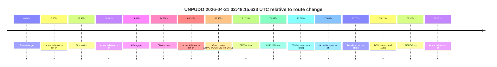
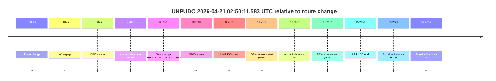
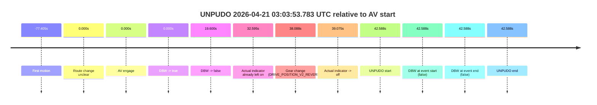
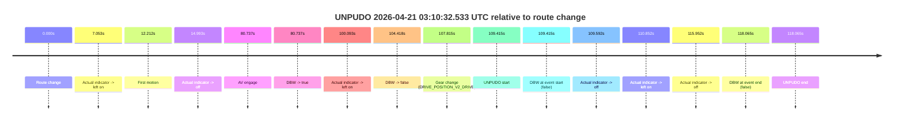
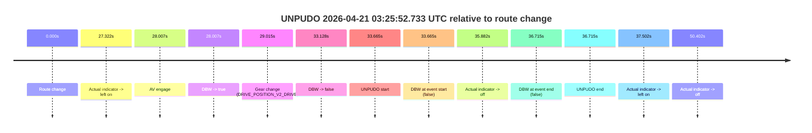
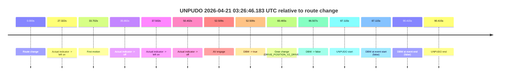
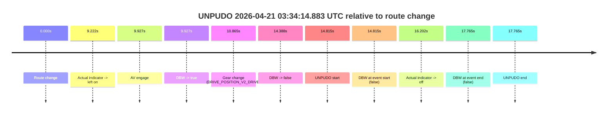

# Run Report: fme10005/2026-04-21--02-34-08--gen2-av-88814959-a959-438b-a1f8-52e6417ba36a

| Field | Value |
|---|---|
| Run ID | `fme10005/2026-04-21--02-34-08--gen2-av-88814959-a959-438b-a1f8-52e6417ba36a` |
| Date | `2026-04-21` |
| Model(s) | `pink-manta-ray-smooth` |
| Author | `guy.geva` |
| Event count | `8` |

## unpudo 2026-04-21 02:47:20.583 UTC

| Field | Value |
|---|---|
| Model | `pink-manta-ray-smooth` |
| Author | `guy.geva` |
| Run ID | `fme10005/2026-04-21--02-34-08--gen2-av-88814959-a959-438b-a1f8-52e6417ba36a` |
| Date | `2026-04-21` |
| Time (UTC) | `02:47:20.583` |
| Event type | `unpudo` |
| Disengagement type | `none observed` |
| Route change | `found` |
| Console | [run](https://console.sso.wayve.ai/run/fme10005/2026-04-21--02-34-08--gen2-av-88814959-a959-438b-a1f8-52e6417ba36a?id=&time-unixus=1776739640583306) |
| Foxglove | [segment](https://app.foxglove.dev/wayve-on-prem/p/prj_0dX18KZdVHg1fmmI/view?ds=foxglove-stream&ds.deviceName=fme10005&ds.start=2026-04-21T02%3A46%3A54.068242Z&ds.end=2026-04-21T02%3A47%3A35.933304Z&layoutId=lay_0e7VD4WIKDQGU73Y&time=2026-04-21T02%3A47%3A20.583306Z) |

### Event card: fail

- Fail: the credited unpudo does not stay AV-owned. The event window starts with DBW false, and the maneuver outcome lands outside a clean AV-owned segment.

| Event | Time (UTC) | Delta from route change |
|---|---:|---:|
| Route change | 2026-04-21 02:47:04.068 | `0.000s` |
| Actual indicator -> left on | 2026-04-21 02:47:10.870 | `6.802s` |
| AV engage | 2026-04-21 02:47:13.635 | `9.567s` |
| DBW -> true | 2026-04-21 02:47:13.635 | `9.567s` |
| Gear change (DRIVE_POSITION_V2_DRIVE) | 2026-04-21 02:47:14.783 | `10.715s` |
| DBW -> false | 2026-04-21 02:47:19.696 | `15.628s` |
| UNPUDO start | 2026-04-21 02:47:20.583 | `16.515s` |
| DBW at event start (false) | 2026-04-21 02:47:20.583 | `16.515s` |
| Actual indicator -> off | 2026-04-21 02:47:23.010 | `18.942s` |
| DBW at event end (false) | 2026-04-21 02:47:25.933 | `21.865s` |
| UNPUDO end | 2026-04-21 02:47:25.933 | `21.865s` |

| Metric | Value |
|---|---|
| Outcome | `fail` |
| Effective failure type | `not_av_owned` |
| Route change status | `found` |
| DBW at event start | `false` |
| DBW at event end | `false` |
| Predicted gear at AV start | `DRIVE_POSITION_V2_PARK` |
| Actual gear at AV start | `DRIVE_POSITION_V2_PARK` |
| Predicted gear at event start | `DRIVE_POSITION_V2_DRIVE` |
| Actual gear at event start | `DRIVE_POSITION_V2_DRIVE` |
| Planned indicator direction | `INDICATORS_STATE_V2_LEFT_ON` |
| Controller indicator direction | `INDICATORS_STATE_V2_LEFT_ON` |
| Actual indicator direction | `INDICATORS_STATE_V2_LEFT_ON` |
| Actual indicator at maneuver end | `INDICATORS_STATE_V2_OFF` |
| Driver accel help in AV | `false` |
| Driver accel help timestamp | `n/a` |
| Max accel pedal pct in AV | `0.0%` |
| Max brake pedal pct in AV | `11.4%` |
| Max speed mps in AV | `0.000` |
| Success timing baseline | `route change` |
| Route -> AV | `9.567s` |
| AV -> event start | `6.948s` |
| AV -> first motion | `n/a` |
| Success baseline -> event start | `16.515s` |
| Success baseline -> first motion | `n/a` |
| AV duration before disengagement | `6.061s` |
| Trajectory waypoint count | `36` |
| Driving-plan step count | `11` |

The scored portion starts from the AV-owned window, not from the pre-AV setup. Route-change search in the stopped pre-event segment was `found`, with the baseline therefore set to route change. At the event anchor the model predicts `DRIVE_POSITION_V2_DRIVE` and the actual gear is `DRIVE_POSITION_V2_DRIVE`. The effective model outcome is `fail` because `not_av_owned.`

### Resolution

| Field | Value |
|---|---|
| Final outcome | `fail` |
| Do we agree with this label? | `yes` |
| Source disengagement type | `none observed` |
| Resolved effective failure type | `not_av_owned` |
| Confidence | `high` |

## unpudo 2026-04-21 02:48:15.633 UTC

| Field | Value |
|---|---|
| Model | `pink-manta-ray-smooth` |
| Author | `guy.geva` |
| Run ID | `fme10005/2026-04-21--02-34-08--gen2-av-88814959-a959-438b-a1f8-52e6417ba36a` |
| Date | `2026-04-21` |
| Time (UTC) | `02:48:15.633` |
| Event type | `unpudo` |
| Disengagement type | `none observed` |
| Route change | `found` |
| Console | [run](https://console.sso.wayve.ai/run/fme10005/2026-04-21--02-34-08--gen2-av-88814959-a959-438b-a1f8-52e6417ba36a?id=&time-unixus=1776739695633306) |
| Foxglove | [segment](https://app.foxglove.dev/wayve-on-prem/p/prj_0dX18KZdVHg1fmmI/view?ds=foxglove-stream&ds.deviceName=fme10005&ds.start=2026-04-21T02%3A46%3A54.068242Z&ds.end=2026-04-21T02%3A48%3A29.183316Z&layoutId=lay_0e7VD4WIKDQGU73Y&time=2026-04-21T02%3A48%3A15.633306Z) |

### Event card: fail

- Fail: the credited unpudo does not stay AV-owned. The event window starts with DBW false, and the maneuver outcome lands outside a clean AV-owned segment.

| Event | Time (UTC) | Delta from route change |
|---|---:|---:|
| Route change | 2026-04-21 02:47:04.068 | `0.000s` |
| Actual indicator -> left on | 2026-04-21 02:47:10.870 | `6.802s` |
| First motion | 2026-04-21 02:47:20.630 | `16.562s` |
| Actual indicator -> off | 2026-04-21 02:47:23.010 | `18.942s` |
| AV engage | 2026-04-21 02:47:28.896 | `24.828s` |
| DBW -> true | 2026-04-21 02:47:28.896 | `24.828s` |
| Actual indicator -> left on | 2026-04-21 02:48:09.390 | `65.322s` |
| Gear change (DRIVE_POSITION_V2_DRIVE) | 2026-04-21 02:48:10.533 | `66.465s` |
| DBW -> false | 2026-04-21 02:48:15.195 | `71.128s` |
| UNPUDO start | 2026-04-21 02:48:15.633 | `71.565s` |
| DBW at event start (false) | 2026-04-21 02:48:15.633 | `71.565s` |
| Actual indicator -> off | 2026-04-21 02:48:16.150 | `72.082s` |
| Actual indicator -> left on | 2026-04-21 02:48:19.070 | `75.002s` |
| DBW at event end (false) | 2026-04-21 02:48:19.183 | `75.115s` |
| UNPUDO end | 2026-04-21 02:48:19.183 | `75.115s` |
| Actual indicator -> off | 2026-04-21 02:48:24.690 | `80.622s` |

| Metric | Value |
|---|---|
| Outcome | `fail` |
| Effective failure type | `completed_outside_av` |
| Route change status | `found` |
| DBW at event start | `false` |
| DBW at event end | `false` |
| Predicted gear at AV start | `DRIVE_POSITION_V2_DRIVE` |
| Actual gear at AV start | `DRIVE_POSITION_V2_DRIVE` |
| Predicted gear at event start | `DRIVE_POSITION_V2_DRIVE` |
| Actual gear at event start | `DRIVE_POSITION_V2_DRIVE` |
| Planned indicator direction | `INDICATORS_STATE_V2_LEFT_ON` |
| Controller indicator direction | `INDICATORS_STATE_V2_LEFT_ON` |
| Actual indicator direction | `INDICATORS_STATE_V2_LEFT_ON` |
| Actual indicator at maneuver end | `INDICATORS_STATE_V2_LEFT_ON` |
| Driver accel help in AV | `false` |
| Driver accel help timestamp | `n/a` |
| Max accel pedal pct in AV | `0.0%` |
| Max brake pedal pct in AV | `12.9%` |
| Max speed mps in AV | `11.806` |
| Success timing baseline | `route change` |
| Route -> AV | `24.828s` |
| AV -> event start | `46.737s` |
| AV -> first motion | `-8.266s` |
| Success baseline -> event start | `71.565s` |
| Success baseline -> first motion | `16.562s` |
| AV duration before disengagement | `46.299s` |
| Trajectory waypoint count | `35` |
| Driving-plan step count | `11` |

The scored portion starts from the AV-owned window, not from the pre-AV setup. Route-change search in the stopped pre-event segment was `found`, with the baseline therefore set to route change. At the event anchor the model predicts `DRIVE_POSITION_V2_DRIVE` and the actual gear is `DRIVE_POSITION_V2_DRIVE`. The effective model outcome is `fail` because `completed_outside_av.`

### Resolution

| Field | Value |
|---|---|
| Final outcome | `fail` |
| Do we agree with this label? | `yes` |
| Source disengagement type | `none observed` |
| Resolved effective failure type | `completed_outside_av` |
| Confidence | `high` |

## unpudo 2026-04-21 02:50:11.583 UTC

| Field | Value |
|---|---|
| Model | `pink-manta-ray-smooth` |
| Author | `guy.geva` |
| Run ID | `fme10005/2026-04-21--02-34-08--gen2-av-88814959-a959-438b-a1f8-52e6417ba36a` |
| Date | `2026-04-21` |
| Time (UTC) | `02:50:11.583` |
| Event type | `unpudo` |
| Disengagement type | `none observed` |
| Route change | `found` |
| Console | [run](https://console.sso.wayve.ai/run/fme10005/2026-04-21--02-34-08--gen2-av-88814959-a959-438b-a1f8-52e6417ba36a?id=&time-unixus=1776739811583307) |
| Foxglove | [segment](https://app.foxglove.dev/wayve-on-prem/p/prj_0dX18KZdVHg1fmmI/view?ds=foxglove-stream&ds.deviceName=fme10005&ds.start=2026-04-21T02%3A49%3A49.868272Z&ds.end=2026-04-21T02%3A50%3A25.083313Z&layoutId=lay_0e7VD4WIKDQGU73Y&time=2026-04-21T02%3A50%3A11.583307Z) |

### Event card: fail

- Fail: the credited unpudo does not stay AV-owned. The event window starts with DBW false, and the maneuver outcome lands outside a clean AV-owned segment.

| Event | Time (UTC) | Delta from route change |
|---|---:|---:|
| Route change | 2026-04-21 02:49:59.868 | `0.000s` |
| AV engage | 2026-04-21 02:49:59.875 | `0.007s` |
| DBW -> true | 2026-04-21 02:49:59.875 | `0.007s` |
| Actual indicator -> left on | 2026-04-21 02:50:05.650 | `5.782s` |
| Gear change (DRIVE_POSITION_V2_DRIVE) | 2026-04-21 02:50:06.483 | `6.615s` |
| DBW -> false | 2026-04-21 02:50:10.796 | `10.928s` |
| UNPUDO start | 2026-04-21 02:50:11.583 | `11.715s` |
| DBW at event start (false) | 2026-04-21 02:50:11.583 | `11.715s` |
| Actual indicator -> off | 2026-04-21 02:50:13.530 | `13.662s` |
| DBW at event end (false) | 2026-04-21 02:50:15.083 | `15.215s` |
| UNPUDO end | 2026-04-21 02:50:15.083 | `15.215s` |
| Actual indicator -> left on | 2026-04-21 02:50:28.150 | `28.282s` |
| Actual indicator -> off | 2026-04-21 02:50:32.291 | `32.423s` |

| Metric | Value |
|---|---|
| Outcome | `fail` |
| Effective failure type | `not_av_owned` |
| Route change status | `found` |
| DBW at event start | `false` |
| DBW at event end | `false` |
| Predicted gear at AV start | `DRIVE_POSITION_V2_PARK` |
| Actual gear at AV start | `DRIVE_POSITION_V2_PARK` |
| Predicted gear at event start | `DRIVE_POSITION_V2_DRIVE` |
| Actual gear at event start | `DRIVE_POSITION_V2_DRIVE` |
| Planned indicator direction | `INDICATORS_STATE_V2_RIGHT_ON` |
| Controller indicator direction | `INDICATORS_STATE_V2_RIGHT_ON` |
| Actual indicator direction | `INDICATORS_STATE_V2_LEFT_ON` |
| Actual indicator at maneuver end | `INDICATORS_STATE_V2_OFF` |
| Driver accel help in AV | `false` |
| Driver accel help timestamp | `n/a` |
| Max accel pedal pct in AV | `0.0%` |
| Max brake pedal pct in AV | `16.9%` |
| Max speed mps in AV | `0.000` |
| Success timing baseline | `route change` |
| Route -> AV | `0.007s` |
| AV -> event start | `11.708s` |
| AV -> first motion | `n/a` |
| Success baseline -> event start | `11.715s` |
| Success baseline -> first motion | `n/a` |
| AV duration before disengagement | `10.921s` |
| Trajectory waypoint count | `36` |
| Driving-plan step count | `11` |

The scored portion starts from the AV-owned window, not from the pre-AV setup. Route-change search in the stopped pre-event segment was `found`, with the baseline therefore set to route change. At the event anchor the model predicts `DRIVE_POSITION_V2_DRIVE` and the actual gear is `DRIVE_POSITION_V2_DRIVE`. The effective model outcome is `fail` because `not_av_owned.`

### Resolution

| Field | Value |
|---|---|
| Final outcome | `fail` |
| Do we agree with this label? | `yes` |
| Source disengagement type | `none observed` |
| Resolved effective failure type | `not_av_owned` |
| Confidence | `high` |

## unpudo 2026-04-21 03:03:53.783 UTC

| Field | Value |
|---|---|
| Model | `pink-manta-ray-smooth` |
| Author | `guy.geva` |
| Run ID | `fme10005/2026-04-21--02-34-08--gen2-av-88814959-a959-438b-a1f8-52e6417ba36a` |
| Date | `2026-04-21` |
| Time (UTC) | `03:03:53.783` |
| Event type | `unpudo` |
| Disengagement type | `none observed` |
| Route change | `unclear` |
| Console | [run](https://console.sso.wayve.ai/run/fme10005/2026-04-21--02-34-08--gen2-av-88814959-a959-438b-a1f8-52e6417ba36a?id=&time-unixus=1776740633783314) |
| Foxglove | [segment](https://app.foxglove.dev/wayve-on-prem/p/prj_0dX18KZdVHg1fmmI/view?ds=foxglove-stream&ds.deviceName=fme10005&ds.start=2026-04-21T03%3A03%3A01.195564Z&ds.end=2026-04-21T03%3A04%3A03.783314Z&layoutId=lay_0e7VD4WIKDQGU73Y&time=2026-04-21T03%3A03%3A53.783314Z) |

### Event card: fail

- Fail: the credited unpudo does not stay AV-owned. The event window starts with DBW false, and the maneuver outcome lands outside a clean AV-owned segment.

| Event | Time (UTC) | Delta from AV start |
|---|---:|---:|
| First motion | 2026-04-21 03:01:53.790 | `-77.405s` |
| Route change unclear | 2026-04-21 03:03:11.195 | `0.000s` |
| AV engage | 2026-04-21 03:03:11.195 | `0.000s` |
| DBW -> true | 2026-04-21 03:03:11.195 | `0.000s` |
| DBW -> false | 2026-04-21 03:03:30.795 | `19.600s` |
| Actual indicator already left on | 2026-04-21 03:03:43.790 | `32.595s` |
| Gear change (DRIVE_POSITION_V2_REVERSE) | 2026-04-21 03:03:49.283 | `38.088s` |
| Actual indicator -> off | 2026-04-21 03:03:50.270 | `39.075s` |
| UNPUDO start | 2026-04-21 03:03:53.783 | `42.588s` |
| DBW at event start (false) | 2026-04-21 03:03:53.783 | `42.588s` |
| DBW at event end (false) | 2026-04-21 03:03:53.783 | `42.588s` |
| UNPUDO end | 2026-04-21 03:03:53.783 | `42.588s` |

| Metric | Value |
|---|---|
| Outcome | `fail` |
| Effective failure type | `completed_outside_av` |
| Route change status | `unclear` |
| DBW at event start | `false` |
| DBW at event end | `false` |
| Predicted gear at AV start | `DRIVE_POSITION_V2_DRIVE` |
| Actual gear at AV start | `DRIVE_POSITION_V2_DRIVE` |
| Predicted gear at event start | `DRIVE_POSITION_V2_REVERSE` |
| Actual gear at event start | `DRIVE_POSITION_V2_REVERSE` |
| Planned indicator direction | `INDICATORS_STATE_V2_OFF` |
| Controller indicator direction | `INDICATORS_STATE_V2_OFF` |
| Actual indicator direction | `INDICATORS_STATE_V2_OFF` |
| Actual indicator at maneuver end | `INDICATORS_STATE_V2_OFF` |
| Driver accel help in AV | `false` |
| Driver accel help timestamp | `n/a` |
| Max accel pedal pct in AV | `0.0%` |
| Max brake pedal pct in AV | `10.2%` |
| Max speed mps in AV | `11.883` |
| Success timing baseline | `AV start` |
| Route -> AV | `n/a` |
| AV -> event start | `42.588s` |
| AV -> first motion | `-77.405s` |
| Success baseline -> event start | `42.588s` |
| Success baseline -> first motion | `-77.405s` |
| AV duration before disengagement | `19.600s` |
| Trajectory waypoint count | `36` |
| Driving-plan step count | `11` |

The scored portion starts from the AV-owned window, not from the pre-AV setup. Route-change search in the stopped pre-event segment was `unclear`, with the baseline therefore set to AV start. At the event anchor the model predicts `DRIVE_POSITION_V2_REVERSE` and the actual gear is `DRIVE_POSITION_V2_REVERSE`. The effective model outcome is `fail` because `completed_outside_av.`

### Resolution

| Field | Value |
|---|---|
| Final outcome | `fail` |
| Do we agree with this label? | `yes` |
| Source disengagement type | `none observed` |
| Resolved effective failure type | `completed_outside_av` |
| Confidence | `medium` |

## unpudo 2026-04-21 03:10:32.533 UTC

| Field | Value |
|---|---|
| Model | `pink-manta-ray-smooth` |
| Author | `guy.geva` |
| Run ID | `fme10005/2026-04-21--02-34-08--gen2-av-88814959-a959-438b-a1f8-52e6417ba36a` |
| Date | `2026-04-21` |
| Time (UTC) | `03:10:32.533` |
| Event type | `unpudo` |
| Disengagement type | `none observed` |
| Route change | `found` |
| Console | [run](https://console.sso.wayve.ai/run/fme10005/2026-04-21--02-34-08--gen2-av-88814959-a959-438b-a1f8-52e6417ba36a?id=&time-unixus=1776741032533304) |
| Foxglove | [segment](https://app.foxglove.dev/wayve-on-prem/p/prj_0dX18KZdVHg1fmmI/view?ds=foxglove-stream&ds.deviceName=fme10005&ds.start=2026-04-21T03%3A08%3A33.118232Z&ds.end=2026-04-21T03%3A10%3A51.183304Z&layoutId=lay_0e7VD4WIKDQGU73Y&time=2026-04-21T03%3A10%3A32.533304Z) |

### Event card: fail

- Fail: the credited unpudo does not stay AV-owned. The event window starts with DBW false, and the maneuver outcome lands outside a clean AV-owned segment.

| Event | Time (UTC) | Delta from route change |
|---|---:|---:|
| Route change | 2026-04-21 03:08:43.118 | `0.000s` |
| Actual indicator -> left on | 2026-04-21 03:08:50.170 | `7.053s` |
| First motion | 2026-04-21 03:08:55.330 | `12.212s` |
| Actual indicator -> off | 2026-04-21 03:08:58.110 | `14.993s` |
| AV engage | 2026-04-21 03:10:03.855 | `80.737s` |
| DBW -> true | 2026-04-21 03:10:03.855 | `80.737s` |
| Actual indicator -> left on | 2026-04-21 03:10:23.210 | `100.093s` |
| DBW -> false | 2026-04-21 03:10:27.535 | `104.418s` |
| Gear change (DRIVE_POSITION_V2_DRIVE) | 2026-04-21 03:10:30.933 | `107.815s` |
| UNPUDO start | 2026-04-21 03:10:32.533 | `109.415s` |
| DBW at event start (false) | 2026-04-21 03:10:32.533 | `109.415s` |
| Actual indicator -> off | 2026-04-21 03:10:32.710 | `109.592s` |
| Actual indicator -> left on | 2026-04-21 03:10:33.970 | `110.852s` |
| Actual indicator -> off | 2026-04-21 03:10:39.070 | `115.952s` |
| DBW at event end (false) | 2026-04-21 03:10:41.183 | `118.065s` |
| UNPUDO end | 2026-04-21 03:10:41.183 | `118.065s` |

| Metric | Value |
|---|---|
| Outcome | `fail` |
| Effective failure type | `completed_outside_av` |
| Route change status | `found` |
| DBW at event start | `false` |
| DBW at event end | `false` |
| Predicted gear at AV start | `DRIVE_POSITION_V2_PARK` |
| Actual gear at AV start | `DRIVE_POSITION_V2_PARK` |
| Predicted gear at event start | `DRIVE_POSITION_V2_DRIVE` |
| Actual gear at event start | `DRIVE_POSITION_V2_DRIVE` |
| Planned indicator direction | `INDICATORS_STATE_V2_LEFT_ON` |
| Controller indicator direction | `INDICATORS_STATE_V2_LEFT_ON` |
| Actual indicator direction | `INDICATORS_STATE_V2_LEFT_ON` |
| Actual indicator at maneuver end | `INDICATORS_STATE_V2_OFF` |
| Driver accel help in AV | `false` |
| Driver accel help timestamp | `n/a` |
| Max accel pedal pct in AV | `0.0%` |
| Max brake pedal pct in AV | `12.9%` |
| Max speed mps in AV | `0.000` |
| Success timing baseline | `route change` |
| Route -> AV | `80.737s` |
| AV -> event start | `28.678s` |
| AV -> first motion | `-68.525s` |
| Success baseline -> event start | `109.415s` |
| Success baseline -> first motion | `12.212s` |
| AV duration before disengagement | `23.680s` |
| Trajectory waypoint count | `37` |
| Driving-plan step count | `11` |

The scored portion starts from the AV-owned window, not from the pre-AV setup. Route-change search in the stopped pre-event segment was `found`, with the baseline therefore set to route change. At the event anchor the model predicts `DRIVE_POSITION_V2_DRIVE` and the actual gear is `DRIVE_POSITION_V2_DRIVE`. The effective model outcome is `fail` because `completed_outside_av.`

### Resolution

| Field | Value |
|---|---|
| Final outcome | `fail` |
| Do we agree with this label? | `yes` |
| Source disengagement type | `none observed` |
| Resolved effective failure type | `completed_outside_av` |
| Confidence | `high` |

## unpudo 2026-04-21 03:25:52.733 UTC

| Field | Value |
|---|---|
| Model | `pink-manta-ray-smooth` |
| Author | `guy.geva` |
| Run ID | `fme10005/2026-04-21--02-34-08--gen2-av-88814959-a959-438b-a1f8-52e6417ba36a` |
| Date | `2026-04-21` |
| Time (UTC) | `03:25:52.733` |
| Event type | `unpudo` |
| Disengagement type | `none observed` |
| Route change | `found` |
| Console | [run](https://console.sso.wayve.ai/run/fme10005/2026-04-21--02-34-08--gen2-av-88814959-a959-438b-a1f8-52e6417ba36a?id=&time-unixus=1776741952733317) |
| Foxglove | [segment](https://app.foxglove.dev/wayve-on-prem/p/prj_0dX18KZdVHg1fmmI/view?ds=foxglove-stream&ds.deviceName=fme10005&ds.start=2026-04-21T03%3A25%3A09.068254Z&ds.end=2026-04-21T03%3A26%3A05.783292Z&layoutId=lay_0e7VD4WIKDQGU73Y&time=2026-04-21T03%3A25%3A52.733317Z) |

### Event card: fail

- Fail: the credited unpudo does not stay AV-owned. The event window starts with DBW false, and the maneuver outcome lands outside a clean AV-owned segment.

| Event | Time (UTC) | Delta from route change |
|---|---:|---:|
| Route change | 2026-04-21 03:25:19.068 | `0.000s` |
| Actual indicator -> left on | 2026-04-21 03:25:46.390 | `27.322s` |
| AV engage | 2026-04-21 03:25:47.075 | `28.007s` |
| DBW -> true | 2026-04-21 03:25:47.075 | `28.007s` |
| Gear change (DRIVE_POSITION_V2_DRIVE) | 2026-04-21 03:25:48.083 | `29.015s` |
| DBW -> false | 2026-04-21 03:25:52.196 | `33.128s` |
| UNPUDO start | 2026-04-21 03:25:52.733 | `33.665s` |
| DBW at event start (false) | 2026-04-21 03:25:52.733 | `33.665s` |
| Actual indicator -> off | 2026-04-21 03:25:54.950 | `35.882s` |
| DBW at event end (false) | 2026-04-21 03:25:55.783 | `36.715s` |
| UNPUDO end | 2026-04-21 03:25:55.783 | `36.715s` |
| Actual indicator -> left on | 2026-04-21 03:25:56.570 | `37.502s` |
| Actual indicator -> off | 2026-04-21 03:26:09.470 | `50.402s` |

| Metric | Value |
|---|---|
| Outcome | `fail` |
| Effective failure type | `not_av_owned` |
| Route change status | `found` |
| DBW at event start | `false` |
| DBW at event end | `false` |
| Predicted gear at AV start | `DRIVE_POSITION_V2_PARK` |
| Actual gear at AV start | `DRIVE_POSITION_V2_PARK` |
| Predicted gear at event start | `DRIVE_POSITION_V2_DRIVE` |
| Actual gear at event start | `DRIVE_POSITION_V2_DRIVE` |
| Planned indicator direction | `INDICATORS_STATE_V2_LEFT_ON` |
| Controller indicator direction | `INDICATORS_STATE_V2_LEFT_ON` |
| Actual indicator direction | `INDICATORS_STATE_V2_LEFT_ON` |
| Actual indicator at maneuver end | `INDICATORS_STATE_V2_OFF` |
| Driver accel help in AV | `false` |
| Driver accel help timestamp | `n/a` |
| Max accel pedal pct in AV | `0.0%` |
| Max brake pedal pct in AV | `8.1%` |
| Max speed mps in AV | `0.000` |
| Success timing baseline | `route change` |
| Route -> AV | `28.007s` |
| AV -> event start | `5.658s` |
| AV -> first motion | `n/a` |
| Success baseline -> event start | `33.665s` |
| Success baseline -> first motion | `n/a` |
| AV duration before disengagement | `5.121s` |
| Trajectory waypoint count | `35` |
| Driving-plan step count | `11` |

The scored portion starts from the AV-owned window, not from the pre-AV setup. Route-change search in the stopped pre-event segment was `found`, with the baseline therefore set to route change. At the event anchor the model predicts `DRIVE_POSITION_V2_DRIVE` and the actual gear is `DRIVE_POSITION_V2_DRIVE`. The effective model outcome is `fail` because `not_av_owned.`

### Resolution

| Field | Value |
|---|---|
| Final outcome | `fail` |
| Do we agree with this label? | `yes` |
| Source disengagement type | `none observed` |
| Resolved effective failure type | `not_av_owned` |
| Confidence | `high` |

## unpudo 2026-04-21 03:26:46.183 UTC

| Field | Value |
|---|---|
| Model | `pink-manta-ray-smooth` |
| Author | `guy.geva` |
| Run ID | `fme10005/2026-04-21--02-34-08--gen2-av-88814959-a959-438b-a1f8-52e6417ba36a` |
| Date | `2026-04-21` |
| Time (UTC) | `03:26:46.183` |
| Event type | `unpudo` |
| Disengagement type | `none observed` |
| Route change | `found` |
| Console | [run](https://console.sso.wayve.ai/run/fme10005/2026-04-21--02-34-08--gen2-av-88814959-a959-438b-a1f8-52e6417ba36a?id=&time-unixus=1776742006183318) |
| Foxglove | [segment](https://app.foxglove.dev/wayve-on-prem/p/prj_0dX18KZdVHg1fmmI/view?ds=foxglove-stream&ds.deviceName=fme10005&ds.start=2026-04-21T03%3A25%3A09.068254Z&ds.end=2026-04-21T03%3A26%3A59.483316Z&layoutId=lay_0e7VD4WIKDQGU73Y&time=2026-04-21T03%3A26%3A46.183318Z) |

### Event card: fail

- Fail: the credited unpudo does not stay AV-owned. The event window starts with DBW false, and the maneuver outcome lands outside a clean AV-owned segment.

| Event | Time (UTC) | Delta from route change |
|---|---:|---:|
| Route change | 2026-04-21 03:25:19.068 | `0.000s` |
| Actual indicator -> left on | 2026-04-21 03:25:46.390 | `27.322s` |
| First motion | 2026-04-21 03:25:52.770 | `33.702s` |
| Actual indicator -> off | 2026-04-21 03:25:54.950 | `35.882s` |
| Actual indicator -> left on | 2026-04-21 03:25:56.570 | `37.502s` |
| Actual indicator -> off | 2026-04-21 03:26:09.470 | `50.402s` |
| AV engage | 2026-04-21 03:26:11.576 | `52.509s` |
| DBW -> true | 2026-04-21 03:26:11.576 | `52.509s` |
| Gear change (DRIVE_POSITION_V2_DRIVE) | 2026-04-21 03:26:42.533 | `83.465s` |
| DBW -> false | 2026-04-21 03:26:45.575 | `86.507s` |
| UNPUDO start | 2026-04-21 03:26:46.183 | `87.115s` |
| DBW at event start (false) | 2026-04-21 03:26:46.183 | `87.115s` |
| DBW at event end (false) | 2026-04-21 03:26:49.483 | `90.415s` |
| UNPUDO end | 2026-04-21 03:26:49.483 | `90.415s` |

| Metric | Value |
|---|---|
| Outcome | `fail` |
| Effective failure type | `completed_outside_av` |
| Route change status | `found` |
| DBW at event start | `false` |
| DBW at event end | `false` |
| Predicted gear at AV start | `DRIVE_POSITION_V2_DRIVE` |
| Actual gear at AV start | `DRIVE_POSITION_V2_DRIVE` |
| Predicted gear at event start | `DRIVE_POSITION_V2_DRIVE` |
| Actual gear at event start | `DRIVE_POSITION_V2_DRIVE` |
| Planned indicator direction | `INDICATORS_STATE_V2_LEFT_ON` |
| Controller indicator direction | `INDICATORS_STATE_V2_LEFT_ON` |
| Actual indicator direction | `INDICATORS_STATE_V2_OFF` |
| Actual indicator at maneuver end | `INDICATORS_STATE_V2_OFF` |
| Driver accel help in AV | `false` |
| Driver accel help timestamp | `n/a` |
| Max accel pedal pct in AV | `0.0%` |
| Max brake pedal pct in AV | `9.8%` |
| Max speed mps in AV | `4.581` |
| Success timing baseline | `route change` |
| Route -> AV | `52.509s` |
| AV -> event start | `34.606s` |
| AV -> first motion | `-18.806s` |
| Success baseline -> event start | `87.115s` |
| Success baseline -> first motion | `33.702s` |
| AV duration before disengagement | `33.999s` |
| Trajectory waypoint count | `36` |
| Driving-plan step count | `11` |

The scored portion starts from the AV-owned window, not from the pre-AV setup. Route-change search in the stopped pre-event segment was `found`, with the baseline therefore set to route change. At the event anchor the model predicts `DRIVE_POSITION_V2_DRIVE` and the actual gear is `DRIVE_POSITION_V2_DRIVE`. The effective model outcome is `fail` because `completed_outside_av.`

### Resolution

| Field | Value |
|---|---|
| Final outcome | `fail` |
| Do we agree with this label? | `yes` |
| Source disengagement type | `none observed` |
| Resolved effective failure type | `completed_outside_av` |
| Confidence | `high` |

## unpudo 2026-04-21 03:34:14.883 UTC

| Field | Value |
|---|---|
| Model | `pink-manta-ray-smooth` |
| Author | `guy.geva` |
| Run ID | `fme10005/2026-04-21--02-34-08--gen2-av-88814959-a959-438b-a1f8-52e6417ba36a` |
| Date | `2026-04-21` |
| Time (UTC) | `03:34:14.883` |
| Event type | `unpudo` |
| Disengagement type | `none observed` |
| Route change | `found` |
| Console | [run](https://console.sso.wayve.ai/run/fme10005/2026-04-21--02-34-08--gen2-av-88814959-a959-438b-a1f8-52e6417ba36a?id=&time-unixus=1776742454883303) |
| Foxglove | [segment](https://app.foxglove.dev/wayve-on-prem/p/prj_0dX18KZdVHg1fmmI/view?ds=foxglove-stream&ds.deviceName=fme10005&ds.start=2026-04-21T03%3A33%3A50.068245Z&ds.end=2026-04-21T03%3A34%3A27.833304Z&layoutId=lay_0e7VD4WIKDQGU73Y&time=2026-04-21T03%3A34%3A14.883303Z) |

### Event card: fail

- Fail: the credited unpudo does not stay AV-owned. The event window starts with DBW false, and the maneuver outcome lands outside a clean AV-owned segment.

| Event | Time (UTC) | Delta from route change |
|---|---:|---:|
| Route change | 2026-04-21 03:34:00.068 | `0.000s` |
| Actual indicator -> left on | 2026-04-21 03:34:09.290 | `9.222s` |
| AV engage | 2026-04-21 03:34:09.995 | `9.927s` |
| DBW -> true | 2026-04-21 03:34:09.995 | `9.927s` |
| Gear change (DRIVE_POSITION_V2_DRIVE) | 2026-04-21 03:34:10.933 | `10.865s` |
| DBW -> false | 2026-04-21 03:34:14.456 | `14.388s` |
| UNPUDO start | 2026-04-21 03:34:14.883 | `14.815s` |
| DBW at event start (false) | 2026-04-21 03:34:14.883 | `14.815s` |
| Actual indicator -> off | 2026-04-21 03:34:16.270 | `16.202s` |
| DBW at event end (false) | 2026-04-21 03:34:17.833 | `17.765s` |
| UNPUDO end | 2026-04-21 03:34:17.833 | `17.765s` |

| Metric | Value |
|---|---|
| Outcome | `fail` |
| Effective failure type | `not_av_owned` |
| Route change status | `found` |
| DBW at event start | `false` |
| DBW at event end | `false` |
| Predicted gear at AV start | `DRIVE_POSITION_V2_PARK` |
| Actual gear at AV start | `DRIVE_POSITION_V2_PARK` |
| Predicted gear at event start | `DRIVE_POSITION_V2_DRIVE` |
| Actual gear at event start | `DRIVE_POSITION_V2_DRIVE` |
| Planned indicator direction | `INDICATORS_STATE_V2_LEFT_ON` |
| Controller indicator direction | `INDICATORS_STATE_V2_LEFT_ON` |
| Actual indicator direction | `INDICATORS_STATE_V2_LEFT_ON` |
| Actual indicator at maneuver end | `INDICATORS_STATE_V2_OFF` |
| Driver accel help in AV | `false` |
| Driver accel help timestamp | `n/a` |
| Max accel pedal pct in AV | `0.0%` |
| Max brake pedal pct in AV | `8.0%` |
| Max speed mps in AV | `0.000` |
| Success timing baseline | `route change` |
| Route -> AV | `9.927s` |
| AV -> event start | `4.888s` |
| AV -> first motion | `n/a` |
| Success baseline -> event start | `14.815s` |
| Success baseline -> first motion | `n/a` |
| AV duration before disengagement | `4.460s` |
| Trajectory waypoint count | `36` |
| Driving-plan step count | `11` |

The scored portion starts from the AV-owned window, not from the pre-AV setup. Route-change search in the stopped pre-event segment was `found`, with the baseline therefore set to route change. At the event anchor the model predicts `DRIVE_POSITION_V2_DRIVE` and the actual gear is `DRIVE_POSITION_V2_DRIVE`. The effective model outcome is `fail` because `not_av_owned.`

### Resolution

| Field | Value |
|---|---|
| Final outcome | `fail` |
| Do we agree with this label? | `yes` |
| Source disengagement type | `none observed` |
| Resolved effective failure type | `not_av_owned` |
| Confidence | `high` |
