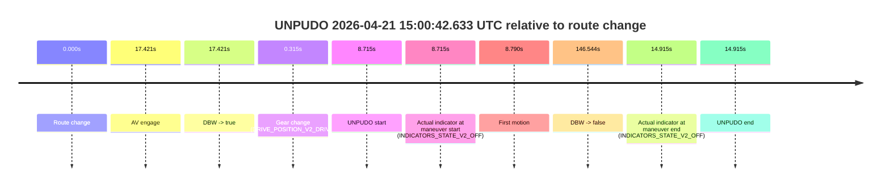
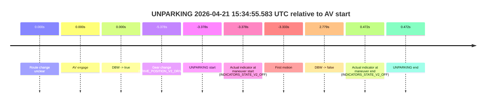
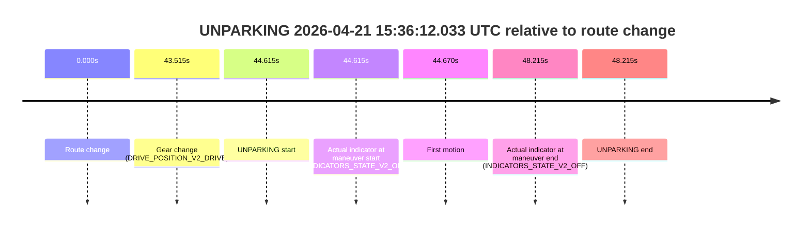

# Run Report: fme10005/2026-04-21--13-43-21--gen2-av-4caaaf56-00d1-40eb-91de-0dec2298bc2d

| Field | Value |
|---|---|
| Run ID | `fme10005/2026-04-21--13-43-21--gen2-av-4caaaf56-00d1-40eb-91de-0dec2298bc2d` |
| Date | `2026-04-21` |
| Model(s) | `blue-panther-solid` |
| Author | `guy.geva` |
| Event count | `6` |

## unpudo 2026-04-21 14:49:29.733 UTC

| Field | Value |
|---|---|
| Model | `blue-panther-solid` |
| Author | `guy.geva` |
| Run ID | `fme10005/2026-04-21--13-43-21--gen2-av-4caaaf56-00d1-40eb-91de-0dec2298bc2d` |
| Date | `2026-04-21` |
| Time (UTC) | `14:49:29.733` |
| Event type | `unpudo` |
| Disengagement type | `none observed` |
| Route change | `found` |
| Console | [run](https://console.sso.wayve.ai/run/fme10005/2026-04-21--13-43-21--gen2-av-4caaaf56-00d1-40eb-91de-0dec2298bc2d?id=&time-unixus=1776782969733309) |
| Foxglove | [segment](https://app.foxglove.dev/wayve-on-prem/p/prj_0dX18KZdVHg1fmmI/view?ds=foxglove-stream&ds.deviceName=fme10005&ds.start=2026-04-21T14%3A49%3A16.218329Z&ds.end=2026-04-21T14%3A55%3A54.860335Z&layoutId=lay_0e7VD4WIKDQGU73Y&time=2026-04-21T14%3A49%3A29.733309Z) |

### Event card: fail

- Fail: the credited unpudo does not stay AV-owned. The event window starts with DBW false, and the maneuver outcome lands outside a clean AV-owned segment.

| Event | Time (UTC) | Delta from route change |
|---|---:|---:|
| Route change | 2026-04-21 14:49:26.218 | `0.000s` |
| AV engage | 2026-04-21 14:49:37.070 | `10.853s` |
| DBW -> true | 2026-04-21 14:49:37.070 | `10.853s` |
| Gear change (DRIVE_POSITION_V2_DRIVE) | 2026-04-21 14:49:27.183 | `0.965s` |
| UNPUDO start | 2026-04-21 14:49:29.733 | `3.515s` |
| Actual indicator at maneuver start (INDICATORS_STATE_V2_LEFT_ON) | 2026-04-21 14:49:29.733 | `3.515s` |
| First motion | 2026-04-21 14:49:29.748 | `3.530s` |
| DBW -> false | 2026-04-21 14:55:44.860 | `378.642s` |
| Actual indicator at maneuver end (INDICATORS_STATE_V2_OFF) | 2026-04-21 14:49:34.083 | `7.865s` |
| UNPUDO end | 2026-04-21 14:49:34.083 | `7.865s` |

| Metric | Value |
|---|---|
| Outcome | `fail` |
| Effective failure type | `completed_outside_av` |
| Route change status | `found` |
| DBW at event start | `false` |
| DBW at event end | `false` |
| Predicted gear at AV start | `DRIVE_POSITION_V2_DRIVE` |
| Actual gear at AV start | `DRIVE_POSITION_V2_DRIVE` |
| Predicted gear at event start | `DRIVE_POSITION_V2_DRIVE` |
| Actual gear at event start | `DRIVE_POSITION_V2_DRIVE` |
| Planned indicator direction | `INDICATORS_STATE_V2_LEFT_ON` |
| Controller indicator direction | `INDICATORS_STATE_V2_LEFT_ON` |
| Actual indicator direction | `INDICATORS_STATE_V2_LEFT_ON` |
| Actual indicator at maneuver end | `INDICATORS_STATE_V2_OFF` |
| Driver accel help in AV | `false` |
| Driver accel help timestamp | `n/a` |
| Max accel pedal pct in AV | `0.0%` |
| Max brake pedal pct in AV | `0.0%` |
| Max speed mps in AV | `0.000` |
| Route -> AV | `10.853s` |
| AV -> event start | `-7.338s` |
| AV -> first motion | `-7.323s` |
| AV duration before disengagement | `367.789s` |
| Trajectory waypoint count | `36` |
| Driving-plan step count | `11` |

The scored portion starts from the AV-owned window, not from the pre-AV setup. Route-change search in the stopped pre-event segment was `found`, with the baseline therefore set to route change. At the event anchor the model predicts `DRIVE_POSITION_V2_DRIVE` and the actual gear is `DRIVE_POSITION_V2_DRIVE`. The effective model outcome is `fail` because `completed_outside_av`.

### Resolution

| Field | Value |
|---|---|
| Final outcome | `fail` |
| Do we agree with this label? | `yes` |
| Source disengagement type | `none observed` |
| Resolved effective failure type | `completed_outside_av` |
| Confidence | `high` |

## unpudo 2026-04-21 15:00:42.633 UTC

| Field | Value |
|---|---|
| Model | `blue-panther-solid` |
| Author | `guy.geva` |
| Run ID | `fme10005/2026-04-21--13-43-21--gen2-av-4caaaf56-00d1-40eb-91de-0dec2298bc2d` |
| Date | `2026-04-21` |
| Time (UTC) | `15:00:42.633` |
| Event type | `unpudo` |
| Disengagement type | `none observed` |
| Route change | `found` |
| Console | [run](https://console.sso.wayve.ai/run/fme10005/2026-04-21--13-43-21--gen2-av-4caaaf56-00d1-40eb-91de-0dec2298bc2d?id=&time-unixus=1776783642633310) |
| Foxglove | [segment](https://app.foxglove.dev/wayve-on-prem/p/prj_0dX18KZdVHg1fmmI/view?ds=foxglove-stream&ds.deviceName=fme10005&ds.start=2026-04-21T15%3A00%3A23.918241Z&ds.end=2026-04-21T15%3A03%3A10.462603Z&layoutId=lay_0e7VD4WIKDQGU73Y&time=2026-04-21T15%3A00%3A42.633310Z) |

### Event card: fail

- Fail: the credited unpudo does not stay AV-owned. The event window starts with DBW false, and the maneuver outcome lands outside a clean AV-owned segment.

| Event | Time (UTC) | Delta from route change |
|---|---:|---:|
| Route change | 2026-04-21 15:00:33.918 | `0.000s` |
| AV engage | 2026-04-21 15:00:51.339 | `17.421s` |
| DBW -> true | 2026-04-21 15:00:51.339 | `17.421s` |
| Gear change (DRIVE_POSITION_V2_DRIVE) | 2026-04-21 15:00:34.233 | `0.315s` |
| UNPUDO start | 2026-04-21 15:00:42.633 | `8.715s` |
| Actual indicator at maneuver start (INDICATORS_STATE_V2_OFF) | 2026-04-21 15:00:42.633 | `8.715s` |
| First motion | 2026-04-21 15:00:42.708 | `8.790s` |
| DBW -> false | 2026-04-21 15:03:00.462 | `146.544s` |
| Actual indicator at maneuver end (INDICATORS_STATE_V2_OFF) | 2026-04-21 15:00:48.833 | `14.915s` |
| UNPUDO end | 2026-04-21 15:00:48.833 | `14.915s` |

| Metric | Value |
|---|---|
| Outcome | `fail` |
| Effective failure type | `completed_outside_av` |
| Route change status | `found` |
| DBW at event start | `false` |
| DBW at event end | `false` |
| Predicted gear at AV start | `DRIVE_POSITION_V2_DRIVE` |
| Actual gear at AV start | `DRIVE_POSITION_V2_DRIVE` |
| Predicted gear at event start | `DRIVE_POSITION_V2_DRIVE` |
| Actual gear at event start | `DRIVE_POSITION_V2_DRIVE` |
| Planned indicator direction | `INDICATORS_STATE_V2_OFF` |
| Controller indicator direction | `INDICATORS_STATE_V2_OFF` |
| Actual indicator direction | `INDICATORS_STATE_V2_OFF` |
| Actual indicator at maneuver end | `INDICATORS_STATE_V2_OFF` |
| Driver accel help in AV | `false` |
| Driver accel help timestamp | `n/a` |
| Max accel pedal pct in AV | `0.0%` |
| Max brake pedal pct in AV | `0.0%` |
| Max speed mps in AV | `0.000` |
| Route -> AV | `17.421s` |
| AV -> event start | `-8.706s` |
| AV -> first motion | `-8.632s` |
| AV duration before disengagement | `129.123s` |
| Trajectory waypoint count | `36` |
| Driving-plan step count | `11` |

The scored portion starts from the AV-owned window, not from the pre-AV setup. Route-change search in the stopped pre-event segment was `found`, with the baseline therefore set to route change. At the event anchor the model predicts `DRIVE_POSITION_V2_DRIVE` and the actual gear is `DRIVE_POSITION_V2_DRIVE`. The effective model outcome is `fail` because `completed_outside_av`.

### Resolution

| Field | Value |
|---|---|
| Final outcome | `fail` |
| Do we agree with this label? | `yes` |
| Source disengagement type | `none observed` |
| Resolved effective failure type | `completed_outside_av` |
| Confidence | `high` |

## unpudo 2026-04-21 15:29:03.933 UTC

| Field | Value |
|---|---|
| Model | `blue-panther-solid` |
| Author | `guy.geva` |
| Run ID | `fme10005/2026-04-21--13-43-21--gen2-av-4caaaf56-00d1-40eb-91de-0dec2298bc2d` |
| Date | `2026-04-21` |
| Time (UTC) | `15:29:03.933` |
| Event type | `unpudo` |
| Disengagement type | `none observed` |
| Route change | `found` |
| Console | [run](https://console.sso.wayve.ai/run/fme10005/2026-04-21--13-43-21--gen2-av-4caaaf56-00d1-40eb-91de-0dec2298bc2d?id=&time-unixus=1776785343933291) |
| Foxglove | [segment](https://app.foxglove.dev/wayve-on-prem/p/prj_0dX18KZdVHg1fmmI/view?ds=foxglove-stream&ds.deviceName=fme10005&ds.start=2026-04-21T15%3A28%3A46.668218Z&ds.end=2026-04-21T15%3A31%3A42.300529Z&layoutId=lay_0e7VD4WIKDQGU73Y&time=2026-04-21T15%3A29%3A03.933291Z) |

### Event card: fail

- Fail: the credited unpudo does not stay AV-owned. The event window starts with DBW false, and the maneuver outcome lands outside a clean AV-owned segment.

| Event | Time (UTC) | Delta from route change |
|---|---:|---:|
| Route change | 2026-04-21 15:28:56.668 | `0.000s` |
| AV engage | 2026-04-21 15:29:14.600 | `17.933s` |
| DBW -> true | 2026-04-21 15:29:14.600 | `17.933s` |
| Gear change (DRIVE_POSITION_V2_REVERSE) | 2026-04-21 15:28:58.683 | `2.015s` |
| UNPUDO start | 2026-04-21 15:29:03.933 | `7.265s` |
| Actual indicator at maneuver start (INDICATORS_STATE_V2_OFF) | 2026-04-21 15:29:03.933 | `7.265s` |
| First motion | 2026-04-21 15:29:07.088 | `10.420s` |
| DBW -> false | 2026-04-21 15:31:32.300 | `155.632s` |
| Actual indicator at maneuver end (INDICATORS_STATE_V2_OFF) | 2026-04-21 15:29:10.283 | `13.615s` |
| UNPUDO end | 2026-04-21 15:29:10.283 | `13.615s` |

| Metric | Value |
|---|---|
| Outcome | `fail` |
| Effective failure type | `completed_outside_av` |
| Route change status | `found` |
| DBW at event start | `false` |
| DBW at event end | `false` |
| Predicted gear at AV start | `DRIVE_POSITION_V2_DRIVE` |
| Actual gear at AV start | `DRIVE_POSITION_V2_DRIVE` |
| Predicted gear at event start | `DRIVE_POSITION_V2_REVERSE` |
| Actual gear at event start | `DRIVE_POSITION_V2_REVERSE` |
| Planned indicator direction | `INDICATORS_STATE_V2_LEFT_ON` |
| Controller indicator direction | `INDICATORS_STATE_V2_LEFT_ON` |
| Actual indicator direction | `INDICATORS_STATE_V2_OFF` |
| Actual indicator at maneuver end | `INDICATORS_STATE_V2_OFF` |
| Driver accel help in AV | `false` |
| Driver accel help timestamp | `n/a` |
| Max accel pedal pct in AV | `0.0%` |
| Max brake pedal pct in AV | `0.0%` |
| Max speed mps in AV | `0.000` |
| Route -> AV | `17.933s` |
| AV -> event start | `-10.668s` |
| AV -> first motion | `-7.513s` |
| AV duration before disengagement | `137.700s` |
| Trajectory waypoint count | `38` |
| Driving-plan step count | `11` |

The scored portion starts from the AV-owned window, not from the pre-AV setup. Route-change search in the stopped pre-event segment was `found`, with the baseline therefore set to route change. At the event anchor the model predicts `DRIVE_POSITION_V2_REVERSE` and the actual gear is `DRIVE_POSITION_V2_REVERSE`. The effective model outcome is `fail` because `completed_outside_av`.

### Resolution

| Field | Value |
|---|---|
| Final outcome | `fail` |
| Do we agree with this label? | `yes` |
| Source disengagement type | `none observed` |
| Resolved effective failure type | `completed_outside_av` |
| Confidence | `high` |

## unpudo 2026-04-21 15:31:33.133 UTC

| Field | Value |
|---|---|
| Model | `blue-panther-solid` |
| Author | `guy.geva` |
| Run ID | `fme10005/2026-04-21--13-43-21--gen2-av-4caaaf56-00d1-40eb-91de-0dec2298bc2d` |
| Date | `2026-04-21` |
| Time (UTC) | `15:31:33.133` |
| Event type | `unpudo` |
| Disengagement type | `none observed` |
| Route change | `found` |
| Console | [run](https://console.sso.wayve.ai/run/fme10005/2026-04-21--13-43-21--gen2-av-4caaaf56-00d1-40eb-91de-0dec2298bc2d?id=&time-unixus=1776785493133313) |
| Foxglove | [segment](https://app.foxglove.dev/wayve-on-prem/p/prj_0dX18KZdVHg1fmmI/view?ds=foxglove-stream&ds.deviceName=fme10005&ds.start=2026-04-21T15%3A31%3A14.568316Z&ds.end=2026-04-21T15%3A32%3A26.120940Z&layoutId=lay_0e7VD4WIKDQGU73Y&time=2026-04-21T15%3A31%3A33.133313Z) |

### Event card: fail

- Fail: the credited unpudo does not stay AV-owned. The event window starts with DBW false, and the maneuver outcome lands outside a clean AV-owned segment.

| Event | Time (UTC) | Delta from route change |
|---|---:|---:|
| Route change | 2026-04-21 15:31:24.568 | `0.000s` |
| AV engage | 2026-04-21 15:31:45.549 | `20.981s` |
| DBW -> true | 2026-04-21 15:31:45.549 | `20.981s` |
| Gear change (DRIVE_POSITION_V2_DRIVE) | 2026-04-21 15:31:24.833 | `0.265s` |
| UNPUDO start | 2026-04-21 15:31:33.133 | `8.565s` |
| Actual indicator at maneuver start (INDICATORS_STATE_V2_OFF) | 2026-04-21 15:31:33.133 | `8.565s` |
| First motion | 2026-04-21 15:31:33.228 | `8.660s` |
| DBW -> false | 2026-04-21 15:32:16.120 | `51.553s` |
| Actual indicator at maneuver end (INDICATORS_STATE_V2_OFF) | 2026-04-21 15:31:37.433 | `12.865s` |
| UNPUDO end | 2026-04-21 15:31:37.433 | `12.865s` |

| Metric | Value |
|---|---|
| Outcome | `fail` |
| Effective failure type | `completed_outside_av` |
| Route change status | `found` |
| DBW at event start | `false` |
| DBW at event end | `false` |
| Predicted gear at AV start | `DRIVE_POSITION_V2_DRIVE` |
| Actual gear at AV start | `DRIVE_POSITION_V2_DRIVE` |
| Predicted gear at event start | `DRIVE_POSITION_V2_DRIVE` |
| Actual gear at event start | `DRIVE_POSITION_V2_DRIVE` |
| Planned indicator direction | `INDICATORS_STATE_V2_RIGHT_ON` |
| Controller indicator direction | `INDICATORS_STATE_V2_RIGHT_ON` |
| Actual indicator direction | `INDICATORS_STATE_V2_OFF` |
| Actual indicator at maneuver end | `INDICATORS_STATE_V2_OFF` |
| Driver accel help in AV | `false` |
| Driver accel help timestamp | `n/a` |
| Max accel pedal pct in AV | `0.0%` |
| Max brake pedal pct in AV | `0.0%` |
| Max speed mps in AV | `0.000` |
| Route -> AV | `20.981s` |
| AV -> event start | `-12.416s` |
| AV -> first motion | `-12.322s` |
| AV duration before disengagement | `30.571s` |
| Trajectory waypoint count | `36` |
| Driving-plan step count | `11` |

The scored portion starts from the AV-owned window, not from the pre-AV setup. Route-change search in the stopped pre-event segment was `found`, with the baseline therefore set to route change. At the event anchor the model predicts `DRIVE_POSITION_V2_DRIVE` and the actual gear is `DRIVE_POSITION_V2_DRIVE`. The effective model outcome is `fail` because `completed_outside_av`.

### Resolution

| Field | Value |
|---|---|
| Final outcome | `fail` |
| Do we agree with this label? | `yes` |
| Source disengagement type | `none observed` |
| Resolved effective failure type | `completed_outside_av` |
| Confidence | `high` |

## unparking 2026-04-21 15:34:55.583 UTC

| Field | Value |
|---|---|
| Model | `blue-panther-solid` |
| Author | `guy.geva` |
| Run ID | `fme10005/2026-04-21--13-43-21--gen2-av-4caaaf56-00d1-40eb-91de-0dec2298bc2d` |
| Date | `2026-04-21` |
| Time (UTC) | `15:34:55.583` |
| Event type | `unparking` |
| Disengagement type | `none observed` |
| Route change | `unclear` |
| Console | [run](https://console.sso.wayve.ai/run/fme10005/2026-04-21--13-43-21--gen2-av-4caaaf56-00d1-40eb-91de-0dec2298bc2d?id=&time-unixus=1776785695583303) |
| Foxglove | [segment](https://app.foxglove.dev/wayve-on-prem/p/prj_0dX18KZdVHg1fmmI/view?ds=foxglove-stream&ds.deviceName=fme10005&ds.start=2026-04-21T15%3A34%3A43.583312Z&ds.end=2026-04-21T15%3A35%3A11.739692Z&layoutId=lay_0e7VD4WIKDQGU73Y&time=2026-04-21T15%3A34%3A55.583303Z) |

### Event card: fail

- Fail: the credited unparking does not stay AV-owned. The event window starts with DBW false, and the maneuver outcome lands outside a clean AV-owned segment.

| Event | Time (UTC) | Delta from AV start |
|---|---:|---:|
| Route change unclear | 2026-04-21 15:34:58.960 | `0.000s` |
| AV engage | 2026-04-21 15:34:58.960 | `0.000s` |
| DBW -> true | 2026-04-21 15:34:58.960 | `0.000s` |
| Gear change (DRIVE_POSITION_V2_DRIVE) | 2026-04-21 15:34:53.583 | `-5.378s` |
| UNPARKING start | 2026-04-21 15:34:55.583 | `-3.378s` |
| Actual indicator at maneuver start (INDICATORS_STATE_V2_OFF) | 2026-04-21 15:34:55.583 | `-3.378s` |
| First motion | 2026-04-21 15:34:55.628 | `-3.333s` |
| DBW -> false | 2026-04-21 15:35:01.739 | `2.779s` |
| Actual indicator at maneuver end (INDICATORS_STATE_V2_OFF) | 2026-04-21 15:34:59.433 | `0.472s` |
| UNPARKING end | 2026-04-21 15:34:59.433 | `0.472s` |

| Metric | Value |
|---|---|
| Outcome | `fail` |
| Effective failure type | `completed_outside_av` |
| Route change status | `unclear` |
| DBW at event start | `false` |
| DBW at event end | `true` |
| Predicted gear at AV start | `DRIVE_POSITION_V2_DRIVE` |
| Actual gear at AV start | `DRIVE_POSITION_V2_DRIVE` |
| Predicted gear at event start | `DRIVE_POSITION_V2_DRIVE` |
| Actual gear at event start | `DRIVE_POSITION_V2_DRIVE` |
| Planned indicator direction | `INDICATORS_STATE_V2_OFF` |
| Controller indicator direction | `INDICATORS_STATE_V2_OFF` |
| Actual indicator direction | `INDICATORS_STATE_V2_OFF` |
| Actual indicator at maneuver end | `INDICATORS_STATE_V2_OFF` |
| Driver accel help in AV | `false` |
| Driver accel help timestamp | `n/a` |
| Max accel pedal pct in AV | `0.0%` |
| Max brake pedal pct in AV | `11.4%` |
| Max speed mps in AV | `3.958` |
| Route -> AV | `n/a` |
| AV -> event start | `-3.378s` |
| AV -> first motion | `-3.333s` |
| AV duration before disengagement | `2.779s` |
| Trajectory waypoint count | `37` |
| Driving-plan step count | `11` |

The scored portion starts from the AV-owned window, not from the pre-AV setup. Route-change search in the stopped pre-event segment was `unclear`, with the baseline therefore set to AV start. At the event anchor the model predicts `DRIVE_POSITION_V2_DRIVE` and the actual gear is `DRIVE_POSITION_V2_DRIVE`. The effective model outcome is `fail` because `completed_outside_av`.

### Resolution

| Field | Value |
|---|---|
| Final outcome | `fail` |
| Do we agree with this label? | `yes` |
| Source disengagement type | `none observed` |
| Resolved effective failure type | `completed_outside_av` |
| Confidence | `medium` |

## unparking 2026-04-21 15:36:12.033 UTC

| Field | Value |
|---|---|
| Model | `blue-panther-solid` |
| Author | `guy.geva` |
| Run ID | `fme10005/2026-04-21--13-43-21--gen2-av-4caaaf56-00d1-40eb-91de-0dec2298bc2d` |
| Date | `2026-04-21` |
| Time (UTC) | `15:36:12.033` |
| Event type | `unparking` |
| Disengagement type | `none observed` |
| Route change | `found` |
| Console | [run](https://console.sso.wayve.ai/run/fme10005/2026-04-21--13-43-21--gen2-av-4caaaf56-00d1-40eb-91de-0dec2298bc2d?id=&time-unixus=1776785772033299) |
| Foxglove | [segment](https://app.foxglove.dev/wayve-on-prem/p/prj_0dX18KZdVHg1fmmI/view?ds=foxglove-stream&ds.deviceName=fme10005&ds.start=2026-04-21T15%3A35%3A17.418179Z&ds.end=2026-04-21T15%3A36%3A25.633302Z&layoutId=lay_0e7VD4WIKDQGU73Y&time=2026-04-21T15%3A36%3A12.033299Z) |

### Event card: fail

- Fail: the credited unparking does not stay AV-owned. The event window starts with DBW false, and the maneuver outcome lands outside a clean AV-owned segment.

| Event | Time (UTC) | Delta from route change |
|---|---:|---:|
| Route change | 2026-04-21 15:35:27.418 | `0.000s` |
| Gear change (DRIVE_POSITION_V2_DRIVE) | 2026-04-21 15:36:10.933 | `43.515s` |
| UNPARKING start | 2026-04-21 15:36:12.033 | `44.615s` |
| Actual indicator at maneuver start (INDICATORS_STATE_V2_OFF) | 2026-04-21 15:36:12.033 | `44.615s` |
| First motion | 2026-04-21 15:36:12.087 | `44.670s` |
| Actual indicator at maneuver end (INDICATORS_STATE_V2_OFF) | 2026-04-21 15:36:15.633 | `48.215s` |
| UNPARKING end | 2026-04-21 15:36:15.633 | `48.215s` |

| Metric | Value |
|---|---|
| Outcome | `fail` |
| Effective failure type | `not_av_owned` |
| Route change status | `found` |
| DBW at event start | `false` |
| DBW at event end | `false` |
| Predicted gear at AV start | `n/a` |
| Actual gear at AV start | `n/a` |
| Predicted gear at event start | `DRIVE_POSITION_V2_REVERSE` |
| Actual gear at event start | `DRIVE_POSITION_V2_DRIVE` |
| Planned indicator direction | `INDICATORS_STATE_V2_OFF` |
| Controller indicator direction | `INDICATORS_STATE_V2_OFF` |
| Actual indicator direction | `INDICATORS_STATE_V2_OFF` |
| Actual indicator at maneuver end | `INDICATORS_STATE_V2_OFF` |
| Driver accel help in AV | `false` |
| Driver accel help timestamp | `n/a` |
| Max accel pedal pct in AV | `0.0%` |
| Max brake pedal pct in AV | `0.0%` |
| Max speed mps in AV | `0.000` |
| Route -> AV | `n/a` |
| AV -> event start | `n/a` |
| AV -> first motion | `n/a` |
| AV duration before disengagement | `n/a` |
| Trajectory waypoint count | `36` |
| Driving-plan step count | `11` |

The scored portion starts from the AV-owned window, not from the pre-AV setup. Route-change search in the stopped pre-event segment was `found`, with the baseline therefore set to route change. At the event anchor the model predicts `DRIVE_POSITION_V2_REVERSE` and the actual gear is `DRIVE_POSITION_V2_DRIVE`. The effective model outcome is `fail` because `not_av_owned`.

### Resolution

| Field | Value |
|---|---|
| Final outcome | `fail` |
| Do we agree with this label? | `yes` |
| Source disengagement type | `none observed` |
| Resolved effective failure type | `not_av_owned` |
| Confidence | `high` |
