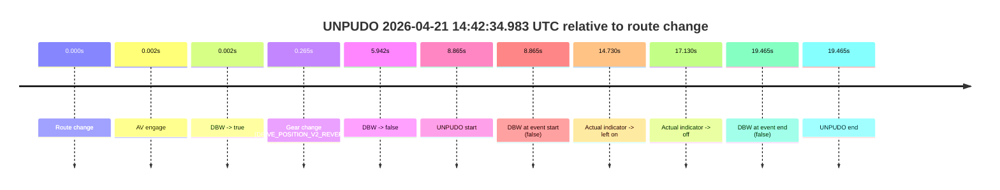
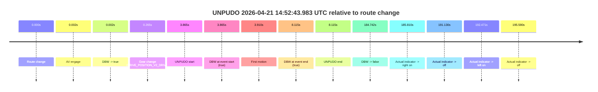
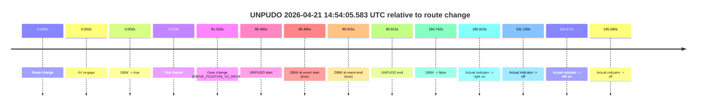
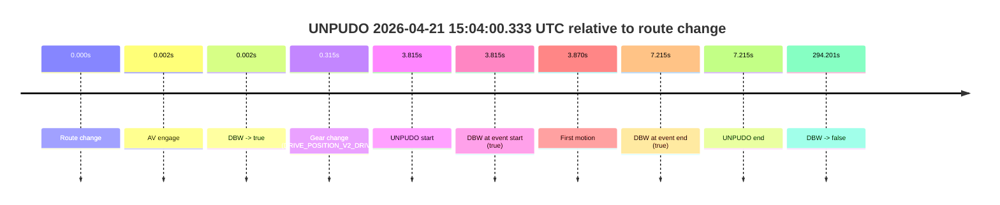
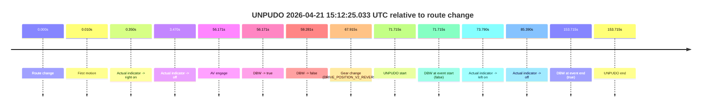

# Run Report: fme10005/2026-04-21--13-43-21--gen2-av-4caaaf56-00d1-40eb-91de-0dec2298bc2d

| Field | Value |
|---|---|
| Run ID | `fme10005/2026-04-21--13-43-21--gen2-av-4caaaf56-00d1-40eb-91de-0dec2298bc2d` |
| Date | `2026-04-21` |
| Model(s) | `eel-teal-outspoken` |
| Author | `zak` |
| Event count | `5` |

## unpudo 2026-04-21 14:42:34.983 UTC

| Field | Value |
|---|---|
| Model | `eel-teal-outspoken` |
| Author | `zak` |
| Run ID | `fme10005/2026-04-21--13-43-21--gen2-av-4caaaf56-00d1-40eb-91de-0dec2298bc2d` |
| Date | `2026-04-21` |
| Time (UTC) | `14:42:34.983` |
| Event type | `unpudo` |
| Disengagement type | `none observed` |
| Route change | `found` |
| Console | [run](https://console.sso.wayve.ai/run/fme10005/2026-04-21--13-43-21--gen2-av-4caaaf56-00d1-40eb-91de-0dec2298bc2d?id=&time-unixus=1776782554983313) |
| Foxglove | [segment](https://app.foxglove.dev/wayve-on-prem/p/prj_0dX18KZdVHg1fmmI/view?ds=foxglove-stream&ds.deviceName=fme10005&ds.start=2026-04-21T14%3A42%3A16.118289Z&ds.end=2026-04-21T14%3A42%3A55.583312Z&layoutId=lay_0e7VD4WIKDQGU73Y&time=2026-04-21T14%3A42%3A34.983313Z) |

### Event card: fail

- Fail: the credited unpudo does not stay AV-owned. The event window starts with DBW false, and the maneuver outcome lands outside a clean AV-owned segment.

| Event | Time (UTC) | Delta from route change |
|---|---:|---:|
| Route change | 2026-04-21 14:42:26.118 | `0.000s` |
| AV engage | 2026-04-21 14:42:26.119 | `0.002s` |
| DBW -> true | 2026-04-21 14:42:26.119 | `0.002s` |
| Gear change (DRIVE_POSITION_V2_REVERSE) | 2026-04-21 14:42:26.383 | `0.265s` |
| DBW -> false | 2026-04-21 14:42:32.060 | `5.942s` |
| UNPUDO start | 2026-04-21 14:42:34.983 | `8.865s` |
| DBW at event start (false) | 2026-04-21 14:42:34.983 | `8.865s` |
| Actual indicator -> left on | 2026-04-21 14:42:40.848 | `14.730s` |
| Actual indicator -> off | 2026-04-21 14:42:43.248 | `17.130s` |
| DBW at event end (false) | 2026-04-21 14:42:45.583 | `19.465s` |
| UNPUDO end | 2026-04-21 14:42:45.583 | `19.465s` |

| Metric | Value |
|---|---|
| Outcome | `fail` |
| Effective failure type | `not_av_owned` |
| Route change status | `found` |
| DBW at event start | `false` |
| DBW at event end | `false` |
| Predicted gear at AV start | `DRIVE_POSITION_V2_PARK` |
| Actual gear at AV start | `DRIVE_POSITION_V2_PARK` |
| Predicted gear at event start | `DRIVE_POSITION_V2_REVERSE` |
| Actual gear at event start | `DRIVE_POSITION_V2_REVERSE` |
| Planned indicator direction | `INDICATORS_STATE_V2_OFF` |
| Controller indicator direction | `INDICATORS_STATE_V2_OFF` |
| Actual indicator direction | `INDICATORS_STATE_V2_OFF` |
| Actual indicator at maneuver end | `INDICATORS_STATE_V2_OFF` |
| Driver accel help in AV | `false` |
| Driver accel help timestamp | `n/a` |
| Max accel pedal pct in AV | `0.0%` |
| Max brake pedal pct in AV | `8.7%` |
| Max speed mps in AV | `0.000` |
| Success timing baseline | `route change` |
| Route -> AV | `0.002s` |
| AV -> event start | `8.863s` |
| AV -> first motion | `n/a` |
| Success baseline -> event start | `8.865s` |
| Success baseline -> first motion | `n/a` |
| AV duration before disengagement | `5.941s` |
| Trajectory waypoint count | `37` |
| Driving-plan step count | `11` |

The scored portion starts from the AV-owned window, not from the pre-AV setup. Route-change search in the stopped pre-event segment was `found`, with the baseline therefore set to route change. At the event anchor the model predicts `DRIVE_POSITION_V2_REVERSE` and the actual gear is `DRIVE_POSITION_V2_REVERSE`. The effective model outcome is `fail` because `not_av_owned.`

### Resolution

| Field | Value |
|---|---|
| Final outcome | `fail` |
| Do we agree with this label? | `yes` |
| Source disengagement type | `none observed` |
| Resolved effective failure type | `not_av_owned` |
| Confidence | `high` |

## unpudo 2026-04-21 14:52:43.983 UTC

| Field | Value |
|---|---|
| Model | `eel-teal-outspoken` |
| Author | `zak` |
| Run ID | `fme10005/2026-04-21--13-43-21--gen2-av-4caaaf56-00d1-40eb-91de-0dec2298bc2d` |
| Date | `2026-04-21` |
| Time (UTC) | `14:52:43.983` |
| Event type | `unpudo` |
| Disengagement type | `none observed` |
| Route change | `found` |
| Console | [run](https://console.sso.wayve.ai/run/fme10005/2026-04-21--13-43-21--gen2-av-4caaaf56-00d1-40eb-91de-0dec2298bc2d?id=&time-unixus=1776783163983312) |
| Foxglove | [segment](https://app.foxglove.dev/wayve-on-prem/p/prj_0dX18KZdVHg1fmmI/view?ds=foxglove-stream&ds.deviceName=fme10005&ds.start=2026-04-21T14%3A52%3A30.118278Z&ds.end=2026-04-21T14%3A55%3A54.860335Z&layoutId=lay_0e7VD4WIKDQGU73Y&time=2026-04-21T14%3A52%3A43.983312Z) |

### Event card: pass

- Pass: AV owns the credited unpudo from route change through the official unpudo window, the gear state is aligned at the anchor, and the vehicle moves without driver accelerator help in AV.

| Event | Time (UTC) | Delta from route change |
|---|---:|---:|
| Route change | 2026-04-21 14:52:40.118 | `0.000s` |
| AV engage | 2026-04-21 14:52:40.120 | `0.002s` |
| DBW -> true | 2026-04-21 14:52:40.120 | `0.002s` |
| Gear change (DRIVE_POSITION_V2_DRIVE) | 2026-04-21 14:52:40.383 | `0.265s` |
| UNPUDO start | 2026-04-21 14:52:43.983 | `3.865s` |
| DBW at event start (true) | 2026-04-21 14:52:43.983 | `3.865s` |
| First motion | 2026-04-21 14:52:44.028 | `3.910s` |
| DBW at event end (true) | 2026-04-21 14:52:48.233 | `8.115s` |
| UNPUDO end | 2026-04-21 14:52:48.233 | `8.115s` |
| DBW -> false | 2026-04-21 14:55:44.860 | `184.742s` |
| Actual indicator -> right on | 2026-04-21 14:55:45.928 | `185.810s` |
| Actual indicator -> off | 2026-04-21 14:55:51.248 | `191.130s` |
| Actual indicator -> left on | 2026-04-21 14:55:52.588 | `192.471s` |
| Actual indicator -> off | 2026-04-21 14:55:55.708 | `195.590s` |

| Metric | Value |
|---|---|
| Outcome | `pass` |
| Effective failure type | `none` |
| Route change status | `found` |
| DBW at event start | `true` |
| DBW at event end | `true` |
| Predicted gear at AV start | `DRIVE_POSITION_V2_PARK` |
| Actual gear at AV start | `DRIVE_POSITION_V2_PARK` |
| Predicted gear at event start | `DRIVE_POSITION_V2_DRIVE` |
| Actual gear at event start | `DRIVE_POSITION_V2_DRIVE` |
| Planned indicator direction | `INDICATORS_STATE_V2_LEFT_ON` |
| Controller indicator direction | `INDICATORS_STATE_V2_LEFT_ON` |
| Actual indicator direction | `INDICATORS_STATE_V2_OFF` |
| Actual indicator at maneuver end | `INDICATORS_STATE_V2_OFF` |
| Driver accel help in AV | `false` |
| Driver accel help timestamp | `n/a` |
| Max accel pedal pct in AV | `0.0%` |
| Max brake pedal pct in AV | `8.0%` |
| Max speed mps in AV | `3.578` |
| Success timing baseline | `route change` |
| Route -> AV | `0.002s` |
| AV -> event start | `3.863s` |
| AV -> first motion | `3.908s` |
| Success baseline -> event start | `3.865s` |
| Success baseline -> first motion | `3.910s` |
| AV duration before disengagement | `184.740s` |
| Trajectory waypoint count | `37` |
| Driving-plan step count | `11` |

The scored portion starts from the AV-owned window, not from the pre-AV setup. Route-change search in the stopped pre-event segment was `found`, with the baseline therefore set to route change. At the event anchor the model predicts `DRIVE_POSITION_V2_DRIVE` and the actual gear is `DRIVE_POSITION_V2_DRIVE`. The effective model outcome is `pass` because `the credited unpudo stays AV-owned through the official unpudo window.`

### Resolution

| Field | Value |
|---|---|
| Final outcome | `pass` |
| Do we agree with this label? | `yes` |
| Source disengagement type | `none observed` |
| Resolved effective failure type | `none` |
| Confidence | `high` |

## unpudo 2026-04-21 14:54:05.583 UTC

| Field | Value |
|---|---|
| Model | `eel-teal-outspoken` |
| Author | `zak` |
| Run ID | `fme10005/2026-04-21--13-43-21--gen2-av-4caaaf56-00d1-40eb-91de-0dec2298bc2d` |
| Date | `2026-04-21` |
| Time (UTC) | `14:54:05.583` |
| Event type | `unpudo` |
| Disengagement type | `none observed` |
| Route change | `found` |
| Console | [run](https://console.sso.wayve.ai/run/fme10005/2026-04-21--13-43-21--gen2-av-4caaaf56-00d1-40eb-91de-0dec2298bc2d?id=&time-unixus=1776783245583305) |
| Foxglove | [segment](https://app.foxglove.dev/wayve-on-prem/p/prj_0dX18KZdVHg1fmmI/view?ds=foxglove-stream&ds.deviceName=fme10005&ds.start=2026-04-21T14%3A52%3A30.118278Z&ds.end=2026-04-21T14%3A55%3A54.860335Z&layoutId=lay_0e7VD4WIKDQGU73Y&time=2026-04-21T14%3A54%3A05.583305Z) |

### Event card: pass

- Pass: AV owns the credited unpudo from route change through the official unpudo window, the gear state is aligned at the anchor, and the vehicle moves without driver accelerator help in AV.

| Event | Time (UTC) | Delta from route change |
|---|---:|---:|
| Route change | 2026-04-21 14:52:40.118 | `0.000s` |
| AV engage | 2026-04-21 14:52:40.120 | `0.002s` |
| DBW -> true | 2026-04-21 14:52:40.120 | `0.002s` |
| First motion | 2026-04-21 14:52:44.028 | `3.910s` |
| Gear change (DRIVE_POSITION_V2_DRIVE) | 2026-04-21 14:54:01.433 | `81.315s` |
| UNPUDO start | 2026-04-21 14:54:05.583 | `85.465s` |
| DBW at event start (true) | 2026-04-21 14:54:05.583 | `85.465s` |
| DBW at event end (true) | 2026-04-21 14:54:10.033 | `89.915s` |
| UNPUDO end | 2026-04-21 14:54:10.033 | `89.915s` |
| DBW -> false | 2026-04-21 14:55:44.860 | `184.742s` |
| Actual indicator -> right on | 2026-04-21 14:55:45.928 | `185.810s` |
| Actual indicator -> off | 2026-04-21 14:55:51.248 | `191.130s` |
| Actual indicator -> left on | 2026-04-21 14:55:52.588 | `192.471s` |
| Actual indicator -> off | 2026-04-21 14:55:55.708 | `195.590s` |

| Metric | Value |
|---|---|
| Outcome | `pass` |
| Effective failure type | `none` |
| Route change status | `found` |
| DBW at event start | `true` |
| DBW at event end | `true` |
| Predicted gear at AV start | `DRIVE_POSITION_V2_PARK` |
| Actual gear at AV start | `DRIVE_POSITION_V2_PARK` |
| Predicted gear at event start | `DRIVE_POSITION_V2_DRIVE` |
| Actual gear at event start | `DRIVE_POSITION_V2_DRIVE` |
| Planned indicator direction | `INDICATORS_STATE_V2_LEFT_ON` |
| Controller indicator direction | `INDICATORS_STATE_V2_LEFT_ON` |
| Actual indicator direction | `INDICATORS_STATE_V2_OFF` |
| Actual indicator at maneuver end | `INDICATORS_STATE_V2_OFF` |
| Driver accel help in AV | `false` |
| Driver accel help timestamp | `n/a` |
| Max accel pedal pct in AV | `0.0%` |
| Max brake pedal pct in AV | `8.0%` |
| Max speed mps in AV | `7.314` |
| Success timing baseline | `route change` |
| Route -> AV | `0.002s` |
| AV -> event start | `85.463s` |
| AV -> first motion | `3.908s` |
| Success baseline -> event start | `85.465s` |
| Success baseline -> first motion | `3.910s` |
| AV duration before disengagement | `184.740s` |
| Trajectory waypoint count | `37` |
| Driving-plan step count | `11` |

The scored portion starts from the AV-owned window, not from the pre-AV setup. Route-change search in the stopped pre-event segment was `found`, with the baseline therefore set to route change. At the event anchor the model predicts `DRIVE_POSITION_V2_DRIVE` and the actual gear is `DRIVE_POSITION_V2_DRIVE`. The effective model outcome is `pass` because `the credited unpudo stays AV-owned through the official unpudo window.`

### Resolution

| Field | Value |
|---|---|
| Final outcome | `pass` |
| Do we agree with this label? | `yes` |
| Source disengagement type | `none observed` |
| Resolved effective failure type | `none` |
| Confidence | `high` |

## unpudo 2026-04-21 15:04:00.333 UTC

| Field | Value |
|---|---|
| Model | `eel-teal-outspoken` |
| Author | `zak` |
| Run ID | `fme10005/2026-04-21--13-43-21--gen2-av-4caaaf56-00d1-40eb-91de-0dec2298bc2d` |
| Date | `2026-04-21` |
| Time (UTC) | `15:04:00.333` |
| Event type | `unpudo` |
| Disengagement type | `none observed` |
| Route change | `found` |
| Console | [run](https://console.sso.wayve.ai/run/fme10005/2026-04-21--13-43-21--gen2-av-4caaaf56-00d1-40eb-91de-0dec2298bc2d?id=&time-unixus=1776783840333295) |
| Foxglove | [segment](https://app.foxglove.dev/wayve-on-prem/p/prj_0dX18KZdVHg1fmmI/view?ds=foxglove-stream&ds.deviceName=fme10005&ds.start=2026-04-21T15%3A03%3A46.518264Z&ds.end=2026-04-21T15%3A09%3A00.719744Z&layoutId=lay_0e7VD4WIKDQGU73Y&time=2026-04-21T15%3A04%3A00.333295Z) |

### Event card: pass

- Pass: AV owns the credited unpudo from route change through the official unpudo window, the gear state is aligned at the anchor, and the vehicle moves without driver accelerator help in AV.

| Event | Time (UTC) | Delta from route change |
|---|---:|---:|
| Route change | 2026-04-21 15:03:56.518 | `0.000s` |
| AV engage | 2026-04-21 15:03:56.519 | `0.002s` |
| DBW -> true | 2026-04-21 15:03:56.519 | `0.002s` |
| Gear change (DRIVE_POSITION_V2_DRIVE) | 2026-04-21 15:03:56.833 | `0.315s` |
| UNPUDO start | 2026-04-21 15:04:00.333 | `3.815s` |
| DBW at event start (true) | 2026-04-21 15:04:00.333 | `3.815s` |
| First motion | 2026-04-21 15:04:00.387 | `3.870s` |
| DBW at event end (true) | 2026-04-21 15:04:03.733 | `7.215s` |
| UNPUDO end | 2026-04-21 15:04:03.733 | `7.215s` |
| DBW -> false | 2026-04-21 15:08:50.719 | `294.201s` |

| Metric | Value |
|---|---|
| Outcome | `pass` |
| Effective failure type | `none` |
| Route change status | `found` |
| DBW at event start | `true` |
| DBW at event end | `true` |
| Predicted gear at AV start | `DRIVE_POSITION_V2_PARK` |
| Actual gear at AV start | `DRIVE_POSITION_V2_PARK` |
| Predicted gear at event start | `DRIVE_POSITION_V2_DRIVE` |
| Actual gear at event start | `DRIVE_POSITION_V2_DRIVE` |
| Planned indicator direction | `INDICATORS_STATE_V2_LEFT_ON` |
| Controller indicator direction | `INDICATORS_STATE_V2_LEFT_ON` |
| Actual indicator direction | `INDICATORS_STATE_V2_OFF` |
| Actual indicator at maneuver end | `INDICATORS_STATE_V2_OFF` |
| Driver accel help in AV | `false` |
| Driver accel help timestamp | `n/a` |
| Max accel pedal pct in AV | `0.0%` |
| Max brake pedal pct in AV | `8.0%` |
| Max speed mps in AV | `5.194` |
| Success timing baseline | `route change` |
| Route -> AV | `0.002s` |
| AV -> event start | `3.813s` |
| AV -> first motion | `3.868s` |
| Success baseline -> event start | `3.815s` |
| Success baseline -> first motion | `3.870s` |
| AV duration before disengagement | `294.200s` |
| Trajectory waypoint count | `38` |
| Driving-plan step count | `11` |

The scored portion starts from the AV-owned window, not from the pre-AV setup. Route-change search in the stopped pre-event segment was `found`, with the baseline therefore set to route change. At the event anchor the model predicts `DRIVE_POSITION_V2_DRIVE` and the actual gear is `DRIVE_POSITION_V2_DRIVE`. The effective model outcome is `pass` because `the credited unpudo stays AV-owned through the official unpudo window.`

### Resolution

| Field | Value |
|---|---|
| Final outcome | `pass` |
| Do we agree with this label? | `yes` |
| Source disengagement type | `none observed` |
| Resolved effective failure type | `none` |
| Confidence | `high` |

## unpudo 2026-04-21 15:12:25.033 UTC

| Field | Value |
|---|---|
| Model | `eel-teal-outspoken` |
| Author | `zak` |
| Run ID | `fme10005/2026-04-21--13-43-21--gen2-av-4caaaf56-00d1-40eb-91de-0dec2298bc2d` |
| Date | `2026-04-21` |
| Time (UTC) | `15:12:25.033` |
| Event type | `unpudo` |
| Disengagement type | `none observed` |
| Route change | `found` |
| Console | [run](https://console.sso.wayve.ai/run/fme10005/2026-04-21--13-43-21--gen2-av-4caaaf56-00d1-40eb-91de-0dec2298bc2d?id=&time-unixus=1776784345033315) |
| Foxglove | [segment](https://app.foxglove.dev/wayve-on-prem/p/prj_0dX18KZdVHg1fmmI/view?ds=foxglove-stream&ds.deviceName=fme10005&ds.start=2026-04-21T15%3A11%3A03.318386Z&ds.end=2026-04-21T15%3A13%3A57.033307Z&layoutId=lay_0e7VD4WIKDQGU73Y&time=2026-04-21T15%3A12%3A25.033315Z) |

### Event card: fail

- Fail: the credited unpudo does not stay AV-owned. The event window starts with DBW false, and the maneuver outcome lands outside a clean AV-owned segment.

| Event | Time (UTC) | Delta from route change |
|---|---:|---:|
| Route change | 2026-04-21 15:11:13.318 | `0.000s` |
| First motion | 2026-04-21 15:11:13.328 | `0.010s` |
| Actual indicator -> right on | 2026-04-21 15:11:13.667 | `0.350s` |
| Actual indicator -> off | 2026-04-21 15:11:16.788 | `3.470s` |
| AV engage | 2026-04-21 15:12:09.489 | `56.171s` |
| DBW -> true | 2026-04-21 15:12:09.489 | `56.171s` |
| DBW -> false | 2026-04-21 15:12:12.599 | `59.281s` |
| Gear change (DRIVE_POSITION_V2_REVERSE) | 2026-04-21 15:12:21.233 | `67.915s` |
| UNPUDO start | 2026-04-21 15:12:25.033 | `71.715s` |
| DBW at event start (false) | 2026-04-21 15:12:25.033 | `71.715s` |
| Actual indicator -> left on | 2026-04-21 15:12:27.108 | `73.790s` |
| Actual indicator -> off | 2026-04-21 15:12:38.708 | `85.390s` |
| DBW at event end (true) | 2026-04-21 15:13:47.033 | `153.715s` |
| UNPUDO end | 2026-04-21 15:13:47.033 | `153.715s` |

| Metric | Value |
|---|---|
| Outcome | `fail` |
| Effective failure type | `completed_outside_av` |
| Route change status | `found` |
| DBW at event start | `false` |
| DBW at event end | `true` |
| Predicted gear at AV start | `DRIVE_POSITION_V2_DRIVE` |
| Actual gear at AV start | `DRIVE_POSITION_V2_PARK` |
| Predicted gear at event start | `DRIVE_POSITION_V2_REVERSE` |
| Actual gear at event start | `DRIVE_POSITION_V2_REVERSE` |
| Planned indicator direction | `INDICATORS_STATE_V2_OFF` |
| Controller indicator direction | `INDICATORS_STATE_V2_OFF` |
| Actual indicator direction | `INDICATORS_STATE_V2_OFF` |
| Actual indicator at maneuver end | `INDICATORS_STATE_V2_OFF` |
| Driver accel help in AV | `false` |
| Driver accel help timestamp | `n/a` |
| Max accel pedal pct in AV | `0.0%` |
| Max brake pedal pct in AV | `8.0%` |
| Max speed mps in AV | `0.000` |
| Success timing baseline | `route change` |
| Route -> AV | `56.171s` |
| AV -> event start | `15.544s` |
| AV -> first motion | `-56.161s` |
| Success baseline -> event start | `71.715s` |
| Success baseline -> first motion | `0.010s` |
| AV duration before disengagement | `3.110s` |
| Trajectory waypoint count | `38` |
| Driving-plan step count | `11` |

The scored portion starts from the AV-owned window, not from the pre-AV setup. Route-change search in the stopped pre-event segment was `found`, with the baseline therefore set to route change. At the event anchor the model predicts `DRIVE_POSITION_V2_REVERSE` and the actual gear is `DRIVE_POSITION_V2_REVERSE`. The effective model outcome is `fail` because `completed_outside_av.`

### Resolution

| Field | Value |
|---|---|
| Final outcome | `fail` |
| Do we agree with this label? | `yes` |
| Source disengagement type | `none observed` |
| Resolved effective failure type | `completed_outside_av` |
| Confidence | `high` |
