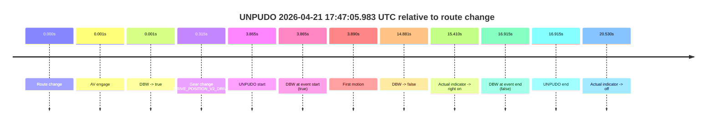

# Run Report: fme10005/2026-04-21--17-39-16--gen2-av-1697050f-deec-4607-95bb-d6336f707fa5

| Field | Value |
|---|---|
| Run ID | `fme10005/2026-04-21--17-39-16--gen2-av-1697050f-deec-4607-95bb-d6336f707fa5` |
| Date | `2026-04-21` |
| Model(s) | `eel-teal-outspoken` |
| Author | `zak` |
| Event count | `1` |

## unpudo 2026-04-21 17:47:05.983 UTC

| Field | Value |
|---|---|
| Model | `eel-teal-outspoken` |
| Author | `zak` |
| Run ID | `fme10005/2026-04-21--17-39-16--gen2-av-1697050f-deec-4607-95bb-d6336f707fa5` |
| Date | `2026-04-21` |
| Time (UTC) | `17:47:05.983` |
| Event type | `unpudo` |
| Disengagement type | `indicator` |
| Route change | `found` |
| Console | [run](https://console.sso.wayve.ai/run/fme10005/2026-04-21--17-39-16--gen2-av-1697050f-deec-4607-95bb-d6336f707fa5?id=&time-unixus=1776793625983300) |
| Foxglove | [segment](https://app.foxglove.dev/wayve-on-prem/p/prj_0dX18KZdVHg1fmmI/view?ds=foxglove-stream&ds.deviceName=fme10005&ds.start=2026-04-21T17%3A46%3A52.118260Z&ds.end=2026-04-21T17%3A47%3A29.033314Z&layoutId=lay_0e7VD4WIKDQGU73Y&time=2026-04-21T17%3A47%3A05.983300Z) |

### Event card: fail

- Fail: AV owns part of the segment, but the event still resolves as a model-performance failure under the AV-only scoring rule.

| Event | Time (UTC) | Delta from route change |
|---|---:|---:|
| Route change | 2026-04-21 17:47:02.118 | `0.000s` |
| AV engage | 2026-04-21 17:47:02.119 | `0.001s` |
| DBW -> true | 2026-04-21 17:47:02.119 | `0.001s` |
| Gear change (DRIVE_POSITION_V2_DRIVE) | 2026-04-21 17:47:02.433 | `0.315s` |
| UNPUDO start | 2026-04-21 17:47:05.983 | `3.865s` |
| DBW at event start (true) | 2026-04-21 17:47:05.983 | `3.865s` |
| First motion | 2026-04-21 17:47:06.007 | `3.890s` |
| DBW -> false | 2026-04-21 17:47:16.999 | `14.881s` |
| Actual indicator -> right on | 2026-04-21 17:47:17.528 | `15.410s` |
| DBW at event end (false) | 2026-04-21 17:47:19.033 | `16.915s` |
| UNPUDO end | 2026-04-21 17:47:19.033 | `16.915s` |
| Actual indicator -> off | 2026-04-21 17:47:22.647 | `20.530s` |

| Metric | Value |
|---|---|
| Outcome | `fail` |
| Effective failure type | `indicator` |
| Route change status | `found` |
| DBW at event start | `true` |
| DBW at event end | `false` |
| Predicted gear at AV start | `DRIVE_POSITION_V2_PARK` |
| Actual gear at AV start | `DRIVE_POSITION_V2_PARK` |
| Predicted gear at event start | `DRIVE_POSITION_V2_DRIVE` |
| Actual gear at event start | `DRIVE_POSITION_V2_DRIVE` |
| Planned indicator direction | `INDICATORS_STATE_V2_LEFT_ON` |
| Controller indicator direction | `INDICATORS_STATE_V2_LEFT_ON` |
| Actual indicator direction | `INDICATORS_STATE_V2_OFF` |
| Actual indicator at maneuver end | `INDICATORS_STATE_V2_RIGHT_ON` |
| Driver accel help in AV | `false` |
| Driver accel help timestamp | `n/a` |
| Max accel pedal pct in AV | `0.0%` |
| Max brake pedal pct in AV | `8.0%` |
| Max speed mps in AV | `2.722` |
| Success timing baseline | `route change` |
| Route -> AV | `0.001s` |
| AV -> event start | `3.864s` |
| AV -> first motion | `3.888s` |
| Success baseline -> event start | `3.865s` |
| Success baseline -> first motion | `3.890s` |
| AV duration before disengagement | `14.880s` |
| Trajectory waypoint count | `37` |
| Driving-plan step count | `11` |

The scored portion starts from the AV-owned window, not from the pre-AV setup. Route-change search in the stopped pre-event segment was `found`, with the baseline therefore set to route change. At the event anchor the model predicts `DRIVE_POSITION_V2_DRIVE` and the actual gear is `DRIVE_POSITION_V2_DRIVE`. The effective model outcome is `fail` because `indicator.`

### Resolution

| Field | Value |
|---|---|
| Final outcome | `fail` |
| Do we agree with this label? | `yes` |
| Source disengagement type | `indicator` |
| Resolved effective failure type | `indicator` |
| Confidence | `high` |
