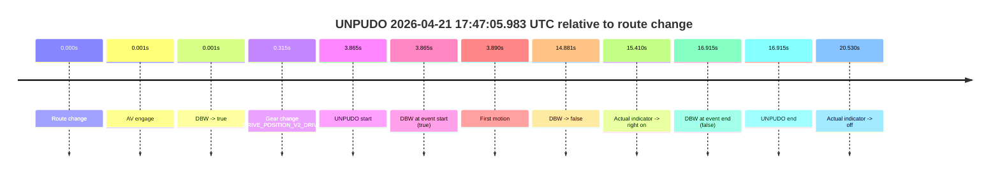
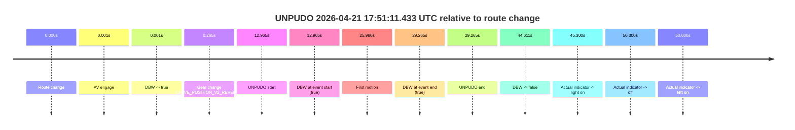
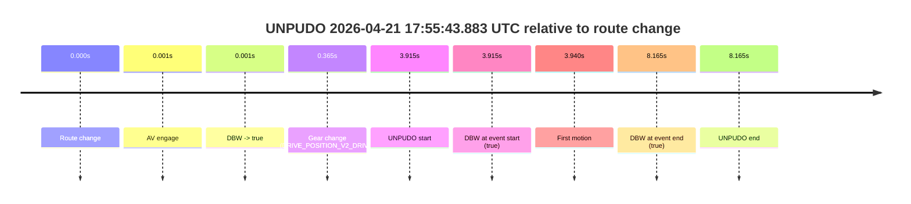
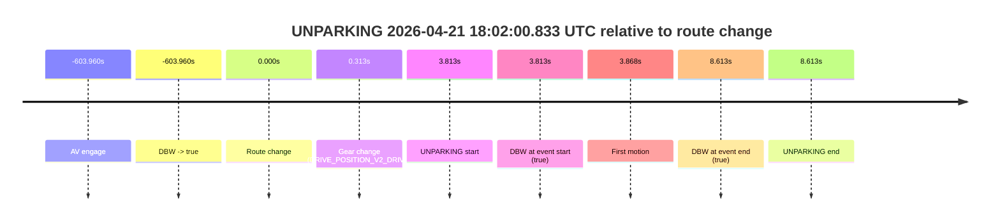

# Run Report: fme10005/2026-04-21--17-39-16--gen2-av-1697050f-deec-4607-95bb-d6336f707fa5

| Field | Value |
|---|---|
| Run ID | `fme10005/2026-04-21--17-39-16--gen2-av-1697050f-deec-4607-95bb-d6336f707fa5` |
| Date | `2026-04-21` |
| Model(s) | `eel-teal-outspoken` |
| Author | `zak` |
| Event count | `5` |

## unpudo 2026-04-21 17:47:05.983 UTC

| Field | Value |
|---|---|
| Model | `eel-teal-outspoken` |
| Author | `zak` |
| Run ID | `fme10005/2026-04-21--17-39-16--gen2-av-1697050f-deec-4607-95bb-d6336f707fa5` |
| Date | `2026-04-21` |
| Time (UTC) | `17:47:05.983` |
| Event type | `unpudo` |
| Disengagement type | `indicator` |
| Route change | `found` |
| Console | [run](https://console.sso.wayve.ai/run/fme10005/2026-04-21--17-39-16--gen2-av-1697050f-deec-4607-95bb-d6336f707fa5?id=&time-unixus=1776793625983300) |
| Foxglove | [segment](https://app.foxglove.dev/wayve-on-prem/p/prj_0dX18KZdVHg1fmmI/view?ds=foxglove-stream&ds.deviceName=fme10005&ds.start=2026-04-21T17%3A46%3A52.118260Z&ds.end=2026-04-21T17%3A47%3A29.033314Z&layoutId=lay_0e7VD4WIKDQGU73Y&time=2026-04-21T17%3A47%3A05.983300Z) |

### Event card: fail

- Fail: AV owns part of the segment, but the event still resolves as a model-performance failure under the AV-only scoring rule.

| Event | Time (UTC) | Delta from route change |
|---|---:|---:|
| Route change | 2026-04-21 17:47:02.118 | `0.000s` |
| AV engage | 2026-04-21 17:47:02.119 | `0.001s` |
| DBW -> true | 2026-04-21 17:47:02.119 | `0.001s` |
| Gear change (DRIVE_POSITION_V2_DRIVE) | 2026-04-21 17:47:02.433 | `0.315s` |
| UNPUDO start | 2026-04-21 17:47:05.983 | `3.865s` |
| DBW at event start (true) | 2026-04-21 17:47:05.983 | `3.865s` |
| First motion | 2026-04-21 17:47:06.007 | `3.890s` |
| DBW -> false | 2026-04-21 17:47:16.999 | `14.881s` |
| Actual indicator -> right on | 2026-04-21 17:47:17.528 | `15.410s` |
| DBW at event end (false) | 2026-04-21 17:47:19.033 | `16.915s` |
| UNPUDO end | 2026-04-21 17:47:19.033 | `16.915s` |
| Actual indicator -> off | 2026-04-21 17:47:22.647 | `20.530s` |

| Metric | Value |
|---|---|
| Outcome | `fail` |
| Effective failure type | `indicator` |
| Route change status | `found` |
| DBW at event start | `true` |
| DBW at event end | `false` |
| Predicted gear at AV start | `DRIVE_POSITION_V2_PARK` |
| Actual gear at AV start | `DRIVE_POSITION_V2_PARK` |
| Predicted gear at event start | `DRIVE_POSITION_V2_DRIVE` |
| Actual gear at event start | `DRIVE_POSITION_V2_DRIVE` |
| Planned indicator direction | `INDICATORS_STATE_V2_LEFT_ON` |
| Controller indicator direction | `INDICATORS_STATE_V2_LEFT_ON` |
| Actual indicator direction | `INDICATORS_STATE_V2_OFF` |
| Actual indicator at maneuver end | `INDICATORS_STATE_V2_RIGHT_ON` |
| Driver accel help in AV | `false` |
| Driver accel help timestamp | `n/a` |
| Max accel pedal pct in AV | `0.0%` |
| Max brake pedal pct in AV | `8.0%` |
| Max speed mps in AV | `2.722` |
| Success timing baseline | `route change` |
| Route -> AV | `0.001s` |
| AV -> event start | `3.864s` |
| AV -> first motion | `3.888s` |
| Success baseline -> event start | `3.865s` |
| Success baseline -> first motion | `3.890s` |
| AV duration before disengagement | `14.880s` |
| Trajectory waypoint count | `37` |
| Driving-plan step count | `11` |

The scored portion starts from the AV-owned window, not from the pre-AV setup. Route-change search in the stopped pre-event segment was `found`, with the baseline therefore set to route change. At the event anchor the model predicts `DRIVE_POSITION_V2_DRIVE` and the actual gear is `DRIVE_POSITION_V2_DRIVE`. The effective model outcome is `fail` because `indicator.`

### Resolution

| Field | Value |
|---|---|
| Final outcome | `fail` |
| Do we agree with this label? | `yes` |
| Source disengagement type | `indicator` |
| Resolved effective failure type | `indicator` |
| Confidence | `high` |

## unpudo 2026-04-21 17:51:11.433 UTC

| Field | Value |
|---|---|
| Model | `eel-teal-outspoken` |
| Author | `zak` |
| Run ID | `fme10005/2026-04-21--17-39-16--gen2-av-1697050f-deec-4607-95bb-d6336f707fa5` |
| Date | `2026-04-21` |
| Time (UTC) | `17:51:11.433` |
| Event type | `unpudo` |
| Disengagement type | `none observed` |
| Route change | `found` |
| Console | [run](https://console.sso.wayve.ai/run/fme10005/2026-04-21--17-39-16--gen2-av-1697050f-deec-4607-95bb-d6336f707fa5?id=&time-unixus=1776793871433313) |
| Foxglove | [segment](https://app.foxglove.dev/wayve-on-prem/p/prj_0dX18KZdVHg1fmmI/view?ds=foxglove-stream&ds.deviceName=fme10005&ds.start=2026-04-21T17%3A50%3A48.468286Z&ds.end=2026-04-21T17%3A51%3A53.079156Z&layoutId=lay_0e7VD4WIKDQGU73Y&time=2026-04-21T17%3A51%3A11.433313Z) |

### Event card: pass

- Pass: AV owns the credited unpudo from route change through the official unpudo window, the gear state is aligned at the anchor, and the vehicle moves without driver accelerator help in AV.

| Event | Time (UTC) | Delta from route change |
|---|---:|---:|
| Route change | 2026-04-21 17:50:58.468 | `0.000s` |
| AV engage | 2026-04-21 17:50:58.469 | `0.001s` |
| DBW -> true | 2026-04-21 17:50:58.469 | `0.001s` |
| Gear change (DRIVE_POSITION_V2_REVERSE) | 2026-04-21 17:50:58.733 | `0.265s` |
| UNPUDO start | 2026-04-21 17:51:11.433 | `12.965s` |
| DBW at event start (true) | 2026-04-21 17:51:11.433 | `12.965s` |
| First motion | 2026-04-21 17:51:24.447 | `25.980s` |
| DBW at event end (true) | 2026-04-21 17:51:27.733 | `29.265s` |
| UNPUDO end | 2026-04-21 17:51:27.733 | `29.265s` |
| DBW -> false | 2026-04-21 17:51:43.079 | `44.611s` |
| Actual indicator -> right on | 2026-04-21 17:51:43.768 | `45.300s` |
| Actual indicator -> off | 2026-04-21 17:51:48.768 | `50.300s` |
| Actual indicator -> left on | 2026-04-21 17:51:49.068 | `50.600s` |

| Metric | Value |
|---|---|
| Outcome | `pass` |
| Effective failure type | `none` |
| Route change status | `found` |
| DBW at event start | `true` |
| DBW at event end | `true` |
| Predicted gear at AV start | `DRIVE_POSITION_V2_PARK` |
| Actual gear at AV start | `DRIVE_POSITION_V2_PARK` |
| Predicted gear at event start | `DRIVE_POSITION_V2_REVERSE` |
| Actual gear at event start | `DRIVE_POSITION_V2_REVERSE` |
| Planned indicator direction | `INDICATORS_STATE_V2_OFF` |
| Controller indicator direction | `INDICATORS_STATE_V2_OFF` |
| Actual indicator direction | `INDICATORS_STATE_V2_OFF` |
| Actual indicator at maneuver end | `INDICATORS_STATE_V2_OFF` |
| Driver accel help in AV | `false` |
| Driver accel help timestamp | `n/a` |
| Max accel pedal pct in AV | `0.0%` |
| Max brake pedal pct in AV | `19.7%` |
| Max speed mps in AV | `2.869` |
| Success timing baseline | `route change` |
| Route -> AV | `0.001s` |
| AV -> event start | `12.964s` |
| AV -> first motion | `25.979s` |
| Success baseline -> event start | `12.965s` |
| Success baseline -> first motion | `25.980s` |
| AV duration before disengagement | `44.610s` |
| Trajectory waypoint count | `38` |
| Driving-plan step count | `11` |

The scored portion starts from the AV-owned window, not from the pre-AV setup. Route-change search in the stopped pre-event segment was `found`, with the baseline therefore set to route change. At the event anchor the model predicts `DRIVE_POSITION_V2_REVERSE` and the actual gear is `DRIVE_POSITION_V2_REVERSE`. The effective model outcome is `pass` because `the credited unpudo stays AV-owned through the official unpudo window.`

### Resolution

| Field | Value |
|---|---|
| Final outcome | `pass` |
| Do we agree with this label? | `yes` |
| Source disengagement type | `none observed` |
| Resolved effective failure type | `none` |
| Confidence | `high` |

## unpudo 2026-04-21 17:55:43.883 UTC

| Field | Value |
|---|---|
| Model | `eel-teal-outspoken` |
| Author | `zak` |
| Run ID | `fme10005/2026-04-21--17-39-16--gen2-av-1697050f-deec-4607-95bb-d6336f707fa5` |
| Date | `2026-04-21` |
| Time (UTC) | `17:55:43.883` |
| Event type | `unpudo` |
| Disengagement type | `none observed` |
| Route change | `found` |
| Console | [run](https://console.sso.wayve.ai/run/fme10005/2026-04-21--17-39-16--gen2-av-1697050f-deec-4607-95bb-d6336f707fa5?id=&time-unixus=1776794143883297) |
| Foxglove | [segment](https://app.foxglove.dev/wayve-on-prem/p/prj_0dX18KZdVHg1fmmI/view?ds=foxglove-stream&ds.deviceName=fme10005&ds.start=2026-04-21T17%3A55%3A29.968292Z&ds.end=2026-04-21T17%3A55%3A58.133309Z&layoutId=lay_0e7VD4WIKDQGU73Y&time=2026-04-21T17%3A55%3A43.883297Z) |

### Event card: pass

- Pass: AV owns the credited unpudo from route change through the official unpudo window, the gear state is aligned at the anchor, and the vehicle moves without driver accelerator help in AV.

| Event | Time (UTC) | Delta from route change |
|---|---:|---:|
| Route change | 2026-04-21 17:55:39.968 | `0.000s` |
| AV engage | 2026-04-21 17:55:39.969 | `0.001s` |
| DBW -> true | 2026-04-21 17:55:39.969 | `0.001s` |
| Gear change (DRIVE_POSITION_V2_DRIVE) | 2026-04-21 17:55:40.333 | `0.365s` |
| UNPUDO start | 2026-04-21 17:55:43.883 | `3.915s` |
| DBW at event start (true) | 2026-04-21 17:55:43.883 | `3.915s` |
| First motion | 2026-04-21 17:55:43.908 | `3.940s` |
| DBW at event end (true) | 2026-04-21 17:55:48.133 | `8.165s` |
| UNPUDO end | 2026-04-21 17:55:48.133 | `8.165s` |

| Metric | Value |
|---|---|
| Outcome | `pass` |
| Effective failure type | `none` |
| Route change status | `found` |
| DBW at event start | `true` |
| DBW at event end | `true` |
| Predicted gear at AV start | `DRIVE_POSITION_V2_PARK` |
| Actual gear at AV start | `DRIVE_POSITION_V2_PARK` |
| Predicted gear at event start | `DRIVE_POSITION_V2_DRIVE` |
| Actual gear at event start | `DRIVE_POSITION_V2_DRIVE` |
| Planned indicator direction | `INDICATORS_STATE_V2_LEFT_ON` |
| Controller indicator direction | `INDICATORS_STATE_V2_LEFT_ON` |
| Actual indicator direction | `INDICATORS_STATE_V2_OFF` |
| Actual indicator at maneuver end | `INDICATORS_STATE_V2_OFF` |
| Driver accel help in AV | `false` |
| Driver accel help timestamp | `n/a` |
| Max accel pedal pct in AV | `0.0%` |
| Max brake pedal pct in AV | `8.0%` |
| Max speed mps in AV | `3.122` |
| Success timing baseline | `route change` |
| Route -> AV | `0.001s` |
| AV -> event start | `3.914s` |
| AV -> first motion | `3.939s` |
| Success baseline -> event start | `3.915s` |
| Success baseline -> first motion | `3.940s` |
| AV duration before disengagement | `n/a` |
| Trajectory waypoint count | `37` |
| Driving-plan step count | `11` |

The scored portion starts from the AV-owned window, not from the pre-AV setup. Route-change search in the stopped pre-event segment was `found`, with the baseline therefore set to route change. At the event anchor the model predicts `DRIVE_POSITION_V2_DRIVE` and the actual gear is `DRIVE_POSITION_V2_DRIVE`. The effective model outcome is `pass` because `the credited unpudo stays AV-owned through the official unpudo window.`

### Resolution

| Field | Value |
|---|---|
| Final outcome | `pass` |
| Do we agree with this label? | `yes` |
| Source disengagement type | `none observed` |
| Resolved effective failure type | `none` |
| Confidence | `high` |

## unpudo 2026-04-21 17:59:29.983 UTC

| Field | Value |
|---|---|
| Model | `eel-teal-outspoken` |
| Author | `zak` |
| Run ID | `fme10005/2026-04-21--17-39-16--gen2-av-1697050f-deec-4607-95bb-d6336f707fa5` |
| Date | `2026-04-21` |
| Time (UTC) | `17:59:29.983` |
| Event type | `unpudo` |
| Disengagement type | `none observed` |
| Route change | `found` |
| Console | [run](https://console.sso.wayve.ai/run/fme10005/2026-04-21--17-39-16--gen2-av-1697050f-deec-4607-95bb-d6336f707fa5?id=&time-unixus=1776794369983307) |
| Foxglove | [segment](https://app.foxglove.dev/wayve-on-prem/p/prj_0dX18KZdVHg1fmmI/view?ds=foxglove-stream&ds.deviceName=fme10005&ds.start=2026-04-21T17%3A59%3A16.118272Z&ds.end=2026-04-21T17%3A59%3A43.383314Z&layoutId=lay_0e7VD4WIKDQGU73Y&time=2026-04-21T17%3A59%3A29.983307Z) |

### Event card: pass

- Pass: AV owns the credited unpudo from route change through the official unpudo window, the gear state is aligned at the anchor, and the vehicle moves without driver accelerator help in AV.

| Event | Time (UTC) | Delta from route change |
|---|---:|---:|
| Route change | 2026-04-21 17:59:26.118 | `0.000s` |
| AV engage | 2026-04-21 17:59:26.119 | `0.001s` |
| DBW -> true | 2026-04-21 17:59:26.119 | `0.001s` |
| Gear change (DRIVE_POSITION_V2_DRIVE) | 2026-04-21 17:59:26.433 | `0.315s` |
| UNPUDO start | 2026-04-21 17:59:29.983 | `3.865s` |
| DBW at event start (true) | 2026-04-21 17:59:29.983 | `3.865s` |
| First motion | 2026-04-21 17:59:30.007 | `3.890s` |
| DBW at event end (true) | 2026-04-21 17:59:33.383 | `7.265s` |
| UNPUDO end | 2026-04-21 17:59:33.383 | `7.265s` |

| Metric | Value |
|---|---|
| Outcome | `pass` |
| Effective failure type | `none` |
| Route change status | `found` |
| DBW at event start | `true` |
| DBW at event end | `true` |
| Predicted gear at AV start | `DRIVE_POSITION_V2_PARK` |
| Actual gear at AV start | `DRIVE_POSITION_V2_PARK` |
| Predicted gear at event start | `DRIVE_POSITION_V2_DRIVE` |
| Actual gear at event start | `DRIVE_POSITION_V2_DRIVE` |
| Planned indicator direction | `INDICATORS_STATE_V2_LEFT_ON` |
| Controller indicator direction | `INDICATORS_STATE_V2_LEFT_ON` |
| Actual indicator direction | `INDICATORS_STATE_V2_OFF` |
| Actual indicator at maneuver end | `INDICATORS_STATE_V2_OFF` |
| Driver accel help in AV | `false` |
| Driver accel help timestamp | `n/a` |
| Max accel pedal pct in AV | `0.0%` |
| Max brake pedal pct in AV | `8.0%` |
| Max speed mps in AV | `5.361` |
| Success timing baseline | `route change` |
| Route -> AV | `0.001s` |
| AV -> event start | `3.864s` |
| AV -> first motion | `3.889s` |
| Success baseline -> event start | `3.865s` |
| Success baseline -> first motion | `3.890s` |
| AV duration before disengagement | `n/a` |
| Trajectory waypoint count | `37` |
| Driving-plan step count | `11` |

The scored portion starts from the AV-owned window, not from the pre-AV setup. Route-change search in the stopped pre-event segment was `found`, with the baseline therefore set to route change. At the event anchor the model predicts `DRIVE_POSITION_V2_DRIVE` and the actual gear is `DRIVE_POSITION_V2_DRIVE`. The effective model outcome is `pass` because `the credited unpudo stays AV-owned through the official unpudo window.`

### Resolution

| Field | Value |
|---|---|
| Final outcome | `pass` |
| Do we agree with this label? | `yes` |
| Source disengagement type | `none observed` |
| Resolved effective failure type | `none` |
| Confidence | `high` |

## unparking 2026-04-21 18:02:00.833 UTC

| Field | Value |
|---|---|
| Model | `eel-teal-outspoken` |
| Author | `zak` |
| Run ID | `fme10005/2026-04-21--17-39-16--gen2-av-1697050f-deec-4607-95bb-d6336f707fa5` |
| Date | `2026-04-21` |
| Time (UTC) | `18:02:00.833` |
| Event type | `unparking` |
| Disengagement type | `none observed` |
| Route change | `found` |
| Console | [run](https://console.sso.wayve.ai/run/fme10005/2026-04-21--17-39-16--gen2-av-1697050f-deec-4607-95bb-d6336f707fa5?id=&time-unixus=1776794520833310) |
| Foxglove | [segment](https://app.foxglove.dev/wayve-on-prem/p/prj_0dX18KZdVHg1fmmI/view?ds=foxglove-stream&ds.deviceName=fme10005&ds.start=2026-04-21T17%3A51%3A43.059539Z&ds.end=2026-04-21T18%3A02%3A15.633305Z&layoutId=lay_0e7VD4WIKDQGU73Y&time=2026-04-21T18%3A02%3A00.833310Z) |

### Event card: pass

- Pass: AV owns the credited unparking through the official event window, the gear state is aligned at the anchor, and the vehicle moves without driver accelerator help in AV.

| Event | Time (UTC) | Delta from route change |
|---|---:|---:|
| AV engage | 2026-04-21 17:51:53.059 | `-603.960s` |
| DBW -> true | 2026-04-21 17:51:53.059 | `-603.960s` |
| Route change | 2026-04-21 18:01:57.020 | `0.000s` |
| Gear change (DRIVE_POSITION_V2_DRIVE) | 2026-04-21 18:01:57.333 | `0.313s` |
| UNPARKING start | 2026-04-21 18:02:00.833 | `3.813s` |
| DBW at event start (true) | 2026-04-21 18:02:00.833 | `3.813s` |
| First motion | 2026-04-21 18:02:00.888 | `3.868s` |
| DBW at event end (true) | 2026-04-21 18:02:05.633 | `8.613s` |
| UNPARKING end | 2026-04-21 18:02:05.633 | `8.613s` |

| Metric | Value |
|---|---|
| Outcome | `pass` |
| Effective failure type | `none` |
| Route change status | `found` |
| DBW at event start | `true` |
| DBW at event end | `true` |
| Predicted gear at AV start | `DRIVE_POSITION_V2_DRIVE` |
| Actual gear at AV start | `DRIVE_POSITION_V2_DRIVE` |
| Predicted gear at event start | `DRIVE_POSITION_V2_DRIVE` |
| Actual gear at event start | `DRIVE_POSITION_V2_DRIVE` |
| Planned indicator direction | `INDICATORS_STATE_V2_OFF` |
| Controller indicator direction | `INDICATORS_STATE_V2_OFF` |
| Actual indicator direction | `INDICATORS_STATE_V2_OFF` |
| Actual indicator at maneuver end | `INDICATORS_STATE_V2_OFF` |
| Driver accel help in AV | `false` |
| Driver accel help timestamp | `n/a` |
| Max accel pedal pct in AV | `0.0%` |
| Max brake pedal pct in AV | `0.0%` |
| Max speed mps in AV | `3.297` |
| Success timing baseline | `AV start` |
| Route -> AV | `-603.960s` |
| AV -> event start | `607.774s` |
| AV -> first motion | `607.829s` |
| Success baseline -> event start | `607.774s` |
| Success baseline -> first motion | `607.829s` |
| AV duration before disengagement | `n/a` |
| Trajectory waypoint count | `38` |
| Driving-plan step count | `11` |

The scored portion starts from the AV-owned window, not from the pre-AV setup. Route-change search in the stopped pre-event segment was `found`, with the baseline therefore set to route change. At the event anchor the model predicts `DRIVE_POSITION_V2_DRIVE` and the actual gear is `DRIVE_POSITION_V2_DRIVE`. The effective model outcome is `pass` because `the credited maneuver stays AV-owned through the official event end.`

### Resolution

| Field | Value |
|---|---|
| Final outcome | `pass` |
| Do we agree with this label? | `yes` |
| Source disengagement type | `none observed` |
| Resolved effective failure type | `none` |
| Confidence | `high` |
