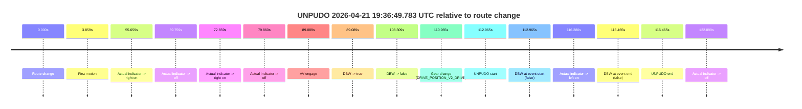
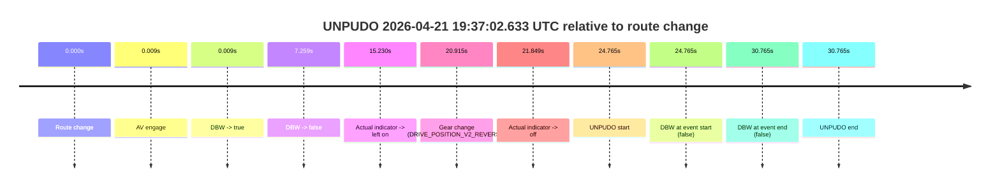
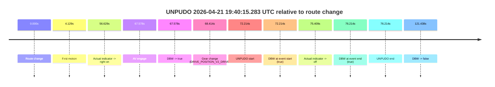
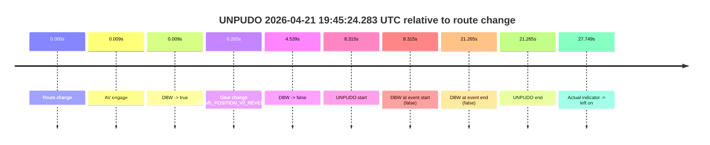
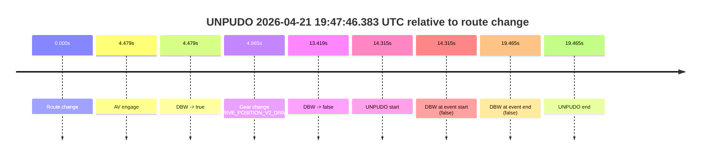
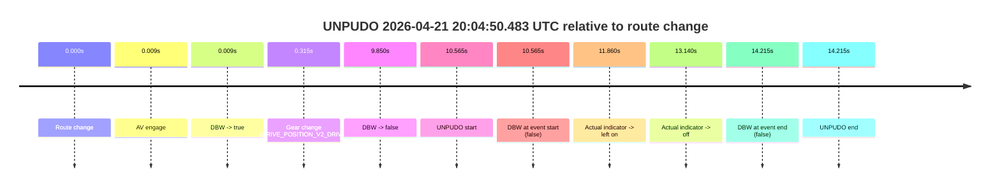
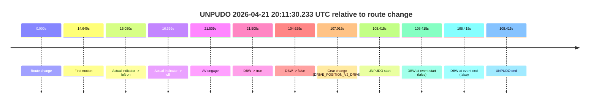
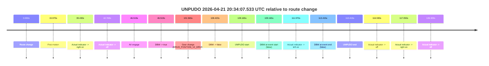
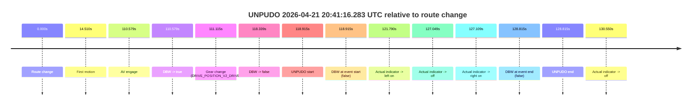
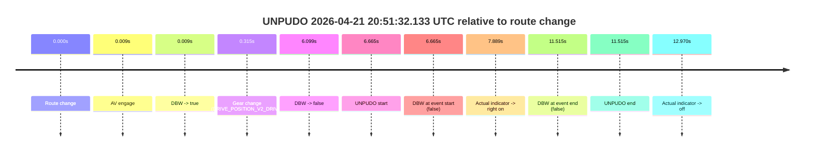

# Run Report: fme10005/2026-04-21--19-22-29--gen2-av-317481e0-4c9f-4033-96a4-619458685d04

| Field | Value |
|---|---|
| Run ID | `fme10005/2026-04-21--19-22-29--gen2-av-317481e0-4c9f-4033-96a4-619458685d04` |
| Date | `2026-04-21` |
| Model(s) | `pink-manta-ray-smooth` |
| Author | `guy.geva` |
| Event count | `12` |

## unpudo 2026-04-21 19:36:49.783 UTC

| Field | Value |
|---|---|
| Model | `pink-manta-ray-smooth` |
| Author | `guy.geva` |
| Run ID | `fme10005/2026-04-21--19-22-29--gen2-av-317481e0-4c9f-4033-96a4-619458685d04` |
| Date | `2026-04-21` |
| Time (UTC) | `19:36:49.783` |
| Event type | `unpudo` |
| Disengagement type | `failed_to_unpudo` |
| Route change | `found` |
| Console | [run](https://console.sso.wayve.ai/run/fme10005/2026-04-21--19-22-29--gen2-av-317481e0-4c9f-4033-96a4-619458685d04?id=&time-unixus=1776800209783305) |
| Foxglove | [segment](https://app.foxglove.dev/wayve-on-prem/p/prj_0dX18KZdVHg1fmmI/view?ds=foxglove-stream&ds.deviceName=fme10005&ds.start=2026-04-21T19%3A34%3A46.818256Z&ds.end=2026-04-21T19%3A37%3A03.283289Z&layoutId=lay_0e7VD4WIKDQGU73Y&time=2026-04-21T19%3A36%3A49.783305Z) |

### Event card: fail

- Fail: AV owns part of the segment, but the event still resolves as a model-performance failure under the AV-only scoring rule.

| Event | Time (UTC) | Delta from route change |
|---|---:|---:|
| Route change | 2026-04-21 19:34:56.818 | `0.000s` |
| First motion | 2026-04-21 19:35:00.677 | `3.859s` |
| Actual indicator -> right on | 2026-04-21 19:35:52.477 | `55.659s` |
| Actual indicator -> off | 2026-04-21 19:35:56.577 | `59.759s` |
| Actual indicator -> right on | 2026-04-21 19:36:09.477 | `72.659s` |
| Actual indicator -> off | 2026-04-21 19:36:16.677 | `79.860s` |
| AV engage | 2026-04-21 19:36:25.906 | `89.089s` |
| DBW -> true | 2026-04-21 19:36:25.906 | `89.089s` |
| DBW -> false | 2026-04-21 19:36:45.126 | `108.309s` |
| Gear change (DRIVE_POSITION_V2_DRIVE) | 2026-04-21 19:36:47.783 | `110.965s` |
| UNPUDO start | 2026-04-21 19:36:49.783 | `112.965s` |
| DBW at event start (false) | 2026-04-21 19:36:49.783 | `112.965s` |
| Actual indicator -> left on | 2026-04-21 19:36:53.097 | `116.280s` |
| DBW at event end (false) | 2026-04-21 19:36:53.283 | `116.465s` |
| UNPUDO end | 2026-04-21 19:36:53.283 | `116.465s` |
| Actual indicator -> off | 2026-04-21 19:36:59.717 | `122.899s` |

| Metric | Value |
|---|---|
| Outcome | `fail` |
| Effective failure type | `failed_to_unpudo` |
| Route change status | `found` |
| DBW at event start | `false` |
| DBW at event end | `false` |
| Predicted gear at AV start | `DRIVE_POSITION_V2_PARK` |
| Actual gear at AV start | `DRIVE_POSITION_V2_PARK` |
| Predicted gear at event start | `DRIVE_POSITION_V2_DRIVE` |
| Actual gear at event start | `DRIVE_POSITION_V2_DRIVE` |
| Planned indicator direction | `INDICATORS_STATE_V2_LEFT_ON` |
| Controller indicator direction | `INDICATORS_STATE_V2_LEFT_ON` |
| Actual indicator direction | `INDICATORS_STATE_V2_OFF` |
| Actual indicator at maneuver end | `INDICATORS_STATE_V2_LEFT_ON` |
| Driver accel help in AV | `false` |
| Driver accel help timestamp | `n/a` |
| Max accel pedal pct in AV | `0.0%` |
| Max brake pedal pct in AV | `8.0%` |
| Max speed mps in AV | `0.000` |
| Success timing baseline | `route change` |
| Route -> AV | `89.089s` |
| AV -> event start | `23.877s` |
| AV -> first motion | `-85.229s` |
| Success baseline -> event start | `112.965s` |
| Success baseline -> first motion | `3.859s` |
| AV duration before disengagement | `19.220s` |
| Trajectory waypoint count | `36` |
| Driving-plan step count | `11` |

The scored portion starts from the AV-owned window, not from the pre-AV setup. Route-change search in the stopped pre-event segment was `found`, with the baseline therefore set to route change. At the event anchor the model predicts `DRIVE_POSITION_V2_DRIVE` and the actual gear is `DRIVE_POSITION_V2_DRIVE`. The effective model outcome is `fail` because `failed_to_unpudo.`

### Resolution

| Field | Value |
|---|---|
| Final outcome | `fail` |
| Do we agree with this label? | `yes` |
| Source disengagement type | `failed_to_unpudo` |
| Resolved effective failure type | `failed_to_unpudo` |
| Confidence | `high` |

## unpudo 2026-04-21 19:37:02.633 UTC

| Field | Value |
|---|---|
| Model | `pink-manta-ray-smooth` |
| Author | `guy.geva` |
| Run ID | `fme10005/2026-04-21--19-22-29--gen2-av-317481e0-4c9f-4033-96a4-619458685d04` |
| Date | `2026-04-21` |
| Time (UTC) | `19:37:02.633` |
| Event type | `unpudo` |
| Disengagement type | `none observed` |
| Route change | `found` |
| Console | [run](https://console.sso.wayve.ai/run/fme10005/2026-04-21--19-22-29--gen2-av-317481e0-4c9f-4033-96a4-619458685d04?id=&time-unixus=1776800222633297) |
| Foxglove | [segment](https://app.foxglove.dev/wayve-on-prem/p/prj_0dX18KZdVHg1fmmI/view?ds=foxglove-stream&ds.deviceName=fme10005&ds.start=2026-04-21T19%3A36%3A27.868272Z&ds.end=2026-04-21T19%3A37%3A18.633289Z&layoutId=lay_0e7VD4WIKDQGU73Y&time=2026-04-21T19%3A37%3A02.633297Z) |

### Event card: fail

- Fail: the credited unpudo does not stay AV-owned. The event window starts with DBW false, and the maneuver outcome lands outside a clean AV-owned segment.

| Event | Time (UTC) | Delta from route change |
|---|---:|---:|
| Route change | 2026-04-21 19:36:37.868 | `0.000s` |
| AV engage | 2026-04-21 19:36:37.876 | `0.009s` |
| DBW -> true | 2026-04-21 19:36:37.876 | `0.009s` |
| DBW -> false | 2026-04-21 19:36:45.126 | `7.259s` |
| Actual indicator -> left on | 2026-04-21 19:36:53.097 | `15.230s` |
| Gear change (DRIVE_POSITION_V2_REVERSE) | 2026-04-21 19:36:58.783 | `20.915s` |
| Actual indicator -> off | 2026-04-21 19:36:59.717 | `21.849s` |
| UNPUDO start | 2026-04-21 19:37:02.633 | `24.765s` |
| DBW at event start (false) | 2026-04-21 19:37:02.633 | `24.765s` |
| DBW at event end (false) | 2026-04-21 19:37:08.633 | `30.765s` |
| UNPUDO end | 2026-04-21 19:37:08.633 | `30.765s` |

| Metric | Value |
|---|---|
| Outcome | `fail` |
| Effective failure type | `not_av_owned` |
| Route change status | `found` |
| DBW at event start | `false` |
| DBW at event end | `false` |
| Predicted gear at AV start | `DRIVE_POSITION_V2_PARK` |
| Actual gear at AV start | `DRIVE_POSITION_V2_PARK` |
| Predicted gear at event start | `DRIVE_POSITION_V2_REVERSE` |
| Actual gear at event start | `DRIVE_POSITION_V2_REVERSE` |
| Planned indicator direction | `INDICATORS_STATE_V2_OFF` |
| Controller indicator direction | `INDICATORS_STATE_V2_OFF` |
| Actual indicator direction | `INDICATORS_STATE_V2_OFF` |
| Actual indicator at maneuver end | `INDICATORS_STATE_V2_OFF` |
| Driver accel help in AV | `false` |
| Driver accel help timestamp | `n/a` |
| Max accel pedal pct in AV | `0.0%` |
| Max brake pedal pct in AV | `8.0%` |
| Max speed mps in AV | `0.000` |
| Success timing baseline | `route change` |
| Route -> AV | `0.009s` |
| AV -> event start | `24.757s` |
| AV -> first motion | `n/a` |
| Success baseline -> event start | `24.765s` |
| Success baseline -> first motion | `n/a` |
| AV duration before disengagement | `7.250s` |
| Trajectory waypoint count | `35` |
| Driving-plan step count | `11` |

The scored portion starts from the AV-owned window, not from the pre-AV setup. Route-change search in the stopped pre-event segment was `found`, with the baseline therefore set to route change. At the event anchor the model predicts `DRIVE_POSITION_V2_REVERSE` and the actual gear is `DRIVE_POSITION_V2_REVERSE`. The effective model outcome is `fail` because `not_av_owned.`

### Resolution

| Field | Value |
|---|---|
| Final outcome | `fail` |
| Do we agree with this label? | `yes` |
| Source disengagement type | `none observed` |
| Resolved effective failure type | `not_av_owned` |
| Confidence | `high` |

## unpudo 2026-04-21 19:40:15.283 UTC

| Field | Value |
|---|---|
| Model | `pink-manta-ray-smooth` |
| Author | `guy.geva` |
| Run ID | `fme10005/2026-04-21--19-22-29--gen2-av-317481e0-4c9f-4033-96a4-619458685d04` |
| Date | `2026-04-21` |
| Time (UTC) | `19:40:15.283` |
| Event type | `unpudo` |
| Disengagement type | `none observed` |
| Route change | `found` |
| Console | [run](https://console.sso.wayve.ai/run/fme10005/2026-04-21--19-22-29--gen2-av-317481e0-4c9f-4033-96a4-619458685d04?id=&time-unixus=1776800415283300) |
| Foxglove | [segment](https://app.foxglove.dev/wayve-on-prem/p/prj_0dX18KZdVHg1fmmI/view?ds=foxglove-stream&ds.deviceName=fme10005&ds.start=2026-04-21T19%3A38%3A53.068968Z&ds.end=2026-04-21T19%3A41%3A14.507198Z&layoutId=lay_0e7VD4WIKDQGU73Y&time=2026-04-21T19%3A40%3A15.283300Z) |

### Event card: pass

- Pass: AV owns the credited unpudo from route change through the official unpudo window, the gear state is aligned at the anchor, and the vehicle moves without driver accelerator help in AV.

| Event | Time (UTC) | Delta from route change |
|---|---:|---:|
| Route change | 2026-04-21 19:39:03.068 | `0.000s` |
| First motion | 2026-04-21 19:39:07.198 | `4.129s` |
| Actual indicator -> right on | 2026-04-21 19:39:59.698 | `56.629s` |
| AV engage | 2026-04-21 19:40:10.646 | `67.578s` |
| DBW -> true | 2026-04-21 19:40:10.646 | `67.578s` |
| Gear change (DRIVE_POSITION_V2_DRIVE) | 2026-04-21 19:40:11.483 | `68.414s` |
| UNPUDO start | 2026-04-21 19:40:15.283 | `72.214s` |
| DBW at event start (true) | 2026-04-21 19:40:15.283 | `72.214s` |
| Actual indicator -> off | 2026-04-21 19:40:18.477 | `75.409s` |
| DBW at event end (true) | 2026-04-21 19:40:19.283 | `76.214s` |
| UNPUDO end | 2026-04-21 19:40:19.283 | `76.214s` |
| DBW -> false | 2026-04-21 19:41:04.507 | `121.438s` |

| Metric | Value |
|---|---|
| Outcome | `pass` |
| Effective failure type | `none` |
| Route change status | `found` |
| DBW at event start | `true` |
| DBW at event end | `true` |
| Predicted gear at AV start | `DRIVE_POSITION_V2_PARK` |
| Actual gear at AV start | `DRIVE_POSITION_V2_DRIVE` |
| Predicted gear at event start | `DRIVE_POSITION_V2_DRIVE` |
| Actual gear at event start | `DRIVE_POSITION_V2_DRIVE` |
| Planned indicator direction | `INDICATORS_STATE_V2_RIGHT_ON` |
| Controller indicator direction | `INDICATORS_STATE_V2_RIGHT_ON` |
| Actual indicator direction | `INDICATORS_STATE_V2_RIGHT_ON` |
| Actual indicator at maneuver end | `INDICATORS_STATE_V2_OFF` |
| Driver accel help in AV | `false` |
| Driver accel help timestamp | `n/a` |
| Max accel pedal pct in AV | `0.0%` |
| Max brake pedal pct in AV | `8.0%` |
| Max speed mps in AV | `4.883` |
| Success timing baseline | `route change` |
| Route -> AV | `67.578s` |
| AV -> event start | `4.636s` |
| AV -> first motion | `-63.449s` |
| Success baseline -> event start | `72.214s` |
| Success baseline -> first motion | `4.129s` |
| AV duration before disengagement | `53.860s` |
| Trajectory waypoint count | `36` |
| Driving-plan step count | `11` |

The scored portion starts from the AV-owned window, not from the pre-AV setup. Route-change search in the stopped pre-event segment was `found`, with the baseline therefore set to route change. At the event anchor the model predicts `DRIVE_POSITION_V2_DRIVE` and the actual gear is `DRIVE_POSITION_V2_DRIVE`. The effective model outcome is `pass` because `the credited unpudo stays AV-owned through the official unpudo window.`

### Resolution

| Field | Value |
|---|---|
| Final outcome | `pass` |
| Do we agree with this label? | `yes` |
| Source disengagement type | `none observed` |
| Resolved effective failure type | `none` |
| Confidence | `high` |

## unpudo 2026-04-21 19:41:05.083 UTC

| Field | Value |
|---|---|
| Model | `pink-manta-ray-smooth` |
| Author | `guy.geva` |
| Run ID | `fme10005/2026-04-21--19-22-29--gen2-av-317481e0-4c9f-4033-96a4-619458685d04` |
| Date | `2026-04-21` |
| Time (UTC) | `19:41:05.083` |
| Event type | `unpudo` |
| Disengagement type | `failed_to_unpudo` |
| Route change | `found` |
| Console | [run](https://console.sso.wayve.ai/run/fme10005/2026-04-21--19-22-29--gen2-av-317481e0-4c9f-4033-96a4-619458685d04?id=&time-unixus=1776800465083295) |
| Foxglove | [segment](https://app.foxglove.dev/wayve-on-prem/p/prj_0dX18KZdVHg1fmmI/view?ds=foxglove-stream&ds.deviceName=fme10005&ds.start=2026-04-21T19%3A40%3A47.218299Z&ds.end=2026-04-21T19%3A41%3A31.033319Z&layoutId=lay_0e7VD4WIKDQGU73Y&time=2026-04-21T19%3A41%3A05.083295Z) |

### Event card: fail

- Fail: AV owns part of the segment, but the event still resolves as a model-performance failure under the AV-only scoring rule.

| Event | Time (UTC) | Delta from route change |
|---|---:|---:|
| Route change | 2026-04-21 19:40:57.218 | `0.000s` |
| AV engage | 2026-04-21 19:40:57.226 | `0.008s` |
| DBW -> true | 2026-04-21 19:40:57.226 | `0.008s` |
| Gear change (DRIVE_POSITION_V2_DRIVE) | 2026-04-21 19:40:57.533 | `0.315s` |
| DBW -> false | 2026-04-21 19:41:04.507 | `7.289s` |
| UNPUDO start | 2026-04-21 19:41:05.083 | `7.865s` |
| DBW at event start (false) | 2026-04-21 19:41:05.083 | `7.865s` |
| DBW at event end (false) | 2026-04-21 19:41:21.033 | `23.815s` |
| UNPUDO end | 2026-04-21 19:41:21.033 | `23.815s` |

| Metric | Value |
|---|---|
| Outcome | `fail` |
| Effective failure type | `failed_to_unpudo` |
| Route change status | `found` |
| DBW at event start | `false` |
| DBW at event end | `false` |
| Predicted gear at AV start | `DRIVE_POSITION_V2_PARK` |
| Actual gear at AV start | `DRIVE_POSITION_V2_PARK` |
| Predicted gear at event start | `DRIVE_POSITION_V2_DRIVE` |
| Actual gear at event start | `DRIVE_POSITION_V2_DRIVE` |
| Planned indicator direction | `INDICATORS_STATE_V2_OFF` |
| Controller indicator direction | `INDICATORS_STATE_V2_OFF` |
| Actual indicator direction | `INDICATORS_STATE_V2_OFF` |
| Actual indicator at maneuver end | `INDICATORS_STATE_V2_OFF` |
| Driver accel help in AV | `false` |
| Driver accel help timestamp | `n/a` |
| Max accel pedal pct in AV | `0.0%` |
| Max brake pedal pct in AV | `8.0%` |
| Max speed mps in AV | `0.000` |
| Success timing baseline | `route change` |
| Route -> AV | `0.008s` |
| AV -> event start | `7.857s` |
| AV -> first motion | `n/a` |
| Success baseline -> event start | `7.865s` |
| Success baseline -> first motion | `n/a` |
| AV duration before disengagement | `7.280s` |
| Trajectory waypoint count | `36` |
| Driving-plan step count | `11` |

The scored portion starts from the AV-owned window, not from the pre-AV setup. Route-change search in the stopped pre-event segment was `found`, with the baseline therefore set to route change. At the event anchor the model predicts `DRIVE_POSITION_V2_DRIVE` and the actual gear is `DRIVE_POSITION_V2_DRIVE`. The effective model outcome is `fail` because `failed_to_unpudo.`

### Resolution

| Field | Value |
|---|---|
| Final outcome | `fail` |
| Do we agree with this label? | `yes` |
| Source disengagement type | `failed_to_unpudo` |
| Resolved effective failure type | `failed_to_unpudo` |
| Confidence | `high` |

## unpudo 2026-04-21 19:45:24.283 UTC

| Field | Value |
|---|---|
| Model | `pink-manta-ray-smooth` |
| Author | `guy.geva` |
| Run ID | `fme10005/2026-04-21--19-22-29--gen2-av-317481e0-4c9f-4033-96a4-619458685d04` |
| Date | `2026-04-21` |
| Time (UTC) | `19:45:24.283` |
| Event type | `unpudo` |
| Disengagement type | `failed_to_unpudo` |
| Route change | `found` |
| Console | [run](https://console.sso.wayve.ai/run/fme10005/2026-04-21--19-22-29--gen2-av-317481e0-4c9f-4033-96a4-619458685d04?id=&time-unixus=1776800724283301) |
| Foxglove | [segment](https://app.foxglove.dev/wayve-on-prem/p/prj_0dX18KZdVHg1fmmI/view?ds=foxglove-stream&ds.deviceName=fme10005&ds.start=2026-04-21T19%3A45%3A05.968254Z&ds.end=2026-04-21T19%3A45%3A47.233318Z&layoutId=lay_0e7VD4WIKDQGU73Y&time=2026-04-21T19%3A45%3A24.283301Z) |

### Event card: fail

- Fail: AV owns part of the segment, but the event still resolves as a model-performance failure under the AV-only scoring rule.

| Event | Time (UTC) | Delta from route change |
|---|---:|---:|
| Route change | 2026-04-21 19:45:15.968 | `0.000s` |
| AV engage | 2026-04-21 19:45:15.976 | `0.009s` |
| DBW -> true | 2026-04-21 19:45:15.976 | `0.009s` |
| Gear change (DRIVE_POSITION_V2_REVERSE) | 2026-04-21 19:45:16.233 | `0.265s` |
| DBW -> false | 2026-04-21 19:45:20.506 | `4.539s` |
| UNPUDO start | 2026-04-21 19:45:24.283 | `8.315s` |
| DBW at event start (false) | 2026-04-21 19:45:24.283 | `8.315s` |
| DBW at event end (false) | 2026-04-21 19:45:37.233 | `21.265s` |
| UNPUDO end | 2026-04-21 19:45:37.233 | `21.265s` |
| Actual indicator -> left on | 2026-04-21 19:45:43.717 | `27.749s` |

| Metric | Value |
|---|---|
| Outcome | `fail` |
| Effective failure type | `failed_to_unpudo` |
| Route change status | `found` |
| DBW at event start | `false` |
| DBW at event end | `false` |
| Predicted gear at AV start | `DRIVE_POSITION_V2_PARK` |
| Actual gear at AV start | `DRIVE_POSITION_V2_PARK` |
| Predicted gear at event start | `DRIVE_POSITION_V2_REVERSE` |
| Actual gear at event start | `DRIVE_POSITION_V2_REVERSE` |
| Planned indicator direction | `INDICATORS_STATE_V2_OFF` |
| Controller indicator direction | `INDICATORS_STATE_V2_OFF` |
| Actual indicator direction | `INDICATORS_STATE_V2_OFF` |
| Actual indicator at maneuver end | `INDICATORS_STATE_V2_OFF` |
| Driver accel help in AV | `false` |
| Driver accel help timestamp | `n/a` |
| Max accel pedal pct in AV | `0.0%` |
| Max brake pedal pct in AV | `10.0%` |
| Max speed mps in AV | `0.000` |
| Success timing baseline | `route change` |
| Route -> AV | `0.009s` |
| AV -> event start | `8.307s` |
| AV -> first motion | `n/a` |
| Success baseline -> event start | `8.315s` |
| Success baseline -> first motion | `n/a` |
| AV duration before disengagement | `4.530s` |
| Trajectory waypoint count | `36` |
| Driving-plan step count | `11` |

The scored portion starts from the AV-owned window, not from the pre-AV setup. Route-change search in the stopped pre-event segment was `found`, with the baseline therefore set to route change. At the event anchor the model predicts `DRIVE_POSITION_V2_REVERSE` and the actual gear is `DRIVE_POSITION_V2_REVERSE`. The effective model outcome is `fail` because `failed_to_unpudo.`

### Resolution

| Field | Value |
|---|---|
| Final outcome | `fail` |
| Do we agree with this label? | `yes` |
| Source disengagement type | `failed_to_unpudo` |
| Resolved effective failure type | `failed_to_unpudo` |
| Confidence | `high` |

## unpudo 2026-04-21 19:47:46.383 UTC

| Field | Value |
|---|---|
| Model | `pink-manta-ray-smooth` |
| Author | `guy.geva` |
| Run ID | `fme10005/2026-04-21--19-22-29--gen2-av-317481e0-4c9f-4033-96a4-619458685d04` |
| Date | `2026-04-21` |
| Time (UTC) | `19:47:46.383` |
| Event type | `unpudo` |
| Disengagement type | `failed_to_unpudo` |
| Route change | `found` |
| Console | [run](https://console.sso.wayve.ai/run/fme10005/2026-04-21--19-22-29--gen2-av-317481e0-4c9f-4033-96a4-619458685d04?id=&time-unixus=1776800866383310) |
| Foxglove | [segment](https://app.foxglove.dev/wayve-on-prem/p/prj_0dX18KZdVHg1fmmI/view?ds=foxglove-stream&ds.deviceName=fme10005&ds.start=2026-04-21T19%3A47%3A22.068346Z&ds.end=2026-04-21T19%3A48%3A01.533301Z&layoutId=lay_0e7VD4WIKDQGU73Y&time=2026-04-21T19%3A47%3A46.383310Z) |

### Event card: fail

- Fail: AV owns part of the segment, but the event still resolves as a model-performance failure under the AV-only scoring rule.

| Event | Time (UTC) | Delta from route change |
|---|---:|---:|
| Route change | 2026-04-21 19:47:32.068 | `0.000s` |
| AV engage | 2026-04-21 19:47:36.546 | `4.479s` |
| DBW -> true | 2026-04-21 19:47:36.546 | `4.479s` |
| Gear change (DRIVE_POSITION_V2_DRIVE) | 2026-04-21 19:47:37.033 | `4.965s` |
| DBW -> false | 2026-04-21 19:47:45.487 | `13.419s` |
| UNPUDO start | 2026-04-21 19:47:46.383 | `14.315s` |
| DBW at event start (false) | 2026-04-21 19:47:46.383 | `14.315s` |
| DBW at event end (false) | 2026-04-21 19:47:51.533 | `19.465s` |
| UNPUDO end | 2026-04-21 19:47:51.533 | `19.465s` |

| Metric | Value |
|---|---|
| Outcome | `fail` |
| Effective failure type | `failed_to_unpudo` |
| Route change status | `found` |
| DBW at event start | `false` |
| DBW at event end | `false` |
| Predicted gear at AV start | `DRIVE_POSITION_V2_DRIVE` |
| Actual gear at AV start | `DRIVE_POSITION_V2_PARK` |
| Predicted gear at event start | `DRIVE_POSITION_V2_DRIVE` |
| Actual gear at event start | `DRIVE_POSITION_V2_DRIVE` |
| Planned indicator direction | `INDICATORS_STATE_V2_LEFT_ON` |
| Controller indicator direction | `INDICATORS_STATE_V2_LEFT_ON` |
| Actual indicator direction | `INDICATORS_STATE_V2_OFF` |
| Actual indicator at maneuver end | `INDICATORS_STATE_V2_OFF` |
| Driver accel help in AV | `false` |
| Driver accel help timestamp | `n/a` |
| Max accel pedal pct in AV | `0.0%` |
| Max brake pedal pct in AV | `8.0%` |
| Max speed mps in AV | `0.000` |
| Success timing baseline | `route change` |
| Route -> AV | `4.479s` |
| AV -> event start | `9.836s` |
| AV -> first motion | `n/a` |
| Success baseline -> event start | `14.315s` |
| Success baseline -> first motion | `n/a` |
| AV duration before disengagement | `8.940s` |
| Trajectory waypoint count | `36` |
| Driving-plan step count | `11` |

The scored portion starts from the AV-owned window, not from the pre-AV setup. Route-change search in the stopped pre-event segment was `found`, with the baseline therefore set to route change. At the event anchor the model predicts `DRIVE_POSITION_V2_DRIVE` and the actual gear is `DRIVE_POSITION_V2_DRIVE`. The effective model outcome is `fail` because `failed_to_unpudo.`

### Resolution

| Field | Value |
|---|---|
| Final outcome | `fail` |
| Do we agree with this label? | `yes` |
| Source disengagement type | `failed_to_unpudo` |
| Resolved effective failure type | `failed_to_unpudo` |
| Confidence | `high` |

## unpudo 2026-04-21 20:04:50.483 UTC

| Field | Value |
|---|---|
| Model | `pink-manta-ray-smooth` |
| Author | `guy.geva` |
| Run ID | `fme10005/2026-04-21--19-22-29--gen2-av-317481e0-4c9f-4033-96a4-619458685d04` |
| Date | `2026-04-21` |
| Time (UTC) | `20:04:50.483` |
| Event type | `unpudo` |
| Disengagement type | `failed_to_unpudo` |
| Route change | `found` |
| Console | [run](https://console.sso.wayve.ai/run/fme10005/2026-04-21--19-22-29--gen2-av-317481e0-4c9f-4033-96a4-619458685d04?id=&time-unixus=1776801890483296) |
| Foxglove | [segment](https://app.foxglove.dev/wayve-on-prem/p/prj_0dX18KZdVHg1fmmI/view?ds=foxglove-stream&ds.deviceName=fme10005&ds.start=2026-04-21T20%3A04%3A29.918274Z&ds.end=2026-04-21T20%3A05%3A04.133317Z&layoutId=lay_0e7VD4WIKDQGU73Y&time=2026-04-21T20%3A04%3A50.483296Z) |

### Event card: fail

- Fail: AV owns part of the segment, but the event still resolves as a model-performance failure under the AV-only scoring rule.

| Event | Time (UTC) | Delta from route change |
|---|---:|---:|
| Route change | 2026-04-21 20:04:39.918 | `0.000s` |
| AV engage | 2026-04-21 20:04:39.926 | `0.009s` |
| DBW -> true | 2026-04-21 20:04:39.926 | `0.009s` |
| Gear change (DRIVE_POSITION_V2_DRIVE) | 2026-04-21 20:04:40.233 | `0.315s` |
| DBW -> false | 2026-04-21 20:04:49.768 | `9.850s` |
| UNPUDO start | 2026-04-21 20:04:50.483 | `10.565s` |
| DBW at event start (false) | 2026-04-21 20:04:50.483 | `10.565s` |
| Actual indicator -> left on | 2026-04-21 20:04:51.777 | `11.860s` |
| Actual indicator -> off | 2026-04-21 20:04:53.057 | `13.140s` |
| DBW at event end (false) | 2026-04-21 20:04:54.133 | `14.215s` |
| UNPUDO end | 2026-04-21 20:04:54.133 | `14.215s` |

| Metric | Value |
|---|---|
| Outcome | `fail` |
| Effective failure type | `failed_to_unpudo` |
| Route change status | `found` |
| DBW at event start | `false` |
| DBW at event end | `false` |
| Predicted gear at AV start | `DRIVE_POSITION_V2_PARK` |
| Actual gear at AV start | `DRIVE_POSITION_V2_PARK` |
| Predicted gear at event start | `DRIVE_POSITION_V2_DRIVE` |
| Actual gear at event start | `DRIVE_POSITION_V2_DRIVE` |
| Planned indicator direction | `INDICATORS_STATE_V2_LEFT_ON` |
| Controller indicator direction | `INDICATORS_STATE_V2_LEFT_ON` |
| Actual indicator direction | `INDICATORS_STATE_V2_OFF` |
| Actual indicator at maneuver end | `INDICATORS_STATE_V2_OFF` |
| Driver accel help in AV | `false` |
| Driver accel help timestamp | `n/a` |
| Max accel pedal pct in AV | `0.0%` |
| Max brake pedal pct in AV | `8.0%` |
| Max speed mps in AV | `0.000` |
| Success timing baseline | `route change` |
| Route -> AV | `0.009s` |
| AV -> event start | `10.557s` |
| AV -> first motion | `n/a` |
| Success baseline -> event start | `10.565s` |
| Success baseline -> first motion | `n/a` |
| AV duration before disengagement | `9.842s` |
| Trajectory waypoint count | `36` |
| Driving-plan step count | `11` |

The scored portion starts from the AV-owned window, not from the pre-AV setup. Route-change search in the stopped pre-event segment was `found`, with the baseline therefore set to route change. At the event anchor the model predicts `DRIVE_POSITION_V2_DRIVE` and the actual gear is `DRIVE_POSITION_V2_DRIVE`. The effective model outcome is `fail` because `failed_to_unpudo.`

### Resolution

| Field | Value |
|---|---|
| Final outcome | `fail` |
| Do we agree with this label? | `yes` |
| Source disengagement type | `failed_to_unpudo` |
| Resolved effective failure type | `failed_to_unpudo` |
| Confidence | `high` |

## unpudo 2026-04-21 20:09:56.433 UTC

| Field | Value |
|---|---|
| Model | `pink-manta-ray-smooth` |
| Author | `guy.geva` |
| Run ID | `fme10005/2026-04-21--19-22-29--gen2-av-317481e0-4c9f-4033-96a4-619458685d04` |
| Date | `2026-04-21` |
| Time (UTC) | `20:09:56.433` |
| Event type | `unpudo` |
| Disengagement type | `failed_to_unpudo` |
| Route change | `found` |
| Console | [run](https://console.sso.wayve.ai/run/fme10005/2026-04-21--19-22-29--gen2-av-317481e0-4c9f-4033-96a4-619458685d04?id=&time-unixus=1776802196433307) |
| Foxglove | [segment](https://app.foxglove.dev/wayve-on-prem/p/prj_0dX18KZdVHg1fmmI/view?ds=foxglove-stream&ds.deviceName=fme10005&ds.start=2026-04-21T20%3A09%3A31.818265Z&ds.end=2026-04-21T20%3A10%3A10.033318Z&layoutId=lay_0e7VD4WIKDQGU73Y&time=2026-04-21T20%3A09%3A56.433307Z) |

### Event card: fail

- Fail: AV owns part of the segment, but the event still resolves as a model-performance failure under the AV-only scoring rule.

| Event | Time (UTC) | Delta from route change |
|---|---:|---:|
| Route change | 2026-04-21 20:09:41.818 | `0.000s` |
| AV engage | 2026-04-21 20:09:41.826 | `0.008s` |
| DBW -> true | 2026-04-21 20:09:41.826 | `0.008s` |
| Gear change (DRIVE_POSITION_V2_DRIVE) | 2026-04-21 20:09:42.133 | `0.315s` |
| DBW -> false | 2026-04-21 20:09:55.707 | `13.889s` |
| UNPUDO start | 2026-04-21 20:09:56.433 | `14.615s` |
| DBW at event start (false) | 2026-04-21 20:09:56.433 | `14.615s` |
| Actual indicator -> left on | 2026-04-21 20:09:56.897 | `15.080s` |
| Actual indicator -> off | 2026-04-21 20:09:58.517 | `16.699s` |
| DBW at event end (false) | 2026-04-21 20:10:00.033 | `18.215s` |
| UNPUDO end | 2026-04-21 20:10:00.033 | `18.215s` |

| Metric | Value |
|---|---|
| Outcome | `fail` |
| Effective failure type | `failed_to_unpudo` |
| Route change status | `found` |
| DBW at event start | `false` |
| DBW at event end | `false` |
| Predicted gear at AV start | `DRIVE_POSITION_V2_PARK` |
| Actual gear at AV start | `DRIVE_POSITION_V2_PARK` |
| Predicted gear at event start | `DRIVE_POSITION_V2_DRIVE` |
| Actual gear at event start | `DRIVE_POSITION_V2_DRIVE` |
| Planned indicator direction | `INDICATORS_STATE_V2_LEFT_ON` |
| Controller indicator direction | `INDICATORS_STATE_V2_LEFT_ON` |
| Actual indicator direction | `INDICATORS_STATE_V2_OFF` |
| Actual indicator at maneuver end | `INDICATORS_STATE_V2_OFF` |
| Driver accel help in AV | `false` |
| Driver accel help timestamp | `n/a` |
| Max accel pedal pct in AV | `0.0%` |
| Max brake pedal pct in AV | `8.2%` |
| Max speed mps in AV | `0.000` |
| Success timing baseline | `route change` |
| Route -> AV | `0.008s` |
| AV -> event start | `14.607s` |
| AV -> first motion | `n/a` |
| Success baseline -> event start | `14.615s` |
| Success baseline -> first motion | `n/a` |
| AV duration before disengagement | `13.881s` |
| Trajectory waypoint count | `37` |
| Driving-plan step count | `11` |

The scored portion starts from the AV-owned window, not from the pre-AV setup. Route-change search in the stopped pre-event segment was `found`, with the baseline therefore set to route change. At the event anchor the model predicts `DRIVE_POSITION_V2_DRIVE` and the actual gear is `DRIVE_POSITION_V2_DRIVE`. The effective model outcome is `fail` because `failed_to_unpudo.`

### Resolution

| Field | Value |
|---|---|
| Final outcome | `fail` |
| Do we agree with this label? | `yes` |
| Source disengagement type | `failed_to_unpudo` |
| Resolved effective failure type | `failed_to_unpudo` |
| Confidence | `high` |

## unpudo 2026-04-21 20:11:30.233 UTC

| Field | Value |
|---|---|
| Model | `pink-manta-ray-smooth` |
| Author | `guy.geva` |
| Run ID | `fme10005/2026-04-21--19-22-29--gen2-av-317481e0-4c9f-4033-96a4-619458685d04` |
| Date | `2026-04-21` |
| Time (UTC) | `20:11:30.233` |
| Event type | `unpudo` |
| Disengagement type | `uncategorised` |
| Route change | `found` |
| Console | [run](https://console.sso.wayve.ai/run/fme10005/2026-04-21--19-22-29--gen2-av-317481e0-4c9f-4033-96a4-619458685d04?id=&time-unixus=1776802290233301) |
| Foxglove | [segment](https://app.foxglove.dev/wayve-on-prem/p/prj_0dX18KZdVHg1fmmI/view?ds=foxglove-stream&ds.deviceName=fme10005&ds.start=2026-04-21T20%3A09%3A31.818265Z&ds.end=2026-04-21T20%3A11%3A40.233301Z&layoutId=lay_0e7VD4WIKDQGU73Y&time=2026-04-21T20%3A11%3A30.233301Z) |

### Event card: fail

- Fail: AV owns part of the segment, but the event still resolves as a model-performance failure under the AV-only scoring rule.

| Event | Time (UTC) | Delta from route change |
|---|---:|---:|
| Route change | 2026-04-21 20:09:41.818 | `0.000s` |
| First motion | 2026-04-21 20:09:56.457 | `14.640s` |
| Actual indicator -> left on | 2026-04-21 20:09:56.897 | `15.080s` |
| Actual indicator -> off | 2026-04-21 20:09:58.517 | `16.699s` |
| AV engage | 2026-04-21 20:10:03.327 | `21.509s` |
| DBW -> true | 2026-04-21 20:10:03.327 | `21.509s` |
| DBW -> false | 2026-04-21 20:11:26.447 | `104.629s` |
| Gear change (DRIVE_POSITION_V2_DRIVE) | 2026-04-21 20:11:28.833 | `107.015s` |
| UNPUDO start | 2026-04-21 20:11:30.233 | `108.415s` |
| DBW at event start (false) | 2026-04-21 20:11:30.233 | `108.415s` |
| DBW at event end (false) | 2026-04-21 20:11:30.233 | `108.415s` |
| UNPUDO end | 2026-04-21 20:11:30.233 | `108.415s` |

| Metric | Value |
|---|---|
| Outcome | `fail` |
| Effective failure type | `uncategorised` |
| Route change status | `found` |
| DBW at event start | `false` |
| DBW at event end | `false` |
| Predicted gear at AV start | `DRIVE_POSITION_V2_DRIVE` |
| Actual gear at AV start | `DRIVE_POSITION_V2_DRIVE` |
| Predicted gear at event start | `DRIVE_POSITION_V2_DRIVE` |
| Actual gear at event start | `DRIVE_POSITION_V2_DRIVE` |
| Planned indicator direction | `INDICATORS_STATE_V2_LEFT_ON` |
| Controller indicator direction | `INDICATORS_STATE_V2_LEFT_ON` |
| Actual indicator direction | `INDICATORS_STATE_V2_OFF` |
| Actual indicator at maneuver end | `INDICATORS_STATE_V2_OFF` |
| Driver accel help in AV | `false` |
| Driver accel help timestamp | `n/a` |
| Max accel pedal pct in AV | `0.0%` |
| Max brake pedal pct in AV | `8.6%` |
| Max speed mps in AV | `12.839` |
| Success timing baseline | `route change` |
| Route -> AV | `21.509s` |
| AV -> event start | `86.906s` |
| AV -> first motion | `-6.870s` |
| Success baseline -> event start | `108.415s` |
| Success baseline -> first motion | `14.640s` |
| AV duration before disengagement | `83.120s` |
| Trajectory waypoint count | `37` |
| Driving-plan step count | `11` |

The scored portion starts from the AV-owned window, not from the pre-AV setup. Route-change search in the stopped pre-event segment was `found`, with the baseline therefore set to route change. At the event anchor the model predicts `DRIVE_POSITION_V2_DRIVE` and the actual gear is `DRIVE_POSITION_V2_DRIVE`. The effective model outcome is `fail` because `uncategorised.`

### Resolution

| Field | Value |
|---|---|
| Final outcome | `fail` |
| Do we agree with this label? | `yes` |
| Source disengagement type | `uncategorised` |
| Resolved effective failure type | `uncategorised` |
| Confidence | `high` |

## unpudo 2026-04-21 20:34:07.533 UTC

| Field | Value |
|---|---|
| Model | `pink-manta-ray-smooth` |
| Author | `guy.geva` |
| Run ID | `fme10005/2026-04-21--19-22-29--gen2-av-317481e0-4c9f-4033-96a4-619458685d04` |
| Date | `2026-04-21` |
| Time (UTC) | `20:34:07.533` |
| Event type | `unpudo` |
| Disengagement type | `failed_to_unpudo` |
| Route change | `found` |
| Console | [run](https://console.sso.wayve.ai/run/fme10005/2026-04-21--19-22-29--gen2-av-317481e0-4c9f-4033-96a4-619458685d04?id=&time-unixus=1776803647533307) |
| Foxglove | [segment](https://app.foxglove.dev/wayve-on-prem/p/prj_0dX18KZdVHg1fmmI/view?ds=foxglove-stream&ds.deviceName=fme10005&ds.start=2026-04-21T20%3A32%3A08.368248Z&ds.end=2026-04-21T20%3A34%3A21.783293Z&layoutId=lay_0e7VD4WIKDQGU73Y&time=2026-04-21T20%3A34%3A07.533307Z) |

### Event card: fail

- Fail: AV owns part of the segment, but the event still resolves as a model-performance failure under the AV-only scoring rule.

| Event | Time (UTC) | Delta from route change |
|---|---:|---:|
| Route change | 2026-04-21 20:32:18.368 | `0.000s` |
| First motion | 2026-04-21 20:32:34.337 | `15.970s` |
| Actual indicator -> right on | 2026-04-21 20:32:57.797 | `39.430s` |
| Actual indicator -> off | 2026-04-21 20:33:01.137 | `42.769s` |
| AV engage | 2026-04-21 20:33:04.887 | `46.519s` |
| DBW -> true | 2026-04-21 20:33:04.887 | `46.519s` |
| Gear change (DRIVE_POSITION_V2_DRIVE) | 2026-04-21 20:33:59.933 | `101.565s` |
| DBW -> false | 2026-04-21 20:34:06.788 | `108.420s` |
| UNPUDO start | 2026-04-21 20:34:07.533 | `109.165s` |
| DBW at event start (false) | 2026-04-21 20:34:07.533 | `109.165s` |
| Actual indicator -> left on | 2026-04-21 20:34:10.337 | `111.970s` |
| DBW at event end (false) | 2026-04-21 20:34:11.783 | `113.415s` |
| UNPUDO end | 2026-04-21 20:34:11.783 | `113.415s` |
| Actual indicator -> off | 2026-04-21 20:34:14.958 | `116.590s` |
| Actual indicator -> right on | 2026-04-21 20:34:15.418 | `117.050s` |
| Actual indicator -> off | 2026-04-21 20:34:24.677 | `126.309s` |

| Metric | Value |
|---|---|
| Outcome | `fail` |
| Effective failure type | `failed_to_unpudo` |
| Route change status | `found` |
| DBW at event start | `false` |
| DBW at event end | `false` |
| Predicted gear at AV start | `DRIVE_POSITION_V2_DRIVE` |
| Actual gear at AV start | `DRIVE_POSITION_V2_DRIVE` |
| Predicted gear at event start | `DRIVE_POSITION_V2_DRIVE` |
| Actual gear at event start | `DRIVE_POSITION_V2_DRIVE` |
| Planned indicator direction | `INDICATORS_STATE_V2_OFF` |
| Controller indicator direction | `INDICATORS_STATE_V2_OFF` |
| Actual indicator direction | `INDICATORS_STATE_V2_OFF` |
| Actual indicator at maneuver end | `INDICATORS_STATE_V2_LEFT_ON` |
| Driver accel help in AV | `false` |
| Driver accel help timestamp | `n/a` |
| Max accel pedal pct in AV | `0.0%` |
| Max brake pedal pct in AV | `8.0%` |
| Max speed mps in AV | `12.431` |
| Success timing baseline | `route change` |
| Route -> AV | `46.519s` |
| AV -> event start | `62.646s` |
| AV -> first motion | `-30.550s` |
| Success baseline -> event start | `109.165s` |
| Success baseline -> first motion | `15.970s` |
| AV duration before disengagement | `61.901s` |
| Trajectory waypoint count | `37` |
| Driving-plan step count | `11` |

The scored portion starts from the AV-owned window, not from the pre-AV setup. Route-change search in the stopped pre-event segment was `found`, with the baseline therefore set to route change. At the event anchor the model predicts `DRIVE_POSITION_V2_DRIVE` and the actual gear is `DRIVE_POSITION_V2_DRIVE`. The effective model outcome is `fail` because `failed_to_unpudo.`

### Resolution

| Field | Value |
|---|---|
| Final outcome | `fail` |
| Do we agree with this label? | `yes` |
| Source disengagement type | `failed_to_unpudo` |
| Resolved effective failure type | `failed_to_unpudo` |
| Confidence | `high` |

## unpudo 2026-04-21 20:41:16.283 UTC

| Field | Value |
|---|---|
| Model | `pink-manta-ray-smooth` |
| Author | `guy.geva` |
| Run ID | `fme10005/2026-04-21--19-22-29--gen2-av-317481e0-4c9f-4033-96a4-619458685d04` |
| Date | `2026-04-21` |
| Time (UTC) | `20:41:16.283` |
| Event type | `unpudo` |
| Disengagement type | `failed_to_unpudo` |
| Route change | `found` |
| Console | [run](https://console.sso.wayve.ai/run/fme10005/2026-04-21--19-22-29--gen2-av-317481e0-4c9f-4033-96a4-619458685d04?id=&time-unixus=1776804076283298) |
| Foxglove | [segment](https://app.foxglove.dev/wayve-on-prem/p/prj_0dX18KZdVHg1fmmI/view?ds=foxglove-stream&ds.deviceName=fme10005&ds.start=2026-04-21T20%3A39%3A07.368251Z&ds.end=2026-04-21T20%3A41%3A36.183306Z&layoutId=lay_0e7VD4WIKDQGU73Y&time=2026-04-21T20%3A41%3A16.283298Z) |

### Event card: fail

- Fail: AV owns part of the segment, but the event still resolves as a model-performance failure under the AV-only scoring rule.

| Event | Time (UTC) | Delta from route change |
|---|---:|---:|
| Route change | 2026-04-21 20:39:17.368 | `0.000s` |
| First motion | 2026-04-21 20:39:31.877 | `14.510s` |
| AV engage | 2026-04-21 20:41:07.946 | `110.579s` |
| DBW -> true | 2026-04-21 20:41:07.946 | `110.579s` |
| Gear change (DRIVE_POSITION_V2_DRIVE) | 2026-04-21 20:41:08.483 | `111.115s` |
| DBW -> false | 2026-04-21 20:41:15.707 | `118.339s` |
| UNPUDO start | 2026-04-21 20:41:16.283 | `118.915s` |
| DBW at event start (false) | 2026-04-21 20:41:16.283 | `118.915s` |
| Actual indicator -> left on | 2026-04-21 20:41:19.157 | `121.790s` |
| Actual indicator -> off | 2026-04-21 20:41:24.417 | `127.049s` |
| Actual indicator -> right on | 2026-04-21 20:41:24.477 | `127.109s` |
| DBW at event end (false) | 2026-04-21 20:41:26.183 | `128.815s` |
| UNPUDO end | 2026-04-21 20:41:26.183 | `128.815s` |
| Actual indicator -> off | 2026-04-21 20:41:27.917 | `130.550s` |

| Metric | Value |
|---|---|
| Outcome | `fail` |
| Effective failure type | `failed_to_unpudo` |
| Route change status | `found` |
| DBW at event start | `false` |
| DBW at event end | `false` |
| Predicted gear at AV start | `DRIVE_POSITION_V2_DRIVE` |
| Actual gear at AV start | `DRIVE_POSITION_V2_PARK` |
| Predicted gear at event start | `DRIVE_POSITION_V2_DRIVE` |
| Actual gear at event start | `DRIVE_POSITION_V2_DRIVE` |
| Planned indicator direction | `INDICATORS_STATE_V2_OFF` |
| Controller indicator direction | `INDICATORS_STATE_V2_OFF` |
| Actual indicator direction | `INDICATORS_STATE_V2_OFF` |
| Actual indicator at maneuver end | `INDICATORS_STATE_V2_RIGHT_ON` |
| Driver accel help in AV | `false` |
| Driver accel help timestamp | `n/a` |
| Max accel pedal pct in AV | `0.0%` |
| Max brake pedal pct in AV | `8.1%` |
| Max speed mps in AV | `0.000` |
| Success timing baseline | `route change` |
| Route -> AV | `110.579s` |
| AV -> event start | `8.336s` |
| AV -> first motion | `-96.069s` |
| Success baseline -> event start | `118.915s` |
| Success baseline -> first motion | `14.510s` |
| AV duration before disengagement | `7.760s` |
| Trajectory waypoint count | `36` |
| Driving-plan step count | `11` |

The scored portion starts from the AV-owned window, not from the pre-AV setup. Route-change search in the stopped pre-event segment was `found`, with the baseline therefore set to route change. At the event anchor the model predicts `DRIVE_POSITION_V2_DRIVE` and the actual gear is `DRIVE_POSITION_V2_DRIVE`. The effective model outcome is `fail` because `failed_to_unpudo.`

### Resolution

| Field | Value |
|---|---|
| Final outcome | `fail` |
| Do we agree with this label? | `yes` |
| Source disengagement type | `failed_to_unpudo` |
| Resolved effective failure type | `failed_to_unpudo` |
| Confidence | `high` |

## unpudo 2026-04-21 20:51:32.133 UTC

| Field | Value |
|---|---|
| Model | `pink-manta-ray-smooth` |
| Author | `guy.geva` |
| Run ID | `fme10005/2026-04-21--19-22-29--gen2-av-317481e0-4c9f-4033-96a4-619458685d04` |
| Date | `2026-04-21` |
| Time (UTC) | `20:51:32.133` |
| Event type | `unpudo` |
| Disengagement type | `failed_to_unpudo` |
| Route change | `found` |
| Console | [run](https://console.sso.wayve.ai/run/fme10005/2026-04-21--19-22-29--gen2-av-317481e0-4c9f-4033-96a4-619458685d04?id=&time-unixus=1776804692133301) |
| Foxglove | [segment](https://app.foxglove.dev/wayve-on-prem/p/prj_0dX18KZdVHg1fmmI/view?ds=foxglove-stream&ds.deviceName=fme10005&ds.start=2026-04-21T20%3A51%3A15.468257Z&ds.end=2026-04-21T20%3A51%3A46.983321Z&layoutId=lay_0e7VD4WIKDQGU73Y&time=2026-04-21T20%3A51%3A32.133301Z) |

### Event card: fail

- Fail: AV owns part of the segment, but the event still resolves as a model-performance failure under the AV-only scoring rule.

| Event | Time (UTC) | Delta from route change |
|---|---:|---:|
| Route change | 2026-04-21 20:51:25.468 | `0.000s` |
| AV engage | 2026-04-21 20:51:25.476 | `0.009s` |
| DBW -> true | 2026-04-21 20:51:25.476 | `0.009s` |
| Gear change (DRIVE_POSITION_V2_DRIVE) | 2026-04-21 20:51:25.783 | `0.315s` |
| DBW -> false | 2026-04-21 20:51:31.567 | `6.099s` |
| UNPUDO start | 2026-04-21 20:51:32.133 | `6.665s` |
| DBW at event start (false) | 2026-04-21 20:51:32.133 | `6.665s` |
| Actual indicator -> right on | 2026-04-21 20:51:33.357 | `7.889s` |
| DBW at event end (false) | 2026-04-21 20:51:36.983 | `11.515s` |
| UNPUDO end | 2026-04-21 20:51:36.983 | `11.515s` |
| Actual indicator -> off | 2026-04-21 20:51:38.437 | `12.970s` |

| Metric | Value |
|---|---|
| Outcome | `fail` |
| Effective failure type | `failed_to_unpudo` |
| Route change status | `found` |
| DBW at event start | `false` |
| DBW at event end | `false` |
| Predicted gear at AV start | `DRIVE_POSITION_V2_PARK` |
| Actual gear at AV start | `DRIVE_POSITION_V2_PARK` |
| Predicted gear at event start | `DRIVE_POSITION_V2_DRIVE` |
| Actual gear at event start | `DRIVE_POSITION_V2_DRIVE` |
| Planned indicator direction | `INDICATORS_STATE_V2_OFF` |
| Controller indicator direction | `INDICATORS_STATE_V2_OFF` |
| Actual indicator direction | `INDICATORS_STATE_V2_OFF` |
| Actual indicator at maneuver end | `INDICATORS_STATE_V2_RIGHT_ON` |
| Driver accel help in AV | `false` |
| Driver accel help timestamp | `n/a` |
| Max accel pedal pct in AV | `0.0%` |
| Max brake pedal pct in AV | `8.0%` |
| Max speed mps in AV | `0.000` |
| Success timing baseline | `route change` |
| Route -> AV | `0.009s` |
| AV -> event start | `6.656s` |
| AV -> first motion | `n/a` |
| Success baseline -> event start | `6.665s` |
| Success baseline -> first motion | `n/a` |
| AV duration before disengagement | `6.091s` |
| Trajectory waypoint count | `35` |
| Driving-plan step count | `11` |

The scored portion starts from the AV-owned window, not from the pre-AV setup. Route-change search in the stopped pre-event segment was `found`, with the baseline therefore set to route change. At the event anchor the model predicts `DRIVE_POSITION_V2_DRIVE` and the actual gear is `DRIVE_POSITION_V2_DRIVE`. The effective model outcome is `fail` because `failed_to_unpudo.`

### Resolution

| Field | Value |
|---|---|
| Final outcome | `fail` |
| Do we agree with this label? | `yes` |
| Source disengagement type | `failed_to_unpudo` |
| Resolved effective failure type | `failed_to_unpudo` |
| Confidence | `high` |
