# Run Report: fme10005/2026-04-21--19-22-29--gen2-av-317481e0-4c9f-4033-96a4-619458685d04

| Field | Value |
|---|---|
| Run ID | `fme10005/2026-04-21--19-22-29--gen2-av-317481e0-4c9f-4033-96a4-619458685d04` |
| Date | `2026-04-21` |
| Model(s) | `eel-teal-outspoken` |
| Author | `zak` |
| Event count | `26` |

## unpudo 2026-04-21 19:30:38.383 UTC

| Field | Value |
|---|---|
| Model | `eel-teal-outspoken` |
| Author | `zak` |
| Run ID | `fme10005/2026-04-21--19-22-29--gen2-av-317481e0-4c9f-4033-96a4-619458685d04` |
| Date | `2026-04-21` |
| Time (UTC) | `19:30:38.383` |
| Event type | `unpudo` |
| Disengagement type | `failed_to_unpudo` |
| Route change | `found` |
| Console | [run](https://console.sso.wayve.ai/run/fme10005/2026-04-21--19-22-29--gen2-av-317481e0-4c9f-4033-96a4-619458685d04?id=&time-unixus=1776799838383299) |
| Foxglove | [segment](https://app.foxglove.dev/wayve-on-prem/p/prj_0dX18KZdVHg1fmmI/view?ds=foxglove-stream&ds.deviceName=fme10005&ds.start=2026-04-21T19%3A30%3A15.718287Z&ds.end=2026-04-21T19%3A30%3A55.933296Z&layoutId=lay_0e7VD4WIKDQGU73Y&time=2026-04-21T19%3A30%3A38.383299Z) |

### Event card: fail

- Fail: AV owns part of the segment, but the event still resolves as a model-performance failure under the AV-only scoring rule.

| Event | Time (UTC) | Delta from route change |
|---|---:|---:|
| Route change | 2026-04-21 19:30:25.718 | `0.000s` |
| AV engage | 2026-04-21 19:30:25.726 | `0.009s` |
| DBW -> true | 2026-04-21 19:30:25.726 | `0.009s` |
| Gear change (DRIVE_POSITION_V2_REVERSE) | 2026-04-21 19:30:25.983 | `0.265s` |
| DBW -> false | 2026-04-21 19:30:34.146 | `8.428s` |
| UNPUDO start | 2026-04-21 19:30:38.383 | `12.665s` |
| DBW at event start (false) | 2026-04-21 19:30:38.383 | `12.665s` |
| DBW at event end (false) | 2026-04-21 19:30:45.933 | `20.215s` |
| UNPUDO end | 2026-04-21 19:30:45.933 | `20.215s` |

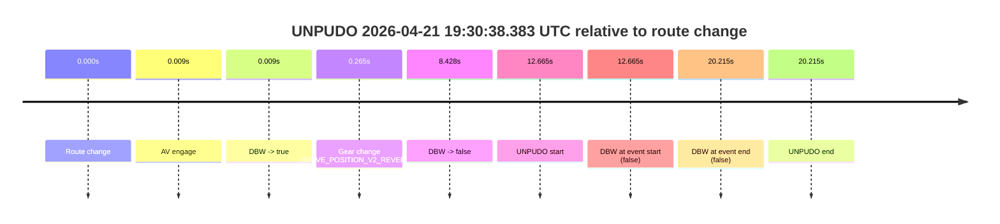

| Metric | Value |
|---|---|
| Outcome | `fail` |
| Effective failure type | `failed_to_unpudo` |
| Route change status | `found` |
| DBW at event start | `false` |
| DBW at event end | `false` |
| Predicted gear at AV start | `DRIVE_POSITION_V2_PARK` |
| Actual gear at AV start | `DRIVE_POSITION_V2_PARK` |
| Predicted gear at event start | `DRIVE_POSITION_V2_REVERSE` |
| Actual gear at event start | `DRIVE_POSITION_V2_REVERSE` |
| Planned indicator direction | `INDICATORS_STATE_V2_OFF` |
| Controller indicator direction | `INDICATORS_STATE_V2_OFF` |
| Actual indicator direction | `INDICATORS_STATE_V2_OFF` |
| Actual indicator at maneuver end | `INDICATORS_STATE_V2_OFF` |
| Driver accel help in AV | `false` |
| Driver accel help timestamp | `n/a` |
| Max accel pedal pct in AV | `0.0%` |
| Max brake pedal pct in AV | `8.1%` |
| Max speed mps in AV | `0.000` |
| Success timing baseline | `route change` |
| Route -> AV | `0.009s` |
| AV -> event start | `12.657s` |
| AV -> first motion | `n/a` |
| Success baseline -> event start | `12.665s` |
| Success baseline -> first motion | `n/a` |
| AV duration before disengagement | `8.420s` |
| Trajectory waypoint count | `36` |
| Driving-plan step count | `11` |

The scored portion starts from the AV-owned window, not from the pre-AV setup. Route-change search in the stopped pre-event segment was `found`, with the baseline therefore set to route change. At the event anchor the model predicts `DRIVE_POSITION_V2_REVERSE` and the actual gear is `DRIVE_POSITION_V2_REVERSE`. The effective model outcome is `fail` because `failed_to_unpudo.`

### Resolution

| Field | Value |
|---|---|
| Final outcome | `fail` |
| Do we agree with this label? | `yes` |
| Source disengagement type | `failed_to_unpudo` |
| Resolved effective failure type | `failed_to_unpudo` |
| Confidence | `high` |

## unpudo 2026-04-21 19:34:08.583 UTC

| Field | Value |
|---|---|
| Model | `eel-teal-outspoken` |
| Author | `zak` |
| Run ID | `fme10005/2026-04-21--19-22-29--gen2-av-317481e0-4c9f-4033-96a4-619458685d04` |
| Date | `2026-04-21` |
| Time (UTC) | `19:34:08.583` |
| Event type | `unpudo` |
| Disengagement type | `none observed` |
| Route change | `found` |
| Console | [run](https://console.sso.wayve.ai/run/fme10005/2026-04-21--19-22-29--gen2-av-317481e0-4c9f-4033-96a4-619458685d04?id=&time-unixus=1776800048583309) |
| Foxglove | [segment](https://app.foxglove.dev/wayve-on-prem/p/prj_0dX18KZdVHg1fmmI/view?ds=foxglove-stream&ds.deviceName=fme10005&ds.start=2026-04-21T19%3A33%3A51.918436Z&ds.end=2026-04-21T19%3A36%3A01.228523Z&layoutId=lay_0e7VD4WIKDQGU73Y&time=2026-04-21T19%3A34%3A08.583309Z) |

### Event card: pass

- Pass: AV owns the credited unpudo from route change through the official unpudo window, the gear state is aligned at the anchor, and the vehicle moves without driver accelerator help in AV.

| Event | Time (UTC) | Delta from route change |
|---|---:|---:|
| Route change | 2026-04-21 19:34:01.918 | `0.000s` |
| AV engage | 2026-04-21 19:34:01.926 | `0.008s` |
| DBW -> true | 2026-04-21 19:34:01.926 | `0.008s` |
| Gear change (DRIVE_POSITION_V2_DRIVE) | 2026-04-21 19:34:03.283 | `1.365s` |
| UNPUDO start | 2026-04-21 19:34:08.583 | `6.665s` |
| DBW at event start (true) | 2026-04-21 19:34:08.583 | `6.665s` |
| First motion | 2026-04-21 19:34:08.598 | `6.680s` |
| DBW at event end (true) | 2026-04-21 19:34:12.083 | `10.165s` |
| UNPUDO end | 2026-04-21 19:34:12.083 | `10.165s` |
| DBW -> false | 2026-04-21 19:35:51.228 | `109.310s` |
| Actual indicator -> right on | 2026-04-21 19:35:52.477 | `110.559s` |
| Actual indicator -> off | 2026-04-21 19:35:56.577 | `114.659s` |
| Actual indicator -> right on | 2026-04-21 19:36:09.477 | `127.559s` |


| Metric | Value |
|---|---|
| Outcome | `pass` |
| Effective failure type | `none` |
| Route change status | `found` |
| DBW at event start | `true` |
| DBW at event end | `true` |
| Predicted gear at AV start | `DRIVE_POSITION_V2_PARK` |
| Actual gear at AV start | `DRIVE_POSITION_V2_PARK` |
| Predicted gear at event start | `DRIVE_POSITION_V2_DRIVE` |
| Actual gear at event start | `DRIVE_POSITION_V2_DRIVE` |
| Planned indicator direction | `INDICATORS_STATE_V2_LEFT_ON` |
| Controller indicator direction | `INDICATORS_STATE_V2_LEFT_ON` |
| Actual indicator direction | `INDICATORS_STATE_V2_OFF` |
| Actual indicator at maneuver end | `INDICATORS_STATE_V2_OFF` |
| Driver accel help in AV | `false` |
| Driver accel help timestamp | `n/a` |
| Max accel pedal pct in AV | `0.0%` |
| Max brake pedal pct in AV | `8.0%` |
| Max speed mps in AV | `5.906` |
| Success timing baseline | `route change` |
| Route -> AV | `0.008s` |
| AV -> event start | `6.656s` |
| AV -> first motion | `6.672s` |
| Success baseline -> event start | `6.665s` |
| Success baseline -> first motion | `6.680s` |
| AV duration before disengagement | `109.302s` |
| Trajectory waypoint count | `36` |
| Driving-plan step count | `11` |

The scored portion starts from the AV-owned window, not from the pre-AV setup. Route-change search in the stopped pre-event segment was `found`, with the baseline therefore set to route change. At the event anchor the model predicts `DRIVE_POSITION_V2_DRIVE` and the actual gear is `DRIVE_POSITION_V2_DRIVE`. The effective model outcome is `pass` because `the credited unpudo stays AV-owned through the official unpudo window.`

### Resolution

| Field | Value |
|---|---|
| Final outcome | `pass` |
| Do we agree with this label? | `yes` |
| Source disengagement type | `none observed` |
| Resolved effective failure type | `none` |
| Confidence | `high` |

## unpudo 2026-04-21 19:35:00.633 UTC

| Field | Value |
|---|---|
| Model | `eel-teal-outspoken` |
| Author | `zak` |
| Run ID | `fme10005/2026-04-21--19-22-29--gen2-av-317481e0-4c9f-4033-96a4-619458685d04` |
| Date | `2026-04-21` |
| Time (UTC) | `19:35:00.633` |
| Event type | `unpudo` |
| Disengagement type | `none observed` |
| Route change | `found` |
| Console | [run](https://console.sso.wayve.ai/run/fme10005/2026-04-21--19-22-29--gen2-av-317481e0-4c9f-4033-96a4-619458685d04?id=&time-unixus=1776800100633293) |
| Foxglove | [segment](https://app.foxglove.dev/wayve-on-prem/p/prj_0dX18KZdVHg1fmmI/view?ds=foxglove-stream&ds.deviceName=fme10005&ds.start=2026-04-21T19%3A33%3A51.918436Z&ds.end=2026-04-21T19%3A36%3A01.228523Z&layoutId=lay_0e7VD4WIKDQGU73Y&time=2026-04-21T19%3A35%3A00.633293Z) |

### Event card: pass

- Pass: AV owns the credited unpudo from route change through the official unpudo window, the gear state is aligned at the anchor, and the vehicle moves without driver accelerator help in AV.

| Event | Time (UTC) | Delta from route change |
|---|---:|---:|
| Route change | 2026-04-21 19:34:01.918 | `0.000s` |
| AV engage | 2026-04-21 19:34:01.926 | `0.008s` |
| DBW -> true | 2026-04-21 19:34:01.926 | `0.008s` |
| First motion | 2026-04-21 19:34:08.598 | `6.680s` |
| Gear change (DRIVE_POSITION_V2_DRIVE) | 2026-04-21 19:34:57.083 | `55.165s` |
| UNPUDO start | 2026-04-21 19:35:00.633 | `58.715s` |
| DBW at event start (true) | 2026-04-21 19:35:00.633 | `58.715s` |
| DBW at event end (true) | 2026-04-21 19:35:04.083 | `62.165s` |
| UNPUDO end | 2026-04-21 19:35:04.083 | `62.165s` |
| DBW -> false | 2026-04-21 19:35:51.228 | `109.310s` |
| Actual indicator -> right on | 2026-04-21 19:35:52.477 | `110.559s` |
| Actual indicator -> off | 2026-04-21 19:35:56.577 | `114.659s` |
| Actual indicator -> right on | 2026-04-21 19:36:09.477 | `127.559s` |

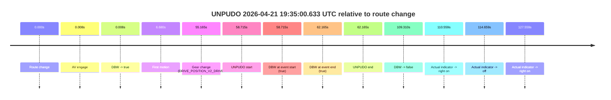

| Metric | Value |
|---|---|
| Outcome | `pass` |
| Effective failure type | `none` |
| Route change status | `found` |
| DBW at event start | `true` |
| DBW at event end | `true` |
| Predicted gear at AV start | `DRIVE_POSITION_V2_PARK` |
| Actual gear at AV start | `DRIVE_POSITION_V2_PARK` |
| Predicted gear at event start | `DRIVE_POSITION_V2_DRIVE` |
| Actual gear at event start | `DRIVE_POSITION_V2_DRIVE` |
| Planned indicator direction | `INDICATORS_STATE_V2_LEFT_ON` |
| Controller indicator direction | `INDICATORS_STATE_V2_LEFT_ON` |
| Actual indicator direction | `INDICATORS_STATE_V2_OFF` |
| Actual indicator at maneuver end | `INDICATORS_STATE_V2_OFF` |
| Driver accel help in AV | `false` |
| Driver accel help timestamp | `n/a` |
| Max accel pedal pct in AV | `0.0%` |
| Max brake pedal pct in AV | `10.8%` |
| Max speed mps in AV | `12.561` |
| Success timing baseline | `route change` |
| Route -> AV | `0.008s` |
| AV -> event start | `58.706s` |
| AV -> first motion | `6.672s` |
| Success baseline -> event start | `58.715s` |
| Success baseline -> first motion | `6.680s` |
| AV duration before disengagement | `109.302s` |
| Trajectory waypoint count | `37` |
| Driving-plan step count | `11` |

The scored portion starts from the AV-owned window, not from the pre-AV setup. Route-change search in the stopped pre-event segment was `found`, with the baseline therefore set to route change. At the event anchor the model predicts `DRIVE_POSITION_V2_DRIVE` and the actual gear is `DRIVE_POSITION_V2_DRIVE`. The effective model outcome is `pass` because `the credited unpudo stays AV-owned through the official unpudo window.`

### Resolution

| Field | Value |
|---|---|
| Final outcome | `pass` |
| Do we agree with this label? | `yes` |
| Source disengagement type | `none observed` |
| Resolved effective failure type | `none` |
| Confidence | `high` |

## unpudo 2026-04-21 19:39:07.083 UTC

| Field | Value |
|---|---|
| Model | `eel-teal-outspoken` |
| Author | `zak` |
| Run ID | `fme10005/2026-04-21--19-22-29--gen2-av-317481e0-4c9f-4033-96a4-619458685d04` |
| Date | `2026-04-21` |
| Time (UTC) | `19:39:07.083` |
| Event type | `unpudo` |
| Disengagement type | `none observed` |
| Route change | `found` |
| Console | [run](https://console.sso.wayve.ai/run/fme10005/2026-04-21--19-22-29--gen2-av-317481e0-4c9f-4033-96a4-619458685d04?id=&time-unixus=1776800347083290) |
| Foxglove | [segment](https://app.foxglove.dev/wayve-on-prem/p/prj_0dX18KZdVHg1fmmI/view?ds=foxglove-stream&ds.deviceName=fme10005&ds.start=2026-04-21T19%3A38%3A53.068968Z&ds.end=2026-04-21T19%3A40%3A09.067275Z&layoutId=lay_0e7VD4WIKDQGU73Y&time=2026-04-21T19%3A39%3A07.083290Z) |

### Event card: pass

- Pass: AV owns the credited unpudo from route change through the official unpudo window, the gear state is aligned at the anchor, and the vehicle moves without driver accelerator help in AV.

| Event | Time (UTC) | Delta from route change |
|---|---:|---:|
| Route change | 2026-04-21 19:39:03.068 | `0.000s` |
| AV engage | 2026-04-21 19:39:03.076 | `0.008s` |
| DBW -> true | 2026-04-21 19:39:03.076 | `0.008s` |
| Gear change (DRIVE_POSITION_V2_DRIVE) | 2026-04-21 19:39:03.333 | `0.264s` |
| UNPUDO start | 2026-04-21 19:39:07.083 | `4.014s` |
| DBW at event start (true) | 2026-04-21 19:39:07.083 | `4.014s` |
| First motion | 2026-04-21 19:39:07.198 | `4.129s` |
| DBW at event end (true) | 2026-04-21 19:39:11.683 | `8.614s` |
| UNPUDO end | 2026-04-21 19:39:11.683 | `8.614s` |
| DBW -> false | 2026-04-21 19:39:59.067 | `55.998s` |
| Actual indicator -> right on | 2026-04-21 19:39:59.698 | `56.629s` |
| Actual indicator -> off | 2026-04-21 19:40:18.477 | `75.409s` |

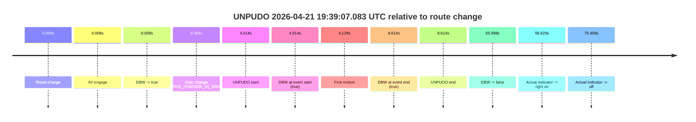

| Metric | Value |
|---|---|
| Outcome | `pass` |
| Effective failure type | `none` |
| Route change status | `found` |
| DBW at event start | `true` |
| DBW at event end | `true` |
| Predicted gear at AV start | `DRIVE_POSITION_V2_PARK` |
| Actual gear at AV start | `DRIVE_POSITION_V2_PARK` |
| Predicted gear at event start | `DRIVE_POSITION_V2_DRIVE` |
| Actual gear at event start | `DRIVE_POSITION_V2_DRIVE` |
| Planned indicator direction | `INDICATORS_STATE_V2_OFF` |
| Controller indicator direction | `INDICATORS_STATE_V2_OFF` |
| Actual indicator direction | `INDICATORS_STATE_V2_OFF` |
| Actual indicator at maneuver end | `INDICATORS_STATE_V2_OFF` |
| Driver accel help in AV | `false` |
| Driver accel help timestamp | `n/a` |
| Max accel pedal pct in AV | `0.0%` |
| Max brake pedal pct in AV | `8.0%` |
| Max speed mps in AV | `2.967` |
| Success timing baseline | `route change` |
| Route -> AV | `0.008s` |
| AV -> event start | `4.006s` |
| AV -> first motion | `4.121s` |
| Success baseline -> event start | `4.014s` |
| Success baseline -> first motion | `4.129s` |
| AV duration before disengagement | `55.990s` |
| Trajectory waypoint count | `36` |
| Driving-plan step count | `11` |

The scored portion starts from the AV-owned window, not from the pre-AV setup. Route-change search in the stopped pre-event segment was `found`, with the baseline therefore set to route change. At the event anchor the model predicts `DRIVE_POSITION_V2_DRIVE` and the actual gear is `DRIVE_POSITION_V2_DRIVE`. The effective model outcome is `pass` because `the credited unpudo stays AV-owned through the official unpudo window.`

### Resolution

| Field | Value |
|---|---|
| Final outcome | `pass` |
| Do we agree with this label? | `yes` |
| Source disengagement type | `none observed` |
| Resolved effective failure type | `none` |
| Confidence | `high` |

## unpudo 2026-04-21 19:42:35.133 UTC

| Field | Value |
|---|---|
| Model | `eel-teal-outspoken` |
| Author | `zak` |
| Run ID | `fme10005/2026-04-21--19-22-29--gen2-av-317481e0-4c9f-4033-96a4-619458685d04` |
| Date | `2026-04-21` |
| Time (UTC) | `19:42:35.133` |
| Event type | `unpudo` |
| Disengagement type | `none observed` |
| Route change | `found` |
| Console | [run](https://console.sso.wayve.ai/run/fme10005/2026-04-21--19-22-29--gen2-av-317481e0-4c9f-4033-96a4-619458685d04?id=&time-unixus=1776800555133308) |
| Foxglove | [segment](https://app.foxglove.dev/wayve-on-prem/p/prj_0dX18KZdVHg1fmmI/view?ds=foxglove-stream&ds.deviceName=fme10005&ds.start=2026-04-21T19%3A40%3A47.218299Z&ds.end=2026-04-21T19%3A43%3A06.727868Z&layoutId=lay_0e7VD4WIKDQGU73Y&time=2026-04-21T19%3A42%3A35.133308Z) |

### Event card: pass

- Pass: AV owns the credited unpudo from route change through the official unpudo window, the gear state is aligned at the anchor, and the vehicle moves without driver accelerator help in AV.

| Event | Time (UTC) | Delta from route change |
|---|---:|---:|
| Route change | 2026-04-21 19:40:57.218 | `0.000s` |
| First motion | 2026-04-21 19:41:05.097 | `7.879s` |
| AV engage | 2026-04-21 19:41:24.407 | `27.189s` |
| DBW -> true | 2026-04-21 19:41:24.407 | `27.189s` |
| Gear change (DRIVE_POSITION_V2_DRIVE) | 2026-04-21 19:42:31.633 | `94.415s` |
| UNPUDO start | 2026-04-21 19:42:35.133 | `97.915s` |
| DBW at event start (true) | 2026-04-21 19:42:35.133 | `97.915s` |
| DBW at event end (true) | 2026-04-21 19:42:39.333 | `102.115s` |
| UNPUDO end | 2026-04-21 19:42:39.333 | `102.115s` |
| DBW -> false | 2026-04-21 19:42:56.727 | `119.510s` |
| Actual indicator -> right on | 2026-04-21 19:42:57.377 | `120.159s` |
| Actual indicator -> off | 2026-04-21 19:43:00.497 | `123.279s` |

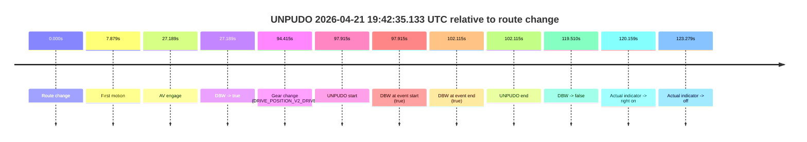

| Metric | Value |
|---|---|
| Outcome | `pass` |
| Effective failure type | `none` |
| Route change status | `found` |
| DBW at event start | `true` |
| DBW at event end | `true` |
| Predicted gear at AV start | `DRIVE_POSITION_V2_DRIVE` |
| Actual gear at AV start | `DRIVE_POSITION_V2_DRIVE` |
| Predicted gear at event start | `DRIVE_POSITION_V2_DRIVE` |
| Actual gear at event start | `DRIVE_POSITION_V2_DRIVE` |
| Planned indicator direction | `INDICATORS_STATE_V2_OFF` |
| Controller indicator direction | `INDICATORS_STATE_V2_OFF` |
| Actual indicator direction | `INDICATORS_STATE_V2_OFF` |
| Actual indicator at maneuver end | `INDICATORS_STATE_V2_OFF` |
| Driver accel help in AV | `false` |
| Driver accel help timestamp | `n/a` |
| Max accel pedal pct in AV | `0.0%` |
| Max brake pedal pct in AV | `8.3%` |
| Max speed mps in AV | `13.247` |
| Success timing baseline | `route change` |
| Route -> AV | `27.189s` |
| AV -> event start | `70.726s` |
| AV -> first motion | `-19.310s` |
| Success baseline -> event start | `97.915s` |
| Success baseline -> first motion | `7.879s` |
| AV duration before disengagement | `92.320s` |
| Trajectory waypoint count | `37` |
| Driving-plan step count | `11` |

The scored portion starts from the AV-owned window, not from the pre-AV setup. Route-change search in the stopped pre-event segment was `found`, with the baseline therefore set to route change. At the event anchor the model predicts `DRIVE_POSITION_V2_DRIVE` and the actual gear is `DRIVE_POSITION_V2_DRIVE`. The effective model outcome is `pass` because `the credited unpudo stays AV-owned through the official unpudo window.`

### Resolution

| Field | Value |
|---|---|
| Final outcome | `pass` |
| Do we agree with this label? | `yes` |
| Source disengagement type | `none observed` |
| Resolved effective failure type | `none` |
| Confidence | `high` |

## unpudo 2026-04-21 19:49:17.183 UTC

| Field | Value |
|---|---|
| Model | `eel-teal-outspoken` |
| Author | `zak` |
| Run ID | `fme10005/2026-04-21--19-22-29--gen2-av-317481e0-4c9f-4033-96a4-619458685d04` |
| Date | `2026-04-21` |
| Time (UTC) | `19:49:17.183` |
| Event type | `unpudo` |
| Disengagement type | `none observed` |
| Route change | `found` |
| Console | [run](https://console.sso.wayve.ai/run/fme10005/2026-04-21--19-22-29--gen2-av-317481e0-4c9f-4033-96a4-619458685d04?id=&time-unixus=1776800957183317) |
| Foxglove | [segment](https://app.foxglove.dev/wayve-on-prem/p/prj_0dX18KZdVHg1fmmI/view?ds=foxglove-stream&ds.deviceName=fme10005&ds.start=2026-04-21T19%3A47%3A22.068346Z&ds.end=2026-04-21T19%3A49%3A39.283310Z&layoutId=lay_0e7VD4WIKDQGU73Y&time=2026-04-21T19%3A49%3A17.183317Z) |

### Event card: fail

- Fail: the credited unpudo does not stay AV-owned. The event window starts with DBW false, and the maneuver outcome lands outside a clean AV-owned segment.

| Event | Time (UTC) | Delta from route change |
|---|---:|---:|
| Route change | 2026-04-21 19:47:32.068 | `0.000s` |
| First motion | 2026-04-21 19:47:46.477 | `14.409s` |
| AV engage | 2026-04-21 19:47:56.207 | `24.140s` |
| DBW -> true | 2026-04-21 19:47:56.207 | `24.140s` |
| DBW -> false | 2026-04-21 19:48:59.866 | `87.799s` |
| Actual indicator -> right on | 2026-04-21 19:49:00.877 | `88.810s` |
| Actual indicator -> off | 2026-04-21 19:49:05.518 | `93.450s` |
| Gear change (DRIVE_POSITION_V2_REVERSE) | 2026-04-21 19:49:14.883 | `102.815s` |
| UNPUDO start | 2026-04-21 19:49:17.183 | `105.115s` |
| DBW at event start (false) | 2026-04-21 19:49:17.183 | `105.115s` |
| DBW at event end (false) | 2026-04-21 19:49:29.283 | `117.215s` |
| UNPUDO end | 2026-04-21 19:49:29.283 | `117.215s` |

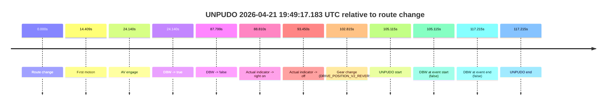

| Metric | Value |
|---|---|
| Outcome | `fail` |
| Effective failure type | `completed_outside_av` |
| Route change status | `found` |
| DBW at event start | `false` |
| DBW at event end | `false` |
| Predicted gear at AV start | `DRIVE_POSITION_V2_DRIVE` |
| Actual gear at AV start | `DRIVE_POSITION_V2_DRIVE` |
| Predicted gear at event start | `DRIVE_POSITION_V2_REVERSE` |
| Actual gear at event start | `DRIVE_POSITION_V2_REVERSE` |
| Planned indicator direction | `INDICATORS_STATE_V2_OFF` |
| Controller indicator direction | `INDICATORS_STATE_V2_OFF` |
| Actual indicator direction | `INDICATORS_STATE_V2_OFF` |
| Actual indicator at maneuver end | `INDICATORS_STATE_V2_OFF` |
| Driver accel help in AV | `false` |
| Driver accel help timestamp | `n/a` |
| Max accel pedal pct in AV | `0.0%` |
| Max brake pedal pct in AV | `4.8%` |
| Max speed mps in AV | `15.061` |
| Success timing baseline | `route change` |
| Route -> AV | `24.140s` |
| AV -> event start | `80.975s` |
| AV -> first motion | `-9.730s` |
| Success baseline -> event start | `105.115s` |
| Success baseline -> first motion | `14.409s` |
| AV duration before disengagement | `63.659s` |
| Trajectory waypoint count | `36` |
| Driving-plan step count | `11` |

The scored portion starts from the AV-owned window, not from the pre-AV setup. Route-change search in the stopped pre-event segment was `found`, with the baseline therefore set to route change. At the event anchor the model predicts `DRIVE_POSITION_V2_REVERSE` and the actual gear is `DRIVE_POSITION_V2_REVERSE`. The effective model outcome is `fail` because `completed_outside_av.`

### Resolution

| Field | Value |
|---|---|
| Final outcome | `fail` |
| Do we agree with this label? | `yes` |
| Source disengagement type | `none observed` |
| Resolved effective failure type | `completed_outside_av` |
| Confidence | `high` |

## unpudo 2026-04-21 19:50:02.033 UTC

| Field | Value |
|---|---|
| Model | `eel-teal-outspoken` |
| Author | `zak` |
| Run ID | `fme10005/2026-04-21--19-22-29--gen2-av-317481e0-4c9f-4033-96a4-619458685d04` |
| Date | `2026-04-21` |
| Time (UTC) | `19:50:02.033` |
| Event type | `unpudo` |
| Disengagement type | `none observed` |
| Route change | `found` |
| Console | [run](https://console.sso.wayve.ai/run/fme10005/2026-04-21--19-22-29--gen2-av-317481e0-4c9f-4033-96a4-619458685d04?id=&time-unixus=1776801002033318) |
| Foxglove | [segment](https://app.foxglove.dev/wayve-on-prem/p/prj_0dX18KZdVHg1fmmI/view?ds=foxglove-stream&ds.deviceName=fme10005&ds.start=2026-04-21T19%3A49%3A42.818405Z&ds.end=2026-04-21T19%3A50%3A32.926653Z&layoutId=lay_0e7VD4WIKDQGU73Y&time=2026-04-21T19%3A50%3A02.033318Z) |

### Event card: pass

- Pass: AV owns the credited unpudo from route change through the official unpudo window, the gear state is aligned at the anchor, and the vehicle moves without driver accelerator help in AV.

| Event | Time (UTC) | Delta from route change |
|---|---:|---:|
| Route change | 2026-04-21 19:49:52.818 | `0.000s` |
| AV engage | 2026-04-21 19:49:58.006 | `5.188s` |
| DBW -> true | 2026-04-21 19:49:58.006 | `5.188s` |
| Gear change (DRIVE_POSITION_V2_DRIVE) | 2026-04-21 19:49:58.533 | `5.715s` |
| UNPUDO start | 2026-04-21 19:50:02.033 | `9.215s` |
| DBW at event start (true) | 2026-04-21 19:50:02.033 | `9.215s` |
| First motion | 2026-04-21 19:50:02.077 | `9.259s` |
| DBW at event end (true) | 2026-04-21 19:50:06.683 | `13.865s` |
| UNPUDO end | 2026-04-21 19:50:06.683 | `13.865s` |
| DBW -> false | 2026-04-21 19:50:22.926 | `30.108s` |
| Actual indicator -> left on | 2026-04-21 19:50:24.177 | `31.359s` |
| Actual indicator -> off | 2026-04-21 19:50:34.817 | `41.999s` |


| Metric | Value |
|---|---|
| Outcome | `pass` |
| Effective failure type | `none` |
| Route change status | `found` |
| DBW at event start | `true` |
| DBW at event end | `true` |
| Predicted gear at AV start | `DRIVE_POSITION_V2_DRIVE` |
| Actual gear at AV start | `DRIVE_POSITION_V2_PARK` |
| Predicted gear at event start | `DRIVE_POSITION_V2_DRIVE` |
| Actual gear at event start | `DRIVE_POSITION_V2_DRIVE` |
| Planned indicator direction | `INDICATORS_STATE_V2_OFF` |
| Controller indicator direction | `INDICATORS_STATE_V2_OFF` |
| Actual indicator direction | `INDICATORS_STATE_V2_OFF` |
| Actual indicator at maneuver end | `INDICATORS_STATE_V2_OFF` |
| Driver accel help in AV | `false` |
| Driver accel help timestamp | `n/a` |
| Max accel pedal pct in AV | `0.0%` |
| Max brake pedal pct in AV | `9.0%` |
| Max speed mps in AV | `3.128` |
| Success timing baseline | `route change` |
| Route -> AV | `5.188s` |
| AV -> event start | `4.027s` |
| AV -> first motion | `4.071s` |
| Success baseline -> event start | `9.215s` |
| Success baseline -> first motion | `9.259s` |
| AV duration before disengagement | `24.920s` |
| Trajectory waypoint count | `37` |
| Driving-plan step count | `11` |

The scored portion starts from the AV-owned window, not from the pre-AV setup. Route-change search in the stopped pre-event segment was `found`, with the baseline therefore set to route change. At the event anchor the model predicts `DRIVE_POSITION_V2_DRIVE` and the actual gear is `DRIVE_POSITION_V2_DRIVE`. The effective model outcome is `pass` because `the credited unpudo stays AV-owned through the official unpudo window.`

### Resolution

| Field | Value |
|---|---|
| Final outcome | `pass` |
| Do we agree with this label? | `yes` |
| Source disengagement type | `none observed` |
| Resolved effective failure type | `none` |
| Confidence | `high` |

## unpudo 2026-04-21 19:54:13.783 UTC

| Field | Value |
|---|---|
| Model | `eel-teal-outspoken` |
| Author | `zak` |
| Run ID | `fme10005/2026-04-21--19-22-29--gen2-av-317481e0-4c9f-4033-96a4-619458685d04` |
| Date | `2026-04-21` |
| Time (UTC) | `19:54:13.783` |
| Event type | `unpudo` |
| Disengagement type | `uncategorised` |
| Route change | `unclear` |
| Console | [run](https://console.sso.wayve.ai/run/fme10005/2026-04-21--19-22-29--gen2-av-317481e0-4c9f-4033-96a4-619458685d04?id=&time-unixus=1776801253783318) |
| Foxglove | [segment](https://app.foxglove.dev/wayve-on-prem/p/prj_0dX18KZdVHg1fmmI/view?ds=foxglove-stream&ds.deviceName=fme10005&ds.start=2026-04-21T19%3A52%3A03.787126Z&ds.end=2026-04-21T19%3A54%3A28.583296Z&layoutId=lay_0e7VD4WIKDQGU73Y&time=2026-04-21T19%3A54%3A13.783318Z) |

### Event card: fail

- Fail: AV owns part of the segment, but the event still resolves as a model-performance failure under the AV-only scoring rule.

| Event | Time (UTC) | Delta from AV start |
|---|---:|---:|
| Route change unclear | 2026-04-21 19:52:13.787 | `0.000s` |
| AV engage | 2026-04-21 19:52:13.787 | `0.000s` |
| DBW -> true | 2026-04-21 19:52:13.787 | `0.000s` |
| First motion | 2026-04-21 19:52:27.377 | `13.591s` |
| DBW -> false | 2026-04-21 19:54:10.406 | `116.620s` |
| Gear change (DRIVE_POSITION_V2_DRIVE) | 2026-04-21 19:54:11.783 | `117.996s` |
| UNPUDO start | 2026-04-21 19:54:13.783 | `119.996s` |
| DBW at event start (false) | 2026-04-21 19:54:13.783 | `119.996s` |
| DBW at event end (false) | 2026-04-21 19:54:18.583 | `124.796s` |
| UNPUDO end | 2026-04-21 19:54:18.583 | `124.796s` |

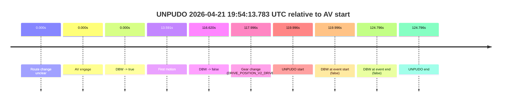

| Metric | Value |
|---|---|
| Outcome | `fail` |
| Effective failure type | `uncategorised` |
| Route change status | `unclear` |
| DBW at event start | `false` |
| DBW at event end | `false` |
| Predicted gear at AV start | `DRIVE_POSITION_V2_DRIVE` |
| Actual gear at AV start | `DRIVE_POSITION_V2_DRIVE` |
| Predicted gear at event start | `DRIVE_POSITION_V2_DRIVE` |
| Actual gear at event start | `DRIVE_POSITION_V2_DRIVE` |
| Planned indicator direction | `INDICATORS_STATE_V2_OFF` |
| Controller indicator direction | `INDICATORS_STATE_V2_OFF` |
| Actual indicator direction | `INDICATORS_STATE_V2_OFF` |
| Actual indicator at maneuver end | `INDICATORS_STATE_V2_OFF` |
| Driver accel help in AV | `false` |
| Driver accel help timestamp | `n/a` |
| Max accel pedal pct in AV | `0.0%` |
| Max brake pedal pct in AV | `10.9%` |
| Max speed mps in AV | `14.864` |
| Success timing baseline | `AV start` |
| Route -> AV | `n/a` |
| AV -> event start | `119.996s` |
| AV -> first motion | `13.591s` |
| Success baseline -> event start | `119.996s` |
| Success baseline -> first motion | `13.591s` |
| AV duration before disengagement | `116.620s` |
| Trajectory waypoint count | `36` |
| Driving-plan step count | `11` |

The scored portion starts from the AV-owned window, not from the pre-AV setup. Route-change search in the stopped pre-event segment was `unclear`, with the baseline therefore set to AV start. At the event anchor the model predicts `DRIVE_POSITION_V2_DRIVE` and the actual gear is `DRIVE_POSITION_V2_DRIVE`. The effective model outcome is `fail` because `uncategorised.`

### Resolution

| Field | Value |
|---|---|
| Final outcome | `fail` |
| Do we agree with this label? | `yes` |
| Source disengagement type | `uncategorised` |
| Resolved effective failure type | `uncategorised` |
| Confidence | `medium` |

## unpudo 2026-04-21 19:55:16.783 UTC

| Field | Value |
|---|---|
| Model | `eel-teal-outspoken` |
| Author | `zak` |
| Run ID | `fme10005/2026-04-21--19-22-29--gen2-av-317481e0-4c9f-4033-96a4-619458685d04` |
| Date | `2026-04-21` |
| Time (UTC) | `19:55:16.783` |
| Event type | `unpudo` |
| Disengagement type | `none observed` |
| Route change | `not found` |
| Console | [run](https://console.sso.wayve.ai/run/fme10005/2026-04-21--19-22-29--gen2-av-317481e0-4c9f-4033-96a4-619458685d04?id=&time-unixus=1776801316783307) |
| Foxglove | [segment](https://app.foxglove.dev/wayve-on-prem/p/prj_0dX18KZdVHg1fmmI/view?ds=foxglove-stream&ds.deviceName=fme10005&ds.start=2026-04-21T19%3A54%3A45.006820Z&ds.end=2026-04-21T19%3A55%3A33.483317Z&layoutId=lay_0e7VD4WIKDQGU73Y&time=2026-04-21T19%3A55%3A16.783307Z) |

### Event card: fail

- Fail: the credited unpudo does not stay AV-owned. The event window starts with DBW false, and the maneuver outcome lands outside a clean AV-owned segment.

| Event | Time (UTC) | Delta from AV start |
|---|---:|---:|
| First motion | 2026-04-21 19:53:16.797 | `-98.209s` |
| Route change not recovered | 2026-04-21 19:54:55.006 | `0.000s` |
| AV engage | 2026-04-21 19:54:55.006 | `0.000s` |
| DBW -> true | 2026-04-21 19:54:55.006 | `0.000s` |
| DBW -> false | 2026-04-21 19:55:13.386 | `18.380s` |
| Gear change (DRIVE_POSITION_V2_DRIVE) | 2026-04-21 19:55:15.383 | `20.376s` |
| UNPUDO start | 2026-04-21 19:55:16.783 | `21.776s` |
| DBW at event start (false) | 2026-04-21 19:55:16.783 | `21.776s` |
| DBW at event end (false) | 2026-04-21 19:55:23.483 | `28.476s` |
| UNPUDO end | 2026-04-21 19:55:23.483 | `28.476s` |
| Actual indicator -> left on | 2026-04-21 19:55:29.357 | `34.351s` |
| Actual indicator -> off | 2026-04-21 19:55:35.757 | `40.751s` |

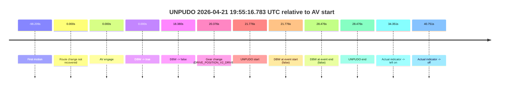

| Metric | Value |
|---|---|
| Outcome | `fail` |
| Effective failure type | `completed_outside_av` |
| Route change status | `not found` |
| DBW at event start | `false` |
| DBW at event end | `false` |
| Predicted gear at AV start | `DRIVE_POSITION_V2_PARK` |
| Actual gear at AV start | `DRIVE_POSITION_V2_PARK` |
| Predicted gear at event start | `DRIVE_POSITION_V2_DRIVE` |
| Actual gear at event start | `DRIVE_POSITION_V2_DRIVE` |
| Planned indicator direction | `INDICATORS_STATE_V2_OFF` |
| Controller indicator direction | `INDICATORS_STATE_V2_OFF` |
| Actual indicator direction | `INDICATORS_STATE_V2_OFF` |
| Actual indicator at maneuver end | `INDICATORS_STATE_V2_OFF` |
| Driver accel help in AV | `false` |
| Driver accel help timestamp | `n/a` |
| Max accel pedal pct in AV | `0.0%` |
| Max brake pedal pct in AV | `8.0%` |
| Max speed mps in AV | `0.000` |
| Success timing baseline | `AV start` |
| Route -> AV | `n/a` |
| AV -> event start | `21.776s` |
| AV -> first motion | `-98.209s` |
| Success baseline -> event start | `21.776s` |
| Success baseline -> first motion | `-98.209s` |
| AV duration before disengagement | `18.380s` |
| Trajectory waypoint count | `36` |
| Driving-plan step count | `11` |

The scored portion starts from the AV-owned window, not from the pre-AV setup. Route-change search in the stopped pre-event segment was `not found`, with the baseline therefore set to AV start. At the event anchor the model predicts `DRIVE_POSITION_V2_DRIVE` and the actual gear is `DRIVE_POSITION_V2_DRIVE`. The effective model outcome is `fail` because `completed_outside_av.`

### Resolution

| Field | Value |
|---|---|
| Final outcome | `fail` |
| Do we agree with this label? | `yes` |
| Source disengagement type | `none observed` |
| Resolved effective failure type | `completed_outside_av` |
| Confidence | `high` |

## unpudo 2026-04-21 19:58:34.433 UTC

| Field | Value |
|---|---|
| Model | `eel-teal-outspoken` |
| Author | `zak` |
| Run ID | `fme10005/2026-04-21--19-22-29--gen2-av-317481e0-4c9f-4033-96a4-619458685d04` |
| Date | `2026-04-21` |
| Time (UTC) | `19:58:34.433` |
| Event type | `unpudo` |
| Disengagement type | `none observed` |
| Route change | `found` |
| Console | [run](https://console.sso.wayve.ai/run/fme10005/2026-04-21--19-22-29--gen2-av-317481e0-4c9f-4033-96a4-619458685d04?id=&time-unixus=1776801514433300) |
| Foxglove | [segment](https://app.foxglove.dev/wayve-on-prem/p/prj_0dX18KZdVHg1fmmI/view?ds=foxglove-stream&ds.deviceName=fme10005&ds.start=2026-04-21T19%3A56%3A48.668294Z&ds.end=2026-04-21T19%3A58%3A50.686588Z&layoutId=lay_0e7VD4WIKDQGU73Y&time=2026-04-21T19%3A58%3A34.433300Z) |

### Event card: pass

- Pass: AV owns the credited unpudo from route change through the official unpudo window, the gear state is aligned at the anchor, and the vehicle moves without driver accelerator help in AV.

| Event | Time (UTC) | Delta from route change |
|---|---:|---:|
| Route change | 2026-04-21 19:56:58.668 | `0.000s` |
| First motion | 2026-04-21 19:57:22.538 | `23.870s` |
| AV engage | 2026-04-21 19:57:27.407 | `28.739s` |
| DBW -> true | 2026-04-21 19:57:27.407 | `28.739s` |
| Gear change (DRIVE_POSITION_V2_DRIVE) | 2026-04-21 19:58:30.933 | `92.265s` |
| UNPUDO start | 2026-04-21 19:58:34.433 | `95.765s` |
| DBW at event start (true) | 2026-04-21 19:58:34.433 | `95.765s` |
| DBW at event end (true) | 2026-04-21 19:58:38.883 | `100.215s` |
| UNPUDO end | 2026-04-21 19:58:38.883 | `100.215s` |
| DBW -> false | 2026-04-21 19:58:40.686 | `102.018s` |

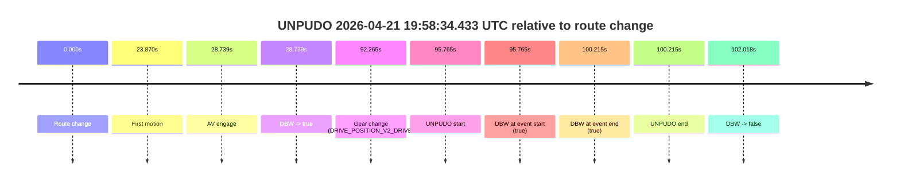

| Metric | Value |
|---|---|
| Outcome | `pass` |
| Effective failure type | `none` |
| Route change status | `found` |
| DBW at event start | `true` |
| DBW at event end | `true` |
| Predicted gear at AV start | `DRIVE_POSITION_V2_DRIVE` |
| Actual gear at AV start | `DRIVE_POSITION_V2_DRIVE` |
| Predicted gear at event start | `DRIVE_POSITION_V2_DRIVE` |
| Actual gear at event start | `DRIVE_POSITION_V2_DRIVE` |
| Planned indicator direction | `INDICATORS_STATE_V2_LEFT_ON` |
| Controller indicator direction | `INDICATORS_STATE_V2_LEFT_ON` |
| Actual indicator direction | `INDICATORS_STATE_V2_OFF` |
| Actual indicator at maneuver end | `INDICATORS_STATE_V2_OFF` |
| Driver accel help in AV | `false` |
| Driver accel help timestamp | `n/a` |
| Max accel pedal pct in AV | `0.0%` |
| Max brake pedal pct in AV | `8.0%` |
| Max speed mps in AV | `4.036` |
| Success timing baseline | `route change` |
| Route -> AV | `28.739s` |
| AV -> event start | `67.026s` |
| AV -> first motion | `-4.869s` |
| Success baseline -> event start | `95.765s` |
| Success baseline -> first motion | `23.870s` |
| AV duration before disengagement | `73.279s` |
| Trajectory waypoint count | `37` |
| Driving-plan step count | `11` |

The scored portion starts from the AV-owned window, not from the pre-AV setup. Route-change search in the stopped pre-event segment was `found`, with the baseline therefore set to route change. At the event anchor the model predicts `DRIVE_POSITION_V2_DRIVE` and the actual gear is `DRIVE_POSITION_V2_DRIVE`. The effective model outcome is `pass` because `the credited unpudo stays AV-owned through the official unpudo window.`

### Resolution

| Field | Value |
|---|---|
| Final outcome | `pass` |
| Do we agree with this label? | `yes` |
| Source disengagement type | `none observed` |
| Resolved effective failure type | `none` |
| Confidence | `high` |

## unpudo 2026-04-21 19:59:00.133 UTC

| Field | Value |
|---|---|
| Model | `eel-teal-outspoken` |
| Author | `zak` |
| Run ID | `fme10005/2026-04-21--19-22-29--gen2-av-317481e0-4c9f-4033-96a4-619458685d04` |
| Date | `2026-04-21` |
| Time (UTC) | `19:59:00.133` |
| Event type | `unpudo` |
| Disengagement type | `none observed` |
| Route change | `found` |
| Console | [run](https://console.sso.wayve.ai/run/fme10005/2026-04-21--19-22-29--gen2-av-317481e0-4c9f-4033-96a4-619458685d04?id=&time-unixus=1776801540133299) |
| Foxglove | [segment](https://app.foxglove.dev/wayve-on-prem/p/prj_0dX18KZdVHg1fmmI/view?ds=foxglove-stream&ds.deviceName=fme10005&ds.start=2026-04-21T19%3A58%3A20.618340Z&ds.end=2026-04-21T19%3A59%3A19.583309Z&layoutId=lay_0e7VD4WIKDQGU73Y&time=2026-04-21T19%3A59%3A00.133299Z) |

### Event card: fail

- Fail: the credited unpudo does not stay AV-owned. The event window starts with DBW false, and the maneuver outcome lands outside a clean AV-owned segment.

| Event | Time (UTC) | Delta from route change |
|---|---:|---:|
| Route change | 2026-04-21 19:58:30.618 | `0.000s` |
| AV engage | 2026-04-21 19:58:30.626 | `0.009s` |
| DBW -> true | 2026-04-21 19:58:30.626 | `0.009s` |
| First motion | 2026-04-21 19:58:34.477 | `3.859s` |
| DBW -> false | 2026-04-21 19:58:40.686 | `10.068s` |
| Gear change (DRIVE_POSITION_V2_REVERSE) | 2026-04-21 19:58:55.383 | `24.765s` |
| UNPUDO start | 2026-04-21 19:59:00.133 | `29.515s` |
| DBW at event start (false) | 2026-04-21 19:59:00.133 | `29.515s` |
| DBW at event end (false) | 2026-04-21 19:59:09.583 | `38.965s` |
| UNPUDO end | 2026-04-21 19:59:09.583 | `38.965s` |

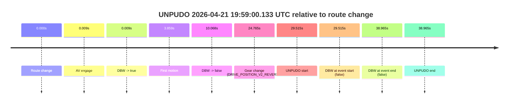

| Metric | Value |
|---|---|
| Outcome | `fail` |
| Effective failure type | `not_av_owned` |
| Route change status | `found` |
| DBW at event start | `false` |
| DBW at event end | `false` |
| Predicted gear at AV start | `DRIVE_POSITION_V2_PARK` |
| Actual gear at AV start | `DRIVE_POSITION_V2_PARK` |
| Predicted gear at event start | `DRIVE_POSITION_V2_REVERSE` |
| Actual gear at event start | `DRIVE_POSITION_V2_REVERSE` |
| Planned indicator direction | `INDICATORS_STATE_V2_OFF` |
| Controller indicator direction | `INDICATORS_STATE_V2_OFF` |
| Actual indicator direction | `INDICATORS_STATE_V2_OFF` |
| Actual indicator at maneuver end | `INDICATORS_STATE_V2_OFF` |
| Driver accel help in AV | `false` |
| Driver accel help timestamp | `n/a` |
| Max accel pedal pct in AV | `0.0%` |
| Max brake pedal pct in AV | `8.0%` |
| Max speed mps in AV | `3.225` |
| Success timing baseline | `route change` |
| Route -> AV | `0.009s` |
| AV -> event start | `29.506s` |
| AV -> first motion | `3.851s` |
| Success baseline -> event start | `29.515s` |
| Success baseline -> first motion | `3.859s` |
| AV duration before disengagement | `10.060s` |
| Trajectory waypoint count | `37` |
| Driving-plan step count | `11` |

The scored portion starts from the AV-owned window, not from the pre-AV setup. Route-change search in the stopped pre-event segment was `found`, with the baseline therefore set to route change. At the event anchor the model predicts `DRIVE_POSITION_V2_REVERSE` and the actual gear is `DRIVE_POSITION_V2_REVERSE`. The effective model outcome is `fail` because `not_av_owned.`

### Resolution

| Field | Value |
|---|---|
| Final outcome | `fail` |
| Do we agree with this label? | `yes` |
| Source disengagement type | `none observed` |
| Resolved effective failure type | `not_av_owned` |
| Confidence | `high` |

## unpudo 2026-04-21 20:07:46.933 UTC

| Field | Value |
|---|---|
| Model | `eel-teal-outspoken` |
| Author | `zak` |
| Run ID | `fme10005/2026-04-21--19-22-29--gen2-av-317481e0-4c9f-4033-96a4-619458685d04` |
| Date | `2026-04-21` |
| Time (UTC) | `20:07:46.933` |
| Event type | `unpudo` |
| Disengagement type | `failed_to_unpudo` |
| Route change | `found` |
| Console | [run](https://console.sso.wayve.ai/run/fme10005/2026-04-21--19-22-29--gen2-av-317481e0-4c9f-4033-96a4-619458685d04?id=&time-unixus=1776802066933306) |
| Foxglove | [segment](https://app.foxglove.dev/wayve-on-prem/p/prj_0dX18KZdVHg1fmmI/view?ds=foxglove-stream&ds.deviceName=fme10005&ds.start=2026-04-21T20%3A07%3A26.618315Z&ds.end=2026-04-21T20%3A08%3A07.383314Z&layoutId=lay_0e7VD4WIKDQGU73Y&time=2026-04-21T20%3A07%3A46.933306Z) |

### Event card: fail

- Fail: AV owns part of the segment, but the event still resolves as a model-performance failure under the AV-only scoring rule.

| Event | Time (UTC) | Delta from route change |
|---|---:|---:|
| Route change | 2026-04-21 20:07:36.618 | `0.000s` |
| AV engage | 2026-04-21 20:07:36.626 | `0.008s` |
| DBW -> true | 2026-04-21 20:07:36.626 | `0.008s` |
| Gear change (DRIVE_POSITION_V2_REVERSE) | 2026-04-21 20:07:37.233 | `0.615s` |
| DBW -> false | 2026-04-21 20:07:43.846 | `7.228s` |
| UNPUDO start | 2026-04-21 20:07:46.933 | `10.315s` |
| DBW at event start (false) | 2026-04-21 20:07:46.933 | `10.315s` |
| DBW at event end (false) | 2026-04-21 20:07:57.383 | `20.765s` |
| UNPUDO end | 2026-04-21 20:07:57.383 | `20.765s` |


| Metric | Value |
|---|---|
| Outcome | `fail` |
| Effective failure type | `failed_to_unpudo` |
| Route change status | `found` |
| DBW at event start | `false` |
| DBW at event end | `false` |
| Predicted gear at AV start | `DRIVE_POSITION_V2_PARK` |
| Actual gear at AV start | `DRIVE_POSITION_V2_PARK` |
| Predicted gear at event start | `DRIVE_POSITION_V2_REVERSE` |
| Actual gear at event start | `DRIVE_POSITION_V2_REVERSE` |
| Planned indicator direction | `INDICATORS_STATE_V2_OFF` |
| Controller indicator direction | `INDICATORS_STATE_V2_OFF` |
| Actual indicator direction | `INDICATORS_STATE_V2_OFF` |
| Actual indicator at maneuver end | `INDICATORS_STATE_V2_OFF` |
| Driver accel help in AV | `false` |
| Driver accel help timestamp | `n/a` |
| Max accel pedal pct in AV | `0.0%` |
| Max brake pedal pct in AV | `8.0%` |
| Max speed mps in AV | `0.000` |
| Success timing baseline | `route change` |
| Route -> AV | `0.008s` |
| AV -> event start | `10.307s` |
| AV -> first motion | `n/a` |
| Success baseline -> event start | `10.315s` |
| Success baseline -> first motion | `n/a` |
| AV duration before disengagement | `7.220s` |
| Trajectory waypoint count | `37` |
| Driving-plan step count | `11` |

The scored portion starts from the AV-owned window, not from the pre-AV setup. Route-change search in the stopped pre-event segment was `found`, with the baseline therefore set to route change. At the event anchor the model predicts `DRIVE_POSITION_V2_REVERSE` and the actual gear is `DRIVE_POSITION_V2_REVERSE`. The effective model outcome is `fail` because `failed_to_unpudo.`

### Resolution

| Field | Value |
|---|---|
| Final outcome | `fail` |
| Do we agree with this label? | `yes` |
| Source disengagement type | `failed_to_unpudo` |
| Resolved effective failure type | `failed_to_unpudo` |
| Confidence | `high` |

## unpudo 2026-04-21 20:16:29.883 UTC

| Field | Value |
|---|---|
| Model | `eel-teal-outspoken` |
| Author | `zak` |
| Run ID | `fme10005/2026-04-21--19-22-29--gen2-av-317481e0-4c9f-4033-96a4-619458685d04` |
| Date | `2026-04-21` |
| Time (UTC) | `20:16:29.883` |
| Event type | `unpudo` |
| Disengagement type | `none observed` |
| Route change | `found` |
| Console | [run](https://console.sso.wayve.ai/run/fme10005/2026-04-21--19-22-29--gen2-av-317481e0-4c9f-4033-96a4-619458685d04?id=&time-unixus=1776802589883306) |
| Foxglove | [segment](https://app.foxglove.dev/wayve-on-prem/p/prj_0dX18KZdVHg1fmmI/view?ds=foxglove-stream&ds.deviceName=fme10005&ds.start=2026-04-21T20%3A16%3A16.018259Z&ds.end=2026-04-21T20%3A16%3A59.006611Z&layoutId=lay_0e7VD4WIKDQGU73Y&time=2026-04-21T20%3A16%3A29.883306Z) |

### Event card: fail

- Fail: AV owns part of the segment, but the event still resolves as a model-performance failure under the AV-only scoring rule.

| Event | Time (UTC) | Delta from route change |
|---|---:|---:|
| Route change | 2026-04-21 20:16:26.018 | `0.000s` |
| AV engage | 2026-04-21 20:16:26.026 | `0.009s` |
| DBW -> true | 2026-04-21 20:16:26.026 | `0.009s` |
| Gear change (DRIVE_POSITION_V2_DRIVE) | 2026-04-21 20:16:26.333 | `0.315s` |
| UNPUDO start | 2026-04-21 20:16:29.883 | `3.865s` |
| DBW at event start (true) | 2026-04-21 20:16:29.883 | `3.865s` |
| DBW at event end (true) | 2026-04-21 20:16:29.883 | `3.865s` |
| UNPUDO end | 2026-04-21 20:16:29.883 | `3.865s` |
| DBW -> false | 2026-04-21 20:16:49.006 | `22.988s` |

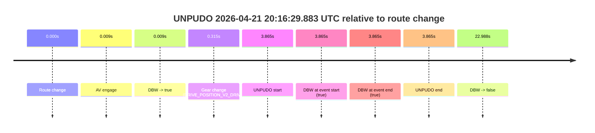

| Metric | Value |
|---|---|
| Outcome | `fail` |
| Effective failure type | `unknown_needs_review` |
| Route change status | `found` |
| DBW at event start | `true` |
| DBW at event end | `true` |
| Predicted gear at AV start | `DRIVE_POSITION_V2_PARK` |
| Actual gear at AV start | `DRIVE_POSITION_V2_PARK` |
| Predicted gear at event start | `DRIVE_POSITION_V2_DRIVE` |
| Actual gear at event start | `DRIVE_POSITION_V2_DRIVE` |
| Planned indicator direction | `INDICATORS_STATE_V2_OFF` |
| Controller indicator direction | `INDICATORS_STATE_V2_OFF` |
| Actual indicator direction | `INDICATORS_STATE_V2_OFF` |
| Actual indicator at maneuver end | `INDICATORS_STATE_V2_OFF` |
| Driver accel help in AV | `false` |
| Driver accel help timestamp | `n/a` |
| Max accel pedal pct in AV | `0.0%` |
| Max brake pedal pct in AV | `8.0%` |
| Max speed mps in AV | `0.000` |
| Success timing baseline | `route change` |
| Route -> AV | `0.009s` |
| AV -> event start | `3.856s` |
| AV -> first motion | `n/a` |
| Success baseline -> event start | `3.865s` |
| Success baseline -> first motion | `n/a` |
| AV duration before disengagement | `22.980s` |
| Trajectory waypoint count | `36` |
| Driving-plan step count | `11` |

The scored portion starts from the AV-owned window, not from the pre-AV setup. Route-change search in the stopped pre-event segment was `found`, with the baseline therefore set to route change. At the event anchor the model predicts `DRIVE_POSITION_V2_DRIVE` and the actual gear is `DRIVE_POSITION_V2_DRIVE`. The effective model outcome is `fail` because `unknown_needs_review.`

### Resolution

| Field | Value |
|---|---|
| Final outcome | `fail` |
| Do we agree with this label? | `yes` |
| Source disengagement type | `none observed` |
| Resolved effective failure type | `unknown_needs_review` |
| Confidence | `high` |

## unpudo 2026-04-21 20:17:00.833 UTC

| Field | Value |
|---|---|
| Model | `eel-teal-outspoken` |
| Author | `zak` |
| Run ID | `fme10005/2026-04-21--19-22-29--gen2-av-317481e0-4c9f-4033-96a4-619458685d04` |
| Date | `2026-04-21` |
| Time (UTC) | `20:17:00.833` |
| Event type | `unpudo` |
| Disengagement type | `none observed` |
| Route change | `found` |
| Console | [run](https://console.sso.wayve.ai/run/fme10005/2026-04-21--19-22-29--gen2-av-317481e0-4c9f-4033-96a4-619458685d04?id=&time-unixus=1776802620833295) |
| Foxglove | [segment](https://app.foxglove.dev/wayve-on-prem/p/prj_0dX18KZdVHg1fmmI/view?ds=foxglove-stream&ds.deviceName=fme10005&ds.start=2026-04-21T20%3A16%3A16.018259Z&ds.end=2026-04-21T20%3A17%3A15.233317Z&layoutId=lay_0e7VD4WIKDQGU73Y&time=2026-04-21T20%3A17%3A00.833295Z) |

### Event card: fail

- Fail: the credited unpudo does not stay AV-owned. The event window starts with DBW false, and the maneuver outcome lands outside a clean AV-owned segment.

| Event | Time (UTC) | Delta from route change |
|---|---:|---:|
| Route change | 2026-04-21 20:16:26.018 | `0.000s` |
| AV engage | 2026-04-21 20:16:26.026 | `0.009s` |
| DBW -> true | 2026-04-21 20:16:26.026 | `0.009s` |
| First motion | 2026-04-21 20:16:29.898 | `3.880s` |
| DBW -> false | 2026-04-21 20:16:49.006 | `22.988s` |
| Gear change (DRIVE_POSITION_V2_DRIVE) | 2026-04-21 20:16:59.533 | `33.515s` |
| UNPUDO start | 2026-04-21 20:17:00.833 | `34.815s` |
| DBW at event start (false) | 2026-04-21 20:17:00.833 | `34.815s` |
| DBW at event end (false) | 2026-04-21 20:17:05.233 | `39.215s` |
| UNPUDO end | 2026-04-21 20:17:05.233 | `39.215s` |
| Actual indicator -> right on | 2026-04-21 20:17:24.657 | `58.639s` |

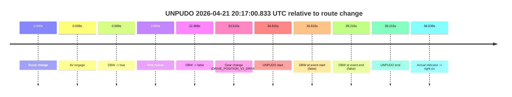

| Metric | Value |
|---|---|
| Outcome | `fail` |
| Effective failure type | `not_av_owned` |
| Route change status | `found` |
| DBW at event start | `false` |
| DBW at event end | `false` |
| Predicted gear at AV start | `DRIVE_POSITION_V2_PARK` |
| Actual gear at AV start | `DRIVE_POSITION_V2_PARK` |
| Predicted gear at event start | `DRIVE_POSITION_V2_DRIVE` |
| Actual gear at event start | `DRIVE_POSITION_V2_DRIVE` |
| Planned indicator direction | `INDICATORS_STATE_V2_OFF` |
| Controller indicator direction | `INDICATORS_STATE_V2_OFF` |
| Actual indicator direction | `INDICATORS_STATE_V2_OFF` |
| Actual indicator at maneuver end | `INDICATORS_STATE_V2_OFF` |
| Driver accel help in AV | `false` |
| Driver accel help timestamp | `n/a` |
| Max accel pedal pct in AV | `0.0%` |
| Max brake pedal pct in AV | `22.4%` |
| Max speed mps in AV | `2.119` |
| Success timing baseline | `route change` |
| Route -> AV | `0.009s` |
| AV -> event start | `34.806s` |
| AV -> first motion | `3.871s` |
| Success baseline -> event start | `34.815s` |
| Success baseline -> first motion | `3.880s` |
| AV duration before disengagement | `22.980s` |
| Trajectory waypoint count | `37` |
| Driving-plan step count | `11` |

The scored portion starts from the AV-owned window, not from the pre-AV setup. Route-change search in the stopped pre-event segment was `found`, with the baseline therefore set to route change. At the event anchor the model predicts `DRIVE_POSITION_V2_DRIVE` and the actual gear is `DRIVE_POSITION_V2_DRIVE`. The effective model outcome is `fail` because `not_av_owned.`

### Resolution

| Field | Value |
|---|---|
| Final outcome | `fail` |
| Do we agree with this label? | `yes` |
| Source disengagement type | `none observed` |
| Resolved effective failure type | `not_av_owned` |
| Confidence | `high` |

## unpudo 2026-04-21 20:18:28.533 UTC

| Field | Value |
|---|---|
| Model | `eel-teal-outspoken` |
| Author | `zak` |
| Run ID | `fme10005/2026-04-21--19-22-29--gen2-av-317481e0-4c9f-4033-96a4-619458685d04` |
| Date | `2026-04-21` |
| Time (UTC) | `20:18:28.533` |
| Event type | `unpudo` |
| Disengagement type | `failed_to_unpudo` |
| Route change | `found` |
| Console | [run](https://console.sso.wayve.ai/run/fme10005/2026-04-21--19-22-29--gen2-av-317481e0-4c9f-4033-96a4-619458685d04?id=&time-unixus=1776802708533311) |
| Foxglove | [segment](https://app.foxglove.dev/wayve-on-prem/p/prj_0dX18KZdVHg1fmmI/view?ds=foxglove-stream&ds.deviceName=fme10005&ds.start=2026-04-21T20%3A18%3A14.668346Z&ds.end=2026-04-21T20%3A19%3A01.883301Z&layoutId=lay_0e7VD4WIKDQGU73Y&time=2026-04-21T20%3A18%3A28.533311Z) |

### Event card: fail

- Fail: AV owns part of the segment, but the event still resolves as a model-performance failure under the AV-only scoring rule.

| Event | Time (UTC) | Delta from route change |
|---|---:|---:|
| Route change | 2026-04-21 20:18:24.668 | `0.000s` |
| AV engage | 2026-04-21 20:18:24.676 | `0.008s` |
| DBW -> true | 2026-04-21 20:18:24.676 | `0.008s` |
| Gear change (DRIVE_POSITION_V2_DRIVE) | 2026-04-21 20:18:24.933 | `0.265s` |
| UNPUDO start | 2026-04-21 20:18:28.533 | `3.865s` |
| DBW at event start (true) | 2026-04-21 20:18:28.533 | `3.865s` |
| First motion | 2026-04-21 20:18:28.557 | `3.889s` |
| DBW -> false | 2026-04-21 20:18:40.866 | `16.198s` |
| DBW at event end (false) | 2026-04-21 20:18:51.883 | `27.215s` |
| UNPUDO end | 2026-04-21 20:18:51.883 | `27.215s` |
| Actual indicator -> right on | 2026-04-21 20:18:54.737 | `30.069s` |
| Actual indicator -> off | 2026-04-21 20:18:57.217 | `32.549s` |
| Actual indicator -> right on | 2026-04-21 20:18:57.997 | `33.329s` |
| Actual indicator -> off | 2026-04-21 20:19:00.997 | `36.329s` |

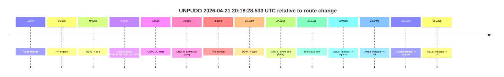

| Metric | Value |
|---|---|
| Outcome | `fail` |
| Effective failure type | `failed_to_unpudo` |
| Route change status | `found` |
| DBW at event start | `true` |
| DBW at event end | `false` |
| Predicted gear at AV start | `DRIVE_POSITION_V2_PARK` |
| Actual gear at AV start | `DRIVE_POSITION_V2_PARK` |
| Predicted gear at event start | `DRIVE_POSITION_V2_DRIVE` |
| Actual gear at event start | `DRIVE_POSITION_V2_DRIVE` |
| Planned indicator direction | `INDICATORS_STATE_V2_OFF` |
| Controller indicator direction | `INDICATORS_STATE_V2_OFF` |
| Actual indicator direction | `INDICATORS_STATE_V2_OFF` |
| Actual indicator at maneuver end | `INDICATORS_STATE_V2_OFF` |
| Driver accel help in AV | `false` |
| Driver accel help timestamp | `n/a` |
| Max accel pedal pct in AV | `0.0%` |
| Max brake pedal pct in AV | `18.9%` |
| Max speed mps in AV | `1.825` |
| Success timing baseline | `route change` |
| Route -> AV | `0.008s` |
| AV -> event start | `3.857s` |
| AV -> first motion | `3.881s` |
| Success baseline -> event start | `3.865s` |
| Success baseline -> first motion | `3.889s` |
| AV duration before disengagement | `16.190s` |
| Trajectory waypoint count | `37` |
| Driving-plan step count | `11` |

The scored portion starts from the AV-owned window, not from the pre-AV setup. Route-change search in the stopped pre-event segment was `found`, with the baseline therefore set to route change. At the event anchor the model predicts `DRIVE_POSITION_V2_DRIVE` and the actual gear is `DRIVE_POSITION_V2_DRIVE`. The effective model outcome is `fail` because `failed_to_unpudo.`

### Resolution

| Field | Value |
|---|---|
| Final outcome | `fail` |
| Do we agree with this label? | `yes` |
| Source disengagement type | `failed_to_unpudo` |
| Resolved effective failure type | `failed_to_unpudo` |
| Confidence | `high` |

## unpudo 2026-04-21 20:20:18.383 UTC

| Field | Value |
|---|---|
| Model | `eel-teal-outspoken` |
| Author | `zak` |
| Run ID | `fme10005/2026-04-21--19-22-29--gen2-av-317481e0-4c9f-4033-96a4-619458685d04` |
| Date | `2026-04-21` |
| Time (UTC) | `20:20:18.383` |
| Event type | `unpudo` |
| Disengagement type | `none observed` |
| Route change | `found` |
| Console | [run](https://console.sso.wayve.ai/run/fme10005/2026-04-21--19-22-29--gen2-av-317481e0-4c9f-4033-96a4-619458685d04?id=&time-unixus=1776802818383295) |
| Foxglove | [segment](https://app.foxglove.dev/wayve-on-prem/p/prj_0dX18KZdVHg1fmmI/view?ds=foxglove-stream&ds.deviceName=fme10005&ds.start=2026-04-21T20%3A18%3A14.668346Z&ds.end=2026-04-21T20%3A21%3A41.267152Z&layoutId=lay_0e7VD4WIKDQGU73Y&time=2026-04-21T20%3A20%3A18.383295Z) |

### Event card: pass

- Pass: AV owns the credited unpudo from route change through the official unpudo window, the gear state is aligned at the anchor, and the vehicle moves without driver accelerator help in AV.

| Event | Time (UTC) | Delta from route change |
|---|---:|---:|
| Route change | 2026-04-21 20:18:24.668 | `0.000s` |
| First motion | 2026-04-21 20:18:28.557 | `3.889s` |
| Actual indicator -> right on | 2026-04-21 20:18:54.737 | `30.069s` |
| Actual indicator -> off | 2026-04-21 20:18:57.217 | `32.549s` |
| Actual indicator -> right on | 2026-04-21 20:18:57.997 | `33.329s` |
| Actual indicator -> off | 2026-04-21 20:19:00.997 | `36.329s` |
| AV engage | 2026-04-21 20:19:04.226 | `39.558s` |
| DBW -> true | 2026-04-21 20:19:04.226 | `39.558s` |
| Gear change (DRIVE_POSITION_V2_DRIVE) | 2026-04-21 20:20:14.833 | `110.165s` |
| UNPUDO start | 2026-04-21 20:20:18.383 | `113.715s` |
| DBW at event start (true) | 2026-04-21 20:20:18.383 | `113.715s` |
| DBW at event end (true) | 2026-04-21 20:20:36.383 | `131.715s` |
| UNPUDO end | 2026-04-21 20:20:36.383 | `131.715s` |
| DBW -> false | 2026-04-21 20:21:31.267 | `186.599s` |

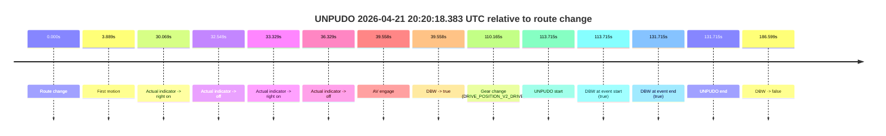

| Metric | Value |
|---|---|
| Outcome | `pass` |
| Effective failure type | `none` |
| Route change status | `found` |
| DBW at event start | `true` |
| DBW at event end | `true` |
| Predicted gear at AV start | `DRIVE_POSITION_V2_DRIVE` |
| Actual gear at AV start | `DRIVE_POSITION_V2_DRIVE` |
| Predicted gear at event start | `DRIVE_POSITION_V2_DRIVE` |
| Actual gear at event start | `DRIVE_POSITION_V2_DRIVE` |
| Planned indicator direction | `INDICATORS_STATE_V2_OFF` |
| Controller indicator direction | `INDICATORS_STATE_V2_OFF` |
| Actual indicator direction | `INDICATORS_STATE_V2_OFF` |
| Actual indicator at maneuver end | `INDICATORS_STATE_V2_OFF` |
| Driver accel help in AV | `false` |
| Driver accel help timestamp | `n/a` |
| Max accel pedal pct in AV | `0.0%` |
| Max brake pedal pct in AV | `9.9%` |
| Max speed mps in AV | `13.950` |
| Success timing baseline | `route change` |
| Route -> AV | `39.558s` |
| AV -> event start | `74.157s` |
| AV -> first motion | `-35.669s` |
| Success baseline -> event start | `113.715s` |
| Success baseline -> first motion | `3.889s` |
| AV duration before disengagement | `147.040s` |
| Trajectory waypoint count | `36` |
| Driving-plan step count | `11` |

The scored portion starts from the AV-owned window, not from the pre-AV setup. Route-change search in the stopped pre-event segment was `found`, with the baseline therefore set to route change. At the event anchor the model predicts `DRIVE_POSITION_V2_DRIVE` and the actual gear is `DRIVE_POSITION_V2_DRIVE`. The effective model outcome is `pass` because `the credited unpudo stays AV-owned through the official unpudo window.`

### Resolution

| Field | Value |
|---|---|
| Final outcome | `pass` |
| Do we agree with this label? | `yes` |
| Source disengagement type | `none observed` |
| Resolved effective failure type | `none` |
| Confidence | `high` |

## unpudo 2026-04-21 20:21:36.133 UTC

| Field | Value |
|---|---|
| Model | `eel-teal-outspoken` |
| Author | `zak` |
| Run ID | `fme10005/2026-04-21--19-22-29--gen2-av-317481e0-4c9f-4033-96a4-619458685d04` |
| Date | `2026-04-21` |
| Time (UTC) | `20:21:36.133` |
| Event type | `unpudo` |
| Disengagement type | `failed_to_unpudo` |
| Route change | `found` |
| Console | [run](https://console.sso.wayve.ai/run/fme10005/2026-04-21--19-22-29--gen2-av-317481e0-4c9f-4033-96a4-619458685d04?id=&time-unixus=1776802896133303) |
| Foxglove | [segment](https://app.foxglove.dev/wayve-on-prem/p/prj_0dX18KZdVHg1fmmI/view?ds=foxglove-stream&ds.deviceName=fme10005&ds.start=2026-04-21T20%3A20%3A04.468258Z&ds.end=2026-04-21T20%3A21%3A58.483290Z&layoutId=lay_0e7VD4WIKDQGU73Y&time=2026-04-21T20%3A21%3A36.133303Z) |

### Event card: fail

- Fail: AV owns part of the segment, but the event still resolves as a model-performance failure under the AV-only scoring rule.

| Event | Time (UTC) | Delta from route change |
|---|---:|---:|
| Route change | 2026-04-21 20:20:14.468 | `0.000s` |
| AV engage | 2026-04-21 20:20:14.476 | `0.008s` |
| DBW -> true | 2026-04-21 20:20:14.476 | `0.008s` |
| First motion | 2026-04-21 20:20:18.417 | `3.949s` |
| Gear change (DRIVE_POSITION_V2_REVERSE) | 2026-04-21 20:21:23.633 | `69.165s` |
| DBW -> false | 2026-04-21 20:21:31.267 | `76.799s` |
| UNPUDO start | 2026-04-21 20:21:36.133 | `81.665s` |
| DBW at event start (false) | 2026-04-21 20:21:36.133 | `81.665s` |
| DBW at event end (false) | 2026-04-21 20:21:48.483 | `94.015s` |
| UNPUDO end | 2026-04-21 20:21:48.483 | `94.015s` |
| Actual indicator -> right on | 2026-04-21 20:22:02.977 | `108.510s` |
| Actual indicator -> off | 2026-04-21 20:22:06.577 | `112.109s` |

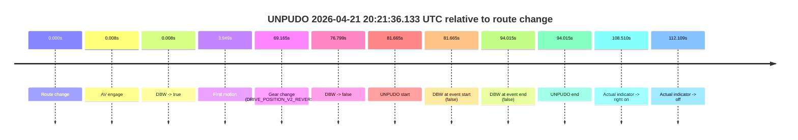

| Metric | Value |
|---|---|
| Outcome | `fail` |
| Effective failure type | `failed_to_unpudo` |
| Route change status | `found` |
| DBW at event start | `false` |
| DBW at event end | `false` |
| Predicted gear at AV start | `DRIVE_POSITION_V2_PARK` |
| Actual gear at AV start | `DRIVE_POSITION_V2_PARK` |
| Predicted gear at event start | `DRIVE_POSITION_V2_REVERSE` |
| Actual gear at event start | `DRIVE_POSITION_V2_REVERSE` |
| Planned indicator direction | `INDICATORS_STATE_V2_OFF` |
| Controller indicator direction | `INDICATORS_STATE_V2_OFF` |
| Actual indicator direction | `INDICATORS_STATE_V2_OFF` |
| Actual indicator at maneuver end | `INDICATORS_STATE_V2_OFF` |
| Driver accel help in AV | `false` |
| Driver accel help timestamp | `n/a` |
| Max accel pedal pct in AV | `0.0%` |
| Max brake pedal pct in AV | `8.0%` |
| Max speed mps in AV | `3.494` |
| Success timing baseline | `route change` |
| Route -> AV | `0.008s` |
| AV -> event start | `81.657s` |
| AV -> first motion | `3.941s` |
| Success baseline -> event start | `81.665s` |
| Success baseline -> first motion | `3.949s` |
| AV duration before disengagement | `76.790s` |
| Trajectory waypoint count | `37` |
| Driving-plan step count | `11` |

The scored portion starts from the AV-owned window, not from the pre-AV setup. Route-change search in the stopped pre-event segment was `found`, with the baseline therefore set to route change. At the event anchor the model predicts `DRIVE_POSITION_V2_REVERSE` and the actual gear is `DRIVE_POSITION_V2_REVERSE`. The effective model outcome is `fail` because `failed_to_unpudo.`

### Resolution

| Field | Value |
|---|---|
| Final outcome | `fail` |
| Do we agree with this label? | `yes` |
| Source disengagement type | `failed_to_unpudo` |
| Resolved effective failure type | `failed_to_unpudo` |
| Confidence | `high` |

## unpudo 2026-04-21 20:23:11.983 UTC

| Field | Value |
|---|---|
| Model | `eel-teal-outspoken` |
| Author | `zak` |
| Run ID | `fme10005/2026-04-21--19-22-29--gen2-av-317481e0-4c9f-4033-96a4-619458685d04` |
| Date | `2026-04-21` |
| Time (UTC) | `20:23:11.983` |
| Event type | `unpudo` |
| Disengagement type | `none observed` |
| Route change | `found` |
| Console | [run](https://console.sso.wayve.ai/run/fme10005/2026-04-21--19-22-29--gen2-av-317481e0-4c9f-4033-96a4-619458685d04?id=&time-unixus=1776802991983294) |
| Foxglove | [segment](https://app.foxglove.dev/wayve-on-prem/p/prj_0dX18KZdVHg1fmmI/view?ds=foxglove-stream&ds.deviceName=fme10005&ds.start=2026-04-21T20%3A21%3A13.318254Z&ds.end=2026-04-21T20%3A26%3A35.846010Z&layoutId=lay_0e7VD4WIKDQGU73Y&time=2026-04-21T20%3A23%3A11.983294Z) |

### Event card: pass

- Pass: AV owns the credited unpudo from route change through the official unpudo window, the gear state is aligned at the anchor, and the vehicle moves without driver accelerator help in AV.

| Event | Time (UTC) | Delta from route change |
|---|---:|---:|
| Route change | 2026-04-21 20:21:23.318 | `0.000s` |
| First motion | 2026-04-21 20:21:44.497 | `21.180s` |
| Actual indicator -> right on | 2026-04-21 20:22:02.977 | `39.660s` |
| Actual indicator -> off | 2026-04-21 20:22:06.577 | `43.259s` |
| AV engage | 2026-04-21 20:22:11.426 | `48.108s` |
| DBW -> true | 2026-04-21 20:22:11.426 | `48.108s` |
| Gear change (DRIVE_POSITION_V2_DRIVE) | 2026-04-21 20:23:08.433 | `105.115s` |
| UNPUDO start | 2026-04-21 20:23:11.983 | `108.665s` |
| DBW at event start (true) | 2026-04-21 20:23:11.983 | `108.665s` |
| DBW at event end (true) | 2026-04-21 20:23:15.433 | `112.115s` |
| UNPUDO end | 2026-04-21 20:23:15.433 | `112.115s` |
| DBW -> false | 2026-04-21 20:26:25.846 | `302.528s` |

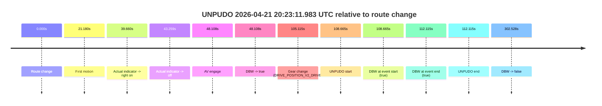

| Metric | Value |
|---|---|
| Outcome | `pass` |
| Effective failure type | `none` |
| Route change status | `found` |
| DBW at event start | `true` |
| DBW at event end | `true` |
| Predicted gear at AV start | `DRIVE_POSITION_V2_DRIVE` |
| Actual gear at AV start | `DRIVE_POSITION_V2_DRIVE` |
| Predicted gear at event start | `DRIVE_POSITION_V2_DRIVE` |
| Actual gear at event start | `DRIVE_POSITION_V2_DRIVE` |
| Planned indicator direction | `INDICATORS_STATE_V2_LEFT_ON` |
| Controller indicator direction | `INDICATORS_STATE_V2_LEFT_ON` |
| Actual indicator direction | `INDICATORS_STATE_V2_OFF` |
| Actual indicator at maneuver end | `INDICATORS_STATE_V2_OFF` |
| Driver accel help in AV | `false` |
| Driver accel help timestamp | `n/a` |
| Max accel pedal pct in AV | `0.0%` |
| Max brake pedal pct in AV | `11.3%` |
| Max speed mps in AV | `13.681` |
| Success timing baseline | `route change` |
| Route -> AV | `48.108s` |
| AV -> event start | `60.557s` |
| AV -> first motion | `-26.929s` |
| Success baseline -> event start | `108.665s` |
| Success baseline -> first motion | `21.180s` |
| AV duration before disengagement | `254.419s` |
| Trajectory waypoint count | `36` |
| Driving-plan step count | `11` |

The scored portion starts from the AV-owned window, not from the pre-AV setup. Route-change search in the stopped pre-event segment was `found`, with the baseline therefore set to route change. At the event anchor the model predicts `DRIVE_POSITION_V2_DRIVE` and the actual gear is `DRIVE_POSITION_V2_DRIVE`. The effective model outcome is `pass` because `the credited unpudo stays AV-owned through the official unpudo window.`

### Resolution

| Field | Value |
|---|---|
| Final outcome | `pass` |
| Do we agree with this label? | `yes` |
| Source disengagement type | `none observed` |
| Resolved effective failure type | `none` |
| Confidence | `high` |

## unpudo 2026-04-21 20:24:01.583 UTC

| Field | Value |
|---|---|
| Model | `eel-teal-outspoken` |
| Author | `zak` |
| Run ID | `fme10005/2026-04-21--19-22-29--gen2-av-317481e0-4c9f-4033-96a4-619458685d04` |
| Date | `2026-04-21` |
| Time (UTC) | `20:24:01.583` |
| Event type | `unpudo` |
| Disengagement type | `none observed` |
| Route change | `found` |
| Console | [run](https://console.sso.wayve.ai/run/fme10005/2026-04-21--19-22-29--gen2-av-317481e0-4c9f-4033-96a4-619458685d04?id=&time-unixus=1776803041583317) |
| Foxglove | [segment](https://app.foxglove.dev/wayve-on-prem/p/prj_0dX18KZdVHg1fmmI/view?ds=foxglove-stream&ds.deviceName=fme10005&ds.start=2026-04-21T20%3A22%3A58.118346Z&ds.end=2026-04-21T20%3A26%3A35.846010Z&layoutId=lay_0e7VD4WIKDQGU73Y&time=2026-04-21T20%3A24%3A01.583317Z) |

### Event card: pass

- Pass: AV owns the credited unpudo from route change through the official unpudo window, the gear state is aligned at the anchor, and the vehicle moves without driver accelerator help in AV.

| Event | Time (UTC) | Delta from route change |
|---|---:|---:|
| Route change | 2026-04-21 20:23:08.118 | `0.000s` |
| AV engage | 2026-04-21 20:23:08.126 | `0.009s` |
| DBW -> true | 2026-04-21 20:23:08.126 | `0.009s` |
| First motion | 2026-04-21 20:23:11.997 | `3.879s` |
| Gear change (DRIVE_POSITION_V2_DRIVE) | 2026-04-21 20:23:58.033 | `49.915s` |
| UNPUDO start | 2026-04-21 20:24:01.583 | `53.465s` |
| DBW at event start (true) | 2026-04-21 20:24:01.583 | `53.465s` |
| DBW at event end (true) | 2026-04-21 20:24:05.083 | `56.965s` |
| UNPUDO end | 2026-04-21 20:24:05.083 | `56.965s` |
| DBW -> false | 2026-04-21 20:26:25.846 | `197.728s` |


| Metric | Value |
|---|---|
| Outcome | `pass` |
| Effective failure type | `none` |
| Route change status | `found` |
| DBW at event start | `true` |
| DBW at event end | `true` |
| Predicted gear at AV start | `DRIVE_POSITION_V2_PARK` |
| Actual gear at AV start | `DRIVE_POSITION_V2_PARK` |
| Predicted gear at event start | `DRIVE_POSITION_V2_DRIVE` |
| Actual gear at event start | `DRIVE_POSITION_V2_DRIVE` |
| Planned indicator direction | `INDICATORS_STATE_V2_LEFT_ON` |
| Controller indicator direction | `INDICATORS_STATE_V2_LEFT_ON` |
| Actual indicator direction | `INDICATORS_STATE_V2_OFF` |
| Actual indicator at maneuver end | `INDICATORS_STATE_V2_OFF` |
| Driver accel help in AV | `false` |
| Driver accel help timestamp | `n/a` |
| Max accel pedal pct in AV | `0.0%` |
| Max brake pedal pct in AV | `8.0%` |
| Max speed mps in AV | `9.522` |
| Success timing baseline | `route change` |
| Route -> AV | `0.009s` |
| AV -> event start | `53.456s` |
| AV -> first motion | `3.871s` |
| Success baseline -> event start | `53.465s` |
| Success baseline -> first motion | `3.879s` |
| AV duration before disengagement | `197.719s` |
| Trajectory waypoint count | `36` |
| Driving-plan step count | `11` |

The scored portion starts from the AV-owned window, not from the pre-AV setup. Route-change search in the stopped pre-event segment was `found`, with the baseline therefore set to route change. At the event anchor the model predicts `DRIVE_POSITION_V2_DRIVE` and the actual gear is `DRIVE_POSITION_V2_DRIVE`. The effective model outcome is `pass` because `the credited unpudo stays AV-owned through the official unpudo window.`

### Resolution

| Field | Value |
|---|---|
| Final outcome | `pass` |
| Do we agree with this label? | `yes` |
| Source disengagement type | `none observed` |
| Resolved effective failure type | `none` |
| Confidence | `high` |

## unpudo 2026-04-21 20:26:35.483 UTC

| Field | Value |
|---|---|
| Model | `eel-teal-outspoken` |
| Author | `zak` |
| Run ID | `fme10005/2026-04-21--19-22-29--gen2-av-317481e0-4c9f-4033-96a4-619458685d04` |
| Date | `2026-04-21` |
| Time (UTC) | `20:26:35.483` |
| Event type | `unpudo` |
| Disengagement type | `uncategorised` |
| Route change | `found` |
| Console | [run](https://console.sso.wayve.ai/run/fme10005/2026-04-21--19-22-29--gen2-av-317481e0-4c9f-4033-96a4-619458685d04?id=&time-unixus=1776803195483306) |
| Foxglove | [segment](https://app.foxglove.dev/wayve-on-prem/p/prj_0dX18KZdVHg1fmmI/view?ds=foxglove-stream&ds.deviceName=fme10005&ds.start=2026-04-21T20%3A26%3A10.118301Z&ds.end=2026-04-21T20%3A27%3A55.583291Z&layoutId=lay_0e7VD4WIKDQGU73Y&time=2026-04-21T20%3A26%3A35.483306Z) |

### Event card: fail

- Fail: AV owns part of the segment, but the event still resolves as a model-performance failure under the AV-only scoring rule.

| Event | Time (UTC) | Delta from route change |
|---|---:|---:|
| Route change | 2026-04-21 20:26:20.118 | `0.000s` |
| AV engage | 2026-04-21 20:26:20.126 | `0.008s` |
| DBW -> true | 2026-04-21 20:26:20.126 | `0.008s` |
| DBW -> false | 2026-04-21 20:26:25.846 | `5.728s` |
| Gear change (DRIVE_POSITION_V2_REVERSE) | 2026-04-21 20:26:31.333 | `11.215s` |
| UNPUDO start | 2026-04-21 20:26:35.483 | `15.365s` |
| DBW at event start (false) | 2026-04-21 20:26:35.483 | `15.365s` |
| DBW at event end (true) | 2026-04-21 20:27:45.583 | `85.465s` |
| UNPUDO end | 2026-04-21 20:27:45.583 | `85.465s` |

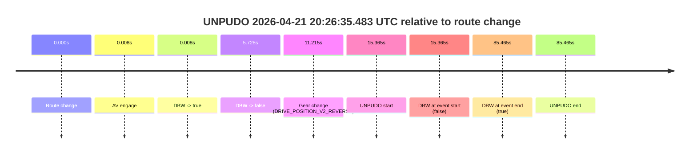

| Metric | Value |
|---|---|
| Outcome | `fail` |
| Effective failure type | `uncategorised` |
| Route change status | `found` |
| DBW at event start | `false` |
| DBW at event end | `true` |
| Predicted gear at AV start | `DRIVE_POSITION_V2_PARK` |
| Actual gear at AV start | `DRIVE_POSITION_V2_PARK` |
| Predicted gear at event start | `DRIVE_POSITION_V2_REVERSE` |
| Actual gear at event start | `DRIVE_POSITION_V2_REVERSE` |
| Planned indicator direction | `INDICATORS_STATE_V2_OFF` |
| Controller indicator direction | `INDICATORS_STATE_V2_OFF` |
| Actual indicator direction | `INDICATORS_STATE_V2_OFF` |
| Actual indicator at maneuver end | `INDICATORS_STATE_V2_OFF` |
| Driver accel help in AV | `false` |
| Driver accel help timestamp | `n/a` |
| Max accel pedal pct in AV | `0.0%` |
| Max brake pedal pct in AV | `8.0%` |
| Max speed mps in AV | `0.000` |
| Success timing baseline | `route change` |
| Route -> AV | `0.008s` |
| AV -> event start | `15.357s` |
| AV -> first motion | `n/a` |
| Success baseline -> event start | `15.365s` |
| Success baseline -> first motion | `n/a` |
| AV duration before disengagement | `5.720s` |
| Trajectory waypoint count | `36` |
| Driving-plan step count | `11` |

The scored portion starts from the AV-owned window, not from the pre-AV setup. Route-change search in the stopped pre-event segment was `found`, with the baseline therefore set to route change. At the event anchor the model predicts `DRIVE_POSITION_V2_REVERSE` and the actual gear is `DRIVE_POSITION_V2_REVERSE`. The effective model outcome is `fail` because `uncategorised.`

### Resolution

| Field | Value |
|---|---|
| Final outcome | `fail` |
| Do we agree with this label? | `yes` |
| Source disengagement type | `uncategorised` |
| Resolved effective failure type | `uncategorised` |
| Confidence | `high` |

## unpudo 2026-04-21 20:30:32.183 UTC

| Field | Value |
|---|---|
| Model | `eel-teal-outspoken` |
| Author | `zak` |
| Run ID | `fme10005/2026-04-21--19-22-29--gen2-av-317481e0-4c9f-4033-96a4-619458685d04` |
| Date | `2026-04-21` |
| Time (UTC) | `20:30:32.183` |
| Event type | `unpudo` |
| Disengagement type | `failed_to_unpudo` |
| Route change | `found` |
| Console | [run](https://console.sso.wayve.ai/run/fme10005/2026-04-21--19-22-29--gen2-av-317481e0-4c9f-4033-96a4-619458685d04?id=&time-unixus=1776803432183316) |
| Foxglove | [segment](https://app.foxglove.dev/wayve-on-prem/p/prj_0dX18KZdVHg1fmmI/view?ds=foxglove-stream&ds.deviceName=fme10005&ds.start=2026-04-21T20%3A30%3A11.518262Z&ds.end=2026-04-21T20%3A30%3A49.733303Z&layoutId=lay_0e7VD4WIKDQGU73Y&time=2026-04-21T20%3A30%3A32.183316Z) |

### Event card: fail

- Fail: AV owns part of the segment, but the event still resolves as a model-performance failure under the AV-only scoring rule.

| Event | Time (UTC) | Delta from route change |
|---|---:|---:|
| Route change | 2026-04-21 20:30:21.518 | `0.000s` |
| AV engage | 2026-04-21 20:30:21.526 | `0.009s` |
| DBW -> true | 2026-04-21 20:30:21.526 | `0.009s` |
| Gear change (DRIVE_POSITION_V2_REVERSE) | 2026-04-21 20:30:21.833 | `0.315s` |
| DBW -> false | 2026-04-21 20:30:27.146 | `5.628s` |
| UNPUDO start | 2026-04-21 20:30:32.183 | `10.665s` |
| DBW at event start (false) | 2026-04-21 20:30:32.183 | `10.665s` |
| DBW at event end (false) | 2026-04-21 20:30:39.733 | `18.215s` |
| UNPUDO end | 2026-04-21 20:30:39.733 | `18.215s` |

```mermaid
timeline
    title UNPUDO 2026-04-21 20:30:32.183 UTC relative to route change
    0.000s : Route change
    0.009s : AV engage
    0.009s : DBW -> true
    0.315s : Gear change (DRIVE_POSITION_V2_REVERSE)
    5.628s : DBW -> false
    10.665s : UNPUDO start
    10.665s : DBW at event start (false)
    18.215s : DBW at event end (false)
    18.215s : UNPUDO end
```

| Metric | Value |
|---|---|
| Outcome | `fail` |
| Effective failure type | `failed_to_unpudo` |
| Route change status | `found` |
| DBW at event start | `false` |
| DBW at event end | `false` |
| Predicted gear at AV start | `DRIVE_POSITION_V2_PARK` |
| Actual gear at AV start | `DRIVE_POSITION_V2_PARK` |
| Predicted gear at event start | `DRIVE_POSITION_V2_REVERSE` |
| Actual gear at event start | `DRIVE_POSITION_V2_REVERSE` |
| Planned indicator direction | `INDICATORS_STATE_V2_OFF` |
| Controller indicator direction | `INDICATORS_STATE_V2_OFF` |
| Actual indicator direction | `INDICATORS_STATE_V2_OFF` |
| Actual indicator at maneuver end | `INDICATORS_STATE_V2_OFF` |
| Driver accel help in AV | `false` |
| Driver accel help timestamp | `n/a` |
| Max accel pedal pct in AV | `0.0%` |
| Max brake pedal pct in AV | `11.6%` |
| Max speed mps in AV | `0.000` |
| Success timing baseline | `route change` |
| Route -> AV | `0.009s` |
| AV -> event start | `10.656s` |
| AV -> first motion | `n/a` |
| Success baseline -> event start | `10.665s` |
| Success baseline -> first motion | `n/a` |
| AV duration before disengagement | `5.620s` |
| Trajectory waypoint count | `36` |
| Driving-plan step count | `11` |

The scored portion starts from the AV-owned window, not from the pre-AV setup. Route-change search in the stopped pre-event segment was `found`, with the baseline therefore set to route change. At the event anchor the model predicts `DRIVE_POSITION_V2_REVERSE` and the actual gear is `DRIVE_POSITION_V2_REVERSE`. The effective model outcome is `fail` because `failed_to_unpudo.`

### Resolution

| Field | Value |
|---|---|
| Final outcome | `fail` |
| Do we agree with this label? | `yes` |
| Source disengagement type | `failed_to_unpudo` |
| Resolved effective failure type | `failed_to_unpudo` |
| Confidence | `high` |

## unpudo 2026-04-21 20:32:30.533 UTC

| Field | Value |
|---|---|
| Model | `eel-teal-outspoken` |
| Author | `zak` |
| Run ID | `fme10005/2026-04-21--19-22-29--gen2-av-317481e0-4c9f-4033-96a4-619458685d04` |
| Date | `2026-04-21` |
| Time (UTC) | `20:32:30.533` |
| Event type | `unpudo` |
| Disengagement type | `failed_to_unpudo` |
| Route change | `found` |
| Console | [run](https://console.sso.wayve.ai/run/fme10005/2026-04-21--19-22-29--gen2-av-317481e0-4c9f-4033-96a4-619458685d04?id=&time-unixus=1776803550533305) |
| Foxglove | [segment](https://app.foxglove.dev/wayve-on-prem/p/prj_0dX18KZdVHg1fmmI/view?ds=foxglove-stream&ds.deviceName=fme10005&ds.start=2026-04-21T20%3A32%3A08.368248Z&ds.end=2026-04-21T20%3A32%3A48.033293Z&layoutId=lay_0e7VD4WIKDQGU73Y&time=2026-04-21T20%3A32%3A30.533305Z) |

### Event card: fail

- Fail: AV owns part of the segment, but the event still resolves as a model-performance failure under the AV-only scoring rule.

| Event | Time (UTC) | Delta from route change |
|---|---:|---:|
| Route change | 2026-04-21 20:32:18.368 | `0.000s` |
| AV engage | 2026-04-21 20:32:18.375 | `0.008s` |
| DBW -> true | 2026-04-21 20:32:18.375 | `0.008s` |
| Gear change (DRIVE_POSITION_V2_REVERSE) | 2026-04-21 20:32:18.733 | `0.365s` |
| DBW -> false | 2026-04-21 20:32:25.427 | `7.059s` |
| UNPUDO start | 2026-04-21 20:32:30.533 | `12.165s` |
| DBW at event start (false) | 2026-04-21 20:32:30.533 | `12.165s` |
| DBW at event end (false) | 2026-04-21 20:32:38.033 | `19.665s` |
| UNPUDO end | 2026-04-21 20:32:38.033 | `19.665s` |
| Actual indicator -> right on | 2026-04-21 20:32:57.797 | `39.430s` |

```mermaid
timeline
    title UNPUDO 2026-04-21 20:32:30.533 UTC relative to route change
    0.000s : Route change
    0.008s : AV engage
    0.008s : DBW -> true
    0.365s : Gear change (DRIVE_POSITION_V2_REVERSE)
    7.059s : DBW -> false
    12.165s : UNPUDO start
    12.165s : DBW at event start (false)
    19.665s : DBW at event end (false)
    19.665s : UNPUDO end
    39.430s : Actual indicator -> right on
```

| Metric | Value |
|---|---|
| Outcome | `fail` |
| Effective failure type | `failed_to_unpudo` |
| Route change status | `found` |
| DBW at event start | `false` |
| DBW at event end | `false` |
| Predicted gear at AV start | `DRIVE_POSITION_V2_PARK` |
| Actual gear at AV start | `DRIVE_POSITION_V2_PARK` |
| Predicted gear at event start | `DRIVE_POSITION_V2_REVERSE` |
| Actual gear at event start | `DRIVE_POSITION_V2_REVERSE` |
| Planned indicator direction | `INDICATORS_STATE_V2_OFF` |
| Controller indicator direction | `INDICATORS_STATE_V2_OFF` |
| Actual indicator direction | `INDICATORS_STATE_V2_OFF` |
| Actual indicator at maneuver end | `INDICATORS_STATE_V2_OFF` |
| Driver accel help in AV | `false` |
| Driver accel help timestamp | `n/a` |
| Max accel pedal pct in AV | `0.0%` |
| Max brake pedal pct in AV | `11.2%` |
| Max speed mps in AV | `0.000` |
| Success timing baseline | `route change` |
| Route -> AV | `0.008s` |
| AV -> event start | `12.157s` |
| AV -> first motion | `n/a` |
| Success baseline -> event start | `12.165s` |
| Success baseline -> first motion | `n/a` |
| AV duration before disengagement | `7.052s` |
| Trajectory waypoint count | `37` |
| Driving-plan step count | `11` |

The scored portion starts from the AV-owned window, not from the pre-AV setup. Route-change search in the stopped pre-event segment was `found`, with the baseline therefore set to route change. At the event anchor the model predicts `DRIVE_POSITION_V2_REVERSE` and the actual gear is `DRIVE_POSITION_V2_REVERSE`. The effective model outcome is `fail` because `failed_to_unpudo.`

### Resolution

| Field | Value |
|---|---|
| Final outcome | `fail` |
| Do we agree with this label? | `yes` |
| Source disengagement type | `failed_to_unpudo` |
| Resolved effective failure type | `failed_to_unpudo` |
| Confidence | `high` |

## unpudo 2026-04-21 20:37:16.983 UTC

| Field | Value |
|---|---|
| Model | `eel-teal-outspoken` |
| Author | `zak` |
| Run ID | `fme10005/2026-04-21--19-22-29--gen2-av-317481e0-4c9f-4033-96a4-619458685d04` |
| Date | `2026-04-21` |
| Time (UTC) | `20:37:16.983` |
| Event type | `unpudo` |
| Disengagement type | `none observed` |
| Route change | `found` |
| Console | [run](https://console.sso.wayve.ai/run/fme10005/2026-04-21--19-22-29--gen2-av-317481e0-4c9f-4033-96a4-619458685d04?id=&time-unixus=1776803836983303) |
| Foxglove | [segment](https://app.foxglove.dev/wayve-on-prem/p/prj_0dX18KZdVHg1fmmI/view?ds=foxglove-stream&ds.deviceName=fme10005&ds.start=2026-04-21T20%3A37%3A03.118289Z&ds.end=2026-04-21T20%3A39%3A32.666692Z&layoutId=lay_0e7VD4WIKDQGU73Y&time=2026-04-21T20%3A37%3A16.983303Z) |

### Event card: pass

- Pass: AV owns the credited unpudo from route change through the official unpudo window, the gear state is aligned at the anchor, and the vehicle moves without driver accelerator help in AV.

| Event | Time (UTC) | Delta from route change |
|---|---:|---:|
| Route change | 2026-04-21 20:37:13.118 | `0.000s` |
| AV engage | 2026-04-21 20:37:13.126 | `0.009s` |
| DBW -> true | 2026-04-21 20:37:13.126 | `0.009s` |
| Gear change (DRIVE_POSITION_V2_DRIVE) | 2026-04-21 20:37:13.433 | `0.315s` |
| UNPUDO start | 2026-04-21 20:37:16.983 | `3.865s` |
| DBW at event start (true) | 2026-04-21 20:37:16.983 | `3.865s` |
| First motion | 2026-04-21 20:37:17.037 | `3.919s` |
| DBW at event end (true) | 2026-04-21 20:37:20.683 | `7.565s` |
| UNPUDO end | 2026-04-21 20:37:20.683 | `7.565s` |
| DBW -> false | 2026-04-21 20:39:22.666 | `129.548s` |

```mermaid
timeline
    title UNPUDO 2026-04-21 20:37:16.983 UTC relative to route change
    0.000s : Route change
    0.009s : AV engage
    0.009s : DBW -> true
    0.315s : Gear change (DRIVE_POSITION_V2_DRIVE)
    3.865s : UNPUDO start
    3.865s : DBW at event start (true)
    3.919s : First motion
    7.565s : DBW at event end (true)
    7.565s : UNPUDO end
    129.548s : DBW -> false
```

| Metric | Value |
|---|---|
| Outcome | `pass` |
| Effective failure type | `none` |
| Route change status | `found` |
| DBW at event start | `true` |
| DBW at event end | `true` |
| Predicted gear at AV start | `DRIVE_POSITION_V2_PARK` |
| Actual gear at AV start | `DRIVE_POSITION_V2_PARK` |
| Predicted gear at event start | `DRIVE_POSITION_V2_DRIVE` |
| Actual gear at event start | `DRIVE_POSITION_V2_DRIVE` |
| Planned indicator direction | `INDICATORS_STATE_V2_OFF` |
| Controller indicator direction | `INDICATORS_STATE_V2_OFF` |
| Actual indicator direction | `INDICATORS_STATE_V2_OFF` |
| Actual indicator at maneuver end | `INDICATORS_STATE_V2_OFF` |
| Driver accel help in AV | `false` |
| Driver accel help timestamp | `n/a` |
| Max accel pedal pct in AV | `0.0%` |
| Max brake pedal pct in AV | `8.0%` |
| Max speed mps in AV | `4.267` |
| Success timing baseline | `route change` |
| Route -> AV | `0.009s` |
| AV -> event start | `3.856s` |
| AV -> first motion | `3.911s` |
| Success baseline -> event start | `3.865s` |
| Success baseline -> first motion | `3.919s` |
| AV duration before disengagement | `129.540s` |
| Trajectory waypoint count | `36` |
| Driving-plan step count | `11` |

The scored portion starts from the AV-owned window, not from the pre-AV setup. Route-change search in the stopped pre-event segment was `found`, with the baseline therefore set to route change. At the event anchor the model predicts `DRIVE_POSITION_V2_DRIVE` and the actual gear is `DRIVE_POSITION_V2_DRIVE`. The effective model outcome is `pass` because `the credited unpudo stays AV-owned through the official unpudo window.`

### Resolution

| Field | Value |
|---|---|
| Final outcome | `pass` |
| Do we agree with this label? | `yes` |
| Source disengagement type | `none observed` |
| Resolved effective failure type | `none` |
| Confidence | `high` |

## unpudo 2026-04-21 20:39:27.233 UTC

| Field | Value |
|---|---|
| Model | `eel-teal-outspoken` |
| Author | `zak` |
| Run ID | `fme10005/2026-04-21--19-22-29--gen2-av-317481e0-4c9f-4033-96a4-619458685d04` |
| Date | `2026-04-21` |
| Time (UTC) | `20:39:27.233` |
| Event type | `unpudo` |
| Disengagement type | `failed_to_unpudo` |
| Route change | `found` |
| Console | [run](https://console.sso.wayve.ai/run/fme10005/2026-04-21--19-22-29--gen2-av-317481e0-4c9f-4033-96a4-619458685d04?id=&time-unixus=1776803967233290) |
| Foxglove | [segment](https://app.foxglove.dev/wayve-on-prem/p/prj_0dX18KZdVHg1fmmI/view?ds=foxglove-stream&ds.deviceName=fme10005&ds.start=2026-04-21T20%3A39%3A07.368251Z&ds.end=2026-04-21T20%3A39%3A52.883296Z&layoutId=lay_0e7VD4WIKDQGU73Y&time=2026-04-21T20%3A39%3A27.233290Z) |

### Event card: fail

- Fail: AV owns part of the segment, but the event still resolves as a model-performance failure under the AV-only scoring rule.

| Event | Time (UTC) | Delta from route change |
|---|---:|---:|
| Route change | 2026-04-21 20:39:17.368 | `0.000s` |
| AV engage | 2026-04-21 20:39:17.375 | `0.008s` |
| DBW -> true | 2026-04-21 20:39:17.375 | `0.008s` |
| Gear change (DRIVE_POSITION_V2_REVERSE) | 2026-04-21 20:39:17.633 | `0.265s` |
| DBW -> false | 2026-04-21 20:39:22.666 | `5.298s` |
| UNPUDO start | 2026-04-21 20:39:27.233 | `9.865s` |
| DBW at event start (false) | 2026-04-21 20:39:27.233 | `9.865s` |
| DBW at event end (true) | 2026-04-21 20:39:42.883 | `25.515s` |
| UNPUDO end | 2026-04-21 20:39:42.883 | `25.515s` |

```mermaid
timeline
    title UNPUDO 2026-04-21 20:39:27.233 UTC relative to route change
    0.000s : Route change
    0.008s : AV engage
    0.008s : DBW -> true
    0.265s : Gear change (DRIVE_POSITION_V2_REVERSE)
    5.298s : DBW -> false
    9.865s : UNPUDO start
    9.865s : DBW at event start (false)
    25.515s : DBW at event end (true)
    25.515s : UNPUDO end
```

| Metric | Value |
|---|---|
| Outcome | `fail` |
| Effective failure type | `failed_to_unpudo` |
| Route change status | `found` |
| DBW at event start | `false` |
| DBW at event end | `true` |
| Predicted gear at AV start | `DRIVE_POSITION_V2_PARK` |
| Actual gear at AV start | `DRIVE_POSITION_V2_PARK` |
| Predicted gear at event start | `DRIVE_POSITION_V2_REVERSE` |
| Actual gear at event start | `DRIVE_POSITION_V2_REVERSE` |
| Planned indicator direction | `INDICATORS_STATE_V2_OFF` |
| Controller indicator direction | `INDICATORS_STATE_V2_OFF` |
| Actual indicator direction | `INDICATORS_STATE_V2_OFF` |
| Actual indicator at maneuver end | `INDICATORS_STATE_V2_OFF` |
| Driver accel help in AV | `false` |
| Driver accel help timestamp | `n/a` |
| Max accel pedal pct in AV | `0.0%` |
| Max brake pedal pct in AV | `10.2%` |
| Max speed mps in AV | `0.000` |
| Success timing baseline | `route change` |
| Route -> AV | `0.008s` |
| AV -> event start | `9.857s` |
| AV -> first motion | `n/a` |
| Success baseline -> event start | `9.865s` |
| Success baseline -> first motion | `n/a` |
| AV duration before disengagement | `5.291s` |
| Trajectory waypoint count | `37` |
| Driving-plan step count | `11` |

The scored portion starts from the AV-owned window, not from the pre-AV setup. Route-change search in the stopped pre-event segment was `found`, with the baseline therefore set to route change. At the event anchor the model predicts `DRIVE_POSITION_V2_REVERSE` and the actual gear is `DRIVE_POSITION_V2_REVERSE`. The effective model outcome is `fail` because `failed_to_unpudo.`

### Resolution

| Field | Value |
|---|---|
| Final outcome | `fail` |
| Do we agree with this label? | `yes` |
| Source disengagement type | `failed_to_unpudo` |
| Resolved effective failure type | `failed_to_unpudo` |
| Confidence | `high` |

## unpudo 2026-04-21 20:44:19.683 UTC

| Field | Value |
|---|---|
| Model | `eel-teal-outspoken` |
| Author | `zak` |
| Run ID | `fme10005/2026-04-21--19-22-29--gen2-av-317481e0-4c9f-4033-96a4-619458685d04` |
| Date | `2026-04-21` |
| Time (UTC) | `20:44:19.683` |
| Event type | `unpudo` |
| Disengagement type | `failed_to_unpudo` |
| Route change | `found` |
| Console | [run](https://console.sso.wayve.ai/run/fme10005/2026-04-21--19-22-29--gen2-av-317481e0-4c9f-4033-96a4-619458685d04?id=&time-unixus=1776804259683317) |
| Foxglove | [segment](https://app.foxglove.dev/wayve-on-prem/p/prj_0dX18KZdVHg1fmmI/view?ds=foxglove-stream&ds.deviceName=fme10005&ds.start=2026-04-21T20%3A42%3A10.518297Z&ds.end=2026-04-21T20%3A44%3A38.283313Z&layoutId=lay_0e7VD4WIKDQGU73Y&time=2026-04-21T20%3A44%3A19.683317Z) |

### Event card: fail

- Fail: AV owns part of the segment, but the event still resolves as a model-performance failure under the AV-only scoring rule.

| Event | Time (UTC) | Delta from route change |
|---|---:|---:|
| Actual indicator already right on | 2026-04-21 20:42:10.537 | `-9.981s` |
| Actual indicator -> off | 2026-04-21 20:42:15.577 | `-4.941s` |
| Route change | 2026-04-21 20:42:20.518 | `0.000s` |
| First motion | 2026-04-21 20:42:20.537 | `0.019s` |
| Gear change (DRIVE_POSITION_V2_REVERSE) | 2026-04-21 20:43:59.883 | `99.365s` |
| AV engage | 2026-04-21 20:44:02.586 | `102.068s` |
| DBW -> true | 2026-04-21 20:44:02.586 | `102.068s` |
| DBW -> false | 2026-04-21 20:44:15.206 | `114.688s` |
| UNPUDO start | 2026-04-21 20:44:19.683 | `119.165s` |
| DBW at event start (false) | 2026-04-21 20:44:19.683 | `119.165s` |
| DBW at event end (false) | 2026-04-21 20:44:28.283 | `127.765s` |
| UNPUDO end | 2026-04-21 20:44:28.283 | `127.765s` |
| Actual indicator -> right on | 2026-04-21 20:44:45.377 | `144.859s` |

```mermaid
timeline
    title UNPUDO 2026-04-21 20:44:19.683 UTC relative to route change
    -9.981s : Actual indicator already right on
    -4.941s : Actual indicator -> off
    0.000s : Route change
    0.019s : First motion
    99.365s : Gear change (DRIVE_POSITION_V2_REVERSE)
    102.068s : AV engage
    102.068s : DBW -> true
    114.688s : DBW -> false
    119.165s : UNPUDO start
    119.165s : DBW at event start (false)
    127.765s : DBW at event end (false)
    127.765s : UNPUDO end
    144.859s : Actual indicator -> right on
```

| Metric | Value |
|---|---|
| Outcome | `fail` |
| Effective failure type | `failed_to_unpudo` |
| Route change status | `found` |
| DBW at event start | `false` |
| DBW at event end | `false` |
| Predicted gear at AV start | `DRIVE_POSITION_V2_REVERSE` |
| Actual gear at AV start | `DRIVE_POSITION_V2_REVERSE` |
| Predicted gear at event start | `DRIVE_POSITION_V2_REVERSE` |
| Actual gear at event start | `DRIVE_POSITION_V2_REVERSE` |
| Planned indicator direction | `INDICATORS_STATE_V2_OFF` |
| Controller indicator direction | `INDICATORS_STATE_V2_OFF` |
| Actual indicator direction | `INDICATORS_STATE_V2_OFF` |
| Actual indicator at maneuver end | `INDICATORS_STATE_V2_OFF` |
| Driver accel help in AV | `false` |
| Driver accel help timestamp | `n/a` |
| Max accel pedal pct in AV | `0.0%` |
| Max brake pedal pct in AV | `8.0%` |
| Max speed mps in AV | `0.000` |
| Success timing baseline | `route change` |
| Route -> AV | `102.068s` |
| AV -> event start | `17.097s` |
| AV -> first motion | `-102.049s` |
| Success baseline -> event start | `119.165s` |
| Success baseline -> first motion | `0.019s` |
| AV duration before disengagement | `12.620s` |
| Trajectory waypoint count | `36` |
| Driving-plan step count | `11` |

The scored portion starts from the AV-owned window, not from the pre-AV setup. Route-change search in the stopped pre-event segment was `found`, with the baseline therefore set to route change. At the event anchor the model predicts `DRIVE_POSITION_V2_REVERSE` and the actual gear is `DRIVE_POSITION_V2_REVERSE`. The effective model outcome is `fail` because `failed_to_unpudo.`

### Resolution

| Field | Value |
|---|---|
| Final outcome | `fail` |
| Do we agree with this label? | `yes` |
| Source disengagement type | `failed_to_unpudo` |
| Resolved effective failure type | `failed_to_unpudo` |
| Confidence | `high` |

## unparking 2026-04-21 20:53:11.233 UTC

| Field | Value |
|---|---|
| Model | `eel-teal-outspoken` |
| Author | `zak` |
| Run ID | `fme10005/2026-04-21--19-22-29--gen2-av-317481e0-4c9f-4033-96a4-619458685d04` |
| Date | `2026-04-21` |
| Time (UTC) | `20:53:11.233` |
| Event type | `unparking` |
| Disengagement type | `none observed` |
| Route change | `found` |
| Console | [run](https://console.sso.wayve.ai/run/fme10005/2026-04-21--19-22-29--gen2-av-317481e0-4c9f-4033-96a4-619458685d04?id=&time-unixus=1776804791233297) |
| Foxglove | [segment](https://app.foxglove.dev/wayve-on-prem/p/prj_0dX18KZdVHg1fmmI/view?ds=foxglove-stream&ds.deviceName=fme10005&ds.start=2026-04-21T20%3A51%3A15.468257Z&ds.end=2026-04-21T20%3A53%3A25.483313Z&layoutId=lay_0e7VD4WIKDQGU73Y&time=2026-04-21T20%3A53%3A11.233297Z) |

### Event card: pass

- Pass: AV owns the credited unparking through the official event window, the gear state is aligned at the anchor, and the vehicle moves without driver accelerator help in AV.

| Event | Time (UTC) | Delta from route change |
|---|---:|---:|
| Route change | 2026-04-21 20:51:25.468 | `0.000s` |
| Actual indicator -> right on | 2026-04-21 20:51:33.357 | `7.889s` |
| Actual indicator -> off | 2026-04-21 20:51:38.437 | `12.970s` |
| AV engage | 2026-04-21 20:51:41.886 | `16.418s` |
| DBW -> true | 2026-04-21 20:51:41.886 | `16.418s` |
| Gear change (DRIVE_POSITION_V2_DRIVE) | 2026-04-21 20:53:07.683 | `102.215s` |
| UNPARKING start | 2026-04-21 20:53:11.233 | `105.765s` |
| DBW at event start (true) | 2026-04-21 20:53:11.233 | `105.765s` |
| First motion | 2026-04-21 20:53:11.277 | `105.810s` |
| DBW at event end (true) | 2026-04-21 20:53:15.483 | `110.015s` |
| UNPARKING end | 2026-04-21 20:53:15.483 | `110.015s` |

```mermaid
timeline
    title UNPARKING 2026-04-21 20:53:11.233 UTC relative to route change
    0.000s : Route change
    7.889s : Actual indicator -> right on
    12.970s : Actual indicator -> off
    16.418s : AV engage
    16.418s : DBW -> true
    102.215s : Gear change (DRIVE_POSITION_V2_DRIVE)
    105.765s : UNPARKING start
    105.765s : DBW at event start (true)
    105.810s : First motion
    110.015s : DBW at event end (true)
    110.015s : UNPARKING end
```

| Metric | Value |
|---|---|
| Outcome | `pass` |
| Effective failure type | `none` |
| Route change status | `found` |
| DBW at event start | `true` |
| DBW at event end | `true` |
| Predicted gear at AV start | `DRIVE_POSITION_V2_DRIVE` |
| Actual gear at AV start | `DRIVE_POSITION_V2_DRIVE` |
| Predicted gear at event start | `DRIVE_POSITION_V2_DRIVE` |
| Actual gear at event start | `DRIVE_POSITION_V2_DRIVE` |
| Planned indicator direction | `INDICATORS_STATE_V2_LEFT_ON` |
| Controller indicator direction | `INDICATORS_STATE_V2_LEFT_ON` |
| Actual indicator direction | `INDICATORS_STATE_V2_OFF` |
| Actual indicator at maneuver end | `INDICATORS_STATE_V2_OFF` |
| Driver accel help in AV | `false` |
| Driver accel help timestamp | `n/a` |
| Max accel pedal pct in AV | `0.0%` |
| Max brake pedal pct in AV | `0.0%` |
| Max speed mps in AV | `4.756` |
| Success timing baseline | `route change` |
| Route -> AV | `16.418s` |
| AV -> event start | `89.347s` |
| AV -> first motion | `89.391s` |
| Success baseline -> event start | `105.765s` |
| Success baseline -> first motion | `105.810s` |
| AV duration before disengagement | `n/a` |
| Trajectory waypoint count | `37` |
| Driving-plan step count | `11` |

The scored portion starts from the AV-owned window, not from the pre-AV setup. Route-change search in the stopped pre-event segment was `found`, with the baseline therefore set to route change. At the event anchor the model predicts `DRIVE_POSITION_V2_DRIVE` and the actual gear is `DRIVE_POSITION_V2_DRIVE`. The effective model outcome is `pass` because `the credited maneuver stays AV-owned through the official event end.`

### Resolution

| Field | Value |
|---|---|
| Final outcome | `pass` |
| Do we agree with this label? | `yes` |
| Source disengagement type | `none observed` |
| Resolved effective failure type | `none` |
| Confidence | `high` |
