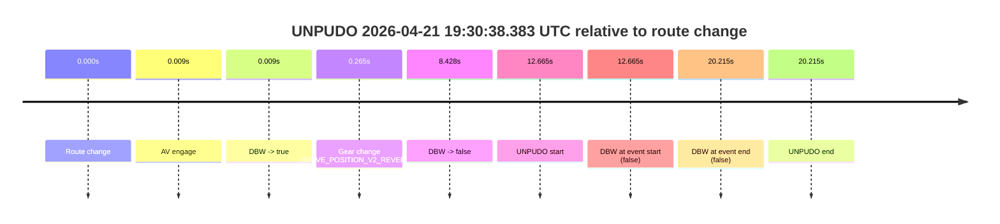
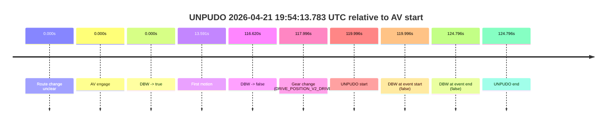
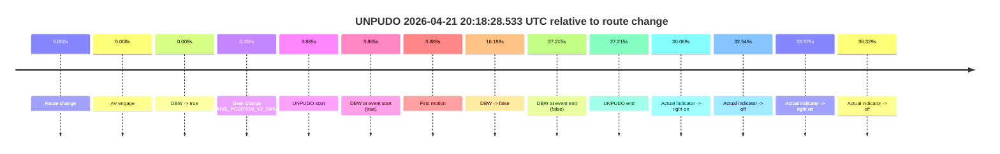
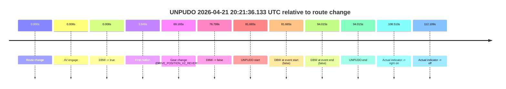
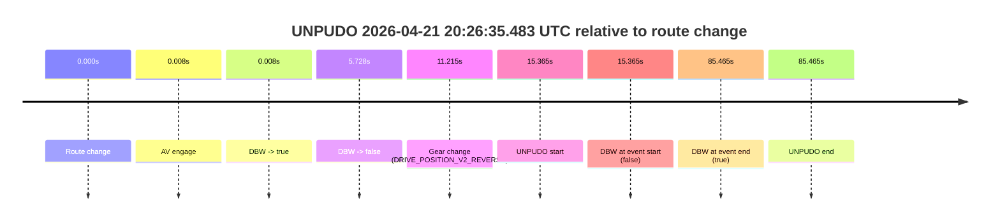
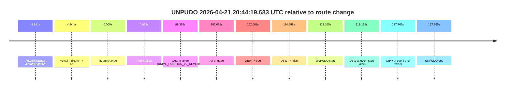

# Run Report: fme10005/2026-04-21--19-22-29--gen2-av-317481e0-4c9f-4033-96a4-619458685d04

| Field | Value |
|---|---|
| Run ID | `fme10005/2026-04-21--19-22-29--gen2-av-317481e0-4c9f-4033-96a4-619458685d04` |
| Date | `2026-04-21` |
| Model(s) | `eel-teal-outspoken` |
| Author | `zak` |
| Event count | `10` |

## unpudo 2026-04-21 19:30:38.383 UTC

| Field | Value |
|---|---|
| Model | `eel-teal-outspoken` |
| Author | `zak` |
| Run ID | `fme10005/2026-04-21--19-22-29--gen2-av-317481e0-4c9f-4033-96a4-619458685d04` |
| Date | `2026-04-21` |
| Time (UTC) | `19:30:38.383` |
| Event type | `unpudo` |
| Disengagement type | `failed_to_unpudo` |
| Route change | `found` |
| Console | [run](https://console.sso.wayve.ai/run/fme10005/2026-04-21--19-22-29--gen2-av-317481e0-4c9f-4033-96a4-619458685d04?id=&time-unixus=1776799838383299) |
| Foxglove | [segment](https://app.foxglove.dev/wayve-on-prem/p/prj_0dX18KZdVHg1fmmI/view?ds=foxglove-stream&ds.deviceName=fme10005&ds.start=2026-04-21T19%3A30%3A15.718287Z&ds.end=2026-04-21T19%3A30%3A55.933296Z&layoutId=lay_0e7VD4WIKDQGU73Y&time=2026-04-21T19%3A30%3A38.383299Z) |

### Event card: fail

- Fail: AV owns part of the segment, but the event still resolves as a model-performance failure under the AV-only scoring rule.

| Event | Time (UTC) | Delta from route change |
|---|---:|---:|
| Route change | 2026-04-21 19:30:25.718 | `0.000s` |
| AV engage | 2026-04-21 19:30:25.726 | `0.009s` |
| DBW -> true | 2026-04-21 19:30:25.726 | `0.009s` |
| Gear change (DRIVE_POSITION_V2_REVERSE) | 2026-04-21 19:30:25.983 | `0.265s` |
| DBW -> false | 2026-04-21 19:30:34.146 | `8.428s` |
| UNPUDO start | 2026-04-21 19:30:38.383 | `12.665s` |
| DBW at event start (false) | 2026-04-21 19:30:38.383 | `12.665s` |
| DBW at event end (false) | 2026-04-21 19:30:45.933 | `20.215s` |
| UNPUDO end | 2026-04-21 19:30:45.933 | `20.215s` |

| Metric | Value |
|---|---|
| Outcome | `fail` |
| Effective failure type | `failed_to_unpudo` |
| Route change status | `found` |
| DBW at event start | `false` |
| DBW at event end | `false` |
| Predicted gear at AV start | `DRIVE_POSITION_V2_PARK` |
| Actual gear at AV start | `DRIVE_POSITION_V2_PARK` |
| Predicted gear at event start | `DRIVE_POSITION_V2_REVERSE` |
| Actual gear at event start | `DRIVE_POSITION_V2_REVERSE` |
| Planned indicator direction | `INDICATORS_STATE_V2_OFF` |
| Controller indicator direction | `INDICATORS_STATE_V2_OFF` |
| Actual indicator direction | `INDICATORS_STATE_V2_OFF` |
| Actual indicator at maneuver end | `INDICATORS_STATE_V2_OFF` |
| Driver accel help in AV | `false` |
| Driver accel help timestamp | `n/a` |
| Max accel pedal pct in AV | `0.0%` |
| Max brake pedal pct in AV | `8.1%` |
| Max speed mps in AV | `0.000` |
| Success timing baseline | `route change` |
| Route -> AV | `0.009s` |
| AV -> event start | `12.657s` |
| AV -> first motion | `n/a` |
| Success baseline -> event start | `12.665s` |
| Success baseline -> first motion | `n/a` |
| AV duration before disengagement | `8.420s` |
| Trajectory waypoint count | `36` |
| Driving-plan step count | `11` |

The scored portion starts from the AV-owned window, not from the pre-AV setup. Route-change search in the stopped pre-event segment was `found`, with the baseline therefore set to route change. At the event anchor the model predicts `DRIVE_POSITION_V2_REVERSE` and the actual gear is `DRIVE_POSITION_V2_REVERSE`. The effective model outcome is `fail` because `failed_to_unpudo.`

### Resolution

| Field | Value |
|---|---|
| Final outcome | `fail` |
| Do we agree with this label? | `yes` |
| Source disengagement type | `failed_to_unpudo` |
| Resolved effective failure type | `failed_to_unpudo` |
| Confidence | `high` |

## unpudo 2026-04-21 19:54:13.783 UTC

| Field | Value |
|---|---|
| Model | `eel-teal-outspoken` |
| Author | `zak` |
| Run ID | `fme10005/2026-04-21--19-22-29--gen2-av-317481e0-4c9f-4033-96a4-619458685d04` |
| Date | `2026-04-21` |
| Time (UTC) | `19:54:13.783` |
| Event type | `unpudo` |
| Disengagement type | `uncategorised` |
| Route change | `unclear` |
| Console | [run](https://console.sso.wayve.ai/run/fme10005/2026-04-21--19-22-29--gen2-av-317481e0-4c9f-4033-96a4-619458685d04?id=&time-unixus=1776801253783318) |
| Foxglove | [segment](https://app.foxglove.dev/wayve-on-prem/p/prj_0dX18KZdVHg1fmmI/view?ds=foxglove-stream&ds.deviceName=fme10005&ds.start=2026-04-21T19%3A52%3A03.787126Z&ds.end=2026-04-21T19%3A54%3A28.583296Z&layoutId=lay_0e7VD4WIKDQGU73Y&time=2026-04-21T19%3A54%3A13.783318Z) |

### Event card: fail

- Fail: AV owns part of the segment, but the event still resolves as a model-performance failure under the AV-only scoring rule.

| Event | Time (UTC) | Delta from AV start |
|---|---:|---:|
| Route change unclear | 2026-04-21 19:52:13.787 | `0.000s` |
| AV engage | 2026-04-21 19:52:13.787 | `0.000s` |
| DBW -> true | 2026-04-21 19:52:13.787 | `0.000s` |
| First motion | 2026-04-21 19:52:27.377 | `13.591s` |
| DBW -> false | 2026-04-21 19:54:10.406 | `116.620s` |
| Gear change (DRIVE_POSITION_V2_DRIVE) | 2026-04-21 19:54:11.783 | `117.996s` |
| UNPUDO start | 2026-04-21 19:54:13.783 | `119.996s` |
| DBW at event start (false) | 2026-04-21 19:54:13.783 | `119.996s` |
| DBW at event end (false) | 2026-04-21 19:54:18.583 | `124.796s` |
| UNPUDO end | 2026-04-21 19:54:18.583 | `124.796s` |

| Metric | Value |
|---|---|
| Outcome | `fail` |
| Effective failure type | `uncategorised` |
| Route change status | `unclear` |
| DBW at event start | `false` |
| DBW at event end | `false` |
| Predicted gear at AV start | `DRIVE_POSITION_V2_DRIVE` |
| Actual gear at AV start | `DRIVE_POSITION_V2_DRIVE` |
| Predicted gear at event start | `DRIVE_POSITION_V2_DRIVE` |
| Actual gear at event start | `DRIVE_POSITION_V2_DRIVE` |
| Planned indicator direction | `INDICATORS_STATE_V2_OFF` |
| Controller indicator direction | `INDICATORS_STATE_V2_OFF` |
| Actual indicator direction | `INDICATORS_STATE_V2_OFF` |
| Actual indicator at maneuver end | `INDICATORS_STATE_V2_OFF` |
| Driver accel help in AV | `false` |
| Driver accel help timestamp | `n/a` |
| Max accel pedal pct in AV | `0.0%` |
| Max brake pedal pct in AV | `10.9%` |
| Max speed mps in AV | `14.864` |
| Success timing baseline | `AV start` |
| Route -> AV | `n/a` |
| AV -> event start | `119.996s` |
| AV -> first motion | `13.591s` |
| Success baseline -> event start | `119.996s` |
| Success baseline -> first motion | `13.591s` |
| AV duration before disengagement | `116.620s` |
| Trajectory waypoint count | `36` |
| Driving-plan step count | `11` |

The scored portion starts from the AV-owned window, not from the pre-AV setup. Route-change search in the stopped pre-event segment was `unclear`, with the baseline therefore set to AV start. At the event anchor the model predicts `DRIVE_POSITION_V2_DRIVE` and the actual gear is `DRIVE_POSITION_V2_DRIVE`. The effective model outcome is `fail` because `uncategorised.`

### Resolution

| Field | Value |
|---|---|
| Final outcome | `fail` |
| Do we agree with this label? | `yes` |
| Source disengagement type | `uncategorised` |
| Resolved effective failure type | `uncategorised` |
| Confidence | `medium` |

## unpudo 2026-04-21 20:07:46.933 UTC

| Field | Value |
|---|---|
| Model | `eel-teal-outspoken` |
| Author | `zak` |
| Run ID | `fme10005/2026-04-21--19-22-29--gen2-av-317481e0-4c9f-4033-96a4-619458685d04` |
| Date | `2026-04-21` |
| Time (UTC) | `20:07:46.933` |
| Event type | `unpudo` |
| Disengagement type | `failed_to_unpudo` |
| Route change | `found` |
| Console | [run](https://console.sso.wayve.ai/run/fme10005/2026-04-21--19-22-29--gen2-av-317481e0-4c9f-4033-96a4-619458685d04?id=&time-unixus=1776802066933306) |
| Foxglove | [segment](https://app.foxglove.dev/wayve-on-prem/p/prj_0dX18KZdVHg1fmmI/view?ds=foxglove-stream&ds.deviceName=fme10005&ds.start=2026-04-21T20%3A07%3A26.618315Z&ds.end=2026-04-21T20%3A08%3A07.383314Z&layoutId=lay_0e7VD4WIKDQGU73Y&time=2026-04-21T20%3A07%3A46.933306Z) |

### Event card: fail

- Fail: AV owns part of the segment, but the event still resolves as a model-performance failure under the AV-only scoring rule.

| Event | Time (UTC) | Delta from route change |
|---|---:|---:|
| Route change | 2026-04-21 20:07:36.618 | `0.000s` |
| AV engage | 2026-04-21 20:07:36.626 | `0.008s` |
| DBW -> true | 2026-04-21 20:07:36.626 | `0.008s` |
| Gear change (DRIVE_POSITION_V2_REVERSE) | 2026-04-21 20:07:37.233 | `0.615s` |
| DBW -> false | 2026-04-21 20:07:43.846 | `7.228s` |
| UNPUDO start | 2026-04-21 20:07:46.933 | `10.315s` |
| DBW at event start (false) | 2026-04-21 20:07:46.933 | `10.315s` |
| DBW at event end (false) | 2026-04-21 20:07:57.383 | `20.765s` |
| UNPUDO end | 2026-04-21 20:07:57.383 | `20.765s` |

| Metric | Value |
|---|---|
| Outcome | `fail` |
| Effective failure type | `failed_to_unpudo` |
| Route change status | `found` |
| DBW at event start | `false` |
| DBW at event end | `false` |
| Predicted gear at AV start | `DRIVE_POSITION_V2_PARK` |
| Actual gear at AV start | `DRIVE_POSITION_V2_PARK` |
| Predicted gear at event start | `DRIVE_POSITION_V2_REVERSE` |
| Actual gear at event start | `DRIVE_POSITION_V2_REVERSE` |
| Planned indicator direction | `INDICATORS_STATE_V2_OFF` |
| Controller indicator direction | `INDICATORS_STATE_V2_OFF` |
| Actual indicator direction | `INDICATORS_STATE_V2_OFF` |
| Actual indicator at maneuver end | `INDICATORS_STATE_V2_OFF` |
| Driver accel help in AV | `false` |
| Driver accel help timestamp | `n/a` |
| Max accel pedal pct in AV | `0.0%` |
| Max brake pedal pct in AV | `8.0%` |
| Max speed mps in AV | `0.000` |
| Success timing baseline | `route change` |
| Route -> AV | `0.008s` |
| AV -> event start | `10.307s` |
| AV -> first motion | `n/a` |
| Success baseline -> event start | `10.315s` |
| Success baseline -> first motion | `n/a` |
| AV duration before disengagement | `7.220s` |
| Trajectory waypoint count | `37` |
| Driving-plan step count | `11` |

The scored portion starts from the AV-owned window, not from the pre-AV setup. Route-change search in the stopped pre-event segment was `found`, with the baseline therefore set to route change. At the event anchor the model predicts `DRIVE_POSITION_V2_REVERSE` and the actual gear is `DRIVE_POSITION_V2_REVERSE`. The effective model outcome is `fail` because `failed_to_unpudo.`

### Resolution

| Field | Value |
|---|---|
| Final outcome | `fail` |
| Do we agree with this label? | `yes` |
| Source disengagement type | `failed_to_unpudo` |
| Resolved effective failure type | `failed_to_unpudo` |
| Confidence | `high` |

## unpudo 2026-04-21 20:18:28.533 UTC

| Field | Value |
|---|---|
| Model | `eel-teal-outspoken` |
| Author | `zak` |
| Run ID | `fme10005/2026-04-21--19-22-29--gen2-av-317481e0-4c9f-4033-96a4-619458685d04` |
| Date | `2026-04-21` |
| Time (UTC) | `20:18:28.533` |
| Event type | `unpudo` |
| Disengagement type | `failed_to_unpudo` |
| Route change | `found` |
| Console | [run](https://console.sso.wayve.ai/run/fme10005/2026-04-21--19-22-29--gen2-av-317481e0-4c9f-4033-96a4-619458685d04?id=&time-unixus=1776802708533311) |
| Foxglove | [segment](https://app.foxglove.dev/wayve-on-prem/p/prj_0dX18KZdVHg1fmmI/view?ds=foxglove-stream&ds.deviceName=fme10005&ds.start=2026-04-21T20%3A18%3A14.668346Z&ds.end=2026-04-21T20%3A19%3A01.883301Z&layoutId=lay_0e7VD4WIKDQGU73Y&time=2026-04-21T20%3A18%3A28.533311Z) |

### Event card: fail

- Fail: AV owns part of the segment, but the event still resolves as a model-performance failure under the AV-only scoring rule.

| Event | Time (UTC) | Delta from route change |
|---|---:|---:|
| Route change | 2026-04-21 20:18:24.668 | `0.000s` |
| AV engage | 2026-04-21 20:18:24.676 | `0.008s` |
| DBW -> true | 2026-04-21 20:18:24.676 | `0.008s` |
| Gear change (DRIVE_POSITION_V2_DRIVE) | 2026-04-21 20:18:24.933 | `0.265s` |
| UNPUDO start | 2026-04-21 20:18:28.533 | `3.865s` |
| DBW at event start (true) | 2026-04-21 20:18:28.533 | `3.865s` |
| First motion | 2026-04-21 20:18:28.557 | `3.889s` |
| DBW -> false | 2026-04-21 20:18:40.866 | `16.198s` |
| DBW at event end (false) | 2026-04-21 20:18:51.883 | `27.215s` |
| UNPUDO end | 2026-04-21 20:18:51.883 | `27.215s` |
| Actual indicator -> right on | 2026-04-21 20:18:54.737 | `30.069s` |
| Actual indicator -> off | 2026-04-21 20:18:57.217 | `32.549s` |
| Actual indicator -> right on | 2026-04-21 20:18:57.997 | `33.329s` |
| Actual indicator -> off | 2026-04-21 20:19:00.997 | `36.329s` |

| Metric | Value |
|---|---|
| Outcome | `fail` |
| Effective failure type | `failed_to_unpudo` |
| Route change status | `found` |
| DBW at event start | `true` |
| DBW at event end | `false` |
| Predicted gear at AV start | `DRIVE_POSITION_V2_PARK` |
| Actual gear at AV start | `DRIVE_POSITION_V2_PARK` |
| Predicted gear at event start | `DRIVE_POSITION_V2_DRIVE` |
| Actual gear at event start | `DRIVE_POSITION_V2_DRIVE` |
| Planned indicator direction | `INDICATORS_STATE_V2_OFF` |
| Controller indicator direction | `INDICATORS_STATE_V2_OFF` |
| Actual indicator direction | `INDICATORS_STATE_V2_OFF` |
| Actual indicator at maneuver end | `INDICATORS_STATE_V2_OFF` |
| Driver accel help in AV | `false` |
| Driver accel help timestamp | `n/a` |
| Max accel pedal pct in AV | `0.0%` |
| Max brake pedal pct in AV | `18.9%` |
| Max speed mps in AV | `1.825` |
| Success timing baseline | `route change` |
| Route -> AV | `0.008s` |
| AV -> event start | `3.857s` |
| AV -> first motion | `3.881s` |
| Success baseline -> event start | `3.865s` |
| Success baseline -> first motion | `3.889s` |
| AV duration before disengagement | `16.190s` |
| Trajectory waypoint count | `37` |
| Driving-plan step count | `11` |

The scored portion starts from the AV-owned window, not from the pre-AV setup. Route-change search in the stopped pre-event segment was `found`, with the baseline therefore set to route change. At the event anchor the model predicts `DRIVE_POSITION_V2_DRIVE` and the actual gear is `DRIVE_POSITION_V2_DRIVE`. The effective model outcome is `fail` because `failed_to_unpudo.`

### Resolution

| Field | Value |
|---|---|
| Final outcome | `fail` |
| Do we agree with this label? | `yes` |
| Source disengagement type | `failed_to_unpudo` |
| Resolved effective failure type | `failed_to_unpudo` |
| Confidence | `high` |

## unpudo 2026-04-21 20:21:36.133 UTC

| Field | Value |
|---|---|
| Model | `eel-teal-outspoken` |
| Author | `zak` |
| Run ID | `fme10005/2026-04-21--19-22-29--gen2-av-317481e0-4c9f-4033-96a4-619458685d04` |
| Date | `2026-04-21` |
| Time (UTC) | `20:21:36.133` |
| Event type | `unpudo` |
| Disengagement type | `failed_to_unpudo` |
| Route change | `found` |
| Console | [run](https://console.sso.wayve.ai/run/fme10005/2026-04-21--19-22-29--gen2-av-317481e0-4c9f-4033-96a4-619458685d04?id=&time-unixus=1776802896133303) |
| Foxglove | [segment](https://app.foxglove.dev/wayve-on-prem/p/prj_0dX18KZdVHg1fmmI/view?ds=foxglove-stream&ds.deviceName=fme10005&ds.start=2026-04-21T20%3A20%3A04.468258Z&ds.end=2026-04-21T20%3A21%3A58.483290Z&layoutId=lay_0e7VD4WIKDQGU73Y&time=2026-04-21T20%3A21%3A36.133303Z) |

### Event card: fail

- Fail: AV owns part of the segment, but the event still resolves as a model-performance failure under the AV-only scoring rule.

| Event | Time (UTC) | Delta from route change |
|---|---:|---:|
| Route change | 2026-04-21 20:20:14.468 | `0.000s` |
| AV engage | 2026-04-21 20:20:14.476 | `0.008s` |
| DBW -> true | 2026-04-21 20:20:14.476 | `0.008s` |
| First motion | 2026-04-21 20:20:18.417 | `3.949s` |
| Gear change (DRIVE_POSITION_V2_REVERSE) | 2026-04-21 20:21:23.633 | `69.165s` |
| DBW -> false | 2026-04-21 20:21:31.267 | `76.799s` |
| UNPUDO start | 2026-04-21 20:21:36.133 | `81.665s` |
| DBW at event start (false) | 2026-04-21 20:21:36.133 | `81.665s` |
| DBW at event end (false) | 2026-04-21 20:21:48.483 | `94.015s` |
| UNPUDO end | 2026-04-21 20:21:48.483 | `94.015s` |
| Actual indicator -> right on | 2026-04-21 20:22:02.977 | `108.510s` |
| Actual indicator -> off | 2026-04-21 20:22:06.577 | `112.109s` |

| Metric | Value |
|---|---|
| Outcome | `fail` |
| Effective failure type | `failed_to_unpudo` |
| Route change status | `found` |
| DBW at event start | `false` |
| DBW at event end | `false` |
| Predicted gear at AV start | `DRIVE_POSITION_V2_PARK` |
| Actual gear at AV start | `DRIVE_POSITION_V2_PARK` |
| Predicted gear at event start | `DRIVE_POSITION_V2_REVERSE` |
| Actual gear at event start | `DRIVE_POSITION_V2_REVERSE` |
| Planned indicator direction | `INDICATORS_STATE_V2_OFF` |
| Controller indicator direction | `INDICATORS_STATE_V2_OFF` |
| Actual indicator direction | `INDICATORS_STATE_V2_OFF` |
| Actual indicator at maneuver end | `INDICATORS_STATE_V2_OFF` |
| Driver accel help in AV | `false` |
| Driver accel help timestamp | `n/a` |
| Max accel pedal pct in AV | `0.0%` |
| Max brake pedal pct in AV | `8.0%` |
| Max speed mps in AV | `3.494` |
| Success timing baseline | `route change` |
| Route -> AV | `0.008s` |
| AV -> event start | `81.657s` |
| AV -> first motion | `3.941s` |
| Success baseline -> event start | `81.665s` |
| Success baseline -> first motion | `3.949s` |
| AV duration before disengagement | `76.790s` |
| Trajectory waypoint count | `37` |
| Driving-plan step count | `11` |

The scored portion starts from the AV-owned window, not from the pre-AV setup. Route-change search in the stopped pre-event segment was `found`, with the baseline therefore set to route change. At the event anchor the model predicts `DRIVE_POSITION_V2_REVERSE` and the actual gear is `DRIVE_POSITION_V2_REVERSE`. The effective model outcome is `fail` because `failed_to_unpudo.`

### Resolution

| Field | Value |
|---|---|
| Final outcome | `fail` |
| Do we agree with this label? | `yes` |
| Source disengagement type | `failed_to_unpudo` |
| Resolved effective failure type | `failed_to_unpudo` |
| Confidence | `high` |

## unpudo 2026-04-21 20:26:35.483 UTC

| Field | Value |
|---|---|
| Model | `eel-teal-outspoken` |
| Author | `zak` |
| Run ID | `fme10005/2026-04-21--19-22-29--gen2-av-317481e0-4c9f-4033-96a4-619458685d04` |
| Date | `2026-04-21` |
| Time (UTC) | `20:26:35.483` |
| Event type | `unpudo` |
| Disengagement type | `uncategorised` |
| Route change | `found` |
| Console | [run](https://console.sso.wayve.ai/run/fme10005/2026-04-21--19-22-29--gen2-av-317481e0-4c9f-4033-96a4-619458685d04?id=&time-unixus=1776803195483306) |
| Foxglove | [segment](https://app.foxglove.dev/wayve-on-prem/p/prj_0dX18KZdVHg1fmmI/view?ds=foxglove-stream&ds.deviceName=fme10005&ds.start=2026-04-21T20%3A26%3A10.118301Z&ds.end=2026-04-21T20%3A27%3A55.583291Z&layoutId=lay_0e7VD4WIKDQGU73Y&time=2026-04-21T20%3A26%3A35.483306Z) |

### Event card: fail

- Fail: AV owns part of the segment, but the event still resolves as a model-performance failure under the AV-only scoring rule.

| Event | Time (UTC) | Delta from route change |
|---|---:|---:|
| Route change | 2026-04-21 20:26:20.118 | `0.000s` |
| AV engage | 2026-04-21 20:26:20.126 | `0.008s` |
| DBW -> true | 2026-04-21 20:26:20.126 | `0.008s` |
| DBW -> false | 2026-04-21 20:26:25.846 | `5.728s` |
| Gear change (DRIVE_POSITION_V2_REVERSE) | 2026-04-21 20:26:31.333 | `11.215s` |
| UNPUDO start | 2026-04-21 20:26:35.483 | `15.365s` |
| DBW at event start (false) | 2026-04-21 20:26:35.483 | `15.365s` |
| DBW at event end (true) | 2026-04-21 20:27:45.583 | `85.465s` |
| UNPUDO end | 2026-04-21 20:27:45.583 | `85.465s` |

| Metric | Value |
|---|---|
| Outcome | `fail` |
| Effective failure type | `uncategorised` |
| Route change status | `found` |
| DBW at event start | `false` |
| DBW at event end | `true` |
| Predicted gear at AV start | `DRIVE_POSITION_V2_PARK` |
| Actual gear at AV start | `DRIVE_POSITION_V2_PARK` |
| Predicted gear at event start | `DRIVE_POSITION_V2_REVERSE` |
| Actual gear at event start | `DRIVE_POSITION_V2_REVERSE` |
| Planned indicator direction | `INDICATORS_STATE_V2_OFF` |
| Controller indicator direction | `INDICATORS_STATE_V2_OFF` |
| Actual indicator direction | `INDICATORS_STATE_V2_OFF` |
| Actual indicator at maneuver end | `INDICATORS_STATE_V2_OFF` |
| Driver accel help in AV | `false` |
| Driver accel help timestamp | `n/a` |
| Max accel pedal pct in AV | `0.0%` |
| Max brake pedal pct in AV | `8.0%` |
| Max speed mps in AV | `0.000` |
| Success timing baseline | `route change` |
| Route -> AV | `0.008s` |
| AV -> event start | `15.357s` |
| AV -> first motion | `n/a` |
| Success baseline -> event start | `15.365s` |
| Success baseline -> first motion | `n/a` |
| AV duration before disengagement | `5.720s` |
| Trajectory waypoint count | `36` |
| Driving-plan step count | `11` |

The scored portion starts from the AV-owned window, not from the pre-AV setup. Route-change search in the stopped pre-event segment was `found`, with the baseline therefore set to route change. At the event anchor the model predicts `DRIVE_POSITION_V2_REVERSE` and the actual gear is `DRIVE_POSITION_V2_REVERSE`. The effective model outcome is `fail` because `uncategorised.`

### Resolution

| Field | Value |
|---|---|
| Final outcome | `fail` |
| Do we agree with this label? | `yes` |
| Source disengagement type | `uncategorised` |
| Resolved effective failure type | `uncategorised` |
| Confidence | `high` |

## unpudo 2026-04-21 20:30:32.183 UTC

| Field | Value |
|---|---|
| Model | `eel-teal-outspoken` |
| Author | `zak` |
| Run ID | `fme10005/2026-04-21--19-22-29--gen2-av-317481e0-4c9f-4033-96a4-619458685d04` |
| Date | `2026-04-21` |
| Time (UTC) | `20:30:32.183` |
| Event type | `unpudo` |
| Disengagement type | `failed_to_unpudo` |
| Route change | `found` |
| Console | [run](https://console.sso.wayve.ai/run/fme10005/2026-04-21--19-22-29--gen2-av-317481e0-4c9f-4033-96a4-619458685d04?id=&time-unixus=1776803432183316) |
| Foxglove | [segment](https://app.foxglove.dev/wayve-on-prem/p/prj_0dX18KZdVHg1fmmI/view?ds=foxglove-stream&ds.deviceName=fme10005&ds.start=2026-04-21T20%3A30%3A11.518262Z&ds.end=2026-04-21T20%3A30%3A49.733303Z&layoutId=lay_0e7VD4WIKDQGU73Y&time=2026-04-21T20%3A30%3A32.183316Z) |

### Event card: fail

- Fail: AV owns part of the segment, but the event still resolves as a model-performance failure under the AV-only scoring rule.

| Event | Time (UTC) | Delta from route change |
|---|---:|---:|
| Route change | 2026-04-21 20:30:21.518 | `0.000s` |
| AV engage | 2026-04-21 20:30:21.526 | `0.009s` |
| DBW -> true | 2026-04-21 20:30:21.526 | `0.009s` |
| Gear change (DRIVE_POSITION_V2_REVERSE) | 2026-04-21 20:30:21.833 | `0.315s` |
| DBW -> false | 2026-04-21 20:30:27.146 | `5.628s` |
| UNPUDO start | 2026-04-21 20:30:32.183 | `10.665s` |
| DBW at event start (false) | 2026-04-21 20:30:32.183 | `10.665s` |
| DBW at event end (false) | 2026-04-21 20:30:39.733 | `18.215s` |
| UNPUDO end | 2026-04-21 20:30:39.733 | `18.215s` |

| Metric | Value |
|---|---|
| Outcome | `fail` |
| Effective failure type | `failed_to_unpudo` |
| Route change status | `found` |
| DBW at event start | `false` |
| DBW at event end | `false` |
| Predicted gear at AV start | `DRIVE_POSITION_V2_PARK` |
| Actual gear at AV start | `DRIVE_POSITION_V2_PARK` |
| Predicted gear at event start | `DRIVE_POSITION_V2_REVERSE` |
| Actual gear at event start | `DRIVE_POSITION_V2_REVERSE` |
| Planned indicator direction | `INDICATORS_STATE_V2_OFF` |
| Controller indicator direction | `INDICATORS_STATE_V2_OFF` |
| Actual indicator direction | `INDICATORS_STATE_V2_OFF` |
| Actual indicator at maneuver end | `INDICATORS_STATE_V2_OFF` |
| Driver accel help in AV | `false` |
| Driver accel help timestamp | `n/a` |
| Max accel pedal pct in AV | `0.0%` |
| Max brake pedal pct in AV | `11.6%` |
| Max speed mps in AV | `0.000` |
| Success timing baseline | `route change` |
| Route -> AV | `0.009s` |
| AV -> event start | `10.656s` |
| AV -> first motion | `n/a` |
| Success baseline -> event start | `10.665s` |
| Success baseline -> first motion | `n/a` |
| AV duration before disengagement | `5.620s` |
| Trajectory waypoint count | `36` |
| Driving-plan step count | `11` |

The scored portion starts from the AV-owned window, not from the pre-AV setup. Route-change search in the stopped pre-event segment was `found`, with the baseline therefore set to route change. At the event anchor the model predicts `DRIVE_POSITION_V2_REVERSE` and the actual gear is `DRIVE_POSITION_V2_REVERSE`. The effective model outcome is `fail` because `failed_to_unpudo.`

### Resolution

| Field | Value |
|---|---|
| Final outcome | `fail` |
| Do we agree with this label? | `yes` |
| Source disengagement type | `failed_to_unpudo` |
| Resolved effective failure type | `failed_to_unpudo` |
| Confidence | `high` |

## unpudo 2026-04-21 20:32:30.533 UTC

| Field | Value |
|---|---|
| Model | `eel-teal-outspoken` |
| Author | `zak` |
| Run ID | `fme10005/2026-04-21--19-22-29--gen2-av-317481e0-4c9f-4033-96a4-619458685d04` |
| Date | `2026-04-21` |
| Time (UTC) | `20:32:30.533` |
| Event type | `unpudo` |
| Disengagement type | `failed_to_unpudo` |
| Route change | `found` |
| Console | [run](https://console.sso.wayve.ai/run/fme10005/2026-04-21--19-22-29--gen2-av-317481e0-4c9f-4033-96a4-619458685d04?id=&time-unixus=1776803550533305) |
| Foxglove | [segment](https://app.foxglove.dev/wayve-on-prem/p/prj_0dX18KZdVHg1fmmI/view?ds=foxglove-stream&ds.deviceName=fme10005&ds.start=2026-04-21T20%3A32%3A08.368248Z&ds.end=2026-04-21T20%3A32%3A48.033293Z&layoutId=lay_0e7VD4WIKDQGU73Y&time=2026-04-21T20%3A32%3A30.533305Z) |

### Event card: fail

- Fail: AV owns part of the segment, but the event still resolves as a model-performance failure under the AV-only scoring rule.

| Event | Time (UTC) | Delta from route change |
|---|---:|---:|
| Route change | 2026-04-21 20:32:18.368 | `0.000s` |
| AV engage | 2026-04-21 20:32:18.375 | `0.008s` |
| DBW -> true | 2026-04-21 20:32:18.375 | `0.008s` |
| Gear change (DRIVE_POSITION_V2_REVERSE) | 2026-04-21 20:32:18.733 | `0.365s` |
| DBW -> false | 2026-04-21 20:32:25.427 | `7.059s` |
| UNPUDO start | 2026-04-21 20:32:30.533 | `12.165s` |
| DBW at event start (false) | 2026-04-21 20:32:30.533 | `12.165s` |
| DBW at event end (false) | 2026-04-21 20:32:38.033 | `19.665s` |
| UNPUDO end | 2026-04-21 20:32:38.033 | `19.665s` |
| Actual indicator -> right on | 2026-04-21 20:32:57.797 | `39.430s` |

| Metric | Value |
|---|---|
| Outcome | `fail` |
| Effective failure type | `failed_to_unpudo` |
| Route change status | `found` |
| DBW at event start | `false` |
| DBW at event end | `false` |
| Predicted gear at AV start | `DRIVE_POSITION_V2_PARK` |
| Actual gear at AV start | `DRIVE_POSITION_V2_PARK` |
| Predicted gear at event start | `DRIVE_POSITION_V2_REVERSE` |
| Actual gear at event start | `DRIVE_POSITION_V2_REVERSE` |
| Planned indicator direction | `INDICATORS_STATE_V2_OFF` |
| Controller indicator direction | `INDICATORS_STATE_V2_OFF` |
| Actual indicator direction | `INDICATORS_STATE_V2_OFF` |
| Actual indicator at maneuver end | `INDICATORS_STATE_V2_OFF` |
| Driver accel help in AV | `false` |
| Driver accel help timestamp | `n/a` |
| Max accel pedal pct in AV | `0.0%` |
| Max brake pedal pct in AV | `11.2%` |
| Max speed mps in AV | `0.000` |
| Success timing baseline | `route change` |
| Route -> AV | `0.008s` |
| AV -> event start | `12.157s` |
| AV -> first motion | `n/a` |
| Success baseline -> event start | `12.165s` |
| Success baseline -> first motion | `n/a` |
| AV duration before disengagement | `7.052s` |
| Trajectory waypoint count | `37` |
| Driving-plan step count | `11` |

The scored portion starts from the AV-owned window, not from the pre-AV setup. Route-change search in the stopped pre-event segment was `found`, with the baseline therefore set to route change. At the event anchor the model predicts `DRIVE_POSITION_V2_REVERSE` and the actual gear is `DRIVE_POSITION_V2_REVERSE`. The effective model outcome is `fail` because `failed_to_unpudo.`

### Resolution

| Field | Value |
|---|---|
| Final outcome | `fail` |
| Do we agree with this label? | `yes` |
| Source disengagement type | `failed_to_unpudo` |
| Resolved effective failure type | `failed_to_unpudo` |
| Confidence | `high` |

## unpudo 2026-04-21 20:39:27.233 UTC

| Field | Value |
|---|---|
| Model | `eel-teal-outspoken` |
| Author | `zak` |
| Run ID | `fme10005/2026-04-21--19-22-29--gen2-av-317481e0-4c9f-4033-96a4-619458685d04` |
| Date | `2026-04-21` |
| Time (UTC) | `20:39:27.233` |
| Event type | `unpudo` |
| Disengagement type | `failed_to_unpudo` |
| Route change | `found` |
| Console | [run](https://console.sso.wayve.ai/run/fme10005/2026-04-21--19-22-29--gen2-av-317481e0-4c9f-4033-96a4-619458685d04?id=&time-unixus=1776803967233290) |
| Foxglove | [segment](https://app.foxglove.dev/wayve-on-prem/p/prj_0dX18KZdVHg1fmmI/view?ds=foxglove-stream&ds.deviceName=fme10005&ds.start=2026-04-21T20%3A39%3A07.368251Z&ds.end=2026-04-21T20%3A39%3A52.883296Z&layoutId=lay_0e7VD4WIKDQGU73Y&time=2026-04-21T20%3A39%3A27.233290Z) |

### Event card: fail

- Fail: AV owns part of the segment, but the event still resolves as a model-performance failure under the AV-only scoring rule.

| Event | Time (UTC) | Delta from route change |
|---|---:|---:|
| Route change | 2026-04-21 20:39:17.368 | `0.000s` |
| AV engage | 2026-04-21 20:39:17.375 | `0.008s` |
| DBW -> true | 2026-04-21 20:39:17.375 | `0.008s` |
| Gear change (DRIVE_POSITION_V2_REVERSE) | 2026-04-21 20:39:17.633 | `0.265s` |
| DBW -> false | 2026-04-21 20:39:22.666 | `5.298s` |
| UNPUDO start | 2026-04-21 20:39:27.233 | `9.865s` |
| DBW at event start (false) | 2026-04-21 20:39:27.233 | `9.865s` |
| DBW at event end (true) | 2026-04-21 20:39:42.883 | `25.515s` |
| UNPUDO end | 2026-04-21 20:39:42.883 | `25.515s` |

| Metric | Value |
|---|---|
| Outcome | `fail` |
| Effective failure type | `failed_to_unpudo` |
| Route change status | `found` |
| DBW at event start | `false` |
| DBW at event end | `true` |
| Predicted gear at AV start | `DRIVE_POSITION_V2_PARK` |
| Actual gear at AV start | `DRIVE_POSITION_V2_PARK` |
| Predicted gear at event start | `DRIVE_POSITION_V2_REVERSE` |
| Actual gear at event start | `DRIVE_POSITION_V2_REVERSE` |
| Planned indicator direction | `INDICATORS_STATE_V2_OFF` |
| Controller indicator direction | `INDICATORS_STATE_V2_OFF` |
| Actual indicator direction | `INDICATORS_STATE_V2_OFF` |
| Actual indicator at maneuver end | `INDICATORS_STATE_V2_OFF` |
| Driver accel help in AV | `false` |
| Driver accel help timestamp | `n/a` |
| Max accel pedal pct in AV | `0.0%` |
| Max brake pedal pct in AV | `10.2%` |
| Max speed mps in AV | `0.000` |
| Success timing baseline | `route change` |
| Route -> AV | `0.008s` |
| AV -> event start | `9.857s` |
| AV -> first motion | `n/a` |
| Success baseline -> event start | `9.865s` |
| Success baseline -> first motion | `n/a` |
| AV duration before disengagement | `5.291s` |
| Trajectory waypoint count | `37` |
| Driving-plan step count | `11` |

The scored portion starts from the AV-owned window, not from the pre-AV setup. Route-change search in the stopped pre-event segment was `found`, with the baseline therefore set to route change. At the event anchor the model predicts `DRIVE_POSITION_V2_REVERSE` and the actual gear is `DRIVE_POSITION_V2_REVERSE`. The effective model outcome is `fail` because `failed_to_unpudo.`

### Resolution

| Field | Value |
|---|---|
| Final outcome | `fail` |
| Do we agree with this label? | `yes` |
| Source disengagement type | `failed_to_unpudo` |
| Resolved effective failure type | `failed_to_unpudo` |
| Confidence | `high` |

## unpudo 2026-04-21 20:44:19.683 UTC

| Field | Value |
|---|---|
| Model | `eel-teal-outspoken` |
| Author | `zak` |
| Run ID | `fme10005/2026-04-21--19-22-29--gen2-av-317481e0-4c9f-4033-96a4-619458685d04` |
| Date | `2026-04-21` |
| Time (UTC) | `20:44:19.683` |
| Event type | `unpudo` |
| Disengagement type | `failed_to_unpudo` |
| Route change | `found` |
| Console | [run](https://console.sso.wayve.ai/run/fme10005/2026-04-21--19-22-29--gen2-av-317481e0-4c9f-4033-96a4-619458685d04?id=&time-unixus=1776804259683317) |
| Foxglove | [segment](https://app.foxglove.dev/wayve-on-prem/p/prj_0dX18KZdVHg1fmmI/view?ds=foxglove-stream&ds.deviceName=fme10005&ds.start=2026-04-21T20%3A42%3A10.518297Z&ds.end=2026-04-21T20%3A44%3A38.283313Z&layoutId=lay_0e7VD4WIKDQGU73Y&time=2026-04-21T20%3A44%3A19.683317Z) |

### Event card: fail

- Fail: AV owns part of the segment, but the event still resolves as a model-performance failure under the AV-only scoring rule.

| Event | Time (UTC) | Delta from route change |
|---|---:|---:|
| Actual indicator already right on | 2026-04-21 20:42:10.537 | `-9.981s` |
| Actual indicator -> off | 2026-04-21 20:42:15.577 | `-4.941s` |
| Route change | 2026-04-21 20:42:20.518 | `0.000s` |
| First motion | 2026-04-21 20:42:20.537 | `0.019s` |
| Gear change (DRIVE_POSITION_V2_REVERSE) | 2026-04-21 20:43:59.883 | `99.365s` |
| AV engage | 2026-04-21 20:44:02.586 | `102.068s` |
| DBW -> true | 2026-04-21 20:44:02.586 | `102.068s` |
| DBW -> false | 2026-04-21 20:44:15.206 | `114.688s` |
| UNPUDO start | 2026-04-21 20:44:19.683 | `119.165s` |
| DBW at event start (false) | 2026-04-21 20:44:19.683 | `119.165s` |
| DBW at event end (false) | 2026-04-21 20:44:28.283 | `127.765s` |
| UNPUDO end | 2026-04-21 20:44:28.283 | `127.765s` |

| Metric | Value |
|---|---|
| Outcome | `fail` |
| Effective failure type | `failed_to_unpudo` |
| Route change status | `found` |
| DBW at event start | `false` |
| DBW at event end | `false` |
| Predicted gear at AV start | `DRIVE_POSITION_V2_REVERSE` |
| Actual gear at AV start | `DRIVE_POSITION_V2_REVERSE` |
| Predicted gear at event start | `DRIVE_POSITION_V2_REVERSE` |
| Actual gear at event start | `DRIVE_POSITION_V2_REVERSE` |
| Planned indicator direction | `INDICATORS_STATE_V2_OFF` |
| Controller indicator direction | `INDICATORS_STATE_V2_OFF` |
| Actual indicator direction | `INDICATORS_STATE_V2_OFF` |
| Actual indicator at maneuver end | `INDICATORS_STATE_V2_OFF` |
| Driver accel help in AV | `false` |
| Driver accel help timestamp | `n/a` |
| Max accel pedal pct in AV | `0.0%` |
| Max brake pedal pct in AV | `8.0%` |
| Max speed mps in AV | `0.000` |
| Success timing baseline | `route change` |
| Route -> AV | `102.068s` |
| AV -> event start | `17.097s` |
| AV -> first motion | `-102.049s` |
| Success baseline -> event start | `119.165s` |
| Success baseline -> first motion | `0.019s` |
| AV duration before disengagement | `12.620s` |
| Trajectory waypoint count | `36` |
| Driving-plan step count | `11` |

The scored portion starts from the AV-owned window, not from the pre-AV setup. Route-change search in the stopped pre-event segment was `found`, with the baseline therefore set to route change. At the event anchor the model predicts `DRIVE_POSITION_V2_REVERSE` and the actual gear is `DRIVE_POSITION_V2_REVERSE`. The effective model outcome is `fail` because `failed_to_unpudo.`

### Resolution

| Field | Value |
|---|---|
| Final outcome | `fail` |
| Do we agree with this label? | `yes` |
| Source disengagement type | `failed_to_unpudo` |
| Resolved effective failure type | `failed_to_unpudo` |
| Confidence | `high` |
