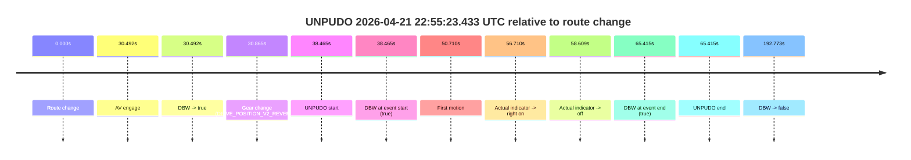
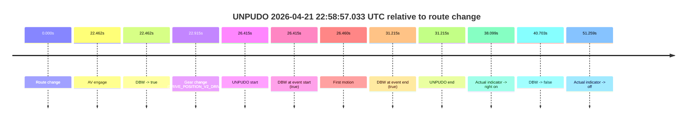
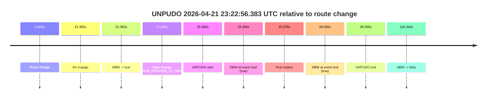
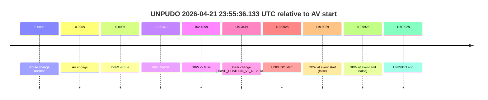

# Run Report: fme10005/2026-04-21--22-45-43--gen2-av-6b543448-3e97-4bce-9fa2-8f7957497d44

| Field | Value |
|---|---|
| Run ID | `fme10005/2026-04-21--22-45-43--gen2-av-6b543448-3e97-4bce-9fa2-8f7957497d44` |
| Date | `2026-04-21` |
| Model(s) | `eel-teal-outspoken` |
| Author | `zak` |
| Event count | `5` |

## unpudo 2026-04-21 22:55:23.433 UTC

| Field | Value |
|---|---|
| Model | `eel-teal-outspoken` |
| Author | `zak` |
| Run ID | `fme10005/2026-04-21--22-45-43--gen2-av-6b543448-3e97-4bce-9fa2-8f7957497d44` |
| Date | `2026-04-21` |
| Time (UTC) | `22:55:23.433` |
| Event type | `unpudo` |
| Disengagement type | `none observed` |
| Route change | `found` |
| Console | [run](https://console.sso.wayve.ai/run/fme10005/2026-04-21--22-45-43--gen2-av-6b543448-3e97-4bce-9fa2-8f7957497d44?id=&time-unixus=1776812123433305) |
| Foxglove | [segment](https://app.foxglove.dev/wayve-on-prem/p/prj_0dX18KZdVHg1fmmI/view?ds=foxglove-stream&ds.deviceName=fme10005&ds.start=2026-04-21T22%3A54%3A34.968371Z&ds.end=2026-04-21T22%3A58%3A07.741431Z&layoutId=lay_0e7VD4WIKDQGU73Y&time=2026-04-21T22%3A55%3A23.433305Z) |

### Event card: pass

- Pass: AV owns the credited unpudo from route change through the official unpudo window, the gear state is aligned at the anchor, and the vehicle moves without driver accelerator help in AV.

| Event | Time (UTC) | Delta from route change |
|---|---:|---:|
| Route change | 2026-04-21 22:54:44.968 | `0.000s` |
| AV engage | 2026-04-21 22:55:15.460 | `30.492s` |
| DBW -> true | 2026-04-21 22:55:15.460 | `30.492s` |
| Gear change (DRIVE_POSITION_V2_REVERSE) | 2026-04-21 22:55:15.833 | `30.865s` |
| UNPUDO start | 2026-04-21 22:55:23.433 | `38.465s` |
| DBW at event start (true) | 2026-04-21 22:55:23.433 | `38.465s` |
| First motion | 2026-04-21 22:55:35.678 | `50.710s` |
| Actual indicator -> right on | 2026-04-21 22:55:41.678 | `56.710s` |
| Actual indicator -> off | 2026-04-21 22:55:43.577 | `58.609s` |
| DBW at event end (true) | 2026-04-21 22:55:50.383 | `65.415s` |
| UNPUDO end | 2026-04-21 22:55:50.383 | `65.415s` |
| DBW -> false | 2026-04-21 22:57:57.741 | `192.773s` |

| Metric | Value |
|---|---|
| Outcome | `pass` |
| Effective failure type | `none` |
| Route change status | `found` |
| DBW at event start | `true` |
| DBW at event end | `true` |
| Predicted gear at AV start | `DRIVE_POSITION_V2_REVERSE` |
| Actual gear at AV start | `DRIVE_POSITION_V2_PARK` |
| Predicted gear at event start | `DRIVE_POSITION_V2_REVERSE` |
| Actual gear at event start | `DRIVE_POSITION_V2_REVERSE` |
| Planned indicator direction | `INDICATORS_STATE_V2_OFF` |
| Controller indicator direction | `INDICATORS_STATE_V2_OFF` |
| Actual indicator direction | `INDICATORS_STATE_V2_OFF` |
| Actual indicator at maneuver end | `INDICATORS_STATE_V2_OFF` |
| Driver accel help in AV | `false` |
| Driver accel help timestamp | `n/a` |
| Max accel pedal pct in AV | `0.0%` |
| Max brake pedal pct in AV | `21.2%` |
| Max speed mps in AV | `2.247` |
| Success timing baseline | `route change` |
| Route -> AV | `30.492s` |
| AV -> event start | `7.973s` |
| AV -> first motion | `20.218s` |
| Success baseline -> event start | `38.465s` |
| Success baseline -> first motion | `50.710s` |
| AV duration before disengagement | `162.281s` |
| Trajectory waypoint count | `38` |
| Driving-plan step count | `11` |

The scored portion starts from the AV-owned window, not from the pre-AV setup. Route-change search in the stopped pre-event segment was `found`, with the baseline therefore set to route change. At the event anchor the model predicts `DRIVE_POSITION_V2_REVERSE` and the actual gear is `DRIVE_POSITION_V2_REVERSE`. The effective model outcome is `pass` because `the credited unpudo stays AV-owned through the official unpudo window.`

### Resolution

| Field | Value |
|---|---|
| Final outcome | `pass` |
| Do we agree with this label? | `yes` |
| Source disengagement type | `none observed` |
| Resolved effective failure type | `none` |
| Confidence | `high` |

## unpudo 2026-04-21 22:56:55.183 UTC

| Field | Value |
|---|---|
| Model | `eel-teal-outspoken` |
| Author | `zak` |
| Run ID | `fme10005/2026-04-21--22-45-43--gen2-av-6b543448-3e97-4bce-9fa2-8f7957497d44` |
| Date | `2026-04-21` |
| Time (UTC) | `22:56:55.183` |
| Event type | `unpudo` |
| Disengagement type | `none observed` |
| Route change | `found` |
| Console | [run](https://console.sso.wayve.ai/run/fme10005/2026-04-21--22-45-43--gen2-av-6b543448-3e97-4bce-9fa2-8f7957497d44?id=&time-unixus=1776812215183291) |
| Foxglove | [segment](https://app.foxglove.dev/wayve-on-prem/p/prj_0dX18KZdVHg1fmmI/view?ds=foxglove-stream&ds.deviceName=fme10005&ds.start=2026-04-21T22%3A56%3A37.968360Z&ds.end=2026-04-21T22%3A58%3A07.741431Z&layoutId=lay_0e7VD4WIKDQGU73Y&time=2026-04-21T22%3A56%3A55.183291Z) |

### Event card: pass

- Pass: AV owns the credited unpudo from route change through the official unpudo window, the gear state is aligned at the anchor, and the vehicle moves without driver accelerator help in AV.

| Event | Time (UTC) | Delta from route change |
|---|---:|---:|
| Route change | 2026-04-21 22:56:47.968 | `0.000s` |
| AV engage | 2026-04-21 22:56:47.970 | `0.002s` |
| DBW -> true | 2026-04-21 22:56:47.970 | `0.002s` |
| Gear change (DRIVE_POSITION_V2_REVERSE) | 2026-04-21 22:56:48.333 | `0.365s` |
| UNPUDO start | 2026-04-21 22:56:55.183 | `7.215s` |
| DBW at event start (true) | 2026-04-21 22:56:55.183 | `7.215s` |
| First motion | 2026-04-21 22:57:05.077 | `17.109s` |
| DBW at event end (true) | 2026-04-21 22:57:08.233 | `20.265s` |
| UNPUDO end | 2026-04-21 22:57:08.233 | `20.265s` |
| DBW -> false | 2026-04-21 22:57:57.741 | `69.773s` |

| Metric | Value |
|---|---|
| Outcome | `pass` |
| Effective failure type | `none` |
| Route change status | `found` |
| DBW at event start | `true` |
| DBW at event end | `true` |
| Predicted gear at AV start | `DRIVE_POSITION_V2_PARK` |
| Actual gear at AV start | `DRIVE_POSITION_V2_PARK` |
| Predicted gear at event start | `DRIVE_POSITION_V2_REVERSE` |
| Actual gear at event start | `DRIVE_POSITION_V2_REVERSE` |
| Planned indicator direction | `INDICATORS_STATE_V2_OFF` |
| Controller indicator direction | `INDICATORS_STATE_V2_OFF` |
| Actual indicator direction | `INDICATORS_STATE_V2_OFF` |
| Actual indicator at maneuver end | `INDICATORS_STATE_V2_OFF` |
| Driver accel help in AV | `false` |
| Driver accel help timestamp | `n/a` |
| Max accel pedal pct in AV | `0.0%` |
| Max brake pedal pct in AV | `17.2%` |
| Max speed mps in AV | `3.047` |
| Success timing baseline | `route change` |
| Route -> AV | `0.002s` |
| AV -> event start | `7.213s` |
| AV -> first motion | `17.107s` |
| Success baseline -> event start | `7.215s` |
| Success baseline -> first motion | `17.109s` |
| AV duration before disengagement | `69.771s` |
| Trajectory waypoint count | `37` |
| Driving-plan step count | `11` |

The scored portion starts from the AV-owned window, not from the pre-AV setup. Route-change search in the stopped pre-event segment was `found`, with the baseline therefore set to route change. At the event anchor the model predicts `DRIVE_POSITION_V2_REVERSE` and the actual gear is `DRIVE_POSITION_V2_REVERSE`. The effective model outcome is `pass` because `the credited unpudo stays AV-owned through the official unpudo window.`

### Resolution

| Field | Value |
|---|---|
| Final outcome | `pass` |
| Do we agree with this label? | `yes` |
| Source disengagement type | `none observed` |
| Resolved effective failure type | `none` |
| Confidence | `high` |

## unpudo 2026-04-21 22:58:57.033 UTC

| Field | Value |
|---|---|
| Model | `eel-teal-outspoken` |
| Author | `zak` |
| Run ID | `fme10005/2026-04-21--22-45-43--gen2-av-6b543448-3e97-4bce-9fa2-8f7957497d44` |
| Date | `2026-04-21` |
| Time (UTC) | `22:58:57.033` |
| Event type | `unpudo` |
| Disengagement type | `none observed` |
| Route change | `found` |
| Console | [run](https://console.sso.wayve.ai/run/fme10005/2026-04-21--22-45-43--gen2-av-6b543448-3e97-4bce-9fa2-8f7957497d44?id=&time-unixus=1776812337033298) |
| Foxglove | [segment](https://app.foxglove.dev/wayve-on-prem/p/prj_0dX18KZdVHg1fmmI/view?ds=foxglove-stream&ds.deviceName=fme10005&ds.start=2026-04-21T22%3A58%3A20.618380Z&ds.end=2026-04-21T22%3A59%3A21.321213Z&layoutId=lay_0e7VD4WIKDQGU73Y&time=2026-04-21T22%3A58%3A57.033298Z) |

### Event card: pass

- Pass: AV owns the credited unpudo from route change through the official unpudo window, the gear state is aligned at the anchor, and the vehicle moves without driver accelerator help in AV.

| Event | Time (UTC) | Delta from route change |
|---|---:|---:|
| Route change | 2026-04-21 22:58:30.618 | `0.000s` |
| AV engage | 2026-04-21 22:58:53.080 | `22.462s` |
| DBW -> true | 2026-04-21 22:58:53.080 | `22.462s` |
| Gear change (DRIVE_POSITION_V2_DRIVE) | 2026-04-21 22:58:53.533 | `22.915s` |
| UNPUDO start | 2026-04-21 22:58:57.033 | `26.415s` |
| DBW at event start (true) | 2026-04-21 22:58:57.033 | `26.415s` |
| First motion | 2026-04-21 22:58:57.077 | `26.460s` |
| DBW at event end (true) | 2026-04-21 22:59:01.833 | `31.215s` |
| UNPUDO end | 2026-04-21 22:59:01.833 | `31.215s` |
| Actual indicator -> right on | 2026-04-21 22:59:08.717 | `38.099s` |
| DBW -> false | 2026-04-21 22:59:11.321 | `40.703s` |
| Actual indicator -> off | 2026-04-21 22:59:21.877 | `51.259s` |

| Metric | Value |
|---|---|
| Outcome | `pass` |
| Effective failure type | `none` |
| Route change status | `found` |
| DBW at event start | `true` |
| DBW at event end | `true` |
| Predicted gear at AV start | `DRIVE_POSITION_V2_DRIVE` |
| Actual gear at AV start | `DRIVE_POSITION_V2_PARK` |
| Predicted gear at event start | `DRIVE_POSITION_V2_DRIVE` |
| Actual gear at event start | `DRIVE_POSITION_V2_DRIVE` |
| Planned indicator direction | `INDICATORS_STATE_V2_OFF` |
| Controller indicator direction | `INDICATORS_STATE_V2_OFF` |
| Actual indicator direction | `INDICATORS_STATE_V2_OFF` |
| Actual indicator at maneuver end | `INDICATORS_STATE_V2_OFF` |
| Driver accel help in AV | `false` |
| Driver accel help timestamp | `n/a` |
| Max accel pedal pct in AV | `0.0%` |
| Max brake pedal pct in AV | `8.0%` |
| Max speed mps in AV | `2.889` |
| Success timing baseline | `route change` |
| Route -> AV | `22.462s` |
| AV -> event start | `3.953s` |
| AV -> first motion | `3.998s` |
| Success baseline -> event start | `26.415s` |
| Success baseline -> first motion | `26.460s` |
| AV duration before disengagement | `18.241s` |
| Trajectory waypoint count | `38` |
| Driving-plan step count | `11` |

The scored portion starts from the AV-owned window, not from the pre-AV setup. Route-change search in the stopped pre-event segment was `found`, with the baseline therefore set to route change. At the event anchor the model predicts `DRIVE_POSITION_V2_DRIVE` and the actual gear is `DRIVE_POSITION_V2_DRIVE`. The effective model outcome is `pass` because `the credited unpudo stays AV-owned through the official unpudo window.`

### Resolution

| Field | Value |
|---|---|
| Final outcome | `pass` |
| Do we agree with this label? | `yes` |
| Source disengagement type | `none observed` |
| Resolved effective failure type | `none` |
| Confidence | `high` |

## unpudo 2026-04-21 23:22:56.383 UTC

| Field | Value |
|---|---|
| Model | `eel-teal-outspoken` |
| Author | `zak` |
| Run ID | `fme10005/2026-04-21--22-45-43--gen2-av-6b543448-3e97-4bce-9fa2-8f7957497d44` |
| Date | `2026-04-21` |
| Time (UTC) | `23:22:56.383` |
| Event type | `unpudo` |
| Disengagement type | `none observed` |
| Route change | `found` |
| Console | [run](https://console.sso.wayve.ai/run/fme10005/2026-04-21--22-45-43--gen2-av-6b543448-3e97-4bce-9fa2-8f7957497d44?id=&time-unixus=1776813776383310) |
| Foxglove | [segment](https://app.foxglove.dev/wayve-on-prem/p/prj_0dX18KZdVHg1fmmI/view?ds=foxglove-stream&ds.deviceName=fme10005&ds.start=2026-04-21T23%3A22%3A21.018382Z&ds.end=2026-04-21T23%3A24%3A37.360728Z&layoutId=lay_0e7VD4WIKDQGU73Y&time=2026-04-21T23%3A22%3A56.383310Z) |

### Event card: pass

- Pass: AV owns the credited unpudo from route change through the official unpudo window, the gear state is aligned at the anchor, and the vehicle moves without driver accelerator help in AV.

| Event | Time (UTC) | Delta from route change |
|---|---:|---:|
| Route change | 2026-04-21 23:22:31.018 | `0.000s` |
| AV engage | 2026-04-21 23:22:52.400 | `21.382s` |
| DBW -> true | 2026-04-21 23:22:52.400 | `21.382s` |
| Gear change (DRIVE_POSITION_V2_DRIVE) | 2026-04-21 23:22:52.883 | `21.865s` |
| UNPUDO start | 2026-04-21 23:22:56.383 | `25.365s` |
| DBW at event start (true) | 2026-04-21 23:22:56.383 | `25.365s` |
| First motion | 2026-04-21 23:22:56.397 | `25.379s` |
| DBW at event end (true) | 2026-04-21 23:23:00.283 | `29.265s` |
| UNPUDO end | 2026-04-21 23:23:00.283 | `29.265s` |
| DBW -> false | 2026-04-21 23:24:27.360 | `116.342s` |

| Metric | Value |
|---|---|
| Outcome | `pass` |
| Effective failure type | `none` |
| Route change status | `found` |
| DBW at event start | `true` |
| DBW at event end | `true` |
| Predicted gear at AV start | `DRIVE_POSITION_V2_DRIVE` |
| Actual gear at AV start | `DRIVE_POSITION_V2_PARK` |
| Predicted gear at event start | `DRIVE_POSITION_V2_DRIVE` |
| Actual gear at event start | `DRIVE_POSITION_V2_DRIVE` |
| Planned indicator direction | `INDICATORS_STATE_V2_LEFT_ON` |
| Controller indicator direction | `INDICATORS_STATE_V2_LEFT_ON` |
| Actual indicator direction | `INDICATORS_STATE_V2_OFF` |
| Actual indicator at maneuver end | `INDICATORS_STATE_V2_OFF` |
| Driver accel help in AV | `false` |
| Driver accel help timestamp | `n/a` |
| Max accel pedal pct in AV | `0.0%` |
| Max brake pedal pct in AV | `8.0%` |
| Max speed mps in AV | `4.083` |
| Success timing baseline | `route change` |
| Route -> AV | `21.382s` |
| AV -> event start | `3.983s` |
| AV -> first motion | `3.997s` |
| Success baseline -> event start | `25.365s` |
| Success baseline -> first motion | `25.379s` |
| AV duration before disengagement | `94.960s` |
| Trajectory waypoint count | `37` |
| Driving-plan step count | `11` |

The scored portion starts from the AV-owned window, not from the pre-AV setup. Route-change search in the stopped pre-event segment was `found`, with the baseline therefore set to route change. At the event anchor the model predicts `DRIVE_POSITION_V2_DRIVE` and the actual gear is `DRIVE_POSITION_V2_DRIVE`. The effective model outcome is `pass` because `the credited unpudo stays AV-owned through the official unpudo window.`

### Resolution

| Field | Value |
|---|---|
| Final outcome | `pass` |
| Do we agree with this label? | `yes` |
| Source disengagement type | `none observed` |
| Resolved effective failure type | `none` |
| Confidence | `high` |

## unpudo 2026-04-21 23:55:36.133 UTC

| Field | Value |
|---|---|
| Model | `eel-teal-outspoken` |
| Author | `zak` |
| Run ID | `fme10005/2026-04-21--22-45-43--gen2-av-6b543448-3e97-4bce-9fa2-8f7957497d44` |
| Date | `2026-04-21` |
| Time (UTC) | `23:55:36.133` |
| Event type | `unpudo` |
| Disengagement type | `none observed` |
| Route change | `unclear` |
| Console | [run](https://console.sso.wayve.ai/run/fme10005/2026-04-21--22-45-43--gen2-av-6b543448-3e97-4bce-9fa2-8f7957497d44?id=&time-unixus=1776815736133312) |
| Foxglove | [segment](https://app.foxglove.dev/wayve-on-prem/p/prj_0dX18KZdVHg1fmmI/view?ds=foxglove-stream&ds.deviceName=fme10005&ds.start=2026-04-21T23%3A53%3A26.141800Z&ds.end=2026-04-21T23%3A55%3A46.133312Z&layoutId=lay_0e7VD4WIKDQGU73Y&time=2026-04-21T23%3A55%3A36.133312Z) |

### Event card: fail

- Fail: the credited unpudo does not stay AV-owned. The event window starts with DBW false, and the maneuver outcome lands outside a clean AV-owned segment.

| Event | Time (UTC) | Delta from AV start |
|---|---:|---:|
| Route change unclear | 2026-04-21 23:53:36.141 | `0.000s` |
| AV engage | 2026-04-21 23:53:36.141 | `0.000s` |
| DBW -> true | 2026-04-21 23:53:36.141 | `0.000s` |
| First motion | 2026-04-21 23:53:54.657 | `18.516s` |
| DBW -> false | 2026-04-21 23:55:18.640 | `102.499s` |
| Gear change (DRIVE_POSITION_V2_REVERSE) | 2026-04-21 23:55:35.483 | `119.341s` |
| UNPUDO start | 2026-04-21 23:55:36.133 | `119.992s` |
| DBW at event start (false) | 2026-04-21 23:55:36.133 | `119.992s` |
| DBW at event end (false) | 2026-04-21 23:55:36.133 | `119.992s` |
| UNPUDO end | 2026-04-21 23:55:36.133 | `119.992s` |

| Metric | Value |
|---|---|
| Outcome | `fail` |
| Effective failure type | `not_av_owned` |
| Route change status | `unclear` |
| DBW at event start | `false` |
| DBW at event end | `false` |
| Predicted gear at AV start | `DRIVE_POSITION_V2_DRIVE` |
| Actual gear at AV start | `DRIVE_POSITION_V2_DRIVE` |
| Predicted gear at event start | `DRIVE_POSITION_V2_REVERSE` |
| Actual gear at event start | `DRIVE_POSITION_V2_REVERSE` |
| Planned indicator direction | `INDICATORS_STATE_V2_OFF` |
| Controller indicator direction | `INDICATORS_STATE_V2_OFF` |
| Actual indicator direction | `INDICATORS_STATE_V2_OFF` |
| Actual indicator at maneuver end | `INDICATORS_STATE_V2_OFF` |
| Driver accel help in AV | `false` |
| Driver accel help timestamp | `n/a` |
| Max accel pedal pct in AV | `0.0%` |
| Max brake pedal pct in AV | `17.8%` |
| Max speed mps in AV | `10.742` |
| Success timing baseline | `AV start` |
| Route -> AV | `n/a` |
| AV -> event start | `119.992s` |
| AV -> first motion | `18.516s` |
| Success baseline -> event start | `119.992s` |
| Success baseline -> first motion | `18.516s` |
| AV duration before disengagement | `102.499s` |
| Trajectory waypoint count | `38` |
| Driving-plan step count | `11` |

The scored portion starts from the AV-owned window, not from the pre-AV setup. Route-change search in the stopped pre-event segment was `unclear`, with the baseline therefore set to AV start. At the event anchor the model predicts `DRIVE_POSITION_V2_REVERSE` and the actual gear is `DRIVE_POSITION_V2_REVERSE`. The effective model outcome is `fail` because `not_av_owned.`

### Resolution

| Field | Value |
|---|---|
| Final outcome | `fail` |
| Do we agree with this label? | `yes` |
| Source disengagement type | `none observed` |
| Resolved effective failure type | `not_av_owned` |
| Confidence | `medium` |
