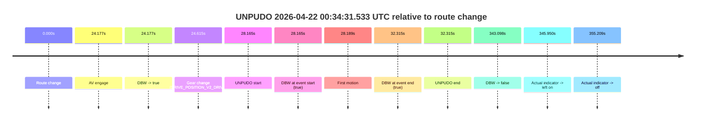
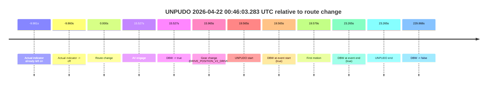
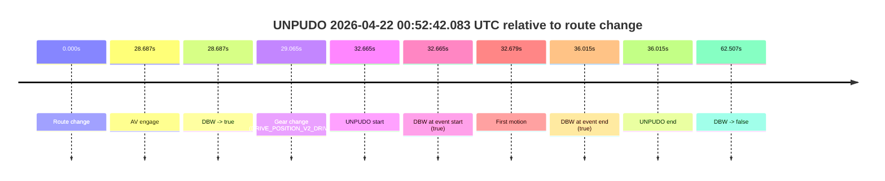
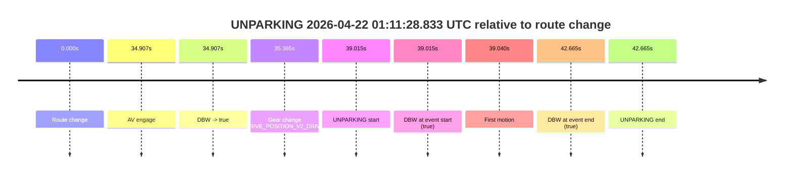

# Run Report: fme10005/2026-04-22--00-30-51--gen2-av-07e8ede4-5d86-4d2d-b996-b237030174f8

| Field | Value |
|---|---|
| Run ID | `fme10005/2026-04-22--00-30-51--gen2-av-07e8ede4-5d86-4d2d-b996-b237030174f8` |
| Date | `2026-04-22` |
| Model(s) | `eel-teal-outspoken` |
| Author | `zak` |
| Event count | `4` |

## unpudo 2026-04-22 00:34:31.533 UTC

| Field | Value |
|---|---|
| Model | `eel-teal-outspoken` |
| Author | `zak` |
| Run ID | `fme10005/2026-04-22--00-30-51--gen2-av-07e8ede4-5d86-4d2d-b996-b237030174f8` |
| Date | `2026-04-22` |
| Time (UTC) | `00:34:31.533` |
| Event type | `unpudo` |
| Disengagement type | `none observed` |
| Route change | `found` |
| Console | [run](https://console.sso.wayve.ai/run/fme10005/2026-04-22--00-30-51--gen2-av-07e8ede4-5d86-4d2d-b996-b237030174f8?id=&time-unixus=1776818071533304) |
| Foxglove | [segment](https://app.foxglove.dev/wayve-on-prem/p/prj_0dX18KZdVHg1fmmI/view?ds=foxglove-stream&ds.deviceName=fme10005&ds.start=2026-04-22T00%3A33%3A53.368315Z&ds.end=2026-04-22T00%3A39%3A56.466595Z&layoutId=lay_0e7VD4WIKDQGU73Y&time=2026-04-22T00%3A34%3A31.533304Z) |

### Event card: pass

- Pass: AV owns the credited unpudo from route change through the official unpudo window, the gear state is aligned at the anchor, and the vehicle moves without driver accelerator help in AV.

| Event | Time (UTC) | Delta from route change |
|---|---:|---:|
| Route change | 2026-04-22 00:34:03.368 | `0.000s` |
| AV engage | 2026-04-22 00:34:27.545 | `24.177s` |
| DBW -> true | 2026-04-22 00:34:27.545 | `24.177s` |
| Gear change (DRIVE_POSITION_V2_DRIVE) | 2026-04-22 00:34:27.983 | `24.615s` |
| UNPUDO start | 2026-04-22 00:34:31.533 | `28.165s` |
| DBW at event start (true) | 2026-04-22 00:34:31.533 | `28.165s` |
| First motion | 2026-04-22 00:34:31.557 | `28.189s` |
| DBW at event end (true) | 2026-04-22 00:34:35.683 | `32.315s` |
| UNPUDO end | 2026-04-22 00:34:35.683 | `32.315s` |
| DBW -> false | 2026-04-22 00:39:46.466 | `343.098s` |
| Actual indicator -> left on | 2026-04-22 00:39:49.317 | `345.950s` |
| Actual indicator -> off | 2026-04-22 00:39:58.577 | `355.209s` |

| Metric | Value |
|---|---|
| Outcome | `pass` |
| Effective failure type | `none` |
| Route change status | `found` |
| DBW at event start | `true` |
| DBW at event end | `true` |
| Predicted gear at AV start | `DRIVE_POSITION_V2_DRIVE` |
| Actual gear at AV start | `DRIVE_POSITION_V2_PARK` |
| Predicted gear at event start | `DRIVE_POSITION_V2_DRIVE` |
| Actual gear at event start | `DRIVE_POSITION_V2_DRIVE` |
| Planned indicator direction | `INDICATORS_STATE_V2_LEFT_ON` |
| Controller indicator direction | `INDICATORS_STATE_V2_LEFT_ON` |
| Actual indicator direction | `INDICATORS_STATE_V2_OFF` |
| Actual indicator at maneuver end | `INDICATORS_STATE_V2_OFF` |
| Driver accel help in AV | `false` |
| Driver accel help timestamp | `n/a` |
| Max accel pedal pct in AV | `0.0%` |
| Max brake pedal pct in AV | `8.0%` |
| Max speed mps in AV | `4.525` |
| Success timing baseline | `route change` |
| Route -> AV | `24.177s` |
| AV -> event start | `3.988s` |
| AV -> first motion | `4.013s` |
| Success baseline -> event start | `28.165s` |
| Success baseline -> first motion | `28.189s` |
| AV duration before disengagement | `318.921s` |
| Trajectory waypoint count | `37` |
| Driving-plan step count | `11` |

The scored portion starts from the AV-owned window, not from the pre-AV setup. Route-change search in the stopped pre-event segment was `found`, with the baseline therefore set to route change. At the event anchor the model predicts `DRIVE_POSITION_V2_DRIVE` and the actual gear is `DRIVE_POSITION_V2_DRIVE`. The effective model outcome is `pass` because `the credited unpudo stays AV-owned through the official unpudo window.`

### Resolution

| Field | Value |
|---|---|
| Final outcome | `pass` |
| Do we agree with this label? | `yes` |
| Source disengagement type | `none observed` |
| Resolved effective failure type | `none` |
| Confidence | `high` |

## unpudo 2026-04-22 00:46:03.283 UTC

| Field | Value |
|---|---|
| Model | `eel-teal-outspoken` |
| Author | `zak` |
| Run ID | `fme10005/2026-04-22--00-30-51--gen2-av-07e8ede4-5d86-4d2d-b996-b237030174f8` |
| Date | `2026-04-22` |
| Time (UTC) | `00:46:03.283` |
| Event type | `unpudo` |
| Disengagement type | `none observed` |
| Route change | `found` |
| Console | [run](https://console.sso.wayve.ai/run/fme10005/2026-04-22--00-30-51--gen2-av-07e8ede4-5d86-4d2d-b996-b237030174f8?id=&time-unixus=1776818763283294) |
| Foxglove | [segment](https://app.foxglove.dev/wayve-on-prem/p/prj_0dX18KZdVHg1fmmI/view?ds=foxglove-stream&ds.deviceName=fme10005&ds.start=2026-04-22T00%3A45%3A33.718278Z&ds.end=2026-04-22T00%3A49%3A43.586537Z&layoutId=lay_0e7VD4WIKDQGU73Y&time=2026-04-22T00%3A46%3A03.283294Z) |

### Event card: pass

- Pass: AV owns the credited unpudo from route change through the official unpudo window, the gear state is aligned at the anchor, and the vehicle moves without driver accelerator help in AV.

| Event | Time (UTC) | Delta from route change |
|---|---:|---:|
| Actual indicator already left on | 2026-04-22 00:45:33.737 | `-9.981s` |
| Actual indicator -> off | 2026-04-22 00:45:33.857 | `-9.860s` |
| Route change | 2026-04-22 00:45:43.718 | `0.000s` |
| AV engage | 2026-04-22 00:45:59.245 | `15.527s` |
| DBW -> true | 2026-04-22 00:45:59.245 | `15.527s` |
| Gear change (DRIVE_POSITION_V2_DRIVE) | 2026-04-22 00:45:59.683 | `15.965s` |
| UNPUDO start | 2026-04-22 00:46:03.283 | `19.565s` |
| DBW at event start (true) | 2026-04-22 00:46:03.283 | `19.565s` |
| First motion | 2026-04-22 00:46:03.297 | `19.579s` |
| DBW at event end (true) | 2026-04-22 00:46:06.983 | `23.265s` |
| UNPUDO end | 2026-04-22 00:46:06.983 | `23.265s` |
| DBW -> false | 2026-04-22 00:49:33.586 | `229.868s` |

| Metric | Value |
|---|---|
| Outcome | `pass` |
| Effective failure type | `none` |
| Route change status | `found` |
| DBW at event start | `true` |
| DBW at event end | `true` |
| Predicted gear at AV start | `DRIVE_POSITION_V2_DRIVE` |
| Actual gear at AV start | `DRIVE_POSITION_V2_PARK` |
| Predicted gear at event start | `DRIVE_POSITION_V2_DRIVE` |
| Actual gear at event start | `DRIVE_POSITION_V2_DRIVE` |
| Planned indicator direction | `INDICATORS_STATE_V2_LEFT_ON` |
| Controller indicator direction | `INDICATORS_STATE_V2_LEFT_ON` |
| Actual indicator direction | `INDICATORS_STATE_V2_OFF` |
| Actual indicator at maneuver end | `INDICATORS_STATE_V2_OFF` |
| Driver accel help in AV | `false` |
| Driver accel help timestamp | `n/a` |
| Max accel pedal pct in AV | `0.0%` |
| Max brake pedal pct in AV | `8.0%` |
| Max speed mps in AV | `5.350` |
| Success timing baseline | `route change` |
| Route -> AV | `15.527s` |
| AV -> event start | `4.038s` |
| AV -> first motion | `4.052s` |
| Success baseline -> event start | `19.565s` |
| Success baseline -> first motion | `19.579s` |
| AV duration before disengagement | `214.341s` |
| Trajectory waypoint count | `36` |
| Driving-plan step count | `11` |

The scored portion starts from the AV-owned window, not from the pre-AV setup. Route-change search in the stopped pre-event segment was `found`, with the baseline therefore set to route change. At the event anchor the model predicts `DRIVE_POSITION_V2_DRIVE` and the actual gear is `DRIVE_POSITION_V2_DRIVE`. The effective model outcome is `pass` because `the credited unpudo stays AV-owned through the official unpudo window.`

### Resolution

| Field | Value |
|---|---|
| Final outcome | `pass` |
| Do we agree with this label? | `yes` |
| Source disengagement type | `none observed` |
| Resolved effective failure type | `none` |
| Confidence | `high` |

## unpudo 2026-04-22 00:52:42.083 UTC

| Field | Value |
|---|---|
| Model | `eel-teal-outspoken` |
| Author | `zak` |
| Run ID | `fme10005/2026-04-22--00-30-51--gen2-av-07e8ede4-5d86-4d2d-b996-b237030174f8` |
| Date | `2026-04-22` |
| Time (UTC) | `00:52:42.083` |
| Event type | `unpudo` |
| Disengagement type | `none observed` |
| Route change | `found` |
| Console | [run](https://console.sso.wayve.ai/run/fme10005/2026-04-22--00-30-51--gen2-av-07e8ede4-5d86-4d2d-b996-b237030174f8?id=&time-unixus=1776819162083305) |
| Foxglove | [segment](https://app.foxglove.dev/wayve-on-prem/p/prj_0dX18KZdVHg1fmmI/view?ds=foxglove-stream&ds.deviceName=fme10005&ds.start=2026-04-22T00%3A51%3A59.418705Z&ds.end=2026-04-22T00%3A53%3A21.925800Z&layoutId=lay_0e7VD4WIKDQGU73Y&time=2026-04-22T00%3A52%3A42.083305Z) |

### Event card: pass

- Pass: AV owns the credited unpudo from route change through the official unpudo window, the gear state is aligned at the anchor, and the vehicle moves without driver accelerator help in AV.

| Event | Time (UTC) | Delta from route change |
|---|---:|---:|
| Route change | 2026-04-22 00:52:09.418 | `0.000s` |
| AV engage | 2026-04-22 00:52:38.105 | `28.687s` |
| DBW -> true | 2026-04-22 00:52:38.105 | `28.687s` |
| Gear change (DRIVE_POSITION_V2_DRIVE) | 2026-04-22 00:52:38.483 | `29.065s` |
| UNPUDO start | 2026-04-22 00:52:42.083 | `32.665s` |
| DBW at event start (true) | 2026-04-22 00:52:42.083 | `32.665s` |
| First motion | 2026-04-22 00:52:42.098 | `32.679s` |
| DBW at event end (true) | 2026-04-22 00:52:45.433 | `36.015s` |
| UNPUDO end | 2026-04-22 00:52:45.433 | `36.015s` |
| DBW -> false | 2026-04-22 00:53:11.925 | `62.507s` |

| Metric | Value |
|---|---|
| Outcome | `pass` |
| Effective failure type | `none` |
| Route change status | `found` |
| DBW at event start | `true` |
| DBW at event end | `true` |
| Predicted gear at AV start | `DRIVE_POSITION_V2_DRIVE` |
| Actual gear at AV start | `DRIVE_POSITION_V2_PARK` |
| Predicted gear at event start | `DRIVE_POSITION_V2_DRIVE` |
| Actual gear at event start | `DRIVE_POSITION_V2_DRIVE` |
| Planned indicator direction | `INDICATORS_STATE_V2_LEFT_ON` |
| Controller indicator direction | `INDICATORS_STATE_V2_LEFT_ON` |
| Actual indicator direction | `INDICATORS_STATE_V2_OFF` |
| Actual indicator at maneuver end | `INDICATORS_STATE_V2_OFF` |
| Driver accel help in AV | `false` |
| Driver accel help timestamp | `n/a` |
| Max accel pedal pct in AV | `0.0%` |
| Max brake pedal pct in AV | `8.0%` |
| Max speed mps in AV | `5.661` |
| Success timing baseline | `route change` |
| Route -> AV | `28.687s` |
| AV -> event start | `3.978s` |
| AV -> first motion | `3.993s` |
| Success baseline -> event start | `32.665s` |
| Success baseline -> first motion | `32.679s` |
| AV duration before disengagement | `33.820s` |
| Trajectory waypoint count | `36` |
| Driving-plan step count | `11` |

The scored portion starts from the AV-owned window, not from the pre-AV setup. Route-change search in the stopped pre-event segment was `found`, with the baseline therefore set to route change. At the event anchor the model predicts `DRIVE_POSITION_V2_DRIVE` and the actual gear is `DRIVE_POSITION_V2_DRIVE`. The effective model outcome is `pass` because `the credited unpudo stays AV-owned through the official unpudo window.`

### Resolution

| Field | Value |
|---|---|
| Final outcome | `pass` |
| Do we agree with this label? | `yes` |
| Source disengagement type | `none observed` |
| Resolved effective failure type | `none` |
| Confidence | `high` |

## unparking 2026-04-22 01:11:28.833 UTC

| Field | Value |
|---|---|
| Model | `eel-teal-outspoken` |
| Author | `zak` |
| Run ID | `fme10005/2026-04-22--00-30-51--gen2-av-07e8ede4-5d86-4d2d-b996-b237030174f8` |
| Date | `2026-04-22` |
| Time (UTC) | `01:11:28.833` |
| Event type | `unparking` |
| Disengagement type | `none observed` |
| Route change | `found` |
| Console | [run](https://console.sso.wayve.ai/run/fme10005/2026-04-22--00-30-51--gen2-av-07e8ede4-5d86-4d2d-b996-b237030174f8?id=&time-unixus=1776820288833301) |
| Foxglove | [segment](https://app.foxglove.dev/wayve-on-prem/p/prj_0dX18KZdVHg1fmmI/view?ds=foxglove-stream&ds.deviceName=fme10005&ds.start=2026-04-22T01%3A10%3A39.818276Z&ds.end=2026-04-22T01%3A11%3A42.483300Z&layoutId=lay_0e7VD4WIKDQGU73Y&time=2026-04-22T01%3A11%3A28.833301Z) |

### Event card: pass

- Pass: AV owns the credited unparking through the official event window, the gear state is aligned at the anchor, and the vehicle moves without driver accelerator help in AV.

| Event | Time (UTC) | Delta from route change |
|---|---:|---:|
| Route change | 2026-04-22 01:10:49.818 | `0.000s` |
| AV engage | 2026-04-22 01:11:24.725 | `34.907s` |
| DBW -> true | 2026-04-22 01:11:24.725 | `34.907s` |
| Gear change (DRIVE_POSITION_V2_DRIVE) | 2026-04-22 01:11:25.183 | `35.365s` |
| UNPARKING start | 2026-04-22 01:11:28.833 | `39.015s` |
| DBW at event start (true) | 2026-04-22 01:11:28.833 | `39.015s` |
| First motion | 2026-04-22 01:11:28.857 | `39.040s` |
| DBW at event end (true) | 2026-04-22 01:11:32.483 | `42.665s` |
| UNPARKING end | 2026-04-22 01:11:32.483 | `42.665s` |

| Metric | Value |
|---|---|
| Outcome | `pass` |
| Effective failure type | `none` |
| Route change status | `found` |
| DBW at event start | `true` |
| DBW at event end | `true` |
| Predicted gear at AV start | `DRIVE_POSITION_V2_DRIVE` |
| Actual gear at AV start | `DRIVE_POSITION_V2_PARK` |
| Predicted gear at event start | `DRIVE_POSITION_V2_DRIVE` |
| Actual gear at event start | `DRIVE_POSITION_V2_DRIVE` |
| Planned indicator direction | `INDICATORS_STATE_V2_LEFT_ON` |
| Controller indicator direction | `INDICATORS_STATE_V2_LEFT_ON` |
| Actual indicator direction | `INDICATORS_STATE_V2_OFF` |
| Actual indicator at maneuver end | `INDICATORS_STATE_V2_OFF` |
| Driver accel help in AV | `false` |
| Driver accel help timestamp | `n/a` |
| Max accel pedal pct in AV | `0.0%` |
| Max brake pedal pct in AV | `0.0%` |
| Max speed mps in AV | `4.150` |
| Success timing baseline | `route change` |
| Route -> AV | `34.907s` |
| AV -> event start | `4.108s` |
| AV -> first motion | `4.133s` |
| Success baseline -> event start | `39.015s` |
| Success baseline -> first motion | `39.040s` |
| AV duration before disengagement | `n/a` |
| Trajectory waypoint count | `37` |
| Driving-plan step count | `11` |

The scored portion starts from the AV-owned window, not from the pre-AV setup. Route-change search in the stopped pre-event segment was `found`, with the baseline therefore set to route change. At the event anchor the model predicts `DRIVE_POSITION_V2_DRIVE` and the actual gear is `DRIVE_POSITION_V2_DRIVE`. The effective model outcome is `pass` because `the credited maneuver stays AV-owned through the official event end.`

### Resolution

| Field | Value |
|---|---|
| Final outcome | `pass` |
| Do we agree with this label? | `yes` |
| Source disengagement type | `none observed` |
| Resolved effective failure type | `none` |
| Confidence | `high` |
