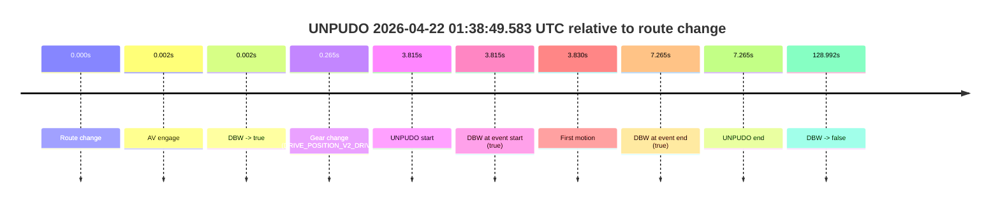
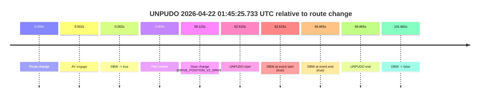

# Run Report: fme10005/2026-04-22--01-24-45--gen2-av-32770354-b80e-4c0d-ac7f-67998c6700be

| Field | Value |
|---|---|
| Run ID | `fme10005/2026-04-22--01-24-45--gen2-av-32770354-b80e-4c0d-ac7f-67998c6700be` |
| Date | `2026-04-22` |
| Model(s) | `eel-teal-outspoken` |
| Author | `zak` |
| Event count | `3` |

## unpudo 2026-04-22 01:38:49.583 UTC

| Field | Value |
|---|---|
| Model | `eel-teal-outspoken` |
| Author | `zak` |
| Run ID | `fme10005/2026-04-22--01-24-45--gen2-av-32770354-b80e-4c0d-ac7f-67998c6700be` |
| Date | `2026-04-22` |
| Time (UTC) | `01:38:49.583` |
| Event type | `unpudo` |
| Disengagement type | `none observed` |
| Route change | `found` |
| Console | [run](https://console.sso.wayve.ai/run/fme10005/2026-04-22--01-24-45--gen2-av-32770354-b80e-4c0d-ac7f-67998c6700be?id=&time-unixus=1776821929583300) |
| Foxglove | [segment](https://app.foxglove.dev/wayve-on-prem/p/prj_0dX18KZdVHg1fmmI/view?ds=foxglove-stream&ds.deviceName=fme10005&ds.start=2026-04-22T01%3A38%3A35.768258Z&ds.end=2026-04-22T01%3A41%3A04.760561Z&layoutId=lay_0e7VD4WIKDQGU73Y&time=2026-04-22T01%3A38%3A49.583300Z) |

### Event card: pass

- Pass: AV owns the credited unpudo from route change through the official unpudo window, the gear state is aligned at the anchor, and the vehicle moves without driver accelerator help in AV.

| Event | Time (UTC) | Delta from route change |
|---|---:|---:|
| Route change | 2026-04-22 01:38:45.768 | `0.000s` |
| AV engage | 2026-04-22 01:38:45.770 | `0.002s` |
| DBW -> true | 2026-04-22 01:38:45.770 | `0.002s` |
| Gear change (DRIVE_POSITION_V2_DRIVE) | 2026-04-22 01:38:46.033 | `0.265s` |
| UNPUDO start | 2026-04-22 01:38:49.583 | `3.815s` |
| DBW at event start (true) | 2026-04-22 01:38:49.583 | `3.815s` |
| First motion | 2026-04-22 01:38:49.597 | `3.830s` |
| DBW at event end (true) | 2026-04-22 01:38:53.033 | `7.265s` |
| UNPUDO end | 2026-04-22 01:38:53.033 | `7.265s` |
| DBW -> false | 2026-04-22 01:40:54.760 | `128.992s` |

| Metric | Value |
|---|---|
| Outcome | `pass` |
| Effective failure type | `none` |
| Route change status | `found` |
| DBW at event start | `true` |
| DBW at event end | `true` |
| Predicted gear at AV start | `DRIVE_POSITION_V2_PARK` |
| Actual gear at AV start | `DRIVE_POSITION_V2_PARK` |
| Predicted gear at event start | `DRIVE_POSITION_V2_DRIVE` |
| Actual gear at event start | `DRIVE_POSITION_V2_DRIVE` |
| Planned indicator direction | `INDICATORS_STATE_V2_LEFT_ON` |
| Controller indicator direction | `INDICATORS_STATE_V2_LEFT_ON` |
| Actual indicator direction | `INDICATORS_STATE_V2_OFF` |
| Actual indicator at maneuver end | `INDICATORS_STATE_V2_OFF` |
| Driver accel help in AV | `false` |
| Driver accel help timestamp | `n/a` |
| Max accel pedal pct in AV | `0.0%` |
| Max brake pedal pct in AV | `8.0%` |
| Max speed mps in AV | `5.458` |
| Success timing baseline | `route change` |
| Route -> AV | `0.002s` |
| AV -> event start | `3.813s` |
| AV -> first motion | `3.828s` |
| Success baseline -> event start | `3.815s` |
| Success baseline -> first motion | `3.830s` |
| AV duration before disengagement | `128.991s` |
| Trajectory waypoint count | `37` |
| Driving-plan step count | `11` |

The scored portion starts from the AV-owned window, not from the pre-AV setup. Route-change search in the stopped pre-event segment was `found`, with the baseline therefore set to route change. At the event anchor the model predicts `DRIVE_POSITION_V2_DRIVE` and the actual gear is `DRIVE_POSITION_V2_DRIVE`. The effective model outcome is `pass` because `the credited unpudo stays AV-owned through the official unpudo window.`

### Resolution

| Field | Value |
|---|---|
| Final outcome | `pass` |
| Do we agree with this label? | `yes` |
| Source disengagement type | `none observed` |
| Resolved effective failure type | `none` |
| Confidence | `high` |

## unpudo 2026-04-22 01:44:26.983 UTC

| Field | Value |
|---|---|
| Model | `eel-teal-outspoken` |
| Author | `zak` |
| Run ID | `fme10005/2026-04-22--01-24-45--gen2-av-32770354-b80e-4c0d-ac7f-67998c6700be` |
| Date | `2026-04-22` |
| Time (UTC) | `01:44:26.983` |
| Event type | `unpudo` |
| Disengagement type | `none observed` |
| Route change | `found` |
| Console | [run](https://console.sso.wayve.ai/run/fme10005/2026-04-22--01-24-45--gen2-av-32770354-b80e-4c0d-ac7f-67998c6700be?id=&time-unixus=1776822266983311) |
| Foxglove | [segment](https://app.foxglove.dev/wayve-on-prem/p/prj_0dX18KZdVHg1fmmI/view?ds=foxglove-stream&ds.deviceName=fme10005&ds.start=2026-04-22T01%3A44%3A13.118236Z&ds.end=2026-04-22T01%3A46%3A54.800609Z&layoutId=lay_0e7VD4WIKDQGU73Y&time=2026-04-22T01%3A44%3A26.983311Z) |

### Event card: pass

- Pass: AV owns the credited unpudo from route change through the official unpudo window, the gear state is aligned at the anchor, and the vehicle moves without driver accelerator help in AV.

| Event | Time (UTC) | Delta from route change |
|---|---:|---:|
| Route change | 2026-04-22 01:44:23.118 | `0.000s` |
| AV engage | 2026-04-22 01:44:23.119 | `0.002s` |
| DBW -> true | 2026-04-22 01:44:23.119 | `0.002s` |
| Gear change (DRIVE_POSITION_V2_DRIVE) | 2026-04-22 01:44:23.433 | `0.315s` |
| UNPUDO start | 2026-04-22 01:44:26.983 | `3.865s` |
| DBW at event start (true) | 2026-04-22 01:44:26.983 | `3.865s` |
| First motion | 2026-04-22 01:44:27.017 | `3.900s` |
| DBW at event end (true) | 2026-04-22 01:44:30.783 | `7.665s` |
| UNPUDO end | 2026-04-22 01:44:30.783 | `7.665s` |
| DBW -> false | 2026-04-22 01:46:44.800 | `141.682s` |

| Metric | Value |
|---|---|
| Outcome | `pass` |
| Effective failure type | `none` |
| Route change status | `found` |
| DBW at event start | `true` |
| DBW at event end | `true` |
| Predicted gear at AV start | `DRIVE_POSITION_V2_PARK` |
| Actual gear at AV start | `DRIVE_POSITION_V2_PARK` |
| Predicted gear at event start | `DRIVE_POSITION_V2_DRIVE` |
| Actual gear at event start | `DRIVE_POSITION_V2_DRIVE` |
| Planned indicator direction | `INDICATORS_STATE_V2_LEFT_ON` |
| Controller indicator direction | `INDICATORS_STATE_V2_LEFT_ON` |
| Actual indicator direction | `INDICATORS_STATE_V2_OFF` |
| Actual indicator at maneuver end | `INDICATORS_STATE_V2_OFF` |
| Driver accel help in AV | `false` |
| Driver accel help timestamp | `n/a` |
| Max accel pedal pct in AV | `0.0%` |
| Max brake pedal pct in AV | `8.0%` |
| Max speed mps in AV | `4.844` |
| Success timing baseline | `route change` |
| Route -> AV | `0.002s` |
| AV -> event start | `3.863s` |
| AV -> first motion | `3.898s` |
| Success baseline -> event start | `3.865s` |
| Success baseline -> first motion | `3.900s` |
| AV duration before disengagement | `141.681s` |
| Trajectory waypoint count | `37` |
| Driving-plan step count | `11` |

The scored portion starts from the AV-owned window, not from the pre-AV setup. Route-change search in the stopped pre-event segment was `found`, with the baseline therefore set to route change. At the event anchor the model predicts `DRIVE_POSITION_V2_DRIVE` and the actual gear is `DRIVE_POSITION_V2_DRIVE`. The effective model outcome is `pass` because `the credited unpudo stays AV-owned through the official unpudo window.`

### Resolution

| Field | Value |
|---|---|
| Final outcome | `pass` |
| Do we agree with this label? | `yes` |
| Source disengagement type | `none observed` |
| Resolved effective failure type | `none` |
| Confidence | `high` |

## unpudo 2026-04-22 01:45:25.733 UTC

| Field | Value |
|---|---|
| Model | `eel-teal-outspoken` |
| Author | `zak` |
| Run ID | `fme10005/2026-04-22--01-24-45--gen2-av-32770354-b80e-4c0d-ac7f-67998c6700be` |
| Date | `2026-04-22` |
| Time (UTC) | `01:45:25.733` |
| Event type | `unpudo` |
| Disengagement type | `none observed` |
| Route change | `found` |
| Console | [run](https://console.sso.wayve.ai/run/fme10005/2026-04-22--01-24-45--gen2-av-32770354-b80e-4c0d-ac7f-67998c6700be?id=&time-unixus=1776822325733295) |
| Foxglove | [segment](https://app.foxglove.dev/wayve-on-prem/p/prj_0dX18KZdVHg1fmmI/view?ds=foxglove-stream&ds.deviceName=fme10005&ds.start=2026-04-22T01%3A44%3A13.118236Z&ds.end=2026-04-22T01%3A46%3A54.800609Z&layoutId=lay_0e7VD4WIKDQGU73Y&time=2026-04-22T01%3A45%3A25.733295Z) |

### Event card: pass

- Pass: AV owns the credited unpudo from route change through the official unpudo window, the gear state is aligned at the anchor, and the vehicle moves without driver accelerator help in AV.

| Event | Time (UTC) | Delta from route change |
|---|---:|---:|
| Route change | 2026-04-22 01:44:23.118 | `0.000s` |
| AV engage | 2026-04-22 01:44:23.119 | `0.002s` |
| DBW -> true | 2026-04-22 01:44:23.119 | `0.002s` |
| First motion | 2026-04-22 01:44:27.017 | `3.900s` |
| Gear change (DRIVE_POSITION_V2_DRIVE) | 2026-04-22 01:45:22.233 | `59.115s` |
| UNPUDO start | 2026-04-22 01:45:25.733 | `62.615s` |
| DBW at event start (true) | 2026-04-22 01:45:25.733 | `62.615s` |
| DBW at event end (true) | 2026-04-22 01:45:29.983 | `66.865s` |
| UNPUDO end | 2026-04-22 01:45:29.983 | `66.865s` |
| DBW -> false | 2026-04-22 01:46:44.800 | `141.682s` |

| Metric | Value |
|---|---|
| Outcome | `pass` |
| Effective failure type | `none` |
| Route change status | `found` |
| DBW at event start | `true` |
| DBW at event end | `true` |
| Predicted gear at AV start | `DRIVE_POSITION_V2_PARK` |
| Actual gear at AV start | `DRIVE_POSITION_V2_PARK` |
| Predicted gear at event start | `DRIVE_POSITION_V2_DRIVE` |
| Actual gear at event start | `DRIVE_POSITION_V2_DRIVE` |
| Planned indicator direction | `INDICATORS_STATE_V2_LEFT_ON` |
| Controller indicator direction | `INDICATORS_STATE_V2_LEFT_ON` |
| Actual indicator direction | `INDICATORS_STATE_V2_OFF` |
| Actual indicator at maneuver end | `INDICATORS_STATE_V2_OFF` |
| Driver accel help in AV | `false` |
| Driver accel help timestamp | `n/a` |
| Max accel pedal pct in AV | `0.0%` |
| Max brake pedal pct in AV | `8.0%` |
| Max speed mps in AV | `8.653` |
| Success timing baseline | `route change` |
| Route -> AV | `0.002s` |
| AV -> event start | `62.613s` |
| AV -> first motion | `3.898s` |
| Success baseline -> event start | `62.615s` |
| Success baseline -> first motion | `3.900s` |
| AV duration before disengagement | `141.681s` |
| Trajectory waypoint count | `38` |
| Driving-plan step count | `11` |

The scored portion starts from the AV-owned window, not from the pre-AV setup. Route-change search in the stopped pre-event segment was `found`, with the baseline therefore set to route change. At the event anchor the model predicts `DRIVE_POSITION_V2_DRIVE` and the actual gear is `DRIVE_POSITION_V2_DRIVE`. The effective model outcome is `pass` because `the credited unpudo stays AV-owned through the official unpudo window.`

### Resolution

| Field | Value |
|---|---|
| Final outcome | `pass` |
| Do we agree with this label? | `yes` |
| Source disengagement type | `none observed` |
| Resolved effective failure type | `none` |
| Confidence | `high` |
