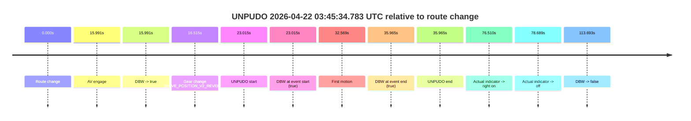
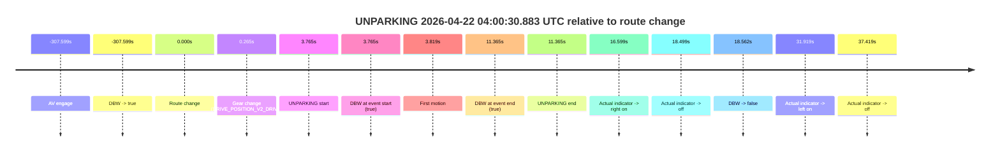
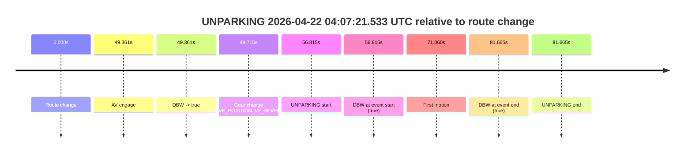

# Run Report: fme10005/2026-04-22--03-18-37--gen2-av-c000fa6a-56c9-463a-bb2a-82463ff5acf6

| Field | Value |
|---|---|
| Run ID | `fme10005/2026-04-22--03-18-37--gen2-av-c000fa6a-56c9-463a-bb2a-82463ff5acf6` |
| Date | `2026-04-22` |
| Model(s) | `eel-teal-outspoken` |
| Author | `zak` |
| Event count | `3` |

## unpudo 2026-04-22 03:45:34.783 UTC

| Field | Value |
|---|---|
| Model | `eel-teal-outspoken` |
| Author | `zak` |
| Run ID | `fme10005/2026-04-22--03-18-37--gen2-av-c000fa6a-56c9-463a-bb2a-82463ff5acf6` |
| Date | `2026-04-22` |
| Time (UTC) | `03:45:34.783` |
| Event type | `unpudo` |
| Disengagement type | `none observed` |
| Route change | `found` |
| Console | [run](https://console.sso.wayve.ai/run/fme10005/2026-04-22--03-18-37--gen2-av-c000fa6a-56c9-463a-bb2a-82463ff5acf6?id=&time-unixus=1776829534783303) |
| Foxglove | [segment](https://app.foxglove.dev/wayve-on-prem/p/prj_0dX18KZdVHg1fmmI/view?ds=foxglove-stream&ds.deviceName=fme10005&ds.start=2026-04-22T03%3A45%3A01.768326Z&ds.end=2026-04-22T03%3A47%3A15.460903Z&layoutId=lay_0e7VD4WIKDQGU73Y&time=2026-04-22T03%3A45%3A34.783303Z) |

### Event card: pass

- Pass: AV owns the credited unpudo from route change through the official unpudo window, the gear state is aligned at the anchor, and the vehicle moves without driver accelerator help in AV.

| Event | Time (UTC) | Delta from route change |
|---|---:|---:|
| Route change | 2026-04-22 03:45:11.768 | `0.000s` |
| AV engage | 2026-04-22 03:45:27.759 | `15.991s` |
| DBW -> true | 2026-04-22 03:45:27.759 | `15.991s` |
| Gear change (DRIVE_POSITION_V2_REVERSE) | 2026-04-22 03:45:28.283 | `16.515s` |
| UNPUDO start | 2026-04-22 03:45:34.783 | `23.015s` |
| DBW at event start (true) | 2026-04-22 03:45:34.783 | `23.015s` |
| First motion | 2026-04-22 03:45:44.337 | `32.569s` |
| DBW at event end (true) | 2026-04-22 03:45:47.733 | `35.965s` |
| UNPUDO end | 2026-04-22 03:45:47.733 | `35.965s` |
| Actual indicator -> right on | 2026-04-22 03:46:28.277 | `76.510s` |
| Actual indicator -> off | 2026-04-22 03:46:30.457 | `78.689s` |
| DBW -> false | 2026-04-22 03:47:05.460 | `113.693s` |

| Metric | Value |
|---|---|
| Outcome | `pass` |
| Effective failure type | `none` |
| Route change status | `found` |
| DBW at event start | `true` |
| DBW at event end | `true` |
| Predicted gear at AV start | `DRIVE_POSITION_V2_REVERSE` |
| Actual gear at AV start | `DRIVE_POSITION_V2_PARK` |
| Predicted gear at event start | `DRIVE_POSITION_V2_REVERSE` |
| Actual gear at event start | `DRIVE_POSITION_V2_REVERSE` |
| Planned indicator direction | `INDICATORS_STATE_V2_OFF` |
| Controller indicator direction | `INDICATORS_STATE_V2_OFF` |
| Actual indicator direction | `INDICATORS_STATE_V2_OFF` |
| Actual indicator at maneuver end | `INDICATORS_STATE_V2_OFF` |
| Driver accel help in AV | `false` |
| Driver accel help timestamp | `n/a` |
| Max accel pedal pct in AV | `0.0%` |
| Max brake pedal pct in AV | `25.5%` |
| Max speed mps in AV | `3.006` |
| Success timing baseline | `route change` |
| Route -> AV | `15.991s` |
| AV -> event start | `7.024s` |
| AV -> first motion | `16.578s` |
| Success baseline -> event start | `23.015s` |
| Success baseline -> first motion | `32.569s` |
| AV duration before disengagement | `97.701s` |
| Trajectory waypoint count | `37` |
| Driving-plan step count | `11` |

The scored portion starts from the AV-owned window, not from the pre-AV setup. Route-change search in the stopped pre-event segment was `found`, with the baseline therefore set to route change. At the event anchor the model predicts `DRIVE_POSITION_V2_REVERSE` and the actual gear is `DRIVE_POSITION_V2_REVERSE`. The effective model outcome is `pass` because `the credited unpudo stays AV-owned through the official unpudo window.`

### Resolution

| Field | Value |
|---|---|
| Final outcome | `pass` |
| Do we agree with this label? | `yes` |
| Source disengagement type | `none observed` |
| Resolved effective failure type | `none` |
| Confidence | `high` |

## unparking 2026-04-22 04:00:30.883 UTC

| Field | Value |
|---|---|
| Model | `eel-teal-outspoken` |
| Author | `zak` |
| Run ID | `fme10005/2026-04-22--03-18-37--gen2-av-c000fa6a-56c9-463a-bb2a-82463ff5acf6` |
| Date | `2026-04-22` |
| Time (UTC) | `04:00:30.883` |
| Event type | `unparking` |
| Disengagement type | `none observed` |
| Route change | `found` |
| Console | [run](https://console.sso.wayve.ai/run/fme10005/2026-04-22--03-18-37--gen2-av-c000fa6a-56c9-463a-bb2a-82463ff5acf6?id=&time-unixus=1776830430883313) |
| Foxglove | [segment](https://app.foxglove.dev/wayve-on-prem/p/prj_0dX18KZdVHg1fmmI/view?ds=foxglove-stream&ds.deviceName=fme10005&ds.start=2026-04-22T03%3A55%3A09.519666Z&ds.end=2026-04-22T04%3A00%3A55.680237Z&layoutId=lay_0e7VD4WIKDQGU73Y&time=2026-04-22T04%3A00%3A30.883313Z) |

### Event card: pass

- Pass: AV owns the credited unparking through the official event window, the gear state is aligned at the anchor, and the vehicle moves without driver accelerator help in AV.

| Event | Time (UTC) | Delta from route change |
|---|---:|---:|
| AV engage | 2026-04-22 03:55:19.519 | `-307.599s` |
| DBW -> true | 2026-04-22 03:55:19.519 | `-307.599s` |
| Route change | 2026-04-22 04:00:27.118 | `0.000s` |
| Gear change (DRIVE_POSITION_V2_DRIVE) | 2026-04-22 04:00:27.383 | `0.265s` |
| UNPARKING start | 2026-04-22 04:00:30.883 | `3.765s` |
| DBW at event start (true) | 2026-04-22 04:00:30.883 | `3.765s` |
| First motion | 2026-04-22 04:00:30.938 | `3.819s` |
| DBW at event end (true) | 2026-04-22 04:00:38.483 | `11.365s` |
| UNPARKING end | 2026-04-22 04:00:38.483 | `11.365s` |
| Actual indicator -> right on | 2026-04-22 04:00:43.718 | `16.599s` |
| Actual indicator -> off | 2026-04-22 04:00:45.617 | `18.499s` |
| DBW -> false | 2026-04-22 04:00:45.680 | `18.562s` |
| Actual indicator -> left on | 2026-04-22 04:00:59.037 | `31.919s` |
| Actual indicator -> off | 2026-04-22 04:01:04.537 | `37.419s` |

| Metric | Value |
|---|---|
| Outcome | `pass` |
| Effective failure type | `none` |
| Route change status | `found` |
| DBW at event start | `true` |
| DBW at event end | `true` |
| Predicted gear at AV start | `DRIVE_POSITION_V2_REVERSE` |
| Actual gear at AV start | `DRIVE_POSITION_V2_PARK` |
| Predicted gear at event start | `DRIVE_POSITION_V2_DRIVE` |
| Actual gear at event start | `DRIVE_POSITION_V2_DRIVE` |
| Planned indicator direction | `INDICATORS_STATE_V2_OFF` |
| Controller indicator direction | `INDICATORS_STATE_V2_OFF` |
| Actual indicator direction | `INDICATORS_STATE_V2_OFF` |
| Actual indicator at maneuver end | `INDICATORS_STATE_V2_OFF` |
| Driver accel help in AV | `false` |
| Driver accel help timestamp | `n/a` |
| Max accel pedal pct in AV | `0.0%` |
| Max brake pedal pct in AV | `0.0%` |
| Max speed mps in AV | `2.536` |
| Success timing baseline | `AV start` |
| Route -> AV | `-307.599s` |
| AV -> event start | `311.364s` |
| AV -> first motion | `311.418s` |
| Success baseline -> event start | `311.364s` |
| Success baseline -> first motion | `311.418s` |
| AV duration before disengagement | `326.161s` |
| Trajectory waypoint count | `37` |
| Driving-plan step count | `11` |

The scored portion starts from the AV-owned window, not from the pre-AV setup. Route-change search in the stopped pre-event segment was `found`, with the baseline therefore set to route change. At the event anchor the model predicts `DRIVE_POSITION_V2_DRIVE` and the actual gear is `DRIVE_POSITION_V2_DRIVE`. The effective model outcome is `pass` because `the credited maneuver stays AV-owned through the official event end.`

### Resolution

| Field | Value |
|---|---|
| Final outcome | `pass` |
| Do we agree with this label? | `yes` |
| Source disengagement type | `none observed` |
| Resolved effective failure type | `none` |
| Confidence | `high` |

## unparking 2026-04-22 04:07:21.533 UTC

| Field | Value |
|---|---|
| Model | `eel-teal-outspoken` |
| Author | `zak` |
| Run ID | `fme10005/2026-04-22--03-18-37--gen2-av-c000fa6a-56c9-463a-bb2a-82463ff5acf6` |
| Date | `2026-04-22` |
| Time (UTC) | `04:07:21.533` |
| Event type | `unparking` |
| Disengagement type | `none observed` |
| Route change | `found` |
| Console | [run](https://console.sso.wayve.ai/run/fme10005/2026-04-22--03-18-37--gen2-av-c000fa6a-56c9-463a-bb2a-82463ff5acf6?id=&time-unixus=1776830841533300) |
| Foxglove | [segment](https://app.foxglove.dev/wayve-on-prem/p/prj_0dX18KZdVHg1fmmI/view?ds=foxglove-stream&ds.deviceName=fme10005&ds.start=2026-04-22T04%3A06%3A14.718324Z&ds.end=2026-04-22T04%3A07%3A56.383303Z&layoutId=lay_0e7VD4WIKDQGU73Y&time=2026-04-22T04%3A07%3A21.533300Z) |

### Event card: pass

- Pass: AV owns the credited unparking through the official event window, the gear state is aligned at the anchor, and the vehicle moves without driver accelerator help in AV.

| Event | Time (UTC) | Delta from route change |
|---|---:|---:|
| Route change | 2026-04-22 04:06:24.718 | `0.000s` |
| AV engage | 2026-04-22 04:07:14.079 | `49.361s` |
| DBW -> true | 2026-04-22 04:07:14.079 | `49.361s` |
| Gear change (DRIVE_POSITION_V2_REVERSE) | 2026-04-22 04:07:14.433 | `49.715s` |
| UNPARKING start | 2026-04-22 04:07:21.533 | `56.815s` |
| DBW at event start (true) | 2026-04-22 04:07:21.533 | `56.815s` |
| First motion | 2026-04-22 04:07:35.778 | `71.060s` |
| DBW at event end (true) | 2026-04-22 04:07:46.383 | `81.665s` |
| UNPARKING end | 2026-04-22 04:07:46.383 | `81.665s` |

| Metric | Value |
|---|---|
| Outcome | `pass` |
| Effective failure type | `none` |
| Route change status | `found` |
| DBW at event start | `true` |
| DBW at event end | `true` |
| Predicted gear at AV start | `DRIVE_POSITION_V2_PARK` |
| Actual gear at AV start | `DRIVE_POSITION_V2_PARK` |
| Predicted gear at event start | `DRIVE_POSITION_V2_REVERSE` |
| Actual gear at event start | `DRIVE_POSITION_V2_REVERSE` |
| Planned indicator direction | `INDICATORS_STATE_V2_OFF` |
| Controller indicator direction | `INDICATORS_STATE_V2_OFF` |
| Actual indicator direction | `INDICATORS_STATE_V2_OFF` |
| Actual indicator at maneuver end | `INDICATORS_STATE_V2_OFF` |
| Driver accel help in AV | `false` |
| Driver accel help timestamp | `n/a` |
| Max accel pedal pct in AV | `0.0%` |
| Max brake pedal pct in AV | `26.8%` |
| Max speed mps in AV | `2.267` |
| Success timing baseline | `route change` |
| Route -> AV | `49.361s` |
| AV -> event start | `7.454s` |
| AV -> first motion | `21.699s` |
| Success baseline -> event start | `56.815s` |
| Success baseline -> first motion | `71.060s` |
| AV duration before disengagement | `n/a` |
| Trajectory waypoint count | `38` |
| Driving-plan step count | `11` |

The scored portion starts from the AV-owned window, not from the pre-AV setup. Route-change search in the stopped pre-event segment was `found`, with the baseline therefore set to route change. At the event anchor the model predicts `DRIVE_POSITION_V2_REVERSE` and the actual gear is `DRIVE_POSITION_V2_REVERSE`. The effective model outcome is `pass` because `the credited maneuver stays AV-owned through the official event end.`

### Resolution

| Field | Value |
|---|---|
| Final outcome | `pass` |
| Do we agree with this label? | `yes` |
| Source disengagement type | `none observed` |
| Resolved effective failure type | `none` |
| Confidence | `high` |
