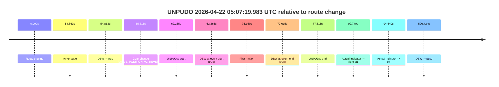
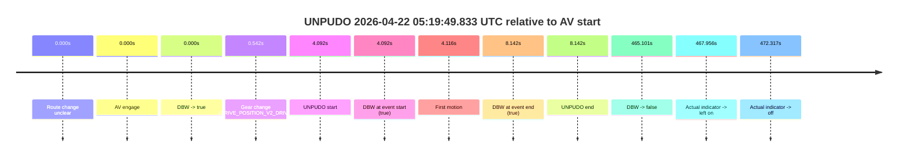
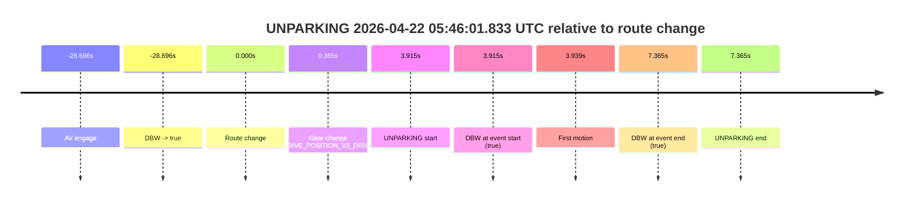

# Run Report: fme10005/2026-04-22--04-51-34--gen2-av-639e4050-282a-499c-bfd4-925e37c9aedd

| Field | Value |
|---|---|
| Run ID | `fme10005/2026-04-22--04-51-34--gen2-av-639e4050-282a-499c-bfd4-925e37c9aedd` |
| Date | `2026-04-22` |
| Model(s) | `eel-teal-outspoken` |
| Author | `zak` |
| Event count | `3` |

## unpudo 2026-04-22 05:07:19.983 UTC

| Field | Value |
|---|---|
| Model | `eel-teal-outspoken` |
| Author | `zak` |
| Run ID | `fme10005/2026-04-22--04-51-34--gen2-av-639e4050-282a-499c-bfd4-925e37c9aedd` |
| Date | `2026-04-22` |
| Time (UTC) | `05:07:19.983` |
| Event type | `unpudo` |
| Disengagement type | `none observed` |
| Route change | `found` |
| Console | [run](https://console.sso.wayve.ai/run/fme10005/2026-04-22--04-51-34--gen2-av-639e4050-282a-499c-bfd4-925e37c9aedd?id=&time-unixus=1776834439983319) |
| Foxglove | [segment](https://app.foxglove.dev/wayve-on-prem/p/prj_0dX18KZdVHg1fmmI/view?ds=foxglove-stream&ds.deviceName=fme10005&ds.start=2026-04-22T05%3A06%3A07.718230Z&ds.end=2026-04-22T05%3A14%3A54.142723Z&layoutId=lay_0e7VD4WIKDQGU73Y&time=2026-04-22T05%3A07%3A19.983319Z) |

### Event card: pass

- Pass: AV owns the credited unpudo from route change through the official unpudo window, the gear state is aligned at the anchor, and the vehicle moves without driver accelerator help in AV.

| Event | Time (UTC) | Delta from route change |
|---|---:|---:|
| Route change | 2026-04-22 05:06:17.718 | `0.000s` |
| AV engage | 2026-04-22 05:07:12.581 | `54.863s` |
| DBW -> true | 2026-04-22 05:07:12.581 | `54.863s` |
| Gear change (DRIVE_POSITION_V2_REVERSE) | 2026-04-22 05:07:13.033 | `55.315s` |
| UNPUDO start | 2026-04-22 05:07:19.983 | `62.265s` |
| DBW at event start (true) | 2026-04-22 05:07:19.983 | `62.265s` |
| First motion | 2026-04-22 05:07:32.877 | `75.160s` |
| DBW at event end (true) | 2026-04-22 05:07:35.333 | `77.615s` |
| UNPUDO end | 2026-04-22 05:07:35.333 | `77.615s` |
| Actual indicator -> right on | 2026-04-22 05:07:50.458 | `92.740s` |
| Actual indicator -> off | 2026-04-22 05:07:52.357 | `94.640s` |
| DBW -> false | 2026-04-22 05:14:44.142 | `506.424s` |

| Metric | Value |
|---|---|
| Outcome | `pass` |
| Effective failure type | `none` |
| Route change status | `found` |
| DBW at event start | `true` |
| DBW at event end | `true` |
| Predicted gear at AV start | `DRIVE_POSITION_V2_PARK` |
| Actual gear at AV start | `DRIVE_POSITION_V2_PARK` |
| Predicted gear at event start | `DRIVE_POSITION_V2_REVERSE` |
| Actual gear at event start | `DRIVE_POSITION_V2_REVERSE` |
| Planned indicator direction | `INDICATORS_STATE_V2_OFF` |
| Controller indicator direction | `INDICATORS_STATE_V2_OFF` |
| Actual indicator direction | `INDICATORS_STATE_V2_OFF` |
| Actual indicator at maneuver end | `INDICATORS_STATE_V2_OFF` |
| Driver accel help in AV | `false` |
| Driver accel help timestamp | `n/a` |
| Max accel pedal pct in AV | `0.0%` |
| Max brake pedal pct in AV | `23.0%` |
| Max speed mps in AV | `3.883` |
| Success timing baseline | `route change` |
| Route -> AV | `54.863s` |
| AV -> event start | `7.402s` |
| AV -> first motion | `20.296s` |
| Success baseline -> event start | `62.265s` |
| Success baseline -> first motion | `75.160s` |
| AV duration before disengagement | `451.561s` |
| Trajectory waypoint count | `37` |
| Driving-plan step count | `11` |

The scored portion starts from the AV-owned window, not from the pre-AV setup. Route-change search in the stopped pre-event segment was `found`, with the baseline therefore set to route change. At the event anchor the model predicts `DRIVE_POSITION_V2_REVERSE` and the actual gear is `DRIVE_POSITION_V2_REVERSE`. The effective model outcome is `pass` because `the credited unpudo stays AV-owned through the official unpudo window.`

### Resolution

| Field | Value |
|---|---|
| Final outcome | `pass` |
| Do we agree with this label? | `yes` |
| Source disengagement type | `none observed` |
| Resolved effective failure type | `none` |
| Confidence | `high` |

## unpudo 2026-04-22 05:19:49.833 UTC

| Field | Value |
|---|---|
| Model | `eel-teal-outspoken` |
| Author | `zak` |
| Run ID | `fme10005/2026-04-22--04-51-34--gen2-av-639e4050-282a-499c-bfd4-925e37c9aedd` |
| Date | `2026-04-22` |
| Time (UTC) | `05:19:49.833` |
| Event type | `unpudo` |
| Disengagement type | `none observed` |
| Route change | `unclear` |
| Console | [run](https://console.sso.wayve.ai/run/fme10005/2026-04-22--04-51-34--gen2-av-639e4050-282a-499c-bfd4-925e37c9aedd?id=&time-unixus=1776835189833302) |
| Foxglove | [segment](https://app.foxglove.dev/wayve-on-prem/p/prj_0dX18KZdVHg1fmmI/view?ds=foxglove-stream&ds.deviceName=fme10005&ds.start=2026-04-22T05%3A19%3A35.741362Z&ds.end=2026-04-22T05%3A27%3A40.842804Z&layoutId=lay_0e7VD4WIKDQGU73Y&time=2026-04-22T05%3A19%3A49.833302Z) |

### Event card: pass

- Pass: AV owns the credited unpudo from route change through the official unpudo window, the gear state is aligned at the anchor, and the vehicle moves without driver accelerator help in AV.

| Event | Time (UTC) | Delta from AV start |
|---|---:|---:|
| Route change unclear | 2026-04-22 05:19:45.741 | `0.000s` |
| AV engage | 2026-04-22 05:19:45.741 | `0.000s` |
| DBW -> true | 2026-04-22 05:19:45.741 | `0.000s` |
| Gear change (DRIVE_POSITION_V2_DRIVE) | 2026-04-22 05:19:46.283 | `0.542s` |
| UNPUDO start | 2026-04-22 05:19:49.833 | `4.092s` |
| DBW at event start (true) | 2026-04-22 05:19:49.833 | `4.092s` |
| First motion | 2026-04-22 05:19:49.857 | `4.116s` |
| DBW at event end (true) | 2026-04-22 05:19:53.883 | `8.142s` |
| UNPUDO end | 2026-04-22 05:19:53.883 | `8.142s` |
| DBW -> false | 2026-04-22 05:27:30.842 | `465.101s` |
| Actual indicator -> left on | 2026-04-22 05:27:33.697 | `467.956s` |
| Actual indicator -> off | 2026-04-22 05:27:38.057 | `472.317s` |

| Metric | Value |
|---|---|
| Outcome | `pass` |
| Effective failure type | `none` |
| Route change status | `unclear` |
| DBW at event start | `true` |
| DBW at event end | `true` |
| Predicted gear at AV start | `DRIVE_POSITION_V2_DRIVE` |
| Actual gear at AV start | `DRIVE_POSITION_V2_PARK` |
| Predicted gear at event start | `DRIVE_POSITION_V2_DRIVE` |
| Actual gear at event start | `DRIVE_POSITION_V2_DRIVE` |
| Planned indicator direction | `INDICATORS_STATE_V2_LEFT_ON` |
| Controller indicator direction | `INDICATORS_STATE_V2_LEFT_ON` |
| Actual indicator direction | `INDICATORS_STATE_V2_OFF` |
| Actual indicator at maneuver end | `INDICATORS_STATE_V2_OFF` |
| Driver accel help in AV | `false` |
| Driver accel help timestamp | `n/a` |
| Max accel pedal pct in AV | `0.0%` |
| Max brake pedal pct in AV | `8.0%` |
| Max speed mps in AV | `4.589` |
| Success timing baseline | `AV start` |
| Route -> AV | `n/a` |
| AV -> event start | `4.092s` |
| AV -> first motion | `4.116s` |
| Success baseline -> event start | `4.092s` |
| Success baseline -> first motion | `4.116s` |
| AV duration before disengagement | `465.101s` |
| Trajectory waypoint count | `38` |
| Driving-plan step count | `11` |

The scored portion starts from the AV-owned window, not from the pre-AV setup. Route-change search in the stopped pre-event segment was `unclear`, with the baseline therefore set to AV start. At the event anchor the model predicts `DRIVE_POSITION_V2_DRIVE` and the actual gear is `DRIVE_POSITION_V2_DRIVE`. The effective model outcome is `pass` because `the credited unpudo stays AV-owned through the official unpudo window.`

### Resolution

| Field | Value |
|---|---|
| Final outcome | `pass` |
| Do we agree with this label? | `yes` |
| Source disengagement type | `none observed` |
| Resolved effective failure type | `none` |
| Confidence | `medium` |

## unparking 2026-04-22 05:46:01.833 UTC

| Field | Value |
|---|---|
| Model | `eel-teal-outspoken` |
| Author | `zak` |
| Run ID | `fme10005/2026-04-22--04-51-34--gen2-av-639e4050-282a-499c-bfd4-925e37c9aedd` |
| Date | `2026-04-22` |
| Time (UTC) | `05:46:01.833` |
| Event type | `unparking` |
| Disengagement type | `none observed` |
| Route change | `found` |
| Console | [run](https://console.sso.wayve.ai/run/fme10005/2026-04-22--04-51-34--gen2-av-639e4050-282a-499c-bfd4-925e37c9aedd?id=&time-unixus=1776836761833307) |
| Foxglove | [segment](https://app.foxglove.dev/wayve-on-prem/p/prj_0dX18KZdVHg1fmmI/view?ds=foxglove-stream&ds.deviceName=fme10005&ds.start=2026-04-22T05%3A45%3A19.221899Z&ds.end=2026-04-22T05%3A46%3A15.283300Z&layoutId=lay_0e7VD4WIKDQGU73Y&time=2026-04-22T05%3A46%3A01.833307Z) |

### Event card: pass

- Pass: AV owns the credited unparking through the official event window, the gear state is aligned at the anchor, and the vehicle moves without driver accelerator help in AV.

| Event | Time (UTC) | Delta from route change |
|---|---:|---:|
| AV engage | 2026-04-22 05:45:29.221 | `-28.696s` |
| DBW -> true | 2026-04-22 05:45:29.221 | `-28.696s` |
| Route change | 2026-04-22 05:45:57.918 | `0.000s` |
| Gear change (DRIVE_POSITION_V2_DRIVE) | 2026-04-22 05:45:58.283 | `0.365s` |
| UNPARKING start | 2026-04-22 05:46:01.833 | `3.915s` |
| DBW at event start (true) | 2026-04-22 05:46:01.833 | `3.915s` |
| First motion | 2026-04-22 05:46:01.857 | `3.939s` |
| DBW at event end (true) | 2026-04-22 05:46:05.283 | `7.365s` |
| UNPARKING end | 2026-04-22 05:46:05.283 | `7.365s` |

| Metric | Value |
|---|---|
| Outcome | `pass` |
| Effective failure type | `none` |
| Route change status | `found` |
| DBW at event start | `true` |
| DBW at event end | `true` |
| Predicted gear at AV start | `DRIVE_POSITION_V2_DRIVE` |
| Actual gear at AV start | `DRIVE_POSITION_V2_DRIVE` |
| Predicted gear at event start | `DRIVE_POSITION_V2_DRIVE` |
| Actual gear at event start | `DRIVE_POSITION_V2_DRIVE` |
| Planned indicator direction | `INDICATORS_STATE_V2_LEFT_ON` |
| Controller indicator direction | `INDICATORS_STATE_V2_LEFT_ON` |
| Actual indicator direction | `INDICATORS_STATE_V2_OFF` |
| Actual indicator at maneuver end | `INDICATORS_STATE_V2_OFF` |
| Driver accel help in AV | `false` |
| Driver accel help timestamp | `n/a` |
| Max accel pedal pct in AV | `0.0%` |
| Max brake pedal pct in AV | `0.0%` |
| Max speed mps in AV | `5.153` |
| Success timing baseline | `AV start` |
| Route -> AV | `-28.696s` |
| AV -> event start | `32.611s` |
| AV -> first motion | `32.636s` |
| Success baseline -> event start | `32.611s` |
| Success baseline -> first motion | `32.636s` |
| AV duration before disengagement | `n/a` |
| Trajectory waypoint count | `38` |
| Driving-plan step count | `11` |

The scored portion starts from the AV-owned window, not from the pre-AV setup. Route-change search in the stopped pre-event segment was `found`, with the baseline therefore set to route change. At the event anchor the model predicts `DRIVE_POSITION_V2_DRIVE` and the actual gear is `DRIVE_POSITION_V2_DRIVE`. The effective model outcome is `pass` because `the credited maneuver stays AV-owned through the official event end.`

### Resolution

| Field | Value |
|---|---|
| Final outcome | `pass` |
| Do we agree with this label? | `yes` |
| Source disengagement type | `none observed` |
| Resolved effective failure type | `none` |
| Confidence | `high` |
